<style>
.t{background:#141414;border-radius:10px;box-shadow:0 12px 40px rgba(0,0,0,.45),0 0 0 1px #2a2a2a;margin:22px 0;font-family:Menlo,Monaco,Cascadia Code,Courier New,monospace;overflow:hidden}
.t-hdr{background:#252525;padding:11px 16px;display:flex;align-items:center;border-bottom:1px solid #1e1e1e}
.t-btn{width:13px;height:13px;border-radius:50%;margin-right:8px;flex-shrink:0}.t-btn.r{background:#ff5f57}.t-btn.y{background:#febc2e}.t-btn.g{background:#28c840}
.t-title{color:#888;font-size:12.5px;margin-left:10px;letter-spacing:.4px}.t-tag{margin-left:auto;background:#1e1e1e;border:1px solid #333;color:#777;font-size:10px;padding:2px 8px;border-radius:3px;letter-spacing:1px;text-transform:uppercase}
.t-body{padding:18px 20px;font-size:13px;line-height:1.65;color:#d4d4d4;overflow-x:auto}.prompt{color:#28c840}.dim{color:#777}.info{color:#8ec5fc}.warn{color:#febc2e}.err{color:#ff5f57}.accent{color:#c9a0dc}
</style>

# Python Production Doctor Report

Run ID: `20260918T073343Z`
Project: `C:\Users\trent\pan`
Started: `2026-09-18T07:33:43.578868Z`
Finished: `2026-09-18T07:33:46.250002Z`
Config hash: `ff1bdc11340bc60264536e0af3ef3174012b7a4d0f3261fc6bb4b21bf2087ab8`

<div class="t">
  <div class="t-hdr"><div class="t-btn r"></div><div class="t-btn y"></div><div class="t-btn g"></div><span class="t-title">python-production-doctor</span><span class="t-tag">DIAGNOSIS</span></div>
  <div class="t-body">
    <div><span class="prompt">doctor@somnus:~$</span> scan C:\Users\trent\pan</div>
    <div class="out info">files scanned: 57</div>
    <div class="out err">critical: 1</div>
    <div class="out warn">serious: 652</div>
    <div class="out dim">minor: 936 | info: 0</div>
    <div class="out accent">production score: 0/100</div>
  </div>
</div>

## Summary

| Metric | Value |
|---|---:|
| Files scanned | 57 |
| Total issues | 1589 |
| Critical issues | 1 |
| Serious issues | 652 |
| Minor issues | 936 |
| Syntax-error files | 1 |
| Missing imports | 28 |
| Dependency cycles | 2 |
| Suspiciously short classes | 3 |
| Suspiciously short functions | 220 |

## Issue Categories

| Category | Count |
|---|---:|
| `broad_exceptions` | 367 |
| `complexity` | 48 |
| `dependency_cycles` | 1 |
| `duplicate_definitions` | 7 |
| `missing_docstrings` | 231 |
| `missing_imports` | 28 |
| `placeholder_returns` | 1 |
| `security_risks` | 20 |
| `silent_failures` | 220 |
| `stubs` | 12 |
| `suspicious_short_classes` | 3 |
| `suspicious_short_functions` | 220 |
| `syntax_errors` | 1 |
| `todos` | 3 |
| `type_hint_gaps` | 228 |
| `unused_imports` | 199 |

## Local State Delta

| Delta | Count | Files |
|---|---:|---|
| New | 57 | .claude/hooks/highway_mesh_reminder.py, .claude/hooks/py_compile_check.py, .claude/hooks/session_start_gate_status.py, PAN_SDK/API.py, PAN_SDK/API.server.py, PAN_SDK/PAN_SDK.py, PAN_SDK/__init__.py, PAN_SDK/citizen_simulator.py, PAN_SDK/email_social.py, PAN_SDK/master_db.py, PAN_SDK/personal_data.py, PAN_SDK/treasury.py |
| Modified | 0 | none |
| Deleted | 0 | none |
| Unchanged | 0 | none |

## Dependency Map

```mermaid
graph TD
    N1[".claude/hooks/highway_mesh_reminder.py"]
    N2[".claude/hooks/py_compile_check.py"]
    N3[".claude/hooks/session_start_gate_status.py"]
    N4["PAN_SDK/API.py"]
    N5["PAN_SDK/API.server.py"]
    N6["PAN_SDK/PAN_SDK.py"]
    N7["PAN_SDK/__init__.py"]
    N8["PAN_SDK/citizen_simulator.py"]
    N9["PAN_SDK/email_social.py"]
    N10["PAN_SDK/master_db.py"]
    N11["PAN_SDK/personal_data.py"]
    N12["PAN_SDK/treasury.py"]
    N13["memory/__init__.py"]
    N14["memory/memory_core.py"]
    N15["memory/memory_integration.py"]
    N16["memory/system_cache.py"]
    N17["memory/unified_memory_system.py"]
    N18["reference-code/PAN_SDK_v2.py"]
    N19["reference-code/mtl.py"]
    N20["reference-code/unified_dag_blockchain.py"]
    N21["security/defensive_offensive_bridge.py"]
    N22["security/defensive_sovereignty.py"]
    N23["security/planetary_highway.py"]
    N24["security/planetary_immune_system.py"]
    N25["security/reactive_offense.py"]
    N26["security/sovereign_firewall.py"]
    N27["telecom/__init__.py"]
    N28["telecom/phone_integration.py"]
    N29["telecom/phone_orchestrator.py"]
    N30["telecom/vm_image_manager.py"]
    N31["telecom/vm_supervisor.py"]
    N32["test/email_social/__init__.py"]
    N33["test/email_social/test_email_social.py"]
    N34["test/highway/__init__.py"]
    N35["test/highway/test_planetary_highway.py"]
    N36["test/immune/__init__.py"]
    N37["test/immune/test_planetary_immune_system.py"]
    N38["test/inference/__init__.py"]
    N39["test/inference/test_sovereign_inference.py"]
    N40["test/master_db/__init__.py"]
    N41["test/master_db/test_master_db.py"]
    N42["test/memory_core/__init__.py"]
    N43["test/memory_core/test_memory_core.py"]
    N44["test/pan_sdk_system_scenario.py"]
    N45["test/probe_name_registry.py"]
    N46["test/probe_personal_data.py"]
    N47["test/run_pan_gate.py"]
    N48["test/test_pan_manifest.py"]
    N49["test/test_pan_persistence.py"]
    N50["test/thyris_vm/__init__.py"]
    N51["test/thyris_vm/_inspect_iso_boot.py"]
    N52["test/thyris_vm/_inspect_ramdisk.py"]
    N53["test/thyris_vm/test_thyris_android_boot.py"]
    N54["test/thyris_vm/test_thyris_vm.py"]
    N55["test/treasury/__init__.py"]
    N56["test/treasury/test_sovereign_treasury.py"]
    N57["tools/pan_viz.py"]
    N5 --> N7
    N6 --> N12
    N6 --> N10
    N7 --> N6
    N7 --> N12
    N7 --> N9
    N7 --> N10
    N8 --> N6
    N8 --> N11
    N9 --> N6
    N9 --> N26
    N10 --> N6
    N11 --> N6
    N12 --> N6
    N15 --> N14
    N16 --> N14
    N21 --> N24
    N21 --> N26
    N21 --> N22
    N21 --> N25
    N22 --> N24
    N22 --> N26
    N23 --> N6
    N23 --> N9
    N23 --> N17
    N23 --> N26
    N24 --> N6
    N24 --> N17
    N24 --> N26
    N25 --> N26
    N26 --> N6
    N28 --> N29
    N28 --> N11
    N28 --> N29
    N29 --> N30
    N29 --> N31
    N29 --> N11
    N29 --> N6
    N29 --> N14
    N29 --> N16
    N31 --> N14
    N31 --> N16
    N31 --> N30
    N33 --> N7
    N33 --> N9
    N33 --> N26
    N35 --> N7
    N35 --> N9
    N35 --> N6
    N35 --> N17
    N35 --> N23
    N35 --> N26
    N37 --> N7
    N37 --> N17
    N37 --> N21
    N37 --> N22
    N37 --> N25
    N37 --> N24
    N37 --> N26
    N39 --> N7
    N39 --> N6
    N41 --> N7
    N41 --> N10
    N43 --> N14
    N43 --> N16
    N43 --> N17
    N44 --> N7
    N44 --> N6
    N44 --> N9
    N44 --> N10
    N44 --> N11
    N44 --> N12
    N44 --> N26
    N45 --> N7
    N46 --> N7
    N46 --> N11
    N47 --> N7
    N47 --> N7
    N47 --> N8
    N48 --> N7
    N49 --> N7
    N51 --> N29
    N52 --> N29
    N53 --> N29
    N53 --> N30
    N54 --> N14
    N54 --> N16
    N54 --> N17
    N54 --> N6
    N54 --> N24
    N54 --> N29
    N54 --> N30
    N54 --> N31
    N54 --> N31
    N54 --> N29
    N56 --> N7
    N56 --> N6
    N56 --> N12
    N57 --> N7
    M1(["missing: fastapi"])
    N5 -.-> M1
    M2(["missing: fastapi.security"])
    N5 -.-> M2
    M3(["missing: fastapi.middleware.cors"])
    N5 -.-> M3
    M4(["missing: fastapi.responses"])
    N5 -.-> M4
    M5(["missing: uvicorn"])
    N5 -.-> M5
    M6(["missing: sentence_transformers"])
    N14 -.-> M6
    M7(["missing: chromadb"])
    N14 -.-> M7
    M8(["missing: chromadb.config"])
    N14 -.-> M8
    M9(["missing: sklearn.cluster"])
    N14 -.-> M9
    M10(["missing: schemas.session"])
    N15 -.-> M10
    M11(["missing: schemas.session"])
    N15 -.-> M11
    M12(["missing: defensive_sovereignty"])
    N25 -.-> M12
    M13(["missing: aiohttp"])
    N30 -.-> M13
    M14(["missing: aiohttp"])
    N30 -.-> M14
    M15(["missing: aiohttp"])
    N30 -.-> M15
    M16(["missing: aiohttp"])
    N30 -.-> M16
    M17(["missing: immune.test_planetary_immune_system"])
    N47 -.-> M17
    M18(["missing: highway.test_planetary_highway"])
    N47 -.-> M18
    M19(["missing: treasury.test_sovereign_treasury"])
    N47 -.-> M19
    M20(["missing: email_social.test_email_social"])
    N47 -.-> M20
    M21(["missing: master_db.test_master_db"])
    N47 -.-> M21
    M22(["missing: memory_core.test_memory_core"])
    N47 -.-> M22
    M23(["missing: thyris_vm.test_thyris_vm"])
    N47 -.-> M23
    M24(["missing: test_pan_persistence"])
    N47 -.-> M24
    M25(["missing: test_pan_manifest"])
    N47 -.-> M25
    M26(["missing: probe_name_registry"])
    N47 -.-> M26
    M27(["missing: probe_personal_data"])
    N47 -.-> M27
    M28(["missing: pan_sdk_system_scenario"])
    N47 -.-> M28
    C1{"cycle: PAN_SDK/PAN_SDK.py -> PAN_SDK/master_db.py"}
    C2{"cycle: PAN_SDK/PAN_SDK.py -> PAN_SDK/treasury.py"}
```



### Missing or Unresolved Imports

| Source | Line | Import | Status |
|---|---:|---|---|
| `PAN_SDK/API.server.py` | 26 | `fastapi` | not found in project index, standard library, or active environment |
| `PAN_SDK/API.server.py` | 27 | `fastapi.security` | not found in project index, standard library, or active environment |
| `PAN_SDK/API.server.py` | 28 | `fastapi.middleware.cors` | not found in project index, standard library, or active environment |
| `PAN_SDK/API.server.py` | 29 | `fastapi.responses` | not found in project index, standard library, or active environment |
| `PAN_SDK/API.server.py` | 30 | `uvicorn` | not found in project index, standard library, or active environment |
| `memory/memory_core.py` | 623 | `sentence_transformers` | not found in project index, standard library, or active environment |
| `memory/memory_core.py` | 657 | `chromadb` | not found in project index, standard library, or active environment |
| `memory/memory_core.py` | 658 | `chromadb.config` | not found in project index, standard library, or active environment |
| `memory/memory_core.py` | 1362 | `sklearn.cluster` | not found in project index, standard library, or active environment |
| `memory/memory_integration.py` | 23 | `schemas.session` | not found in project index, standard library, or active environment |
| `memory/memory_integration.py` | 24 | `schemas.session` | not found in project index, standard library, or active environment |
| `security/reactive_offense.py` | 53 | `defensive_sovereignty` | not found in project index, standard library, or active environment |
| `telecom/vm_image_manager.py` | 543 | `aiohttp` | not found in project index, standard library, or active environment |
| `telecom/vm_image_manager.py` | 706 | `aiohttp` | not found in project index, standard library, or active environment |
| `telecom/vm_image_manager.py` | 735 | `aiohttp` | not found in project index, standard library, or active environment |
| `telecom/vm_image_manager.py` | 874 | `aiohttp` | not found in project index, standard library, or active environment |
| `test/run_pan_gate.py` | 26 | `immune.test_planetary_immune_system` | not found in project index, standard library, or active environment |
| `test/run_pan_gate.py` | 27 | `highway.test_planetary_highway` | not found in project index, standard library, or active environment |
| `test/run_pan_gate.py` | 28 | `treasury.test_sovereign_treasury` | not found in project index, standard library, or active environment |
| `test/run_pan_gate.py` | 29 | `email_social.test_email_social` | not found in project index, standard library, or active environment |
| `test/run_pan_gate.py` | 30 | `master_db.test_master_db` | not found in project index, standard library, or active environment |
| `test/run_pan_gate.py` | 31 | `memory_core.test_memory_core` | not found in project index, standard library, or active environment |
| `test/run_pan_gate.py` | 32 | `thyris_vm.test_thyris_vm` | not found in project index, standard library, or active environment |
| `test/run_pan_gate.py` | 33 | `test_pan_persistence` | not found in project index, standard library, or active environment |
| `test/run_pan_gate.py` | 34 | `test_pan_manifest` | not found in project index, standard library, or active environment |
| `test/run_pan_gate.py` | 35 | `probe_name_registry` | not found in project index, standard library, or active environment |
| `test/run_pan_gate.py` | 36 | `probe_personal_data` | not found in project index, standard library, or active environment |
| `test/run_pan_gate.py` | 37 | `pan_sdk_system_scenario` | not found in project index, standard library, or active environment |

### Dependency Cycles

| Cycle |
|---|
| `PAN_SDK/PAN_SDK.py -> PAN_SDK/master_db.py` |
| `PAN_SDK/PAN_SDK.py -> PAN_SDK/treasury.py` |

## Suspiciously Short Classes

- `security/defensive_offensive_bridge.py:147` `ThreatIntelligenceCoordinator`: Class ThreatIntelligenceCoordinator is suspiciously short.
- `telecom/vm_supervisor.py:82` `VMSnapshot`: Class VMSnapshot is suspiciously short.
- `telecom/vm_supervisor.py:90` `ResourceProfile`: Class ResourceProfile is suspiciously short.

## Suspiciously Short Functions

- `PAN_SDK/API.server.py:89` `utc_now_iso`: Function utc_now_iso is suspiciously short.
- `PAN_SDK/API.server.py:92` `canonical`: Function canonical is suspiciously short.
- `PAN_SDK/API.server.py:96` `sha256_hex`: Function sha256_hex is suspiciously short.
- `PAN_SDK/API.server.py:101` `derive_uuid`: Function derive_uuid is suspiciously short.
- `PAN_SDK/API.server.py:107` `secure_random_hex`: Function secure_random_hex is suspiciously short.
- `PAN_SDK/API.server.py:128` `APIKey.is_expired`: Function APIKey.is_expired is suspiciously short.
- `PAN_SDK/API.server.py:133` `APIKey.has_scope`: Function APIKey.has_scope is suspiciously short.
- `PAN_SDK/API.server.py:136` `APIKey.can_use`: Function APIKey.can_use is suspiciously short.
- `PAN_SDK/API.server.py:142` `APIKeyManager.__init__`: Function APIKeyManager.__init__ is suspiciously short.
- `PAN_SDK/API.server.py:197` `APIKeyManager.record_usage`: Function APIKeyManager.record_usage is suspiciously short.
- `PAN_SDK/API.server.py:221` `SovereignIdentity.__init__`: Function SovereignIdentity.__init__ is suspiciously short.
- `PAN_SDK/API.server.py:229` `SovereignIdentity.update_activity`: Function SovereignIdentity.update_activity is suspiciously short.
- `PAN_SDK/API.server.py:233` `SovereignIdentity.create_hashchain_entry`: Function SovereignIdentity.create_hashchain_entry is suspiciously short.
- `PAN_SDK/API.server.py:237` `SovereignIdentity.verify_hashchain_entry`: Function SovereignIdentity.verify_hashchain_entry is suspiciously short.
- `PAN_SDK/API.server.py:263` `UnifiedDataPacket.verify_ledger_link`: Function UnifiedDataPacket.verify_ledger_link is suspiciously short.
- `PAN_SDK/API.server.py:277` `UnifiedDataPacket.from_dict`: Function UnifiedDataPacket.from_dict is suspiciously short.
- `PAN_SDK/API.server.py:332` `SovereignCommunicator.queue_packet`: Function SovereignCommunicator.queue_packet is suspiciously short.
- `PAN_SDK/API.server.py:337` `SovereignCommunicator.get_next_packet`: Function SovereignCommunicator.get_next_packet is suspiciously short.
- `PAN_SDK/API.server.py:474` `SovereignInferenceEngine.process_request`: Function SovereignInferenceEngine.process_request is suspiciously short.
- `PAN_SDK/API.server.py:596` `SovereignAPIServer.revoke_api_key`: Function SovereignAPIServer.revoke_api_key is suspiciously short.
- `PAN_SDK/API.server.py:679` `SovereignAPIServer.set_inference_engine`: Function SovereignAPIServer.set_inference_engine is suspiciously short.
- `PAN_SDK/PAN_SDK.py:72` `utc_now_iso`: Function utc_now_iso is suspiciously short.
- `PAN_SDK/PAN_SDK.py:75` `canonical`: Function canonical is suspiciously short.
- `PAN_SDK/PAN_SDK.py:79` `sha256_hex`: Function sha256_hex is suspiciously short.
- `PAN_SDK/PAN_SDK.py:84` `derive_uuid`: Function derive_uuid is suspiciously short.
- `PAN_SDK/PAN_SDK.py:134` `PANPersistenceStore.close`: Function PANPersistenceStore.close is suspiciously short.
- `PAN_SDK/PAN_SDK.py:140` `PANPersistenceStore.__del__`: Function PANPersistenceStore.__del__ is suspiciously short.
- `PAN_SDK/PAN_SDK.py:158` `PANPersistenceStore.delete_state`: Function PANPersistenceStore.delete_state is suspiciously short.
- `PAN_SDK/PAN_SDK.py:162` `PANPersistenceStore.load_component`: Function PANPersistenceStore.load_component is suspiciously short.
- `PAN_SDK/PAN_SDK.py:167` `PANPersistenceStore.read_state`: Function PANPersistenceStore.read_state is suspiciously short.
- `PAN_SDK/PAN_SDK.py:212` `PANPersistenceStore.get_name`: Function PANPersistenceStore.get_name is suspiciously short.
- `PAN_SDK/PAN_SDK.py:293` `SovereignIdentity.get_public_key_pem`: Function SovereignIdentity.get_public_key_pem is suspiciously short.
- `PAN_SDK/PAN_SDK.py:309` `SovereignIdentity.mesh_address`: Function SovereignIdentity.mesh_address is suspiciously short.
- `PAN_SDK/PAN_SDK.py:371` `SovereignIdentity.verify_hashchain_entry`: Function SovereignIdentity.verify_hashchain_entry is suspiciously short.
- `PAN_SDK/PAN_SDK.py:438` `UnifiedDataPacket.from_dict`: Function UnifiedDataPacket.from_dict is suspiciously short.
- `PAN_SDK/PAN_SDK.py:445` `UnifiedDataPacket.verify_integrity`: Function UnifiedDataPacket.verify_integrity is suspiciously short.
- `PAN_SDK/PAN_SDK.py:469` `SovereignCommunicator.__init__`: Function SovereignCommunicator.__init__ is suspiciously short.
- `PAN_SDK/PAN_SDK.py:1110` `DHTNode.get_key_hash`: Function DHTNode.get_key_hash is suspiciously short.
- `PAN_SDK/PAN_SDK.py:1250` `PANConsensus.__init__`: Function PANConsensus.__init__ is suspiciously short.
- `PAN_SDK/PAN_SDK.py:1256` `PANConsensus.add_validator`: Function PANConsensus.add_validator is suspiciously short.
- `PAN_SDK/PAN_SDK.py:1419` `PANNameRegistry.resolve_identity_names`: Function PANNameRegistry.resolve_identity_names is suspiciously short.
- `PAN_SDK/PAN_SDK.py:1587` `PANEconomicEngine.get_balance`: Function PANEconomicEngine.get_balance is suspiciously short.
- `PAN_SDK/PAN_SDK.py:1917` `PANEconomicEngine.get_account_snapshot`: Function PANEconomicEngine.get_account_snapshot is suspiciously short.
- `PAN_SDK/PAN_SDK.py:1989` `GovernanceProposal.total_participation`: Function GovernanceProposal.total_participation is suspiciously short.
- `PAN_SDK/PAN_SDK.py:2112` `PANPolicyRegistry.__init__`: Function PANPolicyRegistry.__init__ is suspiciously short.
- `PAN_SDK/PAN_SDK.py:2165` `PANPolicyRegistry.get_policy`: Function PANPolicyRegistry.get_policy is suspiciously short.
- `PAN_SDK/PAN_SDK.py:2168` `PANPolicyRegistry.list_policies`: Function PANPolicyRegistry.list_policies is suspiciously short.
- `PAN_SDK/PAN_SDK.py:2390` `PANGovernanceCouncil.list_open_proposals`: Function PANGovernanceCouncil.list_open_proposals is suspiciously short.
- `PAN_SDK/PAN_SDK.py:2393` `PANGovernanceCouncil.get_proposal`: Function PANGovernanceCouncil.get_proposal is suspiciously short.
- `PAN_SDK/PAN_SDK.py:2462` `PANCitizen.add_reputation`: Function PANCitizen.add_reputation is suspiciously short.
- `PAN_SDK/PAN_SDK.py:2467` `PANCitizen.track_resource_usage`: Function PANCitizen.track_resource_usage is suspiciously short.
- `PAN_SDK/PAN_SDK.py:2527` `PANApplication.register_user`: Function PANApplication.register_user is suspiciously short.
- `PAN_SDK/PAN_SDK.py:2620` `PANCitizenRegistry.get_citizen`: Function PANCitizenRegistry.get_citizen is suspiciously short.
- `PAN_SDK/PAN_SDK.py:2624` `PANCitizenRegistry.get_citizen_by_identity`: Function PANCitizenRegistry.get_citizen_by_identity is suspiciously short.
- `PAN_SDK/PAN_SDK.py:2704` `SovereignPipeline.__init__`: Function SovereignPipeline.__init__ is suspiciously short.
- `PAN_SDK/citizen_simulator.py:115` `PANCitizenRegistry.get_citizen_profile`: Function PANCitizenRegistry.get_citizen_profile is suspiciously short.
- `PAN_SDK/citizen_simulator.py:149` `PANCitizenRegistry.list_citizens`: Function PANCitizenRegistry.list_citizens is suspiciously short.
- `PAN_SDK/citizen_simulator.py:156` `PANCitizenRegistry.deactivate_citizen`: Function PANCitizenRegistry.deactivate_citizen is suspiciously short.
- `PAN_SDK/email_social.py:120` `EmailSocialResult.ok`: Function EmailSocialResult.ok is suspiciously short.
- `PAN_SDK/email_social.py:136` `mesh_address_for`: Function mesh_address_for is suspiciously short.
- `PAN_SDK/email_social.py:482` `EmailSocialNode.relays`: Function EmailSocialNode.relays is suspiciously short.
- `PAN_SDK/master_db.py:69` `LWWRecord.rank`: Function LWWRecord.rank is suspiciously short.
- `PAN_SDK/master_db.py:80` `GCounter.to_mapping`: Function GCounter.to_mapping is suspiciously short.
- `PAN_SDK/master_db.py:85` `GCounter.from_mapping`: Function GCounter.from_mapping is suspiciously short.
- `PAN_SDK/master_db.py:91` `GCounter.value`: Function GCounter.value is suspiciously short.
- `PAN_SDK/master_db.py:95` `GCounter.merge`: Function GCounter.merge is suspiciously short.
- `PAN_SDK/master_db.py:109` `ORSet.to_mapping`: Function ORSet.to_mapping is suspiciously short.
- `PAN_SDK/master_db.py:151` `merge_lww`: Function merge_lww is suspiciously short.
- `PAN_SDK/master_db.py:230` `MasterDatabase.put`: Function MasterDatabase.put is suspiciously short.
- `PAN_SDK/master_db.py:243` `MasterDatabase.delete`: Function MasterDatabase.delete is suspiciously short.
- `PAN_SDK/master_db.py:255` `MasterDatabase.get`: Function MasterDatabase.get is suspiciously short.
- `PAN_SDK/master_db.py:291` `MasterDatabase.counter_value`: Function MasterDatabase.counter_value is suspiciously short.
- `PAN_SDK/master_db.py:348` `MasterDatabase.members`: Function MasterDatabase.members is suspiciously short.
- `PAN_SDK/master_db.py:458` `MasterDatabase.export_bundle`: Function MasterDatabase.export_bundle is suspiciously short.
- `PAN_SDK/master_db.py:470` `MasterDatabase.merge_bundle`: Function MasterDatabase.merge_bundle is suspiciously short.
- `PAN_SDK/personal_data.py:60` `PANContact.to_dict`: Function PANContact.to_dict is suspiciously short.
- `PAN_SDK/personal_data.py:64` `PANContact.from_dict`: Function PANContact.from_dict is suspiciously short.
- `PAN_SDK/personal_data.py:84` `PANMessage.to_dict`: Function PANMessage.to_dict is suspiciously short.
- `PAN_SDK/personal_data.py:88` `PANMessage.from_dict`: Function PANMessage.from_dict is suspiciously short.
- `PAN_SDK/personal_data.py:108` `PANCallLog.to_dict`: Function PANCallLog.to_dict is suspiciously short.
- `PAN_SDK/personal_data.py:112` `PANCallLog.from_dict`: Function PANCallLog.from_dict is suspiciously short.
- `PAN_SDK/personal_data.py:130` `UserPreferences.to_dict`: Function UserPreferences.to_dict is suspiciously short.
- `PAN_SDK/personal_data.py:134` `UserPreferences.from_dict`: Function UserPreferences.from_dict is suspiciously short.
- `PAN_SDK/personal_data.py:386` `PANPersonalDataStore.get_contact`: Function PANPersonalDataStore.get_contact is suspiciously short.
- `PAN_SDK/personal_data.py:404` `PANPersonalDataStore.list_contacts`: Function PANPersonalDataStore.list_contacts is suspiciously short.
- `PAN_SDK/personal_data.py:475` `PANPersonalDataStore.receive_message`: Function PANPersonalDataStore.receive_message is suspiciously short.
- `PAN_SDK/personal_data.py:657` `PANPersonalDataStore.get_preferences`: Function PANPersonalDataStore.get_preferences is suspiciously short.
- `PAN_SDK/personal_data.py:765` `PANPhoneAddressRegistry.resolve_address`: Function PANPhoneAddressRegistry.resolve_address is suspiciously short.
- `PAN_SDK/personal_data.py:769` `PANPhoneAddressRegistry.get_address_for_sovereign`: Function PANPhoneAddressRegistry.get_address_for_sovereign is suspiciously short.
- `PAN_SDK/treasury.py:217` `TreasuryResult.ok`: Function TreasuryResult.ok is suspiciously short.
- `PAN_SDK/treasury.py:398` `SovereignTreasury.quorum_threshold`: Function SovereignTreasury.quorum_threshold is suspiciously short.
- `PAN_SDK/treasury.py:866` `inference_commitment`: Function inference_commitment is suspiciously short.
- `memory/memory_core.py:116` `SimpleLocalCollection.__init__`: Function SimpleLocalCollection.__init__ is suspiciously short.
- `memory/memory_core.py:160` `SimpleLocalCollection.get`: Function SimpleLocalCollection.get is suspiciously short.
- `memory/memory_core.py:166` `SimpleLocalCollection.delete`: Function SimpleLocalCollection.delete is suspiciously short.
- `memory/memory_core.py:209` `SimpleLocalVectorDB.get_or_create_collection`: Function SimpleLocalVectorDB.get_or_create_collection is suspiciously short.
- `memory/memory_core.py:215` `SimpleLocalVectorDB.get_collection`: Function SimpleLocalVectorDB.get_collection is suspiciously short.
- `memory/memory_core.py:220` `SimpleLocalVectorDB.list_collections`: Function SimpleLocalVectorDB.list_collections is suspiciously short.
- `memory/memory_core.py:279` `MemoryEntry.update_access`: Function MemoryEntry.update_access is suspiciously short.
- `memory/memory_core.py:556` `LocalHashEmbeddingModel.__init__`: Function LocalHashEmbeddingModel.__init__ is suspiciously short.
- `memory/memory_core.py:561` `LocalHashEmbeddingModel.encode`: Function LocalHashEmbeddingModel.encode is suspiciously short.
- `memory/memory_core.py:1073` `MemoryManager.get_memory_by_id`: Function MemoryManager.get_memory_by_id is suspiciously short.
- `memory/memory_integration.py:446` `EnhancedSessionManager.__init__`: Function EnhancedSessionManager.__init__ is suspiciously short.
- `memory/memory_integration.py:673` `EnhancedSessionManager.get_memory_context`: Function EnhancedSessionManager.get_memory_context is suspiciously short.
- `memory/system_cache.py:157` `CacheEntry.__post_init__`: Function CacheEntry.__post_init__ is suspiciously short.
- `memory/system_cache.py:175` `CacheEntry.is_expired`: Function CacheEntry.is_expired is suspiciously short.
- `memory/system_cache.py:265` `CacheMetrics.record_hit`: Function CacheMetrics.record_hit is suspiciously short.
- `memory/system_cache.py:270` `CacheMetrics.record_miss`: Function CacheMetrics.record_miss is suspiciously short.
- `memory/system_cache.py:275` `CacheMetrics.record_set`: Function CacheMetrics.record_set is suspiciously short.
- `memory/system_cache.py:279` `CacheMetrics.record_delete`: Function CacheMetrics.record_delete is suspiciously short.
- `memory/system_cache.py:283` `CacheMetrics.record_eviction`: Function CacheMetrics.record_eviction is suspiciously short.
- `memory/system_cache.py:935` `SomnusCache.total_memory_usage_mb`: Function SomnusCache.total_memory_usage_mb is suspiciously short.
- `memory/system_cache.py:1301` `SessionCacheContext.__init__`: Function SessionCacheContext.__init__ is suspiciously short.
- `memory/system_cache.py:1306` `SessionCacheContext.__enter__`: Function SessionCacheContext.__enter__ is suspiciously short.
- `memory/system_cache.py:1309` `SessionCacheContext.__exit__`: Function SessionCacheContext.__exit__ is suspiciously short.
- `memory/system_cache.py:1313` `SessionCacheContext.set`: Function SessionCacheContext.set is suspiciously short.
- `memory/system_cache.py:1317` `SessionCacheContext.get`: Function SessionCacheContext.get is suspiciously short.
- `memory/system_cache.py:1321` `SessionCacheContext.delete`: Function SessionCacheContext.delete is suspiciously short.
- `memory/system_cache.py:1325` `SessionCacheContext.clear`: Function SessionCacheContext.clear is suspiciously short.
- `memory/system_cache.py:1364` `expensive_computation`: Function expensive_computation is suspiciously short.
- `memory/unified_memory_system.py:328` `BinaryStorageManager.__init__`: Function BinaryStorageManager.__init__ is suspiciously short.
- `memory/unified_memory_system.py:1146` `CircuitBreaker.__post_init__`: Function CircuitBreaker.__post_init__ is suspiciously short.
- `memory/unified_memory_system.py:1151` `CircuitBreaker.state`: Function CircuitBreaker.state is suspiciously short.
- `reference-code/mtl.py:24` `utc_now_iso`: Function utc_now_iso is suspiciously short.
- `reference-code/mtl.py:27` `canonical`: Function canonical is suspiciously short.
- `reference-code/mtl.py:31` `sha512_hex`: Function sha512_hex is suspiciously short.
- `reference-code/mtl.py:36` `derive_uuid`: Function derive_uuid is suspiciously short.
- `reference-code/mtl.py:79` `Agent.__init__`: Function Agent.__init__ is suspiciously short.
- `reference-code/mtl.py:86` `Agent.sign`: Function Agent.sign is suspiciously short.
- `reference-code/mtl.py:553` `Lattice.anchored`: Function Lattice.anchored is suspiciously short.
- `reference-code/mtl.py:583` `make_event`: Function make_event is suspiciously short.
- `reference-code/mtl.py:587` `make_belief`: Function make_belief is suspiciously short.
- `reference-code/mtl.py:591` `make_meta`: Function make_meta is suspiciously short.
- `reference-code/mtl.py:594` `reflect`: Function reflect is suspiciously short.
- `reference-code/unified_dag_blockchain.py:56` `utc_now_iso`: Function utc_now_iso is suspiciously short.
- `reference-code/unified_dag_blockchain.py:60` `canonical`: Function canonical is suspiciously short.
- `reference-code/unified_dag_blockchain.py:65` `sha512_hex`: Function sha512_hex is suspiciously short.
- `reference-code/unified_dag_blockchain.py:103` `BinaryStorageManager.__init__`: Function BinaryStorageManager.__init__ is suspiciously short.
- `reference-code/unified_dag_blockchain.py:147` `derive_uuid`: Function derive_uuid is suspiciously short.
- `reference-code/unified_dag_blockchain.py:194` `Agent.__init__`: Function Agent.__init__ is suspiciously short.
- `reference-code/unified_dag_blockchain.py:201` `Agent.sign`: Function Agent.sign is suspiciously short.
- `reference-code/unified_dag_blockchain.py:349` `MemoryNode.record_access`: Function MemoryNode.record_access is suspiciously short.
- `reference-code/unified_dag_blockchain.py:355` `MemoryNode.to_dict`: Function MemoryNode.to_dict is suspiciously short.
- `reference-code/unified_dag_blockchain.py:360` `MemoryNode.from_dict`: Function MemoryNode.from_dict is suspiciously short.
- `reference-code/unified_dag_blockchain.py:786` `DAGLedger.anchored`: Function DAGLedger.anchored is suspiciously short.
- `reference-code/unified_dag_blockchain.py:801` `DAGLedger.get_memory_node`: Function DAGLedger.get_memory_node is suspiciously short.
- `reference-code/unified_dag_blockchain.py:1089` `compute_canonical_rosemary_hash`: Function compute_canonical_rosemary_hash is suspiciously short.
- `security/defensive_offensive_bridge.py:620` `HumanAuthorizationInterface.get_pending_authorizations`: Function HumanAuthorizationInterface.get_pending_authorizations is suspiciously short.
- `security/defensive_offensive_bridge.py:738` `DefensiveOffensiveBridge.stop_coordination`: Function DefensiveOffensiveBridge.stop_coordination is suspiciously short.
- `security/defensive_sovereignty.py:171` `APIConfigurationLoader.get_api_config`: Function APIConfigurationLoader.get_api_config is suspiciously short.
- `security/defensive_sovereignty.py:175` `APIConfigurationLoader.get_available_apis`: Function APIConfigurationLoader.get_available_apis is suspiciously short.
- `security/defensive_sovereignty.py:179` `APIConfigurationLoader.get_apis_by_category`: Function APIConfigurationLoader.get_apis_by_category is suspiciously short.
- `security/defensive_sovereignty.py:354` `ThreatDetectionProtocol.register_signature`: Function ThreatDetectionProtocol.register_signature is suspiciously short.
- `security/defensive_sovereignty.py:362` `ThreatDetectionProtocol.get_detected_threats`: Function ThreatDetectionProtocol.get_detected_threats is suspiciously short.
- `security/defensive_sovereignty.py:453` `DistributedDefenseProtocol.deactivate_agent`: Function DistributedDefenseProtocol.deactivate_agent is suspiciously short.
- `security/defensive_sovereignty.py:460` `DistributedDefenseProtocol.get_active_agents`: Function DistributedDefenseProtocol.get_active_agents is suspiciously short.
- `security/defensive_sovereignty.py:1743` `ForensicDataCollector.__init__`: Function ForensicDataCollector.__init__ is suspiciously short.
- `security/defensive_sovereignty.py:2574` `ThreatDetectionModule.register_signature`: Function ThreatDetectionModule.register_signature is suspiciously short.
- `security/defensive_sovereignty.py:2579` `ThreatDetectionModule.get_detected_threats`: Function ThreatDetectionModule.get_detected_threats is suspiciously short.
- `security/defensive_sovereignty.py:2716` `QuantumResistantCrypto.secure_hash`: Function QuantumResistantCrypto.secure_hash is suspiciously short.
- `security/defensive_sovereignty.py:3056` `DistributedDefenseModule.get_active_agents`: Function DistributedDefenseModule.get_active_agents is suspiciously short.
- `security/defensive_sovereignty.py:5169` `SovereigntyCoordinator.agent_heartbeat_loop`: Function SovereigntyCoordinator.agent_heartbeat_loop is suspiciously short.
- `security/defensive_sovereignty.py:5174` `SovereigntyCoordinator.threat_intelligence_sync`: Function SovereigntyCoordinator.threat_intelligence_sync is suspiciously short.
- `security/defensive_sovereignty.py:5179` `SovereigntyCoordinator.auto_persistence`: Function SovereigntyCoordinator.auto_persistence is suspiciously short.
- `security/defensive_sovereignty.py:5184` `SovereigntyCoordinator.runtime_security_monitoring`: Function SovereigntyCoordinator.runtime_security_monitoring is suspiciously short.
- `security/defensive_sovereignty.py:5189` `SovereigntyCoordinator.cache_maintenance`: Function SovereigntyCoordinator.cache_maintenance is suspiciously short.
- `security/defensive_sovereignty.py:6521` `SovereigntyCoordinator.register_threat_callback`: Function SovereigntyCoordinator.register_threat_callback is suspiciously short.
- `security/defensive_sovereignty.py:6525` `SovereigntyCoordinator.register_state_callback`: Function SovereigntyCoordinator.register_state_callback is suspiciously short.
- `security/defensive_sovereignty.py:6529` `SovereigntyCoordinator.register_health_callback`: Function SovereigntyCoordinator.register_health_callback is suspiciously short.
- `security/defensive_sovereignty.py:6603` `SovereigntyCoordinator.shutdown`: Function SovereigntyCoordinator.shutdown is suspiciously short.
- `security/defensive_sovereignty.py:6613` `create_defensive_sovereignty`: Function create_defensive_sovereignty is suspiciously short.
- `security/defensive_sovereignty.py:6620` `integrate_with_tree_of_thought.threat_callback`: Function integrate_with_tree_of_thought.threat_callback is suspiciously short.
- `security/defensive_sovereignty.py:6631` `integrate_with_memory_system.create_memory_snapshot`: Function integrate_with_memory_system.create_memory_snapshot is suspiciously short.
- `security/defensive_sovereignty.py:6636` `integrate_with_memory_system.restore_memory_snapshot`: Function integrate_with_memory_system.restore_memory_snapshot is suspiciously short.
- `security/planetary_highway.py:181` `TravelTicket.ok`: Function TravelTicket.ok is suspiciously short.
- `security/planetary_highway.py:275` `PlanetaryHighway.relays`: Function PlanetaryHighway.relays is suspiciously short.
- `security/planetary_immune_system.py:296` `PlanetaryImmuneSystem.register_intelligence_source`: Function PlanetaryImmuneSystem.register_intelligence_source is suspiciously short.
- `security/planetary_immune_system.py:834` `PlanetaryImmuneSystem.list_erebus_towers`: Function PlanetaryImmuneSystem.list_erebus_towers is suspiciously short.
- `security/reactive_offense.py:440` `ROEEngine.get_authorized_capabilities`: Function ROEEngine.get_authorized_capabilities is suspiciously short.
- `security/reactive_offense.py:445` `ROEEngine.get_authorized_actions`: Function ROEEngine.get_authorized_actions is suspiciously short.
- `security/reactive_offense.py:783` `TracebackHunter.__init__`: Function TracebackHunter.__init__ is suspiciously short.
- `security/reactive_offense.py:787` `TracebackHunter.map_infrastructure`: Function TracebackHunter.map_infrastructure is suspiciously short.
- `security/reactive_offense.py:1237` `Infiltrator.__init__`: Function Infiltrator.__init__ is suspiciously short.
- `security/reactive_offense.py:2078` `Neutralizer.__init__`: Function Neutralizer.__init__ is suspiciously short.
- `security/reactive_offense.py:2870` `CounterPropagation.__init__`: Function CounterPropagation.__init__ is suspiciously short.
- `security/reactive_offense.py:3121` `CounterPropagation.deploy_counter_payload`: Function CounterPropagation.deploy_counter_payload is suspiciously short.
- `security/reactive_offense.py:3129` `NetworkJammer.__init__`: Function NetworkJammer.__init__ is suspiciously short.
- `security/reactive_offense.py:3392` `ProcessTerminator.__init__`: Function ProcessTerminator.__init__ is suspiciously short.
- `security/reactive_offense.py:3780` `SandboxMirror.__init__`: Function SandboxMirror.__init__ is suspiciously short.
- `security/reactive_offense.py:3959` `ViralDefense.__init__`: Function ViralDefense.__init__ is suspiciously short.
- `security/reactive_offense.py:4279` `ViralDefense.deploy_viral_payload`: Function ViralDefense.deploy_viral_payload is suspiciously short.
- `security/reactive_offense.py:4287` `SovereigntyEnforcer.__init__`: Function SovereigntyEnforcer.__init__ is suspiciously short.
- `security/reactive_offense.py:4364` `SovereigntyEnforcer.validate_viral_deployment`: Function SovereigntyEnforcer.validate_viral_deployment is suspiciously short.
- `security/reactive_offense.py:5140` `integrate_with_defensive_sovereignty.threat_event_callback`: Function integrate_with_defensive_sovereignty.threat_event_callback is suspiciously short.
- `security/sovereign_firewall.py:151` `InspectionVerdict.blocked`: Function InspectionVerdict.blocked is suspiciously short.
- `security/sovereign_firewall.py:156` `InspectionVerdict.allowed`: Function InspectionVerdict.allowed is suspiciously short.
- `security/sovereign_firewall.py:161` `InspectionVerdict.modified`: Function InspectionVerdict.modified is suspiciously short.
- `security/sovereign_firewall.py:207` `SovereignFirewall.close`: Function SovereignFirewall.close is suspiciously short.
- `telecom/phone_integration.py:51` `APKImportRequest.__post_init__`: Function APKImportRequest.__post_init__ is suspiciously short.
- `telecom/phone_integration.py:513` `OracleBrowserPhoneManager.get_import_history`: Function OracleBrowserPhoneManager.get_import_history is suspiciously short.
- `telecom/phone_integration.py:544` `BrowserPhoneUI.__init__`: Function BrowserPhoneUI.__init__ is suspiciously short.
- `telecom/phone_orchestrator.py:714` `PhoneVMProfile.validate`: Function PhoneVMProfile.validate is suspiciously short.
- `telecom/phone_orchestrator.py:917` `ThyrisPhoneOrchestrator.initialize`: Function ThyrisPhoneOrchestrator.initialize is suspiciously short.
- `telecom/phone_orchestrator.py:2244` `ThyrisPhoneOrchestrator.acquire_leader_lock`: Function ThyrisPhoneOrchestrator.acquire_leader_lock is suspiciously short.
- `telecom/vm_image_manager.py:188` `AgentEnvironmentSetup.__init__`: Function AgentEnvironmentSetup.__init__ is suspiciously short.
- `telecom/vm_image_manager.py:1470` `create_vm_image_manager`: Function create_vm_image_manager is suspiciously short.
- `telecom/vm_supervisor.py:233` `CustomVMManager.get_vm_process`: Function CustomVMManager.get_vm_process is suspiciously short.
- `telecom/vm_supervisor.py:269` `CustomVMManager.destroy_vm`: Function CustomVMManager.destroy_vm is suspiciously short.
- `telecom/vm_supervisor.py:310` `CustomVMManager.get_vm_ip`: Function CustomVMManager.get_vm_ip is suspiciously short.
- `telecom/vm_supervisor.py:314` `CustomVMManager.apply_resources`: Function CustomVMManager.apply_resources is suspiciously short.
- `telecom/vm_supervisor.py:321` `CustomNetworkManager.__init__`: Function CustomNetworkManager.__init__ is suspiciously short.
- `telecom/vm_supervisor.py:349` `CustomNetworkManager.setup_port_forwarding`: Function CustomNetworkManager.setup_port_forwarding is suspiciously short.
- `telecom/vm_supervisor.py:358` `CustomSnapshotManager.__init__`: Function CustomSnapshotManager.__init__ is suspiciously short.
- `telecom/vm_supervisor.py:448` `SomnusVMAgentClient.__init__`: Function SomnusVMAgentClient.__init__ is suspiciously short.
- `telecom/vm_supervisor.py:464` `SomnusVMAgentClient.get_status`: Function SomnusVMAgentClient.get_status is suspiciously short.
- `telecom/vm_supervisor.py:468` `SomnusVMAgentClient.get_runtime_stats`: Function SomnusVMAgentClient.get_runtime_stats is suspiciously short.
- `telecom/vm_supervisor.py:473` `SomnusVMAgentClient.trigger_soft_reboot`: Function SomnusVMAgentClient.trigger_soft_reboot is suspiciously short.
- `telecom/vm_supervisor.py:526` `VMSupervisor.initialize`: Function VMSupervisor.initialize is suspiciously short.
- `telecom/vm_supervisor.py:560` `VMSupervisor.stop_monitoring`: Function VMSupervisor.stop_monitoring is suspiciously short.
- `tools/pan_viz.py:182` `GridVisualizer.run`: Function GridVisualizer.run is suspiciously short.

## Full Issue Index

| Severity | Category | File | Line | Symbol | Message |
|---|---|---|---:|---|---|
| minor | `missing_docstrings` | `.claude/hooks/highway_mesh_reminder.py` | 29 | `main` | Function main is missing a meaningful docstring. |
| minor | `missing_docstrings` | `.claude/hooks/py_compile_check.py` | 13 | `main` | Function main is missing a meaningful docstring. |
| serious | `security_risks` | `.claude/hooks/py_compile_check.py` | 25 | `main` | High-risk call detected: subprocess.run. |
| minor | `missing_docstrings` | `.claude/hooks/session_start_gate_status.py` | 11 | `main` | Function main is missing a meaningful docstring. |
| serious | `silent_failures` | `.claude/hooks/session_start_gate_status.py` | 20 | `main` | Exception handler can suppress failure without actionable diagnostics. |
| minor | `unused_imports` | `PAN_SDK/API.py` | 8 | `sys` | Imported name appears unused: sys. |
| minor | `unused_imports` | `PAN_SDK/API.server.py` | 15 | `Callable` | Imported name appears unused: Callable. |
| minor | `unused_imports` | `PAN_SDK/API.server.py` | 16 | `asdict` | Imported name appears unused: asdict. |
| minor | `unused_imports` | `PAN_SDK/API.server.py` | 17 | `Path` | Imported name appears unused: Path. |
| minor | `unused_imports` | `PAN_SDK/API.server.py` | 20 | `hmac` | Imported name appears unused: hmac. |
| minor | `unused_imports` | `PAN_SDK/API.server.py` | 22 | `asynccontextmanager` | Imported name appears unused: asynccontextmanager. |
| serious | `missing_imports` | `PAN_SDK/API.server.py` | 26 | `fastapi` | Import could not be resolved: fastapi. |
| minor | `unused_imports` | `PAN_SDK/API.server.py` | 26 | `Request` | Imported name appears unused: Request. |
| serious | `missing_imports` | `PAN_SDK/API.server.py` | 27 | `fastapi.security` | Import could not be resolved: fastapi.security. |
| serious | `missing_imports` | `PAN_SDK/API.server.py` | 28 | `fastapi.middleware.cors` | Import could not be resolved: fastapi.middleware.cors. |
| serious | `missing_imports` | `PAN_SDK/API.server.py` | 29 | `fastapi.responses` | Import could not be resolved: fastapi.responses. |
| minor | `unused_imports` | `PAN_SDK/API.server.py` | 29 | `JSONResponse` | Imported name appears unused: JSONResponse. |
| serious | `missing_imports` | `PAN_SDK/API.server.py` | 30 | `uvicorn` | Import could not be resolved: uvicorn. |
| minor | `unused_imports` | `PAN_SDK/API.server.py` | 33 | `hashes` | Imported name appears unused: hashes. |
| minor | `unused_imports` | `PAN_SDK/API.server.py` | 33 | `serialization` | Imported name appears unused: serialization. |
| minor | `unused_imports` | `PAN_SDK/API.server.py` | 34 | `padding` | Imported name appears unused: padding. |
| minor | `unused_imports` | `PAN_SDK/API.server.py` | 34 | `rsa` | Imported name appears unused: rsa. |
| minor | `unused_imports` | `PAN_SDK/API.server.py` | 35 | `InvalidSignature` | Imported name appears unused: InvalidSignature. |
| minor | `unused_imports` | `PAN_SDK/API.server.py` | 36 | `PBKDF2HMAC` | Imported name appears unused: PBKDF2HMAC. |
| minor | `unused_imports` | `PAN_SDK/API.server.py` | 39 | `PANPersistenceStore` | Imported name appears unused: PANPersistenceStore. |
| minor | `unused_imports` | `PAN_SDK/API.server.py` | 39 | `SovereignPipeline` | Imported name appears unused: SovereignPipeline. |
| minor | `missing_docstrings` | `PAN_SDK/API.server.py` | 65 | `PacketKind` | Class PacketKind is missing a meaningful docstring. |
| minor | `missing_docstrings` | `PAN_SDK/API.server.py` | 74 | `ConnectionType` | Class ConnectionType is missing a meaningful docstring. |
| minor | `missing_docstrings` | `PAN_SDK/API.server.py` | 79 | `APIKeyScope` | Class APIKeyScope is missing a meaningful docstring. |
| minor | `missing_docstrings` | `PAN_SDK/API.server.py` | 89 | `utc_now_iso` | Function utc_now_iso is missing a meaningful docstring. |
| minor | `suspicious_short_functions` | `PAN_SDK/API.server.py` | 89 | `utc_now_iso` | Function utc_now_iso is suspiciously short. |
| minor | `suspicious_short_functions` | `PAN_SDK/API.server.py` | 92 | `canonical` | Function canonical is suspiciously short. |
| minor | `type_hint_gaps` | `PAN_SDK/API.server.py` | 92 | `canonical` | Function canonical has incomplete type hints. |
| minor | `missing_docstrings` | `PAN_SDK/API.server.py` | 96 | `sha256_hex` | Function sha256_hex is missing a meaningful docstring. |
| minor | `suspicious_short_functions` | `PAN_SDK/API.server.py` | 96 | `sha256_hex` | Function sha256_hex is suspiciously short. |
| minor | `suspicious_short_functions` | `PAN_SDK/API.server.py` | 101 | `derive_uuid` | Function derive_uuid is suspiciously short. |
| minor | `suspicious_short_functions` | `PAN_SDK/API.server.py` | 107 | `secure_random_hex` | Function secure_random_hex is suspiciously short. |
| minor | `missing_docstrings` | `PAN_SDK/API.server.py` | 116 | `APIKey` | Class APIKey is missing a meaningful docstring. |
| minor | `missing_docstrings` | `PAN_SDK/API.server.py` | 128 | `APIKey.is_expired` | Function APIKey.is_expired is missing a meaningful docstring. |
| minor | `suspicious_short_functions` | `PAN_SDK/API.server.py` | 128 | `APIKey.is_expired` | Function APIKey.is_expired is suspiciously short. |
| minor | `missing_docstrings` | `PAN_SDK/API.server.py` | 133 | `APIKey.has_scope` | Function APIKey.has_scope is missing a meaningful docstring. |
| minor | `suspicious_short_functions` | `PAN_SDK/API.server.py` | 133 | `APIKey.has_scope` | Function APIKey.has_scope is suspiciously short. |
| minor | `missing_docstrings` | `PAN_SDK/API.server.py` | 136 | `APIKey.can_use` | Function APIKey.can_use is missing a meaningful docstring. |
| minor | `suspicious_short_functions` | `PAN_SDK/API.server.py` | 136 | `APIKey.can_use` | Function APIKey.can_use is suspiciously short. |
| minor | `missing_docstrings` | `PAN_SDK/API.server.py` | 142 | `APIKeyManager.__init__` | Function APIKeyManager.__init__ is missing a meaningful docstring. |
| minor | `suspicious_short_functions` | `PAN_SDK/API.server.py` | 142 | `APIKeyManager.__init__` | Function APIKeyManager.__init__ is suspiciously short. |
| minor | `type_hint_gaps` | `PAN_SDK/API.server.py` | 142 | `APIKeyManager.__init__` | Function APIKeyManager.__init__ has incomplete type hints. |
| minor | `suspicious_short_functions` | `PAN_SDK/API.server.py` | 197 | `APIKeyManager.record_usage` | Function APIKeyManager.record_usage is suspiciously short. |
| minor | `type_hint_gaps` | `PAN_SDK/API.server.py` | 197 | `APIKeyManager.record_usage` | Function APIKeyManager.record_usage has incomplete type hints. |
| minor | `missing_docstrings` | `PAN_SDK/API.server.py` | 221 | `SovereignIdentity.__init__` | Function SovereignIdentity.__init__ is missing a meaningful docstring. |
| minor | `suspicious_short_functions` | `PAN_SDK/API.server.py` | 221 | `SovereignIdentity.__init__` | Function SovereignIdentity.__init__ is suspiciously short. |
| minor | `type_hint_gaps` | `PAN_SDK/API.server.py` | 221 | `SovereignIdentity.__init__` | Function SovereignIdentity.__init__ has incomplete type hints. |
| minor | `suspicious_short_functions` | `PAN_SDK/API.server.py` | 229 | `SovereignIdentity.update_activity` | Function SovereignIdentity.update_activity is suspiciously short. |
| minor | `type_hint_gaps` | `PAN_SDK/API.server.py` | 229 | `SovereignIdentity.update_activity` | Function SovereignIdentity.update_activity has incomplete type hints. |
| minor | `suspicious_short_functions` | `PAN_SDK/API.server.py` | 233 | `SovereignIdentity.create_hashchain_entry` | Function SovereignIdentity.create_hashchain_entry is suspiciously short. |
| minor | `suspicious_short_functions` | `PAN_SDK/API.server.py` | 237 | `SovereignIdentity.verify_hashchain_entry` | Function SovereignIdentity.verify_hashchain_entry is suspiciously short. |
| minor | `missing_docstrings` | `PAN_SDK/API.server.py` | 255 | `UnifiedDataPacket.__post_init__` | Function UnifiedDataPacket.__post_init__ is missing a meaningful docstring. |
| minor | `type_hint_gaps` | `PAN_SDK/API.server.py` | 255 | `UnifiedDataPacket.__post_init__` | Function UnifiedDataPacket.__post_init__ has incomplete type hints. |
| minor | `suspicious_short_functions` | `PAN_SDK/API.server.py` | 263 | `UnifiedDataPacket.verify_ledger_link` | Function UnifiedDataPacket.verify_ledger_link is suspiciously short. |
| minor | `missing_docstrings` | `PAN_SDK/API.server.py` | 267 | `UnifiedDataPacket.to_dict` | Function UnifiedDataPacket.to_dict is missing a meaningful docstring. |
| minor | `missing_docstrings` | `PAN_SDK/API.server.py` | 277 | `UnifiedDataPacket.from_dict` | Function UnifiedDataPacket.from_dict is missing a meaningful docstring. |
| minor | `suspicious_short_functions` | `PAN_SDK/API.server.py` | 277 | `UnifiedDataPacket.from_dict` | Function UnifiedDataPacket.from_dict is suspiciously short. |
| minor | `missing_docstrings` | `PAN_SDK/API.server.py` | 288 | `SovereignCommunicator.__init__` | Function SovereignCommunicator.__init__ is missing a meaningful docstring. |
| minor | `type_hint_gaps` | `PAN_SDK/API.server.py` | 288 | `SovereignCommunicator.__init__` | Function SovereignCommunicator.__init__ has incomplete type hints. |
| minor | `suspicious_short_functions` | `PAN_SDK/API.server.py` | 332 | `SovereignCommunicator.queue_packet` | Function SovereignCommunicator.queue_packet is suspiciously short. |
| minor | `type_hint_gaps` | `PAN_SDK/API.server.py` | 332 | `SovereignCommunicator.queue_packet` | Function SovereignCommunicator.queue_packet has incomplete type hints. |
| minor | `suspicious_short_functions` | `PAN_SDK/API.server.py` | 337 | `SovereignCommunicator.get_next_packet` | Function SovereignCommunicator.get_next_packet is suspiciously short. |
| minor | `missing_docstrings` | `PAN_SDK/API.server.py` | 348 | `ModelManifest.__init__` | Function ModelManifest.__init__ is missing a meaningful docstring. |
| minor | `type_hint_gaps` | `PAN_SDK/API.server.py` | 348 | `ModelManifest.__init__` | Function ModelManifest.__init__ has incomplete type hints. |
| minor | `type_hint_gaps` | `PAN_SDK/API.server.py` | 363 | `ModelManifest.create` | Function ModelManifest.create has incomplete type hints. |
| minor | `missing_docstrings` | `PAN_SDK/API.server.py` | 388 | `SovereignInferenceEngine.__init__` | Function SovereignInferenceEngine.__init__ is missing a meaningful docstring. |
| minor | `type_hint_gaps` | `PAN_SDK/API.server.py` | 388 | `SovereignInferenceEngine.__init__` | Function SovereignInferenceEngine.__init__ has incomplete type hints. |
| minor | `type_hint_gaps` | `PAN_SDK/API.server.py` | 398 | `SovereignInferenceEngine.load_model` | Function SovereignInferenceEngine.load_model has incomplete type hints. |
| minor | `suspicious_short_functions` | `PAN_SDK/API.server.py` | 474 | `SovereignInferenceEngine.process_request` | Function SovereignInferenceEngine.process_request is suspiciously short. |
| minor | `missing_docstrings` | `PAN_SDK/API.server.py` | 500 | `SovereignAPIServer.__init__` | Function SovereignAPIServer.__init__ is missing a meaningful docstring. |
| minor | `type_hint_gaps` | `PAN_SDK/API.server.py` | 500 | `SovereignAPIServer.__init__` | Function SovereignAPIServer.__init__ has incomplete type hints. |
| minor | `type_hint_gaps` | `PAN_SDK/API.server.py` | 530 | `SovereignAPIServer.get_api_key` | Function SovereignAPIServer.get_api_key has incomplete type hints. |
| minor | `type_hint_gaps` | `PAN_SDK/API.server.py` | 548 | `SovereignAPIServer.require_scope` | Function SovereignAPIServer.require_scope has incomplete type hints. |
| minor | `missing_docstrings` | `PAN_SDK/API.server.py` | 550 | `SovereignAPIServer.require_scope.check_scope` | Function SovereignAPIServer.require_scope.check_scope is missing a meaningful docstring. |
| minor | `type_hint_gaps` | `PAN_SDK/API.server.py` | 550 | `SovereignAPIServer.require_scope.check_scope` | Function SovereignAPIServer.require_scope.check_scope has incomplete type hints. |
| minor | `type_hint_gaps` | `PAN_SDK/API.server.py` | 563 | `SovereignAPIServer.health_check` | Function SovereignAPIServer.health_check has incomplete type hints. |
| minor | `type_hint_gaps` | `PAN_SDK/API.server.py` | 572 | `SovereignAPIServer.create_api_key` | Function SovereignAPIServer.create_api_key has incomplete type hints. |
| minor | `suspicious_short_functions` | `PAN_SDK/API.server.py` | 596 | `SovereignAPIServer.revoke_api_key` | Function SovereignAPIServer.revoke_api_key is suspiciously short. |
| minor | `type_hint_gaps` | `PAN_SDK/API.server.py` | 596 | `SovereignAPIServer.revoke_api_key` | Function SovereignAPIServer.revoke_api_key has incomplete type hints. |
| minor | `type_hint_gaps` | `PAN_SDK/API.server.py` | 607 | `SovereignAPIServer.inference_request` | Function SovereignAPIServer.inference_request has incomplete type hints. |
| serious | `broad_exceptions` | `PAN_SDK/API.server.py` | 660 | `SovereignAPIServer.inference_request` | Broad exception handler catches Exception. |
| minor | `type_hint_gaps` | `PAN_SDK/API.server.py` | 665 | `SovereignAPIServer.system_status` | Function SovereignAPIServer.system_status has incomplete type hints. |
| minor | `suspicious_short_functions` | `PAN_SDK/API.server.py` | 679 | `SovereignAPIServer.set_inference_engine` | Function SovereignAPIServer.set_inference_engine is suspiciously short. |
| minor | `type_hint_gaps` | `PAN_SDK/API.server.py` | 679 | `SovereignAPIServer.set_inference_engine` | Function SovereignAPIServer.set_inference_engine has incomplete type hints. |
| minor | `type_hint_gaps` | `PAN_SDK/API.server.py` | 686 | `SovereignAPIServer.start` | Function SovereignAPIServer.start has incomplete type hints. |
| minor | `type_hint_gaps` | `PAN_SDK/API.server.py` | 710 | `demo_enhanced_infrastructure` | Function demo_enhanced_infrastructure has incomplete type hints. |
| serious | `dependency_cycles` | `PAN_SDK/PAN_SDK.py` | 1 | `PAN_SDK/PAN_SDK.py` | Local dependency cycle detected. |
| minor | `unused_imports` | `PAN_SDK/PAN_SDK.py` | 36 | `annotations` | Imported name appears unused: annotations. |
| minor | `missing_docstrings` | `PAN_SDK/PAN_SDK.py` | 72 | `utc_now_iso` | Function utc_now_iso is missing a meaningful docstring. |
| minor | `suspicious_short_functions` | `PAN_SDK/PAN_SDK.py` | 72 | `utc_now_iso` | Function utc_now_iso is suspiciously short. |
| minor | `suspicious_short_functions` | `PAN_SDK/PAN_SDK.py` | 75 | `canonical` | Function canonical is suspiciously short. |
| minor | `type_hint_gaps` | `PAN_SDK/PAN_SDK.py` | 75 | `canonical` | Function canonical has incomplete type hints. |
| minor | `missing_docstrings` | `PAN_SDK/PAN_SDK.py` | 79 | `sha256_hex` | Function sha256_hex is missing a meaningful docstring. |
| minor | `suspicious_short_functions` | `PAN_SDK/PAN_SDK.py` | 79 | `sha256_hex` | Function sha256_hex is suspiciously short. |
| minor | `suspicious_short_functions` | `PAN_SDK/PAN_SDK.py` | 84 | `derive_uuid` | Function derive_uuid is suspiciously short. |
| minor | `missing_docstrings` | `PAN_SDK/PAN_SDK.py` | 100 | `PANPersistenceStore.__init__` | Function PANPersistenceStore.__init__ is missing a meaningful docstring. |
| minor | `type_hint_gaps` | `PAN_SDK/PAN_SDK.py` | 100 | `PANPersistenceStore.__init__` | Function PANPersistenceStore.__init__ has incomplete type hints. |
| minor | `missing_docstrings` | `PAN_SDK/PAN_SDK.py` | 134 | `PANPersistenceStore.close` | Function PANPersistenceStore.close is missing a meaningful docstring. |
| minor | `suspicious_short_functions` | `PAN_SDK/PAN_SDK.py` | 134 | `PANPersistenceStore.close` | Function PANPersistenceStore.close is suspiciously short. |
| minor | `missing_docstrings` | `PAN_SDK/PAN_SDK.py` | 140 | `PANPersistenceStore.__del__` | Function PANPersistenceStore.__del__ is missing a meaningful docstring. |
| minor | `suspicious_short_functions` | `PAN_SDK/PAN_SDK.py` | 140 | `PANPersistenceStore.__del__` | Function PANPersistenceStore.__del__ is suspiciously short. |
| minor | `type_hint_gaps` | `PAN_SDK/PAN_SDK.py` | 140 | `PANPersistenceStore.__del__` | Function PANPersistenceStore.__del__ has incomplete type hints. |
| serious | `broad_exceptions` | `PAN_SDK/PAN_SDK.py` | 143 | `PANPersistenceStore.__del__` | Broad exception handler catches Exception. |
| serious | `silent_failures` | `PAN_SDK/PAN_SDK.py` | 143 | `PANPersistenceStore.__del__` | Exception handler can suppress failure without actionable diagnostics. |
| minor | `missing_docstrings` | `PAN_SDK/PAN_SDK.py` | 146 | `PANPersistenceStore.write_state` | Function PANPersistenceStore.write_state is missing a meaningful docstring. |
| minor | `missing_docstrings` | `PAN_SDK/PAN_SDK.py` | 158 | `PANPersistenceStore.delete_state` | Function PANPersistenceStore.delete_state is missing a meaningful docstring. |
| minor | `suspicious_short_functions` | `PAN_SDK/PAN_SDK.py` | 158 | `PANPersistenceStore.delete_state` | Function PANPersistenceStore.delete_state is suspiciously short. |
| minor | `missing_docstrings` | `PAN_SDK/PAN_SDK.py` | 162 | `PANPersistenceStore.load_component` | Function PANPersistenceStore.load_component is missing a meaningful docstring. |
| minor | `suspicious_short_functions` | `PAN_SDK/PAN_SDK.py` | 162 | `PANPersistenceStore.load_component` | Function PANPersistenceStore.load_component is suspiciously short. |
| minor | `missing_docstrings` | `PAN_SDK/PAN_SDK.py` | 167 | `PANPersistenceStore.read_state` | Function PANPersistenceStore.read_state is missing a meaningful docstring. |
| minor | `suspicious_short_functions` | `PAN_SDK/PAN_SDK.py` | 167 | `PANPersistenceStore.read_state` | Function PANPersistenceStore.read_state is suspiciously short. |
| minor | `missing_docstrings` | `PAN_SDK/PAN_SDK.py` | 173 | `PANPersistenceStore.append_journal` | Function PANPersistenceStore.append_journal is missing a meaningful docstring. |
| minor | `missing_docstrings` | `PAN_SDK/PAN_SDK.py` | 182 | `PANPersistenceStore.load_journal` | Function PANPersistenceStore.load_journal is missing a meaningful docstring. |
| minor | `suspicious_short_functions` | `PAN_SDK/PAN_SDK.py` | 212 | `PANPersistenceStore.get_name` | Function PANPersistenceStore.get_name is suspiciously short. |
| minor | `missing_docstrings` | `PAN_SDK/PAN_SDK.py` | 227 | `SovereignIdentity.__init__` | Function SovereignIdentity.__init__ is missing a meaningful docstring. |
| minor | `type_hint_gaps` | `PAN_SDK/PAN_SDK.py` | 227 | `SovereignIdentity.__init__` | Function SovereignIdentity.__init__ has incomplete type hints. |
| serious | `silent_failures` | `PAN_SDK/PAN_SDK.py` | 290 | `SovereignIdentity.verify_signature` | Exception handler can suppress failure without actionable diagnostics. |
| minor | `suspicious_short_functions` | `PAN_SDK/PAN_SDK.py` | 293 | `SovereignIdentity.get_public_key_pem` | Function SovereignIdentity.get_public_key_pem is suspiciously short. |
| minor | `suspicious_short_functions` | `PAN_SDK/PAN_SDK.py` | 309 | `SovereignIdentity.mesh_address` | Function SovereignIdentity.mesh_address is suspiciously short. |
| minor | `complexity` | `PAN_SDK/PAN_SDK.py` | 313 | `SovereignIdentity.open_sealed` | Function SovereignIdentity.open_sealed has high cyclomatic complexity. |
| minor | `suspicious_short_functions` | `PAN_SDK/PAN_SDK.py` | 371 | `SovereignIdentity.verify_hashchain_entry` | Function SovereignIdentity.verify_hashchain_entry is suspiciously short. |
| minor | `missing_docstrings` | `PAN_SDK/PAN_SDK.py` | 405 | `UnifiedDataPacket.__post_init__` | Function UnifiedDataPacket.__post_init__ is missing a meaningful docstring. |
| minor | `type_hint_gaps` | `PAN_SDK/PAN_SDK.py` | 405 | `UnifiedDataPacket.__post_init__` | Function UnifiedDataPacket.__post_init__ has incomplete type hints. |
| minor | `suspicious_short_functions` | `PAN_SDK/PAN_SDK.py` | 438 | `UnifiedDataPacket.from_dict` | Function UnifiedDataPacket.from_dict is suspiciously short. |
| minor | `suspicious_short_functions` | `PAN_SDK/PAN_SDK.py` | 445 | `UnifiedDataPacket.verify_integrity` | Function UnifiedDataPacket.verify_integrity is suspiciously short. |
| minor | `missing_docstrings` | `PAN_SDK/PAN_SDK.py` | 469 | `SovereignCommunicator.__init__` | Function SovereignCommunicator.__init__ is missing a meaningful docstring. |
| minor | `suspicious_short_functions` | `PAN_SDK/PAN_SDK.py` | 469 | `SovereignCommunicator.__init__` | Function SovereignCommunicator.__init__ is suspiciously short. |
| minor | `type_hint_gaps` | `PAN_SDK/PAN_SDK.py` | 469 | `SovereignCommunicator.__init__` | Function SovereignCommunicator.__init__ has incomplete type hints. |
| serious | `broad_exceptions` | `PAN_SDK/PAN_SDK.py` | 512 | `SovereignCommunicator.verify_packet` | Broad exception handler catches Exception. |
| serious | `silent_failures` | `PAN_SDK/PAN_SDK.py` | 512 | `SovereignCommunicator.verify_packet` | Exception handler can suppress failure without actionable diagnostics. |
| minor | `missing_docstrings` | `PAN_SDK/PAN_SDK.py` | 526 | `ModelManifest.__init__` | Function ModelManifest.__init__ is missing a meaningful docstring. |
| minor | `type_hint_gaps` | `PAN_SDK/PAN_SDK.py` | 526 | `ModelManifest.__init__` | Function ModelManifest.__init__ has incomplete type hints. |
| serious | `silent_failures` | `PAN_SDK/PAN_SDK.py` | 553 | `ModelManifest.verify_manifest` | Exception handler can suppress failure without actionable diagnostics. |
| serious | `silent_failures` | `PAN_SDK/PAN_SDK.py` | 591 | `ModelManifest.verify_manifest` | Exception handler can suppress failure without actionable diagnostics. |
| serious | `broad_exceptions` | `PAN_SDK/PAN_SDK.py` | 594 | `ModelManifest.verify_manifest` | Broad exception handler catches Exception. |
| serious | `silent_failures` | `PAN_SDK/PAN_SDK.py` | 594 | `ModelManifest.verify_manifest` | Exception handler can suppress failure without actionable diagnostics. |
| minor | `missing_docstrings` | `PAN_SDK/PAN_SDK.py` | 807 | `take_rows` | Function take_rows is missing a meaningful docstring. |
| minor | `missing_docstrings` | `PAN_SDK/PAN_SDK.py` | 839 | `SovereignInferenceEngine.__init__` | Function SovereignInferenceEngine.__init__ is missing a meaningful docstring. |
| minor | `type_hint_gaps` | `PAN_SDK/PAN_SDK.py` | 839 | `SovereignInferenceEngine.__init__` | Function SovereignInferenceEngine.__init__ has incomplete type hints. |
| minor | `missing_docstrings` | `PAN_SDK/PAN_SDK.py` | 1009 | `DHTNode.__init__` | Function DHTNode.__init__ is missing a meaningful docstring. |
| minor | `suspicious_short_functions` | `PAN_SDK/PAN_SDK.py` | 1110 | `DHTNode.get_key_hash` | Function DHTNode.get_key_hash is suspiciously short. |
| serious | `broad_exceptions` | `PAN_SDK/PAN_SDK.py` | 1173 | `DHTNode.store` | Broad exception handler catches Exception. |
| minor | `missing_docstrings` | `PAN_SDK/PAN_SDK.py` | 1250 | `PANConsensus.__init__` | Function PANConsensus.__init__ is missing a meaningful docstring. |
| minor | `suspicious_short_functions` | `PAN_SDK/PAN_SDK.py` | 1250 | `PANConsensus.__init__` | Function PANConsensus.__init__ is suspiciously short. |
| minor | `type_hint_gaps` | `PAN_SDK/PAN_SDK.py` | 1250 | `PANConsensus.__init__` | Function PANConsensus.__init__ has incomplete type hints. |
| minor | `suspicious_short_functions` | `PAN_SDK/PAN_SDK.py` | 1256 | `PANConsensus.add_validator` | Function PANConsensus.add_validator is suspiciously short. |
| minor | `missing_docstrings` | `PAN_SDK/PAN_SDK.py` | 1322 | `PANNameRegistry.__init__` | Function PANNameRegistry.__init__ is missing a meaningful docstring. |
| minor | `type_hint_gaps` | `PAN_SDK/PAN_SDK.py` | 1322 | `PANNameRegistry.__init__` | Function PANNameRegistry.__init__ has incomplete type hints. |
| minor | `suspicious_short_functions` | `PAN_SDK/PAN_SDK.py` | 1419 | `PANNameRegistry.resolve_identity_names` | Function PANNameRegistry.resolve_identity_names is suspiciously short. |
| minor | `missing_docstrings` | `PAN_SDK/PAN_SDK.py` | 1488 | `PANEconomicEngine.__init__` | Function PANEconomicEngine.__init__ is missing a meaningful docstring. |
| minor | `type_hint_gaps` | `PAN_SDK/PAN_SDK.py` | 1488 | `PANEconomicEngine.__init__` | Function PANEconomicEngine.__init__ has incomplete type hints. |
| minor | `missing_docstrings` | `PAN_SDK/PAN_SDK.py` | 1521 | `PANEconomicEngine.hydrate_from_persistence` | Function PANEconomicEngine.hydrate_from_persistence is missing a meaningful docstring. |
| minor | `suspicious_short_functions` | `PAN_SDK/PAN_SDK.py` | 1587 | `PANEconomicEngine.get_balance` | Function PANEconomicEngine.get_balance is suspiciously short. |
| minor | `complexity` | `PAN_SDK/PAN_SDK.py` | 1677 | `PANEconomicEngine.charge_service_fee` | Function PANEconomicEngine.charge_service_fee has high cyclomatic complexity. |
| minor | `complexity` | `PAN_SDK/PAN_SDK.py` | 1780 | `PANEconomicEngine.record_usage` | Function PANEconomicEngine.record_usage has high cyclomatic complexity. |
| minor | `suspicious_short_functions` | `PAN_SDK/PAN_SDK.py` | 1917 | `PANEconomicEngine.get_account_snapshot` | Function PANEconomicEngine.get_account_snapshot is suspiciously short. |
| minor | `missing_docstrings` | `PAN_SDK/PAN_SDK.py` | 1947 | `GovernanceProposal.to_dict` | Function GovernanceProposal.to_dict is missing a meaningful docstring. |
| minor | `missing_docstrings` | `PAN_SDK/PAN_SDK.py` | 1964 | `GovernanceProposal.from_dict` | Function GovernanceProposal.from_dict is missing a meaningful docstring. |
| minor | `missing_docstrings` | `PAN_SDK/PAN_SDK.py` | 1980 | `GovernanceProposal.tally` | Function GovernanceProposal.tally is missing a meaningful docstring. |
| minor | `missing_docstrings` | `PAN_SDK/PAN_SDK.py` | 1989 | `GovernanceProposal.total_participation` | Function GovernanceProposal.total_participation is missing a meaningful docstring. |
| minor | `suspicious_short_functions` | `PAN_SDK/PAN_SDK.py` | 1989 | `GovernanceProposal.total_participation` | Function GovernanceProposal.total_participation is suspiciously short. |
| minor | `missing_docstrings` | `PAN_SDK/PAN_SDK.py` | 1996 | `PANConstitution.__init__` | Function PANConstitution.__init__ is missing a meaningful docstring. |
| minor | `type_hint_gaps` | `PAN_SDK/PAN_SDK.py` | 1996 | `PANConstitution.__init__` | Function PANConstitution.__init__ has incomplete type hints. |
| minor | `missing_docstrings` | `PAN_SDK/PAN_SDK.py` | 2014 | `PANConstitution.add_article` | Function PANConstitution.add_article is missing a meaningful docstring. |
| minor | `missing_docstrings` | `PAN_SDK/PAN_SDK.py` | 2040 | `PANConstitution.register_amendment` | Function PANConstitution.register_amendment is missing a meaningful docstring. |
| minor | `missing_docstrings` | `PAN_SDK/PAN_SDK.py` | 2055 | `PANConstitution.sign_constitution` | Function PANConstitution.sign_constitution is missing a meaningful docstring. |
| minor | `missing_docstrings` | `PAN_SDK/PAN_SDK.py` | 2065 | `PANConstitution.verify_signature` | Function PANConstitution.verify_signature is missing a meaningful docstring. |
| serious | `broad_exceptions` | `PAN_SDK/PAN_SDK.py` | 2079 | `PANConstitution.verify_signature` | Broad exception handler catches Exception. |
| serious | `silent_failures` | `PAN_SDK/PAN_SDK.py` | 2079 | `PANConstitution.verify_signature` | Exception handler can suppress failure without actionable diagnostics. |
| minor | `missing_docstrings` | `PAN_SDK/PAN_SDK.py` | 2083 | `PANConstitution.to_dict` | Function PANConstitution.to_dict is missing a meaningful docstring. |
| minor | `missing_docstrings` | `PAN_SDK/PAN_SDK.py` | 2095 | `PANConstitution.from_dict` | Function PANConstitution.from_dict is missing a meaningful docstring. |
| minor | `missing_docstrings` | `PAN_SDK/PAN_SDK.py` | 2112 | `PANPolicyRegistry.__init__` | Function PANPolicyRegistry.__init__ is missing a meaningful docstring. |
| minor | `suspicious_short_functions` | `PAN_SDK/PAN_SDK.py` | 2112 | `PANPolicyRegistry.__init__` | Function PANPolicyRegistry.__init__ is suspiciously short. |
| minor | `type_hint_gaps` | `PAN_SDK/PAN_SDK.py` | 2112 | `PANPolicyRegistry.__init__` | Function PANPolicyRegistry.__init__ has incomplete type hints. |
| minor | `missing_docstrings` | `PAN_SDK/PAN_SDK.py` | 2125 | `PANPolicyRegistry.register_policy` | Function PANPolicyRegistry.register_policy is missing a meaningful docstring. |
| minor | `missing_docstrings` | `PAN_SDK/PAN_SDK.py` | 2152 | `PANPolicyRegistry.retire_policy` | Function PANPolicyRegistry.retire_policy is missing a meaningful docstring. |
| minor | `missing_docstrings` | `PAN_SDK/PAN_SDK.py` | 2165 | `PANPolicyRegistry.get_policy` | Function PANPolicyRegistry.get_policy is missing a meaningful docstring. |
| minor | `suspicious_short_functions` | `PAN_SDK/PAN_SDK.py` | 2165 | `PANPolicyRegistry.get_policy` | Function PANPolicyRegistry.get_policy is suspiciously short. |
| minor | `missing_docstrings` | `PAN_SDK/PAN_SDK.py` | 2168 | `PANPolicyRegistry.list_policies` | Function PANPolicyRegistry.list_policies is missing a meaningful docstring. |
| minor | `suspicious_short_functions` | `PAN_SDK/PAN_SDK.py` | 2168 | `PANPolicyRegistry.list_policies` | Function PANPolicyRegistry.list_policies is suspiciously short. |
| minor | `missing_docstrings` | `PAN_SDK/PAN_SDK.py` | 2179 | `PANGovernanceCouncil.__init__` | Function PANGovernanceCouncil.__init__ is missing a meaningful docstring. |
| minor | `type_hint_gaps` | `PAN_SDK/PAN_SDK.py` | 2179 | `PANGovernanceCouncil.__init__` | Function PANGovernanceCouncil.__init__ has incomplete type hints. |
| minor | `missing_docstrings` | `PAN_SDK/PAN_SDK.py` | 2195 | `PANGovernanceCouncil.hydrate_from_persistence` | Function PANGovernanceCouncil.hydrate_from_persistence is missing a meaningful docstring. |
| minor | `missing_docstrings` | `PAN_SDK/PAN_SDK.py` | 2220 | `PANGovernanceCouncil.register_member` | Function PANGovernanceCouncil.register_member is missing a meaningful docstring. |
| minor | `missing_docstrings` | `PAN_SDK/PAN_SDK.py` | 2231 | `PANGovernanceCouncil.submit_proposal` | Function PANGovernanceCouncil.submit_proposal is missing a meaningful docstring. |
| minor | `missing_docstrings` | `PAN_SDK/PAN_SDK.py` | 2279 | `PANGovernanceCouncil.cast_vote` | Function PANGovernanceCouncil.cast_vote is missing a meaningful docstring. |
| minor | `missing_docstrings` | `PAN_SDK/PAN_SDK.py` | 2313 | `PANGovernanceCouncil.finalize_proposal` | Function PANGovernanceCouncil.finalize_proposal is missing a meaningful docstring. |
| minor | `missing_docstrings` | `PAN_SDK/PAN_SDK.py` | 2390 | `PANGovernanceCouncil.list_open_proposals` | Function PANGovernanceCouncil.list_open_proposals is missing a meaningful docstring. |
| minor | `suspicious_short_functions` | `PAN_SDK/PAN_SDK.py` | 2390 | `PANGovernanceCouncil.list_open_proposals` | Function PANGovernanceCouncil.list_open_proposals is suspiciously short. |
| minor | `missing_docstrings` | `PAN_SDK/PAN_SDK.py` | 2393 | `PANGovernanceCouncil.get_proposal` | Function PANGovernanceCouncil.get_proposal is missing a meaningful docstring. |
| minor | `suspicious_short_functions` | `PAN_SDK/PAN_SDK.py` | 2393 | `PANGovernanceCouncil.get_proposal` | Function PANGovernanceCouncil.get_proposal is suspiciously short. |
| minor | `missing_docstrings` | `PAN_SDK/PAN_SDK.py` | 2402 | `PANCitizen.__init__` | Function PANCitizen.__init__ is missing a meaningful docstring. |
| minor | `type_hint_gaps` | `PAN_SDK/PAN_SDK.py` | 2402 | `PANCitizen.__init__` | Function PANCitizen.__init__ has incomplete type hints. |
| minor | `missing_docstrings` | `PAN_SDK/PAN_SDK.py` | 2427 | `PANCitizen.from_dict` | Function PANCitizen.from_dict is missing a meaningful docstring. |
| minor | `type_hint_gaps` | `PAN_SDK/PAN_SDK.py` | 2445 | `PANCitizen.add_tokens` | Function PANCitizen.add_tokens has incomplete type hints. |
| minor | `suspicious_short_functions` | `PAN_SDK/PAN_SDK.py` | 2462 | `PANCitizen.add_reputation` | Function PANCitizen.add_reputation is suspiciously short. |
| minor | `type_hint_gaps` | `PAN_SDK/PAN_SDK.py` | 2462 | `PANCitizen.add_reputation` | Function PANCitizen.add_reputation has incomplete type hints. |
| minor | `suspicious_short_functions` | `PAN_SDK/PAN_SDK.py` | 2467 | `PANCitizen.track_resource_usage` | Function PANCitizen.track_resource_usage is suspiciously short. |
| minor | `type_hint_gaps` | `PAN_SDK/PAN_SDK.py` | 2467 | `PANCitizen.track_resource_usage` | Function PANCitizen.track_resource_usage has incomplete type hints. |
| minor | `missing_docstrings` | `PAN_SDK/PAN_SDK.py` | 2495 | `PANApplication.__init__` | Function PANApplication.__init__ is missing a meaningful docstring. |
| minor | `type_hint_gaps` | `PAN_SDK/PAN_SDK.py` | 2495 | `PANApplication.__init__` | Function PANApplication.__init__ has incomplete type hints. |
| minor | `missing_docstrings` | `PAN_SDK/PAN_SDK.py` | 2511 | `PANApplication.from_dict` | Function PANApplication.from_dict is missing a meaningful docstring. |
| minor | `suspicious_short_functions` | `PAN_SDK/PAN_SDK.py` | 2527 | `PANApplication.register_user` | Function PANApplication.register_user is suspiciously short. |
| minor | `type_hint_gaps` | `PAN_SDK/PAN_SDK.py` | 2527 | `PANApplication.register_user` | Function PANApplication.register_user has incomplete type hints. |
| minor | `missing_docstrings` | `PAN_SDK/PAN_SDK.py` | 2556 | `PANCitizenRegistry.__init__` | Function PANCitizenRegistry.__init__ is missing a meaningful docstring. |
| minor | `type_hint_gaps` | `PAN_SDK/PAN_SDK.py` | 2556 | `PANCitizenRegistry.__init__` | Function PANCitizenRegistry.__init__ has incomplete type hints. |
| minor | `missing_docstrings` | `PAN_SDK/PAN_SDK.py` | 2568 | `PANCitizenRegistry.hydrate_from_persistence` | Function PANCitizenRegistry.hydrate_from_persistence is missing a meaningful docstring. |
| minor | `suspicious_short_functions` | `PAN_SDK/PAN_SDK.py` | 2620 | `PANCitizenRegistry.get_citizen` | Function PANCitizenRegistry.get_citizen is suspiciously short. |
| minor | `suspicious_short_functions` | `PAN_SDK/PAN_SDK.py` | 2624 | `PANCitizenRegistry.get_citizen_by_identity` | Function PANCitizenRegistry.get_citizen_by_identity is suspiciously short. |
| minor | `missing_docstrings` | `PAN_SDK/PAN_SDK.py` | 2704 | `SovereignPipeline.__init__` | Function SovereignPipeline.__init__ is missing a meaningful docstring. |
| minor | `suspicious_short_functions` | `PAN_SDK/PAN_SDK.py` | 2704 | `SovereignPipeline.__init__` | Function SovereignPipeline.__init__ is suspiciously short. |
| minor | `type_hint_gaps` | `PAN_SDK/PAN_SDK.py` | 2704 | `SovereignPipeline.__init__` | Function SovereignPipeline.__init__ has incomplete type hints. |
| minor | `type_hint_gaps` | `PAN_SDK/PAN_SDK.py` | 2710 | `SovereignPipeline.register_model` | Function SovereignPipeline.register_model has incomplete type hints. |
| minor | `unused_imports` | `PAN_SDK/PAN_SDK.py` | 2777 | `SovereignTreasury` | Imported name appears unused: SovereignTreasury. |
| minor | `unused_imports` | `PAN_SDK/PAN_SDK.py` | 2778 | `MasterDatabase` | Imported name appears unused: MasterDatabase. |
| minor | `missing_docstrings` | `PAN_SDK/__init__.py` | 1 | `<module>` | Module is missing a meaningful docstring. |
| minor | `unused_imports` | `PAN_SDK/__init__.py` | 5 | `SovereignTreasury` | Imported name appears unused: SovereignTreasury. |
| minor | `unused_imports` | `PAN_SDK/__init__.py` | 6 | `EmailSocialNode` | Imported name appears unused: EmailSocialNode. |
| minor | `unused_imports` | `PAN_SDK/__init__.py` | 6 | `StatelessRelay` | Imported name appears unused: StatelessRelay. |
| minor | `unused_imports` | `PAN_SDK/__init__.py` | 7 | `MasterDatabase` | Imported name appears unused: MasterDatabase. |
| minor | `unused_imports` | `PAN_SDK/citizen_simulator.py` | 9 | `json` | Imported name appears unused: json. |
| minor | `unused_imports` | `PAN_SDK/citizen_simulator.py` | 12 | `PANConsensus` | Imported name appears unused: PANConsensus. |
| minor | `unused_imports` | `PAN_SDK/citizen_simulator.py` | 12 | `PANEconomicEngine` | Imported name appears unused: PANEconomicEngine. |
| minor | `missing_docstrings` | `PAN_SDK/citizen_simulator.py` | 37 | `CitizenProfile.to_dict` | Function CitizenProfile.to_dict is missing a meaningful docstring. |
| minor | `missing_docstrings` | `PAN_SDK/citizen_simulator.py` | 53 | `CitizenProfile.from_dict` | Function CitizenProfile.from_dict is missing a meaningful docstring. |
| minor | `missing_docstrings` | `PAN_SDK/citizen_simulator.py` | 74 | `PANCitizenRegistry.__init__` | Function PANCitizenRegistry.__init__ is missing a meaningful docstring. |
| minor | `type_hint_gaps` | `PAN_SDK/citizen_simulator.py` | 74 | `PANCitizenRegistry.__init__` | Function PANCitizenRegistry.__init__ has incomplete type hints. |
| minor | `suspicious_short_functions` | `PAN_SDK/citizen_simulator.py` | 115 | `PANCitizenRegistry.get_citizen_profile` | Function PANCitizenRegistry.get_citizen_profile is suspiciously short. |
| minor | `suspicious_short_functions` | `PAN_SDK/citizen_simulator.py` | 149 | `PANCitizenRegistry.list_citizens` | Function PANCitizenRegistry.list_citizens is suspiciously short. |
| minor | `suspicious_short_functions` | `PAN_SDK/citizen_simulator.py` | 156 | `PANCitizenRegistry.deactivate_citizen` | Function PANCitizenRegistry.deactivate_citizen is suspiciously short. |
| minor | `unused_imports` | `PAN_SDK/email_social.py` | 11 | `annotations` | Imported name appears unused: annotations. |
| minor | `unused_imports` | `PAN_SDK/email_social.py` | 34 | `sha256_hex` | Imported name appears unused: sha256_hex. |
| minor | `unused_imports` | `PAN_SDK/email_social.py` | 34 | `utc_now_iso` | Imported name appears unused: utc_now_iso. |
| minor | `suspicious_short_functions` | `PAN_SDK/email_social.py` | 120 | `EmailSocialResult.ok` | Function EmailSocialResult.ok is suspiciously short. |
| minor | `suspicious_short_functions` | `PAN_SDK/email_social.py` | 136 | `mesh_address_for` | Function mesh_address_for is suspiciously short. |
| serious | `silent_failures` | `PAN_SDK/email_social.py` | 214 | `verify_overlay_packet` | Exception handler can suppress failure without actionable diagnostics. |
| serious | `silent_failures` | `PAN_SDK/email_social.py` | 246 | `<module>` | Exception handler can suppress failure without actionable diagnostics. |
| minor | `complexity` | `PAN_SDK/email_social.py` | 351 | `StatelessRelay.query` | Function StatelessRelay.query has high cyclomatic complexity. |
| minor | `suspicious_short_functions` | `PAN_SDK/email_social.py` | 482 | `EmailSocialNode.relays` | Function EmailSocialNode.relays is suspiciously short. |
| minor | `complexity` | `PAN_SDK/email_social.py` | 660 | `EmailSocialNode.fetch_mail` | Function EmailSocialNode.fetch_mail has high cyclomatic complexity. |
| minor | `unused_imports` | `PAN_SDK/master_db.py` | 11 | `annotations` | Imported name appears unused: annotations. |
| minor | `suspicious_short_functions` | `PAN_SDK/master_db.py` | 69 | `LWWRecord.rank` | Function LWWRecord.rank is suspiciously short. |
| minor | `missing_docstrings` | `PAN_SDK/master_db.py` | 80 | `GCounter.to_mapping` | Function GCounter.to_mapping is missing a meaningful docstring. |
| minor | `suspicious_short_functions` | `PAN_SDK/master_db.py` | 80 | `GCounter.to_mapping` | Function GCounter.to_mapping is suspiciously short. |
| minor | `suspicious_short_functions` | `PAN_SDK/master_db.py` | 85 | `GCounter.from_mapping` | Function GCounter.from_mapping is suspiciously short. |
| minor | `suspicious_short_functions` | `PAN_SDK/master_db.py` | 91 | `GCounter.value` | Function GCounter.value is suspiciously short. |
| minor | `suspicious_short_functions` | `PAN_SDK/master_db.py` | 95 | `GCounter.merge` | Function GCounter.merge is suspiciously short. |
| minor | `suspicious_short_functions` | `PAN_SDK/master_db.py` | 109 | `ORSet.to_mapping` | Function ORSet.to_mapping is suspiciously short. |
| minor | `suspicious_short_functions` | `PAN_SDK/master_db.py` | 151 | `merge_lww` | Function merge_lww is suspiciously short. |
| minor | `suspicious_short_functions` | `PAN_SDK/master_db.py` | 230 | `MasterDatabase.put` | Function MasterDatabase.put is suspiciously short. |
| minor | `suspicious_short_functions` | `PAN_SDK/master_db.py` | 243 | `MasterDatabase.delete` | Function MasterDatabase.delete is suspiciously short. |
| minor | `suspicious_short_functions` | `PAN_SDK/master_db.py` | 255 | `MasterDatabase.get` | Function MasterDatabase.get is suspiciously short. |
| minor | `suspicious_short_functions` | `PAN_SDK/master_db.py` | 291 | `MasterDatabase.counter_value` | Function MasterDatabase.counter_value is suspiciously short. |
| minor | `suspicious_short_functions` | `PAN_SDK/master_db.py` | 348 | `MasterDatabase.members` | Function MasterDatabase.members is suspiciously short. |
| minor | `suspicious_short_functions` | `PAN_SDK/master_db.py` | 458 | `MasterDatabase.export_bundle` | Function MasterDatabase.export_bundle is suspiciously short. |
| minor | `suspicious_short_functions` | `PAN_SDK/master_db.py` | 470 | `MasterDatabase.merge_bundle` | Function MasterDatabase.merge_bundle is suspiciously short. |
| minor | `unused_imports` | `PAN_SDK/personal_data.py` | 22 | `datetime` | Imported name appears unused: datetime. |
| minor | `unused_imports` | `PAN_SDK/personal_data.py` | 22 | `timezone` | Imported name appears unused: timezone. |
| minor | `unused_imports` | `PAN_SDK/personal_data.py` | 28 | `SovereignIdentity` | Imported name appears unused: SovereignIdentity. |
| minor | `unused_imports` | `PAN_SDK/personal_data.py` | 28 | `canonical` | Imported name appears unused: canonical. |
| minor | `missing_docstrings` | `PAN_SDK/personal_data.py` | 60 | `PANContact.to_dict` | Function PANContact.to_dict is missing a meaningful docstring. |
| minor | `suspicious_short_functions` | `PAN_SDK/personal_data.py` | 60 | `PANContact.to_dict` | Function PANContact.to_dict is suspiciously short. |
| minor | `missing_docstrings` | `PAN_SDK/personal_data.py` | 64 | `PANContact.from_dict` | Function PANContact.from_dict is missing a meaningful docstring. |
| minor | `suspicious_short_functions` | `PAN_SDK/personal_data.py` | 64 | `PANContact.from_dict` | Function PANContact.from_dict is suspiciously short. |
| minor | `missing_docstrings` | `PAN_SDK/personal_data.py` | 84 | `PANMessage.to_dict` | Function PANMessage.to_dict is missing a meaningful docstring. |
| minor | `suspicious_short_functions` | `PAN_SDK/personal_data.py` | 84 | `PANMessage.to_dict` | Function PANMessage.to_dict is suspiciously short. |
| minor | `missing_docstrings` | `PAN_SDK/personal_data.py` | 88 | `PANMessage.from_dict` | Function PANMessage.from_dict is missing a meaningful docstring. |
| minor | `suspicious_short_functions` | `PAN_SDK/personal_data.py` | 88 | `PANMessage.from_dict` | Function PANMessage.from_dict is suspiciously short. |
| minor | `missing_docstrings` | `PAN_SDK/personal_data.py` | 108 | `PANCallLog.to_dict` | Function PANCallLog.to_dict is missing a meaningful docstring. |
| minor | `suspicious_short_functions` | `PAN_SDK/personal_data.py` | 108 | `PANCallLog.to_dict` | Function PANCallLog.to_dict is suspiciously short. |
| minor | `missing_docstrings` | `PAN_SDK/personal_data.py` | 112 | `PANCallLog.from_dict` | Function PANCallLog.from_dict is missing a meaningful docstring. |
| minor | `suspicious_short_functions` | `PAN_SDK/personal_data.py` | 112 | `PANCallLog.from_dict` | Function PANCallLog.from_dict is suspiciously short. |
| minor | `missing_docstrings` | `PAN_SDK/personal_data.py` | 130 | `UserPreferences.to_dict` | Function UserPreferences.to_dict is missing a meaningful docstring. |
| minor | `suspicious_short_functions` | `PAN_SDK/personal_data.py` | 130 | `UserPreferences.to_dict` | Function UserPreferences.to_dict is suspiciously short. |
| minor | `missing_docstrings` | `PAN_SDK/personal_data.py` | 134 | `UserPreferences.from_dict` | Function UserPreferences.from_dict is missing a meaningful docstring. |
| minor | `suspicious_short_functions` | `PAN_SDK/personal_data.py` | 134 | `UserPreferences.from_dict` | Function UserPreferences.from_dict is suspiciously short. |
| minor | `missing_docstrings` | `PAN_SDK/personal_data.py` | 146 | `PANPersonalDataStore.__init__` | Function PANPersonalDataStore.__init__ is missing a meaningful docstring. |
| minor | `type_hint_gaps` | `PAN_SDK/personal_data.py` | 146 | `PANPersonalDataStore.__init__` | Function PANPersonalDataStore.__init__ has incomplete type hints. |
| minor | `type_hint_gaps` | `PAN_SDK/personal_data.py` | 324 | `PANPersonalDataStore.add_contact` | Function PANPersonalDataStore.add_contact has incomplete type hints. |
| minor | `type_hint_gaps` | `PAN_SDK/personal_data.py` | 352 | `PANPersonalDataStore.update_contact` | Function PANPersonalDataStore.update_contact has incomplete type hints. |
| minor | `suspicious_short_functions` | `PAN_SDK/personal_data.py` | 386 | `PANPersonalDataStore.get_contact` | Function PANPersonalDataStore.get_contact is suspiciously short. |
| minor | `suspicious_short_functions` | `PAN_SDK/personal_data.py` | 404 | `PANPersonalDataStore.list_contacts` | Function PANPersonalDataStore.list_contacts is suspiciously short. |
| minor | `suspicious_short_functions` | `PAN_SDK/personal_data.py` | 475 | `PANPersonalDataStore.receive_message` | Function PANPersonalDataStore.receive_message is suspiciously short. |
| minor | `type_hint_gaps` | `PAN_SDK/personal_data.py` | 549 | `PANPersonalDataStore.log_call` | Function PANPersonalDataStore.log_call has incomplete type hints. |
| minor | `suspicious_short_functions` | `PAN_SDK/personal_data.py` | 657 | `PANPersonalDataStore.get_preferences` | Function PANPersonalDataStore.get_preferences is suspiciously short. |
| minor | `missing_docstrings` | `PAN_SDK/personal_data.py` | 706 | `PANPhoneAddressRegistry.__init__` | Function PANPhoneAddressRegistry.__init__ is missing a meaningful docstring. |
| minor | `type_hint_gaps` | `PAN_SDK/personal_data.py` | 706 | `PANPhoneAddressRegistry.__init__` | Function PANPhoneAddressRegistry.__init__ has incomplete type hints. |
| minor | `suspicious_short_functions` | `PAN_SDK/personal_data.py` | 765 | `PANPhoneAddressRegistry.resolve_address` | Function PANPhoneAddressRegistry.resolve_address is suspiciously short. |
| minor | `suspicious_short_functions` | `PAN_SDK/personal_data.py` | 769 | `PANPhoneAddressRegistry.get_address_for_sovereign` | Function PANPhoneAddressRegistry.get_address_for_sovereign is suspiciously short. |
| minor | `unused_imports` | `PAN_SDK/treasury.py` | 20 | `annotations` | Imported name appears unused: annotations. |
| minor | `complexity` | `PAN_SDK/treasury.py` | 155 | `ProofOfInference.from_mapping` | Function ProofOfInference.from_mapping has high cyclomatic complexity. |
| minor | `suspicious_short_functions` | `PAN_SDK/treasury.py` | 217 | `TreasuryResult.ok` | Function TreasuryResult.ok is suspiciously short. |
| minor | `complexity` | `PAN_SDK/treasury.py` | 328 | `SovereignTreasury.hydrate_from_persistence` | Function SovereignTreasury.hydrate_from_persistence has high cyclomatic complexity. |
| minor | `suspicious_short_functions` | `PAN_SDK/treasury.py` | 398 | `SovereignTreasury.quorum_threshold` | Function SovereignTreasury.quorum_threshold is suspiciously short. |
| minor | `complexity` | `PAN_SDK/treasury.py` | 649 | `SovereignTreasury.verify_proof_of_inference` | Function SovereignTreasury.verify_proof_of_inference has high cyclomatic complexity. |
| minor | `suspicious_short_functions` | `PAN_SDK/treasury.py` | 866 | `inference_commitment` | Function inference_commitment is suspiciously short. |
| minor | `unused_imports` | `memory/__init__.py` | 14 | `annotations` | Imported name appears unused: annotations. |
| minor | `unused_imports` | `memory/memory_core.py` | 29 | `annotations` | Imported name appears unused: annotations. |
| minor | `unused_imports` | `memory/memory_core.py` | 33 | `pickle` | Imported name appears unused: pickle. |
| minor | `unused_imports` | `memory/memory_core.py` | 34 | `sqlite3` | Imported name appears unused: sqlite3. |
| minor | `unused_imports` | `memory/memory_core.py` | 37 | `time` | Imported name appears unused: time. |
| minor | `unused_imports` | `memory/memory_core.py` | 39 | `Set` | Imported name appears unused: Set. |
| minor | `missing_docstrings` | `memory/memory_core.py` | 116 | `SimpleLocalCollection.__init__` | Function SimpleLocalCollection.__init__ is missing a meaningful docstring. |
| minor | `suspicious_short_functions` | `memory/memory_core.py` | 116 | `SimpleLocalCollection.__init__` | Function SimpleLocalCollection.__init__ is suspiciously short. |
| minor | `type_hint_gaps` | `memory/memory_core.py` | 116 | `SimpleLocalCollection.__init__` | Function SimpleLocalCollection.__init__ has incomplete type hints. |
| minor | `missing_docstrings` | `memory/memory_core.py` | 121 | `SimpleLocalCollection.add` | Function SimpleLocalCollection.add is missing a meaningful docstring. |
| minor | `type_hint_gaps` | `memory/memory_core.py` | 121 | `SimpleLocalCollection.add` | Function SimpleLocalCollection.add has incomplete type hints. |
| minor | `missing_docstrings` | `memory/memory_core.py` | 129 | `SimpleLocalCollection.query` | Function SimpleLocalCollection.query is missing a meaningful docstring. |
| minor | `type_hint_gaps` | `memory/memory_core.py` | 129 | `SimpleLocalCollection.query` | Function SimpleLocalCollection.query has incomplete type hints. |
| minor | `missing_docstrings` | `memory/memory_core.py` | 160 | `SimpleLocalCollection.get` | Function SimpleLocalCollection.get is missing a meaningful docstring. |
| minor | `suspicious_short_functions` | `memory/memory_core.py` | 160 | `SimpleLocalCollection.get` | Function SimpleLocalCollection.get is suspiciously short. |
| minor | `type_hint_gaps` | `memory/memory_core.py` | 160 | `SimpleLocalCollection.get` | Function SimpleLocalCollection.get has incomplete type hints. |
| minor | `missing_docstrings` | `memory/memory_core.py` | 166 | `SimpleLocalCollection.delete` | Function SimpleLocalCollection.delete is missing a meaningful docstring. |
| minor | `suspicious_short_functions` | `memory/memory_core.py` | 166 | `SimpleLocalCollection.delete` | Function SimpleLocalCollection.delete is suspiciously short. |
| minor | `type_hint_gaps` | `memory/memory_core.py` | 166 | `SimpleLocalCollection.delete` | Function SimpleLocalCollection.delete has incomplete type hints. |
| minor | `missing_docstrings` | `memory/memory_core.py` | 178 | `SimpleLocalVectorDB.__init__` | Function SimpleLocalVectorDB.__init__ is missing a meaningful docstring. |
| minor | `type_hint_gaps` | `memory/memory_core.py` | 178 | `SimpleLocalVectorDB.__init__` | Function SimpleLocalVectorDB.__init__ has incomplete type hints. |
| serious | `broad_exceptions` | `memory/memory_core.py` | 196 | `SimpleLocalVectorDB.__init__` | Broad exception handler catches Exception. |
| serious | `silent_failures` | `memory/memory_core.py` | 196 | `SimpleLocalVectorDB.__init__` | Exception handler can suppress failure without actionable diagnostics. |
| serious | `broad_exceptions` | `memory/memory_core.py` | 204 | `SimpleLocalVectorDB.__init__` | Broad exception handler catches Exception. |
| serious | `silent_failures` | `memory/memory_core.py` | 204 | `SimpleLocalVectorDB.__init__` | Exception handler can suppress failure without actionable diagnostics. |
| serious | `broad_exceptions` | `memory/memory_core.py` | 206 | `SimpleLocalVectorDB.__init__` | Broad exception handler catches Exception. |
| serious | `silent_failures` | `memory/memory_core.py` | 206 | `SimpleLocalVectorDB.__init__` | Exception handler can suppress failure without actionable diagnostics. |
| minor | `missing_docstrings` | `memory/memory_core.py` | 209 | `SimpleLocalVectorDB.get_or_create_collection` | Function SimpleLocalVectorDB.get_or_create_collection is missing a meaningful docstring. |
| minor | `suspicious_short_functions` | `memory/memory_core.py` | 209 | `SimpleLocalVectorDB.get_or_create_collection` | Function SimpleLocalVectorDB.get_or_create_collection is suspiciously short. |
| minor | `type_hint_gaps` | `memory/memory_core.py` | 209 | `SimpleLocalVectorDB.get_or_create_collection` | Function SimpleLocalVectorDB.get_or_create_collection has incomplete type hints. |
| minor | `missing_docstrings` | `memory/memory_core.py` | 215 | `SimpleLocalVectorDB.get_collection` | Function SimpleLocalVectorDB.get_collection is missing a meaningful docstring. |
| minor | `suspicious_short_functions` | `memory/memory_core.py` | 215 | `SimpleLocalVectorDB.get_collection` | Function SimpleLocalVectorDB.get_collection is suspiciously short. |
| minor | `type_hint_gaps` | `memory/memory_core.py` | 215 | `SimpleLocalVectorDB.get_collection` | Function SimpleLocalVectorDB.get_collection has incomplete type hints. |
| minor | `missing_docstrings` | `memory/memory_core.py` | 220 | `SimpleLocalVectorDB.list_collections` | Function SimpleLocalVectorDB.list_collections is missing a meaningful docstring. |
| minor | `suspicious_short_functions` | `memory/memory_core.py` | 220 | `SimpleLocalVectorDB.list_collections` | Function SimpleLocalVectorDB.list_collections is suspiciously short. |
| minor | `type_hint_gaps` | `memory/memory_core.py` | 220 | `SimpleLocalVectorDB.list_collections` | Function SimpleLocalVectorDB.list_collections has incomplete type hints. |
| minor | `missing_docstrings` | `memory/memory_core.py` | 223 | `SimpleLocalVectorDB.persist` | Function SimpleLocalVectorDB.persist is missing a meaningful docstring. |
| minor | `type_hint_gaps` | `memory/memory_core.py` | 223 | `SimpleLocalVectorDB.persist` | Function SimpleLocalVectorDB.persist has incomplete type hints. |
| serious | `broad_exceptions` | `memory/memory_core.py` | 241 | `SimpleLocalVectorDB.persist` | Broad exception handler catches Exception. |
| serious | `silent_failures` | `memory/memory_core.py` | 241 | `SimpleLocalVectorDB.persist` | Exception handler can suppress failure without actionable diagnostics. |
| minor | `suspicious_short_functions` | `memory/memory_core.py` | 279 | `MemoryEntry.update_access` | Function MemoryEntry.update_access is suspiciously short. |
| minor | `type_hint_gaps` | `memory/memory_core.py` | 279 | `MemoryEntry.update_access` | Function MemoryEntry.update_access has incomplete type hints. |
| serious | `stubs` | `memory/memory_core.py` | 357 | `EncryptionError` | Class EncryptionError has a stub body. |
| serious | `broad_exceptions` | `memory/memory_core.py` | 400 | `MemoryEncryption.__init__` | Broad exception handler catches Exception. |
| serious | `silent_failures` | `memory/memory_core.py` | 400 | `MemoryEncryption.__init__` | Exception handler can suppress failure without actionable diagnostics. |
| serious | `broad_exceptions` | `memory/memory_core.py` | 407 | `MemoryEncryption.__init__` | Broad exception handler catches Exception. |
| serious | `silent_failures` | `memory/memory_core.py` | 407 | `MemoryEncryption.__init__` | Exception handler can suppress failure without actionable diagnostics. |
| serious | `broad_exceptions` | `memory/memory_core.py` | 494 | `MemoryEncryption.encrypt_memory` | Broad exception handler catches Exception. |
| serious | `broad_exceptions` | `memory/memory_core.py` | 517 | `MemoryEncryption.decrypt_memory` | Broad exception handler catches Exception. |
| minor | `missing_docstrings` | `memory/memory_core.py` | 556 | `LocalHashEmbeddingModel.__init__` | Function LocalHashEmbeddingModel.__init__ is missing a meaningful docstring. |
| minor | `suspicious_short_functions` | `memory/memory_core.py` | 556 | `LocalHashEmbeddingModel.__init__` | Function LocalHashEmbeddingModel.__init__ is suspiciously short. |
| minor | `suspicious_short_functions` | `memory/memory_core.py` | 561 | `LocalHashEmbeddingModel.encode` | Function LocalHashEmbeddingModel.encode is suspiciously short. |
| minor | `missing_docstrings` | `memory/memory_core.py` | 590 | `MemoryManager.__init__` | Function MemoryManager.__init__ is missing a meaningful docstring. |
| minor | `type_hint_gaps` | `memory/memory_core.py` | 590 | `MemoryManager.__init__` | Function MemoryManager.__init__ has incomplete type hints. |
| minor | `type_hint_gaps` | `memory/memory_core.py` | 615 | `MemoryManager.initialize` | Function MemoryManager.initialize has incomplete type hints. |
| serious | `missing_imports` | `memory/memory_core.py` | 623 | `sentence_transformers` | Import could not be resolved: sentence_transformers. |
| serious | `silent_failures` | `memory/memory_core.py` | 624 | `MemoryManager.initialize` | Exception handler can suppress failure without actionable diagnostics. |
| serious | `broad_exceptions` | `memory/memory_core.py` | 649 | `MemoryManager.initialize` | Broad exception handler catches Exception. |
| serious | `missing_imports` | `memory/memory_core.py` | 657 | `chromadb` | Import could not be resolved: chromadb. |
| serious | `missing_imports` | `memory/memory_core.py` | 658 | `chromadb.config` | Import could not be resolved: chromadb.config. |
| serious | `broad_exceptions` | `memory/memory_core.py` | 659 | `MemoryManager` | Broad exception handler catches Exception. |
| serious | `silent_failures` | `memory/memory_core.py` | 678 | `MemoryManager` | Exception handler can suppress failure without actionable diagnostics. |
| serious | `broad_exceptions` | `memory/memory_core.py` | 682 | `MemoryManager` | Broad exception handler catches Exception. |
| serious | `broad_exceptions` | `memory/memory_core.py` | 808 | `MemoryManager.store_memory` | Broad exception handler catches Exception. |
| serious | `broad_exceptions` | `memory/memory_core.py` | 848 | `MemoryManager.store_memory` | Broad exception handler catches Exception. |
| minor | `complexity` | `memory/memory_core.py` | 852 | `MemoryManager.retrieve_memories` | Function MemoryManager.retrieve_memories has high cyclomatic complexity. |
| serious | `broad_exceptions` | `memory/memory_core.py` | 904 | `MemoryManager.retrieve_memories` | Broad exception handler catches Exception. |
| serious | `broad_exceptions` | `memory/memory_core.py` | 917 | `MemoryManager.retrieve_memories` | Broad exception handler catches Exception. |
| serious | `broad_exceptions` | `memory/memory_core.py` | 958 | `MemoryManager.retrieve_memories` | Broad exception handler catches Exception. |
| serious | `broad_exceptions` | `memory/memory_core.py` | 981 | `MemoryManager.retrieve_memories` | Broad exception handler catches Exception. |
| serious | `broad_exceptions` | `memory/memory_core.py` | 1006 | `MemoryManager` | Broad exception handler catches Exception. |
| serious | `broad_exceptions` | `memory/memory_core.py` | 1050 | `MemoryManager` | Broad exception handler catches Exception. |
| minor | `suspicious_short_functions` | `memory/memory_core.py` | 1073 | `MemoryManager.get_memory_by_id` | Function MemoryManager.get_memory_by_id is suspiciously short. |
| serious | `silent_failures` | `memory/memory_core.py` | 1111 | `MemoryManager` | Exception handler can suppress failure without actionable diagnostics. |
| serious | `broad_exceptions` | `memory/memory_core.py` | 1114 | `MemoryManager` | Broad exception handler catches Exception. |
| serious | `silent_failures` | `memory/memory_core.py` | 1190 | `MemoryManager` | Exception handler can suppress failure without actionable diagnostics. |
| serious | `broad_exceptions` | `memory/memory_core.py` | 1210 | `MemoryManager` | Broad exception handler catches Exception. |
| serious | `broad_exceptions` | `memory/memory_core.py` | 1223 | `MemoryManager` | Broad exception handler catches Exception. |
| serious | `silent_failures` | `memory/memory_core.py` | 1223 | `MemoryManager` | Exception handler can suppress failure without actionable diagnostics. |
| serious | `broad_exceptions` | `memory/memory_core.py` | 1235 | `MemoryManager` | Broad exception handler catches Exception. |
| minor | `complexity` | `memory/memory_core.py` | 1325 | `MemoryManager.synthesize_topic` | Function MemoryManager.synthesize_topic has high cyclomatic complexity. |
| serious | `missing_imports` | `memory/memory_core.py` | 1362 | `sklearn.cluster` | Import could not be resolved: sklearn.cluster. |
| serious | `broad_exceptions` | `memory/memory_core.py` | 1372 | `MemoryManager.synthesize_topic` | Broad exception handler catches Exception. |
| minor | `type_hint_gaps` | `memory/memory_core.py` | 1421 | `MemoryManager.shutdown` | Function MemoryManager.shutdown has incomplete type hints. |
| serious | `silent_failures` | `memory/memory_core.py` | 1431 | `MemoryManager.shutdown` | Exception handler can suppress failure without actionable diagnostics. |
| serious | `broad_exceptions` | `memory/memory_core.py` | 1438 | `MemoryManager.shutdown` | Broad exception handler catches Exception. |
| minor | `unused_imports` | `memory/memory_integration.py` | 14 | `asyncio` | Imported name appears unused: asyncio. |
| serious | `missing_imports` | `memory/memory_integration.py` | 23 | `schemas.session` | Import could not be resolved: schemas.session. |
| minor | `unused_imports` | `memory/memory_integration.py` | 23 | `PromptEventType` | Imported name appears unused: PromptEventType. |
| minor | `unused_imports` | `memory/memory_integration.py` | 23 | `PromptMemoryTags` | Imported name appears unused: PromptMemoryTags. |
| serious | `missing_imports` | `memory/memory_integration.py` | 24 | `schemas.session` | Import could not be resolved: schemas.session. |
| minor | `unused_imports` | `memory/memory_integration.py` | 24 | `SessionMetadata` | Imported name appears unused: SessionMetadata. |
| minor | `missing_docstrings` | `memory/memory_integration.py` | 37 | `SessionMemoryContext.__init__` | Function SessionMemoryContext.__init__ is missing a meaningful docstring. |
| minor | `type_hint_gaps` | `memory/memory_integration.py` | 37 | `SessionMemoryContext.__init__` | Function SessionMemoryContext.__init__ has incomplete type hints. |
| serious | `broad_exceptions` | `memory/memory_integration.py` | 89 | `SessionMemoryContext.initialize_context` | Broad exception handler catches Exception. |
| serious | `broad_exceptions` | `memory/memory_integration.py` | 176 | `SessionMemoryContext.store_conversation_turn` | Broad exception handler catches Exception. |
| serious | `broad_exceptions` | `memory/memory_integration.py` | 357 | `SessionMemoryContext.store_prompt_event_memory` | Broad exception handler catches Exception. |
| serious | `broad_exceptions` | `memory/memory_integration.py` | 422 | `SessionMemoryContext.enhance_context_with_query` | Broad exception handler catches Exception. |
| minor | `missing_docstrings` | `memory/memory_integration.py` | 446 | `EnhancedSessionManager.__init__` | Function EnhancedSessionManager.__init__ is missing a meaningful docstring. |
| minor | `suspicious_short_functions` | `memory/memory_integration.py` | 446 | `EnhancedSessionManager.__init__` | Function EnhancedSessionManager.__init__ is suspiciously short. |
| minor | `type_hint_gaps` | `memory/memory_integration.py` | 446 | `EnhancedSessionManager.__init__` | Function EnhancedSessionManager.__init__ has incomplete type hints. |
| serious | `broad_exceptions` | `memory/memory_integration.py` | 544 | `EnhancedSessionManager.process_message_with_memory` | Broad exception handler catches Exception. |
| serious | `broad_exceptions` | `memory/memory_integration.py` | 582 | `EnhancedSessionManager.index_prompt_event_immediately` | Broad exception handler catches Exception. |
| serious | `broad_exceptions` | `memory/memory_integration.py` | 669 | `EnhancedSessionManager.get_user_memory_dashboard` | Broad exception handler catches Exception. |
| minor | `suspicious_short_functions` | `memory/memory_integration.py` | 673 | `EnhancedSessionManager.get_memory_context` | Function EnhancedSessionManager.get_memory_context is suspiciously short. |
| minor | `type_hint_gaps` | `memory/memory_integration.py` | 679 | `create_memory_enhanced_session_manager` | Function create_memory_enhanced_session_manager has incomplete type hints. |
| minor | `unused_imports` | `memory/system_cache.py` | 28 | `annotations` | Imported name appears unused: annotations. |
| minor | `unused_imports` | `memory/system_cache.py` | 45 | `Protocol` | Imported name appears unused: Protocol. |
| minor | `unused_imports` | `memory/system_cache.py` | 45 | `Union` | Imported name appears unused: Union. |
| minor | `unused_imports` | `memory/system_cache.py` | 46 | `UUID` | Imported name appears unused: UUID. |
| minor | `unused_imports` | `memory/system_cache.py` | 46 | `uuid4` | Imported name appears unused: uuid4. |
| minor | `unused_imports` | `memory/system_cache.py` | 48 | `asynccontextmanager` | Imported name appears unused: asynccontextmanager. |
| minor | `missing_docstrings` | `memory/system_cache.py` | 61 | `_AsyncIOLoopManager.__new__` | Function _AsyncIOLoopManager.__new__ is missing a meaningful docstring. |
| minor | `type_hint_gaps` | `memory/system_cache.py` | 61 | `_AsyncIOLoopManager.__new__` | Function _AsyncIOLoopManager.__new__ has incomplete type hints. |
| minor | `missing_docstrings` | `memory/system_cache.py` | 68 | `_AsyncIOLoopManager.__init__` | Function _AsyncIOLoopManager.__init__ is missing a meaningful docstring. |
| minor | `type_hint_gaps` | `memory/system_cache.py` | 68 | `_AsyncIOLoopManager.__init__` | Function _AsyncIOLoopManager.__init__ has incomplete type hints. |
| minor | `type_hint_gaps` | `memory/system_cache.py` | 75 | `_AsyncIOLoopManager.run_coroutine` | Function _AsyncIOLoopManager.run_coroutine has incomplete type hints. |
| serious | `broad_exceptions` | `memory/system_cache.py` | 86 | `_AsyncIOLoopManager.run_coroutine` | Broad exception handler catches Exception. |
| minor | `type_hint_gaps` | `memory/system_cache.py` | 90 | `_AsyncIOLoopManager.submit_coroutine` | Function _AsyncIOLoopManager.submit_coroutine has incomplete type hints. |
| serious | `silent_failures` | `memory/system_cache.py` | 104 | `_AsyncIOLoopManager` | Exception handler can suppress failure without actionable diagnostics. |
| minor | `missing_docstrings` | `memory/system_cache.py` | 107 | `_AsyncIOLoopManager.shutdown` | Function _AsyncIOLoopManager.shutdown is missing a meaningful docstring. |
| minor | `type_hint_gaps` | `memory/system_cache.py` | 107 | `_AsyncIOLoopManager.shutdown` | Function _AsyncIOLoopManager.shutdown has incomplete type hints. |
| minor | `missing_docstrings` | `memory/system_cache.py` | 116 | `CacheNamespace` | Class CacheNamespace is missing a meaningful docstring. |
| minor | `missing_docstrings` | `memory/system_cache.py` | 127 | `CachePriority` | Class CachePriority is missing a meaningful docstring. |
| minor | `missing_docstrings` | `memory/system_cache.py` | 157 | `CacheEntry.__post_init__` | Function CacheEntry.__post_init__ is missing a meaningful docstring. |
| minor | `suspicious_short_functions` | `memory/system_cache.py` | 157 | `CacheEntry.__post_init__` | Function CacheEntry.__post_init__ is suspiciously short. |
| minor | `type_hint_gaps` | `memory/system_cache.py` | 157 | `CacheEntry.__post_init__` | Function CacheEntry.__post_init__ has incomplete type hints. |
| minor | `type_hint_gaps` | `memory/system_cache.py` | 161 | `CacheEntry.update_access` | Function CacheEntry.update_access has incomplete type hints. |
| minor | `suspicious_short_functions` | `memory/system_cache.py` | 175 | `CacheEntry.is_expired` | Function CacheEntry.is_expired is suspiciously short. |
| minor | `missing_docstrings` | `memory/system_cache.py` | 251 | `CacheMetrics.__init__` | Function CacheMetrics.__init__ is missing a meaningful docstring. |
| minor | `type_hint_gaps` | `memory/system_cache.py` | 251 | `CacheMetrics.__init__` | Function CacheMetrics.__init__ has incomplete type hints. |
| minor | `missing_docstrings` | `memory/system_cache.py` | 265 | `CacheMetrics.record_hit` | Function CacheMetrics.record_hit is missing a meaningful docstring. |
| minor | `suspicious_short_functions` | `memory/system_cache.py` | 265 | `CacheMetrics.record_hit` | Function CacheMetrics.record_hit is suspiciously short. |
| minor | `type_hint_gaps` | `memory/system_cache.py` | 265 | `CacheMetrics.record_hit` | Function CacheMetrics.record_hit has incomplete type hints. |
| minor | `missing_docstrings` | `memory/system_cache.py` | 270 | `CacheMetrics.record_miss` | Function CacheMetrics.record_miss is missing a meaningful docstring. |
| minor | `suspicious_short_functions` | `memory/system_cache.py` | 270 | `CacheMetrics.record_miss` | Function CacheMetrics.record_miss is suspiciously short. |
| minor | `type_hint_gaps` | `memory/system_cache.py` | 270 | `CacheMetrics.record_miss` | Function CacheMetrics.record_miss has incomplete type hints. |
| minor | `missing_docstrings` | `memory/system_cache.py` | 275 | `CacheMetrics.record_set` | Function CacheMetrics.record_set is missing a meaningful docstring. |
| minor | `suspicious_short_functions` | `memory/system_cache.py` | 275 | `CacheMetrics.record_set` | Function CacheMetrics.record_set is suspiciously short. |
| minor | `type_hint_gaps` | `memory/system_cache.py` | 275 | `CacheMetrics.record_set` | Function CacheMetrics.record_set has incomplete type hints. |
| minor | `missing_docstrings` | `memory/system_cache.py` | 279 | `CacheMetrics.record_delete` | Function CacheMetrics.record_delete is missing a meaningful docstring. |
| minor | `suspicious_short_functions` | `memory/system_cache.py` | 279 | `CacheMetrics.record_delete` | Function CacheMetrics.record_delete is suspiciously short. |
| minor | `type_hint_gaps` | `memory/system_cache.py` | 279 | `CacheMetrics.record_delete` | Function CacheMetrics.record_delete has incomplete type hints. |
| minor | `missing_docstrings` | `memory/system_cache.py` | 283 | `CacheMetrics.record_eviction` | Function CacheMetrics.record_eviction is missing a meaningful docstring. |
| minor | `suspicious_short_functions` | `memory/system_cache.py` | 283 | `CacheMetrics.record_eviction` | Function CacheMetrics.record_eviction is suspiciously short. |
| minor | `type_hint_gaps` | `memory/system_cache.py` | 283 | `CacheMetrics.record_eviction` | Function CacheMetrics.record_eviction has incomplete type hints. |
| minor | `missing_docstrings` | `memory/system_cache.py` | 291 | `CacheMetrics.get_summary` | Function CacheMetrics.get_summary is missing a meaningful docstring. |
| minor | `missing_docstrings` | `memory/system_cache.py` | 317 | `PersistenceManager.__init__` | Function PersistenceManager.__init__ is missing a meaningful docstring. |
| minor | `type_hint_gaps` | `memory/system_cache.py` | 317 | `PersistenceManager.__init__` | Function PersistenceManager.__init__ has incomplete type hints. |
| serious | `broad_exceptions` | `memory/system_cache.py` | 376 | `PersistenceManager.save_entry` | Broad exception handler catches Exception. |
| serious | `silent_failures` | `memory/system_cache.py` | 376 | `PersistenceManager.save_entry` | Exception handler can suppress failure without actionable diagnostics. |
| serious | `broad_exceptions` | `memory/system_cache.py` | 383 | `PersistenceManager.save_entry` | Broad exception handler catches Exception. |
| serious | `security_risks` | `memory/system_cache.py` | 415 | `PersistenceManager.load_entry` | High-risk call detected: pickle.loads. |
| serious | `broad_exceptions` | `memory/system_cache.py` | 416 | `PersistenceManager.load_entry` | Broad exception handler catches Exception. |
| serious | `silent_failures` | `memory/system_cache.py` | 416 | `PersistenceManager.load_entry` | Exception handler can suppress failure without actionable diagnostics. |
| serious | `broad_exceptions` | `memory/system_cache.py` | 422 | `PersistenceManager.load_entry` | Broad exception handler catches Exception. |
| serious | `broad_exceptions` | `memory/system_cache.py` | 443 | `PersistenceManager.delete_entry` | Broad exception handler catches Exception. |
| serious | `broad_exceptions` | `memory/system_cache.py` | 460 | `PersistenceManager.load_all_metadata` | Broad exception handler catches Exception. |
| serious | `broad_exceptions` | `memory/system_cache.py` | 487 | `PersistenceManager.cleanup_expired` | Broad exception handler catches Exception. |
| serious | `broad_exceptions` | `memory/system_cache.py` | 499 | `PersistenceManager.get_disk_usage` | Broad exception handler catches Exception. |
| serious | `silent_failures` | `memory/system_cache.py` | 499 | `PersistenceManager.get_disk_usage` | Exception handler can suppress failure without actionable diagnostics. |
| minor | `missing_docstrings` | `memory/system_cache.py` | 513 | `SomnusCache.__init__` | Function SomnusCache.__init__ is missing a meaningful docstring. |
| minor | `type_hint_gaps` | `memory/system_cache.py` | 513 | `SomnusCache.__init__` | Function SomnusCache.__init__ has incomplete type hints. |
| minor | `type_hint_gaps` | `memory/system_cache.py` | 560 | `SomnusCache.start_background_cleanup` | Function SomnusCache.start_background_cleanup has incomplete type hints. |
| minor | `type_hint_gaps` | `memory/system_cache.py` | 575 | `SomnusCache.stop_background_cleanup` | Function SomnusCache.stop_background_cleanup has incomplete type hints. |
| serious | `broad_exceptions` | `memory/system_cache.py` | 590 | `SomnusCache` | Broad exception handler catches Exception. |
| serious | `security_risks` | `memory/system_cache.py` | 613 | `SomnusCache` | High-risk call detected: pickle.loads. |
| serious | `silent_failures` | `memory/system_cache.py` | 614 | `SomnusCache` | Exception handler can suppress failure without actionable diagnostics. |
| serious | `broad_exceptions` | `memory/system_cache.py` | 636 | `SomnusCache` | Broad exception handler catches Exception. |
| serious | `broad_exceptions` | `memory/system_cache.py` | 664 | `SomnusCache` | Broad exception handler catches Exception. |
| minor | `complexity` | `memory/system_cache.py` | 667 | `SomnusCache.set` | Function SomnusCache.set has high cyclomatic complexity. |
| serious | `broad_exceptions` | `memory/system_cache.py` | 691 | `SomnusCache.set` | Broad exception handler catches Exception. |
| serious | `silent_failures` | `memory/system_cache.py` | 691 | `SomnusCache.set` | Exception handler can suppress failure without actionable diagnostics. |
| serious | `broad_exceptions` | `memory/system_cache.py` | 734 | `SomnusCache.set` | Broad exception handler catches Exception. |
| serious | `broad_exceptions` | `memory/system_cache.py` | 785 | `SomnusCache.get` | Broad exception handler catches Exception. |
| serious | `broad_exceptions` | `memory/system_cache.py` | 822 | `SomnusCache.delete` | Broad exception handler catches Exception. |
| serious | `broad_exceptions` | `memory/system_cache.py` | 858 | `SomnusCache.clear_namespace` | Broad exception handler catches Exception. |
| serious | `broad_exceptions` | `memory/system_cache.py` | 894 | `SomnusCache.clear_session` | Broad exception handler catches Exception. |
| serious | `broad_exceptions` | `memory/system_cache.py` | 930 | `SomnusCache.clear_all` | Broad exception handler catches Exception. |
| minor | `suspicious_short_functions` | `memory/system_cache.py` | 935 | `SomnusCache.total_memory_usage_mb` | Function SomnusCache.total_memory_usage_mb is suspiciously short. |
| serious | `broad_exceptions` | `memory/system_cache.py` | 969 | `SomnusCache.cleanup_expired` | Broad exception handler catches Exception. |
| serious | `broad_exceptions` | `memory/system_cache.py` | 1104 | `SomnusCache` | Broad exception handler catches Exception. |
| serious | `broad_exceptions` | `memory/system_cache.py` | 1106 | `SomnusCache` | Broad exception handler catches Exception. |
| serious | `broad_exceptions` | `memory/system_cache.py` | 1136 | `SomnusCache` | Broad exception handler catches Exception. |
| serious | `broad_exceptions` | `memory/system_cache.py` | 1141 | `SomnusCache` | Broad exception handler catches Exception. |
| serious | `broad_exceptions` | `memory/system_cache.py` | 1191 | `SomnusCache.save_to_disk` | Broad exception handler catches Exception. |
| minor | `type_hint_gaps` | `memory/system_cache.py` | 1195 | `SomnusCache.shutdown` | Function SomnusCache.shutdown has incomplete type hints. |
| minor | `type_hint_gaps` | `memory/system_cache.py` | 1223 | `cache_result` | Function cache_result has incomplete type hints. |
| minor | `missing_docstrings` | `memory/system_cache.py` | 1238 | `cache_result.decorator` | Function cache_result.decorator is missing a meaningful docstring. |
| minor | `type_hint_gaps` | `memory/system_cache.py` | 1238 | `cache_result.decorator` | Function cache_result.decorator has incomplete type hints. |
| minor | `missing_docstrings` | `memory/system_cache.py` | 1239 | `cache_result.decorator.wrapper` | Function cache_result.decorator.wrapper is missing a meaningful docstring. |
| minor | `type_hint_gaps` | `memory/system_cache.py` | 1239 | `cache_result.decorator.wrapper` | Function cache_result.decorator.wrapper has incomplete type hints. |
| minor | `missing_docstrings` | `memory/system_cache.py` | 1301 | `SessionCacheContext.__init__` | Function SessionCacheContext.__init__ is missing a meaningful docstring. |
| minor | `suspicious_short_functions` | `memory/system_cache.py` | 1301 | `SessionCacheContext.__init__` | Function SessionCacheContext.__init__ is suspiciously short. |
| minor | `type_hint_gaps` | `memory/system_cache.py` | 1301 | `SessionCacheContext.__init__` | Function SessionCacheContext.__init__ has incomplete type hints. |
| minor | `missing_docstrings` | `memory/system_cache.py` | 1306 | `SessionCacheContext.__enter__` | Function SessionCacheContext.__enter__ is missing a meaningful docstring. |
| minor | `suspicious_short_functions` | `memory/system_cache.py` | 1306 | `SessionCacheContext.__enter__` | Function SessionCacheContext.__enter__ is suspiciously short. |
| minor | `type_hint_gaps` | `memory/system_cache.py` | 1306 | `SessionCacheContext.__enter__` | Function SessionCacheContext.__enter__ has incomplete type hints. |
| minor | `missing_docstrings` | `memory/system_cache.py` | 1309 | `SessionCacheContext.__exit__` | Function SessionCacheContext.__exit__ is missing a meaningful docstring. |
| serious | `stubs` | `memory/system_cache.py` | 1309 | `SessionCacheContext.__exit__` | Function SessionCacheContext.__exit__ has a stub implementation. |
| minor | `suspicious_short_functions` | `memory/system_cache.py` | 1309 | `SessionCacheContext.__exit__` | Function SessionCacheContext.__exit__ is suspiciously short. |
| minor | `type_hint_gaps` | `memory/system_cache.py` | 1309 | `SessionCacheContext.__exit__` | Function SessionCacheContext.__exit__ has incomplete type hints. |
| minor | `suspicious_short_functions` | `memory/system_cache.py` | 1313 | `SessionCacheContext.set` | Function SessionCacheContext.set is suspiciously short. |
| minor | `type_hint_gaps` | `memory/system_cache.py` | 1313 | `SessionCacheContext.set` | Function SessionCacheContext.set has incomplete type hints. |
| minor | `suspicious_short_functions` | `memory/system_cache.py` | 1317 | `SessionCacheContext.get` | Function SessionCacheContext.get is suspiciously short. |
| minor | `type_hint_gaps` | `memory/system_cache.py` | 1317 | `SessionCacheContext.get` | Function SessionCacheContext.get has incomplete type hints. |
| minor | `suspicious_short_functions` | `memory/system_cache.py` | 1321 | `SessionCacheContext.delete` | Function SessionCacheContext.delete is suspiciously short. |
| minor | `type_hint_gaps` | `memory/system_cache.py` | 1321 | `SessionCacheContext.delete` | Function SessionCacheContext.delete has incomplete type hints. |
| minor | `suspicious_short_functions` | `memory/system_cache.py` | 1325 | `SessionCacheContext.clear` | Function SessionCacheContext.clear is suspiciously short. |
| minor | `type_hint_gaps` | `memory/system_cache.py` | 1325 | `SessionCacheContext.clear` | Function SessionCacheContext.clear has incomplete type hints. |
| minor | `missing_docstrings` | `memory/system_cache.py` | 1364 | `expensive_computation` | Function expensive_computation is missing a meaningful docstring. |
| minor | `suspicious_short_functions` | `memory/system_cache.py` | 1364 | `expensive_computation` | Function expensive_computation is suspiciously short. |
| minor | `type_hint_gaps` | `memory/system_cache.py` | 1364 | `expensive_computation` | Function expensive_computation has incomplete type hints. |
| minor | `unused_imports` | `memory/unified_memory_system.py` | 31 | `annotations` | Imported name appears unused: annotations. |
| minor | `unused_imports` | `memory/unified_memory_system.py` | 48 | `Callable` | Imported name appears unused: Callable. |
| minor | `unused_imports` | `memory/unified_memory_system.py` | 48 | `Set` | Imported name appears unused: Set. |
| minor | `unused_imports` | `memory/unified_memory_system.py` | 48 | `Tuple` | Imported name appears unused: Tuple. |
| minor | `unused_imports` | `memory/unified_memory_system.py` | 49 | `asdict` | Imported name appears unused: asdict. |
| minor | `unused_imports` | `memory/unified_memory_system.py` | 51 | `deque` | Imported name appears unused: deque. |
| minor | `unused_imports` | `memory/unified_memory_system.py` | 52 | `asynccontextmanager` | Imported name appears unused: asynccontextmanager. |
| minor | `unused_imports` | `memory/unified_memory_system.py` | 53 | `lru_cache` | Imported name appears unused: lru_cache. |
| minor | `unused_imports` | `memory/unified_memory_system.py` | 53 | `wraps` | Imported name appears unused: wraps. |
| minor | `unused_imports` | `memory/unified_memory_system.py` | 54 | `asyncio` | Imported name appears unused: asyncio. |
| minor | `unused_imports` | `memory/unified_memory_system.py` | 55 | `concurrent` | Imported name appears unused: concurrent. |
| minor | `unused_imports` | `memory/unified_memory_system.py` | 57 | `warnings` | Imported name appears unused: warnings. |
| minor | `unused_imports` | `memory/unified_memory_system.py` | 58 | `copy` | Imported name appears unused: copy. |
| minor | `unused_imports` | `memory/unified_memory_system.py` | 59 | `bisect` | Imported name appears unused: bisect. |
| minor | `unused_imports` | `memory/unified_memory_system.py` | 60 | `traceback` | Imported name appears unused: traceback. |
| minor | `unused_imports` | `memory/unified_memory_system.py` | 63 | `struct` | Imported name appears unused: struct. |
| minor | `unused_imports` | `memory/unified_memory_system.py` | 65 | `mmap` | Imported name appears unused: mmap. |
| minor | `unused_imports` | `memory/unified_memory_system.py` | 71 | `fcntl` | Imported name appears unused: fcntl. |
| minor | `unused_imports` | `memory/unified_memory_system.py` | 72 | `MPLock` | Imported name appears unused: MPLock. |
| serious | `silent_failures` | `memory/unified_memory_system.py` | 74 | `<module>` | Exception handler can suppress failure without actionable diagnostics. |
| serious | `silent_failures` | `memory/unified_memory_system.py` | 131 | `<module>` | Exception handler can suppress failure without actionable diagnostics. |
| serious | `stubs` | `memory/unified_memory_system.py` | 280 | `UnifiedMemoryError` | Class UnifiedMemoryError has a stub body. |
| serious | `stubs` | `memory/unified_memory_system.py` | 284 | `MemoryIntegrityError` | Class MemoryIntegrityError has a stub body. |
| serious | `stubs` | `memory/unified_memory_system.py` | 288 | `CoherenceNetworkError` | Class CoherenceNetworkError has a stub body. |
| serious | `stubs` | `memory/unified_memory_system.py` | 292 | `EpistemicWeavingError` | Class EpistemicWeavingError has a stub body. |
| serious | `stubs` | `memory/unified_memory_system.py` | 296 | `SovereignIdentityError` | Class SovereignIdentityError has a stub body. |
| serious | `stubs` | `memory/unified_memory_system.py` | 300 | `MemoryAccessError` | Class MemoryAccessError has a stub body. |
| serious | `stubs` | `memory/unified_memory_system.py` | 304 | `BeliefAnchoringError` | Class BeliefAnchoringError has a stub body. |
| serious | `stubs` | `memory/unified_memory_system.py` | 308 | `CircuitBreakerError` | Class CircuitBreakerError has a stub body. |
| serious | `stubs` | `memory/unified_memory_system.py` | 312 | `BinaryStorageError` | Class BinaryStorageError has a stub body. |
| serious | `stubs` | `memory/unified_memory_system.py` | 316 | `ProcessCoordinationError` | Class ProcessCoordinationError has a stub body. |
| minor | `missing_docstrings` | `memory/unified_memory_system.py` | 328 | `BinaryStorageManager.__init__` | Function BinaryStorageManager.__init__ is missing a meaningful docstring. |
| minor | `suspicious_short_functions` | `memory/unified_memory_system.py` | 328 | `BinaryStorageManager.__init__` | Function BinaryStorageManager.__init__ is suspiciously short. |
| minor | `type_hint_gaps` | `memory/unified_memory_system.py` | 328 | `BinaryStorageManager.__init__` | Function BinaryStorageManager.__init__ has incomplete type hints. |
| serious | `broad_exceptions` | `memory/unified_memory_system.py` | 352 | `BinaryStorageManager` | Broad exception handler catches BaseException. |
| serious | `silent_failures` | `memory/unified_memory_system.py` | 355 | `BinaryStorageManager` | Exception handler can suppress failure without actionable diagnostics. |
| minor | `missing_docstrings` | `memory/unified_memory_system.py` | 588 | `MultiProcessCoordinator.__init__` | Function MultiProcessCoordinator.__init__ is missing a meaningful docstring. |
| minor | `type_hint_gaps` | `memory/unified_memory_system.py` | 588 | `MultiProcessCoordinator.__init__` | Function MultiProcessCoordinator.__init__ has incomplete type hints. |
| minor | `type_hint_gaps` | `memory/unified_memory_system.py` | 597 | `MultiProcessCoordinator.database_lock` | Function MultiProcessCoordinator.database_lock has incomplete type hints. |
| serious | `broad_exceptions` | `memory/unified_memory_system.py` | 605 | `MultiProcessCoordinator.database_lock` | Broad exception handler catches Exception. |
| serious | `broad_exceptions` | `memory/unified_memory_system.py` | 615 | `MultiProcessCoordinator.database_lock` | Broad exception handler catches Exception. |
| minor | `type_hint_gaps` | `memory/unified_memory_system.py` | 623 | `MultiProcessCoordinator.node_lock` | Function MultiProcessCoordinator.node_lock has incomplete type hints. |
| serious | `broad_exceptions` | `memory/unified_memory_system.py` | 633 | `MultiProcessCoordinator.node_lock` | Broad exception handler catches Exception. |
| serious | `broad_exceptions` | `memory/unified_memory_system.py` | 641 | `MultiProcessCoordinator.node_lock` | Broad exception handler catches Exception. |
| serious | `broad_exceptions` | `memory/unified_memory_system.py` | 664 | `MultiProcessCoordinator.create_process_marker` | Broad exception handler catches Exception. |
| minor | `type_hint_gaps` | `memory/unified_memory_system.py` | 668 | `MultiProcessCoordinator.cleanup_process_marker` | Function MultiProcessCoordinator.cleanup_process_marker has incomplete type hints. |
| serious | `broad_exceptions` | `memory/unified_memory_system.py` | 675 | `MultiProcessCoordinator.cleanup_process_marker` | Broad exception handler catches Exception. |
| serious | `silent_failures` | `memory/unified_memory_system.py` | 675 | `MultiProcessCoordinator.cleanup_process_marker` | Exception handler can suppress failure without actionable diagnostics. |
| serious | `silent_failures` | `memory/unified_memory_system.py` | 695 | `MultiProcessCoordinator.get_active_processes` | Exception handler can suppress failure without actionable diagnostics. |
| serious | `broad_exceptions` | `memory/unified_memory_system.py` | 698 | `MultiProcessCoordinator.get_active_processes` | Broad exception handler catches Exception. |
| serious | `silent_failures` | `memory/unified_memory_system.py` | 698 | `MultiProcessCoordinator.get_active_processes` | Exception handler can suppress failure without actionable diagnostics. |
| serious | `broad_exceptions` | `memory/unified_memory_system.py` | 703 | `MultiProcessCoordinator.get_active_processes` | Broad exception handler catches Exception. |
| minor | `type_hint_gaps` | `memory/unified_memory_system.py` | 797 | `UnifiedMemoryNode.__post_init__` | Function UnifiedMemoryNode.__post_init__ has incomplete type hints. |
| serious | `broad_exceptions` | `memory/unified_memory_system.py` | 910 | `UnifiedMemoryNode.calculate_relevance` | Broad exception handler catches Exception. |
| minor | `type_hint_gaps` | `memory/unified_memory_system.py` | 914 | `UnifiedMemoryNode.record_access` | Function UnifiedMemoryNode.record_access has incomplete type hints. |
| serious | `broad_exceptions` | `memory/unified_memory_system.py` | 921 | `UnifiedMemoryNode.record_access` | Broad exception handler catches Exception. |
| minor | `type_hint_gaps` | `memory/unified_memory_system.py` | 924 | `UnifiedMemoryNode.add_link` | Function UnifiedMemoryNode.add_link has incomplete type hints. |
| serious | `broad_exceptions` | `memory/unified_memory_system.py` | 935 | `UnifiedMemoryNode.add_link` | Broad exception handler catches Exception. |
| serious | `broad_exceptions` | `memory/unified_memory_system.py` | 966 | `UnifiedMemoryNode.to_dict` | Broad exception handler catches Exception. |
| minor | `type_hint_gaps` | `memory/unified_memory_system.py` | 988 | `SovereignIdentity.__post_init__` | Function SovereignIdentity.__post_init__ has incomplete type hints. |
| serious | `broad_exceptions` | `memory/unified_memory_system.py` | 1106 | `SovereignIdentity.attest_belief` | Broad exception handler catches Exception. |
| serious | `silent_failures` | `memory/unified_memory_system.py` | 1125 | `SovereignIdentity.verify_signature` | Exception handler can suppress failure without actionable diagnostics. |
| minor | `suspicious_short_functions` | `memory/unified_memory_system.py` | 1146 | `CircuitBreaker.__post_init__` | Function CircuitBreaker.__post_init__ is suspiciously short. |
| minor | `type_hint_gaps` | `memory/unified_memory_system.py` | 1146 | `CircuitBreaker.__post_init__` | Function CircuitBreaker.__post_init__ has incomplete type hints. |
| minor | `suspicious_short_functions` | `memory/unified_memory_system.py` | 1151 | `CircuitBreaker.state` | Function CircuitBreaker.state is suspiciously short. |
| minor | `type_hint_gaps` | `memory/unified_memory_system.py` | 1165 | `CircuitBreaker.record_success` | Function CircuitBreaker.record_success has incomplete type hints. |
| minor | `type_hint_gaps` | `memory/unified_memory_system.py` | 1177 | `CircuitBreaker.record_failure` | Function CircuitBreaker.record_failure has incomplete type hints. |
| minor | `type_hint_gaps` | `memory/unified_memory_system.py` | 1190 | `CircuitBreaker.reset` | Function CircuitBreaker.reset has incomplete type hints. |
| minor | `type_hint_gaps` | `memory/unified_memory_system.py` | 1199 | `CircuitBreaker.protected_call` | Function CircuitBreaker.protected_call has incomplete type hints. |
| serious | `broad_exceptions` | `memory/unified_memory_system.py` | 1211 | `CircuitBreaker.protected_call` | Broad exception handler catches Exception. |
| minor | `complexity` | `memory/unified_memory_system.py` | 1231 | `UnifiedMemorySystem.__init__` | Function UnifiedMemorySystem.__init__ has high cyclomatic complexity. |
| minor | `type_hint_gaps` | `memory/unified_memory_system.py` | 1231 | `UnifiedMemorySystem.__init__` | Function UnifiedMemorySystem.__init__ has incomplete type hints. |
| serious | `broad_exceptions` | `memory/unified_memory_system.py` | 1327 | `UnifiedMemorySystem.__init__` | Broad exception handler catches Exception. |
| serious | `broad_exceptions` | `memory/unified_memory_system.py` | 1386 | `UnifiedMemorySystem` | Broad exception handler catches BaseException. |
| serious | `broad_exceptions` | `memory/unified_memory_system.py` | 1533 | `UnifiedMemorySystem` | Broad exception handler catches Exception. |
| serious | `broad_exceptions` | `memory/unified_memory_system.py` | 1605 | `UnifiedMemorySystem` | Broad exception handler catches Exception. |
| serious | `broad_exceptions` | `memory/unified_memory_system.py` | 1622 | `UnifiedMemorySystem` | Broad exception handler catches Exception. |
| serious | `broad_exceptions` | `memory/unified_memory_system.py` | 1791 | `UnifiedMemorySystem` | Broad exception handler catches Exception. |
| serious | `broad_exceptions` | `memory/unified_memory_system.py` | 1832 | `UnifiedMemorySystem` | Broad exception handler catches Exception. |
| serious | `broad_exceptions` | `memory/unified_memory_system.py` | 1881 | `UnifiedMemorySystem` | Broad exception handler catches Exception. |
| serious | `broad_exceptions` | `memory/unified_memory_system.py` | 1949 | `UnifiedMemorySystem` | Broad exception handler catches Exception. |
| serious | `silent_failures` | `memory/unified_memory_system.py` | 1949 | `UnifiedMemorySystem` | Exception handler can suppress failure without actionable diagnostics. |
| serious | `broad_exceptions` | `memory/unified_memory_system.py` | 1967 | `UnifiedMemorySystem` | Broad exception handler catches Exception. |
| serious | `broad_exceptions` | `memory/unified_memory_system.py` | 1993 | `UnifiedMemorySystem` | Broad exception handler catches Exception. |
| serious | `broad_exceptions` | `memory/unified_memory_system.py` | 2032 | `UnifiedMemorySystem` | Broad exception handler catches Exception. |
| serious | `silent_failures` | `memory/unified_memory_system.py` | 2058 | `UnifiedMemorySystem` | Exception handler can suppress failure without actionable diagnostics. |
| serious | `silent_failures` | `memory/unified_memory_system.py` | 2097 | `UnifiedMemorySystem` | Exception handler can suppress failure without actionable diagnostics. |
| serious | `broad_exceptions` | `memory/unified_memory_system.py` | 2169 | `UnifiedMemorySystem` | Broad exception handler catches Exception. |
| minor | `complexity` | `memory/unified_memory_system.py` | 2308 | `UnifiedMemorySystem.create_memory_node` | Function UnifiedMemorySystem.create_memory_node has high cyclomatic complexity. |
| serious | `broad_exceptions` | `memory/unified_memory_system.py` | 2456 | `UnifiedMemorySystem.create_memory_node` | Broad exception handler catches Exception. |
| serious | `broad_exceptions` | `memory/unified_memory_system.py` | 2762 | `UnifiedMemorySystem.quantum_entangle_nodes` | Broad exception handler catches Exception. |
| serious | `broad_exceptions` | `memory/unified_memory_system.py` | 2877 | `UnifiedMemorySystem` | Broad exception handler catches Exception. |
| serious | `broad_exceptions` | `memory/unified_memory_system.py` | 2894 | `UnifiedMemorySystem` | Broad exception handler catches Exception. |
| serious | `broad_exceptions` | `memory/unified_memory_system.py` | 2908 | `UnifiedMemorySystem` | Broad exception handler catches Exception. |
| serious | `broad_exceptions` | `memory/unified_memory_system.py` | 3043 | `UnifiedMemorySystem` | Broad exception handler catches Exception. |
| serious | `broad_exceptions` | `memory/unified_memory_system.py` | 3137 | `UnifiedMemorySystem` | Broad exception handler catches Exception. |
| serious | `broad_exceptions` | `memory/unified_memory_system.py` | 3182 | `UnifiedMemorySystem` | Broad exception handler catches Exception. |
| serious | `broad_exceptions` | `memory/unified_memory_system.py` | 3219 | `UnifiedMemorySystem` | Broad exception handler catches Exception. |
| serious | `silent_failures` | `memory/unified_memory_system.py` | 3219 | `UnifiedMemorySystem` | Exception handler can suppress failure without actionable diagnostics. |
| serious | `broad_exceptions` | `memory/unified_memory_system.py` | 3248 | `UnifiedMemorySystem` | Broad exception handler catches Exception. |
| serious | `silent_failures` | `memory/unified_memory_system.py` | 3248 | `UnifiedMemorySystem` | Exception handler can suppress failure without actionable diagnostics. |
| serious | `broad_exceptions` | `memory/unified_memory_system.py` | 3277 | `UnifiedMemorySystem` | Broad exception handler catches Exception. |
| serious | `silent_failures` | `memory/unified_memory_system.py` | 3277 | `UnifiedMemorySystem` | Exception handler can suppress failure without actionable diagnostics. |
| serious | `broad_exceptions` | `memory/unified_memory_system.py` | 3313 | `UnifiedMemorySystem` | Broad exception handler catches Exception. |
| serious | `silent_failures` | `memory/unified_memory_system.py` | 3313 | `UnifiedMemorySystem` | Exception handler can suppress failure without actionable diagnostics. |
| serious | `broad_exceptions` | `memory/unified_memory_system.py` | 3358 | `UnifiedMemorySystem` | Broad exception handler catches Exception. |
| serious | `silent_failures` | `memory/unified_memory_system.py` | 3358 | `UnifiedMemorySystem` | Exception handler can suppress failure without actionable diagnostics. |
| serious | `broad_exceptions` | `memory/unified_memory_system.py` | 3374 | `UnifiedMemorySystem` | Broad exception handler catches Exception. |
| serious | `silent_failures` | `memory/unified_memory_system.py` | 3374 | `UnifiedMemorySystem` | Exception handler can suppress failure without actionable diagnostics. |
| serious | `broad_exceptions` | `memory/unified_memory_system.py` | 3379 | `UnifiedMemorySystem` | Broad exception handler catches Exception. |
| serious | `silent_failures` | `memory/unified_memory_system.py` | 3379 | `UnifiedMemorySystem` | Exception handler can suppress failure without actionable diagnostics. |
| serious | `broad_exceptions` | `memory/unified_memory_system.py` | 3407 | `UnifiedMemorySystem` | Broad exception handler catches Exception. |
| serious | `broad_exceptions` | `memory/unified_memory_system.py` | 3432 | `UnifiedMemorySystem` | Broad exception handler catches Exception. |
| serious | `broad_exceptions` | `memory/unified_memory_system.py` | 3608 | `UnifiedMemorySystem` | Broad exception handler catches Exception. |
| serious | `broad_exceptions` | `memory/unified_memory_system.py` | 3627 | `UnifiedMemorySystem` | Broad exception handler catches Exception. |
| serious | `broad_exceptions` | `memory/unified_memory_system.py` | 3647 | `UnifiedMemorySystem` | Broad exception handler catches Exception. |
| serious | `broad_exceptions` | `memory/unified_memory_system.py` | 3700 | `UnifiedMemorySystem` | Broad exception handler catches Exception. |
| serious | `broad_exceptions` | `memory/unified_memory_system.py` | 3730 | `UnifiedMemorySystem` | Broad exception handler catches Exception. |
| serious | `broad_exceptions` | `memory/unified_memory_system.py` | 3754 | `UnifiedMemorySystem` | Broad exception handler catches Exception. |
| serious | `broad_exceptions` | `memory/unified_memory_system.py` | 3775 | `UnifiedMemorySystem` | Broad exception handler catches Exception. |
| serious | `broad_exceptions` | `memory/unified_memory_system.py` | 3797 | `UnifiedMemorySystem` | Broad exception handler catches Exception. |
| serious | `broad_exceptions` | `memory/unified_memory_system.py` | 4004 | `UnifiedMemorySystem.get_system_statistics` | Broad exception handler catches Exception. |
| minor | `complexity` | `memory/unified_memory_system.py` | 4023 | `UnifiedMemorySystem.anchor_node` | Function UnifiedMemorySystem.anchor_node has high cyclomatic complexity. |
| serious | `broad_exceptions` | `memory/unified_memory_system.py` | 4070 | `UnifiedMemorySystem.perform_epistemic_weaving` | Broad exception handler catches Exception. |
| serious | `broad_exceptions` | `memory/unified_memory_system.py` | 4126 | `UnifiedMemorySystem` | Broad exception handler catches Exception. |
| minor | `complexity` | `memory/unified_memory_system.py` | 4130 | `UnifiedMemorySystem.shutdown` | Function UnifiedMemorySystem.shutdown has high cyclomatic complexity. |
| minor | `type_hint_gaps` | `memory/unified_memory_system.py` | 4130 | `UnifiedMemorySystem.shutdown` | Function UnifiedMemorySystem.shutdown has incomplete type hints. |
| serious | `broad_exceptions` | `memory/unified_memory_system.py` | 4147 | `UnifiedMemorySystem.shutdown` | Broad exception handler catches Exception. |
| serious | `broad_exceptions` | `memory/unified_memory_system.py` | 4155 | `UnifiedMemorySystem.shutdown` | Broad exception handler catches Exception. |
| serious | `broad_exceptions` | `memory/unified_memory_system.py` | 4163 | `UnifiedMemorySystem.shutdown` | Broad exception handler catches Exception. |
| serious | `broad_exceptions` | `memory/unified_memory_system.py` | 4173 | `UnifiedMemorySystem.shutdown` | Broad exception handler catches Exception. |
| serious | `broad_exceptions` | `memory/unified_memory_system.py` | 4187 | `UnifiedMemorySystem.shutdown` | Broad exception handler catches Exception. |
| critical | `syntax_errors` | `reference-code/PAN_SDK_v2.py` | 1311 | `<syntax>` | SyntaxError: unexpected indent |
| minor | `missing_docstrings` | `reference-code/mtl.py` | 24 | `utc_now_iso` | Function utc_now_iso is missing a meaningful docstring. |
| minor | `suspicious_short_functions` | `reference-code/mtl.py` | 24 | `utc_now_iso` | Function utc_now_iso is suspiciously short. |
| minor | `suspicious_short_functions` | `reference-code/mtl.py` | 27 | `canonical` | Function canonical is suspiciously short. |
| minor | `type_hint_gaps` | `reference-code/mtl.py` | 27 | `canonical` | Function canonical has incomplete type hints. |
| minor | `missing_docstrings` | `reference-code/mtl.py` | 31 | `sha512_hex` | Function sha512_hex is missing a meaningful docstring. |
| minor | `suspicious_short_functions` | `reference-code/mtl.py` | 31 | `sha512_hex` | Function sha512_hex is suspiciously short. |
| minor | `suspicious_short_functions` | `reference-code/mtl.py` | 36 | `derive_uuid` | Function derive_uuid is suspiciously short. |
| minor | `missing_docstrings` | `reference-code/mtl.py` | 79 | `Agent.__init__` | Function Agent.__init__ is missing a meaningful docstring. |
| minor | `suspicious_short_functions` | `reference-code/mtl.py` | 79 | `Agent.__init__` | Function Agent.__init__ is suspiciously short. |
| minor | `type_hint_gaps` | `reference-code/mtl.py` | 79 | `Agent.__init__` | Function Agent.__init__ has incomplete type hints. |
| minor | `missing_docstrings` | `reference-code/mtl.py` | 86 | `Agent.sign` | Function Agent.sign is missing a meaningful docstring. |
| minor | `suspicious_short_functions` | `reference-code/mtl.py` | 86 | `Agent.sign` | Function Agent.sign is suspiciously short. |
| minor | `missing_docstrings` | `reference-code/mtl.py` | 125 | `Block.__init__` | Function Block.__init__ is missing a meaningful docstring. |
| minor | `type_hint_gaps` | `reference-code/mtl.py` | 125 | `Block.__init__` | Function Block.__init__ has incomplete type hints. |
| minor | `missing_docstrings` | `reference-code/mtl.py` | 185 | `Lattice.__init__` | Function Lattice.__init__ is missing a meaningful docstring. |
| minor | `type_hint_gaps` | `reference-code/mtl.py` | 185 | `Lattice.__init__` | Function Lattice.__init__ has incomplete type hints. |
| minor | `type_hint_gaps` | `reference-code/mtl.py` | 252 | `Lattice.install_genesis` | Function Lattice.install_genesis has incomplete type hints. |
| minor | `missing_docstrings` | `reference-code/mtl.py` | 271 | `Lattice.add_block` | Function Lattice.add_block is missing a meaningful docstring. |
| minor | `type_hint_gaps` | `reference-code/mtl.py` | 271 | `Lattice.add_block` | Function Lattice.add_block has incomplete type hints. |
| serious | `broad_exceptions` | `reference-code/mtl.py` | 352 | `Lattice.effective_policy` | Broad exception handler catches Exception. |
| serious | `silent_failures` | `reference-code/mtl.py` | 352 | `Lattice.effective_policy` | Exception handler can suppress failure without actionable diagnostics. |
| minor | `complexity` | `reference-code/mtl.py` | 415 | `Lattice.repair_pass` | Function Lattice.repair_pass has high cyclomatic complexity. |
| minor | `type_hint_gaps` | `reference-code/mtl.py` | 415 | `Lattice.repair_pass` | Function Lattice.repair_pass has incomplete type hints. |
| minor | `missing_docstrings` | `reference-code/mtl.py` | 523 | `Lattice.get_block` | Function Lattice.get_block is missing a meaningful docstring. |
| minor | `missing_docstrings` | `reference-code/mtl.py` | 553 | `Lattice.anchored` | Function Lattice.anchored is missing a meaningful docstring. |
| minor | `suspicious_short_functions` | `reference-code/mtl.py` | 553 | `Lattice.anchored` | Function Lattice.anchored is suspiciously short. |
| minor | `missing_docstrings` | `reference-code/mtl.py` | 583 | `make_event` | Function make_event is missing a meaningful docstring. |
| minor | `suspicious_short_functions` | `reference-code/mtl.py` | 583 | `make_event` | Function make_event is suspiciously short. |
| minor | `missing_docstrings` | `reference-code/mtl.py` | 587 | `make_belief` | Function make_belief is missing a meaningful docstring. |
| minor | `suspicious_short_functions` | `reference-code/mtl.py` | 587 | `make_belief` | Function make_belief is suspiciously short. |
| minor | `missing_docstrings` | `reference-code/mtl.py` | 591 | `make_meta` | Function make_meta is missing a meaningful docstring. |
| minor | `suspicious_short_functions` | `reference-code/mtl.py` | 591 | `make_meta` | Function make_meta is suspiciously short. |
| minor | `suspicious_short_functions` | `reference-code/mtl.py` | 594 | `reflect` | Function reflect is suspiciously short. |
| minor | `unused_imports` | `reference-code/unified_dag_blockchain.py` | 25 | `List` | Imported name appears unused: List. |
| minor | `unused_imports` | `reference-code/unified_dag_blockchain.py` | 25 | `Optional` | Imported name appears unused: Optional. |
| minor | `unused_imports` | `reference-code/unified_dag_blockchain.py` | 25 | `Set` | Imported name appears unused: Set. |
| minor | `unused_imports` | `reference-code/unified_dag_blockchain.py` | 25 | `Tuple` | Imported name appears unused: Tuple. |
| minor | `unused_imports` | `reference-code/unified_dag_blockchain.py` | 26 | `field` | Imported name appears unused: field. |
| minor | `unused_imports` | `reference-code/unified_dag_blockchain.py` | 27 | `Enum` | Imported name appears unused: Enum. |
| minor | `unused_imports` | `reference-code/unified_dag_blockchain.py` | 27 | `auto` | Imported name appears unused: auto. |
| minor | `unused_imports` | `reference-code/unified_dag_blockchain.py` | 28 | `defaultdict` | Imported name appears unused: defaultdict. |
| minor | `missing_docstrings` | `reference-code/unified_dag_blockchain.py` | 56 | `utc_now_iso` | Function utc_now_iso is missing a meaningful docstring. |
| minor | `suspicious_short_functions` | `reference-code/unified_dag_blockchain.py` | 56 | `utc_now_iso` | Function utc_now_iso is suspiciously short. |
| minor | `suspicious_short_functions` | `reference-code/unified_dag_blockchain.py` | 60 | `canonical` | Function canonical is suspiciously short. |
| minor | `type_hint_gaps` | `reference-code/unified_dag_blockchain.py` | 60 | `canonical` | Function canonical has incomplete type hints. |
| minor | `missing_docstrings` | `reference-code/unified_dag_blockchain.py` | 65 | `sha512_hex` | Function sha512_hex is missing a meaningful docstring. |
| minor | `suspicious_short_functions` | `reference-code/unified_dag_blockchain.py` | 65 | `sha512_hex` | Function sha512_hex is suspiciously short. |
| serious | `broad_exceptions` | `reference-code/unified_dag_blockchain.py` | 93 | `atomic_write_json` | Broad exception handler catches Exception. |
| serious | `silent_failures` | `reference-code/unified_dag_blockchain.py` | 93 | `atomic_write_json` | Exception handler can suppress failure without actionable diagnostics. |
| minor | `missing_docstrings` | `reference-code/unified_dag_blockchain.py` | 103 | `BinaryStorageManager.__init__` | Function BinaryStorageManager.__init__ is missing a meaningful docstring. |
| minor | `suspicious_short_functions` | `reference-code/unified_dag_blockchain.py` | 103 | `BinaryStorageManager.__init__` | Function BinaryStorageManager.__init__ is suspiciously short. |
| minor | `type_hint_gaps` | `reference-code/unified_dag_blockchain.py` | 103 | `BinaryStorageManager.__init__` | Function BinaryStorageManager.__init__ has incomplete type hints. |
| minor | `missing_docstrings` | `reference-code/unified_dag_blockchain.py` | 110 | `BinaryStorageManager.store_json_compressed` | Function BinaryStorageManager.store_json_compressed is missing a meaningful docstring. |
| serious | `broad_exceptions` | `reference-code/unified_dag_blockchain.py` | 131 | `BinaryStorageManager.store_json_compressed` | Broad exception handler catches Exception. |
| serious | `silent_failures` | `reference-code/unified_dag_blockchain.py` | 131 | `BinaryStorageManager.store_json_compressed` | Exception handler can suppress failure without actionable diagnostics. |
| minor | `missing_docstrings` | `reference-code/unified_dag_blockchain.py` | 135 | `BinaryStorageManager.load_json_compressed` | Function BinaryStorageManager.load_json_compressed is missing a meaningful docstring. |
| minor | `suspicious_short_functions` | `reference-code/unified_dag_blockchain.py` | 147 | `derive_uuid` | Function derive_uuid is suspiciously short. |
| minor | `missing_docstrings` | `reference-code/unified_dag_blockchain.py` | 194 | `Agent.__init__` | Function Agent.__init__ is missing a meaningful docstring. |
| minor | `suspicious_short_functions` | `reference-code/unified_dag_blockchain.py` | 194 | `Agent.__init__` | Function Agent.__init__ is suspiciously short. |
| minor | `type_hint_gaps` | `reference-code/unified_dag_blockchain.py` | 194 | `Agent.__init__` | Function Agent.__init__ has incomplete type hints. |
| minor | `missing_docstrings` | `reference-code/unified_dag_blockchain.py` | 201 | `Agent.sign` | Function Agent.sign is missing a meaningful docstring. |
| minor | `suspicious_short_functions` | `reference-code/unified_dag_blockchain.py` | 201 | `Agent.sign` | Function Agent.sign is suspiciously short. |
| minor | `missing_docstrings` | `reference-code/unified_dag_blockchain.py` | 247 | `Block.__init__` | Function Block.__init__ is missing a meaningful docstring. |
| minor | `type_hint_gaps` | `reference-code/unified_dag_blockchain.py` | 247 | `Block.__init__` | Function Block.__init__ has incomplete type hints. |
| minor | `missing_docstrings` | `reference-code/unified_dag_blockchain.py` | 321 | `MemoryNode.__post_init__` | Function MemoryNode.__post_init__ is missing a meaningful docstring. |
| minor | `type_hint_gaps` | `reference-code/unified_dag_blockchain.py` | 321 | `MemoryNode.__post_init__` | Function MemoryNode.__post_init__ has incomplete type hints. |
| minor | `suspicious_short_functions` | `reference-code/unified_dag_blockchain.py` | 349 | `MemoryNode.record_access` | Function MemoryNode.record_access is suspiciously short. |
| minor | `type_hint_gaps` | `reference-code/unified_dag_blockchain.py` | 349 | `MemoryNode.record_access` | Function MemoryNode.record_access has incomplete type hints. |
| minor | `suspicious_short_functions` | `reference-code/unified_dag_blockchain.py` | 355 | `MemoryNode.to_dict` | Function MemoryNode.to_dict is suspiciously short. |
| minor | `suspicious_short_functions` | `reference-code/unified_dag_blockchain.py` | 360 | `MemoryNode.from_dict` | Function MemoryNode.from_dict is suspiciously short. |
| minor | `missing_docstrings` | `reference-code/unified_dag_blockchain.py` | 388 | `DAGLedger.__init__` | Function DAGLedger.__init__ is missing a meaningful docstring. |
| minor | `type_hint_gaps` | `reference-code/unified_dag_blockchain.py` | 388 | `DAGLedger.__init__` | Function DAGLedger.__init__ has incomplete type hints. |
| minor | `type_hint_gaps` | `reference-code/unified_dag_blockchain.py` | 458 | `DAGLedger.install_genesis` | Function DAGLedger.install_genesis has incomplete type hints. |
| minor | `missing_docstrings` | `reference-code/unified_dag_blockchain.py` | 477 | `DAGLedger.add_block` | Function DAGLedger.add_block is missing a meaningful docstring. |
| minor | `type_hint_gaps` | `reference-code/unified_dag_blockchain.py` | 477 | `DAGLedger.add_block` | Function DAGLedger.add_block has incomplete type hints. |
| serious | `broad_exceptions` | `reference-code/unified_dag_blockchain.py` | 561 | `DAGLedger.effective_policy` | Broad exception handler catches Exception. |
| serious | `silent_failures` | `reference-code/unified_dag_blockchain.py` | 561 | `DAGLedger.effective_policy` | Exception handler can suppress failure without actionable diagnostics. |
| minor | `complexity` | `reference-code/unified_dag_blockchain.py` | 632 | `DAGLedger.repair_pass` | Function DAGLedger.repair_pass has high cyclomatic complexity. |
| minor | `type_hint_gaps` | `reference-code/unified_dag_blockchain.py` | 632 | `DAGLedger.repair_pass` | Function DAGLedger.repair_pass has incomplete type hints. |
| minor | `missing_docstrings` | `reference-code/unified_dag_blockchain.py` | 756 | `DAGLedger.get_block` | Function DAGLedger.get_block is missing a meaningful docstring. |
| minor | `missing_docstrings` | `reference-code/unified_dag_blockchain.py` | 786 | `DAGLedger.anchored` | Function DAGLedger.anchored is missing a meaningful docstring. |
| minor | `suspicious_short_functions` | `reference-code/unified_dag_blockchain.py` | 786 | `DAGLedger.anchored` | Function DAGLedger.anchored is suspiciously short. |
| minor | `type_hint_gaps` | `reference-code/unified_dag_blockchain.py` | 793 | `DAGLedger.create_memory_node` | Function DAGLedger.create_memory_node has incomplete type hints. |
| minor | `suspicious_short_functions` | `reference-code/unified_dag_blockchain.py` | 801 | `DAGLedger.get_memory_node` | Function DAGLedger.get_memory_node is suspiciously short. |
| minor | `complexity` | `reference-code/unified_dag_blockchain.py` | 810 | `DAGLedger.store_rosemary_fixedpoint` | Function DAGLedger.store_rosemary_fixedpoint has high cyclomatic complexity. |
| serious | `broad_exceptions` | `reference-code/unified_dag_blockchain.py` | 860 | `DAGLedger.store_rosemary_fixedpoint` | Broad exception handler catches Exception. |
| serious | `silent_failures` | `reference-code/unified_dag_blockchain.py` | 860 | `DAGLedger.store_rosemary_fixedpoint` | Exception handler can suppress failure without actionable diagnostics. |
| serious | `broad_exceptions` | `reference-code/unified_dag_blockchain.py` | 872 | `DAGLedger.store_rosemary_fixedpoint` | Broad exception handler catches Exception. |
| serious | `silent_failures` | `reference-code/unified_dag_blockchain.py` | 872 | `DAGLedger.store_rosemary_fixedpoint` | Exception handler can suppress failure without actionable diagnostics. |
| serious | `broad_exceptions` | `reference-code/unified_dag_blockchain.py` | 876 | `DAGLedger.store_rosemary_fixedpoint` | Broad exception handler catches Exception. |
| serious | `silent_failures` | `reference-code/unified_dag_blockchain.py` | 876 | `DAGLedger.store_rosemary_fixedpoint` | Exception handler can suppress failure without actionable diagnostics. |
| serious | `broad_exceptions` | `reference-code/unified_dag_blockchain.py` | 900 | `DAGLedger.store_rosemary_fixedpoint` | Broad exception handler catches Exception. |
| serious | `silent_failures` | `reference-code/unified_dag_blockchain.py` | 900 | `DAGLedger.store_rosemary_fixedpoint` | Exception handler can suppress failure without actionable diagnostics. |
| serious | `broad_exceptions` | `reference-code/unified_dag_blockchain.py` | 947 | `DAGLedger.attach_rosemary_diff_to_node` | Broad exception handler catches Exception. |
| serious | `silent_failures` | `reference-code/unified_dag_blockchain.py` | 947 | `DAGLedger.attach_rosemary_diff_to_node` | Exception handler can suppress failure without actionable diagnostics. |
| serious | `broad_exceptions` | `reference-code/unified_dag_blockchain.py` | 950 | `DAGLedger.attach_rosemary_diff_to_node` | Broad exception handler catches Exception. |
| serious | `silent_failures` | `reference-code/unified_dag_blockchain.py` | 950 | `DAGLedger.attach_rosemary_diff_to_node` | Exception handler can suppress failure without actionable diagnostics. |
| minor | `type_hint_gaps` | `reference-code/unified_dag_blockchain.py` | 963 | `DAGLedger.record_memory_access` | Function DAGLedger.record_memory_access has incomplete type hints. |
| minor | `missing_docstrings` | `reference-code/unified_dag_blockchain.py` | 1010 | `make_event` | Function make_event is missing a meaningful docstring. |
| minor | `missing_docstrings` | `reference-code/unified_dag_blockchain.py` | 1028 | `make_belief` | Function make_belief is missing a meaningful docstring. |
| minor | `missing_docstrings` | `reference-code/unified_dag_blockchain.py` | 1051 | `make_meta` | Function make_meta is missing a meaningful docstring. |
| minor | `missing_docstrings` | `reference-code/unified_dag_blockchain.py` | 1089 | `compute_canonical_rosemary_hash` | Function compute_canonical_rosemary_hash is missing a meaningful docstring. |
| minor | `suspicious_short_functions` | `reference-code/unified_dag_blockchain.py` | 1089 | `compute_canonical_rosemary_hash` | Function compute_canonical_rosemary_hash is suspiciously short. |
| serious | `broad_exceptions` | `reference-code/unified_dag_blockchain.py` | 1099 | `compute_state_hash` | Broad exception handler catches Exception. |
| serious | `silent_failures` | `reference-code/unified_dag_blockchain.py` | 1099 | `compute_state_hash` | Exception handler can suppress failure without actionable diagnostics. |
| minor | `unused_imports` | `security/defensive_offensive_bridge.py` | 34 | `Callable` | Imported name appears unused: Callable. |
| minor | `unused_imports` | `security/defensive_offensive_bridge.py` | 34 | `Tuple` | Imported name appears unused: Tuple. |
| minor | `unused_imports` | `security/defensive_offensive_bridge.py` | 36 | `auto` | Imported name appears unused: auto. |
| minor | `unused_imports` | `security/defensive_offensive_bridge.py` | 37 | `PriorityQueue` | Imported name appears unused: PriorityQueue. |
| minor | `unused_imports` | `security/defensive_offensive_bridge.py` | 39 | `weakref` | Imported name appears unused: weakref. |
| minor | `unused_imports` | `security/defensive_offensive_bridge.py` | 45 | `ImmuneSystemError` | Imported name appears unused: ImmuneSystemError. |
| minor | `unused_imports` | `security/defensive_offensive_bridge.py` | 54 | `DefenseMode` | Imported name appears unused: DefenseMode. |
| minor | `unused_imports` | `security/defensive_offensive_bridge.py` | 54 | `ForensicDataCollector` | Imported name appears unused: ForensicDataCollector. |
| minor | `unused_imports` | `security/defensive_offensive_bridge.py` | 54 | `NetworkThreatMonitor` | Imported name appears unused: NetworkThreatMonitor. |
| minor | `unused_imports` | `security/defensive_offensive_bridge.py` | 54 | `SovereigntyState` | Imported name appears unused: SovereigntyState. |
| minor | `unused_imports` | `security/defensive_offensive_bridge.py` | 54 | `SystemIntegrityMonitor` | Imported name appears unused: SystemIntegrityMonitor. |
| minor | `unused_imports` | `security/defensive_offensive_bridge.py` | 54 | `ThreatDetectionModule` | Imported name appears unused: ThreatDetectionModule. |
| minor | `unused_imports` | `security/defensive_offensive_bridge.py` | 54 | `ThreatSignature` | Imported name appears unused: ThreatSignature. |
| serious | `silent_failures` | `security/defensive_offensive_bridge.py` | 59 | `<module>` | Exception handler can suppress failure without actionable diagnostics. |
| minor | `missing_docstrings` | `security/defensive_offensive_bridge.py` | 62 | `ThreatLevel` | Class ThreatLevel is missing a meaningful docstring. |
| minor | `unused_imports` | `security/defensive_offensive_bridge.py` | 72 | `AuthorizationLevel` | Imported name appears unused: AuthorizationLevel. |
| minor | `unused_imports` | `security/defensive_offensive_bridge.py` | 72 | `OffensiveArsenal` | Imported name appears unused: OffensiveArsenal. |
| minor | `unused_imports` | `security/defensive_offensive_bridge.py` | 72 | `OffensiveOperation` | Imported name appears unused: OffensiveOperation. |
| minor | `unused_imports` | `security/defensive_offensive_bridge.py` | 72 | `OffensiveOrchestrator` | Imported name appears unused: OffensiveOrchestrator. |
| minor | `unused_imports` | `security/defensive_offensive_bridge.py` | 72 | `ROEEngine` | Imported name appears unused: ROEEngine. |
| minor | `unused_imports` | `security/defensive_offensive_bridge.py` | 72 | `SovereigntyEnforcer` | Imported name appears unused: SovereigntyEnforcer. |
| serious | `silent_failures` | `security/defensive_offensive_bridge.py` | 76 | `<module>` | Exception handler can suppress failure without actionable diagnostics. |
| minor | `missing_docstrings` | `security/defensive_offensive_bridge.py` | 79 | `ROELevel` | Class ROELevel is missing a meaningful docstring. |
| serious | `suspicious_short_classes` | `security/defensive_offensive_bridge.py` | 147 | `ThreatIntelligenceCoordinator` | Class ThreatIntelligenceCoordinator is suspiciously short. |
| minor | `missing_docstrings` | `security/defensive_offensive_bridge.py` | 154 | `ThreatCorrelationEngine.__init__` | Function ThreatCorrelationEngine.__init__ is missing a meaningful docstring. |
| minor | `type_hint_gaps` | `security/defensive_offensive_bridge.py` | 154 | `ThreatCorrelationEngine.__init__` | Function ThreatCorrelationEngine.__init__ has incomplete type hints. |
| serious | `broad_exceptions` | `security/defensive_offensive_bridge.py` | 206 | `ThreatCorrelationEngine.correlate_intelligence` | Broad exception handler catches Exception. |
| minor | `missing_docstrings` | `security/defensive_offensive_bridge.py` | 395 | `HumanAuthorizationInterface.__init__` | Function HumanAuthorizationInterface.__init__ is missing a meaningful docstring. |
| minor | `type_hint_gaps` | `security/defensive_offensive_bridge.py` | 395 | `HumanAuthorizationInterface.__init__` | Function HumanAuthorizationInterface.__init__ has incomplete type hints. |
| minor | `suspicious_short_functions` | `security/defensive_offensive_bridge.py` | 620 | `HumanAuthorizationInterface.get_pending_authorizations` | Function HumanAuthorizationInterface.get_pending_authorizations is suspiciously short. |
| minor | `missing_docstrings` | `security/defensive_offensive_bridge.py` | 629 | `DefensiveOffensiveBridge.__init__` | Function DefensiveOffensiveBridge.__init__ is missing a meaningful docstring. |
| minor | `type_hint_gaps` | `security/defensive_offensive_bridge.py` | 629 | `DefensiveOffensiveBridge.__init__` | Function DefensiveOffensiveBridge.__init__ has incomplete type hints. |
| minor | `type_hint_gaps` | `security/defensive_offensive_bridge.py` | 711 | `DefensiveOffensiveBridge.start_coordination` | Function DefensiveOffensiveBridge.start_coordination has incomplete type hints. |
| minor | `suspicious_short_functions` | `security/defensive_offensive_bridge.py` | 738 | `DefensiveOffensiveBridge.stop_coordination` | Function DefensiveOffensiveBridge.stop_coordination is suspiciously short. |
| minor | `type_hint_gaps` | `security/defensive_offensive_bridge.py` | 738 | `DefensiveOffensiveBridge.stop_coordination` | Function DefensiveOffensiveBridge.stop_coordination has incomplete type hints. |
| serious | `broad_exceptions` | `security/defensive_offensive_bridge.py` | 816 | `DefensiveOffensiveBridge` | Broad exception handler catches Exception. |
| serious | `broad_exceptions` | `security/defensive_offensive_bridge.py` | 946 | `DefensiveOffensiveBridge` | Broad exception handler catches Exception. |
| serious | `broad_exceptions` | `security/defensive_offensive_bridge.py` | 1168 | `DefensiveOffensiveBridge` | Broad exception handler catches Exception. |
| minor | `type_hint_gaps` | `security/defensive_offensive_bridge.py` | 1238 | `DefensiveOffensiveBridge.emergency_shutdown` | Function DefensiveOffensiveBridge.emergency_shutdown has incomplete type hints. |
| minor | `unused_imports` | `security/defensive_sovereignty.py` | 19 | `weakref` | Imported name appears unused: weakref. |
| minor | `unused_imports` | `security/defensive_sovereignty.py` | 23 | `struct` | Imported name appears unused: struct. |
| minor | `unused_imports` | `security/defensive_sovereignty.py` | 25 | `io` | Imported name appears unused: io. |
| minor | `unused_imports` | `security/defensive_sovereignty.py` | 27 | `fnmatch` | Imported name appears unused: fnmatch. |
| minor | `unused_imports` | `security/defensive_sovereignty.py` | 28 | `re` | Imported name appears unused: re. |
| minor | `unused_imports` | `security/defensive_sovereignty.py` | 29 | `smtplib` | Imported name appears unused: smtplib. |
| minor | `unused_imports` | `security/defensive_sovereignty.py` | 30 | `urllib` | Imported name appears unused: urllib. |
| minor | `unused_imports` | `security/defensive_sovereignty.py` | 31 | `urllib` | Imported name appears unused: urllib. |
| minor | `unused_imports` | `security/defensive_sovereignty.py` | 32 | `Protocol` | Imported name appears unused: Protocol. |
| minor | `unused_imports` | `security/defensive_sovereignty.py` | 35 | `abstractmethod` | Imported name appears unused: abstractmethod. |
| minor | `unused_imports` | `security/defensive_sovereignty.py` | 38 | `MIMEText` | Imported name appears unused: MIMEText. |
| minor | `unused_imports` | `security/defensive_sovereignty.py` | 39 | `MIMEMultipart` | Imported name appears unused: MIMEMultipart. |
| minor | `missing_docstrings` | `security/defensive_sovereignty.py` | 69 | `APIConfigurationLoader.__init__` | Function APIConfigurationLoader.__init__ is missing a meaningful docstring. |
| minor | `type_hint_gaps` | `security/defensive_sovereignty.py` | 69 | `APIConfigurationLoader.__init__` | Function APIConfigurationLoader.__init__ has incomplete type hints. |
| minor | `type_hint_gaps` | `security/defensive_sovereignty.py` | 76 | `APIConfigurationLoader.load_configurations` | Function APIConfigurationLoader.load_configurations has incomplete type hints. |
| serious | `broad_exceptions` | `security/defensive_sovereignty.py` | 83 | `APIConfigurationLoader.load_configurations` | Broad exception handler catches Exception. |
| serious | `silent_failures` | `security/defensive_sovereignty.py` | 117 | `APIConfigurationLoader` | Exception handler can suppress failure without actionable diagnostics. |
| serious | `silent_failures` | `security/defensive_sovereignty.py` | 120 | `APIConfigurationLoader` | Exception handler can suppress failure without actionable diagnostics. |
| serious | `broad_exceptions` | `security/defensive_sovereignty.py` | 124 | `APIConfigurationLoader` | Broad exception handler catches Exception. |
| serious | `broad_exceptions` | `security/defensive_sovereignty.py` | 154 | `APIConfigurationLoader` | Broad exception handler catches Exception. |
| minor | `suspicious_short_functions` | `security/defensive_sovereignty.py` | 171 | `APIConfigurationLoader.get_api_config` | Function APIConfigurationLoader.get_api_config is suspiciously short. |
| minor | `suspicious_short_functions` | `security/defensive_sovereignty.py` | 175 | `APIConfigurationLoader.get_available_apis` | Function APIConfigurationLoader.get_available_apis is suspiciously short. |
| minor | `suspicious_short_functions` | `security/defensive_sovereignty.py` | 179 | `APIConfigurationLoader.get_apis_by_category` | Function APIConfigurationLoader.get_apis_by_category is suspiciously short. |
| minor | `type_hint_gaps` | `security/defensive_sovereignty.py` | 277 | `StateSnapshot.__post_init__` | Function StateSnapshot.__post_init__ has incomplete type hints. |
| minor | `missing_docstrings` | `security/defensive_sovereignty.py` | 290 | `ResourceCompetitor.__init__` | Function ResourceCompetitor.__init__ is missing a meaningful docstring. |
| minor | `type_hint_gaps` | `security/defensive_sovereignty.py` | 290 | `ResourceCompetitor.__init__` | Function ResourceCompetitor.__init__ has incomplete type hints. |
| minor | `suspicious_short_functions` | `security/defensive_sovereignty.py` | 354 | `ThreatDetectionProtocol.register_signature` | Function ThreatDetectionProtocol.register_signature is suspiciously short. |
| minor | `type_hint_gaps` | `security/defensive_sovereignty.py` | 354 | `ThreatDetectionProtocol.register_signature` | Function ThreatDetectionProtocol.register_signature has incomplete type hints. |
| minor | `suspicious_short_functions` | `security/defensive_sovereignty.py` | 362 | `ThreatDetectionProtocol.get_detected_threats` | Function ThreatDetectionProtocol.get_detected_threats is suspiciously short. |
| minor | `suspicious_short_functions` | `security/defensive_sovereignty.py` | 453 | `DistributedDefenseProtocol.deactivate_agent` | Function DistributedDefenseProtocol.deactivate_agent is suspiciously short. |
| minor | `type_hint_gaps` | `security/defensive_sovereignty.py` | 453 | `DistributedDefenseProtocol.deactivate_agent` | Function DistributedDefenseProtocol.deactivate_agent has incomplete type hints. |
| minor | `suspicious_short_functions` | `security/defensive_sovereignty.py` | 460 | `DistributedDefenseProtocol.get_active_agents` | Function DistributedDefenseProtocol.get_active_agents is suspiciously short. |
| minor | `type_hint_gaps` | `security/defensive_sovereignty.py` | 515 | `ResourceArbitrationProtocol.record_performance` | Function ResourceArbitrationProtocol.record_performance has incomplete type hints. |
| minor | `missing_docstrings` | `security/defensive_sovereignty.py` | 532 | `NetworkThreatMonitor.__init__` | Function NetworkThreatMonitor.__init__ is missing a meaningful docstring. |
| minor | `type_hint_gaps` | `security/defensive_sovereignty.py` | 532 | `NetworkThreatMonitor.__init__` | Function NetworkThreatMonitor.__init__ has incomplete type hints. |
| serious | `broad_exceptions` | `security/defensive_sovereignty.py` | 725 | `NetworkThreatMonitor` | Broad exception handler catches Exception. |
| minor | `unused_imports` | `security/defensive_sovereignty.py` | 734 | `Counter` | Imported name appears unused: Counter. |
| minor | `type_hint_gaps` | `security/defensive_sovereignty.py` | 912 | `NetworkThreatMonitor.update_baseline` | Function NetworkThreatMonitor.update_baseline has incomplete type hints. |
| serious | `broad_exceptions` | `security/defensive_sovereignty.py` | 931 | `NetworkThreatMonitor.update_baseline` | Broad exception handler catches Exception. |
| minor | `missing_docstrings` | `security/defensive_sovereignty.py` | 983 | `SystemIntegrityMonitor.__init__` | Function SystemIntegrityMonitor.__init__ is missing a meaningful docstring. |
| minor | `type_hint_gaps` | `security/defensive_sovereignty.py` | 983 | `SystemIntegrityMonitor.__init__` | Function SystemIntegrityMonitor.__init__ has incomplete type hints. |
| serious | `broad_exceptions` | `security/defensive_sovereignty.py` | 1021 | `SystemIntegrityMonitor` | Broad exception handler catches Exception. |
| serious | `broad_exceptions` | `security/defensive_sovereignty.py` | 1033 | `SystemIntegrityMonitor` | Broad exception handler catches Exception. |
| serious | `silent_failures` | `security/defensive_sovereignty.py` | 1033 | `SystemIntegrityMonitor` | Exception handler can suppress failure without actionable diagnostics. |
| serious | `security_risks` | `security/defensive_sovereignty.py` | 1042 | `SystemIntegrityMonitor` | High-risk call detected: os.popen. |
| serious | `silent_failures` | `security/defensive_sovereignty.py` | 1062 | `SystemIntegrityMonitor` | Exception handler can suppress failure without actionable diagnostics. |
| serious | `broad_exceptions` | `security/defensive_sovereignty.py` | 1072 | `SystemIntegrityMonitor` | Broad exception handler catches Exception. |
| serious | `broad_exceptions` | `security/defensive_sovereignty.py` | 1103 | `SystemIntegrityMonitor.check_system_integrity` | Broad exception handler catches Exception. |
| serious | `broad_exceptions` | `security/defensive_sovereignty.py` | 1129 | `SystemIntegrityMonitor` | Broad exception handler catches Exception. |
| serious | `broad_exceptions` | `security/defensive_sovereignty.py` | 1148 | `SystemIntegrityMonitor` | Broad exception handler catches Exception. |
| serious | `security_risks` | `security/defensive_sovereignty.py` | 1186 | `SystemIntegrityMonitor` | High-risk call detected: os.popen. |
| serious | `silent_failures` | `security/defensive_sovereignty.py` | 1199 | `SystemIntegrityMonitor` | Exception handler can suppress failure without actionable diagnostics. |
| serious | `broad_exceptions` | `security/defensive_sovereignty.py` | 1231 | `SystemIntegrityMonitor` | Broad exception handler catches Exception. |
| serious | `silent_failures` | `security/defensive_sovereignty.py` | 1271 | `SystemIntegrityMonitor` | Exception handler can suppress failure without actionable diagnostics. |
| serious | `broad_exceptions` | `security/defensive_sovereignty.py` | 1298 | `SystemIntegrityMonitor` | Broad exception handler catches Exception. |
| serious | `silent_failures` | `security/defensive_sovereignty.py` | 1298 | `SystemIntegrityMonitor` | Exception handler can suppress failure without actionable diagnostics. |
| serious | `broad_exceptions` | `security/defensive_sovereignty.py` | 1327 | `SystemIntegrityMonitor` | Broad exception handler catches Exception. |
| serious | `broad_exceptions` | `security/defensive_sovereignty.py` | 1379 | `SystemIntegrityMonitor` | Broad exception handler catches Exception. |
| serious | `broad_exceptions` | `security/defensive_sovereignty.py` | 1500 | `SystemIntegrityMonitor` | Broad exception handler catches Exception. |
| serious | `security_risks` | `security/defensive_sovereignty.py` | 1510 | `SystemIntegrityMonitor` | High-risk call detected: os.popen. |
| serious | `broad_exceptions` | `security/defensive_sovereignty.py` | 1517 | `SystemIntegrityMonitor` | Broad exception handler catches Exception. |
| serious | `security_risks` | `security/defensive_sovereignty.py` | 1525 | `SystemIntegrityMonitor` | High-risk call detected: os.popen. |
| serious | `broad_exceptions` | `security/defensive_sovereignty.py` | 1538 | `SystemIntegrityMonitor` | Broad exception handler catches Exception. |
| serious | `broad_exceptions` | `security/defensive_sovereignty.py` | 1659 | `SystemIntegrityMonitor.create_checkpoint` | Broad exception handler catches Exception. |
| serious | `broad_exceptions` | `security/defensive_sovereignty.py` | 1707 | `SystemIntegrityMonitor.restore_from_checkpoint` | Broad exception handler catches Exception. |
| minor | `missing_docstrings` | `security/defensive_sovereignty.py` | 1743 | `ForensicDataCollector.__init__` | Function ForensicDataCollector.__init__ is missing a meaningful docstring. |
| minor | `suspicious_short_functions` | `security/defensive_sovereignty.py` | 1743 | `ForensicDataCollector.__init__` | Function ForensicDataCollector.__init__ is suspiciously short. |
| minor | `type_hint_gaps` | `security/defensive_sovereignty.py` | 1743 | `ForensicDataCollector.__init__` | Function ForensicDataCollector.__init__ has incomplete type hints. |
| minor | `missing_docstrings` | `security/defensive_sovereignty.py` | 1815 | `ThreatDetectionModule.__init__` | Function ThreatDetectionModule.__init__ is missing a meaningful docstring. |
| minor | `type_hint_gaps` | `security/defensive_sovereignty.py` | 1815 | `ThreatDetectionModule.__init__` | Function ThreatDetectionModule.__init__ has incomplete type hints. |
| minor | `type_hint_gaps` | `security/defensive_sovereignty.py` | 2105 | `ThreatDetectionModule.share_threat_intelligence` | Function ThreatDetectionModule.share_threat_intelligence has incomplete type hints. |
| serious | `broad_exceptions` | `security/defensive_sovereignty.py` | 2140 | `ThreatDetectionModule` | Broad exception handler catches Exception. |
| minor | `complexity` | `security/defensive_sovereignty.py` | 2150 | `ThreatDetectionModule.correlate_threat_intelligence` | Function ThreatDetectionModule.correlate_threat_intelligence has high cyclomatic complexity. |
| minor | `type_hint_gaps` | `security/defensive_sovereignty.py` | 2465 | `ThreatDetectionModule.learn_from_false_positive` | Function ThreatDetectionModule.learn_from_false_positive has incomplete type hints. |
| minor | `type_hint_gaps` | `security/defensive_sovereignty.py` | 2484 | `ThreatDetectionModule.adapt_to_new_threat` | Function ThreatDetectionModule.adapt_to_new_threat has incomplete type hints. |
| minor | `suspicious_short_functions` | `security/defensive_sovereignty.py` | 2574 | `ThreatDetectionModule.register_signature` | Function ThreatDetectionModule.register_signature is suspiciously short. |
| minor | `type_hint_gaps` | `security/defensive_sovereignty.py` | 2574 | `ThreatDetectionModule.register_signature` | Function ThreatDetectionModule.register_signature has incomplete type hints. |
| minor | `suspicious_short_functions` | `security/defensive_sovereignty.py` | 2579 | `ThreatDetectionModule.get_detected_threats` | Function ThreatDetectionModule.get_detected_threats is suspiciously short. |
| minor | `missing_docstrings` | `security/defensive_sovereignty.py` | 2588 | `QuantumResistantCrypto.__init__` | Function QuantumResistantCrypto.__init__ is missing a meaningful docstring. |
| minor | `type_hint_gaps` | `security/defensive_sovereignty.py` | 2588 | `QuantumResistantCrypto.__init__` | Function QuantumResistantCrypto.__init__ has incomplete type hints. |
| minor | `suspicious_short_functions` | `security/defensive_sovereignty.py` | 2716 | `QuantumResistantCrypto.secure_hash` | Function QuantumResistantCrypto.secure_hash is suspiciously short. |
| minor | `missing_docstrings` | `security/defensive_sovereignty.py` | 2730 | `PersistenceModule.__init__` | Function PersistenceModule.__init__ is missing a meaningful docstring. |
| minor | `type_hint_gaps` | `security/defensive_sovereignty.py` | 2730 | `PersistenceModule.__init__` | Function PersistenceModule.__init__ has incomplete type hints. |
| serious | `broad_exceptions` | `security/defensive_sovereignty.py` | 2767 | `PersistenceModule` | Bare except handler catches every exception class. |
| serious | `silent_failures` | `security/defensive_sovereignty.py` | 2767 | `PersistenceModule` | Exception handler can suppress failure without actionable diagnostics. |
| serious | `broad_exceptions` | `security/defensive_sovereignty.py` | 2870 | `PersistenceModule` | Bare except handler catches every exception class. |
| serious | `silent_failures` | `security/defensive_sovereignty.py` | 2870 | `PersistenceModule` | Exception handler can suppress failure without actionable diagnostics. |
| minor | `missing_docstrings` | `security/defensive_sovereignty.py` | 2886 | `BlockchainThreatIntelligence.__init__` | Function BlockchainThreatIntelligence.__init__ is missing a meaningful docstring. |
| minor | `type_hint_gaps` | `security/defensive_sovereignty.py` | 2886 | `BlockchainThreatIntelligence.__init__` | Function BlockchainThreatIntelligence.__init__ has incomplete type hints. |
| minor | `missing_docstrings` | `security/defensive_sovereignty.py` | 2897 | `DistributedDefenseModule.__init__` | Function DistributedDefenseModule.__init__ is missing a meaningful docstring. |
| minor | `type_hint_gaps` | `security/defensive_sovereignty.py` | 2897 | `DistributedDefenseModule.__init__` | Function DistributedDefenseModule.__init__ has incomplete type hints. |
| minor | `type_hint_gaps` | `security/defensive_sovereignty.py` | 3029 | `DistributedDefenseModule.deactivate_agent` | Function DistributedDefenseModule.deactivate_agent has incomplete type hints. |
| minor | `suspicious_short_functions` | `security/defensive_sovereignty.py` | 3056 | `DistributedDefenseModule.get_active_agents` | Function DistributedDefenseModule.get_active_agents is suspiciously short. |
| minor | `type_hint_gaps` | `security/defensive_sovereignty.py` | 3061 | `DistributedDefenseModule.heartbeat_check` | Function DistributedDefenseModule.heartbeat_check has incomplete type hints. |
| serious | `broad_exceptions` | `security/defensive_sovereignty.py` | 3151 | `DistributedDefenseModule.receive_secure_message` | Broad exception handler catches Exception. |
| minor | `missing_docstrings` | `security/defensive_sovereignty.py` | 3202 | `ResourceArbitrationModule.__init__` | Function ResourceArbitrationModule.__init__ is missing a meaningful docstring. |
| minor | `type_hint_gaps` | `security/defensive_sovereignty.py` | 3202 | `ResourceArbitrationModule.__init__` | Function ResourceArbitrationModule.__init__ has incomplete type hints. |
| minor | `type_hint_gaps` | `security/defensive_sovereignty.py` | 3609 | `ResourceArbitrationModule.record_performance` | Function ResourceArbitrationModule.record_performance has incomplete type hints. |
| minor | `type_hint_gaps` | `security/defensive_sovereignty.py` | 3675 | `ResourceArbitrationModule.set_allocation_strategy` | Function ResourceArbitrationModule.set_allocation_strategy has incomplete type hints. |
| minor | `missing_docstrings` | `security/defensive_sovereignty.py` | 3738 | `SovereigntyCoordinator.__init__` | Function SovereigntyCoordinator.__init__ is missing a meaningful docstring. |
| minor | `type_hint_gaps` | `security/defensive_sovereignty.py` | 3738 | `SovereigntyCoordinator.__init__` | Function SovereigntyCoordinator.__init__ has incomplete type hints. |
| serious | `broad_exceptions` | `security/defensive_sovereignty.py` | 3930 | `SovereigntyCoordinator` | Broad exception handler catches Exception. |
| serious | `broad_exceptions` | `security/defensive_sovereignty.py` | 3949 | `SovereigntyCoordinator` | Broad exception handler catches Exception. |
| serious | `broad_exceptions` | `security/defensive_sovereignty.py` | 3970 | `SovereigntyCoordinator` | Broad exception handler catches Exception. |
| serious | `silent_failures` | `security/defensive_sovereignty.py` | 3970 | `SovereigntyCoordinator` | Exception handler can suppress failure without actionable diagnostics. |
| serious | `broad_exceptions` | `security/defensive_sovereignty.py` | 3980 | `SovereigntyCoordinator` | Broad exception handler catches Exception. |
| serious | `broad_exceptions` | `security/defensive_sovereignty.py` | 4001 | `SovereigntyCoordinator` | Broad exception handler catches Exception. |
| serious | `broad_exceptions` | `security/defensive_sovereignty.py` | 4018 | `SovereigntyCoordinator` | Broad exception handler catches Exception. |
| serious | `broad_exceptions` | `security/defensive_sovereignty.py` | 4034 | `SovereigntyCoordinator` | Broad exception handler catches Exception. |
| serious | `broad_exceptions` | `security/defensive_sovereignty.py` | 4050 | `SovereigntyCoordinator` | Broad exception handler catches Exception. |
| serious | `broad_exceptions` | `security/defensive_sovereignty.py` | 4070 | `SovereigntyCoordinator` | Broad exception handler catches Exception. |
| serious | `broad_exceptions` | `security/defensive_sovereignty.py` | 4087 | `SovereigntyCoordinator` | Broad exception handler catches Exception. |
| serious | `broad_exceptions` | `security/defensive_sovereignty.py` | 4108 | `SovereigntyCoordinator` | Broad exception handler catches Exception. |
| serious | `broad_exceptions` | `security/defensive_sovereignty.py` | 4124 | `SovereigntyCoordinator` | Broad exception handler catches Exception. |
| serious | `broad_exceptions` | `security/defensive_sovereignty.py` | 4145 | `SovereigntyCoordinator` | Broad exception handler catches Exception. |
| serious | `broad_exceptions` | `security/defensive_sovereignty.py` | 4166 | `SovereigntyCoordinator` | Broad exception handler catches Exception. |
| serious | `broad_exceptions` | `security/defensive_sovereignty.py` | 4187 | `SovereigntyCoordinator` | Broad exception handler catches Exception. |
| serious | `broad_exceptions` | `security/defensive_sovereignty.py` | 4203 | `SovereigntyCoordinator` | Broad exception handler catches Exception. |
| serious | `broad_exceptions` | `security/defensive_sovereignty.py` | 4226 | `SovereigntyCoordinator` | Broad exception handler catches Exception. |
| serious | `broad_exceptions` | `security/defensive_sovereignty.py` | 4246 | `SovereigntyCoordinator` | Broad exception handler catches Exception. |
| serious | `broad_exceptions` | `security/defensive_sovereignty.py` | 4266 | `SovereigntyCoordinator` | Broad exception handler catches Exception. |
| serious | `broad_exceptions` | `security/defensive_sovereignty.py` | 4282 | `SovereigntyCoordinator` | Broad exception handler catches Exception. |
| serious | `broad_exceptions` | `security/defensive_sovereignty.py` | 4306 | `SovereigntyCoordinator` | Broad exception handler catches Exception. |
| serious | `broad_exceptions` | `security/defensive_sovereignty.py` | 4326 | `SovereigntyCoordinator` | Broad exception handler catches Exception. |
| serious | `broad_exceptions` | `security/defensive_sovereignty.py` | 4347 | `SovereigntyCoordinator` | Broad exception handler catches Exception. |
| serious | `broad_exceptions` | `security/defensive_sovereignty.py` | 4368 | `SovereigntyCoordinator` | Broad exception handler catches Exception. |
| serious | `broad_exceptions` | `security/defensive_sovereignty.py` | 4384 | `SovereigntyCoordinator` | Broad exception handler catches Exception. |
| serious | `broad_exceptions` | `security/defensive_sovereignty.py` | 4423 | `SovereigntyCoordinator` | Broad exception handler catches Exception. |
| serious | `broad_exceptions` | `security/defensive_sovereignty.py` | 4583 | `SovereigntyCoordinator` | Broad exception handler catches Exception. |
| minor | `missing_docstrings` | `security/defensive_sovereignty.py` | 4588 | `SovereigntyCoordinator.cache_cleanup_worker` | Function SovereigntyCoordinator.cache_cleanup_worker is missing a meaningful docstring. |
| minor | `type_hint_gaps` | `security/defensive_sovereignty.py` | 4588 | `SovereigntyCoordinator.cache_cleanup_worker` | Function SovereigntyCoordinator.cache_cleanup_worker has incomplete type hints. |
| serious | `broad_exceptions` | `security/defensive_sovereignty.py` | 4595 | `SovereigntyCoordinator.cache_cleanup_worker` | Broad exception handler catches Exception. |
| minor | `missing_docstrings` | `security/defensive_sovereignty.py` | 4603 | `SovereigntyCoordinator.queue_monitor_worker` | Function SovereigntyCoordinator.queue_monitor_worker is missing a meaningful docstring. |
| minor | `type_hint_gaps` | `security/defensive_sovereignty.py` | 4603 | `SovereigntyCoordinator.queue_monitor_worker` | Function SovereigntyCoordinator.queue_monitor_worker has incomplete type hints. |
| serious | `broad_exceptions` | `security/defensive_sovereignty.py` | 4614 | `SovereigntyCoordinator.queue_monitor_worker` | Broad exception handler catches Exception. |
| minor | `missing_docstrings` | `security/defensive_sovereignty.py` | 4622 | `SovereigntyCoordinator.task_processor` | Function SovereigntyCoordinator.task_processor is missing a meaningful docstring. |
| minor | `type_hint_gaps` | `security/defensive_sovereignty.py` | 4622 | `SovereigntyCoordinator.task_processor` | Function SovereigntyCoordinator.task_processor has incomplete type hints. |
| serious | `broad_exceptions` | `security/defensive_sovereignty.py` | 4641 | `SovereigntyCoordinator.task_processor` | Broad exception handler catches Exception. |
| serious | `silent_failures` | `security/defensive_sovereignty.py` | 4641 | `SovereigntyCoordinator.task_processor` | Exception handler can suppress failure without actionable diagnostics. |
| serious | `broad_exceptions` | `security/defensive_sovereignty.py` | 4647 | `SovereigntyCoordinator.task_processor` | Bare except handler catches every exception class. |
| serious | `silent_failures` | `security/defensive_sovereignty.py` | 4647 | `SovereigntyCoordinator.task_processor` | Exception handler can suppress failure without actionable diagnostics. |
| minor | `duplicate_definitions` | `security/defensive_sovereignty.py` | 4672 | `SovereigntyCoordinator._get_cached_result` | Name _get_cached_result is defined multiple times in the same scope. |
| minor | `duplicate_definitions` | `security/defensive_sovereignty.py` | 4684 | `SovereigntyCoordinator._set_cached_result` | Name _set_cached_result is defined multiple times in the same scope. |
| minor | `duplicate_definitions` | `security/defensive_sovereignty.py` | 4702 | `SovereigntyCoordinator._clean_expired_cache` | Name _clean_expired_cache is defined multiple times in the same scope. |
| serious | `broad_exceptions` | `security/defensive_sovereignty.py` | 4723 | `SovereigntyCoordinator` | Broad exception handler catches Exception. |
| serious | `silent_failures` | `security/defensive_sovereignty.py` | 4723 | `SovereigntyCoordinator` | Exception handler can suppress failure without actionable diagnostics. |
| serious | `broad_exceptions` | `security/defensive_sovereignty.py` | 4813 | `SovereigntyCoordinator` | Broad exception handler catches Exception. |
| serious | `broad_exceptions` | `security/defensive_sovereignty.py` | 4831 | `SovereigntyCoordinator` | Broad exception handler catches Exception. |
| serious | `broad_exceptions` | `security/defensive_sovereignty.py` | 4846 | `SovereigntyCoordinator` | Broad exception handler catches Exception. |
| serious | `broad_exceptions` | `security/defensive_sovereignty.py` | 4872 | `SovereigntyCoordinator` | Broad exception handler catches Exception. |
| serious | `broad_exceptions` | `security/defensive_sovereignty.py` | 4900 | `SovereigntyCoordinator` | Broad exception handler catches Exception. |
| serious | `broad_exceptions` | `security/defensive_sovereignty.py` | 4911 | `SovereigntyCoordinator` | Broad exception handler catches Exception. |
| serious | `broad_exceptions` | `security/defensive_sovereignty.py` | 4956 | `SovereigntyCoordinator` | Broad exception handler catches Exception. |
| serious | `broad_exceptions` | `security/defensive_sovereignty.py` | 4990 | `SovereigntyCoordinator` | Broad exception handler catches Exception. |
| serious | `broad_exceptions` | `security/defensive_sovereignty.py` | 5048 | `SovereigntyCoordinator` | Broad exception handler catches Exception. |
| serious | `broad_exceptions` | `security/defensive_sovereignty.py` | 5074 | `SovereigntyCoordinator` | Broad exception handler catches Exception. |
| serious | `broad_exceptions` | `security/defensive_sovereignty.py` | 5095 | `SovereigntyCoordinator` | Broad exception handler catches Exception. |
| serious | `broad_exceptions` | `security/defensive_sovereignty.py` | 5153 | `SovereigntyCoordinator` | Broad exception handler catches Exception. |
| minor | `missing_docstrings` | `security/defensive_sovereignty.py` | 5161 | `SovereigntyCoordinator.health_check_loop` | Function SovereigntyCoordinator.health_check_loop is missing a meaningful docstring. |
| minor | `type_hint_gaps` | `security/defensive_sovereignty.py` | 5161 | `SovereigntyCoordinator.health_check_loop` | Function SovereigntyCoordinator.health_check_loop has incomplete type hints. |
| minor | `missing_docstrings` | `security/defensive_sovereignty.py` | 5169 | `SovereigntyCoordinator.agent_heartbeat_loop` | Function SovereigntyCoordinator.agent_heartbeat_loop is missing a meaningful docstring. |
| minor | `suspicious_short_functions` | `security/defensive_sovereignty.py` | 5169 | `SovereigntyCoordinator.agent_heartbeat_loop` | Function SovereigntyCoordinator.agent_heartbeat_loop is suspiciously short. |
| minor | `type_hint_gaps` | `security/defensive_sovereignty.py` | 5169 | `SovereigntyCoordinator.agent_heartbeat_loop` | Function SovereigntyCoordinator.agent_heartbeat_loop has incomplete type hints. |
| minor | `missing_docstrings` | `security/defensive_sovereignty.py` | 5174 | `SovereigntyCoordinator.threat_intelligence_sync` | Function SovereigntyCoordinator.threat_intelligence_sync is missing a meaningful docstring. |
| minor | `suspicious_short_functions` | `security/defensive_sovereignty.py` | 5174 | `SovereigntyCoordinator.threat_intelligence_sync` | Function SovereigntyCoordinator.threat_intelligence_sync is suspiciously short. |
| minor | `type_hint_gaps` | `security/defensive_sovereignty.py` | 5174 | `SovereigntyCoordinator.threat_intelligence_sync` | Function SovereigntyCoordinator.threat_intelligence_sync has incomplete type hints. |
| minor | `missing_docstrings` | `security/defensive_sovereignty.py` | 5179 | `SovereigntyCoordinator.auto_persistence` | Function SovereigntyCoordinator.auto_persistence is missing a meaningful docstring. |
| minor | `suspicious_short_functions` | `security/defensive_sovereignty.py` | 5179 | `SovereigntyCoordinator.auto_persistence` | Function SovereigntyCoordinator.auto_persistence is suspiciously short. |
| minor | `type_hint_gaps` | `security/defensive_sovereignty.py` | 5179 | `SovereigntyCoordinator.auto_persistence` | Function SovereigntyCoordinator.auto_persistence has incomplete type hints. |
| minor | `missing_docstrings` | `security/defensive_sovereignty.py` | 5184 | `SovereigntyCoordinator.runtime_security_monitoring` | Function SovereigntyCoordinator.runtime_security_monitoring is missing a meaningful docstring. |
| minor | `suspicious_short_functions` | `security/defensive_sovereignty.py` | 5184 | `SovereigntyCoordinator.runtime_security_monitoring` | Function SovereigntyCoordinator.runtime_security_monitoring is suspiciously short. |
| minor | `type_hint_gaps` | `security/defensive_sovereignty.py` | 5184 | `SovereigntyCoordinator.runtime_security_monitoring` | Function SovereigntyCoordinator.runtime_security_monitoring has incomplete type hints. |
| minor | `missing_docstrings` | `security/defensive_sovereignty.py` | 5189 | `SovereigntyCoordinator.cache_maintenance` | Function SovereigntyCoordinator.cache_maintenance is missing a meaningful docstring. |
| minor | `suspicious_short_functions` | `security/defensive_sovereignty.py` | 5189 | `SovereigntyCoordinator.cache_maintenance` | Function SovereigntyCoordinator.cache_maintenance is suspiciously short. |
| minor | `type_hint_gaps` | `security/defensive_sovereignty.py` | 5189 | `SovereigntyCoordinator.cache_maintenance` | Function SovereigntyCoordinator.cache_maintenance has incomplete type hints. |
| serious | `broad_exceptions` | `security/defensive_sovereignty.py` | 5229 | `SovereigntyCoordinator` | Broad exception handler catches Exception. |
| serious | `broad_exceptions` | `security/defensive_sovereignty.py` | 5232 | `SovereigntyCoordinator` | Broad exception handler catches Exception. |
| serious | `broad_exceptions` | `security/defensive_sovereignty.py` | 5301 | `SovereigntyCoordinator` | Broad exception handler catches Exception. |
| serious | `broad_exceptions` | `security/defensive_sovereignty.py` | 5428 | `SovereigntyCoordinator` | Broad exception handler catches Exception. |
| serious | `broad_exceptions` | `security/defensive_sovereignty.py` | 5474 | `SovereigntyCoordinator` | Broad exception handler catches Exception. |
| serious | `broad_exceptions` | `security/defensive_sovereignty.py` | 5488 | `SovereigntyCoordinator` | Broad exception handler catches Exception. |
| serious | `broad_exceptions` | `security/defensive_sovereignty.py` | 5507 | `SovereigntyCoordinator` | Broad exception handler catches Exception. |
| serious | `broad_exceptions` | `security/defensive_sovereignty.py` | 5521 | `SovereigntyCoordinator` | Broad exception handler catches Exception. |
| serious | `broad_exceptions` | `security/defensive_sovereignty.py` | 5554 | `SovereigntyCoordinator` | Broad exception handler catches Exception. |
| serious | `broad_exceptions` | `security/defensive_sovereignty.py` | 5594 | `SovereigntyCoordinator` | Broad exception handler catches Exception. |
| serious | `broad_exceptions` | `security/defensive_sovereignty.py` | 5623 | `SovereigntyCoordinator` | Broad exception handler catches Exception. |
| serious | `broad_exceptions` | `security/defensive_sovereignty.py` | 5682 | `SovereigntyCoordinator` | Broad exception handler catches Exception. |
| serious | `broad_exceptions` | `security/defensive_sovereignty.py` | 5732 | `SovereigntyCoordinator.transition_state` | Broad exception handler catches Exception. |
| serious | `broad_exceptions` | `security/defensive_sovereignty.py` | 5802 | `SovereigntyCoordinator` | Broad exception handler catches Exception. |
| serious | `broad_exceptions` | `security/defensive_sovereignty.py` | 5825 | `SovereigntyCoordinator` | Broad exception handler catches Exception. |
| serious | `broad_exceptions` | `security/defensive_sovereignty.py` | 5849 | `SovereigntyCoordinator` | Broad exception handler catches Exception. |
| serious | `broad_exceptions` | `security/defensive_sovereignty.py` | 5939 | `SovereigntyCoordinator` | Broad exception handler catches Exception. |
| serious | `broad_exceptions` | `security/defensive_sovereignty.py` | 5988 | `SovereigntyCoordinator` | Broad exception handler catches Exception. |
| serious | `broad_exceptions` | `security/defensive_sovereignty.py` | 6010 | `SovereigntyCoordinator` | Broad exception handler catches Exception. |
| serious | `broad_exceptions` | `security/defensive_sovereignty.py` | 6041 | `SovereigntyCoordinator` | Broad exception handler catches Exception. |
| serious | `broad_exceptions` | `security/defensive_sovereignty.py` | 6063 | `SovereigntyCoordinator` | Broad exception handler catches Exception. |
| serious | `broad_exceptions` | `security/defensive_sovereignty.py` | 6084 | `SovereigntyCoordinator` | Broad exception handler catches Exception. |
| serious | `broad_exceptions` | `security/defensive_sovereignty.py` | 6111 | `SovereigntyCoordinator` | Broad exception handler catches Exception. |
| serious | `broad_exceptions` | `security/defensive_sovereignty.py` | 6129 | `SovereigntyCoordinator` | Broad exception handler catches Exception. |
| serious | `silent_failures` | `security/defensive_sovereignty.py` | 6129 | `SovereigntyCoordinator` | Exception handler can suppress failure without actionable diagnostics. |
| serious | `broad_exceptions` | `security/defensive_sovereignty.py` | 6158 | `SovereigntyCoordinator` | Broad exception handler catches Exception. |
| serious | `broad_exceptions` | `security/defensive_sovereignty.py` | 6178 | `SovereigntyCoordinator` | Broad exception handler catches Exception. |
| serious | `broad_exceptions` | `security/defensive_sovereignty.py` | 6211 | `SovereigntyCoordinator` | Broad exception handler catches Exception. |
| serious | `broad_exceptions` | `security/defensive_sovereignty.py` | 6227 | `SovereigntyCoordinator` | Broad exception handler catches Exception. |
| serious | `broad_exceptions` | `security/defensive_sovereignty.py` | 6244 | `SovereigntyCoordinator` | Broad exception handler catches Exception. |
| serious | `broad_exceptions` | `security/defensive_sovereignty.py` | 6259 | `SovereigntyCoordinator` | Broad exception handler catches Exception. |
| serious | `broad_exceptions` | `security/defensive_sovereignty.py` | 6279 | `SovereigntyCoordinator` | Broad exception handler catches Exception. |
| minor | `complexity` | `security/defensive_sovereignty.py` | 6283 | `SovereigntyCoordinator.assess_and_respond` | Function SovereigntyCoordinator.assess_and_respond has high cyclomatic complexity. |
| minor | `type_hint_gaps` | `security/defensive_sovereignty.py` | 6283 | `SovereigntyCoordinator.assess_and_respond` | Function SovereigntyCoordinator.assess_and_respond has incomplete type hints. |
| serious | `broad_exceptions` | `security/defensive_sovereignty.py` | 6431 | `SovereigntyCoordinator` | Broad exception handler catches Exception. |
| serious | `broad_exceptions` | `security/defensive_sovereignty.py` | 6445 | `SovereigntyCoordinator` | Broad exception handler catches Exception. |
| serious | `broad_exceptions` | `security/defensive_sovereignty.py` | 6492 | `SovereigntyCoordinator` | Broad exception handler catches Exception. |
| minor | `suspicious_short_functions` | `security/defensive_sovereignty.py` | 6521 | `SovereigntyCoordinator.register_threat_callback` | Function SovereigntyCoordinator.register_threat_callback is suspiciously short. |
| minor | `type_hint_gaps` | `security/defensive_sovereignty.py` | 6521 | `SovereigntyCoordinator.register_threat_callback` | Function SovereigntyCoordinator.register_threat_callback has incomplete type hints. |
| minor | `suspicious_short_functions` | `security/defensive_sovereignty.py` | 6525 | `SovereigntyCoordinator.register_state_callback` | Function SovereigntyCoordinator.register_state_callback is suspiciously short. |
| minor | `type_hint_gaps` | `security/defensive_sovereignty.py` | 6525 | `SovereigntyCoordinator.register_state_callback` | Function SovereigntyCoordinator.register_state_callback has incomplete type hints. |
| minor | `suspicious_short_functions` | `security/defensive_sovereignty.py` | 6529 | `SovereigntyCoordinator.register_health_callback` | Function SovereigntyCoordinator.register_health_callback is suspiciously short. |
| minor | `type_hint_gaps` | `security/defensive_sovereignty.py` | 6529 | `SovereigntyCoordinator.register_health_callback` | Function SovereigntyCoordinator.register_health_callback has incomplete type hints. |
| minor | `suspicious_short_functions` | `security/defensive_sovereignty.py` | 6603 | `SovereigntyCoordinator.shutdown` | Function SovereigntyCoordinator.shutdown is suspiciously short. |
| minor | `type_hint_gaps` | `security/defensive_sovereignty.py` | 6603 | `SovereigntyCoordinator.shutdown` | Function SovereigntyCoordinator.shutdown has incomplete type hints. |
| minor | `suspicious_short_functions` | `security/defensive_sovereignty.py` | 6613 | `create_defensive_sovereignty` | Function create_defensive_sovereignty is suspiciously short. |
| minor | `type_hint_gaps` | `security/defensive_sovereignty.py` | 6618 | `integrate_with_tree_of_thought` | Function integrate_with_tree_of_thought has incomplete type hints. |
| minor | `missing_docstrings` | `security/defensive_sovereignty.py` | 6620 | `integrate_with_tree_of_thought.threat_callback` | Function integrate_with_tree_of_thought.threat_callback is missing a meaningful docstring. |
| minor | `suspicious_short_functions` | `security/defensive_sovereignty.py` | 6620 | `integrate_with_tree_of_thought.threat_callback` | Function integrate_with_tree_of_thought.threat_callback is suspiciously short. |
| minor | `type_hint_gaps` | `security/defensive_sovereignty.py` | 6620 | `integrate_with_tree_of_thought.threat_callback` | Function integrate_with_tree_of_thought.threat_callback has incomplete type hints. |
| minor | `type_hint_gaps` | `security/defensive_sovereignty.py` | 6629 | `integrate_with_memory_system` | Function integrate_with_memory_system has incomplete type hints. |
| minor | `missing_docstrings` | `security/defensive_sovereignty.py` | 6631 | `integrate_with_memory_system.create_memory_snapshot` | Function integrate_with_memory_system.create_memory_snapshot is missing a meaningful docstring. |
| minor | `suspicious_short_functions` | `security/defensive_sovereignty.py` | 6631 | `integrate_with_memory_system.create_memory_snapshot` | Function integrate_with_memory_system.create_memory_snapshot is suspiciously short. |
| minor | `type_hint_gaps` | `security/defensive_sovereignty.py` | 6631 | `integrate_with_memory_system.create_memory_snapshot` | Function integrate_with_memory_system.create_memory_snapshot has incomplete type hints. |
| minor | `missing_docstrings` | `security/defensive_sovereignty.py` | 6636 | `integrate_with_memory_system.restore_memory_snapshot` | Function integrate_with_memory_system.restore_memory_snapshot is missing a meaningful docstring. |
| minor | `suspicious_short_functions` | `security/defensive_sovereignty.py` | 6636 | `integrate_with_memory_system.restore_memory_snapshot` | Function integrate_with_memory_system.restore_memory_snapshot is suspiciously short. |
| minor | `type_hint_gaps` | `security/defensive_sovereignty.py` | 6636 | `integrate_with_memory_system.restore_memory_snapshot` | Function integrate_with_memory_system.restore_memory_snapshot has incomplete type hints. |
| minor | `unused_imports` | `security/planetary_highway.py` | 23 | `annotations` | Imported name appears unused: annotations. |
| minor | `suspicious_short_functions` | `security/planetary_highway.py` | 181 | `TravelTicket.ok` | Function TravelTicket.ok is suspiciously short. |
| minor | `suspicious_short_functions` | `security/planetary_highway.py` | 275 | `PlanetaryHighway.relays` | Function PlanetaryHighway.relays is suspiciously short. |
| minor | `complexity` | `security/planetary_highway.py` | 402 | `PlanetaryHighway.arrive` | Function PlanetaryHighway.arrive has high cyclomatic complexity. |
| serious | `silent_failures` | `security/planetary_highway.py` | 845 | `<module>` | Exception handler can suppress failure without actionable diagnostics. |
| minor | `unused_imports` | `security/planetary_immune_system.py` | 41 | `annotations` | Imported name appears unused: annotations. |
| minor | `unused_imports` | `security/planetary_immune_system.py` | 58 | `utc_now_iso` | Imported name appears unused: utc_now_iso. |
| minor | `unused_imports` | `security/planetary_immune_system.py` | 68 | `SovereignIdentityError` | Imported name appears unused: SovereignIdentityError. |
| minor | `suspicious_short_functions` | `security/planetary_immune_system.py` | 296 | `PlanetaryImmuneSystem.register_intelligence_source` | Function PlanetaryImmuneSystem.register_intelligence_source is suspiciously short. |
| minor | `complexity` | `security/planetary_immune_system.py` | 316 | `PlanetaryImmuneSystem.share_intelligence` | Function PlanetaryImmuneSystem.share_intelligence has high cyclomatic complexity. |
| minor | `complexity` | `security/planetary_immune_system.py` | 540 | `PlanetaryImmuneSystem.get_relevant_intelligence` | Function PlanetaryImmuneSystem.get_relevant_intelligence has high cyclomatic complexity. |
| minor | `complexity` | `security/planetary_immune_system.py` | 636 | `PlanetaryImmuneSystem.ingest_bulletin` | Function PlanetaryImmuneSystem.ingest_bulletin has high cyclomatic complexity. |
| minor | `suspicious_short_functions` | `security/planetary_immune_system.py` | 834 | `PlanetaryImmuneSystem.list_erebus_towers` | Function PlanetaryImmuneSystem.list_erebus_towers is suspiciously short. |
| serious | `silent_failures` | `security/planetary_immune_system.py` | 938 | `PlanetaryImmuneSystem` | Exception handler can suppress failure without actionable diagnostics. |
| serious | `silent_failures` | `security/planetary_immune_system.py` | 1045 | `PlanetaryImmuneSystem` | Exception handler can suppress failure without actionable diagnostics. |
| serious | `silent_failures` | `security/planetary_immune_system.py` | 1084 | `PlanetaryImmuneSystem` | Exception handler can suppress failure without actionable diagnostics. |
| serious | `silent_failures` | `security/planetary_immune_system.py` | 1285 | `<module>` | Exception handler can suppress failure without actionable diagnostics. |
| minor | `unused_imports` | `security/reactive_offense.py` | 29 | `socket` | Imported name appears unused: socket. |
| minor | `unused_imports` | `security/reactive_offense.py` | 30 | `struct` | Imported name appears unused: struct. |
| minor | `unused_imports` | `security/reactive_offense.py` | 32 | `os` | Imported name appears unused: os. |
| minor | `unused_imports` | `security/reactive_offense.py` | 33 | `sys` | Imported name appears unused: sys. |
| minor | `unused_imports` | `security/reactive_offense.py` | 34 | `hmac` | Imported name appears unused: hmac. |
| minor | `unused_imports` | `security/reactive_offense.py` | 36 | `string` | Imported name appears unused: string. |
| minor | `unused_imports` | `security/reactive_offense.py` | 37 | `weakref` | Imported name appears unused: weakref. |
| minor | `unused_imports` | `security/reactive_offense.py` | 38 | `Protocol` | Imported name appears unused: Protocol. |
| minor | `unused_imports` | `security/reactive_offense.py` | 38 | `Tuple` | Imported name appears unused: Tuple. |
| minor | `unused_imports` | `security/reactive_offense.py` | 40 | `auto` | Imported name appears unused: auto. |
| minor | `unused_imports` | `security/reactive_offense.py` | 41 | `ABC` | Imported name appears unused: ABC. |
| minor | `unused_imports` | `security/reactive_offense.py` | 41 | `abstractmethod` | Imported name appears unused: abstractmethod. |
| minor | `unused_imports` | `security/reactive_offense.py` | 42 | `concurrent` | Imported name appears unused: concurrent. |
| minor | `unused_imports` | `security/reactive_offense.py` | 43 | `deque` | Imported name appears unused: deque. |
| minor | `unused_imports` | `security/reactive_offense.py` | 47 | `contextmanager` | Imported name appears unused: contextmanager. |
| serious | `missing_imports` | `security/reactive_offense.py` | 53 | `defensive_sovereignty` | Import could not be resolved: defensive_sovereignty. |
| minor | `unused_imports` | `security/reactive_offense.py` | 53 | `DefenseMode` | Imported name appears unused: DefenseMode. |
| minor | `unused_imports` | `security/reactive_offense.py` | 53 | `DefensiveAgent` | Imported name appears unused: DefensiveAgent. |
| minor | `unused_imports` | `security/reactive_offense.py` | 53 | `DistributedDefenseProtocol` | Imported name appears unused: DistributedDefenseProtocol. |
| minor | `unused_imports` | `security/reactive_offense.py` | 53 | `PersistenceProtocol` | Imported name appears unused: PersistenceProtocol. |
| minor | `unused_imports` | `security/reactive_offense.py` | 53 | `ResourceArbitrationProtocol` | Imported name appears unused: ResourceArbitrationProtocol. |
| minor | `unused_imports` | `security/reactive_offense.py` | 53 | `ResourceCompetitor` | Imported name appears unused: ResourceCompetitor. |
| minor | `unused_imports` | `security/reactive_offense.py` | 53 | `ResourcePriority` | Imported name appears unused: ResourcePriority. |
| minor | `unused_imports` | `security/reactive_offense.py` | 53 | `StateSnapshot` | Imported name appears unused: StateSnapshot. |
| minor | `unused_imports` | `security/reactive_offense.py` | 53 | `ThreatDetectionProtocol` | Imported name appears unused: ThreatDetectionProtocol. |
| minor | `unused_imports` | `security/reactive_offense.py` | 53 | `ThreatSignature` | Imported name appears unused: ThreatSignature. |
| serious | `silent_failures` | `security/reactive_offense.py` | 59 | `<module>` | Exception handler can suppress failure without actionable diagnostics. |
| minor | `missing_docstrings` | `security/reactive_offense.py` | 61 | `ThreatLevel` | Class ThreatLevel is missing a meaningful docstring. |
| minor | `missing_docstrings` | `security/reactive_offense.py` | 182 | `ROEEngine.__init__` | Function ROEEngine.__init__ is missing a meaningful docstring. |
| minor | `type_hint_gaps` | `security/reactive_offense.py` | 182 | `ROEEngine.__init__` | Function ROEEngine.__init__ has incomplete type hints. |
| minor | `suspicious_short_functions` | `security/reactive_offense.py` | 440 | `ROEEngine.get_authorized_capabilities` | Function ROEEngine.get_authorized_capabilities is suspiciously short. |
| minor | `suspicious_short_functions` | `security/reactive_offense.py` | 445 | `ROEEngine.get_authorized_actions` | Function ROEEngine.get_authorized_actions is suspiciously short. |
| minor | `missing_docstrings` | `security/reactive_offense.py` | 478 | `OffensiveArsenal.__init__` | Function OffensiveArsenal.__init__ is missing a meaningful docstring. |
| minor | `type_hint_gaps` | `security/reactive_offense.py` | 478 | `OffensiveArsenal.__init__` | Function OffensiveArsenal.__init__ has incomplete type hints. |
| serious | `broad_exceptions` | `security/reactive_offense.py` | 569 | `OffensiveArsenal.execute_operation` | Broad exception handler catches Exception. |
| serious | `broad_exceptions` | `security/reactive_offense.py` | 631 | `OffensiveArsenal` | Broad exception handler catches Exception. |
| serious | `silent_failures` | `security/reactive_offense.py` | 631 | `OffensiveArsenal` | Exception handler can suppress failure without actionable diagnostics. |
| minor | `missing_docstrings` | `security/reactive_offense.py` | 783 | `TracebackHunter.__init__` | Function TracebackHunter.__init__ is missing a meaningful docstring. |
| minor | `suspicious_short_functions` | `security/reactive_offense.py` | 783 | `TracebackHunter.__init__` | Function TracebackHunter.__init__ is suspiciously short. |
| minor | `type_hint_gaps` | `security/reactive_offense.py` | 783 | `TracebackHunter.__init__` | Function TracebackHunter.__init__ has incomplete type hints. |
| minor | `suspicious_short_functions` | `security/reactive_offense.py` | 787 | `TracebackHunter.map_infrastructure` | Function TracebackHunter.map_infrastructure is suspiciously short. |
| serious | `broad_exceptions` | `security/reactive_offense.py` | 836 | `TracebackHunter` | Broad exception handler catches Exception. |
| serious | `broad_exceptions` | `security/reactive_offense.py` | 897 | `TracebackHunter` | Broad exception handler catches Exception. |
| serious | `broad_exceptions` | `security/reactive_offense.py` | 959 | `TracebackHunter` | Broad exception handler catches Exception. |
| serious | `broad_exceptions` | `security/reactive_offense.py` | 1013 | `TracebackHunter` | Broad exception handler catches Exception. |
| serious | `silent_failures` | `security/reactive_offense.py` | 1013 | `TracebackHunter` | Exception handler can suppress failure without actionable diagnostics. |
| serious | `broad_exceptions` | `security/reactive_offense.py` | 1038 | `TracebackHunter` | Broad exception handler catches Exception. |
| serious | `broad_exceptions` | `security/reactive_offense.py` | 1096 | `TracebackHunter` | Bare except handler catches every exception class. |
| serious | `silent_failures` | `security/reactive_offense.py` | 1096 | `TracebackHunter` | Exception handler can suppress failure without actionable diagnostics. |
| serious | `broad_exceptions` | `security/reactive_offense.py` | 1130 | `TracebackHunter` | Broad exception handler catches Exception. |
| serious | `broad_exceptions` | `security/reactive_offense.py` | 1229 | `TracebackHunter` | Broad exception handler catches Exception. |
| minor | `missing_docstrings` | `security/reactive_offense.py` | 1237 | `Infiltrator.__init__` | Function Infiltrator.__init__ is missing a meaningful docstring. |
| minor | `suspicious_short_functions` | `security/reactive_offense.py` | 1237 | `Infiltrator.__init__` | Function Infiltrator.__init__ is suspiciously short. |
| minor | `type_hint_gaps` | `security/reactive_offense.py` | 1237 | `Infiltrator.__init__` | Function Infiltrator.__init__ has incomplete type hints. |
| minor | `unused_imports` | `security/reactive_offense.py` | 1308 | `binascii` | Imported name appears unused: binascii. |
| serious | `broad_exceptions` | `security/reactive_offense.py` | 1316 | `Infiltrator` | Bare except handler catches every exception class. |
| serious | `silent_failures` | `security/reactive_offense.py` | 1316 | `Infiltrator` | Exception handler can suppress failure without actionable diagnostics. |
| serious | `broad_exceptions` | `security/reactive_offense.py` | 1324 | `Infiltrator` | Bare except handler catches every exception class. |
| serious | `silent_failures` | `security/reactive_offense.py` | 1324 | `Infiltrator` | Exception handler can suppress failure without actionable diagnostics. |
| serious | `broad_exceptions` | `security/reactive_offense.py` | 1333 | `Infiltrator` | Broad exception handler catches Exception. |
| serious | `silent_failures` | `security/reactive_offense.py` | 1333 | `Infiltrator` | Exception handler can suppress failure without actionable diagnostics. |
| serious | `broad_exceptions` | `security/reactive_offense.py` | 1393 | `Infiltrator` | Broad exception handler catches Exception. |
| serious | `broad_exceptions` | `security/reactive_offense.py` | 1451 | `Infiltrator` | Broad exception handler catches Exception. |
| serious | `broad_exceptions` | `security/reactive_offense.py` | 1515 | `Infiltrator` | Broad exception handler catches Exception. |
| serious | `broad_exceptions` | `security/reactive_offense.py` | 1551 | `Infiltrator` | Broad exception handler catches Exception. |
| serious | `broad_exceptions` | `security/reactive_offense.py` | 1586 | `Infiltrator` | Broad exception handler catches Exception. |
| serious | `broad_exceptions` | `security/reactive_offense.py` | 1616 | `Infiltrator` | Broad exception handler catches Exception. |
| serious | `broad_exceptions` | `security/reactive_offense.py` | 1649 | `Infiltrator` | Broad exception handler catches Exception. |
| serious | `broad_exceptions` | `security/reactive_offense.py` | 1692 | `Infiltrator` | Broad exception handler catches Exception. |
| serious | `broad_exceptions` | `security/reactive_offense.py` | 1710 | `Infiltrator` | Broad exception handler catches Exception. |
| serious | `silent_failures` | `security/reactive_offense.py` | 1710 | `Infiltrator` | Exception handler can suppress failure without actionable diagnostics. |
| serious | `broad_exceptions` | `security/reactive_offense.py` | 1725 | `Infiltrator` | Broad exception handler catches Exception. |
| serious | `silent_failures` | `security/reactive_offense.py` | 1725 | `Infiltrator` | Exception handler can suppress failure without actionable diagnostics. |
| serious | `broad_exceptions` | `security/reactive_offense.py` | 1748 | `Infiltrator` | Broad exception handler catches Exception. |
| serious | `silent_failures` | `security/reactive_offense.py` | 1748 | `Infiltrator` | Exception handler can suppress failure without actionable diagnostics. |
| serious | `broad_exceptions` | `security/reactive_offense.py` | 1758 | `Infiltrator` | Broad exception handler catches Exception. |
| serious | `silent_failures` | `security/reactive_offense.py` | 1758 | `Infiltrator` | Exception handler can suppress failure without actionable diagnostics. |
| serious | `broad_exceptions` | `security/reactive_offense.py` | 1778 | `Infiltrator` | Broad exception handler catches Exception. |
| serious | `silent_failures` | `security/reactive_offense.py` | 1834 | `Infiltrator` | Exception handler can suppress failure without actionable diagnostics. |
| serious | `broad_exceptions` | `security/reactive_offense.py` | 1839 | `Infiltrator` | Broad exception handler catches Exception. |
| serious | `broad_exceptions` | `security/reactive_offense.py` | 1871 | `Infiltrator` | Broad exception handler catches Exception. |
| serious | `broad_exceptions` | `security/reactive_offense.py` | 1918 | `Infiltrator` | Broad exception handler catches Exception. |
| serious | `broad_exceptions` | `security/reactive_offense.py` | 1960 | `Infiltrator` | Broad exception handler catches Exception. |
| serious | `broad_exceptions` | `security/reactive_offense.py` | 2029 | `Infiltrator` | Broad exception handler catches Exception. |
| serious | `broad_exceptions` | `security/reactive_offense.py` | 2070 | `Infiltrator` | Broad exception handler catches Exception. |
| minor | `missing_docstrings` | `security/reactive_offense.py` | 2078 | `Neutralizer.__init__` | Function Neutralizer.__init__ is missing a meaningful docstring. |
| minor | `suspicious_short_functions` | `security/reactive_offense.py` | 2078 | `Neutralizer.__init__` | Function Neutralizer.__init__ is suspiciously short. |
| minor | `type_hint_gaps` | `security/reactive_offense.py` | 2078 | `Neutralizer.__init__` | Function Neutralizer.__init__ has incomplete type hints. |
| serious | `broad_exceptions` | `security/reactive_offense.py` | 2165 | `Neutralizer` | Bare except handler catches every exception class. |
| serious | `silent_failures` | `security/reactive_offense.py` | 2165 | `Neutralizer` | Exception handler can suppress failure without actionable diagnostics. |
| serious | `broad_exceptions` | `security/reactive_offense.py` | 2170 | `Neutralizer` | Broad exception handler catches Exception. |
| minor | `missing_docstrings` | `security/reactive_offense.py` | 2213 | `Neutralizer.execute_with_timeout` | Function Neutralizer.execute_with_timeout is missing a meaningful docstring. |
| minor | `type_hint_gaps` | `security/reactive_offense.py` | 2213 | `Neutralizer.execute_with_timeout` | Function Neutralizer.execute_with_timeout has incomplete type hints. |
| serious | `broad_exceptions` | `security/reactive_offense.py` | 2217 | `Neutralizer.execute_with_timeout` | Broad exception handler catches Exception. |
| serious | `silent_failures` | `security/reactive_offense.py` | 2217 | `Neutralizer.execute_with_timeout` | Exception handler can suppress failure without actionable diagnostics. |
| serious | `silent_failures` | `security/reactive_offense.py` | 2246 | `Neutralizer` | Exception handler can suppress failure without actionable diagnostics. |
| serious | `broad_exceptions` | `security/reactive_offense.py` | 2255 | `Neutralizer` | Broad exception handler catches Exception. |
| serious | `broad_exceptions` | `security/reactive_offense.py` | 2299 | `Neutralizer` | Broad exception handler catches Exception. |
| serious | `broad_exceptions` | `security/reactive_offense.py` | 2318 | `Neutralizer` | Broad exception handler catches Exception. |
| serious | `broad_exceptions` | `security/reactive_offense.py` | 2359 | `Neutralizer` | Broad exception handler catches Exception. |
| serious | `broad_exceptions` | `security/reactive_offense.py` | 2385 | `Neutralizer` | Broad exception handler catches Exception. |
| serious | `broad_exceptions` | `security/reactive_offense.py` | 2438 | `Neutralizer` | Broad exception handler catches Exception. |
| serious | `broad_exceptions` | `security/reactive_offense.py` | 2457 | `Neutralizer` | Broad exception handler catches Exception. |
| serious | `broad_exceptions` | `security/reactive_offense.py` | 2527 | `Neutralizer` | Broad exception handler catches Exception. |
| serious | `broad_exceptions` | `security/reactive_offense.py` | 2581 | `Neutralizer` | Broad exception handler catches Exception. |
| serious | `silent_failures` | `security/reactive_offense.py` | 2581 | `Neutralizer` | Exception handler can suppress failure without actionable diagnostics. |
| serious | `broad_exceptions` | `security/reactive_offense.py` | 2599 | `Neutralizer` | Broad exception handler catches Exception. |
| serious | `broad_exceptions` | `security/reactive_offense.py` | 2665 | `Neutralizer` | Broad exception handler catches Exception. |
| serious | `broad_exceptions` | `security/reactive_offense.py` | 2713 | `Neutralizer` | Broad exception handler catches Exception. |
| serious | `broad_exceptions` | `security/reactive_offense.py` | 2738 | `Neutralizer` | Broad exception handler catches Exception. |
| serious | `broad_exceptions` | `security/reactive_offense.py` | 2780 | `Neutralizer` | Broad exception handler catches Exception. |
| serious | `broad_exceptions` | `security/reactive_offense.py` | 2797 | `Neutralizer` | Broad exception handler catches Exception. |
| minor | `duplicate_definitions` | `security/reactive_offense.py` | 2801 | `Neutralizer._isolate_network_segment` | Name _isolate_network_segment is defined multiple times in the same scope. |
| minor | `duplicate_definitions` | `security/reactive_offense.py` | 2819 | `Neutralizer._revoke_access_privileges` | Name _revoke_access_privileges is defined multiple times in the same scope. |
| minor | `duplicate_definitions` | `security/reactive_offense.py` | 2835 | `Neutralizer._isolate_compromised_host` | Name _isolate_compromised_host is defined multiple times in the same scope. |
| minor | `duplicate_definitions` | `security/reactive_offense.py` | 2853 | `Neutralizer._generic_neutralization` | Name _generic_neutralization is defined multiple times in the same scope. |
| minor | `missing_docstrings` | `security/reactive_offense.py` | 2870 | `CounterPropagation.__init__` | Function CounterPropagation.__init__ is missing a meaningful docstring. |
| minor | `suspicious_short_functions` | `security/reactive_offense.py` | 2870 | `CounterPropagation.__init__` | Function CounterPropagation.__init__ is suspiciously short. |
| minor | `type_hint_gaps` | `security/reactive_offense.py` | 2870 | `CounterPropagation.__init__` | Function CounterPropagation.__init__ has incomplete type hints. |
| serious | `broad_exceptions` | `security/reactive_offense.py` | 3093 | `CounterPropagation` | Broad exception handler catches Exception. |
| minor | `suspicious_short_functions` | `security/reactive_offense.py` | 3121 | `CounterPropagation.deploy_counter_payload` | Function CounterPropagation.deploy_counter_payload is suspiciously short. |
| minor | `missing_docstrings` | `security/reactive_offense.py` | 3129 | `NetworkJammer.__init__` | Function NetworkJammer.__init__ is missing a meaningful docstring. |
| minor | `suspicious_short_functions` | `security/reactive_offense.py` | 3129 | `NetworkJammer.__init__` | Function NetworkJammer.__init__ is suspiciously short. |
| minor | `type_hint_gaps` | `security/reactive_offense.py` | 3129 | `NetworkJammer.__init__` | Function NetworkJammer.__init__ has incomplete type hints. |
| serious | `broad_exceptions` | `security/reactive_offense.py` | 3201 | `NetworkJammer` | Broad exception handler catches Exception. |
| serious | `broad_exceptions` | `security/reactive_offense.py` | 3250 | `NetworkJammer` | Broad exception handler catches Exception. |
| serious | `broad_exceptions` | `security/reactive_offense.py` | 3282 | `NetworkJammer` | Broad exception handler catches Exception. |
| serious | `silent_failures` | `security/reactive_offense.py` | 3282 | `NetworkJammer` | Exception handler can suppress failure without actionable diagnostics. |
| serious | `broad_exceptions` | `security/reactive_offense.py` | 3300 | `NetworkJammer` | Broad exception handler catches Exception. |
| minor | `missing_docstrings` | `security/reactive_offense.py` | 3392 | `ProcessTerminator.__init__` | Function ProcessTerminator.__init__ is missing a meaningful docstring. |
| minor | `suspicious_short_functions` | `security/reactive_offense.py` | 3392 | `ProcessTerminator.__init__` | Function ProcessTerminator.__init__ is suspiciously short. |
| minor | `type_hint_gaps` | `security/reactive_offense.py` | 3392 | `ProcessTerminator.__init__` | Function ProcessTerminator.__init__ has incomplete type hints. |
| minor | `unused_imports` | `security/reactive_offense.py` | 3451 | `os` | Imported name appears unused: os. |
| minor | `unused_imports` | `security/reactive_offense.py` | 3452 | `signal` | Imported name appears unused: signal. |
| serious | `silent_failures` | `security/reactive_offense.py` | 3460 | `ProcessTerminator` | Exception handler can suppress failure without actionable diagnostics. |
| serious | `silent_failures` | `security/reactive_offense.py` | 3476 | `ProcessTerminator` | Exception handler can suppress failure without actionable diagnostics. |
| serious | `broad_exceptions` | `security/reactive_offense.py` | 3538 | `ProcessTerminator` | Broad exception handler catches Exception. |
| minor | `unused_imports` | `security/reactive_offense.py` | 3552 | `signal` | Imported name appears unused: signal. |
| serious | `silent_failures` | `security/reactive_offense.py` | 3568 | `ProcessTerminator` | Exception handler can suppress failure without actionable diagnostics. |
| serious | `silent_failures` | `security/reactive_offense.py` | 3577 | `ProcessTerminator` | Exception handler can suppress failure without actionable diagnostics. |
| serious | `silent_failures` | `security/reactive_offense.py` | 3583 | `ProcessTerminator` | Exception handler can suppress failure without actionable diagnostics. |
| serious | `broad_exceptions` | `security/reactive_offense.py` | 3590 | `ProcessTerminator` | Broad exception handler catches Exception. |
| serious | `silent_failures` | `security/reactive_offense.py` | 3590 | `ProcessTerminator` | Exception handler can suppress failure without actionable diagnostics. |
| minor | `unused_imports` | `security/reactive_offense.py` | 3600 | `signal` | Imported name appears unused: signal. |
| serious | `silent_failures` | `security/reactive_offense.py` | 3615 | `ProcessTerminator` | Exception handler can suppress failure without actionable diagnostics. |
| serious | `silent_failures` | `security/reactive_offense.py` | 3623 | `ProcessTerminator` | Exception handler can suppress failure without actionable diagnostics. |
| serious | `silent_failures` | `security/reactive_offense.py` | 3629 | `ProcessTerminator` | Exception handler can suppress failure without actionable diagnostics. |
| serious | `broad_exceptions` | `security/reactive_offense.py` | 3635 | `ProcessTerminator` | Broad exception handler catches Exception. |
| serious | `silent_failures` | `security/reactive_offense.py` | 3635 | `ProcessTerminator` | Exception handler can suppress failure without actionable diagnostics. |
| serious | `security_risks` | `security/reactive_offense.py` | 3653 | `ProcessTerminator` | High-risk call detected: subprocess.run. |
| serious | `silent_failures` | `security/reactive_offense.py` | 3674 | `ProcessTerminator` | Exception handler can suppress failure without actionable diagnostics. |
| serious | `security_risks` | `security/reactive_offense.py` | 3684 | `ProcessTerminator` | High-risk call detected: subprocess.run. |
| serious | `silent_failures` | `security/reactive_offense.py` | 3705 | `ProcessTerminator` | Exception handler can suppress failure without actionable diagnostics. |
| serious | `broad_exceptions` | `security/reactive_offense.py` | 3719 | `ProcessTerminator` | Broad exception handler catches Exception. |
| serious | `silent_failures` | `security/reactive_offense.py` | 3719 | `ProcessTerminator` | Exception handler can suppress failure without actionable diagnostics. |
| serious | `silent_failures` | `security/reactive_offense.py` | 3764 | `ProcessTerminator` | Exception handler can suppress failure without actionable diagnostics. |
| serious | `silent_failures` | `security/reactive_offense.py` | 3767 | `ProcessTerminator` | Exception handler can suppress failure without actionable diagnostics. |
| serious | `broad_exceptions` | `security/reactive_offense.py` | 3772 | `ProcessTerminator` | Broad exception handler catches Exception. |
| minor | `missing_docstrings` | `security/reactive_offense.py` | 3780 | `SandboxMirror.__init__` | Function SandboxMirror.__init__ is missing a meaningful docstring. |
| minor | `suspicious_short_functions` | `security/reactive_offense.py` | 3780 | `SandboxMirror.__init__` | Function SandboxMirror.__init__ is suspiciously short. |
| minor | `type_hint_gaps` | `security/reactive_offense.py` | 3780 | `SandboxMirror.__init__` | Function SandboxMirror.__init__ has incomplete type hints. |
| serious | `broad_exceptions` | `security/reactive_offense.py` | 3836 | `SandboxMirror.mirror_exploit` | Broad exception handler catches Exception. |
| minor | `missing_docstrings` | `security/reactive_offense.py` | 3959 | `ViralDefense.__init__` | Function ViralDefense.__init__ is missing a meaningful docstring. |
| minor | `suspicious_short_functions` | `security/reactive_offense.py` | 3959 | `ViralDefense.__init__` | Function ViralDefense.__init__ is suspiciously short. |
| minor | `type_hint_gaps` | `security/reactive_offense.py` | 3959 | `ViralDefense.__init__` | Function ViralDefense.__init__ has incomplete type hints. |
| serious | `broad_exceptions` | `security/reactive_offense.py` | 4036 | `ViralDefense.viral_spread` | Broad exception handler catches Exception. |
| minor | `suspicious_short_functions` | `security/reactive_offense.py` | 4279 | `ViralDefense.deploy_viral_payload` | Function ViralDefense.deploy_viral_payload is suspiciously short. |
| minor | `missing_docstrings` | `security/reactive_offense.py` | 4287 | `SovereigntyEnforcer.__init__` | Function SovereigntyEnforcer.__init__ is missing a meaningful docstring. |
| minor | `suspicious_short_functions` | `security/reactive_offense.py` | 4287 | `SovereigntyEnforcer.__init__` | Function SovereigntyEnforcer.__init__ is suspiciously short. |
| minor | `type_hint_gaps` | `security/reactive_offense.py` | 4287 | `SovereigntyEnforcer.__init__` | Function SovereigntyEnforcer.__init__ has incomplete type hints. |
| minor | `suspicious_short_functions` | `security/reactive_offense.py` | 4364 | `SovereigntyEnforcer.validate_viral_deployment` | Function SovereigntyEnforcer.validate_viral_deployment is suspiciously short. |
| minor | `missing_docstrings` | `security/reactive_offense.py` | 4496 | `OffensiveOrchestrator.__init__` | Function OffensiveOrchestrator.__init__ is missing a meaningful docstring. |
| minor | `type_hint_gaps` | `security/reactive_offense.py` | 4496 | `OffensiveOrchestrator.__init__` | Function OffensiveOrchestrator.__init__ has incomplete type hints. |
| minor | `type_hint_gaps` | `security/reactive_offense.py` | 4576 | `OffensiveOrchestrator.start_orchestration` | Function OffensiveOrchestrator.start_orchestration has incomplete type hints. |
| minor | `type_hint_gaps` | `security/reactive_offense.py` | 4600 | `OffensiveOrchestrator.stop_orchestration` | Function OffensiveOrchestrator.stop_orchestration has incomplete type hints. |
| serious | `broad_exceptions` | `security/reactive_offense.py` | 4873 | `OffensiveOrchestrator` | Broad exception handler catches Exception. |
| serious | `broad_exceptions` | `security/reactive_offense.py` | 4890 | `OffensiveOrchestrator` | Broad exception handler catches Exception. |
| serious | `broad_exceptions` | `security/reactive_offense.py` | 5004 | `OffensiveOrchestrator` | Bare except handler catches every exception class. |
| serious | `silent_failures` | `security/reactive_offense.py` | 5004 | `OffensiveOrchestrator` | Exception handler can suppress failure without actionable diagnostics. |
| minor | `type_hint_gaps` | `security/reactive_offense.py` | 5101 | `OffensiveOrchestrator.emergency_shutdown` | Function OffensiveOrchestrator.emergency_shutdown has incomplete type hints. |
| serious | `broad_exceptions` | `security/reactive_offense.py` | 5120 | `OffensiveOrchestrator.emergency_shutdown` | Bare except handler catches every exception class. |
| serious | `silent_failures` | `security/reactive_offense.py` | 5120 | `OffensiveOrchestrator.emergency_shutdown` | Exception handler can suppress failure without actionable diagnostics. |
| minor | `suspicious_short_functions` | `security/reactive_offense.py` | 5140 | `integrate_with_defensive_sovereignty.threat_event_callback` | Function integrate_with_defensive_sovereignty.threat_event_callback is suspiciously short. |
| minor | `type_hint_gaps` | `security/reactive_offense.py` | 5140 | `integrate_with_defensive_sovereignty.threat_event_callback` | Function integrate_with_defensive_sovereignty.threat_event_callback has incomplete type hints. |
| minor | `unused_imports` | `security/sovereign_firewall.py` | 18 | `annotations` | Imported name appears unused: annotations. |
| minor | `suspicious_short_functions` | `security/sovereign_firewall.py` | 151 | `InspectionVerdict.blocked` | Function InspectionVerdict.blocked is suspiciously short. |
| minor | `suspicious_short_functions` | `security/sovereign_firewall.py` | 156 | `InspectionVerdict.allowed` | Function InspectionVerdict.allowed is suspiciously short. |
| minor | `suspicious_short_functions` | `security/sovereign_firewall.py` | 161 | `InspectionVerdict.modified` | Function InspectionVerdict.modified is suspiciously short. |
| minor | `suspicious_short_functions` | `security/sovereign_firewall.py` | 207 | `SovereignFirewall.close` | Function SovereignFirewall.close is suspiciously short. |
| minor | `complexity` | `security/sovereign_firewall.py` | 246 | `SovereignFirewall.inspect_packet` | Function SovereignFirewall.inspect_packet has high cyclomatic complexity. |
| minor | `unused_imports` | `telecom/__init__.py` | 3 | `annotations` | Imported name appears unused: annotations. |
| minor | `unused_imports` | `telecom/phone_integration.py` | 17 | `Callable` | Imported name appears unused: Callable. |
| minor | `unused_imports` | `telecom/phone_integration.py` | 27 | `AndroidPhoneVM` | Imported name appears unused: AndroidPhoneVM. |
| minor | `unused_imports` | `telecom/phone_integration.py` | 33 | `PANPersonalDataStore` | Imported name appears unused: PANPersonalDataStore. |
| minor | `missing_docstrings` | `telecom/phone_integration.py` | 51 | `APKImportRequest.__post_init__` | Function APKImportRequest.__post_init__ is missing a meaningful docstring. |
| minor | `suspicious_short_functions` | `telecom/phone_integration.py` | 51 | `APKImportRequest.__post_init__` | Function APKImportRequest.__post_init__ is suspiciously short. |
| minor | `type_hint_gaps` | `telecom/phone_integration.py` | 51 | `APKImportRequest.__post_init__` | Function APKImportRequest.__post_init__ has incomplete type hints. |
| minor | `type_hint_gaps` | `telecom/phone_integration.py` | 80 | `OracleBrowserPhoneManager.__init__` | Function OracleBrowserPhoneManager.__init__ has incomplete type hints. |
| minor | `type_hint_gaps` | `telecom/phone_integration.py` | 112 | `OracleBrowserPhoneManager.start_download_monitoring` | Function OracleBrowserPhoneManager.start_download_monitoring has incomplete type hints. |
| minor | `type_hint_gaps` | `telecom/phone_integration.py` | 121 | `OracleBrowserPhoneManager.stop_download_monitoring` | Function OracleBrowserPhoneManager.stop_download_monitoring has incomplete type hints. |
| serious | `silent_failures` | `telecom/phone_integration.py` | 128 | `OracleBrowserPhoneManager.stop_download_monitoring` | Exception handler can suppress failure without actionable diagnostics. |
| serious | `broad_exceptions` | `telecom/phone_integration.py` | 147 | `OracleBrowserPhoneManager` | Broad exception handler catches Exception. |
| minor | `complexity` | `telecom/phone_integration.py` | 161 | `OracleBrowserPhoneManager.import_apk_to_phone` | Function OracleBrowserPhoneManager.import_apk_to_phone has high cyclomatic complexity. |
| serious | `broad_exceptions` | `telecom/phone_integration.py` | 257 | `OracleBrowserPhoneManager.import_apk_to_phone` | Broad exception handler catches Exception. |
| serious | `silent_failures` | `telecom/phone_integration.py` | 257 | `OracleBrowserPhoneManager.import_apk_to_phone` | Exception handler can suppress failure without actionable diagnostics. |
| serious | `broad_exceptions` | `telecom/phone_integration.py` | 263 | `OracleBrowserPhoneManager.import_apk_to_phone` | Bare except handler catches every exception class. |
| serious | `silent_failures` | `telecom/phone_integration.py` | 263 | `OracleBrowserPhoneManager.import_apk_to_phone` | Exception handler can suppress failure without actionable diagnostics. |
| serious | `broad_exceptions` | `telecom/phone_integration.py` | 288 | `OracleBrowserPhoneManager.import_apk_to_phone` | Broad exception handler catches Exception. |
| serious | `broad_exceptions` | `telecom/phone_integration.py` | 462 | `OracleBrowserPhoneManager.send_touch_event` | Broad exception handler catches Exception. |
| minor | `suspicious_short_functions` | `telecom/phone_integration.py` | 513 | `OracleBrowserPhoneManager.get_import_history` | Function OracleBrowserPhoneManager.get_import_history is suspiciously short. |
| minor | `missing_docstrings` | `telecom/phone_integration.py` | 544 | `BrowserPhoneUI.__init__` | Function BrowserPhoneUI.__init__ is missing a meaningful docstring. |
| minor | `suspicious_short_functions` | `telecom/phone_integration.py` | 544 | `BrowserPhoneUI.__init__` | Function BrowserPhoneUI.__init__ is suspiciously short. |
| minor | `type_hint_gaps` | `telecom/phone_integration.py` | 544 | `BrowserPhoneUI.__init__` | Function BrowserPhoneUI.__init__ has incomplete type hints. |
| minor | `type_hint_gaps` | `telecom/phone_integration.py` | 636 | `example_browser_integration` | Function example_browser_integration has incomplete type hints. |
| minor | `unused_imports` | `telecom/phone_orchestrator.py` | 64 | `annotations` | Imported name appears unused: annotations. |
| minor | `unused_imports` | `telecom/phone_orchestrator.py` | 95 | `PANCallLog` | Imported name appears unused: PANCallLog. |
| minor | `unused_imports` | `telecom/phone_orchestrator.py` | 95 | `PANContact` | Imported name appears unused: PANContact. |
| minor | `unused_imports` | `telecom/phone_orchestrator.py` | 95 | `PANMessage` | Imported name appears unused: PANMessage. |
| minor | `unused_imports` | `telecom/phone_orchestrator.py` | 95 | `UserPreferences` | Imported name appears unused: UserPreferences. |
| minor | `unused_imports` | `telecom/phone_orchestrator.py` | 103 | `SovereignIdentity` | Imported name appears unused: SovereignIdentity. |
| minor | `unused_imports` | `telecom/phone_orchestrator.py` | 103 | `derive_uuid` | Imported name appears unused: derive_uuid. |
| minor | `unused_imports` | `telecom/phone_orchestrator.py` | 103 | `sha256_hex` | Imported name appears unused: sha256_hex. |
| minor | `unused_imports` | `telecom/phone_orchestrator.py` | 103 | `utc_now_iso` | Imported name appears unused: utc_now_iso. |
| minor | `complexity` | `telecom/phone_orchestrator.py` | 265 | `extract_iso9660_root_file` | Function extract_iso9660_root_file has high cyclomatic complexity. |
| serious | `silent_failures` | `telecom/phone_orchestrator.py` | 378 | `select_qemu_accelerator` | Exception handler can suppress failure without actionable diagnostics. |
| minor | `complexity` | `telecom/phone_orchestrator.py` | 383 | `build_android_qemu_argv` | Function build_android_qemu_argv has high cyclomatic complexity. |
| serious | `silent_failures` | `telecom/phone_orchestrator.py` | 477 | `adb_shell_health` | Exception handler can suppress failure without actionable diagnostics. |
| serious | `silent_failures` | `telecom/phone_orchestrator.py` | 479 | `adb_shell_health` | Exception handler can suppress failure without actionable diagnostics. |
| serious | `silent_failures` | `telecom/phone_orchestrator.py` | 494 | `adb_shell_health` | Exception handler can suppress failure without actionable diagnostics. |
| serious | `silent_failures` | `telecom/phone_orchestrator.py` | 496 | `adb_shell_health` | Exception handler can suppress failure without actionable diagnostics. |
| serious | `silent_failures` | `telecom/phone_orchestrator.py` | 536 | `adb_disconnect` | Exception handler can suppress failure without actionable diagnostics. |
| minor | `complexity` | `telecom/phone_orchestrator.py` | 540 | `run_android_adb_userspace_boot` | Function run_android_adb_userspace_boot has high cyclomatic complexity. |
| serious | `silent_failures` | `telecom/phone_orchestrator.py` | 630 | `run_android_adb_userspace_boot` | Exception handler can suppress failure without actionable diagnostics. |
| serious | `silent_failures` | `telecom/phone_orchestrator.py` | 673 | `run_android_adb_userspace_boot` | Exception handler can suppress failure without actionable diagnostics. |
| minor | `suspicious_short_functions` | `telecom/phone_orchestrator.py` | 714 | `PhoneVMProfile.validate` | Function PhoneVMProfile.validate is suspiciously short. |
| minor | `missing_docstrings` | `telecom/phone_orchestrator.py` | 809 | `ThyrisPhoneOrchestrator.__init__` | Function ThyrisPhoneOrchestrator.__init__ is missing a meaningful docstring. |
| minor | `type_hint_gaps` | `telecom/phone_orchestrator.py` | 809 | `ThyrisPhoneOrchestrator.__init__` | Function ThyrisPhoneOrchestrator.__init__ has incomplete type hints. |
| minor | `suspicious_short_functions` | `telecom/phone_orchestrator.py` | 917 | `ThyrisPhoneOrchestrator.initialize` | Function ThyrisPhoneOrchestrator.initialize is suspiciously short. |
| minor | `type_hint_gaps` | `telecom/phone_orchestrator.py` | 917 | `ThyrisPhoneOrchestrator.initialize` | Function ThyrisPhoneOrchestrator.initialize has incomplete type hints. |
| serious | `silent_failures` | `telecom/phone_orchestrator.py` | 933 | `ThyrisPhoneOrchestrator` | Exception handler can suppress failure without actionable diagnostics. |
| serious | `silent_failures` | `telecom/phone_orchestrator.py` | 940 | `ThyrisPhoneOrchestrator` | Exception handler can suppress failure without actionable diagnostics. |
| serious | `silent_failures` | `telecom/phone_orchestrator.py` | 993 | `ThyrisPhoneOrchestrator` | Exception handler can suppress failure without actionable diagnostics. |
| serious | `broad_exceptions` | `telecom/phone_orchestrator.py` | 1012 | `ThyrisPhoneOrchestrator` | Broad exception handler catches Exception. |
| minor | `complexity` | `telecom/phone_orchestrator.py` | 1131 | `ThyrisPhoneOrchestrator.provision_sovereign_phone` | Function ThyrisPhoneOrchestrator.provision_sovereign_phone has high cyclomatic complexity. |
| minor | `type_hint_gaps` | `telecom/phone_orchestrator.py` | 1161 | `ThyrisPhoneOrchestrator.provision_sovereign_phone.add_step` | Function ThyrisPhoneOrchestrator.provision_sovereign_phone.add_step has incomplete type hints. |
| serious | `silent_failures` | `telecom/phone_orchestrator.py` | 1293 | `ThyrisPhoneOrchestrator.provision_sovereign_phone` | Exception handler can suppress failure without actionable diagnostics. |
| serious | `silent_failures` | `telecom/phone_orchestrator.py` | 1460 | `ThyrisPhoneOrchestrator` | Exception handler can suppress failure without actionable diagnostics. |
| minor | `complexity` | `telecom/phone_orchestrator.py` | 1474 | `ThyrisPhoneOrchestrator.boot_android_installer` | Function ThyrisPhoneOrchestrator.boot_android_installer has high cyclomatic complexity. |
| serious | `silent_failures` | `telecom/phone_orchestrator.py` | 1598 | `ThyrisPhoneOrchestrator.boot_android_installer` | Exception handler can suppress failure without actionable diagnostics. |
| minor | `todos` | `telecom/phone_orchestrator.py` | 1656 | `<comment>` | Technical debt marker found: Temporary Code. |
| serious | `broad_exceptions` | `telecom/phone_orchestrator.py` | 1678 | `ThyrisPhoneOrchestrator` | Broad exception handler catches Exception. |
| serious | `silent_failures` | `telecom/phone_orchestrator.py` | 1687 | `ThyrisPhoneOrchestrator` | Exception handler can suppress failure without actionable diagnostics. |
| minor | `complexity` | `telecom/phone_orchestrator.py` | 1695 | `ThyrisPhoneOrchestrator.install_apk` | Function ThyrisPhoneOrchestrator.install_apk has high cyclomatic complexity. |
| serious | `silent_failures` | `telecom/phone_orchestrator.py` | 1736 | `ThyrisPhoneOrchestrator.install_apk` | Exception handler can suppress failure without actionable diagnostics. |
| serious | `broad_exceptions` | `telecom/phone_orchestrator.py` | 1741 | `ThyrisPhoneOrchestrator.install_apk` | Broad exception handler catches Exception. |
| serious | `silent_failures` | `telecom/phone_orchestrator.py` | 1762 | `ThyrisPhoneOrchestrator.get_phone_health` | Exception handler can suppress failure without actionable diagnostics. |
| serious | `silent_failures` | `telecom/phone_orchestrator.py` | 1782 | `ThyrisPhoneOrchestrator.get_phone_health` | Exception handler can suppress failure without actionable diagnostics. |
| serious | `broad_exceptions` | `telecom/phone_orchestrator.py` | 1820 | `ThyrisPhoneOrchestrator.shutdown_phone` | Broad exception handler catches Exception. |
| serious | `broad_exceptions` | `telecom/phone_orchestrator.py` | 1857 | `ThyrisPhoneOrchestrator.suspend_phone` | Broad exception handler catches Exception. |
| serious | `broad_exceptions` | `telecom/phone_orchestrator.py` | 1904 | `ThyrisPhoneOrchestrator.resume_phone` | Broad exception handler catches Exception. |
| minor | `type_hint_gaps` | `telecom/phone_orchestrator.py` | 1908 | `ThyrisPhoneOrchestrator.shutdown` | Function ThyrisPhoneOrchestrator.shutdown has incomplete type hints. |
| serious | `broad_exceptions` | `telecom/phone_orchestrator.py` | 2022 | `ThyrisPhoneOrchestrator.migrate_vm_state` | Broad exception handler catches Exception. |
| serious | `broad_exceptions` | `telecom/phone_orchestrator.py` | 2087 | `ThyrisPhoneOrchestrator.create_auto_snapshot` | Broad exception handler catches Exception. |
| serious | `broad_exceptions` | `telecom/phone_orchestrator.py` | 2192 | `ThyrisPhoneOrchestrator.activate_pan_communications` | Broad exception handler catches Exception. |
| serious | `broad_exceptions` | `telecom/phone_orchestrator.py` | 2240 | `ThyrisPhoneOrchestrator.register_with_distributed_registry` | Broad exception handler catches Exception. |
| minor | `suspicious_short_functions` | `telecom/phone_orchestrator.py` | 2244 | `ThyrisPhoneOrchestrator.acquire_leader_lock` | Function ThyrisPhoneOrchestrator.acquire_leader_lock is suspiciously short. |
| serious | `broad_exceptions` | `telecom/phone_orchestrator.py` | 2388 | `ThyrisPhoneOrchestrator` | Broad exception handler catches Exception. |
| minor | `unused_imports` | `telecom/vm_image_manager.py` | 32 | `annotations` | Imported name appears unused: annotations. |
| minor | `unused_imports` | `telecom/vm_image_manager.py` | 38 | `re` | Imported name appears unused: re. |
| minor | `unused_imports` | `telecom/vm_image_manager.py` | 47 | `dataclass` | Imported name appears unused: dataclass. |
| minor | `unused_imports` | `telecom/vm_image_manager.py` | 47 | `field` | Imported name appears unused: field. |
| minor | `unused_imports` | `telecom/vm_image_manager.py` | 51 | `Union` | Imported name appears unused: Union. |
| minor | `unused_imports` | `telecom/vm_image_manager.py` | 54 | `BaseModel` | Imported name appears unused: BaseModel. |
| minor | `unused_imports` | `telecom/vm_image_manager.py` | 54 | `Field` | Imported name appears unused: Field. |
| minor | `missing_docstrings` | `telecom/vm_image_manager.py` | 188 | `AgentEnvironmentSetup.__init__` | Function AgentEnvironmentSetup.__init__ is missing a meaningful docstring. |
| minor | `suspicious_short_functions` | `telecom/vm_image_manager.py` | 188 | `AgentEnvironmentSetup.__init__` | Function AgentEnvironmentSetup.__init__ is suspiciously short. |
| minor | `type_hint_gaps` | `telecom/vm_image_manager.py` | 188 | `AgentEnvironmentSetup.__init__` | Function AgentEnvironmentSetup.__init__ has incomplete type hints. |
| minor | `complexity` | `telecom/vm_image_manager.py` | 194 | `AgentEnvironmentSetup.setup_agent_environment` | Function AgentEnvironmentSetup.setup_agent_environment has high cyclomatic complexity. |
| serious | `broad_exceptions` | `telecom/vm_image_manager.py` | 255 | `AgentEnvironmentSetup.setup_agent_environment` | Broad exception handler catches Exception. |
| serious | `silent_failures` | `telecom/vm_image_manager.py` | 255 | `AgentEnvironmentSetup.setup_agent_environment` | Exception handler can suppress failure without actionable diagnostics. |
| serious | `silent_failures` | `telecom/vm_image_manager.py` | 261 | `AgentEnvironmentSetup.setup_agent_environment` | Exception handler can suppress failure without actionable diagnostics. |
| serious | `broad_exceptions` | `telecom/vm_image_manager.py` | 268 | `AgentEnvironmentSetup.setup_agent_environment` | Broad exception handler catches Exception. |
| serious | `broad_exceptions` | `telecom/vm_image_manager.py` | 324 | `AgentEnvironmentSetup` | Broad exception handler catches Exception. |
| serious | `silent_failures` | `telecom/vm_image_manager.py` | 324 | `AgentEnvironmentSetup` | Exception handler can suppress failure without actionable diagnostics. |
| serious | `security_risks` | `telecom/vm_image_manager.py` | 369 | `AgentEnvironmentSetup` | High-risk call detected: subprocess.run. |
| serious | `broad_exceptions` | `telecom/vm_image_manager.py` | 379 | `AgentEnvironmentSetup` | Bare except handler catches every exception class. |
| serious | `silent_failures` | `telecom/vm_image_manager.py` | 379 | `AgentEnvironmentSetup` | Exception handler can suppress failure without actionable diagnostics. |
| serious | `broad_exceptions` | `telecom/vm_image_manager.py` | 431 | `AgentEnvironmentSetup` | Broad exception handler catches Exception. |
| serious | `silent_failures` | `telecom/vm_image_manager.py` | 431 | `AgentEnvironmentSetup` | Exception handler can suppress failure without actionable diagnostics. |
| serious | `broad_exceptions` | `telecom/vm_image_manager.py` | 451 | `AgentEnvironmentSetup` | Broad exception handler catches Exception. |
| serious | `silent_failures` | `telecom/vm_image_manager.py` | 451 | `AgentEnvironmentSetup` | Exception handler can suppress failure without actionable diagnostics. |
| minor | `todos` | `telecom/vm_image_manager.py` | 506 | `<comment>` | Technical debt marker found: Temporary Code. |
| serious | `missing_imports` | `telecom/vm_image_manager.py` | 543 | `aiohttp` | Import could not be resolved: aiohttp. |
| serious | `security_risks` | `telecom/vm_image_manager.py` | 579 | `AgentEnvironmentSetup` | High-risk call detected: subprocess.run. |
| serious | `broad_exceptions` | `telecom/vm_image_manager.py` | 588 | `AgentEnvironmentSetup` | Broad exception handler catches Exception. |
| serious | `silent_failures` | `telecom/vm_image_manager.py` | 588 | `AgentEnvironmentSetup` | Exception handler can suppress failure without actionable diagnostics. |
| serious | `security_risks` | `telecom/vm_image_manager.py` | 601 | `AgentEnvironmentSetup` | High-risk call detected: subprocess.run. |
| serious | `broad_exceptions` | `telecom/vm_image_manager.py` | 607 | `AgentEnvironmentSetup` | Broad exception handler catches Exception. |
| serious | `silent_failures` | `telecom/vm_image_manager.py` | 607 | `AgentEnvironmentSetup` | Exception handler can suppress failure without actionable diagnostics. |
| serious | `security_risks` | `telecom/vm_image_manager.py` | 656 | `AgentEnvironmentSetup` | High-risk call detected: subprocess.run. |
| serious | `broad_exceptions` | `telecom/vm_image_manager.py` | 666 | `AgentEnvironmentSetup` | Bare except handler catches every exception class. |
| serious | `silent_failures` | `telecom/vm_image_manager.py` | 666 | `AgentEnvironmentSetup` | Exception handler can suppress failure without actionable diagnostics. |
| serious | `missing_imports` | `telecom/vm_image_manager.py` | 706 | `aiohttp` | Import could not be resolved: aiohttp. |
| serious | `broad_exceptions` | `telecom/vm_image_manager.py` | 721 | `AgentEnvironmentSetup` | Broad exception handler catches Exception. |
| serious | `silent_failures` | `telecom/vm_image_manager.py` | 721 | `AgentEnvironmentSetup` | Exception handler can suppress failure without actionable diagnostics. |
| serious | `missing_imports` | `telecom/vm_image_manager.py` | 735 | `aiohttp` | Import could not be resolved: aiohttp. |
| serious | `missing_imports` | `telecom/vm_image_manager.py` | 874 | `aiohttp` | Import could not be resolved: aiohttp. |
| serious | `broad_exceptions` | `telecom/vm_image_manager.py` | 887 | `AgentEnvironmentSetup` | Broad exception handler catches Exception. |
| serious | `silent_failures` | `telecom/vm_image_manager.py` | 887 | `AgentEnvironmentSetup` | Exception handler can suppress failure without actionable diagnostics. |
| serious | `broad_exceptions` | `telecom/vm_image_manager.py` | 894 | `AgentEnvironmentSetup` | Broad exception handler catches Exception. |
| serious | `silent_failures` | `telecom/vm_image_manager.py` | 894 | `AgentEnvironmentSetup` | Exception handler can suppress failure without actionable diagnostics. |
| serious | `broad_exceptions` | `telecom/vm_image_manager.py` | 960 | `ISOConverter.convert_iso_to_qcow2` | Broad exception handler catches Exception. |
| minor | `todos` | `telecom/vm_image_manager.py` | 1078 | `<comment>` | Technical debt marker found: Temporary Code. |
| serious | `security_risks` | `telecom/vm_image_manager.py` | 1095 | `ISOConverter` | High-risk call detected: subprocess.run. |
| serious | `broad_exceptions` | `telecom/vm_image_manager.py` | 1101 | `ISOConverter` | Bare except handler catches every exception class. |
| serious | `silent_failures` | `telecom/vm_image_manager.py` | 1101 | `ISOConverter` | Exception handler can suppress failure without actionable diagnostics. |
| serious | `broad_exceptions` | `telecom/vm_image_manager.py` | 1133 | `ISOConverter` | Broad exception handler catches Exception. |
| serious | `silent_failures` | `telecom/vm_image_manager.py` | 1133 | `ISOConverter` | Exception handler can suppress failure without actionable diagnostics. |
| serious | `security_risks` | `telecom/vm_image_manager.py` | 1159 | `ISOConverter` | High-risk call detected: subprocess.run. |
| serious | `broad_exceptions` | `telecom/vm_image_manager.py` | 1165 | `ISOConverter` | Broad exception handler catches Exception. |
| serious | `silent_failures` | `telecom/vm_image_manager.py` | 1165 | `ISOConverter` | Exception handler can suppress failure without actionable diagnostics. |
| serious | `security_risks` | `telecom/vm_image_manager.py` | 1188 | `ISOConverter` | High-risk call detected: subprocess.run. |
| serious | `broad_exceptions` | `telecom/vm_image_manager.py` | 1200 | `ISOConverter` | Bare except handler catches every exception class. |
| serious | `silent_failures` | `telecom/vm_image_manager.py` | 1200 | `ISOConverter` | Exception handler can suppress failure without actionable diagnostics. |
| minor | `missing_docstrings` | `telecom/vm_image_manager.py` | 1283 | `VMImageManager.__init__` | Function VMImageManager.__init__ is missing a meaningful docstring. |
| minor | `type_hint_gaps` | `telecom/vm_image_manager.py` | 1283 | `VMImageManager.__init__` | Function VMImageManager.__init__ has incomplete type hints. |
| serious | `broad_exceptions` | `telecom/vm_image_manager.py` | 1296 | `VMImageManager` | Broad exception handler catches Exception. |
| serious | `silent_failures` | `telecom/vm_image_manager.py` | 1296 | `VMImageManager` | Exception handler can suppress failure without actionable diagnostics. |
| serious | `broad_exceptions` | `telecom/vm_image_manager.py` | 1413 | `VMImageManager.create_golden_image` | Broad exception handler catches Exception. |
| serious | `silent_failures` | `telecom/vm_image_manager.py` | 1413 | `VMImageManager.create_golden_image` | Exception handler can suppress failure without actionable diagnostics. |
| minor | `suspicious_short_functions` | `telecom/vm_image_manager.py` | 1470 | `create_vm_image_manager` | Function create_vm_image_manager is suspiciously short. |
| minor | `type_hint_gaps` | `telecom/vm_image_manager.py` | 1479 | `example_usage` | Function example_usage has incomplete type hints. |
| minor | `unused_imports` | `telecom/vm_supervisor.py` | 43 | `annotations` | Imported name appears unused: annotations. |
| minor | `unused_imports` | `telecom/vm_supervisor.py` | 54 | `Tuple` | Imported name appears unused: Tuple. |
| serious | `suspicious_short_classes` | `telecom/vm_supervisor.py` | 82 | `VMSnapshot` | Class VMSnapshot is suspiciously short. |
| serious | `suspicious_short_classes` | `telecom/vm_supervisor.py` | 90 | `ResourceProfile` | Class ResourceProfile is suspiciously short. |
| minor | `missing_docstrings` | `telecom/vm_supervisor.py` | 140 | `CustomVMManager.__init__` | Function CustomVMManager.__init__ is missing a meaningful docstring. |
| minor | `type_hint_gaps` | `telecom/vm_supervisor.py` | 140 | `CustomVMManager.__init__` | Function CustomVMManager.__init__ has incomplete type hints. |
| serious | `broad_exceptions` | `telecom/vm_supervisor.py` | 183 | `CustomVMManager.create_vm` | Broad exception handler catches Exception. |
| serious | `security_risks` | `telecom/vm_supervisor.py` | 194 | `CustomVMManager` | High-risk call detected: subprocess.Popen. |
| serious | `broad_exceptions` | `telecom/vm_supervisor.py` | 212 | `CustomVMManager` | Broad exception handler catches Exception. |
| minor | `suspicious_short_functions` | `telecom/vm_supervisor.py` | 233 | `CustomVMManager.get_vm_process` | Function CustomVMManager.get_vm_process is suspiciously short. |
| serious | `silent_failures` | `telecom/vm_supervisor.py` | 253 | `CustomVMManager.shutdown_vm` | Exception handler can suppress failure without actionable diagnostics. |
| serious | `broad_exceptions` | `telecom/vm_supervisor.py` | 265 | `CustomVMManager.shutdown_vm` | Broad exception handler catches Exception. |
| minor | `suspicious_short_functions` | `telecom/vm_supervisor.py` | 269 | `CustomVMManager.destroy_vm` | Function CustomVMManager.destroy_vm is suspiciously short. |
| minor | `missing_docstrings` | `telecom/vm_supervisor.py` | 280 | `CustomVMManager.pause_vm` | Function CustomVMManager.pause_vm is missing a meaningful docstring. |
| serious | `broad_exceptions` | `telecom/vm_supervisor.py` | 291 | `CustomVMManager.pause_vm` | Broad exception handler catches Exception. |
| serious | `broad_exceptions` | `telecom/vm_supervisor.py` | 306 | `CustomVMManager.resume_vm` | Broad exception handler catches Exception. |
| minor | `suspicious_short_functions` | `telecom/vm_supervisor.py` | 310 | `CustomVMManager.get_vm_ip` | Function CustomVMManager.get_vm_ip is suspiciously short. |
| minor | `suspicious_short_functions` | `telecom/vm_supervisor.py` | 314 | `CustomVMManager.apply_resources` | Function CustomVMManager.apply_resources is suspiciously short. |
| minor | `missing_docstrings` | `telecom/vm_supervisor.py` | 321 | `CustomNetworkManager.__init__` | Function CustomNetworkManager.__init__ is missing a meaningful docstring. |
| minor | `suspicious_short_functions` | `telecom/vm_supervisor.py` | 321 | `CustomNetworkManager.__init__` | Function CustomNetworkManager.__init__ is suspiciously short. |
| minor | `type_hint_gaps` | `telecom/vm_supervisor.py` | 321 | `CustomNetworkManager.__init__` | Function CustomNetworkManager.__init__ has incomplete type hints. |
| serious | `broad_exceptions` | `telecom/vm_supervisor.py` | 345 | `CustomNetworkManager.get_vm_ip` | Broad exception handler catches Exception. |
| serious | `silent_failures` | `telecom/vm_supervisor.py` | 345 | `CustomNetworkManager.get_vm_ip` | Exception handler can suppress failure without actionable diagnostics. |
| serious | `placeholder_returns` | `telecom/vm_supervisor.py` | 349 | `CustomNetworkManager.setup_port_forwarding` | Function CustomNetworkManager.setup_port_forwarding returns a placeholder value as its only result. |
| minor | `suspicious_short_functions` | `telecom/vm_supervisor.py` | 349 | `CustomNetworkManager.setup_port_forwarding` | Function CustomNetworkManager.setup_port_forwarding is suspiciously short. |
| minor | `missing_docstrings` | `telecom/vm_supervisor.py` | 358 | `CustomSnapshotManager.__init__` | Function CustomSnapshotManager.__init__ is missing a meaningful docstring. |
| minor | `suspicious_short_functions` | `telecom/vm_supervisor.py` | 358 | `CustomSnapshotManager.__init__` | Function CustomSnapshotManager.__init__ is suspiciously short. |
| minor | `type_hint_gaps` | `telecom/vm_supervisor.py` | 358 | `CustomSnapshotManager.__init__` | Function CustomSnapshotManager.__init__ has incomplete type hints. |
| serious | `security_risks` | `telecom/vm_supervisor.py` | 375 | `CustomSnapshotManager.create_snapshot` | High-risk call detected: subprocess.run. |
| serious | `broad_exceptions` | `telecom/vm_supervisor.py` | 385 | `CustomSnapshotManager.create_snapshot` | Broad exception handler catches Exception. |
| serious | `broad_exceptions` | `telecom/vm_supervisor.py` | 405 | `CustomSnapshotManager.restore_snapshot` | Broad exception handler catches Exception. |
| serious | `broad_exceptions` | `telecom/vm_supervisor.py` | 435 | `CustomResourceManager.apply_profile` | Broad exception handler catches Exception. |
| minor | `missing_docstrings` | `telecom/vm_supervisor.py` | 448 | `SomnusVMAgentClient.__init__` | Function SomnusVMAgentClient.__init__ is missing a meaningful docstring. |
| minor | `suspicious_short_functions` | `telecom/vm_supervisor.py` | 448 | `SomnusVMAgentClient.__init__` | Function SomnusVMAgentClient.__init__ is suspiciously short. |
| minor | `type_hint_gaps` | `telecom/vm_supervisor.py` | 448 | `SomnusVMAgentClient.__init__` | Function SomnusVMAgentClient.__init__ has incomplete type hints. |
| minor | `suspicious_short_functions` | `telecom/vm_supervisor.py` | 464 | `SomnusVMAgentClient.get_status` | Function SomnusVMAgentClient.get_status is suspiciously short. |
| minor | `suspicious_short_functions` | `telecom/vm_supervisor.py` | 468 | `SomnusVMAgentClient.get_runtime_stats` | Function SomnusVMAgentClient.get_runtime_stats is suspiciously short. |
| minor | `suspicious_short_functions` | `telecom/vm_supervisor.py` | 473 | `SomnusVMAgentClient.trigger_soft_reboot` | Function SomnusVMAgentClient.trigger_soft_reboot is suspiciously short. |
| minor | `missing_docstrings` | `telecom/vm_supervisor.py` | 486 | `VMSupervisor.__init__` | Function VMSupervisor.__init__ is missing a meaningful docstring. |
| minor | `type_hint_gaps` | `telecom/vm_supervisor.py` | 486 | `VMSupervisor.__init__` | Function VMSupervisor.__init__ has incomplete type hints. |
| minor | `suspicious_short_functions` | `telecom/vm_supervisor.py` | 526 | `VMSupervisor.initialize` | Function VMSupervisor.initialize is suspiciously short. |
| minor | `type_hint_gaps` | `telecom/vm_supervisor.py` | 526 | `VMSupervisor.initialize` | Function VMSupervisor.initialize has incomplete type hints. |
| minor | `type_hint_gaps` | `telecom/vm_supervisor.py` | 551 | `VMSupervisor.start_monitoring` | Function VMSupervisor.start_monitoring has incomplete type hints. |
| minor | `suspicious_short_functions` | `telecom/vm_supervisor.py` | 560 | `VMSupervisor.stop_monitoring` | Function VMSupervisor.stop_monitoring is suspiciously short. |
| minor | `type_hint_gaps` | `telecom/vm_supervisor.py` | 560 | `VMSupervisor.stop_monitoring` | Function VMSupervisor.stop_monitoring has incomplete type hints. |
| serious | `broad_exceptions` | `telecom/vm_supervisor.py` | 577 | `VMSupervisor` | Broad exception handler catches Exception. |
| serious | `silent_failures` | `telecom/vm_supervisor.py` | 577 | `VMSupervisor` | Exception handler can suppress failure without actionable diagnostics. |
| serious | `security_risks` | `telecom/vm_supervisor.py` | 599 | `VMSupervisor.create_ai_computer` | High-risk call detected: subprocess.run. |
| serious | `broad_exceptions` | `telecom/vm_supervisor.py` | 676 | `VMSupervisor.rollback_to_snapshot` | Broad exception handler catches Exception. |
| serious | `broad_exceptions` | `telecom/vm_supervisor.py` | 701 | `VMSupervisor.apply_resource_profile` | Broad exception handler catches Exception. |
| serious | `broad_exceptions` | `telecom/vm_supervisor.py` | 724 | `VMSupervisor.soft_reboot` | Broad exception handler catches Exception. |
| serious | `broad_exceptions` | `telecom/vm_supervisor.py` | 791 | `VMSupervisor.execute_command_in_vm` | Broad exception handler catches Exception. |
| serious | `broad_exceptions` | `telecom/vm_supervisor.py` | 811 | `VMSupervisor.write_file_to_vm` | Broad exception handler catches Exception. |
| serious | `silent_failures` | `telecom/vm_supervisor.py` | 831 | `VMSupervisor.setup_base_os` | Exception handler can suppress failure without actionable diagnostics. |
| serious | `broad_exceptions` | `telecom/vm_supervisor.py` | 874 | `VMSupervisor.setup_base_os` | Broad exception handler catches Exception. |
| minor | `unused_imports` | `test/email_social/__init__.py` | 3 | `annotations` | Imported name appears unused: annotations. |
| minor | `unused_imports` | `test/email_social/test_email_social.py` | 6 | `annotations` | Imported name appears unused: annotations. |
| minor | `unused_imports` | `test/email_social/test_email_social.py` | 33 | `InspectionLane` | Imported name appears unused: InspectionLane. |
| serious | `silent_failures` | `test/email_social/test_email_social.py` | 102 | `check_sealed_mail_across_relays` | Exception handler can suppress failure without actionable diagnostics. |
| serious | `silent_failures` | `test/email_social/test_email_social.py` | 118 | `check_legacy_ip_rejected` | Exception handler can suppress failure without actionable diagnostics. |
| serious | `silent_failures` | `test/email_social/test_email_social.py` | 123 | `check_legacy_ip_rejected` | Exception handler can suppress failure without actionable diagnostics. |
| serious | `silent_failures` | `test/email_social/test_email_social.py` | 153 | `check_relay_blocks_unsigned_and_routing` | Exception handler can suppress failure without actionable diagnostics. |
| serious | `silent_failures` | `test/email_social/test_email_social.py` | 170 | `check_relay_blocks_unsigned_and_routing` | Exception handler can suppress failure without actionable diagnostics. |
| serious | `silent_failures` | `test/email_social/test_email_social.py` | 276 | `run` | Exception handler can suppress failure without actionable diagnostics. |
| serious | `silent_failures` | `test/email_social/test_email_social.py` | 281 | `run` | Exception handler can suppress failure without actionable diagnostics. |
| minor | `unused_imports` | `test/highway/__init__.py` | 3 | `annotations` | Imported name appears unused: annotations. |
| minor | `unused_imports` | `test/highway/test_planetary_highway.py` | 7 | `annotations` | Imported name appears unused: annotations. |
| serious | `silent_failures` | `test/highway/test_planetary_highway.py` | 181 | `check_requires_explicit_firewall` | Exception handler can suppress failure without actionable diagnostics. |
| serious | `silent_failures` | `test/highway/test_planetary_highway.py` | 213 | `check_direct_travel_sealed_cargo` | Exception handler can suppress failure without actionable diagnostics. |
| minor | `complexity` | `test/highway/test_planetary_highway.py` | 229 | `check_multi_hop_three_nodes` | Function check_multi_hop_three_nodes has high cyclomatic complexity. |
| serious | `silent_failures` | `test/highway/test_planetary_highway.py` | 264 | `check_multi_hop_three_nodes` | Exception handler can suppress failure without actionable diagnostics. |
| serious | `silent_failures` | `test/highway/test_planetary_highway.py` | 300 | `check_firewall_blocks_telemetry_on_hop` | Exception handler can suppress failure without actionable diagnostics. |
| serious | `silent_failures` | `test/highway/test_planetary_highway.py` | 322 | `check_legacy_routing_key_rejected` | Exception handler can suppress failure without actionable diagnostics. |
| serious | `silent_failures` | `test/highway/test_planetary_highway.py` | 340 | `check_legacy_routing_key_rejected` | Exception handler can suppress failure without actionable diagnostics. |
| serious | `silent_failures` | `test/highway/test_planetary_highway.py` | 360 | `check_identity_blocklist_stops_travel` | Exception handler can suppress failure without actionable diagnostics. |
| serious | `silent_failures` | `test/highway/test_planetary_highway.py` | 411 | `check_bad_usms_signature_fails_loud` | Exception handler can suppress failure without actionable diagnostics. |
| serious | `silent_failures` | `test/highway/test_planetary_highway.py` | 537 | `run` | Exception handler can suppress failure without actionable diagnostics. |
| serious | `silent_failures` | `test/highway/test_planetary_highway.py` | 542 | `run` | Exception handler can suppress failure without actionable diagnostics. |
| minor | `unused_imports` | `test/immune/__init__.py` | 3 | `annotations` | Imported name appears unused: annotations. |
| minor | `unused_imports` | `test/immune/test_planetary_immune_system.py` | 7 | `annotations` | Imported name appears unused: annotations. |
| minor | `complexity` | `test/immune/test_planetary_immune_system.py` | 250 | `check_peer_ingests_bulletin` | Function check_peer_ingests_bulletin has high cyclomatic complexity. |
| minor | `complexity` | `test/immune/test_planetary_immune_system.py` | 421 | `check_roe_ladder_persists_through_bridge` | Function check_roe_ladder_persists_through_bridge has high cyclomatic complexity. |
| serious | `silent_failures` | `test/immune/test_planetary_immune_system.py` | 488 | `check_roe_ladder_persists_through_bridge` | Exception handler can suppress failure without actionable diagnostics. |
| serious | `silent_failures` | `test/immune/test_planetary_immune_system.py` | 511 | `check_neutralize_requires_human_authorization` | Exception handler can suppress failure without actionable diagnostics. |
| serious | `silent_failures` | `test/immune/test_planetary_immune_system.py` | 532 | `check_neutralize_requires_human_authorization` | Exception handler can suppress failure without actionable diagnostics. |
| minor | `complexity` | `test/immune/test_planetary_immune_system.py` | 545 | `check_erebus_towers_bind_usms` | Function check_erebus_towers_bind_usms has high cyclomatic complexity. |
| minor | `complexity` | `test/immune/test_planetary_immune_system.py` | 596 | `check_erebus_tower_competition_cosine_field` | Function check_erebus_tower_competition_cosine_field has high cyclomatic complexity. |
| serious | `silent_failures` | `test/immune/test_planetary_immune_system.py` | 679 | `check_erebus_tower_competition_cosine_field` | Exception handler can suppress failure without actionable diagnostics. |
| minor | `complexity` | `test/immune/test_planetary_immune_system.py` | 715 | `check_second_chain_retired_share_uses_immune` | Function check_second_chain_retired_share_uses_immune has high cyclomatic complexity. |
| serious | `silent_failures` | `test/immune/test_planetary_immune_system.py` | 723 | `check_second_chain_retired_share_uses_immune` | Exception handler can suppress failure without actionable diagnostics. |
| serious | `silent_failures` | `test/immune/test_planetary_immune_system.py` | 734 | `check_second_chain_retired_share_uses_immune` | Exception handler can suppress failure without actionable diagnostics. |
| serious | `silent_failures` | `test/immune/test_planetary_immune_system.py` | 820 | `check_smtp_alert_fails_loud` | Exception handler can suppress failure without actionable diagnostics. |
| serious | `silent_failures` | `test/immune/test_planetary_immune_system.py` | 835 | `check_webhook_alert_fails_loud` | Exception handler can suppress failure without actionable diagnostics. |
| serious | `silent_failures` | `test/immune/test_planetary_immune_system.py` | 850 | `check_threat_feed_fetch_fails_loud` | Exception handler can suppress failure without actionable diagnostics. |
| serious | `silent_failures` | `test/immune/test_planetary_immune_system.py` | 857 | `check_threat_feed_fetch_fails_loud` | Exception handler can suppress failure without actionable diagnostics. |
| serious | `silent_failures` | `test/immune/test_planetary_immune_system.py` | 871 | `check_whois_fails_loud` | Exception handler can suppress failure without actionable diagnostics. |
| serious | `silent_failures` | `test/immune/test_planetary_immune_system.py` | 877 | `check_whois_fails_loud` | Exception handler can suppress failure without actionable diagnostics. |
| serious | `silent_failures` | `test/immune/test_planetary_immune_system.py` | 889 | `check_wifi_deauth_fails_loud` | Exception handler can suppress failure without actionable diagnostics. |
| serious | `silent_failures` | `test/immune/test_planetary_immune_system.py` | 895 | `check_wifi_deauth_fails_loud` | Exception handler can suppress failure without actionable diagnostics. |
| minor | `complexity` | `test/immune/test_planetary_immune_system.py` | 902 | `check_bridge_refuses_simulated_authorization` | Function check_bridge_refuses_simulated_authorization has high cyclomatic complexity. |
| serious | `silent_failures` | `test/immune/test_planetary_immune_system.py` | 945 | `check_bridge_refuses_simulated_authorization` | Exception handler can suppress failure without actionable diagnostics. |
| serious | `silent_failures` | `test/immune/test_planetary_immune_system.py` | 957 | `check_bridge_refuses_simulated_authorization` | Exception handler can suppress failure without actionable diagnostics. |
| serious | `silent_failures` | `test/immune/test_planetary_immune_system.py` | 1000 | `run` | Exception handler can suppress failure without actionable diagnostics. |
| serious | `silent_failures` | `test/immune/test_planetary_immune_system.py` | 1012 | `run` | Exception handler can suppress failure without actionable diagnostics. |
| minor | `unused_imports` | `test/inference/__init__.py` | 3 | `annotations` | Imported name appears unused: annotations. |
| minor | `unused_imports` | `test/inference/test_sovereign_inference.py` | 6 | `annotations` | Imported name appears unused: annotations. |
| serious | `silent_failures` | `test/inference/test_sovereign_inference.py` | 115 | `check_hash_mismatch_fails_loud` | Exception handler can suppress failure without actionable diagnostics. |
| serious | `silent_failures` | `test/inference/test_sovereign_inference.py` | 137 | `check_corrupt_header_fails_loud` | Exception handler can suppress failure without actionable diagnostics. |
| serious | `silent_failures` | `test/inference/test_sovereign_inference.py` | 225 | `check_illegal_args_fail_loud` | Exception handler can suppress failure without actionable diagnostics. |
| serious | `silent_failures` | `test/inference/test_sovereign_inference.py` | 230 | `check_illegal_args_fail_loud` | Exception handler can suppress failure without actionable diagnostics. |
| serious | `silent_failures` | `test/inference/test_sovereign_inference.py` | 260 | `run` | Exception handler can suppress failure without actionable diagnostics. |
| serious | `silent_failures` | `test/inference/test_sovereign_inference.py` | 265 | `run` | Exception handler can suppress failure without actionable diagnostics. |
| minor | `unused_imports` | `test/master_db/__init__.py` | 3 | `annotations` | Imported name appears unused: annotations. |
| minor | `unused_imports` | `test/master_db/test_master_db.py` | 6 | `annotations` | Imported name appears unused: annotations. |
| serious | `silent_failures` | `test/master_db/test_master_db.py` | 238 | `run` | Exception handler can suppress failure without actionable diagnostics. |
| serious | `silent_failures` | `test/master_db/test_master_db.py` | 243 | `run` | Exception handler can suppress failure without actionable diagnostics. |
| minor | `unused_imports` | `test/memory_core/__init__.py` | 3 | `annotations` | Imported name appears unused: annotations. |
| minor | `unused_imports` | `test/memory_core/test_memory_core.py` | 8 | `annotations` | Imported name appears unused: annotations. |
| serious | `silent_failures` | `test/memory_core/test_memory_core.py` | 160 | `run` | Exception handler can suppress failure without actionable diagnostics. |
| minor | `unused_imports` | `test/pan_sdk_system_scenario.py` | 3 | `annotations` | Imported name appears unused: annotations. |
| serious | `silent_failures` | `test/pan_sdk_system_scenario.py` | 143 | `<module>` | Exception handler can suppress failure without actionable diagnostics. |
| minor | `complexity` | `test/pan_sdk_system_scenario.py` | 427 | `run_scenario` | Function run_scenario has high cyclomatic complexity. |
| serious | `silent_failures` | `test/pan_sdk_system_scenario.py` | 873 | `main` | Exception handler can suppress failure without actionable diagnostics. |
| minor | `unused_imports` | `test/probe_name_registry.py` | 3 | `annotations` | Imported name appears unused: annotations. |
| minor | `complexity` | `test/probe_name_registry.py` | 20 | `run` | Function run has high cyclomatic complexity. |
| minor | `missing_docstrings` | `test/probe_name_registry.py` | 20 | `run` | Function run is missing a meaningful docstring. |
| serious | `silent_failures` | `test/probe_name_registry.py` | 82 | `run` | Exception handler can suppress failure without actionable diagnostics. |
| serious | `broad_exceptions` | `test/probe_name_registry.py` | 90 | `run` | Broad exception handler catches Exception. |
| serious | `silent_failures` | `test/probe_name_registry.py` | 90 | `run` | Exception handler can suppress failure without actionable diagnostics. |
| minor | `unused_imports` | `test/probe_personal_data.py` | 3 | `annotations` | Imported name appears unused: annotations. |
| minor | `complexity` | `test/probe_personal_data.py` | 21 | `run` | Function run has high cyclomatic complexity. |
| minor | `missing_docstrings` | `test/probe_personal_data.py` | 21 | `run` | Function run is missing a meaningful docstring. |
| serious | `broad_exceptions` | `test/probe_personal_data.py` | 103 | `run` | Broad exception handler catches Exception. |
| serious | `silent_failures` | `test/probe_personal_data.py` | 103 | `run` | Exception handler can suppress failure without actionable diagnostics. |
| minor | `unused_imports` | `test/run_pan_gate.py` | 7 | `annotations` | Imported name appears unused: annotations. |
| serious | `missing_imports` | `test/run_pan_gate.py` | 26 | `immune.test_planetary_immune_system` | Import could not be resolved: immune.test_planetary_immune_system. |
| serious | `missing_imports` | `test/run_pan_gate.py` | 27 | `highway.test_planetary_highway` | Import could not be resolved: highway.test_planetary_highway. |
| serious | `missing_imports` | `test/run_pan_gate.py` | 28 | `treasury.test_sovereign_treasury` | Import could not be resolved: treasury.test_sovereign_treasury. |
| serious | `missing_imports` | `test/run_pan_gate.py` | 29 | `email_social.test_email_social` | Import could not be resolved: email_social.test_email_social. |
| serious | `missing_imports` | `test/run_pan_gate.py` | 30 | `master_db.test_master_db` | Import could not be resolved: master_db.test_master_db. |
| serious | `missing_imports` | `test/run_pan_gate.py` | 31 | `memory_core.test_memory_core` | Import could not be resolved: memory_core.test_memory_core. |
| serious | `missing_imports` | `test/run_pan_gate.py` | 32 | `thyris_vm.test_thyris_vm` | Import could not be resolved: thyris_vm.test_thyris_vm. |
| serious | `missing_imports` | `test/run_pan_gate.py` | 33 | `test_pan_persistence` | Import could not be resolved: test_pan_persistence. |
| serious | `missing_imports` | `test/run_pan_gate.py` | 34 | `test_pan_manifest` | Import could not be resolved: test_pan_manifest. |
| serious | `missing_imports` | `test/run_pan_gate.py` | 35 | `probe_name_registry` | Import could not be resolved: probe_name_registry. |
| serious | `missing_imports` | `test/run_pan_gate.py` | 36 | `probe_personal_data` | Import could not be resolved: probe_personal_data. |
| serious | `missing_imports` | `test/run_pan_gate.py` | 37 | `pan_sdk_system_scenario` | Import could not be resolved: pan_sdk_system_scenario. |
| minor | `missing_docstrings` | `test/run_pan_gate.py` | 71 | `slice_compile` | Function slice_compile is missing a meaningful docstring. |
| serious | `broad_exceptions` | `test/run_pan_gate.py` | 86 | `slice_compile` | Broad exception handler catches Exception. |
| serious | `silent_failures` | `test/run_pan_gate.py` | 86 | `slice_compile` | Exception handler can suppress failure without actionable diagnostics. |
| minor | `missing_docstrings` | `test/run_pan_gate.py` | 92 | `slice_import` | Function slice_import is missing a meaningful docstring. |
| serious | `broad_exceptions` | `test/run_pan_gate.py` | 115 | `slice_import` | Broad exception handler catches Exception. |
| serious | `silent_failures` | `test/run_pan_gate.py` | 115 | `slice_import` | Exception handler can suppress failure without actionable diagnostics. |
| minor | `missing_docstrings` | `test/run_pan_gate.py` | 121 | `slice_scenario` | Function slice_scenario is missing a meaningful docstring. |
| serious | `broad_exceptions` | `test/run_pan_gate.py` | 138 | `slice_scenario` | Broad exception handler catches Exception. |
| serious | `silent_failures` | `test/run_pan_gate.py` | 138 | `slice_scenario` | Exception handler can suppress failure without actionable diagnostics. |
| serious | `broad_exceptions` | `test/run_pan_gate.py` | 144 | `slice_scenario` | Broad exception handler catches Exception. |
| serious | `silent_failures` | `test/run_pan_gate.py` | 144 | `slice_scenario` | Exception handler can suppress failure without actionable diagnostics. |
| minor | `missing_docstrings` | `test/run_pan_gate.py` | 149 | `write_gate_artifacts` | Function write_gate_artifacts is missing a meaningful docstring. |
| minor | `missing_docstrings` | `test/run_pan_gate.py` | 193 | `main` | Function main is missing a meaningful docstring. |
| minor | `unused_imports` | `test/test_pan_manifest.py` | 3 | `annotations` | Imported name appears unused: annotations. |
| minor | `missing_docstrings` | `test/test_pan_manifest.py` | 19 | `run` | Function run is missing a meaningful docstring. |
| serious | `broad_exceptions` | `test/test_pan_manifest.py` | 61 | `run` | Broad exception handler catches Exception. |
| serious | `silent_failures` | `test/test_pan_manifest.py` | 61 | `run` | Exception handler can suppress failure without actionable diagnostics. |
| minor | `unused_imports` | `test/test_pan_persistence.py` | 3 | `annotations` | Imported name appears unused: annotations. |
| minor | `missing_docstrings` | `test/test_pan_persistence.py` | 35 | `run` | Function run is missing a meaningful docstring. |
| serious | `broad_exceptions` | `test/test_pan_persistence.py` | 90 | `run` | Broad exception handler catches Exception. |
| serious | `silent_failures` | `test/test_pan_persistence.py` | 90 | `run` | Exception handler can suppress failure without actionable diagnostics. |
| serious | `broad_exceptions` | `test/test_pan_persistence.py` | 100 | `run` | Broad exception handler catches Exception. |
| serious | `silent_failures` | `test/test_pan_persistence.py` | 100 | `run` | Exception handler can suppress failure without actionable diagnostics. |
| minor | `unused_imports` | `test/thyris_vm/__init__.py` | 3 | `annotations` | Imported name appears unused: annotations. |
| minor | `unused_imports` | `test/thyris_vm/_inspect_iso_boot.py` | 2 | `annotations` | Imported name appears unused: annotations. |
| minor | `unused_imports` | `test/thyris_vm/_inspect_iso_boot.py` | 5 | `io` | Imported name appears unused: io. |
| minor | `unused_imports` | `test/thyris_vm/_inspect_iso_boot.py` | 6 | `struct` | Imported name appears unused: struct. |
| minor | `missing_docstrings` | `test/thyris_vm/_inspect_iso_boot.py` | 25 | `list_iso_dir` | Function list_iso_dir is missing a meaningful docstring. |
| minor | `type_hint_gaps` | `test/thyris_vm/_inspect_iso_boot.py` | 25 | `list_iso_dir` | Function list_iso_dir has incomplete type hints. |
| minor | `missing_docstrings` | `test/thyris_vm/_inspect_iso_boot.py` | 49 | `read_iso_file` | Function read_iso_file is missing a meaningful docstring. |
| minor | `type_hint_gaps` | `test/thyris_vm/_inspect_iso_boot.py` | 49 | `read_iso_file` | Function read_iso_file has incomplete type hints. |
| minor | `missing_docstrings` | `test/thyris_vm/_inspect_iso_boot.py` | 57 | `dump_cpio_names` | Function dump_cpio_names is missing a meaningful docstring. |
| minor | `missing_docstrings` | `test/thyris_vm/_inspect_iso_boot.py` | 81 | `extract_cpio_file` | Function extract_cpio_file is missing a meaningful docstring. |
| minor | `complexity` | `test/thyris_vm/_inspect_iso_boot.py` | 104 | `main` | Function main has high cyclomatic complexity. |
| minor | `missing_docstrings` | `test/thyris_vm/_inspect_iso_boot.py` | 104 | `main` | Function main is missing a meaningful docstring. |
| minor | `unused_imports` | `test/thyris_vm/_inspect_ramdisk.py` | 2 | `annotations` | Imported name appears unused: annotations. |
| minor | `missing_docstrings` | `test/thyris_vm/_inspect_ramdisk.py` | 20 | `dump_cpio_files` | Function dump_cpio_files is missing a meaningful docstring. |
| minor | `missing_docstrings` | `test/thyris_vm/_inspect_ramdisk.py` | 45 | `main` | Function main is missing a meaningful docstring. |
| minor | `unused_imports` | `test/thyris_vm/test_thyris_android_boot.py` | 8 | `annotations` | Imported name appears unused: annotations. |
| minor | `complexity` | `test/thyris_vm/test_thyris_android_boot.py` | 197 | `check_android_installer_boot` | Function check_android_installer_boot has high cyclomatic complexity. |
| minor | `complexity` | `test/thyris_vm/test_thyris_android_boot.py` | 272 | `check_android_adb_userspace` | Function check_android_adb_userspace has high cyclomatic complexity. |
| serious | `silent_failures` | `test/thyris_vm/test_thyris_android_boot.py` | 355 | `run` | Exception handler can suppress failure without actionable diagnostics. |
| minor | `unused_imports` | `test/thyris_vm/test_thyris_vm.py` | 7 | `annotations` | Imported name appears unused: annotations. |
| minor | `complexity` | `test/thyris_vm/test_thyris_vm.py` | 140 | `check_aipc_prompt_unbound` | Function check_aipc_prompt_unbound has high cyclomatic complexity. |
| serious | `security_risks` | `test/thyris_vm/test_thyris_vm.py` | 266 | `check_qemu_img_disk_create` | High-risk call detected: subprocess.run. |
| serious | `silent_failures` | `test/thyris_vm/test_thyris_vm.py` | 311 | `run` | Exception handler can suppress failure without actionable diagnostics. |
| minor | `unused_imports` | `test/treasury/__init__.py` | 3 | `annotations` | Imported name appears unused: annotations. |
| minor | `unused_imports` | `test/treasury/test_sovereign_treasury.py` | 6 | `annotations` | Imported name appears unused: annotations. |
| serious | `silent_failures` | `test/treasury/test_sovereign_treasury.py` | 102 | `check_genesis_rejects_mint` | Exception handler can suppress failure without actionable diagnostics. |
| serious | `silent_failures` | `test/treasury/test_sovereign_treasury.py` | 137 | `check_seal_genesis_and_contract_reject` | Exception handler can suppress failure without actionable diagnostics. |
| minor | `complexity` | `test/treasury/test_sovereign_treasury.py` | 195 | `check_distribute_and_burn_and_halts` | Function check_distribute_and_burn_and_halts has high cyclomatic complexity. |
| serious | `silent_failures` | `test/treasury/test_sovereign_treasury.py` | 247 | `check_distribute_and_burn_and_halts` | Exception handler can suppress failure without actionable diagnostics. |
| serious | `silent_failures` | `test/treasury/test_sovereign_treasury.py` | 326 | `check_distribute_and_burn_and_halts` | Exception handler can suppress failure without actionable diagnostics. |
| serious | `silent_failures` | `test/treasury/test_sovereign_treasury.py` | 412 | `check_poi_rejects_forged_output` | Exception handler can suppress failure without actionable diagnostics. |
| serious | `silent_failures` | `test/treasury/test_sovereign_treasury.py` | 452 | `check_poi_unbound_engine_fails` | Exception handler can suppress failure without actionable diagnostics. |
| serious | `silent_failures` | `test/treasury/test_sovereign_treasury.py` | 484 | `run` | Exception handler can suppress failure without actionable diagnostics. |
| serious | `silent_failures` | `test/treasury/test_sovereign_treasury.py` | 489 | `run` | Exception handler can suppress failure without actionable diagnostics. |
| minor | `missing_docstrings` | `tools/pan_viz.py` | 1 | `<module>` | Module is missing a meaningful docstring. |
| minor | `unused_imports` | `tools/pan_viz.py` | 14 | `PANEconomicEngine` | Imported name appears unused: PANEconomicEngine. |
| minor | `unused_imports` | `tools/pan_viz.py` | 14 | `PANNameRegistry` | Imported name appears unused: PANNameRegistry. |
| minor | `unused_imports` | `tools/pan_viz.py` | 14 | `sha256_hex` | Imported name appears unused: sha256_hex. |
| minor | `unused_imports` | `tools/pan_viz.py` | 14 | `utc_now_iso` | Imported name appears unused: utc_now_iso. |
| minor | `missing_docstrings` | `tools/pan_viz.py` | 23 | `GridVisualizer` | Class GridVisualizer is missing a meaningful docstring. |
| minor | `missing_docstrings` | `tools/pan_viz.py` | 24 | `GridVisualizer.__init__` | Function GridVisualizer.__init__ is missing a meaningful docstring. |
| minor | `type_hint_gaps` | `tools/pan_viz.py` | 24 | `GridVisualizer.__init__` | Function GridVisualizer.__init__ has incomplete type hints. |
| minor | `missing_docstrings` | `tools/pan_viz.py` | 137 | `GridVisualizer.animate` | Function GridVisualizer.animate is missing a meaningful docstring. |
| minor | `type_hint_gaps` | `tools/pan_viz.py` | 137 | `GridVisualizer.animate` | Function GridVisualizer.animate has incomplete type hints. |
| minor | `missing_docstrings` | `tools/pan_viz.py` | 182 | `GridVisualizer.run` | Function GridVisualizer.run is missing a meaningful docstring. |
| minor | `suspicious_short_functions` | `tools/pan_viz.py` | 182 | `GridVisualizer.run` | Function GridVisualizer.run is suspiciously short. |
| minor | `type_hint_gaps` | `tools/pan_viz.py` | 182 | `GridVisualizer.run` | Function GridVisualizer.run has incomplete type hints. |

## File Diagnostics

### `.claude/hooks/highway_mesh_reminder.py`

| Metric | Value |
|---|---:|
| Lines | 48 |
| Code lines | 40 |
| Classes | 0 |
| Functions | 1 |
| Imports | 2 |
| Local dependencies | 0 |
| Missing imports | 0 |
| Max complexity | 5 |

#### Issue 1: `missing_docstrings` at line 29

Severity: `minor`
Symbol: `main`
Message: Function main is missing a meaningful docstring.
Remediation: Add Args and Returns blocks for non-trivial signatures and state side effects for private methods.

Evidence:
```text
  27: 
  28: 
> 29: def main() -> int:
  30:     data = json.load(sys.stdin)
  31:     path = (
```
Details:
```json
{
  "entity_type": "function"
}
```

### `.claude/hooks/py_compile_check.py`

| Metric | Value |
|---|---:|
| Lines | 39 |
| Code lines | 33 |
| Classes | 0 |
| Functions | 1 |
| Imports | 4 |
| Local dependencies | 0 |
| Missing imports | 0 |
| Max complexity | 6 |

#### Issue 1: `missing_docstrings` at line 13

Severity: `minor`
Symbol: `main`
Message: Function main is missing a meaningful docstring.
Remediation: Add Args and Returns blocks for non-trivial signatures and state side effects for private methods.

Evidence:
```text
  11: 
  12: 
> 13: def main() -> int:
  14:     data = json.load(sys.stdin)
  15:     path = (
```
Details:
```json
{
  "entity_type": "function"
}
```

#### Issue 2: `security_risks` at line 25

Severity: `serious`
Symbol: `main`
Message: High-risk call detected: subprocess.run.
Remediation: Replace dynamic execution or shell invocation with typed APIs and constrained inputs.

Evidence:
```text
  23:     if not file_path.is_file():
  24:         return 0
> 25:     result = subprocess.run(
  26:         [PYTHON, "-m", "py_compile", str(file_path)],
  27:         capture_output=True,
```
Details:
```json
{
  "call": "subprocess.run"
}
```

### `.claude/hooks/session_start_gate_status.py`

| Metric | Value |
|---|---:|
| Lines | 40 |
| Code lines | 34 |
| Classes | 0 |
| Functions | 1 |
| Imports | 4 |
| Local dependencies | 0 |
| Missing imports | 0 |
| Max complexity | 5 |

#### Issue 1: `missing_docstrings` at line 11

Severity: `minor`
Symbol: `main`
Message: Function main is missing a meaningful docstring.
Remediation: Add Args and Returns blocks for non-trivial signatures and state side effects for private methods.

Evidence:
```text
  9: 
  10: 
> 11: def main() -> int:
  12:     pattern = os.path.join(ROOT, "results", "pan_gate_*.json")
  13:     files = sorted(glob.glob(pattern), key=os.path.getmtime)
```
Details:
```json
{
  "entity_type": "function"
}
```

#### Issue 2: `silent_failures` at line 20

Severity: `serious`
Symbol: `main`
Message: Exception handler can suppress failure without actionable diagnostics.
Remediation: Log structured context, raise a domain-specific error, or return a structured failure result.

Evidence:
```text
  18:         with open(latest) as fh:
  19:             data = json.load(fh)
> 20:     except (OSError, json.JSONDecodeError):
  21:         return 0
  22:     status = "PASS" if data.get("passed") else "FAIL"
```
Details:
```json
{
  "handler_body_length": 1
}
```

### `PAN_SDK/API.py`

| Metric | Value |
|---|---:|
| Lines | 28 |
| Code lines | 21 |
| Classes | 0 |
| Functions | 0 |
| Imports | 3 |
| Local dependencies | 0 |
| Missing imports | 0 |
| Max complexity | 0 |

#### Issue 1: `unused_imports` at line 8

Severity: `minor`
Symbol: `sys`
Message: Imported name appears unused: sys.
Remediation: Remove the import or use it in a visible code path.

Evidence:
```text
  6: from pathlib import Path
  7: import importlib.util
> 8: import sys
  9: 
  10: _here = Path(__file__).resolve().parent
```
Details:
```json
{
  "module": "sys",
  "raw": "import sys"
}
```

### `PAN_SDK/API.server.py`

| Metric | Value |
|---|---:|
| Lines | 771 |
| Code lines | 603 |
| Classes | 11 |
| Functions | 46 |
| Imports | 25 |
| Local dependencies | 1 |
| Missing imports | 5 |
| Max complexity | 6 |

#### Issue 1: `unused_imports` at line 15

Severity: `minor`
Symbol: `Callable`
Message: Imported name appears unused: Callable.
Remediation: Remove the import or use it in a visible code path.

Evidence:
```text
  13: import uuid
  14: from datetime import datetime, timezone, timedelta
> 15: from typing import Dict, List, Optional, Any, Union, Callable
  16: from dataclasses import dataclass, asdict, field
  17: from pathlib import Path
```
Details:
```json
{
  "module": "typing",
  "raw": "from typing import Dict, List, Optional, Any, Union, Callable"
}
```

#### Issue 2: `unused_imports` at line 16

Severity: `minor`
Symbol: `asdict`
Message: Imported name appears unused: asdict.
Remediation: Remove the import or use it in a visible code path.

Evidence:
```text
  14: from datetime import datetime, timezone, timedelta
  15: from typing import Dict, List, Optional, Any, Union, Callable
> 16: from dataclasses import dataclass, asdict, field
  17: from pathlib import Path
  18: import logging
```
Details:
```json
{
  "module": "dataclasses",
  "raw": "from dataclasses import dataclass, asdict, field"
}
```

#### Issue 3: `unused_imports` at line 17

Severity: `minor`
Symbol: `Path`
Message: Imported name appears unused: Path.
Remediation: Remove the import or use it in a visible code path.

Evidence:
```text
  15: from typing import Dict, List, Optional, Any, Union, Callable
  16: from dataclasses import dataclass, asdict, field
> 17: from pathlib import Path
  18: import logging
  19: import secrets
```
Details:
```json
{
  "module": "pathlib",
  "raw": "from pathlib import Path"
}
```

#### Issue 4: `unused_imports` at line 20

Severity: `minor`
Symbol: `hmac`
Message: Imported name appears unused: hmac.
Remediation: Remove the import or use it in a visible code path.

Evidence:
```text
  18: import logging
  19: import secrets
> 20: import hmac
  21: from enum import Enum
  22: from contextlib import asynccontextmanager
```
Details:
```json
{
  "module": "hmac",
  "raw": "import hmac"
}
```

#### Issue 5: `unused_imports` at line 22

Severity: `minor`
Symbol: `asynccontextmanager`
Message: Imported name appears unused: asynccontextmanager.
Remediation: Remove the import or use it in a visible code path.

Evidence:
```text
  20: import hmac
  21: from enum import Enum
> 22: from contextlib import asynccontextmanager
  23: from collections import defaultdict
  24: 
```
Details:
```json
{
  "module": "contextlib",
  "raw": "from contextlib import asynccontextmanager"
}
```

#### Issue 6: `unused_imports` at line 26

Severity: `minor`
Symbol: `Request`
Message: Imported name appears unused: Request.
Remediation: Remove the import or use it in a visible code path.

Evidence:
```text
  24: 
  25: # Web server and networking
> 26: from fastapi import FastAPI, HTTPException, Depends, Security, Request, status
  27: from fastapi.security import HTTPBearer, HTTPAuthorizationCredentials
  28: from fastapi.middleware.cors import CORSMiddleware
```
Details:
```json
{
  "module": "fastapi",
  "raw": "from fastapi import FastAPI, HTTPException, Depends, Security, Request, status"
}
```

#### Issue 7: `missing_imports` at line 26

Severity: `serious`
Symbol: `fastapi`
Message: Import could not be resolved: fastapi.
Remediation: Add the dependency, correct the import path, or move the module under the project root.

Evidence:
```text
  24: 
  25: # Web server and networking
> 26: from fastapi import FastAPI, HTTPException, Depends, Security, Request, status
  27: from fastapi.security import HTTPBearer, HTTPAuthorizationCredentials
  28: from fastapi.middleware.cors import CORSMiddleware
```
Details:
```json
{
  "classification": "missing",
  "raw": "from fastapi import FastAPI, HTTPException, Depends, Security, Request, status",
  "status": "not found in project index, standard library, or active environment"
}
```

#### Issue 8: `missing_imports` at line 27

Severity: `serious`
Symbol: `fastapi.security`
Message: Import could not be resolved: fastapi.security.
Remediation: Add the dependency, correct the import path, or move the module under the project root.

Evidence:
```text
  25: # Web server and networking
  26: from fastapi import FastAPI, HTTPException, Depends, Security, Request, status
> 27: from fastapi.security import HTTPBearer, HTTPAuthorizationCredentials
  28: from fastapi.middleware.cors import CORSMiddleware
  29: from fastapi.responses import JSONResponse
```
Details:
```json
{
  "classification": "missing",
  "raw": "from fastapi.security import HTTPBearer, HTTPAuthorizationCredentials",
  "status": "not found in project index, standard library, or active environment"
}
```

#### Issue 9: `missing_imports` at line 28

Severity: `serious`
Symbol: `fastapi.middleware.cors`
Message: Import could not be resolved: fastapi.middleware.cors.
Remediation: Add the dependency, correct the import path, or move the module under the project root.

Evidence:
```text
  26: from fastapi import FastAPI, HTTPException, Depends, Security, Request, status
  27: from fastapi.security import HTTPBearer, HTTPAuthorizationCredentials
> 28: from fastapi.middleware.cors import CORSMiddleware
  29: from fastapi.responses import JSONResponse
  30: import uvicorn
```
Details:
```json
{
  "classification": "missing",
  "raw": "from fastapi.middleware.cors import CORSMiddleware",
  "status": "not found in project index, standard library, or active environment"
}
```

#### Issue 10: `unused_imports` at line 29

Severity: `minor`
Symbol: `JSONResponse`
Message: Imported name appears unused: JSONResponse.
Remediation: Remove the import or use it in a visible code path.

Evidence:
```text
  27: from fastapi.security import HTTPBearer, HTTPAuthorizationCredentials
  28: from fastapi.middleware.cors import CORSMiddleware
> 29: from fastapi.responses import JSONResponse
  30: import uvicorn
  31: 
```
Details:
```json
{
  "module": "fastapi.responses",
  "raw": "from fastapi.responses import JSONResponse"
}
```

#### Issue 11: `missing_imports` at line 29

Severity: `serious`
Symbol: `fastapi.responses`
Message: Import could not be resolved: fastapi.responses.
Remediation: Add the dependency, correct the import path, or move the module under the project root.

Evidence:
```text
  27: from fastapi.security import HTTPBearer, HTTPAuthorizationCredentials
  28: from fastapi.middleware.cors import CORSMiddleware
> 29: from fastapi.responses import JSONResponse
  30: import uvicorn
  31: 
```
Details:
```json
{
  "classification": "missing",
  "raw": "from fastapi.responses import JSONResponse",
  "status": "not found in project index, standard library, or active environment"
}
```

#### Issue 12: `missing_imports` at line 30

Severity: `serious`
Symbol: `uvicorn`
Message: Import could not be resolved: uvicorn.
Remediation: Add the dependency, correct the import path, or move the module under the project root.

Evidence:
```text
  28: from fastapi.middleware.cors import CORSMiddleware
  29: from fastapi.responses import JSONResponse
> 30: import uvicorn
  31: 
  32: # Cryptography
```
Details:
```json
{
  "classification": "missing",
  "raw": "import uvicorn",
  "status": "not found in project index, standard library, or active environment"
}
```

#### Issue 13: `unused_imports` at line 33

Severity: `minor`
Symbol: `hashes`
Message: Imported name appears unused: hashes.
Remediation: Remove the import or use it in a visible code path.

Evidence:
```text
  31: 
  32: # Cryptography
> 33: from cryptography.hazmat.primitives import hashes, serialization
  34: from cryptography.hazmat.primitives.asymmetric import rsa, padding
  35: from cryptography.exceptions import InvalidSignature
```
Details:
```json
{
  "module": "cryptography.hazmat.primitives",
  "raw": "from cryptography.hazmat.primitives import hashes, serialization"
}
```

#### Issue 14: `unused_imports` at line 33

Severity: `minor`
Symbol: `serialization`
Message: Imported name appears unused: serialization.
Remediation: Remove the import or use it in a visible code path.

Evidence:
```text
  31: 
  32: # Cryptography
> 33: from cryptography.hazmat.primitives import hashes, serialization
  34: from cryptography.hazmat.primitives.asymmetric import rsa, padding
  35: from cryptography.exceptions import InvalidSignature
```
Details:
```json
{
  "module": "cryptography.hazmat.primitives",
  "raw": "from cryptography.hazmat.primitives import hashes, serialization"
}
```

#### Issue 15: `unused_imports` at line 34

Severity: `minor`
Symbol: `padding`
Message: Imported name appears unused: padding.
Remediation: Remove the import or use it in a visible code path.

Evidence:
```text
  32: # Cryptography
  33: from cryptography.hazmat.primitives import hashes, serialization
> 34: from cryptography.hazmat.primitives.asymmetric import rsa, padding
  35: from cryptography.exceptions import InvalidSignature
  36: from cryptography.hazmat.primitives.kdf.pbkdf2 import PBKDF2HMAC
```
Details:
```json
{
  "module": "cryptography.hazmat.primitives.asymmetric",
  "raw": "from cryptography.hazmat.primitives.asymmetric import rsa, padding"
}
```

#### Issue 16: `unused_imports` at line 34

Severity: `minor`
Symbol: `rsa`
Message: Imported name appears unused: rsa.
Remediation: Remove the import or use it in a visible code path.

Evidence:
```text
  32: # Cryptography
  33: from cryptography.hazmat.primitives import hashes, serialization
> 34: from cryptography.hazmat.primitives.asymmetric import rsa, padding
  35: from cryptography.exceptions import InvalidSignature
  36: from cryptography.hazmat.primitives.kdf.pbkdf2 import PBKDF2HMAC
```
Details:
```json
{
  "module": "cryptography.hazmat.primitives.asymmetric",
  "raw": "from cryptography.hazmat.primitives.asymmetric import rsa, padding"
}
```

#### Issue 17: `unused_imports` at line 35

Severity: `minor`
Symbol: `InvalidSignature`
Message: Imported name appears unused: InvalidSignature.
Remediation: Remove the import or use it in a visible code path.

Evidence:
```text
  33: from cryptography.hazmat.primitives import hashes, serialization
  34: from cryptography.hazmat.primitives.asymmetric import rsa, padding
> 35: from cryptography.exceptions import InvalidSignature
  36: from cryptography.hazmat.primitives.kdf.pbkdf2 import PBKDF2HMAC
  37: 
```
Details:
```json
{
  "module": "cryptography.exceptions",
  "raw": "from cryptography.exceptions import InvalidSignature"
}
```

#### Issue 18: `unused_imports` at line 36

Severity: `minor`
Symbol: `PBKDF2HMAC`
Message: Imported name appears unused: PBKDF2HMAC.
Remediation: Remove the import or use it in a visible code path.

Evidence:
```text
  34: from cryptography.hazmat.primitives.asymmetric import rsa, padding
  35: from cryptography.exceptions import InvalidSignature
> 36: from cryptography.hazmat.primitives.kdf.pbkdf2 import PBKDF2HMAC
  37: 
  38: # Import core from PAN_SDK directly for full PAN integration (hashchains, ledger) (could load manifest .json to allow config because of the new `somnus-api` we are attaching. This is going to all orbit the PAN_SDK, for short explanation, this should use json style manifests that is served to and from. The local api is what allows my systems to be served and inferenced, but translated into the data-packet network, but in order to recieve calls back we still are going to allow back in. There is a new system that allows daeron to serve full apps over end to end thru https and the PAN)
```
Details:
```json
{
  "module": "cryptography.hazmat.primitives.kdf.pbkdf2",
  "raw": "from cryptography.hazmat.primitives.kdf.pbkdf2 import PBKDF2HMAC"
}
```

#### Issue 19: `unused_imports` at line 39

Severity: `minor`
Symbol: `PANPersistenceStore`
Message: Imported name appears unused: PANPersistenceStore.
Remediation: Remove the import or use it in a visible code path.

Evidence:
```text
  37: 
  38: # Import core from PAN_SDK directly for full PAN integration (hashchains, ledger) (could load manifest .json to allow config because of the new `somnus-api` we are attaching. This is going to all orbit the PAN_SDK, for short explanation, this should use json style manifests that is served to and from. The local api is what allows my systems to be served and inferenced, but translated into the data-packet network, but in order to recieve calls back we still are going to allow back in. There is a new system that allows daeron to serve full apps over end to end thru https and the PAN)
> 39: from PAN_SDK import (
  40:     SovereignIdentity as CoreSovereignIdentity,
  41:     UnifiedDataPacket as CoreUnifiedDataPacket,
```
Details:
```json
{
  "module": "PAN_SDK",
  "raw": "from PAN_SDK import SovereignIdentity as CoreSovereignIdentity, UnifiedDataPacket as CoreUnifiedDataPacket, SovereignCommunicator as CoreSovereignCommunicator, ModelManifest as CoreModelManifest, SovereignInferenceEngine as CoreSovereignInferenceEngine, SovereignPipeline, utc_now_iso, canonical, sha256_hex, derive_uuid, PANPersistenceStore, DHTNode"
}
```

#### Issue 20: `unused_imports` at line 39

Severity: `minor`
Symbol: `SovereignPipeline`
Message: Imported name appears unused: SovereignPipeline.
Remediation: Remove the import or use it in a visible code path.

Evidence:
```text
  37: 
  38: # Import core from PAN_SDK directly for full PAN integration (hashchains, ledger) (could load manifest .json to allow config because of the new `somnus-api` we are attaching. This is going to all orbit the PAN_SDK, for short explanation, this should use json style manifests that is served to and from. The local api is what allows my systems to be served and inferenced, but translated into the data-packet network, but in order to recieve calls back we still are going to allow back in. There is a new system that allows daeron to serve full apps over end to end thru https and the PAN)
> 39: from PAN_SDK import (
  40:     SovereignIdentity as CoreSovereignIdentity,
  41:     UnifiedDataPacket as CoreUnifiedDataPacket,
```
Details:
```json
{
  "module": "PAN_SDK",
  "raw": "from PAN_SDK import SovereignIdentity as CoreSovereignIdentity, UnifiedDataPacket as CoreUnifiedDataPacket, SovereignCommunicator as CoreSovereignCommunicator, ModelManifest as CoreModelManifest, SovereignInferenceEngine as CoreSovereignInferenceEngine, SovereignPipeline, utc_now_iso, canonical, sha256_hex, derive_uuid, PANPersistenceStore, DHTNode"
}
```

#### Issue 21: `missing_docstrings` at line 65

Severity: `minor`
Symbol: `PacketKind`
Message: Class PacketKind is missing a meaningful docstring.
Remediation: Add purpose, origin, and operational contract to the class docstring.

Evidence:
```text
  63: # --------------------------- #
  64: 
> 65: class PacketKind(Enum): # NEEDS MODEL INFERENCE REMOVED, REPLACED/INTEGRATED INTO MY MULTI AGENT COLLABORATION AND COMMUNICATION PROTOCOLS/SYSTEM
  66:     INFERENCE_REQUEST = "INFERENCE_REQUEST"
  67:     INFERENCE_RESPONSE = "INFERENCE_RESPONSE"
```
Details:
```json
{
  "entity_type": "class"
}
```

#### Issue 22: `missing_docstrings` at line 74

Severity: `minor`
Symbol: `ConnectionType`
Message: Class ConnectionType is missing a meaningful docstring.
Remediation: Add purpose, origin, and operational contract to the class docstring.

Evidence:
```text
  72:     ERROR = "ERROR"
  73: 
> 74: class ConnectionType(Enum):
  75:     LOCAL = "LOCAL"
  76:     REMOTE_AUTHENTICATED = "REMOTE_AUTHENTICATED"
```
Details:
```json
{
  "entity_type": "class"
}
```

#### Issue 23: `missing_docstrings` at line 79

Severity: `minor`
Symbol: `APIKeyScope`
Message: Class APIKeyScope is missing a meaningful docstring.
Remediation: Add purpose, origin, and operational contract to the class docstring.

Evidence:
```text
  77:     PIPELINE = "PIPELINE"
  78: 
> 79: class APIKeyScope(Enum):
  80:     INFERENCE = "inference"
  81:     ADMIN = "admin"
```
Details:
```json
{
  "entity_type": "class"
}
```

#### Issue 24: `missing_docstrings` at line 89

Severity: `minor`
Symbol: `utc_now_iso`
Message: Function utc_now_iso is missing a meaningful docstring.
Remediation: Add Args and Returns blocks for non-trivial signatures and state side effects for private methods.

Evidence:
```text
  87: # --------------------------- #
  88: 
> 89: def utc_now_iso() -> str:
  90:     return datetime.now(timezone.utc).isoformat()
  91: 
```
Details:
```json
{
  "entity_type": "function"
}
```

#### Issue 25: `suspicious_short_functions` at line 89

Severity: `minor`
Symbol: `utc_now_iso`
Message: Function utc_now_iso is suspiciously short.
Remediation: Confirm this is a real adapter or expand it until the control path is auditable.

Evidence:
```text
  87: # --------------------------- #
  88: 
> 89: def utc_now_iso() -> str:
  90:     return datetime.now(timezone.utc).isoformat()
  91: 
```
Details:
```json
{
  "line_count": 1,
  "minimum": 5
}
```

#### Issue 26: `suspicious_short_functions` at line 92

Severity: `minor`
Symbol: `canonical`
Message: Function canonical is suspiciously short.
Remediation: Confirm this is a real adapter or expand it until the control path is auditable.

Evidence:
```text
  90:     return datetime.now(timezone.utc).isoformat()
  91: 
> 92: def canonical(obj) -> str:
  93:     """Deterministic JSON for hashing. No whitespace, sorted keys."""
  94:     return json.dumps(obj, separators=(",", ":"), sort_keys=True, ensure_ascii=False)
```
Details:
```json
{
  "line_count": 1,
  "minimum": 5
}
```

#### Issue 27: `type_hint_gaps` at line 92

Severity: `minor`
Symbol: `canonical`
Message: Function canonical has incomplete type hints.
Remediation: Add explicit parameter and return type hints.

Evidence:
```text
  90:     return datetime.now(timezone.utc).isoformat()
  91: 
> 92: def canonical(obj) -> str:
  93:     """Deterministic JSON for hashing. No whitespace, sorted keys."""
  94:     return json.dumps(obj, separators=(",", ":"), sort_keys=True, ensure_ascii=False)
```
Details:
```json
{
  "missing_hints": [
    "param:obj"
  ]
}
```

#### Issue 28: `missing_docstrings` at line 96

Severity: `minor`
Symbol: `sha256_hex`
Message: Function sha256_hex is missing a meaningful docstring.
Remediation: Add Args and Returns blocks for non-trivial signatures and state side effects for private methods.

Evidence:
```text
  94:     return json.dumps(obj, separators=(",", ":"), sort_keys=True, ensure_ascii=False)
  95: 
> 96: def sha256_hex(data: Union[str, bytes]) -> str:
  97:     if isinstance(data, str):
  98:         data = data.encode("utf-8")
```
Details:
```json
{
  "entity_type": "function"
}
```

#### Issue 29: `suspicious_short_functions` at line 96

Severity: `minor`
Symbol: `sha256_hex`
Message: Function sha256_hex is suspiciously short.
Remediation: Confirm this is a real adapter or expand it until the control path is auditable.

Evidence:
```text
  94:     return json.dumps(obj, separators=(",", ":"), sort_keys=True, ensure_ascii=False)
  95: 
> 96: def sha256_hex(data: Union[str, bytes]) -> str:
  97:     if isinstance(data, str):
  98:         data = data.encode("utf-8")
```
Details:
```json
{
  "line_count": 3,
  "minimum": 5
}
```

#### Issue 30: `suspicious_short_functions` at line 101

Severity: `minor`
Symbol: `derive_uuid`
Message: Function derive_uuid is suspiciously short.
Remediation: Confirm this is a real adapter or expand it until the control path is auditable.

Evidence:
```text
  99:     return hashlib.sha256(data).hexdigest()
  100: 
> 101: def derive_uuid(prefix: str = "") -> str:
  102:     """Namespaced deterministic UUID if prefix provided; random otherwise."""
  103:     if prefix:
```
Details:
```json
{
  "line_count": 3,
  "minimum": 5
}
```

#### Issue 31: `suspicious_short_functions` at line 107

Severity: `minor`
Symbol: `secure_random_hex`
Message: Function secure_random_hex is suspiciously short.
Remediation: Confirm this is a real adapter or expand it until the control path is auditable.

Evidence:
```text
  105:     return str(uuid.uuid4())
  106: 
> 107: def secure_random_hex(length: int = 32) -> str:
  108:     """Generate cryptographically secure random hex string."""
  109:     return secrets.token_hex(length)
```
Details:
```json
{
  "line_count": 1,
  "minimum": 5
}
```

#### Issue 32: `missing_docstrings` at line 116

Severity: `minor`
Symbol: `APIKey`
Message: Class APIKey is missing a meaningful docstring.
Remediation: Add purpose, origin, and operational contract to the class docstring.

Evidence:
```text
  114: 
  115: @dataclass
> 116: class APIKey:
  117:     key_id: str
  118:     key_hash: str
```
Details:
```json
{
  "entity_type": "class"
}
```

#### Issue 33: `missing_docstrings` at line 128

Severity: `minor`
Symbol: `APIKey.is_expired`
Message: Function APIKey.is_expired is missing a meaningful docstring.
Remediation: Add Args and Returns blocks for non-trivial signatures and state side effects for private methods.

Evidence:
```text
  126:     metadata: Dict[str, Any] = field(default_factory=dict)
  127:     
> 128:     def is_expired(self) -> bool:
  129:         if not self.expires_at:
  130:             return False
```
Details:
```json
{
  "entity_type": "function"
}
```

#### Issue 34: `suspicious_short_functions` at line 128

Severity: `minor`
Symbol: `APIKey.is_expired`
Message: Function APIKey.is_expired is suspiciously short.
Remediation: Confirm this is a real adapter or expand it until the control path is auditable.

Evidence:
```text
  126:     metadata: Dict[str, Any] = field(default_factory=dict)
  127:     
> 128:     def is_expired(self) -> bool:
  129:         if not self.expires_at:
  130:             return False
```
Details:
```json
{
  "line_count": 3,
  "minimum": 5
}
```

#### Issue 35: `missing_docstrings` at line 133

Severity: `minor`
Symbol: `APIKey.has_scope`
Message: Function APIKey.has_scope is missing a meaningful docstring.
Remediation: Add Args and Returns blocks for non-trivial signatures and state side effects for private methods.

Evidence:
```text
  131:         return datetime.fromisoformat(self.expires_at) < datetime.now(timezone.utc)
  132:     
> 133:     def has_scope(self, scope: APIKeyScope) -> bool:
  134:         return scope in self.scopes
  135:     
```
Details:
```json
{
  "entity_type": "function"
}
```

#### Issue 36: `suspicious_short_functions` at line 133

Severity: `minor`
Symbol: `APIKey.has_scope`
Message: Function APIKey.has_scope is suspiciously short.
Remediation: Confirm this is a real adapter or expand it until the control path is auditable.

Evidence:
```text
  131:         return datetime.fromisoformat(self.expires_at) < datetime.now(timezone.utc)
  132:     
> 133:     def has_scope(self, scope: APIKeyScope) -> bool:
  134:         return scope in self.scopes
  135:     
```
Details:
```json
{
  "line_count": 1,
  "minimum": 5
}
```

#### Issue 37: `missing_docstrings` at line 136

Severity: `minor`
Symbol: `APIKey.can_use`
Message: Function APIKey.can_use is missing a meaningful docstring.
Remediation: Add Args and Returns blocks for non-trivial signatures and state side effects for private methods.

Evidence:
```text
  134:         return scope in self.scopes
  135:     
> 136:     def can_use(self) -> bool:
  137:         return not self.is_expired()
  138: 
```
Details:
```json
{
  "entity_type": "function"
}
```

#### Issue 38: `suspicious_short_functions` at line 136

Severity: `minor`
Symbol: `APIKey.can_use`
Message: Function APIKey.can_use is suspiciously short.
Remediation: Confirm this is a real adapter or expand it until the control path is auditable.

Evidence:
```text
  134:         return scope in self.scopes
  135:     
> 136:     def can_use(self) -> bool:
  137:         return not self.is_expired()
  138: 
```
Details:
```json
{
  "line_count": 1,
  "minimum": 5
}
```

#### Issue 39: `missing_docstrings` at line 142

Severity: `minor`
Symbol: `APIKeyManager.__init__`
Message: Function APIKeyManager.__init__ is missing a meaningful docstring.
Remediation: Add Args and Returns blocks for non-trivial signatures and state side effects for private methods.

Evidence:
```text
  140:     """Manages API keys with rate limiting and scope-based authorization."""
  141:     
> 142:     def __init__(self):
  143:         self.keys: Dict[str, APIKey] = {}
  144:         self.usage_tracking: Dict[str, List[datetime]] = defaultdict(list)
```
Details:
```json
{
  "entity_type": "function"
}
```

#### Issue 40: `suspicious_short_functions` at line 142

Severity: `minor`
Symbol: `APIKeyManager.__init__`
Message: Function APIKeyManager.__init__ is suspiciously short.
Remediation: Confirm this is a real adapter or expand it until the control path is auditable.

Evidence:
```text
  140:     """Manages API keys with rate limiting and scope-based authorization."""
  141:     
> 142:     def __init__(self):
  143:         self.keys: Dict[str, APIKey] = {}
  144:         self.usage_tracking: Dict[str, List[datetime]] = defaultdict(list)
```
Details:
```json
{
  "line_count": 3,
  "minimum": 5
}
```

#### Issue 41: `type_hint_gaps` at line 142

Severity: `minor`
Symbol: `APIKeyManager.__init__`
Message: Function APIKeyManager.__init__ has incomplete type hints.
Remediation: Add explicit parameter and return type hints.

Evidence:
```text
  140:     """Manages API keys with rate limiting and scope-based authorization."""
  141:     
> 142:     def __init__(self):
  143:         self.keys: Dict[str, APIKey] = {}
  144:         self.usage_tracking: Dict[str, List[datetime]] = defaultdict(list)
```
Details:
```json
{
  "missing_hints": [
    "return"
  ]
}
```

#### Issue 42: `suspicious_short_functions` at line 197

Severity: `minor`
Symbol: `APIKeyManager.record_usage`
Message: Function APIKeyManager.record_usage is suspiciously short.
Remediation: Confirm this is a real adapter or expand it until the control path is auditable.

Evidence:
```text
  195:         return current_usage < api_key.rate_limit_per_hour
  196:     
> 197:     def record_usage(self, api_key: APIKey):
  198:         """Record usage of an API key."""
  199:         now = datetime.now(timezone.utc)
```
Details:
```json
{
  "line_count": 4,
  "minimum": 5
}
```

#### Issue 43: `type_hint_gaps` at line 197

Severity: `minor`
Symbol: `APIKeyManager.record_usage`
Message: Function APIKeyManager.record_usage has incomplete type hints.
Remediation: Add explicit parameter and return type hints.

Evidence:
```text
  195:         return current_usage < api_key.rate_limit_per_hour
  196:     
> 197:     def record_usage(self, api_key: APIKey):
  198:         """Record usage of an API key."""
  199:         now = datetime.now(timezone.utc)
```
Details:
```json
{
  "missing_hints": [
    "return"
  ]
}
```

#### Issue 44: `missing_docstrings` at line 221

Severity: `minor`
Symbol: `SovereignIdentity.__init__`
Message: Function SovereignIdentity.__init__ is missing a meaningful docstring.
Remediation: Add Args and Returns blocks for non-trivial signatures and state side effects for private methods.

Evidence:
```text
  219:     """Enhanced cryptographic identity with session management and PAN hashchain integration."""
  220:     
> 221:     def __init__(self, name: str, private_key_pem: Optional[bytes] = None,
  222:                  connection_type: ConnectionType = ConnectionType.LOCAL,
  223:                  hashchain_parent: Optional[str] = None):
```
Details:
```json
{
  "entity_type": "function"
}
```

#### Issue 45: `suspicious_short_functions` at line 221

Severity: `minor`
Symbol: `SovereignIdentity.__init__`
Message: Function SovereignIdentity.__init__ is suspiciously short.
Remediation: Confirm this is a real adapter or expand it until the control path is auditable.

Evidence:
```text
  219:     """Enhanced cryptographic identity with session management and PAN hashchain integration."""
  220:     
> 221:     def __init__(self, name: str, private_key_pem: Optional[bytes] = None,
  222:                  connection_type: ConnectionType = ConnectionType.LOCAL,
  223:                  hashchain_parent: Optional[str] = None):
```
Details:
```json
{
  "line_count": 4,
  "minimum": 5
}
```

#### Issue 46: `type_hint_gaps` at line 221

Severity: `minor`
Symbol: `SovereignIdentity.__init__`
Message: Function SovereignIdentity.__init__ has incomplete type hints.
Remediation: Add explicit parameter and return type hints.

Evidence:
```text
  219:     """Enhanced cryptographic identity with session management and PAN hashchain integration."""
  220:     
> 221:     def __init__(self, name: str, private_key_pem: Optional[bytes] = None,
  222:                  connection_type: ConnectionType = ConnectionType.LOCAL,
  223:                  hashchain_parent: Optional[str] = None):
```
Details:
```json
{
  "missing_hints": [
    "return"
  ]
}
```

#### Issue 47: `suspicious_short_functions` at line 229

Severity: `minor`
Symbol: `SovereignIdentity.update_activity`
Message: Function SovereignIdentity.update_activity is suspiciously short.
Remediation: Confirm this is a real adapter or expand it until the control path is auditable.

Evidence:
```text
  227:         self.last_activity = utc_now_iso()
  228: 
> 229:     def update_activity(self):
  230:         """Update last activity timestamp."""
  231:         self.last_activity = utc_now_iso()
```
Details:
```json
{
  "line_count": 1,
  "minimum": 5
}
```

#### Issue 48: `type_hint_gaps` at line 229

Severity: `minor`
Symbol: `SovereignIdentity.update_activity`
Message: Function SovereignIdentity.update_activity has incomplete type hints.
Remediation: Add explicit parameter and return type hints.

Evidence:
```text
  227:         self.last_activity = utc_now_iso()
  228: 
> 229:     def update_activity(self):
  230:         """Update last activity timestamp."""
  231:         self.last_activity = utc_now_iso()
```
Details:
```json
{
  "missing_hints": [
    "return"
  ]
}
```

#### Issue 49: `suspicious_short_functions` at line 233

Severity: `minor`
Symbol: `SovereignIdentity.create_hashchain_entry`
Message: Function SovereignIdentity.create_hashchain_entry is suspiciously short.
Remediation: Confirm this is a real adapter or expand it until the control path is auditable.

Evidence:
```text
  231:         self.last_activity = utc_now_iso()
  232: 
> 233:     def create_hashchain_entry(self, data: Dict[str, Any]) -> str:
  234:         """Create a new entry in the hashchain with the given data (PAN ledger compatible)."""
  235:         return super().create_hashchain_entry(data)
```
Details:
```json
{
  "line_count": 1,
  "minimum": 5
}
```

#### Issue 50: `suspicious_short_functions` at line 237

Severity: `minor`
Symbol: `SovereignIdentity.verify_hashchain_entry`
Message: Function SovereignIdentity.verify_hashchain_entry is suspiciously short.
Remediation: Confirm this is a real adapter or expand it until the control path is auditable.

Evidence:
```text
  235:         return super().create_hashchain_entry(data)
  236: 
> 237:     def verify_hashchain_entry(self, entry_hash: str, data: Dict[str, Any], 
  238:                               previous_hash: str) -> bool:
  239:         """Verify that an entry is valid in the hashchain (PAN ledger compatible)."""
```
Details:
```json
{
  "line_count": 1,
  "minimum": 5
}
```

#### Issue 51: `missing_docstrings` at line 255

Severity: `minor`
Symbol: `UnifiedDataPacket.__post_init__`
Message: Function UnifiedDataPacket.__post_init__ is missing a meaningful docstring.
Remediation: Add Args and Returns blocks for non-trivial signatures and state side effects for private methods.

Evidence:
```text
  253:     ttl: int = 3600  # Time to live in seconds
  254:     
> 255:     def __post_init__(self):
  256:         super().__post_init__()
  257:         # Ensure ledger compatibility
```
Details:
```json
{
  "entity_type": "function"
}
```

#### Issue 52: `type_hint_gaps` at line 255

Severity: `minor`
Symbol: `UnifiedDataPacket.__post_init__`
Message: Function UnifiedDataPacket.__post_init__ has incomplete type hints.
Remediation: Add explicit parameter and return type hints.

Evidence:
```text
  253:     ttl: int = 3600  # Time to live in seconds
  254:     
> 255:     def __post_init__(self):
  256:         super().__post_init__()
  257:         # Ensure ledger compatibility
```
Details:
```json
{
  "missing_hints": [
    "return"
  ]
}
```

#### Issue 53: `suspicious_short_functions` at line 263

Severity: `minor`
Symbol: `UnifiedDataPacket.verify_ledger_link`
Message: Function UnifiedDataPacket.verify_ledger_link is suspiciously short.
Remediation: Confirm this is a real adapter or expand it until the control path is auditable.

Evidence:
```text
  261:             self.sequence_number = 1  # Default sequence
  262: 
> 263:     def verify_ledger_link(self, expected_previous_hash: Optional[str] = None) -> bool:
  264:         """Verify PAN ledger chain integrity."""
  265:         return super().verify_ledger_link(expected_previous_hash)
```
Details:
```json
{
  "line_count": 1,
  "minimum": 5
}
```

#### Issue 54: `missing_docstrings` at line 267

Severity: `minor`
Symbol: `UnifiedDataPacket.to_dict`
Message: Function UnifiedDataPacket.to_dict is missing a meaningful docstring.
Remediation: Add Args and Returns blocks for non-trivial signatures and state side effects for private methods.

Evidence:
```text
  265:         return super().verify_ledger_link(expected_previous_hash)
  266: 
> 267:     def to_dict(self) -> Dict[str, Any]:
  268:         d = super().to_dict()
  269:         d.update({
```
Details:
```json
{
  "entity_type": "function"
}
```

#### Issue 55: `missing_docstrings` at line 277

Severity: `minor`
Symbol: `UnifiedDataPacket.from_dict`
Message: Function UnifiedDataPacket.from_dict is missing a meaningful docstring.
Remediation: Add Args and Returns blocks for non-trivial signatures and state side effects for private methods.

Evidence:
```text
  275: 
  276:     @classmethod
> 277:     def from_dict(cls, data: Dict[str, Any]) -> 'UnifiedDataPacket':
  278:         data["signature"] = bytes.fromhex(data["signature"]) if data.get("signature") else bytes()
  279:         return cls(**data)
```
Details:
```json
{
  "entity_type": "function"
}
```

#### Issue 56: `suspicious_short_functions` at line 277

Severity: `minor`
Symbol: `UnifiedDataPacket.from_dict`
Message: Function UnifiedDataPacket.from_dict is suspiciously short.
Remediation: Confirm this is a real adapter or expand it until the control path is auditable.

Evidence:
```text
  275: 
  276:     @classmethod
> 277:     def from_dict(cls, data: Dict[str, Any]) -> 'UnifiedDataPacket':
  278:         data["signature"] = bytes.fromhex(data["signature"]) if data.get("signature") else bytes()
  279:         return cls(**data)
```
Details:
```json
{
  "line_count": 2,
  "minimum": 5
}
```

#### Issue 57: `missing_docstrings` at line 288

Severity: `minor`
Symbol: `SovereignCommunicator.__init__`
Message: Function SovereignCommunicator.__init__ is missing a meaningful docstring.
Remediation: Add Args and Returns blocks for non-trivial signatures and state side effects for private methods.

Evidence:
```text
  286:     """Enhanced secure communication with message queuing, routing, and PAN DHT integration."""
  287:     
> 288:     def __init__(self, identity: SovereignIdentity, dht_node: Optional[DHTNode] = None):
  289:         super().__init__(identity)
  290:         self.message_queue: List[UnifiedDataPacket] = []
```
Details:
```json
{
  "entity_type": "function"
}
```

#### Issue 58: `type_hint_gaps` at line 288

Severity: `minor`
Symbol: `SovereignCommunicator.__init__`
Message: Function SovereignCommunicator.__init__ has incomplete type hints.
Remediation: Add explicit parameter and return type hints.

Evidence:
```text
  286:     """Enhanced secure communication with message queuing, routing, and PAN DHT integration."""
  287:     
> 288:     def __init__(self, identity: SovereignIdentity, dht_node: Optional[DHTNode] = None):
  289:         super().__init__(identity)
  290:         self.message_queue: List[UnifiedDataPacket] = []
```
Details:
```json
{
  "missing_hints": [
    "return"
  ]
}
```

#### Issue 59: `suspicious_short_functions` at line 332

Severity: `minor`
Symbol: `SovereignCommunicator.queue_packet`
Message: Function SovereignCommunicator.queue_packet is suspiciously short.
Remediation: Confirm this is a real adapter or expand it until the control path is auditable.

Evidence:
```text
  330:         return True
  331: 
> 332:     def queue_packet(self, packet: UnifiedDataPacket):
  333:         """Queue a packet for processing, sorted by priority."""
  334:         self.message_queue.append(packet)
```
Details:
```json
{
  "line_count": 2,
  "minimum": 5
}
```

#### Issue 60: `type_hint_gaps` at line 332

Severity: `minor`
Symbol: `SovereignCommunicator.queue_packet`
Message: Function SovereignCommunicator.queue_packet has incomplete type hints.
Remediation: Add explicit parameter and return type hints.

Evidence:
```text
  330:         return True
  331: 
> 332:     def queue_packet(self, packet: UnifiedDataPacket):
  333:         """Queue a packet for processing, sorted by priority."""
  334:         self.message_queue.append(packet)
```
Details:
```json
{
  "missing_hints": [
    "return"
  ]
}
```

#### Issue 61: `suspicious_short_functions` at line 337

Severity: `minor`
Symbol: `SovereignCommunicator.get_next_packet`
Message: Function SovereignCommunicator.get_next_packet is suspiciously short.
Remediation: Confirm this is a real adapter or expand it until the control path is auditable.

Evidence:
```text
  335:         self.message_queue.sort(key=lambda p: p.priority, reverse=True)
  336: 
> 337:     def get_next_packet(self) -> Optional[UnifiedDataPacket]:
  338:         """Get the next packet from the queue."""
  339:         return self.message_queue.pop(0) if self.message_queue else None
```
Details:
```json
{
  "line_count": 1,
  "minimum": 5
}
```

#### Issue 62: `missing_docstrings` at line 348

Severity: `minor`
Symbol: `ModelManifest.__init__`
Message: Function ModelManifest.__init__ is missing a meaningful docstring.
Remediation: Add Args and Returns blocks for non-trivial signatures and state side effects for private methods.

Evidence:
```text
  346:     """Enhanced model manifest with versioning and capabilities (direct init for PAN compat)."""
  347:     
> 348:     def __init__(self, model_name: str, model_hash: str, model_public_key_pem: bytes,
  349:                  creator_identity: SovereignIdentity, model_version: str = "1.0.0",
  350:                  capabilities: List[str] = field(default_factory=list),
```
Details:
```json
{
  "entity_type": "function"
}
```

#### Issue 63: `type_hint_gaps` at line 348

Severity: `minor`
Symbol: `ModelManifest.__init__`
Message: Function ModelManifest.__init__ has incomplete type hints.
Remediation: Add explicit parameter and return type hints.

Evidence:
```text
  346:     """Enhanced model manifest with versioning and capabilities (direct init for PAN compat)."""
  347:     
> 348:     def __init__(self, model_name: str, model_hash: str, model_public_key_pem: bytes,
  349:                  creator_identity: SovereignIdentity, model_version: str = "1.0.0",
  350:                  capabilities: List[str] = field(default_factory=list),
```
Details:
```json
{
  "missing_hints": [
    "return"
  ]
}
```

#### Issue 64: `type_hint_gaps` at line 363

Severity: `minor`
Symbol: `ModelManifest.create`
Message: Function ModelManifest.create has incomplete type hints.
Remediation: Add explicit parameter and return type hints.

Evidence:
```text
  361: 
  362:     @classmethod
> 363:     def create(cls, model_name: str, model_hash: str, model_version: str,
  364:                model_public_key_pem: bytes, creator_identity: SovereignIdentity,
  365:                **kwargs) -> 'ModelManifest':
```
Details:
```json
{
  "missing_hints": [
    "kwarg:kwargs"
  ]
}
```

#### Issue 65: `missing_docstrings` at line 388

Severity: `minor`
Symbol: `SovereignInferenceEngine.__init__`
Message: Function SovereignInferenceEngine.__init__ is missing a meaningful docstring.
Remediation: Add Args and Returns blocks for non-trivial signatures and state side effects for private methods.

Evidence:
```text
  386:     """Enhanced inference engine with async processing, monitoring, and PAN ledger signing."""
  387:     
> 388:     def __init__(self, model_path: str, model_manifest: ModelManifest,
  389:                  max_concurrent_requests: int = 4, dht_node: Optional[DHTNode] = None):
  390:         super().__init__(model_path, model_manifest)
```
Details:
```json
{
  "entity_type": "function"
}
```

#### Issue 66: `type_hint_gaps` at line 388

Severity: `minor`
Symbol: `SovereignInferenceEngine.__init__`
Message: Function SovereignInferenceEngine.__init__ has incomplete type hints.
Remediation: Add explicit parameter and return type hints.

Evidence:
```text
  386:     """Enhanced inference engine with async processing, monitoring, and PAN ledger signing."""
  387:     
> 388:     def __init__(self, model_path: str, model_manifest: ModelManifest,
  389:                  max_concurrent_requests: int = 4, dht_node: Optional[DHTNode] = None):
  390:         super().__init__(model_path, model_manifest)
```
Details:
```json
{
  "missing_hints": [
    "return"
  ]
}
```

#### Issue 67: `type_hint_gaps` at line 398

Severity: `minor`
Symbol: `SovereignInferenceEngine.load_model`
Message: Function SovereignInferenceEngine.load_model has incomplete type hints.
Remediation: Add explicit parameter and return type hints.

Evidence:
```text
  396:         self.total_tokens_processed = 0
  397: 
> 398:     async def load_model(self):
  399:         """Async model loading with PAN ledger record."""
  400:         if self.loaded:
```
Details:
```json
{
  "missing_hints": [
    "return"
  ]
}
```

#### Issue 68: `suspicious_short_functions` at line 474

Severity: `minor`
Symbol: `SovereignInferenceEngine.process_request`
Message: Function SovereignInferenceEngine.process_request is suspiciously short.
Remediation: Confirm this is a real adapter or expand it until the control path is auditable.

Evidence:
```text
  472:             self.active_requests -= 1
  473: 
> 474:     def process_request(self, request_packet: UnifiedDataPacket, 
  475:                        user_public_key_pem: bytes) -> UnifiedDataPacket:
  476:         """Sync fallback with async delegation."""
```
Details:
```json
{
  "line_count": 3,
  "minimum": 5
}
```

#### Issue 69: `missing_docstrings` at line 500

Severity: `minor`
Symbol: `SovereignAPIServer.__init__`
Message: Function SovereignAPIServer.__init__ is missing a meaningful docstring.
Remediation: Add Args and Returns blocks for non-trivial signatures and state side effects for private methods.

Evidence:
```text
  498:     """Local API server for sovereign AI infrastructure with optional PAN DHT integration."""
  499:     
> 500:     def __init__(self, port: int = 8000, host: str = "127.0.0.1", dht_node: Optional[DHTNode] = None):
  501:         self.port = port
  502:         self.host = host
```
Details:
```json
{
  "entity_type": "function"
}
```

#### Issue 70: `type_hint_gaps` at line 500

Severity: `minor`
Symbol: `SovereignAPIServer.__init__`
Message: Function SovereignAPIServer.__init__ has incomplete type hints.
Remediation: Add explicit parameter and return type hints.

Evidence:
```text
  498:     """Local API server for sovereign AI infrastructure with optional PAN DHT integration."""
  499:     
> 500:     def __init__(self, port: int = 8000, host: str = "127.0.0.1", dht_node: Optional[DHTNode] = None):
  501:         self.port = port
  502:         self.host = host
```
Details:
```json
{
  "missing_hints": [
    "return"
  ]
}
```

#### Issue 71: `type_hint_gaps` at line 530

Severity: `minor`
Symbol: `SovereignAPIServer.get_api_key`
Message: Function SovereignAPIServer.get_api_key has incomplete type hints.
Remediation: Add explicit parameter and return type hints.

Evidence:
```text
  528:         )
  529: 
> 530:     async def get_api_key(self, credentials: HTTPAuthorizationCredentials = Security(HTTPBearer())):
  531:         """Dependency to verify API key."""
  532:         api_key = self.api_key_manager.verify_key(credentials.credentials)
```
Details:
```json
{
  "missing_hints": [
    "return"
  ]
}
```

#### Issue 72: `type_hint_gaps` at line 548

Severity: `minor`
Symbol: `SovereignAPIServer.require_scope`
Message: Function SovereignAPIServer.require_scope has incomplete type hints.
Remediation: Add explicit parameter and return type hints.

Evidence:
```text
  546:         return api_key
  547: 
> 548:     def require_scope(self, required_scope: APIKeyScope):
  549:         """Dependency factory for scope-based authorization."""
  550:         async def check_scope(api_key: APIKey = Depends(self.get_api_key)):
```
Details:
```json
{
  "missing_hints": [
    "return"
  ]
}
```

#### Issue 73: `missing_docstrings` at line 550

Severity: `minor`
Symbol: `SovereignAPIServer.require_scope.check_scope`
Message: Function SovereignAPIServer.require_scope.check_scope is missing a meaningful docstring.
Remediation: Add Args and Returns blocks for non-trivial signatures and state side effects for private methods.

Evidence:
```text
  548:     def require_scope(self, required_scope: APIKeyScope):
  549:         """Dependency factory for scope-based authorization."""
> 550:         async def check_scope(api_key: APIKey = Depends(self.get_api_key)):
  551:             if not api_key.has_scope(required_scope):
  552:                 raise HTTPException(
```
Details:
```json
{
  "entity_type": "function"
}
```

#### Issue 74: `type_hint_gaps` at line 550

Severity: `minor`
Symbol: `SovereignAPIServer.require_scope.check_scope`
Message: Function SovereignAPIServer.require_scope.check_scope has incomplete type hints.
Remediation: Add explicit parameter and return type hints.

Evidence:
```text
  548:     def require_scope(self, required_scope: APIKeyScope):
  549:         """Dependency factory for scope-based authorization."""
> 550:         async def check_scope(api_key: APIKey = Depends(self.get_api_key)):
  551:             if not api_key.has_scope(required_scope):
  552:                 raise HTTPException(
```
Details:
```json
{
  "missing_hints": [
    "return"
  ]
}
```

#### Issue 75: `type_hint_gaps` at line 563

Severity: `minor`
Symbol: `SovereignAPIServer.health_check`
Message: Function SovereignAPIServer.health_check has incomplete type hints.
Remediation: Add explicit parameter and return type hints.

Evidence:
```text
  561:         
  562:         @self.app.get("/health")
> 563:         async def health_check():
  564:             """Health check endpoint."""
  565:             return {
```
Details:
```json
{
  "missing_hints": [
    "return"
  ]
}
```

#### Issue 76: `type_hint_gaps` at line 572

Severity: `minor`
Symbol: `SovereignAPIServer.create_api_key`
Message: Function SovereignAPIServer.create_api_key has incomplete type hints.
Remediation: Add explicit parameter and return type hints.

Evidence:
```text
  570: 
  571:         @self.app.post("/admin/api-keys")
> 572:         async def create_api_key(
  573:             request: Dict[str, Any],
  574:             api_key: APIKey = Depends(self.require_scope(APIKeyScope.ADMIN))
```
Details:
```json
{
  "missing_hints": [
    "return"
  ]
}
```

#### Issue 77: `suspicious_short_functions` at line 596

Severity: `minor`
Symbol: `SovereignAPIServer.revoke_api_key`
Message: Function SovereignAPIServer.revoke_api_key is suspiciously short.
Remediation: Confirm this is a real adapter or expand it until the control path is auditable.

Evidence:
```text
  594: 
  595:         @self.app.delete("/admin/api-keys/{key_id}")
> 596:         async def revoke_api_key(
  597:             key_id: str,
  598:             api_key: APIKey = Depends(self.require_scope(APIKeyScope.ADMIN))
```
Details:
```json
{
  "line_count": 4,
  "minimum": 5
}
```

#### Issue 78: `type_hint_gaps` at line 596

Severity: `minor`
Symbol: `SovereignAPIServer.revoke_api_key`
Message: Function SovereignAPIServer.revoke_api_key has incomplete type hints.
Remediation: Add explicit parameter and return type hints.

Evidence:
```text
  594: 
  595:         @self.app.delete("/admin/api-keys/{key_id}")
> 596:         async def revoke_api_key(
  597:             key_id: str,
  598:             api_key: APIKey = Depends(self.require_scope(APIKeyScope.ADMIN))
```
Details:
```json
{
  "missing_hints": [
    "return"
  ]
}
```

#### Issue 79: `type_hint_gaps` at line 607

Severity: `minor`
Symbol: `SovereignAPIServer.inference_request`
Message: Function SovereignAPIServer.inference_request has incomplete type hints.
Remediation: Add explicit parameter and return type hints.

Evidence:
```text
  605: 
  606:         @self.app.post("/inference")
> 607:         async def inference_request(
  608:             request: Dict[str, Any],
  609:             api_key: APIKey = Depends(self.require_scope(APIKeyScope.INFERENCE))
```
Details:
```json
{
  "missing_hints": [
    "return"
  ]
}
```

#### Issue 80: `broad_exceptions` at line 660

Severity: `serious`
Symbol: `SovereignAPIServer.inference_request`
Message: Broad exception handler catches Exception.
Remediation: Catch specific domain exceptions or convert known library exceptions at the boundary.

Evidence:
```text
  658:                     "ledger_hash": response_packet.ledger_hash  # Expose PAN ledger info
  659:                 }
> 660:             except Exception as e:
  661:                 logger.error(f"Inference request failed: {e}")
  662:                 raise HTTPException(status_code=500, detail="Inference request failed")
```
Details:
```json
{
  "handler": "Exception"
}
```

#### Issue 81: `type_hint_gaps` at line 665

Severity: `minor`
Symbol: `SovereignAPIServer.system_status`
Message: Function SovereignAPIServer.system_status has incomplete type hints.
Remediation: Add explicit parameter and return type hints.

Evidence:
```text
  663: 
  664:         @self.app.get("/status")
> 665:         async def system_status(
  666:             api_key: APIKey = Depends(self.require_scope(APIKeyScope.READ_ONLY))
  667:         ):
```
Details:
```json
{
  "missing_hints": [
    "return"
  ]
}
```

#### Issue 82: `suspicious_short_functions` at line 679

Severity: `minor`
Symbol: `SovereignAPIServer.set_inference_engine`
Message: Function SovereignAPIServer.set_inference_engine is suspiciously short.
Remediation: Confirm this is a real adapter or expand it until the control path is auditable.

Evidence:
```text
  677:             }
  678: 
> 679:     def set_inference_engine(self, engine: SovereignInferenceEngine):
  680:         """Set the inference engine with optional DHT."""
  681:         if self.dht_node:
```
Details:
```json
{
  "line_count": 4,
  "minimum": 5
}
```

#### Issue 83: `type_hint_gaps` at line 679

Severity: `minor`
Symbol: `SovereignAPIServer.set_inference_engine`
Message: Function SovereignAPIServer.set_inference_engine has incomplete type hints.
Remediation: Add explicit parameter and return type hints.

Evidence:
```text
  677:             }
  678: 
> 679:     def set_inference_engine(self, engine: SovereignInferenceEngine):
  680:         """Set the inference engine with optional DHT."""
  681:         if self.dht_node:
```
Details:
```json
{
  "missing_hints": [
    "return"
  ]
}
```

#### Issue 84: `type_hint_gaps` at line 686

Severity: `minor`
Symbol: `SovereignAPIServer.start`
Message: Function SovereignAPIServer.start has incomplete type hints.
Remediation: Add explicit parameter and return type hints.

Evidence:
```text
  684:         logger.info("Inference engine attached to API server")
  685: 
> 686:     async def start(self):
  687:         """Start the API server."""
  688:         config = uvicorn.Config(
```
Details:
```json
{
  "missing_hints": [
    "return"
  ]
}
```

#### Issue 85: `type_hint_gaps` at line 710

Severity: `minor`
Symbol: `demo_enhanced_infrastructure`
Message: Function demo_enhanced_infrastructure has incomplete type hints.
Remediation: Add explicit parameter and return type hints.

Evidence:
```text
  708: # --------------------------- #
  709: 
> 710: async def demo_enhanced_infrastructure():
  711:     """Comprehensive demo of the enhanced infrastructure."""
  712:     print("=== Enhanced Sovereign AI Infrastructure Demo ===\n")
```
Details:
```json
{
  "missing_hints": [
    "return"
  ]
}
```

### `PAN_SDK/PAN_SDK.py`

| Metric | Value |
|---|---:|
| Lines | 2864 |
| Code lines | 2436 |
| Classes | 21 |
| Functions | 121 |
| Imports | 24 |
| Local dependencies | 2 |
| Missing imports | 0 |
| Max complexity | 20 |

#### Issue 1: `dependency_cycles` at line 1

Severity: `serious`
Symbol: `PAN_SDK/PAN_SDK.py`
Message: Local dependency cycle detected.
Remediation: Break the cycle by moving shared contracts into a lower-level module or inverting the import boundary.

Evidence:
```text
No source evidence available.
```
Details:
```json
{
  "cycle": [
    "PAN_SDK/PAN_SDK.py",
    "PAN_SDK/master_db.py"
  ]
}
```

#### Issue 2: `unused_imports` at line 36

Severity: `minor`
Symbol: `annotations`
Message: Imported name appears unused: annotations.
Remediation: Remove the import or use it in a visible code path.

Evidence:
```text
  34: """
  35: 
> 36: from __future__ import annotations
  37: 
  38: import hashlib
```
Details:
```json
{
  "module": "__future__",
  "raw": "from __future__ import annotations"
}
```

#### Issue 3: `missing_docstrings` at line 72

Severity: `minor`
Symbol: `utc_now_iso`
Message: Function utc_now_iso is missing a meaningful docstring.
Remediation: Add Args and Returns blocks for non-trivial signatures and state side effects for private methods.

Evidence:
```text
  70: # --------------------------- #
  71: 
> 72: def utc_now_iso() -> str:
  73:     return datetime.now(timezone.utc).isoformat()
  74: 
```
Details:
```json
{
  "entity_type": "function"
}
```

#### Issue 4: `suspicious_short_functions` at line 72

Severity: `minor`
Symbol: `utc_now_iso`
Message: Function utc_now_iso is suspiciously short.
Remediation: Confirm this is a real adapter or expand it until the control path is auditable.

Evidence:
```text
  70: # --------------------------- #
  71: 
> 72: def utc_now_iso() -> str:
  73:     return datetime.now(timezone.utc).isoformat()
  74: 
```
Details:
```json
{
  "line_count": 1,
  "minimum": 5
}
```

#### Issue 5: `suspicious_short_functions` at line 75

Severity: `minor`
Symbol: `canonical`
Message: Function canonical is suspiciously short.
Remediation: Confirm this is a real adapter or expand it until the control path is auditable.

Evidence:
```text
  73:     return datetime.now(timezone.utc).isoformat()
  74: 
> 75: def canonical(obj) -> str:
  76:     """Deterministic JSON for hashing. No whitespace, sorted keys."""
  77:     return json.dumps(obj, separators=(",", ":"), sort_keys=True, ensure_ascii=False)
```
Details:
```json
{
  "line_count": 1,
  "minimum": 5
}
```

#### Issue 6: `type_hint_gaps` at line 75

Severity: `minor`
Symbol: `canonical`
Message: Function canonical has incomplete type hints.
Remediation: Add explicit parameter and return type hints.

Evidence:
```text
  73:     return datetime.now(timezone.utc).isoformat()
  74: 
> 75: def canonical(obj) -> str:
  76:     """Deterministic JSON for hashing. No whitespace, sorted keys."""
  77:     return json.dumps(obj, separators=(",", ":"), sort_keys=True, ensure_ascii=False)
```
Details:
```json
{
  "missing_hints": [
    "param:obj"
  ]
}
```

#### Issue 7: `missing_docstrings` at line 79

Severity: `minor`
Symbol: `sha256_hex`
Message: Function sha256_hex is missing a meaningful docstring.
Remediation: Add Args and Returns blocks for non-trivial signatures and state side effects for private methods.

Evidence:
```text
  77:     return json.dumps(obj, separators=(",", ":"), sort_keys=True, ensure_ascii=False)
  78: 
> 79: def sha256_hex(data: str | bytes) -> str:
  80:     if isinstance(data, str):
  81:         data = data.encode("utf-8")
```
Details:
```json
{
  "entity_type": "function"
}
```

#### Issue 8: `suspicious_short_functions` at line 79

Severity: `minor`
Symbol: `sha256_hex`
Message: Function sha256_hex is suspiciously short.
Remediation: Confirm this is a real adapter or expand it until the control path is auditable.

Evidence:
```text
  77:     return json.dumps(obj, separators=(",", ":"), sort_keys=True, ensure_ascii=False)
  78: 
> 79: def sha256_hex(data: str | bytes) -> str:
  80:     if isinstance(data, str):
  81:         data = data.encode("utf-8")
```
Details:
```json
{
  "line_count": 3,
  "minimum": 5
}
```

#### Issue 9: `suspicious_short_functions` at line 84

Severity: `minor`
Symbol: `derive_uuid`
Message: Function derive_uuid is suspiciously short.
Remediation: Confirm this is a real adapter or expand it until the control path is auditable.

Evidence:
```text
  82:     return hashlib.sha256(data).hexdigest()
  83: 
> 84: def derive_uuid(prefix: str = "") -> str:
  85:     """Namespaced deterministic UUID if prefix provided; random otherwise."""
  86:     if prefix:
```
Details:
```json
{
  "line_count": 3,
  "minimum": 5
}
```

#### Issue 10: `missing_docstrings` at line 100

Severity: `minor`
Symbol: `PANPersistenceStore.__init__`
Message: Function PANPersistenceStore.__init__ is missing a meaningful docstring.
Remediation: Add Args and Returns blocks for non-trivial signatures and state side effects for private methods.

Evidence:
```text
  98:     """
  99: 
> 100:     def __init__(self, base_path: Optional[Path | str] = None, db_filename: str = "pan_state.db"):
  101:         self.base_path = Path(base_path) if base_path else PAN_DATA_ROOT
  102:         self.base_path.mkdir(parents=True, exist_ok=True)
```
Details:
```json
{
  "entity_type": "function"
}
```

#### Issue 11: `type_hint_gaps` at line 100

Severity: `minor`
Symbol: `PANPersistenceStore.__init__`
Message: Function PANPersistenceStore.__init__ has incomplete type hints.
Remediation: Add explicit parameter and return type hints.

Evidence:
```text
  98:     """
  99: 
> 100:     def __init__(self, base_path: Optional[Path | str] = None, db_filename: str = "pan_state.db"):
  101:         self.base_path = Path(base_path) if base_path else PAN_DATA_ROOT
  102:         self.base_path.mkdir(parents=True, exist_ok=True)
```
Details:
```json
{
  "missing_hints": [
    "return"
  ]
}
```

#### Issue 12: `missing_docstrings` at line 134

Severity: `minor`
Symbol: `PANPersistenceStore.close`
Message: Function PANPersistenceStore.close is missing a meaningful docstring.
Remediation: Add Args and Returns blocks for non-trivial signatures and state side effects for private methods.

Evidence:
```text
  132:             """)
  133: 
> 134:     def close(self) -> None:
  135:         with self._lock:
  136:             if getattr(self, "_conn", None):
```
Details:
```json
{
  "entity_type": "function"
}
```

#### Issue 13: `suspicious_short_functions` at line 134

Severity: `minor`
Symbol: `PANPersistenceStore.close`
Message: Function PANPersistenceStore.close is suspiciously short.
Remediation: Confirm this is a real adapter or expand it until the control path is auditable.

Evidence:
```text
  132:             """)
  133: 
> 134:     def close(self) -> None:
  135:         with self._lock:
  136:             if getattr(self, "_conn", None):
```
Details:
```json
{
  "line_count": 4,
  "minimum": 5
}
```

#### Issue 14: `missing_docstrings` at line 140

Severity: `minor`
Symbol: `PANPersistenceStore.__del__`
Message: Function PANPersistenceStore.__del__ is missing a meaningful docstring.
Remediation: Add Args and Returns blocks for non-trivial signatures and state side effects for private methods.

Evidence:
```text
  138:                 self._conn = None
  139: 
> 140:     def __del__(self):
  141:         try:
  142:             self.close()
```
Details:
```json
{
  "entity_type": "function"
}
```

#### Issue 15: `suspicious_short_functions` at line 140

Severity: `minor`
Symbol: `PANPersistenceStore.__del__`
Message: Function PANPersistenceStore.__del__ is suspiciously short.
Remediation: Confirm this is a real adapter or expand it until the control path is auditable.

Evidence:
```text
  138:                 self._conn = None
  139: 
> 140:     def __del__(self):
  141:         try:
  142:             self.close()
```
Details:
```json
{
  "line_count": 4,
  "minimum": 5
}
```

#### Issue 16: `type_hint_gaps` at line 140

Severity: `minor`
Symbol: `PANPersistenceStore.__del__`
Message: Function PANPersistenceStore.__del__ has incomplete type hints.
Remediation: Add explicit parameter and return type hints.

Evidence:
```text
  138:                 self._conn = None
  139: 
> 140:     def __del__(self):
  141:         try:
  142:             self.close()
```
Details:
```json
{
  "missing_hints": [
    "return"
  ]
}
```

#### Issue 17: `broad_exceptions` at line 143

Severity: `serious`
Symbol: `PANPersistenceStore.__del__`
Message: Broad exception handler catches Exception.
Remediation: Catch specific domain exceptions or convert known library exceptions at the boundary.

Evidence:
```text
  141:         try:
  142:             self.close()
> 143:         except Exception:
  144:             pass
  145: 
```
Details:
```json
{
  "handler": "Exception"
}
```

#### Issue 18: `silent_failures` at line 143

Severity: `serious`
Symbol: `PANPersistenceStore.__del__`
Message: Exception handler can suppress failure without actionable diagnostics.
Remediation: Log structured context, raise a domain-specific error, or return a structured failure result.

Evidence:
```text
  141:         try:
  142:             self.close()
> 143:         except Exception:
  144:             pass
  145: 
```
Details:
```json
{
  "handler_body_length": 1
}
```

#### Issue 19: `missing_docstrings` at line 146

Severity: `minor`
Symbol: `PANPersistenceStore.write_state`
Message: Function PANPersistenceStore.write_state is missing a meaningful docstring.
Remediation: Add Args and Returns blocks for non-trivial signatures and state side effects for private methods.

Evidence:
```text
  144:             pass
  145: 
> 146:     def write_state(self, component: str, key: str, value: Any) -> None:
  147:         payload = canonical(value)
  148:         timestamp = utc_now_iso()
```
Details:
```json
{
  "entity_type": "function"
}
```

#### Issue 20: `missing_docstrings` at line 158

Severity: `minor`
Symbol: `PANPersistenceStore.delete_state`
Message: Function PANPersistenceStore.delete_state is missing a meaningful docstring.
Remediation: Add Args and Returns blocks for non-trivial signatures and state side effects for private methods.

Evidence:
```text
  156:             """, (component, key, payload, timestamp))
  157: 
> 158:     def delete_state(self, component: str, key: str) -> None:
  159:         with self._lock, self._conn:
  160:             self._conn.execute("DELETE FROM kv_state WHERE component=? AND state_key=?", (component, key))
```
Details:
```json
{
  "entity_type": "function"
}
```

#### Issue 21: `suspicious_short_functions` at line 158

Severity: `minor`
Symbol: `PANPersistenceStore.delete_state`
Message: Function PANPersistenceStore.delete_state is suspiciously short.
Remediation: Confirm this is a real adapter or expand it until the control path is auditable.

Evidence:
```text
  156:             """, (component, key, payload, timestamp))
  157: 
> 158:     def delete_state(self, component: str, key: str) -> None:
  159:         with self._lock, self._conn:
  160:             self._conn.execute("DELETE FROM kv_state WHERE component=? AND state_key=?", (component, key))
```
Details:
```json
{
  "line_count": 2,
  "minimum": 5
}
```

#### Issue 22: `missing_docstrings` at line 162

Severity: `minor`
Symbol: `PANPersistenceStore.load_component`
Message: Function PANPersistenceStore.load_component is missing a meaningful docstring.
Remediation: Add Args and Returns blocks for non-trivial signatures and state side effects for private methods.

Evidence:
```text
  160:             self._conn.execute("DELETE FROM kv_state WHERE component=? AND state_key=?", (component, key))
  161: 
> 162:     def load_component(self, component: str) -> Dict[str, Any]:
  163:         with self._lock:
  164:             cursor = self._conn.execute("SELECT state_key, value_json FROM kv_state WHERE component=?", (component,))
```
Details:
```json
{
  "entity_type": "function"
}
```

#### Issue 23: `suspicious_short_functions` at line 162

Severity: `minor`
Symbol: `PANPersistenceStore.load_component`
Message: Function PANPersistenceStore.load_component is suspiciously short.
Remediation: Confirm this is a real adapter or expand it until the control path is auditable.

Evidence:
```text
  160:             self._conn.execute("DELETE FROM kv_state WHERE component=? AND state_key=?", (component, key))
  161: 
> 162:     def load_component(self, component: str) -> Dict[str, Any]:
  163:         with self._lock:
  164:             cursor = self._conn.execute("SELECT state_key, value_json FROM kv_state WHERE component=?", (component,))
```
Details:
```json
{
  "line_count": 3,
  "minimum": 5
}
```

#### Issue 24: `missing_docstrings` at line 167

Severity: `minor`
Symbol: `PANPersistenceStore.read_state`
Message: Function PANPersistenceStore.read_state is missing a meaningful docstring.
Remediation: Add Args and Returns blocks for non-trivial signatures and state side effects for private methods.

Evidence:
```text
  165:             return {row["state_key"]: json.loads(row["value_json"]) for row in cursor}
  166: 
> 167:     def read_state(self, component: str, key: str) -> Optional[Any]:
  168:         with self._lock:
  169:             cursor = self._conn.execute("SELECT value_json FROM kv_state WHERE component=? AND state_key=?", (component, key))
```
Details:
```json
{
  "entity_type": "function"
}
```

#### Issue 25: `suspicious_short_functions` at line 167

Severity: `minor`
Symbol: `PANPersistenceStore.read_state`
Message: Function PANPersistenceStore.read_state is suspiciously short.
Remediation: Confirm this is a real adapter or expand it until the control path is auditable.

Evidence:
```text
  165:             return {row["state_key"]: json.loads(row["value_json"]) for row in cursor}
  166: 
> 167:     def read_state(self, component: str, key: str) -> Optional[Any]:
  168:         with self._lock:
  169:             cursor = self._conn.execute("SELECT value_json FROM kv_state WHERE component=? AND state_key=?", (component, key))
```
Details:
```json
{
  "line_count": 4,
  "minimum": 5
}
```

#### Issue 26: `missing_docstrings` at line 173

Severity: `minor`
Symbol: `PANPersistenceStore.append_journal`
Message: Function PANPersistenceStore.append_journal is missing a meaningful docstring.
Remediation: Add Args and Returns blocks for non-trivial signatures and state side effects for private methods.

Evidence:
```text
  171:             return json.loads(row["value_json"]) if row else None
  172: 
> 173:     def append_journal(self, component: str, event_type: str, payload: Dict[str, Any]) -> None:
  174:         entry = canonical(payload)
  175:         timestamp = utc_now_iso()
```
Details:
```json
{
  "entity_type": "function"
}
```

#### Issue 27: `missing_docstrings` at line 182

Severity: `minor`
Symbol: `PANPersistenceStore.load_journal`
Message: Function PANPersistenceStore.load_journal is missing a meaningful docstring.
Remediation: Add Args and Returns blocks for non-trivial signatures and state side effects for private methods.

Evidence:
```text
  180:             """, (timestamp, component, event_type, entry))
  181: 
> 182:     def load_journal(self, component: str, event_type: Optional[str] = None) -> List[Dict[str, Any]]:
  183:         query = "SELECT id, timestamp, event_type, payload_json FROM journal WHERE component=?"
  184:         params: List[Any] = [component]
```
Details:
```json
{
  "entity_type": "function"
}
```

#### Issue 28: `suspicious_short_functions` at line 212

Severity: `minor`
Symbol: `PANPersistenceStore.get_name`
Message: Function PANPersistenceStore.get_name is suspiciously short.
Remediation: Confirm this is a real adapter or expand it until the control path is auditable.

Evidence:
```text
  210:         return True
  211: 
> 212:     def get_name(self, name: str) -> Optional[Dict[str, Any]]:
  213:         """Load one persisted name-registration record, or None if absent."""
  214:         if not isinstance(name, str) or not name:
```
Details:
```json
{
  "line_count": 3,
  "minimum": 5
}
```

#### Issue 29: `missing_docstrings` at line 227

Severity: `minor`
Symbol: `SovereignIdentity.__init__`
Message: Function SovereignIdentity.__init__ is missing a meaningful docstring.
Remediation: Add Args and Returns blocks for non-trivial signatures and state side effects for private methods.

Evidence:
```text
  225:     """
  226:     
> 227:     def __init__(self, name: str, private_key_pem: Optional[bytes] = None, 
  228:                  hashchain_parent: Optional[str] = None):
  229:         self.name = name
```
Details:
```json
{
  "entity_type": "function"
}
```

#### Issue 30: `type_hint_gaps` at line 227

Severity: `minor`
Symbol: `SovereignIdentity.__init__`
Message: Function SovereignIdentity.__init__ has incomplete type hints.
Remediation: Add explicit parameter and return type hints.

Evidence:
```text
  225:     """
  226:     
> 227:     def __init__(self, name: str, private_key_pem: Optional[bytes] = None, 
  228:                  hashchain_parent: Optional[str] = None):
  229:         self.name = name
```
Details:
```json
{
  "missing_hints": [
    "return"
  ]
}
```

#### Issue 31: `silent_failures` at line 290

Severity: `serious`
Symbol: `SovereignIdentity.verify_signature`
Message: Exception handler can suppress failure without actionable diagnostics.
Remediation: Log structured context, raise a domain-specific error, or return a structured failure result.

Evidence:
```text
  288:             )
  289:             return True
> 290:         except InvalidSignature:
  291:             return False
  292: 
```
Details:
```json
{
  "handler_body_length": 1
}
```

#### Issue 32: `suspicious_short_functions` at line 293

Severity: `minor`
Symbol: `SovereignIdentity.get_public_key_pem`
Message: Function SovereignIdentity.get_public_key_pem is suspiciously short.
Remediation: Confirm this is a real adapter or expand it until the control path is auditable.

Evidence:
```text
  291:             return False
  292: 
> 293:     def get_public_key_pem(self) -> bytes:
  294:         """Get the public key in PEM format."""
  295:         return self._public_key.public_bytes(
```
Details:
```json
{
  "line_count": 4,
  "minimum": 5
}
```

#### Issue 33: `suspicious_short_functions` at line 309

Severity: `minor`
Symbol: `SovereignIdentity.mesh_address`
Message: Function SovereignIdentity.mesh_address is suspiciously short.
Remediation: Confirm this is a real adapter or expand it until the control path is auditable.

Evidence:
```text
  307: 
  308:     @property
> 309:     def mesh_address(self) -> str:
  310:         """Return the PAN mesh address derived from this identity's public key."""
  311:         return f"pan:id:{self.identity_hash}"
```
Details:
```json
{
  "line_count": 1,
  "minimum": 5
}
```

#### Issue 34: `complexity` at line 313

Severity: `minor`
Symbol: `SovereignIdentity.open_sealed`
Message: Function SovereignIdentity.open_sealed has high cyclomatic complexity.
Remediation: Split validation, collection, and rendering paths into named units with typed result objects.

Evidence:
```text
  311:         return f"pan:id:{self.identity_hash}"
  312: 
> 313:     def open_sealed(self, sealed: Dict[str, Any]) -> bytes:
  314:         """
  315:         Unwrap a hybrid RSA-OAEP + AES-256-GCM envelope addressed to this identity.
```
Details:
```json
{
  "complexity": 14,
  "maximum": 12
}
```

#### Issue 35: `suspicious_short_functions` at line 371

Severity: `minor`
Symbol: `SovereignIdentity.verify_hashchain_entry`
Message: Function SovereignIdentity.verify_hashchain_entry is suspiciously short.
Remediation: Confirm this is a real adapter or expand it until the control path is auditable.

Evidence:
```text
  369:         return new_hash
  370: 
> 371:     def verify_hashchain_entry(self, entry_hash: str, data: Dict[str, Any], 
  372:                               previous_hash: str) -> bool:
  373:         """
```
Details:
```json
{
  "line_count": 4,
  "minimum": 5
}
```

#### Issue 36: `missing_docstrings` at line 405

Severity: `minor`
Symbol: `UnifiedDataPacket.__post_init__`
Message: Function UnifiedDataPacket.__post_init__ is missing a meaningful docstring.
Remediation: Add Args and Returns blocks for non-trivial signatures and state side effects for private methods.

Evidence:
```text
  403:     sequence_number: Optional[int] = None  # Position in the sequence
  404:     
> 405:     def __post_init__(self):
  406:         # Calculate content hash if not provided
  407:         if not self.content_hash:
```
Details:
```json
{
  "entity_type": "function"
}
```

#### Issue 37: `type_hint_gaps` at line 405

Severity: `minor`
Symbol: `UnifiedDataPacket.__post_init__`
Message: Function UnifiedDataPacket.__post_init__ has incomplete type hints.
Remediation: Add explicit parameter and return type hints.

Evidence:
```text
  403:     sequence_number: Optional[int] = None  # Position in the sequence
  404:     
> 405:     def __post_init__(self):
  406:         # Calculate content hash if not provided
  407:         if not self.content_hash:
```
Details:
```json
{
  "missing_hints": [
    "return"
  ]
}
```

#### Issue 38: `suspicious_short_functions` at line 438

Severity: `minor`
Symbol: `UnifiedDataPacket.from_dict`
Message: Function UnifiedDataPacket.from_dict is suspiciously short.
Remediation: Confirm this is a real adapter or expand it until the control path is auditable.

Evidence:
```text
  436: 
  437:     @classmethod
> 438:     def from_dict(cls, data: Dict[str, Any]) -> 'UnifiedDataPacket':
  439:         """Create a packet from dictionary data."""
  440:         # Convert signature back from hex
```
Details:
```json
{
  "line_count": 3,
  "minimum": 5
}
```

#### Issue 39: `suspicious_short_functions` at line 445

Severity: `minor`
Symbol: `UnifiedDataPacket.verify_integrity`
Message: Function UnifiedDataPacket.verify_integrity is suspiciously short.
Remediation: Confirm this is a real adapter or expand it until the control path is auditable.

Evidence:
```text
  443:         return cls(**data)
  444: 
> 445:     def verify_integrity(self) -> bool:
  446:         """Verify the integrity of the packet content."""
  447:         calculated_hash = sha256_hex(canonical(self.content))[:64]
```
Details:
```json
{
  "line_count": 2,
  "minimum": 5
}
```

#### Issue 40: `missing_docstrings` at line 469

Severity: `minor`
Symbol: `SovereignCommunicator.__init__`
Message: Function SovereignCommunicator.__init__ is missing a meaningful docstring.
Remediation: Add Args and Returns blocks for non-trivial signatures and state side effects for private methods.

Evidence:
```text
  467:     """
  468:     
> 469:     def __init__(self, identity: SovereignIdentity):
  470:         self.identity = identity
  471:         logger.info(f"SovereignCommunicator initialized for {identity.name}")
```
Details:
```json
{
  "entity_type": "function"
}
```

#### Issue 41: `suspicious_short_functions` at line 469

Severity: `minor`
Symbol: `SovereignCommunicator.__init__`
Message: Function SovereignCommunicator.__init__ is suspiciously short.
Remediation: Confirm this is a real adapter or expand it until the control path is auditable.

Evidence:
```text
  467:     """
  468:     
> 469:     def __init__(self, identity: SovereignIdentity):
  470:         self.identity = identity
  471:         logger.info(f"SovereignCommunicator initialized for {identity.name}")
```
Details:
```json
{
  "line_count": 2,
  "minimum": 5
}
```

#### Issue 42: `type_hint_gaps` at line 469

Severity: `minor`
Symbol: `SovereignCommunicator.__init__`
Message: Function SovereignCommunicator.__init__ has incomplete type hints.
Remediation: Add explicit parameter and return type hints.

Evidence:
```text
  467:     """
  468:     
> 469:     def __init__(self, identity: SovereignIdentity):
  470:         self.identity = identity
  471:         logger.info(f"SovereignCommunicator initialized for {identity.name}")
```
Details:
```json
{
  "missing_hints": [
    "return"
  ]
}
```

#### Issue 43: `broad_exceptions` at line 512

Severity: `serious`
Symbol: `SovereignCommunicator.verify_packet`
Message: Broad exception handler catches Exception.
Remediation: Catch specific domain exceptions or convert known library exceptions at the boundary.

Evidence:
```text
  510:             logger.debug(f"Packet {packet.packet_id[:12]} verified successfully")
  511:             return True
> 512:         except Exception as e:
  513:             logger.warning(f"Packet {packet.packet_id[:12]} failed signature verification: {e}")
  514:             return False
```
Details:
```json
{
  "handler": "Exception"
}
```

#### Issue 44: `silent_failures` at line 512

Severity: `serious`
Symbol: `SovereignCommunicator.verify_packet`
Message: Exception handler can suppress failure without actionable diagnostics.
Remediation: Log structured context, raise a domain-specific error, or return a structured failure result.

Evidence:
```text
  510:             logger.debug(f"Packet {packet.packet_id[:12]} verified successfully")
  511:             return True
> 512:         except Exception as e:
  513:             logger.warning(f"Packet {packet.packet_id[:12]} failed signature verification: {e}")
  514:             return False
```
Details:
```json
{
  "handler_body_length": 2
}
```

#### Issue 45: `missing_docstrings` at line 526

Severity: `minor`
Symbol: `ModelManifest.__init__`
Message: Function ModelManifest.__init__ is missing a meaningful docstring.
Remediation: Add Args and Returns blocks for non-trivial signatures and state side effects for private methods.

Evidence:
```text
  524:     """
  525:     
> 526:     def __init__(self, model_name: str, model_hash: str, model_public_key_pem: bytes,
  527:                  creator_identity: SovereignIdentity):
  528:         self.model_name = model_name
```
Details:
```json
{
  "entity_type": "function"
}
```

#### Issue 46: `type_hint_gaps` at line 526

Severity: `minor`
Symbol: `ModelManifest.__init__`
Message: Function ModelManifest.__init__ has incomplete type hints.
Remediation: Add explicit parameter and return type hints.

Evidence:
```text
  524:     """
  525:     
> 526:     def __init__(self, model_name: str, model_hash: str, model_public_key_pem: bytes,
  527:                  creator_identity: SovereignIdentity):
  528:         self.model_name = model_name
```
Details:
```json
{
  "missing_hints": [
    "return"
  ]
}
```

#### Issue 47: `silent_failures` at line 553

Severity: `serious`
Symbol: `ModelManifest.verify_manifest`
Message: Exception handler can suppress failure without actionable diagnostics.
Remediation: Log structured context, raise a domain-specific error, or return a structured failure result.

Evidence:
```text
  551:         try:
  552:             public_key = serialization.load_pem_public_key(creator_public_key_pem)
> 553:         except (ValueError, TypeError) as exc:
  554:             logger.warning(f"Invalid creator public key for manifest {self.model_name}: {exc}")
  555:             return False
```
Details:
```json
{
  "handler_body_length": 2
}
```

#### Issue 48: `silent_failures` at line 591

Severity: `serious`
Symbol: `ModelManifest.verify_manifest`
Message: Exception handler can suppress failure without actionable diagnostics.
Remediation: Log structured context, raise a domain-specific error, or return a structured failure result.

Evidence:
```text
  589:                 hashes.SHA256()
  590:             )
> 591:         except InvalidSignature:
  592:             logger.warning(f"Signature verification failed for manifest {self.model_name}")
  593:             return False
```
Details:
```json
{
  "handler_body_length": 2
}
```

#### Issue 49: `broad_exceptions` at line 594

Severity: `serious`
Symbol: `ModelManifest.verify_manifest`
Message: Broad exception handler catches Exception.
Remediation: Catch specific domain exceptions or convert known library exceptions at the boundary.

Evidence:
```text
  592:             logger.warning(f"Signature verification failed for manifest {self.model_name}")
  593:             return False
> 594:         except Exception as exc:
  595:             logger.warning(f"Unexpected error verifying manifest {self.model_name}: {exc}")
  596:             return False
```
Details:
```json
{
  "handler": "Exception"
}
```

#### Issue 50: `silent_failures` at line 594

Severity: `serious`
Symbol: `ModelManifest.verify_manifest`
Message: Exception handler can suppress failure without actionable diagnostics.
Remediation: Log structured context, raise a domain-specific error, or return a structured failure result.

Evidence:
```text
  592:             logger.warning(f"Signature verification failed for manifest {self.model_name}")
  593:             return False
> 594:         except Exception as exc:
  595:             logger.warning(f"Unexpected error verifying manifest {self.model_name}: {exc}")
  596:             return False
```
Details:
```json
{
  "handler_body_length": 2
}
```

#### Issue 51: `missing_docstrings` at line 807

Severity: `minor`
Symbol: `take_rows`
Message: Function take_rows is missing a meaningful docstring.
Remediation: Add Args and Returns blocks for non-trivial signatures and state side effects for private methods.

Evidence:
```text
  805:     pack_vocab = struct.Struct(">" + "h" * PAN_LINEAR_VOCAB)
  806: 
> 807:     def take_rows(count: int, spec: struct.Struct) -> tuple[tuple[int, ...], ...]:
  808:         nonlocal offset
  809:         rows: list[tuple[int, ...]] = []
```
Details:
```json
{
  "entity_type": "function"
}
```

#### Issue 52: `missing_docstrings` at line 839

Severity: `minor`
Symbol: `SovereignInferenceEngine.__init__`
Message: Function SovereignInferenceEngine.__init__ is missing a meaningful docstring.
Remediation: Add Args and Returns blocks for non-trivial signatures and state side effects for private methods.

Evidence:
```text
  837:     """
  838: 
> 839:     def __init__(self, model_path: str, model_manifest: ModelManifest):
  840:         if not model_path:
  841:             raise InferenceModelError("SovereignInferenceEngine requires a model_path")
```
Details:
```json
{
  "entity_type": "function"
}
```

#### Issue 53: `type_hint_gaps` at line 839

Severity: `minor`
Symbol: `SovereignInferenceEngine.__init__`
Message: Function SovereignInferenceEngine.__init__ has incomplete type hints.
Remediation: Add explicit parameter and return type hints.

Evidence:
```text
  837:     """
  838: 
> 839:     def __init__(self, model_path: str, model_manifest: ModelManifest):
  840:         if not model_path:
  841:             raise InferenceModelError("SovereignInferenceEngine requires a model_path")
```
Details:
```json
{
  "missing_hints": [
    "return"
  ]
}
```

#### Issue 54: `missing_docstrings` at line 1009

Severity: `minor`
Symbol: `DHTNode.__init__`
Message: Function DHTNode.__init__ is missing a meaningful docstring.
Remediation: Add Args and Returns blocks for non-trivial signatures and state side effects for private methods.

Evidence:
```text
  1007:     """Unified PAN DHT node combining storage, ledger, consensus, and civic services."""
  1008: 
> 1009:     def __init__(
  1010:         self,
  1011:         identity: SovereignIdentity,
```
Details:
```json
{
  "entity_type": "function"
}
```

#### Issue 55: `suspicious_short_functions` at line 1110

Severity: `minor`
Symbol: `DHTNode.get_key_hash`
Message: Function DHTNode.get_key_hash is suspiciously short.
Remediation: Confirm this is a real adapter or expand it until the control path is auditable.

Evidence:
```text
  1108:             self.master_db.hydrate_from_persistence()
  1109: 
> 1110:     def get_key_hash(self, key: str) -> str:
  1111:         """Return the PAN hash-space key for a piece of content."""
  1112:         return sha256_hex(key)[:16]
```
Details:
```json
{
  "line_count": 1,
  "minimum": 5
}
```

#### Issue 56: `broad_exceptions` at line 1173

Severity: `serious`
Symbol: `DHTNode.store`
Message: Broad exception handler catches Exception.
Remediation: Catch specific domain exceptions or convert known library exceptions at the boundary.

Evidence:
```text
  1171:             logger.info("Stored key %s in PAN DHT with hash %s", key, hashchain_hash[:12])
  1172:             return True
> 1173:         except Exception as exc:
  1174:             logger.error("Failed to store key %s in PAN DHT: %s", key, exc)
  1175:             return False
```
Details:
```json
{
  "handler": "Exception"
}
```

#### Issue 57: `missing_docstrings` at line 1250

Severity: `minor`
Symbol: `PANConsensus.__init__`
Message: Function PANConsensus.__init__ is missing a meaningful docstring.
Remediation: Add Args and Returns blocks for non-trivial signatures and state side effects for private methods.

Evidence:
```text
  1248:     """Consensus mechanism for the PAN network's hashchain operations."""
  1249: 
> 1250:     def __init__(self, identity: SovereignIdentity):
  1251:         self.identity = identity
  1252:         self.consensus_records: Dict[str, Dict[str, Any]] = {}
```
Details:
```json
{
  "entity_type": "function"
}
```

#### Issue 58: `suspicious_short_functions` at line 1250

Severity: `minor`
Symbol: `PANConsensus.__init__`
Message: Function PANConsensus.__init__ is suspiciously short.
Remediation: Confirm this is a real adapter or expand it until the control path is auditable.

Evidence:
```text
  1248:     """Consensus mechanism for the PAN network's hashchain operations."""
  1249: 
> 1250:     def __init__(self, identity: SovereignIdentity):
  1251:         self.identity = identity
  1252:         self.consensus_records: Dict[str, Dict[str, Any]] = {}
```
Details:
```json
{
  "line_count": 4,
  "minimum": 5
}
```

#### Issue 59: `type_hint_gaps` at line 1250

Severity: `minor`
Symbol: `PANConsensus.__init__`
Message: Function PANConsensus.__init__ has incomplete type hints.
Remediation: Add explicit parameter and return type hints.

Evidence:
```text
  1248:     """Consensus mechanism for the PAN network's hashchain operations."""
  1249: 
> 1250:     def __init__(self, identity: SovereignIdentity):
  1251:         self.identity = identity
  1252:         self.consensus_records: Dict[str, Dict[str, Any]] = {}
```
Details:
```json
{
  "missing_hints": [
    "return"
  ]
}
```

#### Issue 60: `suspicious_short_functions` at line 1256

Severity: `minor`
Symbol: `PANConsensus.add_validator`
Message: Function PANConsensus.add_validator is suspiciously short.
Remediation: Confirm this is a real adapter or expand it until the control path is auditable.

Evidence:
```text
  1254:         self.validators: set[str] = set()
  1255: 
> 1256:     def add_validator(self, identity_hash: str) -> None:
  1257:         """Register a validator able to participate in consensus."""
  1258:         self.validators.add(identity_hash)
```
Details:
```json
{
  "line_count": 2,
  "minimum": 5
}
```

#### Issue 61: `missing_docstrings` at line 1322

Severity: `minor`
Symbol: `PANNameRegistry.__init__`
Message: Function PANNameRegistry.__init__ is missing a meaningful docstring.
Remediation: Add Args and Returns blocks for non-trivial signatures and state side effects for private methods.

Evidence:
```text
  1320:     Allows human-readable names to be mapped to identity hashes and service endpoints.
  1321:     """
> 1322:     def __init__(self, identity: SovereignIdentity, dht_node: DHTNode,
  1323:                  persistence: Optional[PANPersistenceStore] = None):
  1324:         self.identity = identity
```
Details:
```json
{
  "entity_type": "function"
}
```

#### Issue 62: `type_hint_gaps` at line 1322

Severity: `minor`
Symbol: `PANNameRegistry.__init__`
Message: Function PANNameRegistry.__init__ has incomplete type hints.
Remediation: Add explicit parameter and return type hints.

Evidence:
```text
  1320:     Allows human-readable names to be mapped to identity hashes and service endpoints.
  1321:     """
> 1322:     def __init__(self, identity: SovereignIdentity, dht_node: DHTNode,
  1323:                  persistence: Optional[PANPersistenceStore] = None):
  1324:         self.identity = identity
```
Details:
```json
{
  "missing_hints": [
    "return"
  ]
}
```

#### Issue 63: `suspicious_short_functions` at line 1419

Severity: `minor`
Symbol: `PANNameRegistry.resolve_identity_names`
Message: Function PANNameRegistry.resolve_identity_names is suspiciously short.
Remediation: Confirm this is a real adapter or expand it until the control path is auditable.

Evidence:
```text
  1417:         return None
  1418:     
> 1419:     def resolve_identity_names(self, identity_hash: str) -> List[str]:
  1420:         """Get all names associated with an identity."""
  1421:         if identity_hash in self.reverse_lookup:
```
Details:
```json
{
  "line_count": 3,
  "minimum": 5
}
```

#### Issue 64: `missing_docstrings` at line 1488

Severity: `minor`
Symbol: `PANEconomicEngine.__init__`
Message: Function PANEconomicEngine.__init__ is missing a meaningful docstring.
Remediation: Add Args and Returns blocks for non-trivial signatures and state side effects for private methods.

Evidence:
```text
  1486:     """Manage tokens, treasury flows, and usage-based economics for PAN."""
  1487: 
> 1488:     def __init__(self, dht_node: DHTNode, persistence: Optional[PANPersistenceStore] = None):
  1489:         self.dht_node = dht_node
  1490:         self.persistence = persistence
```
Details:
```json
{
  "entity_type": "function"
}
```

#### Issue 65: `type_hint_gaps` at line 1488

Severity: `minor`
Symbol: `PANEconomicEngine.__init__`
Message: Function PANEconomicEngine.__init__ has incomplete type hints.
Remediation: Add explicit parameter and return type hints.

Evidence:
```text
  1486:     """Manage tokens, treasury flows, and usage-based economics for PAN."""
  1487: 
> 1488:     def __init__(self, dht_node: DHTNode, persistence: Optional[PANPersistenceStore] = None):
  1489:         self.dht_node = dht_node
  1490:         self.persistence = persistence
```
Details:
```json
{
  "missing_hints": [
    "return"
  ]
}
```

#### Issue 66: `missing_docstrings` at line 1521

Severity: `minor`
Symbol: `PANEconomicEngine.hydrate_from_persistence`
Message: Function PANEconomicEngine.hydrate_from_persistence is missing a meaningful docstring.
Remediation: Add Args and Returns blocks for non-trivial signatures and state side effects for private methods.

Evidence:
```text
  1519:         logger.info("PANEconomicEngine initialized")
  1520: 
> 1521:     def hydrate_from_persistence(self) -> None:
  1522:         if not self.persistence:
  1523:             return
```
Details:
```json
{
  "entity_type": "function"
}
```

#### Issue 67: `suspicious_short_functions` at line 1587

Severity: `minor`
Symbol: `PANEconomicEngine.get_balance`
Message: Function PANEconomicEngine.get_balance is suspiciously short.
Remediation: Confirm this is a real adapter or expand it until the control path is auditable.

Evidence:
```text
  1585:         return account
  1586: 
> 1587:     def get_balance(self, account_id: str) -> int:
  1588:         """Return the current balance for an account."""
  1589:         account = self.ensure_account(account_id)
```
Details:
```json
{
  "line_count": 2,
  "minimum": 5
}
```

#### Issue 68: `complexity` at line 1677

Severity: `minor`
Symbol: `PANEconomicEngine.charge_service_fee`
Message: Function PANEconomicEngine.charge_service_fee has high cyclomatic complexity.
Remediation: Split validation, collection, and rendering paths into named units with typed result objects.

Evidence:
```text
  1675:         return True
  1676: 
> 1677:     def charge_service_fee(self, service_type: str, params: Optional[Dict[str, Any]] = None) -> int:
  1678:         """Calculate the fee for a service based on usage parameters."""
  1679:         params = params or {}
```
Details:
```json
{
  "complexity": 13,
  "maximum": 12
}
```

#### Issue 69: `complexity` at line 1780

Severity: `minor`
Symbol: `PANEconomicEngine.record_usage`
Message: Function PANEconomicEngine.record_usage has high cyclomatic complexity.
Remediation: Split validation, collection, and rendering paths into named units with typed result objects.

Evidence:
```text
  1778:         )
  1779: 
> 1780:     def record_usage(
  1781:         self,
  1782:         consumer_id: Optional[str],
```
Details:
```json
{
  "complexity": 20,
  "maximum": 12
}
```

#### Issue 70: `suspicious_short_functions` at line 1917

Severity: `minor`
Symbol: `PANEconomicEngine.get_account_snapshot`
Message: Function PANEconomicEngine.get_account_snapshot is suspiciously short.
Remediation: Confirm this is a real adapter or expand it until the control path is auditable.

Evidence:
```text
  1915:         return distributed > 0
  1916: 
> 1917:     def get_account_snapshot(self, account_id: str) -> Dict[str, Any]:
  1918:         """Return a copy of the account data for external reporting."""
  1919:         account = self.ensure_account(account_id)
```
Details:
```json
{
  "line_count": 2,
  "minimum": 5
}
```

#### Issue 71: `missing_docstrings` at line 1947

Severity: `minor`
Symbol: `GovernanceProposal.to_dict`
Message: Function GovernanceProposal.to_dict is missing a meaningful docstring.
Remediation: Add Args and Returns blocks for non-trivial signatures and state side effects for private methods.

Evidence:
```text
  1945:     metadata: Dict[str, Any] = field(default_factory=dict)
  1946: 
> 1947:     def to_dict(self) -> Dict[str, Any]:
  1948:         return {
  1949:             "proposal_id": self.proposal_id,
```
Details:
```json
{
  "entity_type": "function"
}
```

#### Issue 72: `missing_docstrings` at line 1964

Severity: `minor`
Symbol: `GovernanceProposal.from_dict`
Message: Function GovernanceProposal.from_dict is missing a meaningful docstring.
Remediation: Add Args and Returns blocks for non-trivial signatures and state side effects for private methods.

Evidence:
```text
  1962: 
  1963:     @classmethod
> 1964:     def from_dict(cls, data: Dict[str, Any]) -> 'GovernanceProposal':
  1965:         return cls(
  1966:             proposal_id=data["proposal_id"],
```
Details:
```json
{
  "entity_type": "function"
}
```

#### Issue 73: `missing_docstrings` at line 1980

Severity: `minor`
Symbol: `GovernanceProposal.tally`
Message: Function GovernanceProposal.tally is missing a meaningful docstring.
Remediation: Add Args and Returns blocks for non-trivial signatures and state side effects for private methods.

Evidence:
```text
  1978:         )
  1979: 
> 1980:     def tally(self) -> Dict[str, int]:
  1981:         totals = {"YES": 0, "NO": 0, "ABSTAIN": 0}
  1982:         for vote in self.votes.values():
```
Details:
```json
{
  "entity_type": "function"
}
```

#### Issue 74: `missing_docstrings` at line 1989

Severity: `minor`
Symbol: `GovernanceProposal.total_participation`
Message: Function GovernanceProposal.total_participation is missing a meaningful docstring.
Remediation: Add Args and Returns blocks for non-trivial signatures and state side effects for private methods.

Evidence:
```text
  1987:         return totals
  1988: 
> 1989:     def total_participation(self) -> int:
  1990:         return sum(vote.get("weight", 0) for vote in self.votes.values())
  1991: 
```
Details:
```json
{
  "entity_type": "function"
}
```

#### Issue 75: `suspicious_short_functions` at line 1989

Severity: `minor`
Symbol: `GovernanceProposal.total_participation`
Message: Function GovernanceProposal.total_participation is suspiciously short.
Remediation: Confirm this is a real adapter or expand it until the control path is auditable.

Evidence:
```text
  1987:         return totals
  1988: 
> 1989:     def total_participation(self) -> int:
  1990:         return sum(vote.get("weight", 0) for vote in self.votes.values())
  1991: 
```
Details:
```json
{
  "line_count": 1,
  "minimum": 5
}
```

#### Issue 76: `missing_docstrings` at line 1996

Severity: `minor`
Symbol: `PANConstitution.__init__`
Message: Function PANConstitution.__init__ is missing a meaningful docstring.
Remediation: Add Args and Returns blocks for non-trivial signatures and state side effects for private methods.

Evidence:
```text
  1994:     """Canonical charter for the digital country."""
  1995: 
> 1996:     def __init__(self, founding_identity: SovereignIdentity):
  1997:         self.founding_identity_hash = founding_identity.identity_hash
  1998:         self.version = 1
```
Details:
```json
{
  "entity_type": "function"
}
```

#### Issue 77: `type_hint_gaps` at line 1996

Severity: `minor`
Symbol: `PANConstitution.__init__`
Message: Function PANConstitution.__init__ has incomplete type hints.
Remediation: Add explicit parameter and return type hints.

Evidence:
```text
  1994:     """Canonical charter for the digital country."""
  1995: 
> 1996:     def __init__(self, founding_identity: SovereignIdentity):
  1997:         self.founding_identity_hash = founding_identity.identity_hash
  1998:         self.version = 1
```
Details:
```json
{
  "missing_hints": [
    "return"
  ]
}
```

#### Issue 78: `missing_docstrings` at line 2014

Severity: `minor`
Symbol: `PANConstitution.add_article`
Message: Function PANConstitution.add_article is missing a meaningful docstring.
Remediation: Add Args and Returns blocks for non-trivial signatures and state side effects for private methods.

Evidence:
```text
  2012:         return self.document_hash
  2013: 
> 2014:     def add_article(
  2015:         self,
  2016:         title: str,
```
Details:
```json
{
  "entity_type": "function"
}
```

#### Issue 79: `missing_docstrings` at line 2040

Severity: `minor`
Symbol: `PANConstitution.register_amendment`
Message: Function PANConstitution.register_amendment is missing a meaningful docstring.
Remediation: Add Args and Returns blocks for non-trivial signatures and state side effects for private methods.

Evidence:
```text
  2038:         return article_id
  2039: 
> 2040:     def register_amendment(self, amendment_text: str, author_identity: SovereignIdentity) -> Dict[str, Any]:
  2041:         amendment = {
  2042:             "amendment_id": derive_uuid(f"amendment:{len(self.amendments)}"),
```
Details:
```json
{
  "entity_type": "function"
}
```

#### Issue 80: `missing_docstrings` at line 2055

Severity: `minor`
Symbol: `PANConstitution.sign_constitution`
Message: Function PANConstitution.sign_constitution is missing a meaningful docstring.
Remediation: Add Args and Returns blocks for non-trivial signatures and state side effects for private methods.

Evidence:
```text
  2053:         return amendment
  2054: 
> 2055:     def sign_constitution(self, signer_identity: SovereignIdentity) -> str:
  2056:         signature = signer_identity.sign(self.document_hash.encode("utf-8")).hex()
  2057:         signature_record = {
```
Details:
```json
{
  "entity_type": "function"
}
```

#### Issue 81: `missing_docstrings` at line 2065

Severity: `minor`
Symbol: `PANConstitution.verify_signature`
Message: Function PANConstitution.verify_signature is missing a meaningful docstring.
Remediation: Add Args and Returns blocks for non-trivial signatures and state side effects for private methods.

Evidence:
```text
  2063:         return signature
  2064: 
> 2065:     def verify_signature(self, signer_identity: SovereignIdentity, signature_hex: str) -> bool:
  2066:         try:
  2067:             public_key = signer_identity.get_public_key_pem()
```
Details:
```json
{
  "entity_type": "function"
}
```

#### Issue 82: `broad_exceptions` at line 2079

Severity: `serious`
Symbol: `PANConstitution.verify_signature`
Message: Broad exception handler catches Exception.
Remediation: Catch specific domain exceptions or convert known library exceptions at the boundary.

Evidence:
```text
  2077:             )
  2078:             return True
> 2079:         except Exception as exc:
  2080:             logger.warning("Failed constitution signature verification: %s", exc)
  2081:             return False
```
Details:
```json
{
  "handler": "Exception"
}
```

#### Issue 83: `silent_failures` at line 2079

Severity: `serious`
Symbol: `PANConstitution.verify_signature`
Message: Exception handler can suppress failure without actionable diagnostics.
Remediation: Log structured context, raise a domain-specific error, or return a structured failure result.

Evidence:
```text
  2077:             )
  2078:             return True
> 2079:         except Exception as exc:
  2080:             logger.warning("Failed constitution signature verification: %s", exc)
  2081:             return False
```
Details:
```json
{
  "handler_body_length": 2
}
```

#### Issue 84: `missing_docstrings` at line 2083

Severity: `minor`
Symbol: `PANConstitution.to_dict`
Message: Function PANConstitution.to_dict is missing a meaningful docstring.
Remediation: Add Args and Returns blocks for non-trivial signatures and state side effects for private methods.

Evidence:
```text
  2081:             return False
  2082: 
> 2083:     def to_dict(self) -> Dict[str, Any]:
  2084:         return {
  2085:             "founding_identity_hash": self.founding_identity_hash,
```
Details:
```json
{
  "entity_type": "function"
}
```

#### Issue 85: `missing_docstrings` at line 2095

Severity: `minor`
Symbol: `PANConstitution.from_dict`
Message: Function PANConstitution.from_dict is missing a meaningful docstring.
Remediation: Add Args and Returns blocks for non-trivial signatures and state side effects for private methods.

Evidence:
```text
  2093: 
  2094:     @classmethod
> 2095:     def from_dict(cls, data: Dict[str, Any]) -> 'PANConstitution':
  2096:         instance = cls.__new__(cls)
  2097:         instance.founding_identity_hash = data["founding_identity_hash"]
```
Details:
```json
{
  "entity_type": "function"
}
```

#### Issue 86: `missing_docstrings` at line 2112

Severity: `minor`
Symbol: `PANPolicyRegistry.__init__`
Message: Function PANPolicyRegistry.__init__ is missing a meaningful docstring.
Remediation: Add Args and Returns blocks for non-trivial signatures and state side effects for private methods.

Evidence:
```text
  2110:     """Registry tracking active policies enacted by governance."""
  2111: 
> 2112:     def __init__(self, dht_node: DHTNode, persistence: Optional[PANPersistenceStore] = None):
  2113:         self.dht_node = dht_node
  2114:         self.persistence = persistence
```
Details:
```json
{
  "entity_type": "function"
}
```

#### Issue 87: `suspicious_short_functions` at line 2112

Severity: `minor`
Symbol: `PANPolicyRegistry.__init__`
Message: Function PANPolicyRegistry.__init__ is suspiciously short.
Remediation: Confirm this is a real adapter or expand it until the control path is auditable.

Evidence:
```text
  2110:     """Registry tracking active policies enacted by governance."""
  2111: 
> 2112:     def __init__(self, dht_node: DHTNode, persistence: Optional[PANPersistenceStore] = None):
  2113:         self.dht_node = dht_node
  2114:         self.persistence = persistence
```
Details:
```json
{
  "line_count": 4,
  "minimum": 5
}
```

#### Issue 88: `type_hint_gaps` at line 2112

Severity: `minor`
Symbol: `PANPolicyRegistry.__init__`
Message: Function PANPolicyRegistry.__init__ has incomplete type hints.
Remediation: Add explicit parameter and return type hints.

Evidence:
```text
  2110:     """Registry tracking active policies enacted by governance."""
  2111: 
> 2112:     def __init__(self, dht_node: DHTNode, persistence: Optional[PANPersistenceStore] = None):
  2113:         self.dht_node = dht_node
  2114:         self.persistence = persistence
```
Details:
```json
{
  "missing_hints": [
    "return"
  ]
}
```

#### Issue 89: `missing_docstrings` at line 2125

Severity: `minor`
Symbol: `PANPolicyRegistry.register_policy`
Message: Function PANPolicyRegistry.register_policy is missing a meaningful docstring.
Remediation: Add Args and Returns blocks for non-trivial signatures and state side effects for private methods.

Evidence:
```text
  2123:             self.policies = stored
  2124: 
> 2125:     def register_policy(
  2126:         self,
  2127:         title: str,
```
Details:
```json
{
  "entity_type": "function"
}
```

#### Issue 90: `missing_docstrings` at line 2152

Severity: `minor`
Symbol: `PANPolicyRegistry.retire_policy`
Message: Function PANPolicyRegistry.retire_policy is missing a meaningful docstring.
Remediation: Add Args and Returns blocks for non-trivial signatures and state side effects for private methods.

Evidence:
```text
  2150:         return policy_id
  2151: 
> 2152:     def retire_policy(self, policy_id: str, retired_by: str) -> bool:
  2153:         policy = self.policies.get(policy_id)
  2154:         if not policy:
```
Details:
```json
{
  "entity_type": "function"
}
```

#### Issue 91: `missing_docstrings` at line 2165

Severity: `minor`
Symbol: `PANPolicyRegistry.get_policy`
Message: Function PANPolicyRegistry.get_policy is missing a meaningful docstring.
Remediation: Add Args and Returns blocks for non-trivial signatures and state side effects for private methods.

Evidence:
```text
  2163:         return True
  2164: 
> 2165:     def get_policy(self, policy_id: str) -> Optional[Dict[str, Any]]:
  2166:         return self.policies.get(policy_id)
  2167: 
```
Details:
```json
{
  "entity_type": "function"
}
```

#### Issue 92: `suspicious_short_functions` at line 2165

Severity: `minor`
Symbol: `PANPolicyRegistry.get_policy`
Message: Function PANPolicyRegistry.get_policy is suspiciously short.
Remediation: Confirm this is a real adapter or expand it until the control path is auditable.

Evidence:
```text
  2163:         return True
  2164: 
> 2165:     def get_policy(self, policy_id: str) -> Optional[Dict[str, Any]]:
  2166:         return self.policies.get(policy_id)
  2167: 
```
Details:
```json
{
  "line_count": 1,
  "minimum": 5
}
```

#### Issue 93: `missing_docstrings` at line 2168

Severity: `minor`
Symbol: `PANPolicyRegistry.list_policies`
Message: Function PANPolicyRegistry.list_policies is missing a meaningful docstring.
Remediation: Add Args and Returns blocks for non-trivial signatures and state side effects for private methods.

Evidence:
```text
  2166:         return self.policies.get(policy_id)
  2167: 
> 2168:     def list_policies(self, status: Optional[str] = None) -> List[Dict[str, Any]]:
  2169:         if status is None:
  2170:             return list(self.policies.values())
```
Details:
```json
{
  "entity_type": "function"
}
```

#### Issue 94: `suspicious_short_functions` at line 2168

Severity: `minor`
Symbol: `PANPolicyRegistry.list_policies`
Message: Function PANPolicyRegistry.list_policies is suspiciously short.
Remediation: Confirm this is a real adapter or expand it until the control path is auditable.

Evidence:
```text
  2166:         return self.policies.get(policy_id)
  2167: 
> 2168:     def list_policies(self, status: Optional[str] = None) -> List[Dict[str, Any]]:
  2169:         if status is None:
  2170:             return list(self.policies.values())
```
Details:
```json
{
  "line_count": 3,
  "minimum": 5
}
```

#### Issue 95: `missing_docstrings` at line 2179

Severity: `minor`
Symbol: `PANGovernanceCouncil.__init__`
Message: Function PANGovernanceCouncil.__init__ is missing a meaningful docstring.
Remediation: Add Args and Returns blocks for non-trivial signatures and state side effects for private methods.

Evidence:
```text
  2177:     ALLOWED_VOTES = {"YES", "NO", "ABSTAIN"}
  2178: 
> 2179:     def __init__(self, dht_node: DHTNode, persistence: Optional[PANPersistenceStore] = None):
  2180:         self.dht_node = dht_node
  2181:         self.persistence = persistence
```
Details:
```json
{
  "entity_type": "function"
}
```

#### Issue 96: `type_hint_gaps` at line 2179

Severity: `minor`
Symbol: `PANGovernanceCouncil.__init__`
Message: Function PANGovernanceCouncil.__init__ has incomplete type hints.
Remediation: Add explicit parameter and return type hints.

Evidence:
```text
  2177:     ALLOWED_VOTES = {"YES", "NO", "ABSTAIN"}
  2178: 
> 2179:     def __init__(self, dht_node: DHTNode, persistence: Optional[PANPersistenceStore] = None):
  2180:         self.dht_node = dht_node
  2181:         self.persistence = persistence
```
Details:
```json
{
  "missing_hints": [
    "return"
  ]
}
```

#### Issue 97: `missing_docstrings` at line 2195

Severity: `minor`
Symbol: `PANGovernanceCouncil.hydrate_from_persistence`
Message: Function PANGovernanceCouncil.hydrate_from_persistence is missing a meaningful docstring.
Remediation: Add Args and Returns blocks for non-trivial signatures and state side effects for private methods.

Evidence:
```text
  2193:         self.hydrate_from_persistence()
  2194: 
> 2195:     def hydrate_from_persistence(self) -> None:
  2196:         if not self.persistence:
  2197:             return
```
Details:
```json
{
  "entity_type": "function"
}
```

#### Issue 98: `missing_docstrings` at line 2220

Severity: `minor`
Symbol: `PANGovernanceCouncil.register_member`
Message: Function PANGovernanceCouncil.register_member is missing a meaningful docstring.
Remediation: Add Args and Returns blocks for non-trivial signatures and state side effects for private methods.

Evidence:
```text
  2218:             self.persistence.write_state('governance_constitution', 'document', self.constitution.to_dict())
  2219: 
> 2220:     def register_member(self, identity_hash: str, role: str = "citizen", voting_power: int = 1) -> None:
  2221:         self.members[identity_hash] = {
  2222:             "role": role,
```
Details:
```json
{
  "entity_type": "function"
}
```

#### Issue 99: `missing_docstrings` at line 2231

Severity: `minor`
Symbol: `PANGovernanceCouncil.submit_proposal`
Message: Function PANGovernanceCouncil.submit_proposal is missing a meaningful docstring.
Remediation: Add Args and Returns blocks for non-trivial signatures and state side effects for private methods.

Evidence:
```text
  2229:         logger.info("Registered governance member %s (%s)", identity_hash[:12], role)
  2230: 
> 2231:     def submit_proposal(
  2232:         self,
  2233:         proposer_id: str,
```
Details:
```json
{
  "entity_type": "function"
}
```

#### Issue 100: `missing_docstrings` at line 2279

Severity: `minor`
Symbol: `PANGovernanceCouncil.cast_vote`
Message: Function PANGovernanceCouncil.cast_vote is missing a meaningful docstring.
Remediation: Add Args and Returns blocks for non-trivial signatures and state side effects for private methods.

Evidence:
```text
  2277:         return proposal
  2278: 
> 2279:     def cast_vote(self, proposal_id: str, voter_identity: str, choice: str) -> bool:
  2280:         proposal = self.proposals.get(proposal_id)
  2281:         if not proposal:
```
Details:
```json
{
  "entity_type": "function"
}
```

#### Issue 101: `missing_docstrings` at line 2313

Severity: `minor`
Symbol: `PANGovernanceCouncil.finalize_proposal`
Message: Function PANGovernanceCouncil.finalize_proposal is missing a meaningful docstring.
Remediation: Add Args and Returns blocks for non-trivial signatures and state side effects for private methods.

Evidence:
```text
  2311:         return True
  2312: 
> 2313:     def finalize_proposal(self, proposal_id: str, *, force: bool = False) -> Optional[str]:
  2314:         proposal = self.proposals.get(proposal_id)
  2315:         if not proposal:
```
Details:
```json
{
  "entity_type": "function"
}
```

#### Issue 102: `missing_docstrings` at line 2390

Severity: `minor`
Symbol: `PANGovernanceCouncil.list_open_proposals`
Message: Function PANGovernanceCouncil.list_open_proposals is missing a meaningful docstring.
Remediation: Add Args and Returns blocks for non-trivial signatures and state side effects for private methods.

Evidence:
```text
  2388:         logger.debug("Executed proposal %s of type %s", proposal.proposal_id[:12], proposal.proposal_type)
  2389: 
> 2390:     def list_open_proposals(self) -> List[GovernanceProposal]:
  2391:         return [proposal for proposal in self.proposals.values() if proposal.status == "ACTIVE"]
  2392: 
```
Details:
```json
{
  "entity_type": "function"
}
```

#### Issue 103: `suspicious_short_functions` at line 2390

Severity: `minor`
Symbol: `PANGovernanceCouncil.list_open_proposals`
Message: Function PANGovernanceCouncil.list_open_proposals is suspiciously short.
Remediation: Confirm this is a real adapter or expand it until the control path is auditable.

Evidence:
```text
  2388:         logger.debug("Executed proposal %s of type %s", proposal.proposal_id[:12], proposal.proposal_type)
  2389: 
> 2390:     def list_open_proposals(self) -> List[GovernanceProposal]:
  2391:         return [proposal for proposal in self.proposals.values() if proposal.status == "ACTIVE"]
  2392: 
```
Details:
```json
{
  "line_count": 1,
  "minimum": 5
}
```

#### Issue 104: `missing_docstrings` at line 2393

Severity: `minor`
Symbol: `PANGovernanceCouncil.get_proposal`
Message: Function PANGovernanceCouncil.get_proposal is missing a meaningful docstring.
Remediation: Add Args and Returns blocks for non-trivial signatures and state side effects for private methods.

Evidence:
```text
  2391:         return [proposal for proposal in self.proposals.values() if proposal.status == "ACTIVE"]
  2392: 
> 2393:     def get_proposal(self, proposal_id: str) -> Optional[GovernanceProposal]:
  2394:         return self.proposals.get(proposal_id)
  2395: 
```
Details:
```json
{
  "entity_type": "function"
}
```

#### Issue 105: `suspicious_short_functions` at line 2393

Severity: `minor`
Symbol: `PANGovernanceCouncil.get_proposal`
Message: Function PANGovernanceCouncil.get_proposal is suspiciously short.
Remediation: Confirm this is a real adapter or expand it until the control path is auditable.

Evidence:
```text
  2391:         return [proposal for proposal in self.proposals.values() if proposal.status == "ACTIVE"]
  2392: 
> 2393:     def get_proposal(self, proposal_id: str) -> Optional[GovernanceProposal]:
  2394:         return self.proposals.get(proposal_id)
  2395: 
```
Details:
```json
{
  "line_count": 1,
  "minimum": 5
}
```

#### Issue 106: `missing_docstrings` at line 2402

Severity: `minor`
Symbol: `PANCitizen.__init__`
Message: Function PANCitizen.__init__ is missing a meaningful docstring.
Remediation: Add Args and Returns blocks for non-trivial signatures and state side effects for private methods.

Evidence:
```text
  2400:     """
  2401: 
> 2402:     def __init__(self, identity: SovereignIdentity, citizen_id: str = None,
  2403:                  citizen_type: str = "standard", registration_data: Dict[str, Any] = None):
  2404:         self.identity = identity
```
Details:
```json
{
  "entity_type": "function"
}
```

#### Issue 107: `type_hint_gaps` at line 2402

Severity: `minor`
Symbol: `PANCitizen.__init__`
Message: Function PANCitizen.__init__ has incomplete type hints.
Remediation: Add explicit parameter and return type hints.

Evidence:
```text
  2400:     """
  2401: 
> 2402:     def __init__(self, identity: SovereignIdentity, citizen_id: str = None,
  2403:                  citizen_type: str = "standard", registration_data: Dict[str, Any] = None):
  2404:         self.identity = identity
```
Details:
```json
{
  "missing_hints": [
    "return"
  ]
}
```

#### Issue 108: `missing_docstrings` at line 2427

Severity: `minor`
Symbol: `PANCitizen.from_dict`
Message: Function PANCitizen.from_dict is missing a meaningful docstring.
Remediation: Add Args and Returns blocks for non-trivial signatures and state side effects for private methods.

Evidence:
```text
  2425: 
  2426:     @classmethod
> 2427:     def from_dict(cls, data: Dict[str, Any]) -> 'PANCitizen':
  2428:         identity_hash = data.get('identity_hash')
  2429:         identity_stub = type('IdentityStub', (), {'identity_hash': identity_hash})()
```
Details:
```json
{
  "entity_type": "function"
}
```

#### Issue 109: `type_hint_gaps` at line 2445

Severity: `minor`
Symbol: `PANCitizen.add_tokens`
Message: Function PANCitizen.add_tokens has incomplete type hints.
Remediation: Add explicit parameter and return type hints.

Evidence:
```text
  2443:         return instance
  2444: 
> 2445:     def add_tokens(self, amount: int, reason: str = "usage"):
  2446:         """Add tokens to citizen's account."""
  2447:         if amount > 0:
```
Details:
```json
{
  "missing_hints": [
    "return"
  ]
}
```

#### Issue 110: `suspicious_short_functions` at line 2462

Severity: `minor`
Symbol: `PANCitizen.add_reputation`
Message: Function PANCitizen.add_reputation is suspiciously short.
Remediation: Confirm this is a real adapter or expand it until the control path is auditable.

Evidence:
```text
  2460:         return False
  2461: 
> 2462:     def add_reputation(self, amount: int):
  2463:         """Add to citizen's reputation score."""
  2464:         self.reputation_score = max(0, self.reputation_score + amount)
```
Details:
```json
{
  "line_count": 2,
  "minimum": 5
}
```

#### Issue 111: `type_hint_gaps` at line 2462

Severity: `minor`
Symbol: `PANCitizen.add_reputation`
Message: Function PANCitizen.add_reputation has incomplete type hints.
Remediation: Add explicit parameter and return type hints.

Evidence:
```text
  2460:         return False
  2461: 
> 2462:     def add_reputation(self, amount: int):
  2463:         """Add to citizen's reputation score."""
  2464:         self.reputation_score = max(0, self.reputation_score + amount)
```
Details:
```json
{
  "missing_hints": [
    "return"
  ]
}
```

#### Issue 112: `suspicious_short_functions` at line 2467

Severity: `minor`
Symbol: `PANCitizen.track_resource_usage`
Message: Function PANCitizen.track_resource_usage is suspiciously short.
Remediation: Confirm this is a real adapter or expand it until the control path is auditable.

Evidence:
```text
  2465:         logger.debug(f"Reputation for {self.citizen_id[:12]} updated to {self.reputation_score}")
  2466: 
> 2467:     def track_resource_usage(self, resource_type: str, amount: float):
  2468:         """Track resource usage for billing purposes."""
  2469:         if resource_type not in self.resource_usage:
```
Details:
```json
{
  "line_count": 4,
  "minimum": 5
}
```

#### Issue 113: `type_hint_gaps` at line 2467

Severity: `minor`
Symbol: `PANCitizen.track_resource_usage`
Message: Function PANCitizen.track_resource_usage has incomplete type hints.
Remediation: Add explicit parameter and return type hints.

Evidence:
```text
  2465:         logger.debug(f"Reputation for {self.citizen_id[:12]} updated to {self.reputation_score}")
  2466: 
> 2467:     def track_resource_usage(self, resource_type: str, amount: float):
  2468:         """Track resource usage for billing purposes."""
  2469:         if resource_type not in self.resource_usage:
```
Details:
```json
{
  "missing_hints": [
    "return"
  ]
}
```

#### Issue 114: `missing_docstrings` at line 2495

Severity: `minor`
Symbol: `PANApplication.__init__`
Message: Function PANApplication.__init__ is missing a meaningful docstring.
Remediation: Add Args and Returns blocks for non-trivial signatures and state side effects for private methods.

Evidence:
```text
  2493:     """
  2494: 
> 2495:     def __init__(self, app_name: str, developer_identity: SovereignIdentity,
  2496:                  app_id: str = None, app_metadata: Dict[str, Any] = None):
  2497:         self.app_id = app_id or derive_uuid(f"app:{app_name}")
```
Details:
```json
{
  "entity_type": "function"
}
```

#### Issue 115: `type_hint_gaps` at line 2495

Severity: `minor`
Symbol: `PANApplication.__init__`
Message: Function PANApplication.__init__ has incomplete type hints.
Remediation: Add explicit parameter and return type hints.

Evidence:
```text
  2493:     """
  2494: 
> 2495:     def __init__(self, app_name: str, developer_identity: SovereignIdentity,
  2496:                  app_id: str = None, app_metadata: Dict[str, Any] = None):
  2497:         self.app_id = app_id or derive_uuid(f"app:{app_name}")
```
Details:
```json
{
  "missing_hints": [
    "return"
  ]
}
```

#### Issue 116: `missing_docstrings` at line 2511

Severity: `minor`
Symbol: `PANApplication.from_dict`
Message: Function PANApplication.from_dict is missing a meaningful docstring.
Remediation: Add Args and Returns blocks for non-trivial signatures and state side effects for private methods.

Evidence:
```text
  2509: 
  2510:     @classmethod
> 2511:     def from_dict(cls, data: Dict[str, Any]) -> 'PANApplication':
  2512:         developer_hash = data.get('developer_identity_hash')
  2513:         developer_stub = type('IdentityStub', (), {'identity_hash': developer_hash})()
```
Details:
```json
{
  "entity_type": "function"
}
```

#### Issue 117: `suspicious_short_functions` at line 2527

Severity: `minor`
Symbol: `PANApplication.register_user`
Message: Function PANApplication.register_user is suspiciously short.
Remediation: Confirm this is a real adapter or expand it until the control path is auditable.

Evidence:
```text
  2525:         return instance
  2526: 
> 2527:     def register_user(self, citizen_id: str):
  2528:         """Register a citizen as a user of this app."""
  2529:         self.users.add(citizen_id)
```
Details:
```json
{
  "line_count": 2,
  "minimum": 5
}
```

#### Issue 118: `type_hint_gaps` at line 2527

Severity: `minor`
Symbol: `PANApplication.register_user`
Message: Function PANApplication.register_user has incomplete type hints.
Remediation: Add explicit parameter and return type hints.

Evidence:
```text
  2525:         return instance
  2526: 
> 2527:     def register_user(self, citizen_id: str):
  2528:         """Register a citizen as a user of this app."""
  2529:         self.users.add(citizen_id)
```
Details:
```json
{
  "missing_hints": [
    "return"
  ]
}
```

#### Issue 119: `missing_docstrings` at line 2556

Severity: `minor`
Symbol: `PANCitizenRegistry.__init__`
Message: Function PANCitizenRegistry.__init__ is missing a meaningful docstring.
Remediation: Add Args and Returns blocks for non-trivial signatures and state side effects for private methods.

Evidence:
```text
  2554:     """Registry for PAN citizens with token economy."""
  2555: 
> 2556:     def __init__(self, identity: SovereignIdentity, dht_node: DHTNode,
  2557:                  persistence: Optional[PANPersistenceStore] = None):
  2558:         self.identity = identity
```
Details:
```json
{
  "entity_type": "function"
}
```

#### Issue 120: `type_hint_gaps` at line 2556

Severity: `minor`
Symbol: `PANCitizenRegistry.__init__`
Message: Function PANCitizenRegistry.__init__ has incomplete type hints.
Remediation: Add explicit parameter and return type hints.

Evidence:
```text
  2554:     """Registry for PAN citizens with token economy."""
  2555: 
> 2556:     def __init__(self, identity: SovereignIdentity, dht_node: DHTNode,
  2557:                  persistence: Optional[PANPersistenceStore] = None):
  2558:         self.identity = identity
```
Details:
```json
{
  "missing_hints": [
    "return"
  ]
}
```

#### Issue 121: `missing_docstrings` at line 2568

Severity: `minor`
Symbol: `PANCitizenRegistry.hydrate_from_persistence`
Message: Function PANCitizenRegistry.hydrate_from_persistence is missing a meaningful docstring.
Remediation: Add Args and Returns blocks for non-trivial signatures and state side effects for private methods.

Evidence:
```text
  2566:         self.hydrate_from_persistence()
  2567: 
> 2568:     def hydrate_from_persistence(self) -> None:
  2569:         if not self.persistence:
  2570:             return
```
Details:
```json
{
  "entity_type": "function"
}
```

#### Issue 122: `suspicious_short_functions` at line 2620

Severity: `minor`
Symbol: `PANCitizenRegistry.get_citizen`
Message: Function PANCitizenRegistry.get_citizen is suspiciously short.
Remediation: Confirm this is a real adapter or expand it until the control path is auditable.

Evidence:
```text
  2618:         return None
  2619: 
> 2620:     def get_citizen(self, citizen_id: str) -> Optional[PANCitizen]:
  2621:         """Retrieve a citizen by ID."""
  2622:         return self.citizens.get(citizen_id)
```
Details:
```json
{
  "line_count": 1,
  "minimum": 5
}
```

#### Issue 123: `suspicious_short_functions` at line 2624

Severity: `minor`
Symbol: `PANCitizenRegistry.get_citizen_by_identity`
Message: Function PANCitizenRegistry.get_citizen_by_identity is suspiciously short.
Remediation: Confirm this is a real adapter or expand it until the control path is auditable.

Evidence:
```text
  2622:         return self.citizens.get(citizen_id)
  2623: 
> 2624:     def get_citizen_by_identity(self, identity_hash: str) -> Optional[PANCitizen]:
  2625:         """Retrieve a citizen by their identity hash."""
  2626:         citizen_id = self.citizen_by_identity.get(identity_hash)
```
Details:
```json
{
  "line_count": 4,
  "minimum": 5
}
```

#### Issue 124: `missing_docstrings` at line 2704

Severity: `minor`
Symbol: `SovereignPipeline.__init__`
Message: Function SovereignPipeline.__init__ is missing a meaningful docstring.
Remediation: Add Args and Returns blocks for non-trivial signatures and state side effects for private methods.

Evidence:
```text
  2702:     """
  2703:     
> 2704:     def __init__(self, distributor_identity: SovereignIdentity, dht_node: Optional[DHTNode] = None):
  2705:         self.distributor_identity = distributor_identity
  2706:         self.dht_node = dht_node
```
Details:
```json
{
  "entity_type": "function"
}
```

#### Issue 125: `suspicious_short_functions` at line 2704

Severity: `minor`
Symbol: `SovereignPipeline.__init__`
Message: Function SovereignPipeline.__init__ is suspiciously short.
Remediation: Confirm this is a real adapter or expand it until the control path is auditable.

Evidence:
```text
  2702:     """
  2703:     
> 2704:     def __init__(self, distributor_identity: SovereignIdentity, dht_node: Optional[DHTNode] = None):
  2705:         self.distributor_identity = distributor_identity
  2706:         self.dht_node = dht_node
```
Details:
```json
{
  "line_count": 4,
  "minimum": 5
}
```

#### Issue 126: `type_hint_gaps` at line 2704

Severity: `minor`
Symbol: `SovereignPipeline.__init__`
Message: Function SovereignPipeline.__init__ has incomplete type hints.
Remediation: Add explicit parameter and return type hints.

Evidence:
```text
  2702:     """
  2703:     
> 2704:     def __init__(self, distributor_identity: SovereignIdentity, dht_node: Optional[DHTNode] = None):
  2705:         self.distributor_identity = distributor_identity
  2706:         self.dht_node = dht_node
```
Details:
```json
{
  "missing_hints": [
    "return"
  ]
}
```

#### Issue 127: `type_hint_gaps` at line 2710

Severity: `minor`
Symbol: `SovereignPipeline.register_model`
Message: Function SovereignPipeline.register_model has incomplete type hints.
Remediation: Add explicit parameter and return type hints.

Evidence:
```text
  2708:         logger.info("SovereignPipeline initialized")
  2709: 
> 2710:     def register_model(self, model_name: str, model_path: str, 
  2711:                       model_identity: SovereignIdentity):
  2712:         """Register a model in the pipeline."""
```
Details:
```json
{
  "missing_hints": [
    "return"
  ]
}
```

#### Issue 128: `unused_imports` at line 2777

Severity: `minor`
Symbol: `SovereignTreasury`
Message: Imported name appears unused: SovereignTreasury.
Remediation: Remove the import or use it in a visible code path.

Evidence:
```text
  2775: 
  2776: # Bound after PANEconomicEngine exists so SovereignTreasury can import this module.
> 2777: from PAN_SDK.treasury import SovereignTreasury
  2778: from PAN_SDK.master_db import MasterDatabase
  2779: 
```
Details:
```json
{
  "module": "PAN_SDK.treasury",
  "raw": "from PAN_SDK.treasury import SovereignTreasury"
}
```

#### Issue 129: `unused_imports` at line 2778

Severity: `minor`
Symbol: `MasterDatabase`
Message: Imported name appears unused: MasterDatabase.
Remediation: Remove the import or use it in a visible code path.

Evidence:
```text
  2776: # Bound after PANEconomicEngine exists so SovereignTreasury can import this module.
  2777: from PAN_SDK.treasury import SovereignTreasury
> 2778: from PAN_SDK.master_db import MasterDatabase
  2779: 
  2780: # --------------------------- #
```
Details:
```json
{
  "module": "PAN_SDK.master_db",
  "raw": "from PAN_SDK.master_db import MasterDatabase"
}
```

### `PAN_SDK/__init__.py`

| Metric | Value |
|---|---:|
| Lines | 33 |
| Code lines | 26 |
| Classes | 0 |
| Functions | 0 |
| Imports | 4 |
| Local dependencies | 4 |
| Missing imports | 0 |
| Max complexity | 0 |

#### Issue 1: `missing_docstrings` at line 1

Severity: `minor`
Symbol: `<module>`
Message: Module is missing a meaningful docstring.
Remediation: Add purpose, provenance, and operational boundaries to the module docstring.

Evidence:
```text
> 1: # PAN SDK package initializer
  2: # Re-export the core public API from PAN_SDK.PAN_SDK so callers can do
  3: # `from PAN_SDK import SovereignIdentity` or `import PAN_SDK`.
```
Details:
```json
{
  "entity_type": "module"
}
```

#### Issue 2: `unused_imports` at line 5

Severity: `minor`
Symbol: `SovereignTreasury`
Message: Imported name appears unused: SovereignTreasury.
Remediation: Remove the import or use it in a visible code path.

Evidence:
```text
  3: # `from PAN_SDK import SovereignIdentity` or `import PAN_SDK`.
  4: from .PAN_SDK import *  # re-export core symbols
> 5: from .treasury import SovereignTreasury
  6: from .email_social import EmailSocialNode, StatelessRelay
  7: from .master_db import MasterDatabase
```
Details:
```json
{
  "module": "treasury",
  "raw": "from .treasury import SovereignTreasury"
}
```

#### Issue 3: `unused_imports` at line 6

Severity: `minor`
Symbol: `EmailSocialNode`
Message: Imported name appears unused: EmailSocialNode.
Remediation: Remove the import or use it in a visible code path.

Evidence:
```text
  4: from .PAN_SDK import *  # re-export core symbols
  5: from .treasury import SovereignTreasury
> 6: from .email_social import EmailSocialNode, StatelessRelay
  7: from .master_db import MasterDatabase
  8: 
```
Details:
```json
{
  "module": "email_social",
  "raw": "from .email_social import EmailSocialNode, StatelessRelay"
}
```

#### Issue 4: `unused_imports` at line 6

Severity: `minor`
Symbol: `StatelessRelay`
Message: Imported name appears unused: StatelessRelay.
Remediation: Remove the import or use it in a visible code path.

Evidence:
```text
  4: from .PAN_SDK import *  # re-export core symbols
  5: from .treasury import SovereignTreasury
> 6: from .email_social import EmailSocialNode, StatelessRelay
  7: from .master_db import MasterDatabase
  8: 
```
Details:
```json
{
  "module": "email_social",
  "raw": "from .email_social import EmailSocialNode, StatelessRelay"
}
```

#### Issue 5: `unused_imports` at line 7

Severity: `minor`
Symbol: `MasterDatabase`
Message: Imported name appears unused: MasterDatabase.
Remediation: Remove the import or use it in a visible code path.

Evidence:
```text
  5: from .treasury import SovereignTreasury
  6: from .email_social import EmailSocialNode, StatelessRelay
> 7: from .master_db import MasterDatabase
  8: 
  9: # Keep a conservative explicit __all__ to help static tools; core module
```
Details:
```json
{
  "module": "master_db",
  "raw": "from .master_db import MasterDatabase"
}
```

### `PAN_SDK/citizen_simulator.py`

| Metric | Value |
|---|---:|
| Lines | 176 |
| Code lines | 148 |
| Classes | 2 |
| Functions | 9 |
| Imports | 6 |
| Local dependencies | 2 |
| Missing imports | 0 |
| Max complexity | 6 |

#### Issue 1: `unused_imports` at line 9

Severity: `minor`
Symbol: `json`
Message: Imported name appears unused: json.
Remediation: Remove the import or use it in a visible code path.

Evidence:
```text
  7: 
  8: import logging
> 9: import json
  10: from typing import Dict, List, Any, Optional
  11: from dataclasses import dataclass, field
```
Details:
```json
{
  "module": "json",
  "raw": "import json"
}
```

#### Issue 2: `unused_imports` at line 12

Severity: `minor`
Symbol: `PANConsensus`
Message: Imported name appears unused: PANConsensus.
Remediation: Remove the import or use it in a visible code path.

Evidence:
```text
  10: from typing import Dict, List, Any, Optional
  11: from dataclasses import dataclass, field
> 12: from .PAN_SDK import (
  13:     SovereignIdentity, DHTNode, PANCitizenRegistry as BaseRegistry,
  14:     PANEconomicEngine, PANConsensus, utc_now_iso, derive_uuid, PANPersistenceStore
```
Details:
```json
{
  "module": "PAN_SDK",
  "raw": "from .PAN_SDK import SovereignIdentity, DHTNode, PANCitizenRegistry as BaseRegistry, PANEconomicEngine, PANConsensus, utc_now_iso, derive_uuid, PANPersistenceStore"
}
```

#### Issue 3: `unused_imports` at line 12

Severity: `minor`
Symbol: `PANEconomicEngine`
Message: Imported name appears unused: PANEconomicEngine.
Remediation: Remove the import or use it in a visible code path.

Evidence:
```text
  10: from typing import Dict, List, Any, Optional
  11: from dataclasses import dataclass, field
> 12: from .PAN_SDK import (
  13:     SovereignIdentity, DHTNode, PANCitizenRegistry as BaseRegistry,
  14:     PANEconomicEngine, PANConsensus, utc_now_iso, derive_uuid, PANPersistenceStore
```
Details:
```json
{
  "module": "PAN_SDK",
  "raw": "from .PAN_SDK import SovereignIdentity, DHTNode, PANCitizenRegistry as BaseRegistry, PANEconomicEngine, PANConsensus, utc_now_iso, derive_uuid, PANPersistenceStore"
}
```

#### Issue 4: `missing_docstrings` at line 37

Severity: `minor`
Symbol: `CitizenProfile.to_dict`
Message: Function CitizenProfile.to_dict is missing a meaningful docstring.
Remediation: Add Args and Returns blocks for non-trivial signatures and state side effects for private methods.

Evidence:
```text
  35:     metadata: Dict[str, Any] = field(default_factory=dict)
  36:     
> 37:     def to_dict(self) -> Dict[str, Any]:
  38:         return {
  39:             "citizen_id": self.citizen_id,
```
Details:
```json
{
  "entity_type": "function"
}
```

#### Issue 5: `missing_docstrings` at line 53

Severity: `minor`
Symbol: `CitizenProfile.from_dict`
Message: Function CitizenProfile.from_dict is missing a meaningful docstring.
Remediation: Add Args and Returns blocks for non-trivial signatures and state side effects for private methods.

Evidence:
```text
  51:     
  52:     @classmethod
> 53:     def from_dict(cls, data: Dict[str, Any]) -> 'CitizenProfile':
  54:         preferences = UserPreferences.from_dict(data["preferences"]) if data.get("preferences") else None
  55:         contacts = [PANContact.from_dict(c) for c in data.get("contacts", [])]
```
Details:
```json
{
  "entity_type": "function"
}
```

#### Issue 6: `missing_docstrings` at line 74

Severity: `minor`
Symbol: `PANCitizenRegistry.__init__`
Message: Function PANCitizenRegistry.__init__ is missing a meaningful docstring.
Remediation: Add Args and Returns blocks for non-trivial signatures and state side effects for private methods.

Evidence:
```text
  72:     """Real PAN Citizen Registry - Sovereign management of citizens and apps."""
  73:     
> 74:     def __init__(self, identity: SovereignIdentity, dht_node: DHTNode,
  75:                  persistence: Optional[PANPersistenceStore] = None):
  76:         super().__init__(identity, dht_node, persistence)
```
Details:
```json
{
  "entity_type": "function"
}
```

#### Issue 7: `type_hint_gaps` at line 74

Severity: `minor`
Symbol: `PANCitizenRegistry.__init__`
Message: Function PANCitizenRegistry.__init__ has incomplete type hints.
Remediation: Add explicit parameter and return type hints.

Evidence:
```text
  72:     """Real PAN Citizen Registry - Sovereign management of citizens and apps."""
  73:     
> 74:     def __init__(self, identity: SovereignIdentity, dht_node: DHTNode,
  75:                  persistence: Optional[PANPersistenceStore] = None):
  76:         super().__init__(identity, dht_node, persistence)
```
Details:
```json
{
  "missing_hints": [
    "return"
  ]
}
```

#### Issue 8: `suspicious_short_functions` at line 115

Severity: `minor`
Symbol: `PANCitizenRegistry.get_citizen_profile`
Message: Function PANCitizenRegistry.get_citizen_profile is suspiciously short.
Remediation: Confirm this is a real adapter or expand it until the control path is auditable.

Evidence:
```text
  113:         return None
  114:     
> 115:     def get_citizen_profile(self, citizen_id: str) -> Optional[CitizenProfile]:
  116:         """Retrieve a citizen profile."""
  117:         return self.citizen_profiles.get(citizen_id)
```
Details:
```json
{
  "line_count": 1,
  "minimum": 5
}
```

#### Issue 9: `suspicious_short_functions` at line 149

Severity: `minor`
Symbol: `PANCitizenRegistry.list_citizens`
Message: Function PANCitizenRegistry.list_citizens is suspiciously short.
Remediation: Confirm this is a real adapter or expand it until the control path is auditable.

Evidence:
```text
  147:         return {"success": True, "amount": amount}
  148:     
> 149:     def list_citizens(self, active_only: bool = True) -> List[CitizenProfile]:
  150:         """List all citizens."""
  151:         citizens = list(self.citizen_profiles.values())
```
Details:
```json
{
  "line_count": 4,
  "minimum": 5
}
```

#### Issue 10: `suspicious_short_functions` at line 156

Severity: `minor`
Symbol: `PANCitizenRegistry.deactivate_citizen`
Message: Function PANCitizenRegistry.deactivate_citizen is suspiciously short.
Remediation: Confirm this is a real adapter or expand it until the control path is auditable.

Evidence:
```text
  154:         return citizens
  155:     
> 156:     def deactivate_citizen(self, citizen_id: str) -> bool:
  157:         """Deactivate a citizen."""
  158:         return self.update_citizen_profile(citizen_id, {"active_status": False})
```
Details:
```json
{
  "line_count": 1,
  "minimum": 5
}
```

### `PAN_SDK/email_social.py`

| Metric | Value |
|---|---:|
| Lines | 788 |
| Code lines | 685 |
| Classes | 9 |
| Functions | 21 |
| Imports | 18 |
| Local dependencies | 2 |
| Missing imports | 0 |
| Max complexity | 20 |

#### Issue 1: `unused_imports` at line 11

Severity: `minor`
Symbol: `annotations`
Message: Imported name appears unused: annotations.
Remediation: Remove the import or use it in a visible code path.

Evidence:
```text
  9: """
  10: 
> 11: from __future__ import annotations
  12: 
  13: import base64
```
Details:
```json
{
  "module": "__future__",
  "raw": "from __future__ import annotations"
}
```

#### Issue 2: `unused_imports` at line 34

Severity: `minor`
Symbol: `sha256_hex`
Message: Imported name appears unused: sha256_hex.
Remediation: Remove the import or use it in a visible code path.

Evidence:
```text
  32:     sys.path.insert(0, str(_ROOT))
  33: 
> 34: from PAN_SDK.PAN_SDK import (
  35:     PANPersistenceStore,
  36:     SovereignCommunicator,
```
Details:
```json
{
  "module": "PAN_SDK.PAN_SDK",
  "raw": "from PAN_SDK.PAN_SDK import PANPersistenceStore, SovereignCommunicator, SovereignIdentity, UnifiedDataPacket, canonical, sha256_hex, utc_now_iso"
}
```

#### Issue 3: `unused_imports` at line 34

Severity: `minor`
Symbol: `utc_now_iso`
Message: Imported name appears unused: utc_now_iso.
Remediation: Remove the import or use it in a visible code path.

Evidence:
```text
  32:     sys.path.insert(0, str(_ROOT))
  33: 
> 34: from PAN_SDK.PAN_SDK import (
  35:     PANPersistenceStore,
  36:     SovereignCommunicator,
```
Details:
```json
{
  "module": "PAN_SDK.PAN_SDK",
  "raw": "from PAN_SDK.PAN_SDK import PANPersistenceStore, SovereignCommunicator, SovereignIdentity, UnifiedDataPacket, canonical, sha256_hex, utc_now_iso"
}
```

#### Issue 4: `suspicious_short_functions` at line 120

Severity: `minor`
Symbol: `EmailSocialResult.ok`
Message: Function EmailSocialResult.ok is suspiciously short.
Remediation: Confirm this is a real adapter or expand it until the control path is auditable.

Evidence:
```text
  118: 
  119:     @property
> 120:     def ok(self) -> bool:
  121:         """Return True when the action committed."""
  122:         return self.status == "ok"
```
Details:
```json
{
  "line_count": 1,
  "minimum": 5
}
```

#### Issue 5: `suspicious_short_functions` at line 136

Severity: `minor`
Symbol: `mesh_address_for`
Message: Function mesh_address_for is suspiciously short.
Remediation: Confirm this is a real adapter or expand it until the control path is auditable.

Evidence:
```text
  134: 
  135: 
> 136: def mesh_address_for(identity: SovereignIdentity) -> str:
  137:     """
  138:     Return the public-key-derived PAN mesh address.
```
Details:
```json
{
  "line_count": 1,
  "minimum": 5
}
```

#### Issue 6: `silent_failures` at line 214

Severity: `serious`
Symbol: `verify_overlay_packet`
Message: Exception handler can suppress failure without actionable diagnostics.
Remediation: Log structured context, raise a domain-specific error, or return a structured failure result.

Evidence:
```text
  212:         )
  213:         return True
> 214:     except (InvalidSignature, ValueError, TypeError):
  215:         return False
  216: 
```
Details:
```json
{
  "handler_body_length": 1
}
```

#### Issue 7: `silent_failures` at line 246

Severity: `serious`
Symbol: `<module>`
Message: Exception handler can suppress failure without actionable diagnostics.
Remediation: Log structured context, raise a domain-specific error, or return a structured failure result.

Evidence:
```text
  244:         try:
  245:             numbers = [int(part) for part in octets]
> 246:         except ValueError:
  247:             continue
  248:         if all(0 <= item <= 255 for item in numbers):
```
Details:
```json
{
  "handler_body_length": 1
}
```

#### Issue 8: `complexity` at line 351

Severity: `minor`
Symbol: `StatelessRelay.query`
Message: Function StatelessRelay.query has high cyclomatic complexity.
Remediation: Split validation, collection, and rendering paths into named units with typed result objects.

Evidence:
```text
  349:         )
  350: 
> 351:     def query(
  352:         self,
  353:         *,
```
Details:
```json
{
  "complexity": 20,
  "maximum": 12
}
```

#### Issue 9: `suspicious_short_functions` at line 482

Severity: `minor`
Symbol: `EmailSocialNode.relays`
Message: Function EmailSocialNode.relays is suspiciously short.
Remediation: Confirm this is a real adapter or expand it until the control path is auditable.

Evidence:
```text
  480:             self.peer_relays.append(relay)
  481: 
> 482:     def relays(self) -> tuple[StatelessRelay, ...]:
  483:         """
  484:         Return the local relay plus registered peers.
```
Details:
```json
{
  "line_count": 2,
  "minimum": 5
}
```

#### Issue 10: `complexity` at line 660

Severity: `minor`
Symbol: `EmailSocialNode.fetch_mail`
Message: Function EmailSocialNode.fetch_mail has high cyclomatic complexity.
Remediation: Split validation, collection, and rendering paths into named units with typed result objects.

Evidence:
```text
  658:         )
  659: 
> 660:     def fetch_mail(self) -> list[OpenedMail]:
  661:         """
  662:         Pull sealed mail addressed to this identity from every relay and decrypt.
```
Details:
```json
{
  "complexity": 19,
  "maximum": 12
}
```

### `PAN_SDK/master_db.py`

| Metric | Value |
|---|---:|
| Lines | 569 |
| Code lines | 471 |
| Classes | 5 |
| Functions | 30 |
| Imports | 8 |
| Local dependencies | 1 |
| Missing imports | 0 |
| Max complexity | 12 |

#### Issue 1: `unused_imports` at line 11

Severity: `minor`
Symbol: `annotations`
Message: Imported name appears unused: annotations.
Remediation: Remove the import or use it in a visible code path.

Evidence:
```text
  9: """
  10: 
> 11: from __future__ import annotations
  12: 
  13: import logging
```
Details:
```json
{
  "module": "__future__",
  "raw": "from __future__ import annotations"
}
```

#### Issue 2: `suspicious_short_functions` at line 69

Severity: `minor`
Symbol: `LWWRecord.rank`
Message: Function LWWRecord.rank is suspiciously short.
Remediation: Confirm this is a real adapter or expand it until the control path is auditable.

Evidence:
```text
  67:         )
  68: 
> 69:     def rank(self) -> tuple[str, str, int]:
  70:         """Return the total order used by the join."""
  71:         return (self.timestamp, self.writer, self.sequence)
```
Details:
```json
{
  "line_count": 1,
  "minimum": 5
}
```

#### Issue 3: `missing_docstrings` at line 80

Severity: `minor`
Symbol: `GCounter.to_mapping`
Message: Function GCounter.to_mapping is missing a meaningful docstring.
Remediation: Add Args and Returns blocks for non-trivial signatures and state side effects for private methods.

Evidence:
```text
  78:     counts: dict[str, int] = field(default_factory=dict)
  79: 
> 80:     def to_mapping(self) -> dict[str, object]:
  81:         """Serialize counts."""
  82:         return {"counts": dict(self.counts)}
```
Details:
```json
{
  "entity_type": "function"
}
```

#### Issue 4: `suspicious_short_functions` at line 80

Severity: `minor`
Symbol: `GCounter.to_mapping`
Message: Function GCounter.to_mapping is suspiciously short.
Remediation: Confirm this is a real adapter or expand it until the control path is auditable.

Evidence:
```text
  78:     counts: dict[str, int] = field(default_factory=dict)
  79: 
> 80:     def to_mapping(self) -> dict[str, object]:
  81:         """Serialize counts."""
  82:         return {"counts": dict(self.counts)}
```
Details:
```json
{
  "line_count": 1,
  "minimum": 5
}
```

#### Issue 5: `suspicious_short_functions` at line 85

Severity: `minor`
Symbol: `GCounter.from_mapping`
Message: Function GCounter.from_mapping is suspiciously short.
Remediation: Confirm this is a real adapter or expand it until the control path is auditable.

Evidence:
```text
  83: 
  84:     @classmethod
> 85:     def from_mapping(cls, payload: Mapping[str, object]) -> GCounter:
  86:         """Rebuild a counter."""
  87:         raw = payload.get("counts") if isinstance(payload.get("counts"), dict) else {}
```
Details:
```json
{
  "line_count": 3,
  "minimum": 5
}
```

#### Issue 6: `suspicious_short_functions` at line 91

Severity: `minor`
Symbol: `GCounter.value`
Message: Function GCounter.value is suspiciously short.
Remediation: Confirm this is a real adapter or expand it until the control path is auditable.

Evidence:
```text
  89:         return cls(counts=counts)
  90: 
> 91:     def value(self) -> int:
  92:         """Return the summed replica counts."""
  93:         return sum(self.counts.values())
```
Details:
```json
{
  "line_count": 1,
  "minimum": 5
}
```

#### Issue 7: `suspicious_short_functions` at line 95

Severity: `minor`
Symbol: `GCounter.merge`
Message: Function GCounter.merge is suspiciously short.
Remediation: Confirm this is a real adapter or expand it until the control path is auditable.

Evidence:
```text
  93:         return sum(self.counts.values())
  94: 
> 95:     def merge(self, other: GCounter) -> GCounter:
  96:         """Return the lattice join of two counters."""
  97:         keys = set(self.counts) | set(other.counts)
```
Details:
```json
{
  "line_count": 3,
  "minimum": 5
}
```

#### Issue 8: `suspicious_short_functions` at line 109

Severity: `minor`
Symbol: `ORSet.to_mapping`
Message: Function ORSet.to_mapping is suspiciously short.
Remediation: Confirm this is a real adapter or expand it until the control path is auditable.

Evidence:
```text
  107:     removed: dict[str, list[str]] = field(default_factory=dict)
  108: 
> 109:     def to_mapping(self) -> dict[str, object]:
  110:         """Serialize tag maps."""
  111:         return {
```
Details:
```json
{
  "line_count": 4,
  "minimum": 5
}
```

#### Issue 9: `suspicious_short_functions` at line 151

Severity: `minor`
Symbol: `merge_lww`
Message: Function merge_lww is suspiciously short.
Remediation: Confirm this is a real adapter or expand it until the control path is auditable.

Evidence:
```text
  149: 
  150: 
> 151: def merge_lww(left: LWWRecord, right: LWWRecord) -> LWWRecord:
  152:     """
  153:     Join two LWW registers. Equal ranks keep left (idempotent).
```
Details:
```json
{
  "line_count": 3,
  "minimum": 5
}
```

#### Issue 10: `suspicious_short_functions` at line 230

Severity: `minor`
Symbol: `MasterDatabase.put`
Message: Function MasterDatabase.put is suspiciously short.
Remediation: Confirm this is a real adapter or expand it until the control path is auditable.

Evidence:
```text
  228:             self._sequence = int(meta.get("sequence") or 0)
  229: 
> 230:     def put(self, key: str, value: object) -> LWWRecord:
  231:         """
  232:         Write a document locally. Visible immediately, even while partitioned.
```
Details:
```json
{
  "line_count": 1,
  "minimum": 5
}
```

#### Issue 11: `suspicious_short_functions` at line 243

Severity: `minor`
Symbol: `MasterDatabase.delete`
Message: Function MasterDatabase.delete is suspiciously short.
Remediation: Confirm this is a real adapter or expand it until the control path is auditable.

Evidence:
```text
  241:         return self._write_doc(key, value, tombstone=False)
  242: 
> 243:     def delete(self, key: str) -> LWWRecord:
  244:         """
  245:         Tombstone a document. The tombstone still joins with peers.
```
Details:
```json
{
  "line_count": 1,
  "minimum": 5
}
```

#### Issue 12: `suspicious_short_functions` at line 255

Severity: `minor`
Symbol: `MasterDatabase.get`
Message: Function MasterDatabase.get is suspiciously short.
Remediation: Confirm this is a real adapter or expand it until the control path is auditable.

Evidence:
```text
  253:         return self._write_doc(key, None, tombstone=True)
  254: 
> 255:     def get(self, key: str) -> object | None:
  256:         """
  257:         Return a live document value, or None if missing or tombstoned.
```
Details:
```json
{
  "line_count": 4,
  "minimum": 5
}
```

#### Issue 13: `suspicious_short_functions` at line 291

Severity: `minor`
Symbol: `MasterDatabase.counter_value`
Message: Function MasterDatabase.counter_value is suspiciously short.
Remediation: Confirm this is a real adapter or expand it until the control path is auditable.

Evidence:
```text
  289:             return counter.value()
  290: 
> 291:     def counter_value(self, name: str) -> int:
  292:         """
  293:         Return a G-counter's joined value.
```
Details:
```json
{
  "line_count": 2,
  "minimum": 5
}
```

#### Issue 14: `suspicious_short_functions` at line 348

Severity: `minor`
Symbol: `MasterDatabase.members`
Message: Function MasterDatabase.members is suspiciously short.
Remediation: Confirm this is a real adapter or expand it until the control path is auditable.

Evidence:
```text
  346:             self.persistence.write_state(SET_COMPONENT, name, orset.to_mapping())
  347: 
> 348:     def members(self, name: str) -> set[str]:
  349:         """
  350:         Return live OR-set members.
```
Details:
```json
{
  "line_count": 2,
  "minimum": 5
}
```

#### Issue 15: `suspicious_short_functions` at line 458

Severity: `minor`
Symbol: `MasterDatabase.export_bundle`
Message: Function MasterDatabase.export_bundle is suspiciously short.
Remediation: Confirm this is a real adapter or expand it until the control path is auditable.

Evidence:
```text
  456:                     raise MasterDatabaseError(f"unknown page kind {kind}")
  457: 
> 458:     def export_bundle(self) -> dict[str, dict[str, object]]:
  459:         """
  460:         Export the full replica state for a complete join.
```
Details:
```json
{
  "line_count": 1,
  "minimum": 5
}
```

#### Issue 16: `suspicious_short_functions` at line 470

Severity: `minor`
Symbol: `MasterDatabase.merge_bundle`
Message: Function MasterDatabase.merge_bundle is suspiciously short.
Remediation: Confirm this is a real adapter or expand it until the control path is auditable.

Evidence:
```text
  468:         return self.export_pages(list(self.page_hashes().keys()))
  469: 
> 470:     def merge_bundle(self, bundle: Mapping[str, Mapping[str, object]]) -> None:
  471:         """
  472:         Join a full replica bundle.
```
Details:
```json
{
  "line_count": 1,
  "minimum": 5
}
```

### `PAN_SDK/personal_data.py`

| Metric | Value |
|---|---:|
| Lines | 788 |
| Code lines | 650 |
| Classes | 6 |
| Functions | 30 |
| Imports | 9 |
| Local dependencies | 1 |
| Missing imports | 0 |
| Max complexity | 9 |

#### Issue 1: `unused_imports` at line 22

Severity: `minor`
Symbol: `datetime`
Message: Imported name appears unused: datetime.
Remediation: Remove the import or use it in a visible code path.

Evidence:
```text
  20: import sqlite3
  21: import threading
> 22: from datetime import datetime, timezone
  23: from pathlib import Path
  24: from typing import Dict, List, Optional, Any
```
Details:
```json
{
  "module": "datetime",
  "raw": "from datetime import datetime, timezone"
}
```

#### Issue 2: `unused_imports` at line 22

Severity: `minor`
Symbol: `timezone`
Message: Imported name appears unused: timezone.
Remediation: Remove the import or use it in a visible code path.

Evidence:
```text
  20: import sqlite3
  21: import threading
> 22: from datetime import datetime, timezone
  23: from pathlib import Path
  24: from typing import Dict, List, Optional, Any
```
Details:
```json
{
  "module": "datetime",
  "raw": "from datetime import datetime, timezone"
}
```

#### Issue 3: `unused_imports` at line 28

Severity: `minor`
Symbol: `SovereignIdentity`
Message: Imported name appears unused: SovereignIdentity.
Remediation: Remove the import or use it in a visible code path.

Evidence:
```text
  26: import logging
  27: 
> 28: from .PAN_SDK import (
  29:     SovereignIdentity,
  30:     PANPersistenceStore,
```
Details:
```json
{
  "module": "PAN_SDK",
  "raw": "from .PAN_SDK import SovereignIdentity, PANPersistenceStore, utc_now_iso, canonical, sha256_hex, derive_uuid"
}
```

#### Issue 4: `unused_imports` at line 28

Severity: `minor`
Symbol: `canonical`
Message: Imported name appears unused: canonical.
Remediation: Remove the import or use it in a visible code path.

Evidence:
```text
  26: import logging
  27: 
> 28: from .PAN_SDK import (
  29:     SovereignIdentity,
  30:     PANPersistenceStore,
```
Details:
```json
{
  "module": "PAN_SDK",
  "raw": "from .PAN_SDK import SovereignIdentity, PANPersistenceStore, utc_now_iso, canonical, sha256_hex, derive_uuid"
}
```

#### Issue 5: `missing_docstrings` at line 60

Severity: `minor`
Symbol: `PANContact.to_dict`
Message: Function PANContact.to_dict is missing a meaningful docstring.
Remediation: Add Args and Returns blocks for non-trivial signatures and state side effects for private methods.

Evidence:
```text
  58:     metadata: Dict[str, Any] = field(default_factory=dict)
  59:     
> 60:     def to_dict(self) -> Dict[str, Any]:
  61:         return asdict(self)
  62:     
```
Details:
```json
{
  "entity_type": "function"
}
```

#### Issue 6: `suspicious_short_functions` at line 60

Severity: `minor`
Symbol: `PANContact.to_dict`
Message: Function PANContact.to_dict is suspiciously short.
Remediation: Confirm this is a real adapter or expand it until the control path is auditable.

Evidence:
```text
  58:     metadata: Dict[str, Any] = field(default_factory=dict)
  59:     
> 60:     def to_dict(self) -> Dict[str, Any]:
  61:         return asdict(self)
  62:     
```
Details:
```json
{
  "line_count": 1,
  "minimum": 5
}
```

#### Issue 7: `missing_docstrings` at line 64

Severity: `minor`
Symbol: `PANContact.from_dict`
Message: Function PANContact.from_dict is missing a meaningful docstring.
Remediation: Add Args and Returns blocks for non-trivial signatures and state side effects for private methods.

Evidence:
```text
  62:     
  63:     @classmethod
> 64:     def from_dict(cls, data: Dict[str, Any]) -> 'PANContact':
  65:         return cls(**data)
  66: 
```
Details:
```json
{
  "entity_type": "function"
}
```

#### Issue 8: `suspicious_short_functions` at line 64

Severity: `minor`
Symbol: `PANContact.from_dict`
Message: Function PANContact.from_dict is suspiciously short.
Remediation: Confirm this is a real adapter or expand it until the control path is auditable.

Evidence:
```text
  62:     
  63:     @classmethod
> 64:     def from_dict(cls, data: Dict[str, Any]) -> 'PANContact':
  65:         return cls(**data)
  66: 
```
Details:
```json
{
  "line_count": 1,
  "minimum": 5
}
```

#### Issue 9: `missing_docstrings` at line 84

Severity: `minor`
Symbol: `PANMessage.to_dict`
Message: Function PANMessage.to_dict is missing a meaningful docstring.
Remediation: Add Args and Returns blocks for non-trivial signatures and state side effects for private methods.

Evidence:
```text
  82:     metadata: Dict[str, Any] = field(default_factory=dict)
  83:     
> 84:     def to_dict(self) -> Dict[str, Any]:
  85:         return asdict(self)
  86:     
```
Details:
```json
{
  "entity_type": "function"
}
```

#### Issue 10: `suspicious_short_functions` at line 84

Severity: `minor`
Symbol: `PANMessage.to_dict`
Message: Function PANMessage.to_dict is suspiciously short.
Remediation: Confirm this is a real adapter or expand it until the control path is auditable.

Evidence:
```text
  82:     metadata: Dict[str, Any] = field(default_factory=dict)
  83:     
> 84:     def to_dict(self) -> Dict[str, Any]:
  85:         return asdict(self)
  86:     
```
Details:
```json
{
  "line_count": 1,
  "minimum": 5
}
```

#### Issue 11: `missing_docstrings` at line 88

Severity: `minor`
Symbol: `PANMessage.from_dict`
Message: Function PANMessage.from_dict is missing a meaningful docstring.
Remediation: Add Args and Returns blocks for non-trivial signatures and state side effects for private methods.

Evidence:
```text
  86:     
  87:     @classmethod
> 88:     def from_dict(cls, data: Dict[str, Any]) -> 'PANMessage':
  89:         return cls(**data)
  90: 
```
Details:
```json
{
  "entity_type": "function"
}
```

#### Issue 12: `suspicious_short_functions` at line 88

Severity: `minor`
Symbol: `PANMessage.from_dict`
Message: Function PANMessage.from_dict is suspiciously short.
Remediation: Confirm this is a real adapter or expand it until the control path is auditable.

Evidence:
```text
  86:     
  87:     @classmethod
> 88:     def from_dict(cls, data: Dict[str, Any]) -> 'PANMessage':
  89:         return cls(**data)
  90: 
```
Details:
```json
{
  "line_count": 1,
  "minimum": 5
}
```

#### Issue 13: `missing_docstrings` at line 108

Severity: `minor`
Symbol: `PANCallLog.to_dict`
Message: Function PANCallLog.to_dict is missing a meaningful docstring.
Remediation: Add Args and Returns blocks for non-trivial signatures and state side effects for private methods.

Evidence:
```text
  106:     metadata: Dict[str, Any] = field(default_factory=dict)
  107:     
> 108:     def to_dict(self) -> Dict[str, Any]:
  109:         return asdict(self)
  110:     
```
Details:
```json
{
  "entity_type": "function"
}
```

#### Issue 14: `suspicious_short_functions` at line 108

Severity: `minor`
Symbol: `PANCallLog.to_dict`
Message: Function PANCallLog.to_dict is suspiciously short.
Remediation: Confirm this is a real adapter or expand it until the control path is auditable.

Evidence:
```text
  106:     metadata: Dict[str, Any] = field(default_factory=dict)
  107:     
> 108:     def to_dict(self) -> Dict[str, Any]:
  109:         return asdict(self)
  110:     
```
Details:
```json
{
  "line_count": 1,
  "minimum": 5
}
```

#### Issue 15: `missing_docstrings` at line 112

Severity: `minor`
Symbol: `PANCallLog.from_dict`
Message: Function PANCallLog.from_dict is missing a meaningful docstring.
Remediation: Add Args and Returns blocks for non-trivial signatures and state side effects for private methods.

Evidence:
```text
  110:     
  111:     @classmethod
> 112:     def from_dict(cls, data: Dict[str, Any]) -> 'PANCallLog':
  113:         return cls(**data)
  114: 
```
Details:
```json
{
  "entity_type": "function"
}
```

#### Issue 16: `suspicious_short_functions` at line 112

Severity: `minor`
Symbol: `PANCallLog.from_dict`
Message: Function PANCallLog.from_dict is suspiciously short.
Remediation: Confirm this is a real adapter or expand it until the control path is auditable.

Evidence:
```text
  110:     
  111:     @classmethod
> 112:     def from_dict(cls, data: Dict[str, Any]) -> 'PANCallLog':
  113:         return cls(**data)
  114: 
```
Details:
```json
{
  "line_count": 1,
  "minimum": 5
}
```

#### Issue 17: `missing_docstrings` at line 130

Severity: `minor`
Symbol: `UserPreferences.to_dict`
Message: Function UserPreferences.to_dict is missing a meaningful docstring.
Remediation: Add Args and Returns blocks for non-trivial signatures and state side effects for private methods.

Evidence:
```text
  128:     privacy_settings: Dict[str, Any] = field(default_factory=dict)
  129:     
> 130:     def to_dict(self) -> Dict[str, Any]:
  131:         return asdict(self)
  132:     
```
Details:
```json
{
  "entity_type": "function"
}
```

#### Issue 18: `suspicious_short_functions` at line 130

Severity: `minor`
Symbol: `UserPreferences.to_dict`
Message: Function UserPreferences.to_dict is suspiciously short.
Remediation: Confirm this is a real adapter or expand it until the control path is auditable.

Evidence:
```text
  128:     privacy_settings: Dict[str, Any] = field(default_factory=dict)
  129:     
> 130:     def to_dict(self) -> Dict[str, Any]:
  131:         return asdict(self)
  132:     
```
Details:
```json
{
  "line_count": 1,
  "minimum": 5
}
```

#### Issue 19: `missing_docstrings` at line 134

Severity: `minor`
Symbol: `UserPreferences.from_dict`
Message: Function UserPreferences.from_dict is missing a meaningful docstring.
Remediation: Add Args and Returns blocks for non-trivial signatures and state side effects for private methods.

Evidence:
```text
  132:     
  133:     @classmethod
> 134:     def from_dict(cls, data: Dict[str, Any]) -> 'UserPreferences':
  135:         return cls(**data)
  136: 
```
Details:
```json
{
  "entity_type": "function"
}
```

#### Issue 20: `suspicious_short_functions` at line 134

Severity: `minor`
Symbol: `UserPreferences.from_dict`
Message: Function UserPreferences.from_dict is suspiciously short.
Remediation: Confirm this is a real adapter or expand it until the control path is auditable.

Evidence:
```text
  132:     
  133:     @classmethod
> 134:     def from_dict(cls, data: Dict[str, Any]) -> 'UserPreferences':
  135:         return cls(**data)
  136: 
```
Details:
```json
{
  "line_count": 1,
  "minimum": 5
}
```

#### Issue 21: `missing_docstrings` at line 146

Severity: `minor`
Symbol: `PANPersonalDataStore.__init__`
Message: Function PANPersonalDataStore.__init__ is missing a meaningful docstring.
Remediation: Add Args and Returns blocks for non-trivial signatures and state side effects for private methods.

Evidence:
```text
  144:     """
  145:     
> 146:     def __init__(
  147:         self,
  148:         sovereign_id: str,
```
Details:
```json
{
  "entity_type": "function"
}
```

#### Issue 22: `type_hint_gaps` at line 146

Severity: `minor`
Symbol: `PANPersonalDataStore.__init__`
Message: Function PANPersonalDataStore.__init__ has incomplete type hints.
Remediation: Add explicit parameter and return type hints.

Evidence:
```text
  144:     """
  145:     
> 146:     def __init__(
  147:         self,
  148:         sovereign_id: str,
```
Details:
```json
{
  "missing_hints": [
    "return"
  ]
}
```

#### Issue 23: `type_hint_gaps` at line 324

Severity: `minor`
Symbol: `PANPersonalDataStore.add_contact`
Message: Function PANPersonalDataStore.add_contact has incomplete type hints.
Remediation: Add explicit parameter and return type hints.

Evidence:
```text
  322:     # ==================== Contact Management ====================
  323:     
> 324:     def add_contact(
  325:         self,
  326:         display_name: str,
```
Details:
```json
{
  "missing_hints": [
    "kwarg:kwargs"
  ]
}
```

#### Issue 24: `type_hint_gaps` at line 352

Severity: `minor`
Symbol: `PANPersonalDataStore.update_contact`
Message: Function PANPersonalDataStore.update_contact has incomplete type hints.
Remediation: Add explicit parameter and return type hints.

Evidence:
```text
  350:             return contact
  351:     
> 352:     def update_contact(self, contact_id: str, **updates) -> bool:
  353:         """Update an existing contact."""
  354:         with self._lock:
```
Details:
```json
{
  "missing_hints": [
    "kwarg:updates"
  ]
}
```

#### Issue 25: `suspicious_short_functions` at line 386

Severity: `minor`
Symbol: `PANPersonalDataStore.get_contact`
Message: Function PANPersonalDataStore.get_contact is suspiciously short.
Remediation: Confirm this is a real adapter or expand it until the control path is auditable.

Evidence:
```text
  384:             return True
  385:     
> 386:     def get_contact(self, contact_id: str) -> Optional[PANContact]:
  387:         """Retrieve a contact by ID."""
  388:         return self.contacts.get(contact_id)
```
Details:
```json
{
  "line_count": 1,
  "minimum": 5
}
```

#### Issue 26: `suspicious_short_functions` at line 404

Severity: `minor`
Symbol: `PANPersonalDataStore.list_contacts`
Message: Function PANPersonalDataStore.list_contacts is suspiciously short.
Remediation: Confirm this is a real adapter or expand it until the control path is auditable.

Evidence:
```text
  402:         return results
  403:     
> 404:     def list_contacts(self, favorites_only: bool = False) -> List[PANContact]:
  405:         """List all contacts, optionally filtered by favorites."""
  406:         contacts = list(self.contacts.values())
```
Details:
```json
{
  "line_count": 4,
  "minimum": 5
}
```

#### Issue 27: `suspicious_short_functions` at line 475

Severity: `minor`
Symbol: `PANPersonalDataStore.receive_message`
Message: Function PANPersonalDataStore.receive_message is suspiciously short.
Remediation: Confirm this is a real adapter or expand it until the control path is auditable.

Evidence:
```text
  473:             return message
  474:     
> 475:     def receive_message(self, message: PANMessage) -> None:
  476:         """Receive and store an incoming message."""
  477:         with self._lock:
```
Details:
```json
{
  "line_count": 4,
  "minimum": 5
}
```

#### Issue 28: `type_hint_gaps` at line 549

Severity: `minor`
Symbol: `PANPersonalDataStore.log_call`
Message: Function PANPersonalDataStore.log_call has incomplete type hints.
Remediation: Add explicit parameter and return type hints.

Evidence:
```text
  547:     # ==================== Call Log Management ====================
  548:     
> 549:     def log_call(
  550:         self,
  551:         caller_sovereign_id: str,
```
Details:
```json
{
  "missing_hints": [
    "kwarg:kwargs"
  ]
}
```

#### Issue 29: `suspicious_short_functions` at line 657

Severity: `minor`
Symbol: `PANPersonalDataStore.get_preferences`
Message: Function PANPersonalDataStore.get_preferences is suspiciously short.
Remediation: Confirm this is a real adapter or expand it until the control path is auditable.

Evidence:
```text
  655:             logger.info(f"Saved preferences for {self.sovereign_id[:12]}")
  656:     
> 657:     def get_preferences(self) -> UserPreferences:
  658:         """Get user preferences."""
  659:         return self.preferences or UserPreferences(user_sovereign_id=self.sovereign_id)
```
Details:
```json
{
  "line_count": 1,
  "minimum": 5
}
```

#### Issue 30: `missing_docstrings` at line 706

Severity: `minor`
Symbol: `PANPhoneAddressRegistry.__init__`
Message: Function PANPhoneAddressRegistry.__init__ is missing a meaningful docstring.
Remediation: Add Args and Returns blocks for non-trivial signatures and state side effects for private methods.

Evidence:
```text
  704:     """
  705:     
> 706:     def __init__(self, persistence: Optional[PANPersistenceStore] = None):
  707:         self.persistence = persistence or PANPersistenceStore()
  708:         self._lock = threading.RLock()
```
Details:
```json
{
  "entity_type": "function"
}
```

#### Issue 31: `type_hint_gaps` at line 706

Severity: `minor`
Symbol: `PANPhoneAddressRegistry.__init__`
Message: Function PANPhoneAddressRegistry.__init__ has incomplete type hints.
Remediation: Add explicit parameter and return type hints.

Evidence:
```text
  704:     """
  705:     
> 706:     def __init__(self, persistence: Optional[PANPersistenceStore] = None):
  707:         self.persistence = persistence or PANPersistenceStore()
  708:         self._lock = threading.RLock()
```
Details:
```json
{
  "missing_hints": [
    "return"
  ]
}
```

#### Issue 32: `suspicious_short_functions` at line 765

Severity: `minor`
Symbol: `PANPhoneAddressRegistry.resolve_address`
Message: Function PANPhoneAddressRegistry.resolve_address is suspiciously short.
Remediation: Confirm this is a real adapter or expand it until the control path is auditable.

Evidence:
```text
  763:             return phone_address
  764:     
> 765:     def resolve_address(self, phone_address: str) -> Optional[Dict[str, Any]]:
  766:         """Resolve a phone address to sovereign identity and VM info."""
  767:         return self.address_map.get(phone_address)
```
Details:
```json
{
  "line_count": 1,
  "minimum": 5
}
```

#### Issue 33: `suspicious_short_functions` at line 769

Severity: `minor`
Symbol: `PANPhoneAddressRegistry.get_address_for_sovereign`
Message: Function PANPhoneAddressRegistry.get_address_for_sovereign is suspiciously short.
Remediation: Confirm this is a real adapter or expand it until the control path is auditable.

Evidence:
```text
  767:         return self.address_map.get(phone_address)
  768:     
> 769:     def get_address_for_sovereign(self, sovereign_id: str) -> Optional[str]:
  770:         """Get the phone address for a sovereign identity."""
  771:         for address, record in self.address_map.items():
```
Details:
```json
{
  "line_count": 4,
  "minimum": 5
}
```

### `PAN_SDK/treasury.py`

| Metric | Value |
|---|---:|
| Lines | 994 |
| Code lines | 873 |
| Classes | 13 |
| Functions | 20 |
| Imports | 9 |
| Local dependencies | 1 |
| Missing imports | 0 |
| Max complexity | 22 |

#### Issue 1: `unused_imports` at line 20

Severity: `minor`
Symbol: `annotations`
Message: Imported name appears unused: annotations.
Remediation: Remove the import or use it in a visible code path.

Evidence:
```text
  18: """
  19: 
> 20: from __future__ import annotations
  21: 
  22: import logging
```
Details:
```json
{
  "module": "__future__",
  "raw": "from __future__ import annotations"
}
```

#### Issue 2: `complexity` at line 155

Severity: `minor`
Symbol: `ProofOfInference.from_mapping`
Message: Function ProofOfInference.from_mapping has high cyclomatic complexity.
Remediation: Split validation, collection, and rendering paths into named units with typed result objects.

Evidence:
```text
  153: 
  154:     @classmethod
> 155:     def from_mapping(cls, payload: Mapping[str, object]) -> ProofOfInference:
  156:         """Rebuild a proof from a stored mapping."""
  157:         verifiers_raw = payload.get("verifier_identity_hashes") or []
```
Details:
```json
{
  "complexity": 15,
  "maximum": 12
}
```

#### Issue 3: `suspicious_short_functions` at line 217

Severity: `minor`
Symbol: `TreasuryResult.ok`
Message: Function TreasuryResult.ok is suspiciously short.
Remediation: Confirm this is a real adapter or expand it until the control path is auditable.

Evidence:
```text
  215: 
  216:     @property
> 217:     def ok(self) -> bool:
  218:         """Return True when the action committed."""
  219:         return self.status == "ok"
```
Details:
```json
{
  "line_count": 1,
  "minimum": 5
}
```

#### Issue 4: `complexity` at line 328

Severity: `minor`
Symbol: `SovereignTreasury.hydrate_from_persistence`
Message: Function SovereignTreasury.hydrate_from_persistence has high cyclomatic complexity.
Remediation: Split validation, collection, and rendering paths into named units with typed result objects.

Evidence:
```text
  326:         )
  327: 
> 328:     def hydrate_from_persistence(self) -> None:
  329:         """
  330:         Reload FSM, validators, proposals, and telemetry from sqlite.
```
Details:
```json
{
  "complexity": 22,
  "maximum": 12
}
```

#### Issue 5: `suspicious_short_functions` at line 398

Severity: `minor`
Symbol: `SovereignTreasury.quorum_threshold`
Message: Function SovereignTreasury.quorum_threshold is suspiciously short.
Remediation: Confirm this is a real adapter or expand it until the control path is auditable.

Evidence:
```text
  396:         }
  397: 
> 398:     def quorum_threshold(self) -> int:
  399:         """
  400:         Return ceil(n/2)+1 for the current validator set.
```
Details:
```json
{
  "line_count": 4,
  "minimum": 5
}
```

#### Issue 6: `complexity` at line 649

Severity: `minor`
Symbol: `SovereignTreasury.verify_proof_of_inference`
Message: Function SovereignTreasury.verify_proof_of_inference has high cyclomatic complexity.
Remediation: Split validation, collection, and rendering paths into named units with typed result objects.

Evidence:
```text
  647:         self.inference_engine = engine
  648: 
> 649:     def verify_proof_of_inference(self, proof: ProofOfInference) -> str:
  650:         """
  651:         Re-run the bound SovereignInferenceEngine and demand quorum verifiers.
```
Details:
```json
{
  "complexity": 15,
  "maximum": 12
}
```

#### Issue 7: `suspicious_short_functions` at line 866

Severity: `minor`
Symbol: `inference_commitment`
Message: Function inference_commitment is suspiciously short.
Remediation: Confirm this is a real adapter or expand it until the control path is auditable.

Evidence:
```text
  864: 
  865: 
> 866: def inference_commitment(prompt: str, output: str) -> str:
  867:     """
  868:     Hash a verified prompt/output pair after local decoder re-execution.
```
Details:
```json
{
  "line_count": 1,
  "minimum": 5
}
```

### `memory/__init__.py`

| Metric | Value |
|---|---:|
| Lines | 14 |
| Code lines | 10 |
| Classes | 0 |
| Functions | 0 |
| Imports | 1 |
| Local dependencies | 0 |
| Missing imports | 0 |
| Max complexity | 0 |

#### Issue 1: `unused_imports` at line 14

Severity: `minor`
Symbol: `annotations`
Message: Imported name appears unused: annotations.
Remediation: Remove the import or use it in a visible code path.

Evidence:
```text
  12: """
  13: 
> 14: from __future__ import annotations
```
Details:
```json
{
  "module": "__future__",
  "raw": "from __future__ import annotations"
}
```

### `memory/memory_core.py`

| Metric | Value |
|---|---:|
| Lines | 1450 |
| Code lines | 1129 |
| Classes | 12 |
| Functions | 29 |
| Imports | 27 |
| Local dependencies | 0 |
| Missing imports | 4 |
| Max complexity | 37 |

#### Issue 1: `unused_imports` at line 29

Severity: `minor`
Symbol: `annotations`
Message: Imported name appears unused: annotations.
Remediation: Remove the import or use it in a visible code path.

Evidence:
```text
  27: """
  28: 
> 29: from __future__ import annotations
  30: 
  31: import asyncio
```
Details:
```json
{
  "module": "__future__",
  "raw": "from __future__ import annotations"
}
```

#### Issue 2: `unused_imports` at line 33

Severity: `minor`
Symbol: `pickle`
Message: Imported name appears unused: pickle.
Remediation: Remove the import or use it in a visible code path.

Evidence:
```text
  31: import asyncio
  32: import logging
> 33: import pickle
  34: import sqlite3
  35: import hashlib
```
Details:
```json
{
  "module": "pickle",
  "raw": "import pickle"
}
```

#### Issue 3: `unused_imports` at line 34

Severity: `minor`
Symbol: `sqlite3`
Message: Imported name appears unused: sqlite3.
Remediation: Remove the import or use it in a visible code path.

Evidence:
```text
  32: import logging
  33: import pickle
> 34: import sqlite3
  35: import hashlib
  36: import json
```
Details:
```json
{
  "module": "sqlite3",
  "raw": "import sqlite3"
}
```

#### Issue 4: `unused_imports` at line 37

Severity: `minor`
Symbol: `time`
Message: Imported name appears unused: time.
Remediation: Remove the import or use it in a visible code path.

Evidence:
```text
  35: import hashlib
  36: import json
> 37: import time
  38: from datetime import datetime, timezone, timedelta
  39: from typing import Dict, List, Optional, Any, Tuple, Set, Union, TypeAlias
```
Details:
```json
{
  "module": "time",
  "raw": "import time"
}
```

#### Issue 5: `unused_imports` at line 39

Severity: `minor`
Symbol: `Set`
Message: Imported name appears unused: Set.
Remediation: Remove the import or use it in a visible code path.

Evidence:
```text
  37: import time
  38: from datetime import datetime, timezone, timedelta
> 39: from typing import Dict, List, Optional, Any, Tuple, Set, Union, TypeAlias
  40: from pathlib import Path
  41: from dataclasses import dataclass, field
```
Details:
```json
{
  "module": "typing",
  "raw": "from typing import Dict, List, Optional, Any, Tuple, Set, Union, TypeAlias"
}
```

#### Issue 6: `missing_docstrings` at line 116

Severity: `minor`
Symbol: `SimpleLocalCollection.__init__`
Message: Function SimpleLocalCollection.__init__ is missing a meaningful docstring.
Remediation: Add Args and Returns blocks for non-trivial signatures and state side effects for private methods.

Evidence:
```text
  114:     """
  115: 
> 116:     def __init__(self, name: str, persist_path: Optional[Path] = None):
  117:         self.name = name
  118:         self._items: Dict[str, Dict[str, Any]] = {}
```
Details:
```json
{
  "entity_type": "function"
}
```

#### Issue 7: `suspicious_short_functions` at line 116

Severity: `minor`
Symbol: `SimpleLocalCollection.__init__`
Message: Function SimpleLocalCollection.__init__ is suspiciously short.
Remediation: Confirm this is a real adapter or expand it until the control path is auditable.

Evidence:
```text
  114:     """
  115: 
> 116:     def __init__(self, name: str, persist_path: Optional[Path] = None):
  117:         self.name = name
  118:         self._items: Dict[str, Dict[str, Any]] = {}
```
Details:
```json
{
  "line_count": 3,
  "minimum": 5
}
```

#### Issue 8: `type_hint_gaps` at line 116

Severity: `minor`
Symbol: `SimpleLocalCollection.__init__`
Message: Function SimpleLocalCollection.__init__ has incomplete type hints.
Remediation: Add explicit parameter and return type hints.

Evidence:
```text
  114:     """
  115: 
> 116:     def __init__(self, name: str, persist_path: Optional[Path] = None):
  117:         self.name = name
  118:         self._items: Dict[str, Dict[str, Any]] = {}
```
Details:
```json
{
  "missing_hints": [
    "return"
  ]
}
```

#### Issue 9: `missing_docstrings` at line 121

Severity: `minor`
Symbol: `SimpleLocalCollection.add`
Message: Function SimpleLocalCollection.add is missing a meaningful docstring.
Remediation: Add Args and Returns blocks for non-trivial signatures and state side effects for private methods.

Evidence:
```text
  119:         self._persist_path = persist_path
  120: 
> 121:     def add(self, embeddings, documents, metadatas, ids):
  122:         for emb, doc, meta, _id in zip(embeddings, documents, metadatas, ids):
  123:             self._items[_id] = {
```
Details:
```json
{
  "entity_type": "function"
}
```

#### Issue 10: `type_hint_gaps` at line 121

Severity: `minor`
Symbol: `SimpleLocalCollection.add`
Message: Function SimpleLocalCollection.add has incomplete type hints.
Remediation: Add explicit parameter and return type hints.

Evidence:
```text
  119:         self._persist_path = persist_path
  120: 
> 121:     def add(self, embeddings, documents, metadatas, ids):
  122:         for emb, doc, meta, _id in zip(embeddings, documents, metadatas, ids):
  123:             self._items[_id] = {
```
Details:
```json
{
  "missing_hints": [
    "return",
    "param:embeddings",
    "param:documents",
    "param:metadatas",
    "param:ids"
  ]
}
```

#### Issue 11: `missing_docstrings` at line 129

Severity: `minor`
Symbol: `SimpleLocalCollection.query`
Message: Function SimpleLocalCollection.query is missing a meaningful docstring.
Remediation: Add Args and Returns blocks for non-trivial signatures and state side effects for private methods.

Evidence:
```text
  127:             }
  128: 
> 129:     def query(self, query_embeddings, n_results=5, where=None, include=None):
  130:         # Single query vector supported
  131:         q = np.array(query_embeddings[0], dtype=float)
```
Details:
```json
{
  "entity_type": "function"
}
```

#### Issue 12: `type_hint_gaps` at line 129

Severity: `minor`
Symbol: `SimpleLocalCollection.query`
Message: Function SimpleLocalCollection.query has incomplete type hints.
Remediation: Add explicit parameter and return type hints.

Evidence:
```text
  127:             }
  128: 
> 129:     def query(self, query_embeddings, n_results=5, where=None, include=None):
  130:         # Single query vector supported
  131:         q = np.array(query_embeddings[0], dtype=float)
```
Details:
```json
{
  "missing_hints": [
    "return",
    "param:query_embeddings",
    "param:n_results",
    "param:where",
    "param:include"
  ]
}
```

#### Issue 13: `missing_docstrings` at line 160

Severity: `minor`
Symbol: `SimpleLocalCollection.get`
Message: Function SimpleLocalCollection.get is missing a meaningful docstring.
Remediation: Add Args and Returns blocks for non-trivial signatures and state side effects for private methods.

Evidence:
```text
  158:         }
  159: 
> 160:     def get(self, where=None, include=None):
  161:         ids = list(self._items.keys())
  162:         documents = [v['document'] for v in self._items.values()]
```
Details:
```json
{
  "entity_type": "function"
}
```

#### Issue 14: `suspicious_short_functions` at line 160

Severity: `minor`
Symbol: `SimpleLocalCollection.get`
Message: Function SimpleLocalCollection.get is suspiciously short.
Remediation: Confirm this is a real adapter or expand it until the control path is auditable.

Evidence:
```text
  158:         }
  159: 
> 160:     def get(self, where=None, include=None):
  161:         ids = list(self._items.keys())
  162:         documents = [v['document'] for v in self._items.values()]
```
Details:
```json
{
  "line_count": 4,
  "minimum": 5
}
```

#### Issue 15: `type_hint_gaps` at line 160

Severity: `minor`
Symbol: `SimpleLocalCollection.get`
Message: Function SimpleLocalCollection.get has incomplete type hints.
Remediation: Add explicit parameter and return type hints.

Evidence:
```text
  158:         }
  159: 
> 160:     def get(self, where=None, include=None):
  161:         ids = list(self._items.keys())
  162:         documents = [v['document'] for v in self._items.values()]
```
Details:
```json
{
  "missing_hints": [
    "return",
    "param:where",
    "param:include"
  ]
}
```

#### Issue 16: `missing_docstrings` at line 166

Severity: `minor`
Symbol: `SimpleLocalCollection.delete`
Message: Function SimpleLocalCollection.delete is missing a meaningful docstring.
Remediation: Add Args and Returns blocks for non-trivial signatures and state side effects for private methods.

Evidence:
```text
  164:         return {'ids': ids, 'documents': documents, 'metadatas': metadatas}
  165: 
> 166:     def delete(self, ids):
  167:         for _id in ids:
  168:             if _id in self._items:
```
Details:
```json
{
  "entity_type": "function"
}
```

#### Issue 17: `suspicious_short_functions` at line 166

Severity: `minor`
Symbol: `SimpleLocalCollection.delete`
Message: Function SimpleLocalCollection.delete is suspiciously short.
Remediation: Confirm this is a real adapter or expand it until the control path is auditable.

Evidence:
```text
  164:         return {'ids': ids, 'documents': documents, 'metadatas': metadatas}
  165: 
> 166:     def delete(self, ids):
  167:         for _id in ids:
  168:             if _id in self._items:
```
Details:
```json
{
  "line_count": 3,
  "minimum": 5
}
```

#### Issue 18: `type_hint_gaps` at line 166

Severity: `minor`
Symbol: `SimpleLocalCollection.delete`
Message: Function SimpleLocalCollection.delete has incomplete type hints.
Remediation: Add explicit parameter and return type hints.

Evidence:
```text
  164:         return {'ids': ids, 'documents': documents, 'metadatas': metadatas}
  165: 
> 166:     def delete(self, ids):
  167:         for _id in ids:
  168:             if _id in self._items:
```
Details:
```json
{
  "missing_hints": [
    "return",
    "param:ids"
  ]
}
```

#### Issue 19: `missing_docstrings` at line 178

Severity: `minor`
Symbol: `SimpleLocalVectorDB.__init__`
Message: Function SimpleLocalVectorDB.__init__ is missing a meaningful docstring.
Remediation: Add Args and Returns blocks for non-trivial signatures and state side effects for private methods.

Evidence:
```text
  176:     """
  177: 
> 178:     def __init__(self, persist_directory: Optional[str] = None):
  179:         self._collections: Dict[str, SimpleLocalCollection] = {}
  180:         self._persist_directory = Path(persist_directory) if persist_directory else None
```
Details:
```json
{
  "entity_type": "function"
}
```

#### Issue 20: `type_hint_gaps` at line 178

Severity: `minor`
Symbol: `SimpleLocalVectorDB.__init__`
Message: Function SimpleLocalVectorDB.__init__ has incomplete type hints.
Remediation: Add explicit parameter and return type hints.

Evidence:
```text
  176:     """
  177: 
> 178:     def __init__(self, persist_directory: Optional[str] = None):
  179:         self._collections: Dict[str, SimpleLocalCollection] = {}
  180:         self._persist_directory = Path(persist_directory) if persist_directory else None
```
Details:
```json
{
  "missing_hints": [
    "return"
  ]
}
```

#### Issue 21: `broad_exceptions` at line 196

Severity: `serious`
Symbol: `SimpleLocalVectorDB.__init__`
Message: Broad exception handler catches Exception.
Remediation: Catch specific domain exceptions or convert known library exceptions at the boundary.

Evidence:
```text
  194:                             try:
  195:                                 emb = np.array(v.get('embedding', []), dtype=float)
> 196:                             except Exception:
  197:                                 emb = np.array([], dtype=float)
  198:                             coll._items[_id] = {
```
Details:
```json
{
  "handler": "Exception"
}
```

#### Issue 22: `silent_failures` at line 196

Severity: `serious`
Symbol: `SimpleLocalVectorDB.__init__`
Message: Exception handler can suppress failure without actionable diagnostics.
Remediation: Log structured context, raise a domain-specific error, or return a structured failure result.

Evidence:
```text
  194:                             try:
  195:                                 emb = np.array(v.get('embedding', []), dtype=float)
> 196:                             except Exception:
  197:                                 emb = np.array([], dtype=float)
  198:                             coll._items[_id] = {
```
Details:
```json
{
  "handler_body_length": 1
}
```

#### Issue 23: `broad_exceptions` at line 204

Severity: `serious`
Symbol: `SimpleLocalVectorDB.__init__`
Message: Broad exception handler catches Exception.
Remediation: Catch specific domain exceptions or convert known library exceptions at the boundary.

Evidence:
```text
  202:                             }
  203:                         self._collections[name] = coll
> 204:                     except Exception:
  205:                         logger.debug("Failed loading persisted collection %s", p, exc_info=True)
  206:             except Exception:
```
Details:
```json
{
  "handler": "Exception"
}
```

#### Issue 24: `silent_failures` at line 204

Severity: `serious`
Symbol: `SimpleLocalVectorDB.__init__`
Message: Exception handler can suppress failure without actionable diagnostics.
Remediation: Log structured context, raise a domain-specific error, or return a structured failure result.

Evidence:
```text
  202:                             }
  203:                         self._collections[name] = coll
> 204:                     except Exception:
  205:                         logger.debug("Failed loading persisted collection %s", p, exc_info=True)
  206:             except Exception:
```
Details:
```json
{
  "handler_body_length": 1
}
```

#### Issue 25: `broad_exceptions` at line 206

Severity: `serious`
Symbol: `SimpleLocalVectorDB.__init__`
Message: Broad exception handler catches Exception.
Remediation: Catch specific domain exceptions or convert known library exceptions at the boundary.

Evidence:
```text
  204:                     except Exception:
  205:                         logger.debug("Failed loading persisted collection %s", p, exc_info=True)
> 206:             except Exception:
  207:                 logger.debug("Error scanning persist directory for SimpleLocalVectorDB", exc_info=True)
  208: 
```
Details:
```json
{
  "handler": "Exception"
}
```

#### Issue 26: `silent_failures` at line 206

Severity: `serious`
Symbol: `SimpleLocalVectorDB.__init__`
Message: Exception handler can suppress failure without actionable diagnostics.
Remediation: Log structured context, raise a domain-specific error, or return a structured failure result.

Evidence:
```text
  204:                     except Exception:
  205:                         logger.debug("Failed loading persisted collection %s", p, exc_info=True)
> 206:             except Exception:
  207:                 logger.debug("Error scanning persist directory for SimpleLocalVectorDB", exc_info=True)
  208: 
```
Details:
```json
{
  "handler_body_length": 1
}
```

#### Issue 27: `missing_docstrings` at line 209

Severity: `minor`
Symbol: `SimpleLocalVectorDB.get_or_create_collection`
Message: Function SimpleLocalVectorDB.get_or_create_collection is missing a meaningful docstring.
Remediation: Add Args and Returns blocks for non-trivial signatures and state side effects for private methods.

Evidence:
```text
  207:                 logger.debug("Error scanning persist directory for SimpleLocalVectorDB", exc_info=True)
  208: 
> 209:     def get_or_create_collection(self, name: str, metadata: Optional[Dict[str, Any]] = None):
  210:         if name not in self._collections:
  211:             p = (self._persist_directory / f"{name}.json") if self._persist_directory else None
```
Details:
```json
{
  "entity_type": "function"
}
```

#### Issue 28: `suspicious_short_functions` at line 209

Severity: `minor`
Symbol: `SimpleLocalVectorDB.get_or_create_collection`
Message: Function SimpleLocalVectorDB.get_or_create_collection is suspiciously short.
Remediation: Confirm this is a real adapter or expand it until the control path is auditable.

Evidence:
```text
  207:                 logger.debug("Error scanning persist directory for SimpleLocalVectorDB", exc_info=True)
  208: 
> 209:     def get_or_create_collection(self, name: str, metadata: Optional[Dict[str, Any]] = None):
  210:         if name not in self._collections:
  211:             p = (self._persist_directory / f"{name}.json") if self._persist_directory else None
```
Details:
```json
{
  "line_count": 4,
  "minimum": 5
}
```

#### Issue 29: `type_hint_gaps` at line 209

Severity: `minor`
Symbol: `SimpleLocalVectorDB.get_or_create_collection`
Message: Function SimpleLocalVectorDB.get_or_create_collection has incomplete type hints.
Remediation: Add explicit parameter and return type hints.

Evidence:
```text
  207:                 logger.debug("Error scanning persist directory for SimpleLocalVectorDB", exc_info=True)
  208: 
> 209:     def get_or_create_collection(self, name: str, metadata: Optional[Dict[str, Any]] = None):
  210:         if name not in self._collections:
  211:             p = (self._persist_directory / f"{name}.json") if self._persist_directory else None
```
Details:
```json
{
  "missing_hints": [
    "return"
  ]
}
```

#### Issue 30: `missing_docstrings` at line 215

Severity: `minor`
Symbol: `SimpleLocalVectorDB.get_collection`
Message: Function SimpleLocalVectorDB.get_collection is missing a meaningful docstring.
Remediation: Add Args and Returns blocks for non-trivial signatures and state side effects for private methods.

Evidence:
```text
  213:         return self._collections[name]
  214: 
> 215:     def get_collection(self, name: str):
  216:         if name in self._collections:
  217:             return self._collections[name]
```
Details:
```json
{
  "entity_type": "function"
}
```

#### Issue 31: `suspicious_short_functions` at line 215

Severity: `minor`
Symbol: `SimpleLocalVectorDB.get_collection`
Message: Function SimpleLocalVectorDB.get_collection is suspiciously short.
Remediation: Confirm this is a real adapter or expand it until the control path is auditable.

Evidence:
```text
  213:         return self._collections[name]
  214: 
> 215:     def get_collection(self, name: str):
  216:         if name in self._collections:
  217:             return self._collections[name]
```
Details:
```json
{
  "line_count": 3,
  "minimum": 5
}
```

#### Issue 32: `type_hint_gaps` at line 215

Severity: `minor`
Symbol: `SimpleLocalVectorDB.get_collection`
Message: Function SimpleLocalVectorDB.get_collection has incomplete type hints.
Remediation: Add explicit parameter and return type hints.

Evidence:
```text
  213:         return self._collections[name]
  214: 
> 215:     def get_collection(self, name: str):
  216:         if name in self._collections:
  217:             return self._collections[name]
```
Details:
```json
{
  "missing_hints": [
    "return"
  ]
}
```

#### Issue 33: `missing_docstrings` at line 220

Severity: `minor`
Symbol: `SimpleLocalVectorDB.list_collections`
Message: Function SimpleLocalVectorDB.list_collections is missing a meaningful docstring.
Remediation: Add Args and Returns blocks for non-trivial signatures and state side effects for private methods.

Evidence:
```text
  218:         raise KeyError(f"Collection {name} not found in SimpleLocalVectorDB")
  219: 
> 220:     def list_collections(self):
  221:         return list(self._collections.keys())
  222: 
```
Details:
```json
{
  "entity_type": "function"
}
```

#### Issue 34: `suspicious_short_functions` at line 220

Severity: `minor`
Symbol: `SimpleLocalVectorDB.list_collections`
Message: Function SimpleLocalVectorDB.list_collections is suspiciously short.
Remediation: Confirm this is a real adapter or expand it until the control path is auditable.

Evidence:
```text
  218:         raise KeyError(f"Collection {name} not found in SimpleLocalVectorDB")
  219: 
> 220:     def list_collections(self):
  221:         return list(self._collections.keys())
  222: 
```
Details:
```json
{
  "line_count": 1,
  "minimum": 5
}
```

#### Issue 35: `type_hint_gaps` at line 220

Severity: `minor`
Symbol: `SimpleLocalVectorDB.list_collections`
Message: Function SimpleLocalVectorDB.list_collections has incomplete type hints.
Remediation: Add explicit parameter and return type hints.

Evidence:
```text
  218:         raise KeyError(f"Collection {name} not found in SimpleLocalVectorDB")
  219: 
> 220:     def list_collections(self):
  221:         return list(self._collections.keys())
  222: 
```
Details:
```json
{
  "missing_hints": [
    "return"
  ]
}
```

#### Issue 36: `missing_docstrings` at line 223

Severity: `minor`
Symbol: `SimpleLocalVectorDB.persist`
Message: Function SimpleLocalVectorDB.persist is missing a meaningful docstring.
Remediation: Add Args and Returns blocks for non-trivial signatures and state side effects for private methods.

Evidence:
```text
  221:         return list(self._collections.keys())
  222: 
> 223:     def persist(self):
  224:         # Optional simple persistence: write each collection to a JSON file with minimal data
  225:         if not self._persist_directory:
```
Details:
```json
{
  "entity_type": "function"
}
```

#### Issue 37: `type_hint_gaps` at line 223

Severity: `minor`
Symbol: `SimpleLocalVectorDB.persist`
Message: Function SimpleLocalVectorDB.persist has incomplete type hints.
Remediation: Add explicit parameter and return type hints.

Evidence:
```text
  221:         return list(self._collections.keys())
  222: 
> 223:     def persist(self):
  224:         # Optional simple persistence: write each collection to a JSON file with minimal data
  225:         if not self._persist_directory:
```
Details:
```json
{
  "missing_hints": [
    "return"
  ]
}
```

#### Issue 38: `broad_exceptions` at line 241

Severity: `serious`
Symbol: `SimpleLocalVectorDB.persist`
Message: Broad exception handler catches Exception.
Remediation: Catch specific domain exceptions or convert known library exceptions at the boundary.

Evidence:
```text
  239:                 with open(path, 'w', encoding='utf-8') as fh:
  240:                     json.dump(out, fh)
> 241:             except Exception:
  242:                 logger.debug("Failed to persist SimpleLocalVectorDB collection %s", name, exc_info=True)
  243: 
```
Details:
```json
{
  "handler": "Exception"
}
```

#### Issue 39: `silent_failures` at line 241

Severity: `serious`
Symbol: `SimpleLocalVectorDB.persist`
Message: Exception handler can suppress failure without actionable diagnostics.
Remediation: Log structured context, raise a domain-specific error, or return a structured failure result.

Evidence:
```text
  239:                 with open(path, 'w', encoding='utf-8') as fh:
  240:                     json.dump(out, fh)
> 241:             except Exception:
  242:                 logger.debug("Failed to persist SimpleLocalVectorDB collection %s", name, exc_info=True)
  243: 
```
Details:
```json
{
  "handler_body_length": 1
}
```

#### Issue 40: `suspicious_short_functions` at line 279

Severity: `minor`
Symbol: `MemoryEntry.update_access`
Message: Function MemoryEntry.update_access is suspiciously short.
Remediation: Confirm this is a real adapter or expand it until the control path is auditable.

Evidence:
```text
  277:     vector_id: Optional[str] = Field(None, description="ChromaDB vector ID")
  278:     
> 279:     def update_access(self):
  280:         """Update access tracking"""
  281:         self.last_accessed = datetime.now(timezone.utc)
```
Details:
```json
{
  "line_count": 2,
  "minimum": 5
}
```

#### Issue 41: `type_hint_gaps` at line 279

Severity: `minor`
Symbol: `MemoryEntry.update_access`
Message: Function MemoryEntry.update_access has incomplete type hints.
Remediation: Add explicit parameter and return type hints.

Evidence:
```text
  277:     vector_id: Optional[str] = Field(None, description="ChromaDB vector ID")
  278:     
> 279:     def update_access(self):
  280:         """Update access tracking"""
  281:         self.last_accessed = datetime.now(timezone.utc)
```
Details:
```json
{
  "missing_hints": [
    "return"
  ]
}
```

#### Issue 42: `stubs` at line 357

Severity: `serious`
Symbol: `EncryptionError`
Message: Class EncryptionError has a stub body.
Remediation: Replace the class body with real state, behavior, or an explicit dataclass/enum contract.

Evidence:
```text
  355: 
  356: 
> 357: class EncryptionError(RuntimeError):
  358:     """Domain‑specific error for encryption/decryption failures."""
  359:     pass
```
Details:
```json
{
  "entity_type": "class"
}
```

#### Issue 43: `broad_exceptions` at line 400

Severity: `serious`
Symbol: `MemoryEncryption.__init__`
Message: Broad exception handler catches Exception.
Remediation: Catch specific domain exceptions or convert known library exceptions at the boundary.

Evidence:
```text
  398:                 try:
  399:                     candidate = bytes.fromhex(env_key)
> 400:                 except Exception:
  401:                     candidate = None
  402: 
```
Details:
```json
{
  "handler": "Exception"
}
```

#### Issue 44: `silent_failures` at line 400

Severity: `serious`
Symbol: `MemoryEncryption.__init__`
Message: Exception handler can suppress failure without actionable diagnostics.
Remediation: Log structured context, raise a domain-specific error, or return a structured failure result.

Evidence:
```text
  398:                 try:
  399:                     candidate = bytes.fromhex(env_key)
> 400:                 except Exception:
  401:                     candidate = None
  402: 
```
Details:
```json
{
  "handler_body_length": 1
}
```

#### Issue 45: `broad_exceptions` at line 407

Severity: `serious`
Symbol: `MemoryEncryption.__init__`
Message: Broad exception handler catches Exception.
Remediation: Catch specific domain exceptions or convert known library exceptions at the boundary.

Evidence:
```text
  405:                     try:
  406:                         candidate = base64.urlsafe_b64decode(env_key)
> 407:                     except Exception:
  408:                         candidate = None
  409: 
```
Details:
```json
{
  "handler": "Exception"
}
```

#### Issue 46: `silent_failures` at line 407

Severity: `serious`
Symbol: `MemoryEncryption.__init__`
Message: Exception handler can suppress failure without actionable diagnostics.
Remediation: Log structured context, raise a domain-specific error, or return a structured failure result.

Evidence:
```text
  405:                     try:
  406:                         candidate = base64.urlsafe_b64decode(env_key)
> 407:                     except Exception:
  408:                         candidate = None
  409: 
```
Details:
```json
{
  "handler_body_length": 1
}
```

#### Issue 47: `broad_exceptions` at line 494

Severity: `serious`
Symbol: `MemoryEncryption.encrypt_memory`
Message: Broad exception handler catches Exception.
Remediation: Catch specific domain exceptions or convert known library exceptions at the boundary.

Evidence:
```text
  492:             key_id = hashlib.sha256(user_id.encode()).hexdigest()[:16]
  493:             return encrypted, key_id
> 494:         except Exception as exc:
  495:             self._logger.exception(
  496:                 "Encryption failed for user_id=%s", user_id
```
Details:
```json
{
  "handler": "Exception"
}
```

#### Issue 48: `broad_exceptions` at line 517

Severity: `serious`
Symbol: `MemoryEncryption.decrypt_memory`
Message: Broad exception handler catches Exception.
Remediation: Catch specific domain exceptions or convert known library exceptions at the boundary.

Evidence:
```text
  515:             decrypted = fernet.decrypt(encrypted_content)
  516:             return decrypted.decode()
> 517:         except Exception as exc:
  518:             self._logger.exception(
  519:                 "Decryption failed for user_id=%s", user_id
```
Details:
```json
{
  "handler": "Exception"
}
```

#### Issue 49: `missing_docstrings` at line 556

Severity: `minor`
Symbol: `LocalHashEmbeddingModel.__init__`
Message: Function LocalHashEmbeddingModel.__init__ is missing a meaningful docstring.
Remediation: Add Args and Returns blocks for non-trivial signatures and state side effects for private methods.

Evidence:
```text
  554:     """
  555: 
> 556:     def __init__(self, dimension: int) -> None:
  557:         if dimension < 1:
  558:             raise ValueError("dimension must be >= 1")
```
Details:
```json
{
  "entity_type": "function"
}
```

#### Issue 50: `suspicious_short_functions` at line 556

Severity: `minor`
Symbol: `LocalHashEmbeddingModel.__init__`
Message: Function LocalHashEmbeddingModel.__init__ is suspiciously short.
Remediation: Confirm this is a real adapter or expand it until the control path is auditable.

Evidence:
```text
  554:     """
  555: 
> 556:     def __init__(self, dimension: int) -> None:
  557:         if dimension < 1:
  558:             raise ValueError("dimension must be >= 1")
```
Details:
```json
{
  "line_count": 3,
  "minimum": 5
}
```

#### Issue 51: `suspicious_short_functions` at line 561

Severity: `minor`
Symbol: `LocalHashEmbeddingModel.encode`
Message: Function LocalHashEmbeddingModel.encode is suspiciously short.
Remediation: Confirm this is a real adapter or expand it until the control path is auditable.

Evidence:
```text
  559:         self.dimension = dimension
  560: 
> 561:     def encode(self, texts: Union[str, List[str]], *args: object, **kwargs: object) -> np.ndarray:
  562:         """Return a unit vector for one string, or a stacked matrix for a list.
  563: 
```
Details:
```json
{
  "line_count": 3,
  "minimum": 5
}
```

#### Issue 52: `missing_docstrings` at line 590

Severity: `minor`
Symbol: `MemoryManager.__init__`
Message: Function MemoryManager.__init__ is missing a meaningful docstring.
Remediation: Add Args and Returns blocks for non-trivial signatures and state side effects for private methods.

Evidence:
```text
  588:     """
  589:     
> 590:     def __init__(self, config: Optional[MemoryConfiguration] = None):
  591:         self.config = config or MemoryConfiguration()
  592:         self.encryption = MemoryEncryption()
```
Details:
```json
{
  "entity_type": "function"
}
```

#### Issue 53: `type_hint_gaps` at line 590

Severity: `minor`
Symbol: `MemoryManager.__init__`
Message: Function MemoryManager.__init__ has incomplete type hints.
Remediation: Add explicit parameter and return type hints.

Evidence:
```text
  588:     """
  589:     
> 590:     def __init__(self, config: Optional[MemoryConfiguration] = None):
  591:         self.config = config or MemoryConfiguration()
  592:         self.encryption = MemoryEncryption()
```
Details:
```json
{
  "missing_hints": [
    "return"
  ]
}
```

#### Issue 54: `type_hint_gaps` at line 615

Severity: `minor`
Symbol: `MemoryManager.initialize`
Message: Function MemoryManager.initialize has incomplete type hints.
Remediation: Add explicit parameter and return type hints.

Evidence:
```text
  613:         logger.info("Memory manager initialized")
  614:     
> 615:     async def initialize(self):
  616:         """Initialize memory system components"""
  617:         try:
```
Details:
```json
{
  "missing_hints": [
    "return"
  ]
}
```

#### Issue 55: `missing_imports` at line 623

Severity: `serious`
Symbol: `sentence_transformers`
Message: Import could not be resolved: sentence_transformers.
Remediation: Add the dependency, correct the import path, or move the module under the project root.

Evidence:
```text
  621:                 # Lazy import to avoid heavy deps at module import
  622:                 try:
> 623:                     from sentence_transformers import SentenceTransformer  # type: ignore
  624:                 except ImportError:
  625:                     logger.warning(
```
Details:
```json
{
  "classification": "missing",
  "raw": "from sentence_transformers import SentenceTransformer",
  "status": "not found in project index, standard library, or active environment"
}
```

#### Issue 56: `silent_failures` at line 624

Severity: `serious`
Symbol: `MemoryManager.initialize`
Message: Exception handler can suppress failure without actionable diagnostics.
Remediation: Log structured context, raise a domain-specific error, or return a structured failure result.

Evidence:
```text
  622:                 try:
  623:                     from sentence_transformers import SentenceTransformer  # type: ignore
> 624:                 except ImportError:
  625:                     logger.warning(
  626:                         "sentence_transformers is not installed; using "
```
Details:
```json
{
  "handler_body_length": 2
}
```

#### Issue 57: `broad_exceptions` at line 649

Severity: `serious`
Symbol: `MemoryManager.initialize`
Message: Broad exception handler catches Exception.
Remediation: Catch specific domain exceptions or convert known library exceptions at the boundary.

Evidence:
```text
  647:             logger.info("Memory system initialized successfully")
  648:             
> 649:         except Exception as e:
  650:             logger.error(f"Memory system initialization failed: {e}")
  651:             raise
```
Details:
```json
{
  "handler": "Exception"
}
```

#### Issue 58: `missing_imports` at line 657

Severity: `serious`
Symbol: `chromadb`
Message: Import could not be resolved: chromadb.
Remediation: Add the dependency, correct the import path, or move the module under the project root.

Evidence:
```text
  655:         # Lazy import to avoid heavy dependency import during module import
  656:         try:
> 657:             import chromadb  # type: ignore
  658:             from chromadb.config import Settings  # type: ignore
  659:         except Exception as e:
```
Details:
```json
{
  "classification": "missing",
  "raw": "import chromadb",
  "status": "not found in project index, standard library, or active environment"
}
```

#### Issue 59: `missing_imports` at line 658

Severity: `serious`
Symbol: `chromadb.config`
Message: Import could not be resolved: chromadb.config.
Remediation: Add the dependency, correct the import path, or move the module under the project root.

Evidence:
```text
  656:         try:
  657:             import chromadb  # type: ignore
> 658:             from chromadb.config import Settings  # type: ignore
  659:         except Exception as e:
  660:             logger.error(f"Failed to import chromadb: {e}")
```
Details:
```json
{
  "classification": "missing",
  "raw": "from chromadb.config import Settings",
  "status": "not found in project index, standard library, or active environment"
}
```

#### Issue 60: `broad_exceptions` at line 659

Severity: `serious`
Symbol: `MemoryManager`
Message: Broad exception handler catches Exception.
Remediation: Catch specific domain exceptions or convert known library exceptions at the boundary.

Evidence:
```text
  657:             import chromadb  # type: ignore
  658:             from chromadb.config import Settings  # type: ignore
> 659:         except Exception as e:
  660:             logger.error(f"Failed to import chromadb: {e}")
  661:             # Fall back to in-process vector DB
```
Details:
```json
{
  "handler": "Exception"
}
```

#### Issue 61: `silent_failures` at line 678

Severity: `serious`
Symbol: `MemoryManager`
Message: Exception handler can suppress failure without actionable diagnostics.
Remediation: Log structured context, raise a domain-specific error, or return a structured failure result.

Evidence:
```text
  676:             self.vector_db = chromadb.Client(settings)
  677:             logger.info(f"Vector database initialized at {vector_path}")
> 678:         except ValueError as ve:
  679:             # Chromadb new/old client migration error; fall back to simple local store
  680:             logger.warning("ChromaDB raised ValueError during Client creation; falling back to SimpleLocalVectorDB. Error: %s", ve)
```
Details:
```json
{
  "handler_body_length": 2
}
```

#### Issue 62: `broad_exceptions` at line 682

Severity: `serious`
Symbol: `MemoryManager`
Message: Broad exception handler catches Exception.
Remediation: Catch specific domain exceptions or convert known library exceptions at the boundary.

Evidence:
```text
  680:             logger.warning("ChromaDB raised ValueError during Client creation; falling back to SimpleLocalVectorDB. Error: %s", ve)
  681:             self.vector_db = SimpleLocalVectorDB(persist_directory=str(vector_path))
> 682:         except Exception as e:
  683:             logger.error(f"Unexpected error initializing Chromadb client: {e}")
  684:             # Last resort: use in-process fallback to allow the app to function
```
Details:
```json
{
  "handler": "Exception"
}
```

#### Issue 63: `broad_exceptions` at line 808

Severity: `serious`
Symbol: `MemoryManager.store_memory`
Message: Broad exception handler catches Exception.
Remediation: Catch specific domain exceptions or convert known library exceptions at the boundary.

Evidence:
```text
  806:                     ids=[vector_id]
  807:                 )
> 808:             except Exception as e:
  809:                 logger.error(f"Failed to add vector to ChromaDB for memory {memory_entry.memory_id}: {e}", exc_info=True)
  810:                 # If vector storage fails, we should not proceed to store metadata.
```
Details:
```json
{
  "handler": "Exception"
}
```

#### Issue 64: `broad_exceptions` at line 848

Severity: `serious`
Symbol: `MemoryManager.store_memory`
Message: Broad exception handler catches Exception.
Remediation: Catch specific domain exceptions or convert known library exceptions at the boundary.

Evidence:
```text
  846:             return memory_entry.memory_id
  847:             
> 848:         except Exception as e:
  849:             logger.error(f"Failed to store memory for user {user_id}: {e}", exc_info=True)
  850:             raise
```
Details:
```json
{
  "handler": "Exception"
}
```

#### Issue 65: `complexity` at line 852

Severity: `minor`
Symbol: `MemoryManager.retrieve_memories`
Message: Function MemoryManager.retrieve_memories has high cyclomatic complexity.
Remediation: Split validation, collection, and rendering paths into named units with typed result objects.

Evidence:
```text
  850:             raise
  851:     
> 852:     async def retrieve_memories(
  853:         self,
  854:         user_id: UserID,
```
Details:
```json
{
  "complexity": 37,
  "maximum": 12
}
```

#### Issue 66: `broad_exceptions` at line 904

Severity: `serious`
Symbol: `MemoryManager.retrieve_memories`
Message: Broad exception handler catches Exception.
Remediation: Catch specific domain exceptions or convert known library exceptions at the boundary.

Evidence:
```text
  902:                         include=['documents', 'metadatas', 'distances']
  903:                     )
> 904:                 except Exception as e:
  905:                     logger.error(f"ChromaDB query failed for user {user_id}: {e}", exc_info=True)
  906:                     return []
```
Details:
```json
{
  "handler": "Exception"
}
```

#### Issue 67: `broad_exceptions` at line 917

Severity: `serious`
Symbol: `MemoryManager.retrieve_memories`
Message: Broad exception handler catches Exception.
Remediation: Catch specific domain exceptions or convert known library exceptions at the boundary.

Evidence:
```text
  915:                         include=['documents', 'metadatas']
  916:                     )
> 917:                 except Exception as e:
  918:                     logger.error(f"ChromaDB get failed for user {user_id}: {e}", exc_info=True)
  919:                     return []
```
Details:
```json
{
  "handler": "Exception"
}
```

#### Issue 68: `broad_exceptions` at line 958

Severity: `serious`
Symbol: `MemoryManager.retrieve_memories`
Message: Broad exception handler catches Exception.
Remediation: Catch specific domain exceptions or convert known library exceptions at the boundary.

Evidence:
```text
  956:                         # If we obtained ids from metadata fallback, set default similarities
  957:                         similarities = [1.0] * len(memory_ids)
> 958:                 except Exception as e:
  959:                     logger.error(f"Fallback metadata DB query failed: {e}")
  960:                     return []
```
Details:
```json
{
  "handler": "Exception"
}
```

#### Issue 69: `broad_exceptions` at line 981

Severity: `serious`
Symbol: `MemoryManager.retrieve_memories`
Message: Broad exception handler catches Exception.
Remediation: Catch specific domain exceptions or convert known library exceptions at the boundary.

Evidence:
```text
  979:             return memories
  980:             
> 981:         except Exception as e:
  982:             logger.error(f"Failed to retrieve memories for user {user_id}: {e}", exc_info=True)
  983:             return []
```
Details:
```json
{
  "handler": "Exception"
}
```

#### Issue 70: `broad_exceptions` at line 1006

Severity: `serious`
Symbol: `MemoryManager`
Message: Broad exception handler catches Exception.
Remediation: Catch specific domain exceptions or convert known library exceptions at the boundary.

Evidence:
```text
  1004:             )
  1005:             return collection
> 1006:         except Exception as e:
  1007:             logger.error(f"Failed to get or create ChromaDB collection {collection_name}: {e}", exc_info=True)
  1008:             raise
```
Details:
```json
{
  "handler": "Exception"
}
```

#### Issue 71: `broad_exceptions` at line 1050

Severity: `serious`
Symbol: `MemoryManager`
Message: Broad exception handler catches Exception.
Remediation: Catch specific domain exceptions or convert known library exceptions at the boundary.

Evidence:
```text
  1048:                         )
  1049:                         memory_data['content'] = decrypted_content
> 1050:                     except Exception as e:
  1051:                         logger.error(f"Failed to decrypt memory {memory_id}: {e}")
  1052:                         memory_data['content'] = "[DECRYPTION_FAILED]"
```
Details:
```json
{
  "handler": "Exception"
}
```

#### Issue 72: `suspicious_short_functions` at line 1073

Severity: `minor`
Symbol: `MemoryManager.get_memory_by_id`
Message: Function MemoryManager.get_memory_by_id is suspiciously short.
Remediation: Confirm this is a real adapter or expand it until the control path is auditable.

Evidence:
```text
  1071:             return memory_data
  1072: 
> 1073:     async def get_memory_by_id(self, memory_id: str, user_id: UserID, include_content: bool = True) -> Optional[Dict[str, Any]]:
  1074:         """
  1075:         Public method to retrieve memory by ID with optional content decryption.
```
Details:
```json
{
  "line_count": 1,
  "minimum": 5
}
```

#### Issue 73: `silent_failures` at line 1111

Severity: `serious`
Symbol: `MemoryManager`
Message: Exception handler can suppress failure without actionable diagnostics.
Remediation: Log structured context, raise a domain-specific error, or return a structured failure result.

Evidence:
```text
  1109:                 logger.info("Memory cleanup cycle completed.")
  1110:                 
> 1111:             except asyncio.CancelledError:
  1112:                 logger.info("Memory cleanup loop cancelled.")
  1113:                 break
```
Details:
```json
{
  "handler_body_length": 2
}
```

#### Issue 74: `broad_exceptions` at line 1114

Severity: `serious`
Symbol: `MemoryManager`
Message: Broad exception handler catches Exception.
Remediation: Catch specific domain exceptions or convert known library exceptions at the boundary.

Evidence:
```text
  1112:                 logger.info("Memory cleanup loop cancelled.")
  1113:                 break
> 1114:             except Exception as e:
  1115:                 logger.error(f"Error in memory cleanup loop: {e}", exc_info=True)
  1116:                 await asyncio.sleep(300)  # Wait before retrying on unexpected error
```
Details:
```json
{
  "handler": "Exception"
}
```

#### Issue 75: `silent_failures` at line 1190

Severity: `serious`
Symbol: `MemoryManager`
Message: Exception handler can suppress failure without actionable diagnostics.
Remediation: Log structured context, raise a domain-specific error, or return a structured failure result.

Evidence:
```text
  1188:                                 estimated_size = (row['content_size'] or 0) + 1024  # 1KB for metadata overhead
  1189:                                 memories_to_consider.append((score, row['memory_id'], row['user_id'], row['vector_id'], estimated_size))
> 1190:                             except (ValueError, TypeError) as e:
  1191:                                 logger.warning(f"Skipping memory {row['memory_id']} during cleanup due to data issue: {e}")
  1192:                                 continue
```
Details:
```json
{
  "handler_body_length": 2
}
```

#### Issue 76: `broad_exceptions` at line 1210

Severity: `serious`
Symbol: `MemoryManager`
Message: Broad exception handler catches Exception.
Remediation: Catch specific domain exceptions or convert known library exceptions at the boundary.

Evidence:
```text
  1208:                         final_usage_gb = (await self._calculate_user_storage_usage(user_id)) / (1024**3)
  1209:                         logger.info(f"Cleaned up {deleted_count} low-relevance memories for user {user_id}. New usage: {final_usage_gb:.2f} GB.")
> 1210:             except Exception as e:
  1211:                 logger.error(f"Failed to perform low-relevance cleanup for user {user_id}: {e}", exc_info=True)
  1212: 
```
Details:
```json
{
  "handler": "Exception"
}
```

#### Issue 77: `broad_exceptions` at line 1223

Severity: `serious`
Symbol: `MemoryManager`
Message: Broad exception handler catches Exception.
Remediation: Catch specific domain exceptions or convert known library exceptions at the boundary.

Evidence:
```text
  1221:                     collection = self.vector_db.get_collection(name=collection_name)
  1222:                     collection.delete(ids=[vector_id])
> 1223:                 except Exception as e:
  1224:                     # Log as a warning because metadata deletion should still proceed.
  1225:                     logger.warning(f"Failed to delete vector {vector_id} from ChromaDB for memory {memory_id}. Error: {e}")
```
Details:
```json
{
  "handler": "Exception"
}
```

#### Issue 78: `silent_failures` at line 1223

Severity: `serious`
Symbol: `MemoryManager`
Message: Exception handler can suppress failure without actionable diagnostics.
Remediation: Log structured context, raise a domain-specific error, or return a structured failure result.

Evidence:
```text
  1221:                     collection = self.vector_db.get_collection(name=collection_name)
  1222:                     collection.delete(ids=[vector_id])
> 1223:                 except Exception as e:
  1224:                     # Log as a warning because metadata deletion should still proceed.
  1225:                     logger.warning(f"Failed to delete vector {vector_id} from ChromaDB for memory {memory_id}. Error: {e}")
```
Details:
```json
{
  "handler_body_length": 1
}
```

#### Issue 79: `broad_exceptions` at line 1235

Severity: `serious`
Symbol: `MemoryManager`
Message: Broad exception handler catches Exception.
Remediation: Catch specific domain exceptions or convert known library exceptions at the boundary.

Evidence:
```text
  1233:             logger.debug(f"Deleted memory {memory_id}")
  1234:             
> 1235:         except Exception as e:
  1236:             logger.error(f"Failed to delete memory {memory_id}: {e}", exc_info=True)
  1237:     
```
Details:
```json
{
  "handler": "Exception"
}
```

#### Issue 80: `complexity` at line 1325

Severity: `minor`
Symbol: `MemoryManager.synthesize_topic`
Message: Function MemoryManager.synthesize_topic has high cyclomatic complexity.
Remediation: Split validation, collection, and rendering paths into named units with typed result objects.

Evidence:
```text
  1323:         }
  1324: 
> 1325:     async def synthesize_topic(self, user_id: UserID, topic_query: str, num_clusters: int = 3) -> Dict[str, Any]:
  1326:         """
  1327:         Synthesizes a topic by retrieving relevant memories, clustering them,
```
Details:
```json
{
  "complexity": 20,
  "maximum": 12
}
```

#### Issue 81: `missing_imports` at line 1362

Severity: `serious`
Symbol: `sklearn.cluster`
Message: Import could not be resolved: sklearn.cluster.
Remediation: Add the dependency, correct the import path, or move the module under the project root.

Evidence:
```text
  1360: 
  1361:         try:
> 1362:             from sklearn.cluster import KMeans
  1363:         except ImportError as exc:
  1364:             logger.error("sklearn is required for semantic clustering: %s", exc)
```
Details:
```json
{
  "classification": "missing",
  "raw": "from sklearn.cluster import KMeans",
  "status": "not found in project index, standard library, or active environment"
}
```

#### Issue 82: `broad_exceptions` at line 1372

Severity: `serious`
Symbol: `MemoryManager.synthesize_topic`
Message: Broad exception handler catches Exception.
Remediation: Catch specific domain exceptions or convert known library exceptions at the boundary.

Evidence:
```text
  1370:             kmeans.fit(embeddings)
  1371:             labels = kmeans.labels_
> 1372:         except Exception as e:
  1373:             logger.error(f"KMeans clustering failed: {e}")
  1374:             return {"error": f"Failed to cluster memories: {e}"}
```
Details:
```json
{
  "handler": "Exception"
}
```

#### Issue 83: `type_hint_gaps` at line 1421

Severity: `minor`
Symbol: `MemoryManager.shutdown`
Message: Function MemoryManager.shutdown has incomplete type hints.
Remediation: Add explicit parameter and return type hints.

Evidence:
```text
  1419:         return embeddings
  1420:     
> 1421:     async def shutdown(self):
  1422:         """Graceful shutdown of memory system"""
  1423:         logger.info("Shutting down memory system...")
```
Details:
```json
{
  "missing_hints": [
    "return"
  ]
}
```

#### Issue 84: `silent_failures` at line 1431

Severity: `serious`
Symbol: `MemoryManager.shutdown`
Message: Exception handler can suppress failure without actionable diagnostics.
Remediation: Log structured context, raise a domain-specific error, or return a structured failure result.

Evidence:
```text
  1429:             try:
  1430:                 await self.cleanup_task
> 1431:             except asyncio.CancelledError:
  1432:                 pass
  1433:         
```
Details:
```json
{
  "handler_body_length": 1
}
```

#### Issue 85: `broad_exceptions` at line 1438

Severity: `serious`
Symbol: `MemoryManager.shutdown`
Message: Broad exception handler catches Exception.
Remediation: Catch specific domain exceptions or convert known library exceptions at the boundary.

Evidence:
```text
  1436:             try:
  1437:                 self.vector_db.persist()
> 1438:             except Exception as e:
  1439:                 logger.error(f"Error persisting vector database: {e}")
  1440:         
```
Details:
```json
{
  "handler": "Exception"
}
```

### `memory/memory_integration.py`

| Metric | Value |
|---|---:|
| Lines | 699 |
| Code lines | 524 |
| Classes | 2 |
| Functions | 16 |
| Imports | 9 |
| Local dependencies | 1 |
| Missing imports | 2 |
| Max complexity | 7 |

#### Issue 1: `unused_imports` at line 14

Severity: `minor`
Symbol: `asyncio`
Message: Imported name appears unused: asyncio.
Remediation: Remove the import or use it in a visible code path.

Evidence:
```text
  12: """
  13: 
> 14: import asyncio
  15: import logging
  16: from typing import Dict, List, Optional, Any, Tuple
```
Details:
```json
{
  "module": "asyncio",
  "raw": "import asyncio"
}
```

#### Issue 2: `unused_imports` at line 23

Severity: `minor`
Symbol: `PromptEventType`
Message: Imported name appears unused: PromptEventType.
Remediation: Remove the import or use it in a visible code path.

Evidence:
```text
  21:     MemoryManager, MemoryConfiguration, MemoryType, MemoryImportance, MemoryScope
  22: )
> 23: from schemas.session import PromptEventMemoryObject, PromptEventType, PromptMemoryTags
  24: from schemas.session import SessionMetadata, SessionCreationRequest, SessionID, UserID
  25: 
```
Details:
```json
{
  "module": "schemas.session",
  "raw": "from schemas.session import PromptEventMemoryObject, PromptEventType, PromptMemoryTags"
}
```

#### Issue 3: `unused_imports` at line 23

Severity: `minor`
Symbol: `PromptMemoryTags`
Message: Imported name appears unused: PromptMemoryTags.
Remediation: Remove the import or use it in a visible code path.

Evidence:
```text
  21:     MemoryManager, MemoryConfiguration, MemoryType, MemoryImportance, MemoryScope
  22: )
> 23: from schemas.session import PromptEventMemoryObject, PromptEventType, PromptMemoryTags
  24: from schemas.session import SessionMetadata, SessionCreationRequest, SessionID, UserID
  25: 
```
Details:
```json
{
  "module": "schemas.session",
  "raw": "from schemas.session import PromptEventMemoryObject, PromptEventType, PromptMemoryTags"
}
```

#### Issue 4: `missing_imports` at line 23

Severity: `serious`
Symbol: `schemas.session`
Message: Import could not be resolved: schemas.session.
Remediation: Add the dependency, correct the import path, or move the module under the project root.

Evidence:
```text
  21:     MemoryManager, MemoryConfiguration, MemoryType, MemoryImportance, MemoryScope
  22: )
> 23: from schemas.session import PromptEventMemoryObject, PromptEventType, PromptMemoryTags
  24: from schemas.session import SessionMetadata, SessionCreationRequest, SessionID, UserID
  25: 
```
Details:
```json
{
  "classification": "missing",
  "raw": "from schemas.session import PromptEventMemoryObject, PromptEventType, PromptMemoryTags",
  "status": "not found in project index, standard library, or active environment"
}
```

#### Issue 5: `unused_imports` at line 24

Severity: `minor`
Symbol: `SessionMetadata`
Message: Imported name appears unused: SessionMetadata.
Remediation: Remove the import or use it in a visible code path.

Evidence:
```text
  22: )
  23: from schemas.session import PromptEventMemoryObject, PromptEventType, PromptMemoryTags
> 24: from schemas.session import SessionMetadata, SessionCreationRequest, SessionID, UserID
  25: 
  26: logger = logging.getLogger(__name__)
```
Details:
```json
{
  "module": "schemas.session",
  "raw": "from schemas.session import SessionMetadata, SessionCreationRequest, SessionID, UserID"
}
```

#### Issue 6: `missing_imports` at line 24

Severity: `serious`
Symbol: `schemas.session`
Message: Import could not be resolved: schemas.session.
Remediation: Add the dependency, correct the import path, or move the module under the project root.

Evidence:
```text
  22: )
  23: from schemas.session import PromptEventMemoryObject, PromptEventType, PromptMemoryTags
> 24: from schemas.session import SessionMetadata, SessionCreationRequest, SessionID, UserID
  25: 
  26: logger = logging.getLogger(__name__)
```
Details:
```json
{
  "classification": "missing",
  "raw": "from schemas.session import SessionMetadata, SessionCreationRequest, SessionID, UserID",
  "status": "not found in project index, standard library, or active environment"
}
```

#### Issue 7: `missing_docstrings` at line 37

Severity: `minor`
Symbol: `SessionMemoryContext.__init__`
Message: Function SessionMemoryContext.__init__ is missing a meaningful docstring.
Remediation: Add Args and Returns blocks for non-trivial signatures and state side effects for private methods.

Evidence:
```text
  35:     """
  36:     
> 37:     def __init__(
  38:         self, 
  39:         session_id: SessionID, 
```
Details:
```json
{
  "entity_type": "function"
}
```

#### Issue 8: `type_hint_gaps` at line 37

Severity: `minor`
Symbol: `SessionMemoryContext.__init__`
Message: Function SessionMemoryContext.__init__ has incomplete type hints.
Remediation: Add explicit parameter and return type hints.

Evidence:
```text
  35:     """
  36:     
> 37:     def __init__(
  38:         self, 
  39:         session_id: SessionID, 
```
Details:
```json
{
  "missing_hints": [
    "return"
  ]
}
```

#### Issue 9: `broad_exceptions` at line 89

Severity: `serious`
Symbol: `SessionMemoryContext.initialize_context`
Message: Broad exception handler catches Exception.
Remediation: Catch specific domain exceptions or convert known library exceptions at the boundary.

Evidence:
```text
  87:             return context_prompt
  88:             
> 89:         except Exception as e:
  90:             logger.error(f"Failed to initialize memory context: {e}")
  91:             return custom_instructions or ""
```
Details:
```json
{
  "handler": "Exception"
}
```

#### Issue 10: `broad_exceptions` at line 176

Severity: `serious`
Symbol: `SessionMemoryContext.store_conversation_turn`
Message: Broad exception handler catches Exception.
Remediation: Catch specific domain exceptions or convert known library exceptions at the boundary.

Evidence:
```text
  174:             return memory_id
  175:             
> 176:         except Exception as e:
  177:             logger.error(f"Failed to store conversation turn: {e}")
  178:             raise
```
Details:
```json
{
  "handler": "Exception"
}
```

#### Issue 11: `broad_exceptions` at line 357

Severity: `serious`
Symbol: `SessionMemoryContext.store_prompt_event_memory`
Message: Broad exception handler catches Exception.
Remediation: Catch specific domain exceptions or convert known library exceptions at the boundary.

Evidence:
```text
  355:             return memory_id
  356:             
> 357:         except Exception as e:
  358:             logger.error(f"Failed to store prompt event memory: {e}")
  359:             raise
```
Details:
```json
{
  "handler": "Exception"
}
```

#### Issue 12: `broad_exceptions` at line 422

Severity: `serious`
Symbol: `SessionMemoryContext.enhance_context_with_query`
Message: Broad exception handler catches Exception.
Remediation: Catch specific domain exceptions or convert known library exceptions at the boundary.

Evidence:
```text
  420:             return new_memories
  421:             
> 422:         except Exception as e:
  423:             logger.error(f"Failed to enhance context with query: {e}")
  424:             return []
```
Details:
```json
{
  "handler": "Exception"
}
```

#### Issue 13: `missing_docstrings` at line 446

Severity: `minor`
Symbol: `EnhancedSessionManager.__init__`
Message: Function EnhancedSessionManager.__init__ is missing a meaningful docstring.
Remediation: Add Args and Returns blocks for non-trivial signatures and state side effects for private methods.

Evidence:
```text
  444:     """
  445:     
> 446:     def __init__(self, session_manager, memory_manager: MemoryManager):
  447:         self.session_manager = session_manager
  448:         self.memory_manager = memory_manager
```
Details:
```json
{
  "entity_type": "function"
}
```

#### Issue 14: `suspicious_short_functions` at line 446

Severity: `minor`
Symbol: `EnhancedSessionManager.__init__`
Message: Function EnhancedSessionManager.__init__ is suspiciously short.
Remediation: Confirm this is a real adapter or expand it until the control path is auditable.

Evidence:
```text
  444:     """
  445:     
> 446:     def __init__(self, session_manager, memory_manager: MemoryManager):
  447:         self.session_manager = session_manager
  448:         self.memory_manager = memory_manager
```
Details:
```json
{
  "line_count": 4,
  "minimum": 5
}
```

#### Issue 15: `type_hint_gaps` at line 446

Severity: `minor`
Symbol: `EnhancedSessionManager.__init__`
Message: Function EnhancedSessionManager.__init__ has incomplete type hints.
Remediation: Add explicit parameter and return type hints.

Evidence:
```text
  444:     """
  445:     
> 446:     def __init__(self, session_manager, memory_manager: MemoryManager):
  447:         self.session_manager = session_manager
  448:         self.memory_manager = memory_manager
```
Details:
```json
{
  "missing_hints": [
    "return",
    "param:session_manager"
  ]
}
```

#### Issue 16: `broad_exceptions` at line 544

Severity: `serious`
Symbol: `EnhancedSessionManager.process_message_with_memory`
Message: Broad exception handler catches Exception.
Remediation: Catch specific domain exceptions or convert known library exceptions at the boundary.

Evidence:
```text
  542:             return results
  543:             
> 544:         except Exception as e:
  545:             logger.error(f"Failed to process message with memory: {e}")
  546:             return {'memory_stored': False, 'reason': str(e)}
```
Details:
```json
{
  "handler": "Exception"
}
```

#### Issue 17: `broad_exceptions` at line 582

Severity: `serious`
Symbol: `EnhancedSessionManager.index_prompt_event_immediately`
Message: Broad exception handler catches Exception.
Remediation: Catch specific domain exceptions or convert known library exceptions at the boundary.

Evidence:
```text
  580:             }
  581:             
> 582:         except Exception as e:
  583:             logger.error(f"Failed to immediately index prompt event: {e}")
  584:             return {'indexed': False, 'reason': str(e)}
```
Details:
```json
{
  "handler": "Exception"
}
```

#### Issue 18: `broad_exceptions` at line 669

Severity: `serious`
Symbol: `EnhancedSessionManager.get_user_memory_dashboard`
Message: Broad exception handler catches Exception.
Remediation: Catch specific domain exceptions or convert known library exceptions at the boundary.

Evidence:
```text
  667:             }
  668:             
> 669:         except Exception as e:
  670:             logger.error(f"Failed to generate memory dashboard for {user_id}: {e}")
  671:             return {'error': str(e)}
```
Details:
```json
{
  "handler": "Exception"
}
```

#### Issue 19: `suspicious_short_functions` at line 673

Severity: `minor`
Symbol: `EnhancedSessionManager.get_memory_context`
Message: Function EnhancedSessionManager.get_memory_context is suspiciously short.
Remediation: Confirm this is a real adapter or expand it until the control path is auditable.

Evidence:
```text
  671:             return {'error': str(e)}
  672:     
> 673:     def get_memory_context(self, session_id: SessionID) -> Optional[SessionMemoryContext]:
  674:         """Get memory context for session"""
  675:         return self.session_contexts.get(session_id)
```
Details:
```json
{
  "line_count": 1,
  "minimum": 5
}
```

#### Issue 20: `type_hint_gaps` at line 679

Severity: `minor`
Symbol: `create_memory_enhanced_session_manager`
Message: Function create_memory_enhanced_session_manager has incomplete type hints.
Remediation: Add explicit parameter and return type hints.

Evidence:
```text
  677: 
  678: # Factory function for easy integration
> 679: async def create_memory_enhanced_session_manager(
  680:     base_session_manager,
  681:     memory_config: Optional[MemoryConfiguration] = None
```
Details:
```json
{
  "missing_hints": [
    "param:base_session_manager"
  ]
}
```

### `memory/system_cache.py`

| Metric | Value |
|---|---:|
| Lines | 1380 |
| Code lines | 1053 |
| Classes | 8 |
| Functions | 51 |
| Imports | 22 |
| Local dependencies | 1 |
| Missing imports | 0 |
| Max complexity | 14 |

#### Issue 1: `unused_imports` at line 28

Severity: `minor`
Symbol: `annotations`
Message: Imported name appears unused: annotations.
Remediation: Remove the import or use it in a visible code path.

Evidence:
```text
  26: """
  27: 
> 28: from __future__ import annotations
  29: 
  30: import asyncio
```
Details:
```json
{
  "module": "__future__",
  "raw": "from __future__ import annotations"
}
```

#### Issue 2: `unused_imports` at line 45

Severity: `minor`
Symbol: `Protocol`
Message: Imported name appears unused: Protocol.
Remediation: Remove the import or use it in a visible code path.

Evidence:
```text
  43: from datetime import datetime, timedelta, timezone
  44: from pathlib import Path
> 45: from typing import Any, Dict, List, Optional, Set, Tuple, Union, Callable, Protocol
  46: from uuid import UUID, uuid4
  47: from enum import Enum
```
Details:
```json
{
  "module": "typing",
  "raw": "from typing import Any, Dict, List, Optional, Set, Tuple, Union, Callable, Protocol"
}
```

#### Issue 3: `unused_imports` at line 45

Severity: `minor`
Symbol: `Union`
Message: Imported name appears unused: Union.
Remediation: Remove the import or use it in a visible code path.

Evidence:
```text
  43: from datetime import datetime, timedelta, timezone
  44: from pathlib import Path
> 45: from typing import Any, Dict, List, Optional, Set, Tuple, Union, Callable, Protocol
  46: from uuid import UUID, uuid4
  47: from enum import Enum
```
Details:
```json
{
  "module": "typing",
  "raw": "from typing import Any, Dict, List, Optional, Set, Tuple, Union, Callable, Protocol"
}
```

#### Issue 4: `unused_imports` at line 46

Severity: `minor`
Symbol: `UUID`
Message: Imported name appears unused: UUID.
Remediation: Remove the import or use it in a visible code path.

Evidence:
```text
  44: from pathlib import Path
  45: from typing import Any, Dict, List, Optional, Set, Tuple, Union, Callable, Protocol
> 46: from uuid import UUID, uuid4
  47: from enum import Enum
  48: from contextlib import asynccontextmanager
```
Details:
```json
{
  "module": "uuid",
  "raw": "from uuid import UUID, uuid4"
}
```

#### Issue 5: `unused_imports` at line 46

Severity: `minor`
Symbol: `uuid4`
Message: Imported name appears unused: uuid4.
Remediation: Remove the import or use it in a visible code path.

Evidence:
```text
  44: from pathlib import Path
  45: from typing import Any, Dict, List, Optional, Set, Tuple, Union, Callable, Protocol
> 46: from uuid import UUID, uuid4
  47: from enum import Enum
  48: from contextlib import asynccontextmanager
```
Details:
```json
{
  "module": "uuid",
  "raw": "from uuid import UUID, uuid4"
}
```

#### Issue 6: `unused_imports` at line 48

Severity: `minor`
Symbol: `asynccontextmanager`
Message: Imported name appears unused: asynccontextmanager.
Remediation: Remove the import or use it in a visible code path.

Evidence:
```text
  46: from uuid import UUID, uuid4
  47: from enum import Enum
> 48: from contextlib import asynccontextmanager
  49: import shelve
  50: 
```
Details:
```json
{
  "module": "contextlib",
  "raw": "from contextlib import asynccontextmanager"
}
```

#### Issue 7: `missing_docstrings` at line 61

Severity: `minor`
Symbol: `_AsyncIOLoopManager.__new__`
Message: Function _AsyncIOLoopManager.__new__ is missing a meaningful docstring.
Remediation: Add Args and Returns blocks for non-trivial signatures and state side effects for private methods.

Evidence:
```text
  59:     _lock = threading.Lock()
  60: 
> 61:     def __new__(cls):
  62:         if cls._instance is None:
  63:             with cls._lock:
```
Details:
```json
{
  "entity_type": "function"
}
```

#### Issue 8: `type_hint_gaps` at line 61

Severity: `minor`
Symbol: `_AsyncIOLoopManager.__new__`
Message: Function _AsyncIOLoopManager.__new__ has incomplete type hints.
Remediation: Add explicit parameter and return type hints.

Evidence:
```text
  59:     _lock = threading.Lock()
  60: 
> 61:     def __new__(cls):
  62:         if cls._instance is None:
  63:             with cls._lock:
```
Details:
```json
{
  "missing_hints": [
    "return"
  ]
}
```

#### Issue 9: `missing_docstrings` at line 68

Severity: `minor`
Symbol: `_AsyncIOLoopManager.__init__`
Message: Function _AsyncIOLoopManager.__init__ is missing a meaningful docstring.
Remediation: Add Args and Returns blocks for non-trivial signatures and state side effects for private methods.

Evidence:
```text
  66:         return cls._instance
  67: 
> 68:     def __init__(self):
  69:         if not hasattr(self, 'loop'):
  70:             self.loop = asyncio.new_event_loop()
```
Details:
```json
{
  "entity_type": "function"
}
```

#### Issue 10: `type_hint_gaps` at line 68

Severity: `minor`
Symbol: `_AsyncIOLoopManager.__init__`
Message: Function _AsyncIOLoopManager.__init__ has incomplete type hints.
Remediation: Add explicit parameter and return type hints.

Evidence:
```text
  66:         return cls._instance
  67: 
> 68:     def __init__(self):
  69:         if not hasattr(self, 'loop'):
  70:             self.loop = asyncio.new_event_loop()
```
Details:
```json
{
  "missing_hints": [
    "return"
  ]
}
```

#### Issue 11: `type_hint_gaps` at line 75

Severity: `minor`
Symbol: `_AsyncIOLoopManager.run_coroutine`
Message: Function _AsyncIOLoopManager.run_coroutine has incomplete type hints.
Remediation: Add explicit parameter and return type hints.

Evidence:
```text
  73:             logger.info("Started dedicated asyncio event loop for SomnusCache.")
  74: 
> 75:     def run_coroutine(self, coro, timeout=10):
  76:         """Runs a coroutine in the managed event loop and waits for the result with a timeout."""
  77:         if not self.thread.is_alive() or not self.loop.is_running():
```
Details:
```json
{
  "missing_hints": [
    "return",
    "param:coro",
    "param:timeout"
  ]
}
```

#### Issue 12: `broad_exceptions` at line 86

Severity: `serious`
Symbol: `_AsyncIOLoopManager.run_coroutine`
Message: Broad exception handler catches Exception.
Remediation: Catch specific domain exceptions or convert known library exceptions at the boundary.

Evidence:
```text
  84:             future.cancel()
  85:             return None
> 86:         except Exception as e:
  87:             logger.error(f"Exception in coroutine execution: {e}", exc_info=True)
  88:             return None
```
Details:
```json
{
  "handler": "Exception"
}
```

#### Issue 13: `type_hint_gaps` at line 90

Severity: `minor`
Symbol: `_AsyncIOLoopManager.submit_coroutine`
Message: Function _AsyncIOLoopManager.submit_coroutine has incomplete type hints.
Remediation: Add explicit parameter and return type hints.

Evidence:
```text
  88:             return None
  89: 
> 90:     def submit_coroutine(self, coro):
  91:         """Submits a coroutine to the event loop without waiting for the result."""
  92:         if not self.thread.is_alive() or not self.loop.is_running():
```
Details:
```json
{
  "missing_hints": [
    "return",
    "param:coro"
  ]
}
```

#### Issue 14: `silent_failures` at line 104

Severity: `serious`
Symbol: `_AsyncIOLoopManager`
Message: Exception handler can suppress failure without actionable diagnostics.
Remediation: Log structured context, raise a domain-specific error, or return a structured failure result.

Evidence:
```text
  102:             if future.exception():
  103:                 logger.error(f"Async task failed in background: {future.exception()}", exc_info=future.exception())
> 104:         except (asyncio.CancelledError, concurrent.futures.CancelledError):
  105:             pass
  106: 
```
Details:
```json
{
  "handler_body_length": 1
}
```

#### Issue 15: `missing_docstrings` at line 107

Severity: `minor`
Symbol: `_AsyncIOLoopManager.shutdown`
Message: Function _AsyncIOLoopManager.shutdown is missing a meaningful docstring.
Remediation: Add Args and Returns blocks for non-trivial signatures and state side effects for private methods.

Evidence:
```text
  105:             pass
  106: 
> 107:     def shutdown(self):
  108:         if self.loop.is_running():
  109:             self.loop.call_soon_threadsafe(self.loop.stop)
```
Details:
```json
{
  "entity_type": "function"
}
```

#### Issue 16: `type_hint_gaps` at line 107

Severity: `minor`
Symbol: `_AsyncIOLoopManager.shutdown`
Message: Function _AsyncIOLoopManager.shutdown has incomplete type hints.
Remediation: Add explicit parameter and return type hints.

Evidence:
```text
  105:             pass
  106: 
> 107:     def shutdown(self):
  108:         if self.loop.is_running():
  109:             self.loop.call_soon_threadsafe(self.loop.stop)
```
Details:
```json
{
  "missing_hints": [
    "return"
  ]
}
```

#### Issue 17: `missing_docstrings` at line 116

Severity: `minor`
Symbol: `CacheNamespace`
Message: Class CacheNamespace is missing a meaningful docstring.
Remediation: Add purpose, origin, and operational contract to the class docstring.

Evidence:
```text
  114: 
  115: 
> 116: class CacheNamespace(str, Enum):
  117:     GLOBAL = "global"
  118:     SESSION = "session"
```
Details:
```json
{
  "entity_type": "class"
}
```

#### Issue 18: `missing_docstrings` at line 127

Severity: `minor`
Symbol: `CachePriority`
Message: Class CachePriority is missing a meaningful docstring.
Remediation: Add purpose, origin, and operational contract to the class docstring.

Evidence:
```text
  125: 
  126: 
> 127: class CachePriority(str, Enum):
  128:     CRITICAL = "critical"    # Never evict
  129:     HIGH = "high"           # Evict last
```
Details:
```json
{
  "entity_type": "class"
}
```

#### Issue 19: `missing_docstrings` at line 157

Severity: `minor`
Symbol: `CacheEntry.__post_init__`
Message: Function CacheEntry.__post_init__ is missing a meaningful docstring.
Remediation: Add Args and Returns blocks for non-trivial signatures and state side effects for private methods.

Evidence:
```text
  155:     hit_count: int = 0
  156:     
> 157:     def __post_init__(self):
  158:         if self.ttl_seconds and not self.expires_at:
  159:             self.expires_at = self.created_at + timedelta(seconds=self.ttl_seconds)
```
Details:
```json
{
  "entity_type": "function"
}
```

#### Issue 20: `suspicious_short_functions` at line 157

Severity: `minor`
Symbol: `CacheEntry.__post_init__`
Message: Function CacheEntry.__post_init__ is suspiciously short.
Remediation: Confirm this is a real adapter or expand it until the control path is auditable.

Evidence:
```text
  155:     hit_count: int = 0
  156:     
> 157:     def __post_init__(self):
  158:         if self.ttl_seconds and not self.expires_at:
  159:             self.expires_at = self.created_at + timedelta(seconds=self.ttl_seconds)
```
Details:
```json
{
  "line_count": 2,
  "minimum": 5
}
```

#### Issue 21: `type_hint_gaps` at line 157

Severity: `minor`
Symbol: `CacheEntry.__post_init__`
Message: Function CacheEntry.__post_init__ has incomplete type hints.
Remediation: Add explicit parameter and return type hints.

Evidence:
```text
  155:     hit_count: int = 0
  156:     
> 157:     def __post_init__(self):
  158:         if self.ttl_seconds and not self.expires_at:
  159:             self.expires_at = self.created_at + timedelta(seconds=self.ttl_seconds)
```
Details:
```json
{
  "missing_hints": [
    "return"
  ]
}
```

#### Issue 22: `type_hint_gaps` at line 161

Severity: `minor`
Symbol: `CacheEntry.update_access`
Message: Function CacheEntry.update_access has incomplete type hints.
Remediation: Add explicit parameter and return type hints.

Evidence:
```text
  159:             self.expires_at = self.created_at + timedelta(seconds=self.ttl_seconds)
  160:     
> 161:     def update_access(self):
  162:         """Update access tracking with temporal patterns"""
  163:         now = datetime.now(timezone.utc)
```
Details:
```json
{
  "missing_hints": [
    "return"
  ]
}
```

#### Issue 23: `suspicious_short_functions` at line 175

Severity: `minor`
Symbol: `CacheEntry.is_expired`
Message: Function CacheEntry.is_expired is suspiciously short.
Remediation: Confirm this is a real adapter or expand it until the control path is auditable.

Evidence:
```text
  173:         self.access_times = [t for t in self.access_times if t > cutoff]
  174:     
> 175:     def is_expired(self) -> bool:
  176:         """Check if entry has expired"""
  177:         if not self.expires_at:
```
Details:
```json
{
  "line_count": 3,
  "minimum": 5
}
```

#### Issue 24: `missing_docstrings` at line 251

Severity: `minor`
Symbol: `CacheMetrics.__init__`
Message: Function CacheMetrics.__init__ is missing a meaningful docstring.
Remediation: Add Args and Returns blocks for non-trivial signatures and state side effects for private methods.

Evidence:
```text
  249:     """Comprehensive cache performance metrics"""
  250:     
> 251:     def __init__(self):
  252:         self.hits = 0
  253:         self.misses = 0
```
Details:
```json
{
  "entity_type": "function"
}
```

#### Issue 25: `type_hint_gaps` at line 251

Severity: `minor`
Symbol: `CacheMetrics.__init__`
Message: Function CacheMetrics.__init__ has incomplete type hints.
Remediation: Add explicit parameter and return type hints.

Evidence:
```text
  249:     """Comprehensive cache performance metrics"""
  250:     
> 251:     def __init__(self):
  252:         self.hits = 0
  253:         self.misses = 0
```
Details:
```json
{
  "missing_hints": [
    "return"
  ]
}
```

#### Issue 26: `missing_docstrings` at line 265

Severity: `minor`
Symbol: `CacheMetrics.record_hit`
Message: Function CacheMetrics.record_hit is missing a meaningful docstring.
Remediation: Add Args and Returns blocks for non-trivial signatures and state side effects for private methods.

Evidence:
```text
  263:         self.start_time = time.time()
  264:     
> 265:     def record_hit(self, namespace: CacheNamespace):
  266:         self.hits += 1
  267:         self.namespace_stats[namespace.value]['hits'] += 1
```
Details:
```json
{
  "entity_type": "function"
}
```

#### Issue 27: `suspicious_short_functions` at line 265

Severity: `minor`
Symbol: `CacheMetrics.record_hit`
Message: Function CacheMetrics.record_hit is suspiciously short.
Remediation: Confirm this is a real adapter or expand it until the control path is auditable.

Evidence:
```text
  263:         self.start_time = time.time()
  264:     
> 265:     def record_hit(self, namespace: CacheNamespace):
  266:         self.hits += 1
  267:         self.namespace_stats[namespace.value]['hits'] += 1
```
Details:
```json
{
  "line_count": 3,
  "minimum": 5
}
```

#### Issue 28: `type_hint_gaps` at line 265

Severity: `minor`
Symbol: `CacheMetrics.record_hit`
Message: Function CacheMetrics.record_hit has incomplete type hints.
Remediation: Add explicit parameter and return type hints.

Evidence:
```text
  263:         self.start_time = time.time()
  264:     
> 265:     def record_hit(self, namespace: CacheNamespace):
  266:         self.hits += 1
  267:         self.namespace_stats[namespace.value]['hits'] += 1
```
Details:
```json
{
  "missing_hints": [
    "return"
  ]
}
```

#### Issue 29: `missing_docstrings` at line 270

Severity: `minor`
Symbol: `CacheMetrics.record_miss`
Message: Function CacheMetrics.record_miss is missing a meaningful docstring.
Remediation: Add Args and Returns blocks for non-trivial signatures and state side effects for private methods.

Evidence:
```text
  268:         self._update_hit_ratio()
  269:     
> 270:     def record_miss(self, namespace: CacheNamespace):
  271:         self.misses += 1
  272:         self.namespace_stats[namespace.value]['misses'] += 1
```
Details:
```json
{
  "entity_type": "function"
}
```

#### Issue 30: `suspicious_short_functions` at line 270

Severity: `minor`
Symbol: `CacheMetrics.record_miss`
Message: Function CacheMetrics.record_miss is suspiciously short.
Remediation: Confirm this is a real adapter or expand it until the control path is auditable.

Evidence:
```text
  268:         self._update_hit_ratio()
  269:     
> 270:     def record_miss(self, namespace: CacheNamespace):
  271:         self.misses += 1
  272:         self.namespace_stats[namespace.value]['misses'] += 1
```
Details:
```json
{
  "line_count": 3,
  "minimum": 5
}
```

#### Issue 31: `type_hint_gaps` at line 270

Severity: `minor`
Symbol: `CacheMetrics.record_miss`
Message: Function CacheMetrics.record_miss has incomplete type hints.
Remediation: Add explicit parameter and return type hints.

Evidence:
```text
  268:         self._update_hit_ratio()
  269:     
> 270:     def record_miss(self, namespace: CacheNamespace):
  271:         self.misses += 1
  272:         self.namespace_stats[namespace.value]['misses'] += 1
```
Details:
```json
{
  "missing_hints": [
    "return"
  ]
}
```

#### Issue 32: `missing_docstrings` at line 275

Severity: `minor`
Symbol: `CacheMetrics.record_set`
Message: Function CacheMetrics.record_set is missing a meaningful docstring.
Remediation: Add Args and Returns blocks for non-trivial signatures and state side effects for private methods.

Evidence:
```text
  273:         self._update_hit_ratio()
  274:     
> 275:     def record_set(self, namespace: CacheNamespace):
  276:         self.sets += 1
  277:         self.namespace_stats[namespace.value]['sets'] += 1
```
Details:
```json
{
  "entity_type": "function"
}
```

#### Issue 33: `suspicious_short_functions` at line 275

Severity: `minor`
Symbol: `CacheMetrics.record_set`
Message: Function CacheMetrics.record_set is suspiciously short.
Remediation: Confirm this is a real adapter or expand it until the control path is auditable.

Evidence:
```text
  273:         self._update_hit_ratio()
  274:     
> 275:     def record_set(self, namespace: CacheNamespace):
  276:         self.sets += 1
  277:         self.namespace_stats[namespace.value]['sets'] += 1
```
Details:
```json
{
  "line_count": 2,
  "minimum": 5
}
```

#### Issue 34: `type_hint_gaps` at line 275

Severity: `minor`
Symbol: `CacheMetrics.record_set`
Message: Function CacheMetrics.record_set has incomplete type hints.
Remediation: Add explicit parameter and return type hints.

Evidence:
```text
  273:         self._update_hit_ratio()
  274:     
> 275:     def record_set(self, namespace: CacheNamespace):
  276:         self.sets += 1
  277:         self.namespace_stats[namespace.value]['sets'] += 1
```
Details:
```json
{
  "missing_hints": [
    "return"
  ]
}
```

#### Issue 35: `missing_docstrings` at line 279

Severity: `minor`
Symbol: `CacheMetrics.record_delete`
Message: Function CacheMetrics.record_delete is missing a meaningful docstring.
Remediation: Add Args and Returns blocks for non-trivial signatures and state side effects for private methods.

Evidence:
```text
  277:         self.namespace_stats[namespace.value]['sets'] += 1
  278:     
> 279:     def record_delete(self, namespace: CacheNamespace):
  280:         self.deletes += 1
  281:         self.namespace_stats[namespace.value]['deletes'] += 1
```
Details:
```json
{
  "entity_type": "function"
}
```

#### Issue 36: `suspicious_short_functions` at line 279

Severity: `minor`
Symbol: `CacheMetrics.record_delete`
Message: Function CacheMetrics.record_delete is suspiciously short.
Remediation: Confirm this is a real adapter or expand it until the control path is auditable.

Evidence:
```text
  277:         self.namespace_stats[namespace.value]['sets'] += 1
  278:     
> 279:     def record_delete(self, namespace: CacheNamespace):
  280:         self.deletes += 1
  281:         self.namespace_stats[namespace.value]['deletes'] += 1
```
Details:
```json
{
  "line_count": 2,
  "minimum": 5
}
```

#### Issue 37: `type_hint_gaps` at line 279

Severity: `minor`
Symbol: `CacheMetrics.record_delete`
Message: Function CacheMetrics.record_delete has incomplete type hints.
Remediation: Add explicit parameter and return type hints.

Evidence:
```text
  277:         self.namespace_stats[namespace.value]['sets'] += 1
  278:     
> 279:     def record_delete(self, namespace: CacheNamespace):
  280:         self.deletes += 1
  281:         self.namespace_stats[namespace.value]['deletes'] += 1
```
Details:
```json
{
  "missing_hints": [
    "return"
  ]
}
```

#### Issue 38: `missing_docstrings` at line 283

Severity: `minor`
Symbol: `CacheMetrics.record_eviction`
Message: Function CacheMetrics.record_eviction is missing a meaningful docstring.
Remediation: Add Args and Returns blocks for non-trivial signatures and state side effects for private methods.

Evidence:
```text
  281:         self.namespace_stats[namespace.value]['deletes'] += 1
  282:     
> 283:     def record_eviction(self, namespace: CacheNamespace):
  284:         self.evictions += 1
  285:         self.namespace_stats[namespace.value]['evictions'] += 1
```
Details:
```json
{
  "entity_type": "function"
}
```

#### Issue 39: `suspicious_short_functions` at line 283

Severity: `minor`
Symbol: `CacheMetrics.record_eviction`
Message: Function CacheMetrics.record_eviction is suspiciously short.
Remediation: Confirm this is a real adapter or expand it until the control path is auditable.

Evidence:
```text
  281:         self.namespace_stats[namespace.value]['deletes'] += 1
  282:     
> 283:     def record_eviction(self, namespace: CacheNamespace):
  284:         self.evictions += 1
  285:         self.namespace_stats[namespace.value]['evictions'] += 1
```
Details:
```json
{
  "line_count": 2,
  "minimum": 5
}
```

#### Issue 40: `type_hint_gaps` at line 283

Severity: `minor`
Symbol: `CacheMetrics.record_eviction`
Message: Function CacheMetrics.record_eviction has incomplete type hints.
Remediation: Add explicit parameter and return type hints.

Evidence:
```text
  281:         self.namespace_stats[namespace.value]['deletes'] += 1
  282:     
> 283:     def record_eviction(self, namespace: CacheNamespace):
  284:         self.evictions += 1
  285:         self.namespace_stats[namespace.value]['evictions'] += 1
```
Details:
```json
{
  "missing_hints": [
    "return"
  ]
}
```

#### Issue 41: `missing_docstrings` at line 291

Severity: `minor`
Symbol: `CacheMetrics.get_summary`
Message: Function CacheMetrics.get_summary is missing a meaningful docstring.
Remediation: Add Args and Returns blocks for non-trivial signatures and state side effects for private methods.

Evidence:
```text
  289:         self.hit_ratio = self.hits / total if total > 0 else 0.0
  290:     
> 291:     def get_summary(self) -> Dict[str, Any]:
  292:         uptime = time.time() - self.start_time
  293:         total_operations = self.hits + self.misses + self.sets + self.deletes
```
Details:
```json
{
  "entity_type": "function"
}
```

#### Issue 42: `missing_docstrings` at line 317

Severity: `minor`
Symbol: `PersistenceManager.__init__`
Message: Function PersistenceManager.__init__ is missing a meaningful docstring.
Remediation: Add Args and Returns blocks for non-trivial signatures and state side effects for private methods.

Evidence:
```text
  315:     """Handles cache persistence to disk with compression and integrity checking"""
  316:     
> 317:     def __init__(self, cache_dir: Path):
  318:         self.cache_dir = cache_dir
  319:         self.cache_dir.mkdir(parents=True, exist_ok=True)
```
Details:
```json
{
  "entity_type": "function"
}
```

#### Issue 43: `type_hint_gaps` at line 317

Severity: `minor`
Symbol: `PersistenceManager.__init__`
Message: Function PersistenceManager.__init__ has incomplete type hints.
Remediation: Add explicit parameter and return type hints.

Evidence:
```text
  315:     """Handles cache persistence to disk with compression and integrity checking"""
  316:     
> 317:     def __init__(self, cache_dir: Path):
  318:         self.cache_dir = cache_dir
  319:         self.cache_dir.mkdir(parents=True, exist_ok=True)
```
Details:
```json
{
  "missing_hints": [
    "return"
  ]
}
```

#### Issue 44: `broad_exceptions` at line 376

Severity: `serious`
Symbol: `PersistenceManager.save_entry`
Message: Broad exception handler catches Exception.
Remediation: Catch specific domain exceptions or convert known library exceptions at the boundary.

Evidence:
```text
  374:                                 value_data = compressed
  375:                                 entry.compressed = True
> 376:                         except Exception:
  377:                             pass  # Use uncompressed if compression fails
  378:                     
```
Details:
```json
{
  "handler": "Exception"
}
```

#### Issue 45: `silent_failures` at line 376

Severity: `serious`
Symbol: `PersistenceManager.save_entry`
Message: Exception handler can suppress failure without actionable diagnostics.
Remediation: Log structured context, raise a domain-specific error, or return a structured failure result.

Evidence:
```text
  374:                                 value_data = compressed
  375:                                 entry.compressed = True
> 376:                         except Exception:
  377:                             pass  # Use uncompressed if compression fails
  378:                     
```
Details:
```json
{
  "handler_body_length": 1
}
```

#### Issue 46: `broad_exceptions` at line 383

Severity: `serious`
Symbol: `PersistenceManager.save_entry`
Message: Broad exception handler catches Exception.
Remediation: Catch specific domain exceptions or convert known library exceptions at the boundary.

Evidence:
```text
  381:             return True
  382:             
> 383:         except Exception as e:
  384:             logger.error(f"Failed to save cache entry {entry.key}: {e}")
  385:             return False
```
Details:
```json
{
  "handler": "Exception"
}
```

#### Issue 47: `security_risks` at line 415

Severity: `serious`
Symbol: `PersistenceManager.load_entry`
Message: High-risk call detected: pickle.loads.
Remediation: Replace dynamic execution or shell invocation with typed APIs and constrained inputs.

Evidence:
```text
  413:                 if entry_dict.get('compressed', False):
  414:                     try:
> 415:                         value_data = pickle.loads(zlib.decompress(value_data))
  416:                     except Exception:
  417:                         pass  # Use as-is if decompression fails
```
Details:
```json
{
  "call": "pickle.loads"
}
```

#### Issue 48: `broad_exceptions` at line 416

Severity: `serious`
Symbol: `PersistenceManager.load_entry`
Message: Broad exception handler catches Exception.
Remediation: Catch specific domain exceptions or convert known library exceptions at the boundary.

Evidence:
```text
  414:                     try:
  415:                         value_data = pickle.loads(zlib.decompress(value_data))
> 416:                     except Exception:
  417:                         pass  # Use as-is if decompression fails
  418:                 
```
Details:
```json
{
  "handler": "Exception"
}
```

#### Issue 49: `silent_failures` at line 416

Severity: `serious`
Symbol: `PersistenceManager.load_entry`
Message: Exception handler can suppress failure without actionable diagnostics.
Remediation: Log structured context, raise a domain-specific error, or return a structured failure result.

Evidence:
```text
  414:                     try:
  415:                         value_data = pickle.loads(zlib.decompress(value_data))
> 416:                     except Exception:
  417:                         pass  # Use as-is if decompression fails
  418:                 
```
Details:
```json
{
  "handler_body_length": 1
}
```

#### Issue 50: `broad_exceptions` at line 422

Severity: `serious`
Symbol: `PersistenceManager.load_entry`
Message: Broad exception handler catches Exception.
Remediation: Catch specific domain exceptions or convert known library exceptions at the boundary.

Evidence:
```text
  420:                 return entry
  421:             
> 422:         except Exception as e:
  423:             logger.error(f"Failed to load cache entry {key}: {e}")
  424:             return None
```
Details:
```json
{
  "handler": "Exception"
}
```

#### Issue 51: `broad_exceptions` at line 443

Severity: `serious`
Symbol: `PersistenceManager.delete_entry`
Message: Broad exception handler catches Exception.
Remediation: Catch specific domain exceptions or convert known library exceptions at the boundary.

Evidence:
```text
  441:             return True
  442:             
> 443:         except Exception as e:
  444:             logger.error(f"Failed to delete cache entry {key}: {e}")
  445:             return False
```
Details:
```json
{
  "handler": "Exception"
}
```

#### Issue 52: `broad_exceptions` at line 460

Severity: `serious`
Symbol: `PersistenceManager.load_all_metadata`
Message: Broad exception handler catches Exception.
Remediation: Catch specific domain exceptions or convert known library exceptions at the boundary.

Evidence:
```text
  458:                 return [dict(row) for row in rows]
  459:             
> 460:         except Exception as e:
  461:             logger.error(f"Failed to load cache metadata: {e}")
  462:             return []
```
Details:
```json
{
  "handler": "Exception"
}
```

#### Issue 53: `broad_exceptions` at line 487

Severity: `serious`
Symbol: `PersistenceManager.cleanup_expired`
Message: Broad exception handler catches Exception.
Remediation: Catch specific domain exceptions or convert known library exceptions at the boundary.

Evidence:
```text
  485:                 return deleted_count
  486:             
> 487:         except Exception as e:
  488:             logger.error(f"Failed to cleanup expired entries: {e}")
  489:             return 0
```
Details:
```json
{
  "handler": "Exception"
}
```

#### Issue 54: `broad_exceptions` at line 499

Severity: `serious`
Symbol: `PersistenceManager.get_disk_usage`
Message: Broad exception handler catches Exception.
Remediation: Catch specific domain exceptions or convert known library exceptions at the boundary.

Evidence:
```text
  497:                     total_size += file_path.stat().st_size
  498:             return total_size
> 499:         except Exception:
  500:             return 0
  501: 
```
Details:
```json
{
  "handler": "Exception"
}
```

#### Issue 55: `silent_failures` at line 499

Severity: `serious`
Symbol: `PersistenceManager.get_disk_usage`
Message: Exception handler can suppress failure without actionable diagnostics.
Remediation: Log structured context, raise a domain-specific error, or return a structured failure result.

Evidence:
```text
  497:                     total_size += file_path.stat().st_size
  498:             return total_size
> 499:         except Exception:
  500:             return 0
  501: 
```
Details:
```json
{
  "handler_body_length": 1
}
```

#### Issue 56: `missing_docstrings` at line 513

Severity: `minor`
Symbol: `SomnusCache.__init__`
Message: Function SomnusCache.__init__ is missing a meaningful docstring.
Remediation: Add Args and Returns blocks for non-trivial signatures and state side effects for private methods.

Evidence:
```text
  511:     """
  512: 
> 513:     def __init__(self, config: Optional[Dict[str, Any]] = None, memory_manager: Optional["MemoryManager"] = None):
  514:         # Configuration with sensible defaults
  515:         self.config = config or {}
```
Details:
```json
{
  "entity_type": "function"
}
```

#### Issue 57: `type_hint_gaps` at line 513

Severity: `minor`
Symbol: `SomnusCache.__init__`
Message: Function SomnusCache.__init__ has incomplete type hints.
Remediation: Add explicit parameter and return type hints.

Evidence:
```text
  511:     """
  512: 
> 513:     def __init__(self, config: Optional[Dict[str, Any]] = None, memory_manager: Optional["MemoryManager"] = None):
  514:         # Configuration with sensible defaults
  515:         self.config = config or {}
```
Details:
```json
{
  "missing_hints": [
    "return"
  ]
}
```

#### Issue 58: `type_hint_gaps` at line 560

Severity: `minor`
Symbol: `SomnusCache.start_background_cleanup`
Message: Function SomnusCache.start_background_cleanup has incomplete type hints.
Remediation: Add explicit parameter and return type hints.

Evidence:
```text
  558:         logger.info(f"SOMNUS Cache initialized: {len(self.entries)} entries, {self.current_memory_usage / 1024 / 1024:.1f}MB")
  559:     
> 560:     def start_background_cleanup(self):
  561:         """Start background cleanup thread"""
  562:         if self.cleanup_task and self.cleanup_task.is_alive():
```
Details:
```json
{
  "missing_hints": [
    "return"
  ]
}
```

#### Issue 59: `type_hint_gaps` at line 575

Severity: `minor`
Symbol: `SomnusCache.stop_background_cleanup`
Message: Function SomnusCache.stop_background_cleanup has incomplete type hints.
Remediation: Add explicit parameter and return type hints.

Evidence:
```text
  573:         logger.info("Cache background cleanup started")
  574:     
> 575:     def stop_background_cleanup(self):
  576:         """Stop background cleanup thread"""
  577:         self.running = False
```
Details:
```json
{
  "missing_hints": [
    "return"
  ]
}
```

#### Issue 60: `broad_exceptions` at line 590

Severity: `serious`
Symbol: `SomnusCache`
Message: Broad exception handler catches Exception.
Remediation: Catch specific domain exceptions or convert known library exceptions at the boundary.

Evidence:
```text
  588:                 self._enforce_size_limits()
  589:                 self._update_memory_metrics()
> 590:             except Exception as e:
  591:                 logger.error(f"Cache cleanup error: {e}")
  592:     
```
Details:
```json
{
  "handler": "Exception"
}
```

#### Issue 61: `security_risks` at line 613

Severity: `serious`
Symbol: `SomnusCache`
Message: High-risk call detected: pickle.loads.
Remediation: Replace dynamic execution or shell invocation with typed APIs and constrained inputs.

Evidence:
```text
  611:                 
  612:                 try:
> 613:                     value = pickle.loads(mem['content'].encode('latin1')) if isinstance(mem['content'], str) else pickle.loads(mem['content'])
  614:                 except (pickle.UnpicklingError, TypeError, AttributeError) as e:
  615:                     logger.warning(f"Could not deserialize cache value for key {cache_key} from memory: {e}")
```
Details:
```json
{
  "call": "pickle.loads"
}
```

#### Issue 62: `silent_failures` at line 614

Severity: `serious`
Symbol: `SomnusCache`
Message: Exception handler can suppress failure without actionable diagnostics.
Remediation: Log structured context, raise a domain-specific error, or return a structured failure result.

Evidence:
```text
  612:                 try:
  613:                     value = pickle.loads(mem['content'].encode('latin1')) if isinstance(mem['content'], str) else pickle.loads(mem['content'])
> 614:                 except (pickle.UnpicklingError, TypeError, AttributeError) as e:
  615:                     logger.warning(f"Could not deserialize cache value for key {cache_key} from memory: {e}")
  616:                     continue
```
Details:
```json
{
  "handler_body_length": 2
}
```

#### Issue 63: `broad_exceptions` at line 636

Severity: `serious`
Symbol: `SomnusCache`
Message: Broad exception handler catches Exception.
Remediation: Catch specific domain exceptions or convert known library exceptions at the boundary.

Evidence:
```text
  634:                 self.current_memory_usage += entry.size_bytes
  635:                 self.namespace_keys[namespace].add(cache_key)
> 636:         except Exception as e:
  637:             logger.error(f"Failed to hydrate cache from MemoryManager: {e}", exc_info=True)
  638: 
```
Details:
```json
{
  "handler": "Exception"
}
```

#### Issue 64: `broad_exceptions` at line 664

Severity: `serious`
Symbol: `SomnusCache`
Message: Broad exception handler catches Exception.
Remediation: Catch specific domain exceptions or convert known library exceptions at the boundary.

Evidence:
```text
  662:                 },
  663:             )
> 664:         except Exception as e:
  665:             logger.error(f"Failed to store cache entry {entry.key} in MemoryManager: {e}", exc_info=True)
  666: 
```
Details:
```json
{
  "handler": "Exception"
}
```

#### Issue 65: `complexity` at line 667

Severity: `minor`
Symbol: `SomnusCache.set`
Message: Function SomnusCache.set has high cyclomatic complexity.
Remediation: Split validation, collection, and rendering paths into named units with typed result objects.

Evidence:
```text
  665:             logger.error(f"Failed to store cache entry {entry.key} in MemoryManager: {e}", exc_info=True)
  666: 
> 667:     def set(
  668:         self,
  669:         key: str,
```
Details:
```json
{
  "complexity": 14,
  "maximum": 12
}
```

#### Issue 66: `broad_exceptions` at line 691

Severity: `serious`
Symbol: `SomnusCache.set`
Message: Broad exception handler catches Exception.
Remediation: Catch specific domain exceptions or convert known library exceptions at the boundary.

Evidence:
```text
  689:                     serialized = pickle.dumps(value)
  690:                     size_bytes = len(serialized)
> 691:                 except Exception:
  692:                     size_bytes = len(str(value).encode('utf-8'))
  693:                 now = datetime.now(timezone.utc)
```
Details:
```json
{
  "handler": "Exception"
}
```

#### Issue 67: `silent_failures` at line 691

Severity: `serious`
Symbol: `SomnusCache.set`
Message: Exception handler can suppress failure without actionable diagnostics.
Remediation: Log structured context, raise a domain-specific error, or return a structured failure result.

Evidence:
```text
  689:                     serialized = pickle.dumps(value)
  690:                     size_bytes = len(serialized)
> 691:                 except Exception:
  692:                     size_bytes = len(str(value).encode('utf-8'))
  693:                 now = datetime.now(timezone.utc)
```
Details:
```json
{
  "handler_body_length": 1
}
```

#### Issue 68: `broad_exceptions` at line 734

Severity: `serious`
Symbol: `SomnusCache.set`
Message: Broad exception handler catches Exception.
Remediation: Catch specific domain exceptions or convert known library exceptions at the boundary.

Evidence:
```text
  732:                 )
  733:                 return True
> 734:         except Exception as e:
  735:             logger.error(f"Failed to set cache entry {key}: {e}", exc_info=True)
  736:             return False
```
Details:
```json
{
  "handler": "Exception"
}
```

#### Issue 69: `broad_exceptions` at line 785

Severity: `serious`
Symbol: `SomnusCache.get`
Message: Broad exception handler catches Exception.
Remediation: Catch specific domain exceptions or convert known library exceptions at the boundary.

Evidence:
```text
  783:                 return entry.value
  784:                 
> 785:         except Exception as e:
  786:             logger.error(f"Failed to get cache entry {key}: {e}", exc_info=True)
  787:             self.metrics.record_miss(namespace)
```
Details:
```json
{
  "handler": "Exception"
}
```

#### Issue 70: `broad_exceptions` at line 822

Severity: `serious`
Symbol: `SomnusCache.delete`
Message: Broad exception handler catches Exception.
Remediation: Catch specific domain exceptions or convert known library exceptions at the boundary.

Evidence:
```text
  820:                 return True
  821:                 
> 822:         except Exception as e:
  823:             logger.error(f"Failed to delete cache entry {key}: {e}", exc_info=True)
  824:             return False
```
Details:
```json
{
  "handler": "Exception"
}
```

#### Issue 71: `broad_exceptions` at line 858

Severity: `serious`
Symbol: `SomnusCache.clear_namespace`
Message: Broad exception handler catches Exception.
Remediation: Catch specific domain exceptions or convert known library exceptions at the boundary.

Evidence:
```text
  856:                 return removed_count
  857:                 
> 858:         except Exception as e:
  859:             logger.error(f"Failed to clear namespace {namespace}: {e}", exc_info=True)
  860:             return 0
```
Details:
```json
{
  "handler": "Exception"
}
```

#### Issue 72: `broad_exceptions` at line 894

Severity: `serious`
Symbol: `SomnusCache.clear_session`
Message: Broad exception handler catches Exception.
Remediation: Catch specific domain exceptions or convert known library exceptions at the boundary.

Evidence:
```text
  892:                 return removed_count
  893:                 
> 894:         except Exception as e:
  895:             logger.error(f"Failed to clear session {session_id}: {e}", exc_info=True)
  896:             return 0
```
Details:
```json
{
  "handler": "Exception"
}
```

#### Issue 73: `broad_exceptions` at line 930

Severity: `serious`
Symbol: `SomnusCache.clear_all`
Message: Broad exception handler catches Exception.
Remediation: Catch specific domain exceptions or convert known library exceptions at the boundary.

Evidence:
```text
  928:                 
  929:                 return removed_count
> 930:         except Exception as e:
  931:             logger.error(f"Failed to clear all cache entries: {e}", exc_info=True)
  932:             return 0
```
Details:
```json
{
  "handler": "Exception"
}
```

#### Issue 74: `suspicious_short_functions` at line 935

Severity: `minor`
Symbol: `SomnusCache.total_memory_usage_mb`
Message: Function SomnusCache.total_memory_usage_mb is suspiciously short.
Remediation: Confirm this is a real adapter or expand it until the control path is auditable.

Evidence:
```text
  933: 
  934:     @property
> 935:     def total_memory_usage_mb(self) -> float:
  936:         """Current memory usage of the cache in megabytes (convenient shortcut)."""
  937:         return self.current_memory_usage / (1024 * 1024)
```
Details:
```json
{
  "line_count": 1,
  "minimum": 5
}
```

#### Issue 75: `broad_exceptions` at line 969

Severity: `serious`
Symbol: `SomnusCache.cleanup_expired`
Message: Broad exception handler catches Exception.
Remediation: Catch specific domain exceptions or convert known library exceptions at the boundary.

Evidence:
```text
  967:                 return len(expired_keys)
  968:                 
> 969:         except Exception as e:
  970:             logger.error(f"Cache cleanup failed: {e}", exc_info=True)
  971:             return 0
```
Details:
```json
{
  "handler": "Exception"
}
```

#### Issue 76: `broad_exceptions` at line 1104

Severity: `serious`
Symbol: `SomnusCache`
Message: Broad exception handler catches Exception.
Remediation: Catch specific domain exceptions or convert known library exceptions at the boundary.

Evidence:
```text
  1102:                     try:
  1103:                         callback()
> 1104:                     except Exception as e:
  1105:                         logger.error(f"Expire callback failed for {full_key}: {e}")
  1106:         except Exception as e:
```
Details:
```json
{
  "handler": "Exception"
}
```

#### Issue 77: `broad_exceptions` at line 1106

Severity: `serious`
Symbol: `SomnusCache`
Message: Broad exception handler catches Exception.
Remediation: Catch specific domain exceptions or convert known library exceptions at the boundary.

Evidence:
```text
  1104:                     except Exception as e:
  1105:                         logger.error(f"Expire callback failed for {full_key}: {e}")
> 1106:         except Exception as e:
  1107:             logger.error(f"Error handling entry expiration for {full_key}: {e}")
  1108:     
```
Details:
```json
{
  "handler": "Exception"
}
```

#### Issue 78: `broad_exceptions` at line 1136

Severity: `serious`
Symbol: `SomnusCache`
Message: Broad exception handler catches Exception.
Remediation: Catch specific domain exceptions or convert known library exceptions at the boundary.

Evidence:
```text
  1134:                         loaded_count += 1
  1135:                     
> 1136:                 except Exception as e:
  1137:                         logger.error(f"Failed to load cache entry {metadata.get('key', 'unknown')}: {e}")
  1138:             
```
Details:
```json
{
  "handler": "Exception"
}
```

#### Issue 79: `broad_exceptions` at line 1141

Severity: `serious`
Symbol: `SomnusCache`
Message: Broad exception handler catches Exception.
Remediation: Catch specific domain exceptions or convert known library exceptions at the boundary.

Evidence:
```text
  1139:             logger.info(f"Loaded {loaded_count} cache entries from persistence")
  1140:             
> 1141:         except Exception as e:
  1142:             logger.error(f"Failed to load cache from persistence: {e}")
  1143:     
```
Details:
```json
{
  "handler": "Exception"
}
```

#### Issue 80: `broad_exceptions` at line 1191

Severity: `serious`
Symbol: `SomnusCache.save_to_disk`
Message: Broad exception handler catches Exception.
Remediation: Catch specific domain exceptions or convert known library exceptions at the boundary.

Evidence:
```text
  1189:                 return True
  1190:                 
> 1191:         except Exception as e:
  1192:             logger.error(f"Failed to save cache to disk: {e}")
  1193:             return False
```
Details:
```json
{
  "handler": "Exception"
}
```

#### Issue 81: `type_hint_gaps` at line 1195

Severity: `minor`
Symbol: `SomnusCache.shutdown`
Message: Function SomnusCache.shutdown has incomplete type hints.
Remediation: Add explicit parameter and return type hints.

Evidence:
```text
  1193:             return False
  1194:     
> 1195:     def shutdown(self):
  1196:         """Graceful shutdown with persistence"""
  1197:         logger.info("Shutting down SOMNUS Cache...")
```
Details:
```json
{
  "missing_hints": [
    "return"
  ]
}
```

#### Issue 82: `type_hint_gaps` at line 1223

Severity: `minor`
Symbol: `cache_result`
Message: Function cache_result has incomplete type hints.
Remediation: Add explicit parameter and return type hints.

Evidence:
```text
  1221: # High-level API decorators and utilities
  1222: 
> 1223: def cache_result(cache: SomnusCache, 
  1224:                 key_func: Optional[Callable] = None,
  1225:                 namespace: CacheNamespace = CacheNamespace.GLOBAL,
```
Details:
```json
{
  "missing_hints": [
    "return"
  ]
}
```

#### Issue 83: `missing_docstrings` at line 1238

Severity: `minor`
Symbol: `cache_result.decorator`
Message: Function cache_result.decorator is missing a meaningful docstring.
Remediation: Add Args and Returns blocks for non-trivial signatures and state side effects for private methods.

Evidence:
```text
  1236:         priority: Cache priority
  1237:     """
> 1238:     def decorator(func):
  1239:         def wrapper(*args, **kwargs):
  1240:             # Generate cache key
```
Details:
```json
{
  "entity_type": "function"
}
```

#### Issue 84: `type_hint_gaps` at line 1238

Severity: `minor`
Symbol: `cache_result.decorator`
Message: Function cache_result.decorator has incomplete type hints.
Remediation: Add explicit parameter and return type hints.

Evidence:
```text
  1236:         priority: Cache priority
  1237:     """
> 1238:     def decorator(func):
  1239:         def wrapper(*args, **kwargs):
  1240:             # Generate cache key
```
Details:
```json
{
  "missing_hints": [
    "return",
    "param:func"
  ]
}
```

#### Issue 85: `missing_docstrings` at line 1239

Severity: `minor`
Symbol: `cache_result.decorator.wrapper`
Message: Function cache_result.decorator.wrapper is missing a meaningful docstring.
Remediation: Add Args and Returns blocks for non-trivial signatures and state side effects for private methods.

Evidence:
```text
  1237:     """
  1238:     def decorator(func):
> 1239:         def wrapper(*args, **kwargs):
  1240:             # Generate cache key
  1241:             if key_func:
```
Details:
```json
{
  "entity_type": "function"
}
```

#### Issue 86: `type_hint_gaps` at line 1239

Severity: `minor`
Symbol: `cache_result.decorator.wrapper`
Message: Function cache_result.decorator.wrapper has incomplete type hints.
Remediation: Add explicit parameter and return type hints.

Evidence:
```text
  1237:     """
  1238:     def decorator(func):
> 1239:         def wrapper(*args, **kwargs):
  1240:             # Generate cache key
  1241:             if key_func:
```
Details:
```json
{
  "missing_hints": [
    "return",
    "vararg:args",
    "kwarg:kwargs"
  ]
}
```

#### Issue 87: `missing_docstrings` at line 1301

Severity: `minor`
Symbol: `SessionCacheContext.__init__`
Message: Function SessionCacheContext.__init__ is missing a meaningful docstring.
Remediation: Add Args and Returns blocks for non-trivial signatures and state side effects for private methods.

Evidence:
```text
  1299:     """Context manager for session-scoped caching"""
  1300:     
> 1301:     def __init__(self, cache: SomnusCache, session_id: str):
  1302:         self.cache = cache
  1303:         self.session_id = session_id
```
Details:
```json
{
  "entity_type": "function"
}
```

#### Issue 88: `suspicious_short_functions` at line 1301

Severity: `minor`
Symbol: `SessionCacheContext.__init__`
Message: Function SessionCacheContext.__init__ is suspiciously short.
Remediation: Confirm this is a real adapter or expand it until the control path is auditable.

Evidence:
```text
  1299:     """Context manager for session-scoped caching"""
  1300:     
> 1301:     def __init__(self, cache: SomnusCache, session_id: str):
  1302:         self.cache = cache
  1303:         self.session_id = session_id
```
Details:
```json
{
  "line_count": 3,
  "minimum": 5
}
```

#### Issue 89: `type_hint_gaps` at line 1301

Severity: `minor`
Symbol: `SessionCacheContext.__init__`
Message: Function SessionCacheContext.__init__ has incomplete type hints.
Remediation: Add explicit parameter and return type hints.

Evidence:
```text
  1299:     """Context manager for session-scoped caching"""
  1300:     
> 1301:     def __init__(self, cache: SomnusCache, session_id: str):
  1302:         self.cache = cache
  1303:         self.session_id = session_id
```
Details:
```json
{
  "missing_hints": [
    "return"
  ]
}
```

#### Issue 90: `missing_docstrings` at line 1306

Severity: `minor`
Symbol: `SessionCacheContext.__enter__`
Message: Function SessionCacheContext.__enter__ is missing a meaningful docstring.
Remediation: Add Args and Returns blocks for non-trivial signatures and state side effects for private methods.

Evidence:
```text
  1304:         self.namespace = CacheNamespace.SESSION
  1305:     
> 1306:     def __enter__(self):
  1307:         return self
  1308:     
```
Details:
```json
{
  "entity_type": "function"
}
```

#### Issue 91: `suspicious_short_functions` at line 1306

Severity: `minor`
Symbol: `SessionCacheContext.__enter__`
Message: Function SessionCacheContext.__enter__ is suspiciously short.
Remediation: Confirm this is a real adapter or expand it until the control path is auditable.

Evidence:
```text
  1304:         self.namespace = CacheNamespace.SESSION
  1305:     
> 1306:     def __enter__(self):
  1307:         return self
  1308:     
```
Details:
```json
{
  "line_count": 1,
  "minimum": 5
}
```

#### Issue 92: `type_hint_gaps` at line 1306

Severity: `minor`
Symbol: `SessionCacheContext.__enter__`
Message: Function SessionCacheContext.__enter__ has incomplete type hints.
Remediation: Add explicit parameter and return type hints.

Evidence:
```text
  1304:         self.namespace = CacheNamespace.SESSION
  1305:     
> 1306:     def __enter__(self):
  1307:         return self
  1308:     
```
Details:
```json
{
  "missing_hints": [
    "return"
  ]
}
```

#### Issue 93: `missing_docstrings` at line 1309

Severity: `minor`
Symbol: `SessionCacheContext.__exit__`
Message: Function SessionCacheContext.__exit__ is missing a meaningful docstring.
Remediation: Add Args and Returns blocks for non-trivial signatures and state side effects for private methods.

Evidence:
```text
  1307:         return self
  1308:     
> 1309:     def __exit__(self, exc_type, exc_val, exc_tb):
  1310:         # Optionally clear session cache on exit
  1311:         pass
```
Details:
```json
{
  "entity_type": "function"
}
```

#### Issue 94: `suspicious_short_functions` at line 1309

Severity: `minor`
Symbol: `SessionCacheContext.__exit__`
Message: Function SessionCacheContext.__exit__ is suspiciously short.
Remediation: Confirm this is a real adapter or expand it until the control path is auditable.

Evidence:
```text
  1307:         return self
  1308:     
> 1309:     def __exit__(self, exc_type, exc_val, exc_tb):
  1310:         # Optionally clear session cache on exit
  1311:         pass
```
Details:
```json
{
  "line_count": 1,
  "minimum": 5
}
```

#### Issue 95: `type_hint_gaps` at line 1309

Severity: `minor`
Symbol: `SessionCacheContext.__exit__`
Message: Function SessionCacheContext.__exit__ has incomplete type hints.
Remediation: Add explicit parameter and return type hints.

Evidence:
```text
  1307:         return self
  1308:     
> 1309:     def __exit__(self, exc_type, exc_val, exc_tb):
  1310:         # Optionally clear session cache on exit
  1311:         pass
```
Details:
```json
{
  "missing_hints": [
    "return",
    "param:exc_type",
    "param:exc_val",
    "param:exc_tb"
  ]
}
```

#### Issue 96: `stubs` at line 1309

Severity: `serious`
Symbol: `SessionCacheContext.__exit__`
Message: Function SessionCacheContext.__exit__ has a stub implementation.
Remediation: Replace pass, ellipsis, or NotImplementedError with a real diagnostic path or domain exception.

Evidence:
```text
  1307:         return self
  1308:     
> 1309:     def __exit__(self, exc_type, exc_val, exc_tb):
  1310:         # Optionally clear session cache on exit
  1311:         pass
```
Details:
```json
{
  "entity_type": "function"
}
```

#### Issue 97: `suspicious_short_functions` at line 1313

Severity: `minor`
Symbol: `SessionCacheContext.set`
Message: Function SessionCacheContext.set is suspiciously short.
Remediation: Confirm this is a real adapter or expand it until the control path is auditable.

Evidence:
```text
  1311:         pass
  1312:     
> 1313:     def set(self, key: str, value: Any, **kwargs):
  1314:         """Set value in session cache"""
  1315:         return self.cache.set(key, value, namespace=self.namespace, session_id=self.session_id, **kwargs)
```
Details:
```json
{
  "line_count": 1,
  "minimum": 5
}
```

#### Issue 98: `type_hint_gaps` at line 1313

Severity: `minor`
Symbol: `SessionCacheContext.set`
Message: Function SessionCacheContext.set has incomplete type hints.
Remediation: Add explicit parameter and return type hints.

Evidence:
```text
  1311:         pass
  1312:     
> 1313:     def set(self, key: str, value: Any, **kwargs):
  1314:         """Set value in session cache"""
  1315:         return self.cache.set(key, value, namespace=self.namespace, session_id=self.session_id, **kwargs)
```
Details:
```json
{
  "missing_hints": [
    "return",
    "kwarg:kwargs"
  ]
}
```

#### Issue 99: `suspicious_short_functions` at line 1317

Severity: `minor`
Symbol: `SessionCacheContext.get`
Message: Function SessionCacheContext.get is suspiciously short.
Remediation: Confirm this is a real adapter or expand it until the control path is auditable.

Evidence:
```text
  1315:         return self.cache.set(key, value, namespace=self.namespace, session_id=self.session_id, **kwargs)
  1316:     
> 1317:     def get(self, key: str, default: Any = None):
  1318:         """Get value from session cache"""
  1319:         return self.cache.get(key, namespace=self.namespace, session_id=self.session_id, default=default)
```
Details:
```json
{
  "line_count": 1,
  "minimum": 5
}
```

#### Issue 100: `type_hint_gaps` at line 1317

Severity: `minor`
Symbol: `SessionCacheContext.get`
Message: Function SessionCacheContext.get has incomplete type hints.
Remediation: Add explicit parameter and return type hints.

Evidence:
```text
  1315:         return self.cache.set(key, value, namespace=self.namespace, session_id=self.session_id, **kwargs)
  1316:     
> 1317:     def get(self, key: str, default: Any = None):
  1318:         """Get value from session cache"""
  1319:         return self.cache.get(key, namespace=self.namespace, session_id=self.session_id, default=default)
```
Details:
```json
{
  "missing_hints": [
    "return"
  ]
}
```

#### Issue 101: `suspicious_short_functions` at line 1321

Severity: `minor`
Symbol: `SessionCacheContext.delete`
Message: Function SessionCacheContext.delete is suspiciously short.
Remediation: Confirm this is a real adapter or expand it until the control path is auditable.

Evidence:
```text
  1319:         return self.cache.get(key, namespace=self.namespace, session_id=self.session_id, default=default)
  1320:     
> 1321:     def delete(self, key: str):
  1322:         """Delete value from session cache"""
  1323:         return self.cache.delete(key, namespace=self.namespace, session_id=self.session_id)
```
Details:
```json
{
  "line_count": 1,
  "minimum": 5
}
```

#### Issue 102: `type_hint_gaps` at line 1321

Severity: `minor`
Symbol: `SessionCacheContext.delete`
Message: Function SessionCacheContext.delete has incomplete type hints.
Remediation: Add explicit parameter and return type hints.

Evidence:
```text
  1319:         return self.cache.get(key, namespace=self.namespace, session_id=self.session_id, default=default)
  1320:     
> 1321:     def delete(self, key: str):
  1322:         """Delete value from session cache"""
  1323:         return self.cache.delete(key, namespace=self.namespace, session_id=self.session_id)
```
Details:
```json
{
  "missing_hints": [
    "return"
  ]
}
```

#### Issue 103: `suspicious_short_functions` at line 1325

Severity: `minor`
Symbol: `SessionCacheContext.clear`
Message: Function SessionCacheContext.clear is suspiciously short.
Remediation: Confirm this is a real adapter or expand it until the control path is auditable.

Evidence:
```text
  1323:         return self.cache.delete(key, namespace=self.namespace, session_id=self.session_id)
  1324:     
> 1325:     def clear(self):
  1326:         """Clear all session cache entries"""
  1327:         return self.cache.clear_session(self.session_id)
```
Details:
```json
{
  "line_count": 1,
  "minimum": 5
}
```

#### Issue 104: `type_hint_gaps` at line 1325

Severity: `minor`
Symbol: `SessionCacheContext.clear`
Message: Function SessionCacheContext.clear has incomplete type hints.
Remediation: Add explicit parameter and return type hints.

Evidence:
```text
  1323:         return self.cache.delete(key, namespace=self.namespace, session_id=self.session_id)
  1324:     
> 1325:     def clear(self):
  1326:         """Clear all session cache entries"""
  1327:         return self.cache.clear_session(self.session_id)
```
Details:
```json
{
  "missing_hints": [
    "return"
  ]
}
```

#### Issue 105: `missing_docstrings` at line 1364

Severity: `minor`
Symbol: `expensive_computation`
Message: Function expensive_computation is missing a meaningful docstring.
Remediation: Add Args and Returns blocks for non-trivial signatures and state side effects for private methods.

Evidence:
```text
  1362:         # Decorator usage
  1363:         @cache_result(cache, namespace=CacheNamespace.ARTIFACT, ttl_seconds=300)
> 1364:         def expensive_computation(x, y):
  1365:             time.sleep(1)  # Simulate expensive work
  1366:             return x * y + 42
```
Details:
```json
{
  "entity_type": "function"
}
```

#### Issue 106: `suspicious_short_functions` at line 1364

Severity: `minor`
Symbol: `expensive_computation`
Message: Function expensive_computation is suspiciously short.
Remediation: Confirm this is a real adapter or expand it until the control path is auditable.

Evidence:
```text
  1362:         # Decorator usage
  1363:         @cache_result(cache, namespace=CacheNamespace.ARTIFACT, ttl_seconds=300)
> 1364:         def expensive_computation(x, y):
  1365:             time.sleep(1)  # Simulate expensive work
  1366:             return x * y + 42
```
Details:
```json
{
  "line_count": 2,
  "minimum": 5
}
```

#### Issue 107: `type_hint_gaps` at line 1364

Severity: `minor`
Symbol: `expensive_computation`
Message: Function expensive_computation has incomplete type hints.
Remediation: Add explicit parameter and return type hints.

Evidence:
```text
  1362:         # Decorator usage
  1363:         @cache_result(cache, namespace=CacheNamespace.ARTIFACT, ttl_seconds=300)
> 1364:         def expensive_computation(x, y):
  1365:             time.sleep(1)  # Simulate expensive work
  1366:             return x * y + 42
```
Details:
```json
{
  "missing_hints": [
    "return",
    "param:x",
    "param:y"
  ]
}
```

### `memory/unified_memory_system.py`

| Metric | Value |
|---|---:|
| Lines | 4344 |
| Code lines | 3566 |
| Classes | 22 |
| Functions | 48 |
| Imports | 41 |
| Local dependencies | 0 |
| Missing imports | 0 |
| Max complexity | 29 |

#### Issue 1: `unused_imports` at line 31

Severity: `minor`
Symbol: `annotations`
Message: Imported name appears unused: annotations.
Remediation: Remove the import or use it in a visible code path.

Evidence:
```text
  29: """
  30: 
> 31: from __future__ import annotations
  32: 
  33: import hashlib
```
Details:
```json
{
  "module": "__future__",
  "raw": "from __future__ import annotations"
}
```

#### Issue 2: `unused_imports` at line 48

Severity: `minor`
Symbol: `Callable`
Message: Imported name appears unused: Callable.
Remediation: Remove the import or use it in a visible code path.

Evidence:
```text
  46: from datetime import datetime, timezone
  47: from pathlib import Path
> 48: from typing import Any, Dict, List, Optional, Union, Tuple, Set, Callable, Iterator
  49: from dataclasses import dataclass, field, asdict
  50: from enum import Enum, auto
```
Details:
```json
{
  "module": "typing",
  "raw": "from typing import Any, Dict, List, Optional, Union, Tuple, Set, Callable, Iterator"
}
```

#### Issue 3: `unused_imports` at line 48

Severity: `minor`
Symbol: `Set`
Message: Imported name appears unused: Set.
Remediation: Remove the import or use it in a visible code path.

Evidence:
```text
  46: from datetime import datetime, timezone
  47: from pathlib import Path
> 48: from typing import Any, Dict, List, Optional, Union, Tuple, Set, Callable, Iterator
  49: from dataclasses import dataclass, field, asdict
  50: from enum import Enum, auto
```
Details:
```json
{
  "module": "typing",
  "raw": "from typing import Any, Dict, List, Optional, Union, Tuple, Set, Callable, Iterator"
}
```

#### Issue 4: `unused_imports` at line 48

Severity: `minor`
Symbol: `Tuple`
Message: Imported name appears unused: Tuple.
Remediation: Remove the import or use it in a visible code path.

Evidence:
```text
  46: from datetime import datetime, timezone
  47: from pathlib import Path
> 48: from typing import Any, Dict, List, Optional, Union, Tuple, Set, Callable, Iterator
  49: from dataclasses import dataclass, field, asdict
  50: from enum import Enum, auto
```
Details:
```json
{
  "module": "typing",
  "raw": "from typing import Any, Dict, List, Optional, Union, Tuple, Set, Callable, Iterator"
}
```

#### Issue 5: `unused_imports` at line 49

Severity: `minor`
Symbol: `asdict`
Message: Imported name appears unused: asdict.
Remediation: Remove the import or use it in a visible code path.

Evidence:
```text
  47: from pathlib import Path
  48: from typing import Any, Dict, List, Optional, Union, Tuple, Set, Callable, Iterator
> 49: from dataclasses import dataclass, field, asdict
  50: from enum import Enum, auto
  51: from collections import deque, defaultdict
```
Details:
```json
{
  "module": "dataclasses",
  "raw": "from dataclasses import dataclass, field, asdict"
}
```

#### Issue 6: `unused_imports` at line 51

Severity: `minor`
Symbol: `deque`
Message: Imported name appears unused: deque.
Remediation: Remove the import or use it in a visible code path.

Evidence:
```text
  49: from dataclasses import dataclass, field, asdict
  50: from enum import Enum, auto
> 51: from collections import deque, defaultdict
  52: from contextlib import contextmanager, asynccontextmanager
  53: from functools import wraps, lru_cache
```
Details:
```json
{
  "module": "collections",
  "raw": "from collections import deque, defaultdict"
}
```

#### Issue 7: `unused_imports` at line 52

Severity: `minor`
Symbol: `asynccontextmanager`
Message: Imported name appears unused: asynccontextmanager.
Remediation: Remove the import or use it in a visible code path.

Evidence:
```text
  50: from enum import Enum, auto
  51: from collections import deque, defaultdict
> 52: from contextlib import contextmanager, asynccontextmanager
  53: from functools import wraps, lru_cache
  54: import asyncio
```
Details:
```json
{
  "module": "contextlib",
  "raw": "from contextlib import contextmanager, asynccontextmanager"
}
```

#### Issue 8: `unused_imports` at line 53

Severity: `minor`
Symbol: `lru_cache`
Message: Imported name appears unused: lru_cache.
Remediation: Remove the import or use it in a visible code path.

Evidence:
```text
  51: from collections import deque, defaultdict
  52: from contextlib import contextmanager, asynccontextmanager
> 53: from functools import wraps, lru_cache
  54: import asyncio
  55: import concurrent.futures
```
Details:
```json
{
  "module": "functools",
  "raw": "from functools import wraps, lru_cache"
}
```

#### Issue 9: `unused_imports` at line 53

Severity: `minor`
Symbol: `wraps`
Message: Imported name appears unused: wraps.
Remediation: Remove the import or use it in a visible code path.

Evidence:
```text
  51: from collections import deque, defaultdict
  52: from contextlib import contextmanager, asynccontextmanager
> 53: from functools import wraps, lru_cache
  54: import asyncio
  55: import concurrent.futures
```
Details:
```json
{
  "module": "functools",
  "raw": "from functools import wraps, lru_cache"
}
```

#### Issue 10: `unused_imports` at line 54

Severity: `minor`
Symbol: `asyncio`
Message: Imported name appears unused: asyncio.
Remediation: Remove the import or use it in a visible code path.

Evidence:
```text
  52: from contextlib import contextmanager, asynccontextmanager
  53: from functools import wraps, lru_cache
> 54: import asyncio
  55: import concurrent.futures
  56: import psutil
```
Details:
```json
{
  "module": "asyncio",
  "raw": "import asyncio"
}
```

#### Issue 11: `unused_imports` at line 55

Severity: `minor`
Symbol: `concurrent`
Message: Imported name appears unused: concurrent.
Remediation: Remove the import or use it in a visible code path.

Evidence:
```text
  53: from functools import wraps, lru_cache
  54: import asyncio
> 55: import concurrent.futures
  56: import psutil
  57: import warnings
```
Details:
```json
{
  "module": "concurrent.futures",
  "raw": "import concurrent.futures"
}
```

#### Issue 12: `unused_imports` at line 57

Severity: `minor`
Symbol: `warnings`
Message: Imported name appears unused: warnings.
Remediation: Remove the import or use it in a visible code path.

Evidence:
```text
  55: import concurrent.futures
  56: import psutil
> 57: import warnings
  58: import copy
  59: import bisect
```
Details:
```json
{
  "module": "warnings",
  "raw": "import warnings"
}
```

#### Issue 13: `unused_imports` at line 58

Severity: `minor`
Symbol: `copy`
Message: Imported name appears unused: copy.
Remediation: Remove the import or use it in a visible code path.

Evidence:
```text
  56: import psutil
  57: import warnings
> 58: import copy
  59: import bisect
  60: import traceback
```
Details:
```json
{
  "module": "copy",
  "raw": "import copy"
}
```

#### Issue 14: `unused_imports` at line 59

Severity: `minor`
Symbol: `bisect`
Message: Imported name appears unused: bisect.
Remediation: Remove the import or use it in a visible code path.

Evidence:
```text
  57: import warnings
  58: import copy
> 59: import bisect
  60: import traceback
  61: import os
```
Details:
```json
{
  "module": "bisect",
  "raw": "import bisect"
}
```

#### Issue 15: `unused_imports` at line 60

Severity: `minor`
Symbol: `traceback`
Message: Imported name appears unused: traceback.
Remediation: Remove the import or use it in a visible code path.

Evidence:
```text
  58: import copy
  59: import bisect
> 60: import traceback
  61: import os
  62: import platform
```
Details:
```json
{
  "module": "traceback",
  "raw": "import traceback"
}
```

#### Issue 16: `unused_imports` at line 63

Severity: `minor`
Symbol: `struct`
Message: Imported name appears unused: struct.
Remediation: Remove the import or use it in a visible code path.

Evidence:
```text
  61: import os
  62: import platform
> 63: import struct
  64: import stat
  65: import mmap
```
Details:
```json
{
  "module": "struct",
  "raw": "import struct"
}
```

#### Issue 17: `unused_imports` at line 65

Severity: `minor`
Symbol: `mmap`
Message: Imported name appears unused: mmap.
Remediation: Remove the import or use it in a visible code path.

Evidence:
```text
  63: import struct
  64: import stat
> 65: import mmap
  66: import tempfile
  67: from filelock import FileLock
```
Details:
```json
{
  "module": "mmap",
  "raw": "import mmap"
}
```

#### Issue 18: `unused_imports` at line 71

Severity: `minor`
Symbol: `fcntl`
Message: Imported name appears unused: fcntl.
Remediation: Remove the import or use it in a visible code path.

Evidence:
```text
  69: # Platform-specific imports
  70: try:
> 71:     import fcntl
  72:     from multiprocessing import Lock as MPLock
  73:     UNIX_LOCKING_AVAILABLE = True
```
Details:
```json
{
  "module": "fcntl",
  "raw": "import fcntl"
}
```

#### Issue 19: `unused_imports` at line 72

Severity: `minor`
Symbol: `MPLock`
Message: Imported name appears unused: MPLock.
Remediation: Remove the import or use it in a visible code path.

Evidence:
```text
  70: try:
  71:     import fcntl
> 72:     from multiprocessing import Lock as MPLock
  73:     UNIX_LOCKING_AVAILABLE = True
  74: except ImportError:
```
Details:
```json
{
  "module": "multiprocessing",
  "raw": "from multiprocessing import Lock as MPLock"
}
```

#### Issue 20: `silent_failures` at line 74

Severity: `serious`
Symbol: `<module>`
Message: Exception handler can suppress failure without actionable diagnostics.
Remediation: Log structured context, raise a domain-specific error, or return a structured failure result.

Evidence:
```text
  72:     from multiprocessing import Lock as MPLock
  73:     UNIX_LOCKING_AVAILABLE = True
> 74: except ImportError:
  75:     # Windows doesn't have fcntl - file locking handled by filelock
  76:     UNIX_LOCKING_AVAILABLE = False
```
Details:
```json
{
  "handler_body_length": 1
}
```

#### Issue 21: `silent_failures` at line 131

Severity: `serious`
Symbol: `<module>`
Message: Exception handler can suppress failure without actionable diagnostics.
Remediation: Log structured context, raise a domain-specific error, or return a structured failure result.

Evidence:
```text
  129:     CRYPTO_IMPORT_ERROR = None
  130:     logger.info("Ed25519 cryptographic signatures enabled - production ready")
> 131: except ImportError as exc:
  132:     CRYPTO_AVAILABLE = False
  133:     CRYPTO_IMPORT_ERROR = exc
```
Details:
```json
{
  "handler_body_length": 3
}
```

#### Issue 22: `stubs` at line 280

Severity: `serious`
Symbol: `UnifiedMemoryError`
Message: Class UnifiedMemoryError has a stub body.
Remediation: Replace the class body with real state, behavior, or an explicit dataclass/enum contract.

Evidence:
```text
  278: 
  279: # Custom exceptions with proper hierarchy
> 280: class UnifiedMemoryError(Exception):
  281:     """Base exception for all unified memory system errors."""
  282:     pass
```
Details:
```json
{
  "entity_type": "class"
}
```

#### Issue 23: `stubs` at line 284

Severity: `serious`
Symbol: `MemoryIntegrityError`
Message: Class MemoryIntegrityError has a stub body.
Remediation: Replace the class body with real state, behavior, or an explicit dataclass/enum contract.

Evidence:
```text
  282:     pass
  283: 
> 284: class MemoryIntegrityError(UnifiedMemoryError):
  285:     """Raised when memory integrity is compromised."""
  286:     pass
```
Details:
```json
{
  "entity_type": "class"
}
```

#### Issue 24: `stubs` at line 288

Severity: `serious`
Symbol: `CoherenceNetworkError`
Message: Class CoherenceNetworkError has a stub body.
Remediation: Replace the class body with real state, behavior, or an explicit dataclass/enum contract.

Evidence:
```text
  286:     pass
  287: 
> 288: class CoherenceNetworkError(UnifiedMemoryError):
  289:     """Raised when coherence network operations fail."""
  290:     pass
```
Details:
```json
{
  "entity_type": "class"
}
```

#### Issue 25: `stubs` at line 292

Severity: `serious`
Symbol: `EpistemicWeavingError`
Message: Class EpistemicWeavingError has a stub body.
Remediation: Replace the class body with real state, behavior, or an explicit dataclass/enum contract.

Evidence:
```text
  290:     pass
  291: 
> 292: class EpistemicWeavingError(UnifiedMemoryError):
  293:     """Raised when epistemic weaving operations fail."""
  294:     pass
```
Details:
```json
{
  "entity_type": "class"
}
```

#### Issue 26: `stubs` at line 296

Severity: `serious`
Symbol: `SovereignIdentityError`
Message: Class SovereignIdentityError has a stub body.
Remediation: Replace the class body with real state, behavior, or an explicit dataclass/enum contract.

Evidence:
```text
  294:     pass
  295: 
> 296: class SovereignIdentityError(UnifiedMemoryError):
  297:     """Raised when sovereign identity operations fail."""
  298:     pass
```
Details:
```json
{
  "entity_type": "class"
}
```

#### Issue 27: `stubs` at line 300

Severity: `serious`
Symbol: `MemoryAccessError`
Message: Class MemoryAccessError has a stub body.
Remediation: Replace the class body with real state, behavior, or an explicit dataclass/enum contract.

Evidence:
```text
  298:     pass
  299: 
> 300: class MemoryAccessError(UnifiedMemoryError):
  301:     """Raised when memory access is denied or fails."""
  302:     pass
```
Details:
```json
{
  "entity_type": "class"
}
```

#### Issue 28: `stubs` at line 304

Severity: `serious`
Symbol: `BeliefAnchoringError`
Message: Class BeliefAnchoringError has a stub body.
Remediation: Replace the class body with real state, behavior, or an explicit dataclass/enum contract.

Evidence:
```text
  302:     pass
  303: 
> 304: class BeliefAnchoringError(UnifiedMemoryError):
  305:     """Raised when belief anchoring operations fail."""
  306:     pass
```
Details:
```json
{
  "entity_type": "class"
}
```

#### Issue 29: `stubs` at line 308

Severity: `serious`
Symbol: `CircuitBreakerError`
Message: Class CircuitBreakerError has a stub body.
Remediation: Replace the class body with real state, behavior, or an explicit dataclass/enum contract.

Evidence:
```text
  306:     pass
  307: 
> 308: class CircuitBreakerError(UnifiedMemoryError):
  309:     """Raised when circuit breaker prevents operation."""
  310:     pass
```
Details:
```json
{
  "entity_type": "class"
}
```

#### Issue 30: `stubs` at line 312

Severity: `serious`
Symbol: `BinaryStorageError`
Message: Class BinaryStorageError has a stub body.
Remediation: Replace the class body with real state, behavior, or an explicit dataclass/enum contract.

Evidence:
```text
  310:     pass
  311: 
> 312: class BinaryStorageError(UnifiedMemoryError):
  313:     """Raised when binary storage operations fail."""
  314:     pass
```
Details:
```json
{
  "entity_type": "class"
}
```

#### Issue 31: `stubs` at line 316

Severity: `serious`
Symbol: `ProcessCoordinationError`
Message: Class ProcessCoordinationError has a stub body.
Remediation: Replace the class body with real state, behavior, or an explicit dataclass/enum contract.

Evidence:
```text
  314:     pass
  315: 
> 316: class ProcessCoordinationError(UnifiedMemoryError):
  317:     """Raised when multi-process coordination fails."""
  318:     pass
```
Details:
```json
{
  "entity_type": "class"
}
```

#### Issue 32: `missing_docstrings` at line 328

Severity: `minor`
Symbol: `BinaryStorageManager.__init__`
Message: Function BinaryStorageManager.__init__ is missing a meaningful docstring.
Remediation: Add Args and Returns blocks for non-trivial signatures and state side effects for private methods.

Evidence:
```text
  326:     """
  327:     
> 328:     def __init__(self, storage_dir: Path):
  329:         self.storage_dir = storage_dir
  330:         self.storage_dir.mkdir(parents=True, exist_ok=True)
```
Details:
```json
{
  "entity_type": "function"
}
```

#### Issue 33: `suspicious_short_functions` at line 328

Severity: `minor`
Symbol: `BinaryStorageManager.__init__`
Message: Function BinaryStorageManager.__init__ is suspiciously short.
Remediation: Confirm this is a real adapter or expand it until the control path is auditable.

Evidence:
```text
  326:     """
  327:     
> 328:     def __init__(self, storage_dir: Path):
  329:         self.storage_dir = storage_dir
  330:         self.storage_dir.mkdir(parents=True, exist_ok=True)
```
Details:
```json
{
  "line_count": 3,
  "minimum": 5
}
```

#### Issue 34: `type_hint_gaps` at line 328

Severity: `minor`
Symbol: `BinaryStorageManager.__init__`
Message: Function BinaryStorageManager.__init__ has incomplete type hints.
Remediation: Add explicit parameter and return type hints.

Evidence:
```text
  326:     """
  327:     
> 328:     def __init__(self, storage_dir: Path):
  329:         self.storage_dir = storage_dir
  330:         self.storage_dir.mkdir(parents=True, exist_ok=True)
```
Details:
```json
{
  "missing_hints": [
    "return"
  ]
}
```

#### Issue 35: `broad_exceptions` at line 352

Severity: `serious`
Symbol: `BinaryStorageManager`
Message: Broad exception handler catches BaseException.
Remediation: Catch specific domain exceptions or convert known library exceptions at the boundary.

Evidence:
```text
  350:                 finally:
  351:                     os.close(directory_fd)
> 352:         except BaseException:
  353:             try:
  354:                 os.unlink(temporary_name)
```
Details:
```json
{
  "handler": "BaseException"
}
```

#### Issue 36: `silent_failures` at line 355

Severity: `serious`
Symbol: `BinaryStorageManager`
Message: Exception handler can suppress failure without actionable diagnostics.
Remediation: Log structured context, raise a domain-specific error, or return a structured failure result.

Evidence:
```text
  353:             try:
  354:                 os.unlink(temporary_name)
> 355:             except FileNotFoundError:
  356:                 pass
  357:             raise
```
Details:
```json
{
  "handler_body_length": 1
}
```

#### Issue 37: `missing_docstrings` at line 588

Severity: `minor`
Symbol: `MultiProcessCoordinator.__init__`
Message: Function MultiProcessCoordinator.__init__ is missing a meaningful docstring.
Remediation: Add Args and Returns blocks for non-trivial signatures and state side effects for private methods.

Evidence:
```text
  586:     """
  587:     
> 588:     def __init__(self, lock_dir: Path):
  589:         self.lock_dir = lock_dir
  590:         self.lock_dir.mkdir(parents=True, exist_ok=True)
```
Details:
```json
{
  "entity_type": "function"
}
```

#### Issue 38: `type_hint_gaps` at line 588

Severity: `minor`
Symbol: `MultiProcessCoordinator.__init__`
Message: Function MultiProcessCoordinator.__init__ has incomplete type hints.
Remediation: Add explicit parameter and return type hints.

Evidence:
```text
  586:     """
  587:     
> 588:     def __init__(self, lock_dir: Path):
  589:         self.lock_dir = lock_dir
  590:         self.lock_dir.mkdir(parents=True, exist_ok=True)
```
Details:
```json
{
  "missing_hints": [
    "return"
  ]
}
```

#### Issue 39: `type_hint_gaps` at line 597

Severity: `minor`
Symbol: `MultiProcessCoordinator.database_lock`
Message: Function MultiProcessCoordinator.database_lock has incomplete type hints.
Remediation: Add explicit parameter and return type hints.

Evidence:
```text
  595:     
  596:     @contextmanager
> 597:     def database_lock(self, operation: str = "general"):
  598:         """Context manager for database operations with process-safe locking."""
  599:         lock_file = self.lock_dir / f"db_{operation}.lock"
```
Details:
```json
{
  "missing_hints": [
    "return"
  ]
}
```

#### Issue 40: `broad_exceptions` at line 605

Severity: `serious`
Symbol: `MultiProcessCoordinator.database_lock`
Message: Broad exception handler catches Exception.
Remediation: Catch specific domain exceptions or convert known library exceptions at the boundary.

Evidence:
```text
  603:         try:
  604:             file_lock.acquire()
> 605:         except Exception as e:
  606:             logger.error(f"Database lock failed for {operation}: {e}")
  607:             raise ProcessCoordinationError(
```
Details:
```json
{
  "handler": "Exception"
}
```

#### Issue 41: `broad_exceptions` at line 615

Severity: `serious`
Symbol: `MultiProcessCoordinator.database_lock`
Message: Broad exception handler catches Exception.
Remediation: Catch specific domain exceptions or convert known library exceptions at the boundary.

Evidence:
```text
  613:             try:
  614:                 file_lock.release()
> 615:             except Exception as e:
  616:                 logger.error(f"Database lock release failed for {operation}: {e}")
  617:                 raise ProcessCoordinationError(
```
Details:
```json
{
  "handler": "Exception"
}
```

#### Issue 42: `type_hint_gaps` at line 623

Severity: `minor`
Symbol: `MultiProcessCoordinator.node_lock`
Message: Function MultiProcessCoordinator.node_lock has incomplete type hints.
Remediation: Add explicit parameter and return type hints.

Evidence:
```text
  621:     
  622:     @contextmanager
> 623:     def node_lock(self, node_id: str):
  624:         """Context manager for node-specific operations."""
  625:         # Use hash to avoid filesystem issues with long node IDs
```
Details:
```json
{
  "missing_hints": [
    "return"
  ]
}
```

#### Issue 43: `broad_exceptions` at line 633

Severity: `serious`
Symbol: `MultiProcessCoordinator.node_lock`
Message: Broad exception handler catches Exception.
Remediation: Catch specific domain exceptions or convert known library exceptions at the boundary.

Evidence:
```text
  631:         try:
  632:             file_lock.acquire()
> 633:         except Exception as e:
  634:             logger.error(f"Node lock failed for {node_id[:12]}: {e}")
  635:             raise ProcessCoordinationError(f"Node lock acquisition failed: {e}") from e
```
Details:
```json
{
  "handler": "Exception"
}
```

#### Issue 44: `broad_exceptions` at line 641

Severity: `serious`
Symbol: `MultiProcessCoordinator.node_lock`
Message: Broad exception handler catches Exception.
Remediation: Catch specific domain exceptions or convert known library exceptions at the boundary.

Evidence:
```text
  639:             try:
  640:                 file_lock.release()
> 641:             except Exception as e:
  642:                 logger.error(f"Node lock release failed for {node_id[:12]}: {e}")
  643:                 raise ProcessCoordinationError(
```
Details:
```json
{
  "handler": "Exception"
}
```

#### Issue 45: `broad_exceptions` at line 664

Severity: `serious`
Symbol: `MultiProcessCoordinator.create_process_marker`
Message: Broad exception handler catches Exception.
Remediation: Catch specific domain exceptions or convert known library exceptions at the boundary.

Evidence:
```text
  662:             return marker_id
  663:             
> 664:         except Exception as e:
  665:             logger.error(f"Failed to create process marker: {e}")
  666:             raise ProcessCoordinationError(f"Process marker creation failed: {e}")
```
Details:
```json
{
  "handler": "Exception"
}
```

#### Issue 46: `type_hint_gaps` at line 668

Severity: `minor`
Symbol: `MultiProcessCoordinator.cleanup_process_marker`
Message: Function MultiProcessCoordinator.cleanup_process_marker has incomplete type hints.
Remediation: Add explicit parameter and return type hints.

Evidence:
```text
  666:             raise ProcessCoordinationError(f"Process marker creation failed: {e}")
  667:     
> 668:     def cleanup_process_marker(self, marker_id: str):
  669:         """Clean up process marker on shutdown."""
  670:         try:
```
Details:
```json
{
  "missing_hints": [
    "return"
  ]
}
```

#### Issue 47: `broad_exceptions` at line 675

Severity: `serious`
Symbol: `MultiProcessCoordinator.cleanup_process_marker`
Message: Broad exception handler catches Exception.
Remediation: Catch specific domain exceptions or convert known library exceptions at the boundary.

Evidence:
```text
  673:                 marker_file.unlink()
  674:                 logger.info(f"Cleaned up process marker {marker_id}")
> 675:         except Exception as e:
  676:             logger.warning(f"Failed to cleanup process marker {marker_id}: {e}")
  677:     
```
Details:
```json
{
  "handler": "Exception"
}
```

#### Issue 48: `silent_failures` at line 675

Severity: `serious`
Symbol: `MultiProcessCoordinator.cleanup_process_marker`
Message: Exception handler can suppress failure without actionable diagnostics.
Remediation: Log structured context, raise a domain-specific error, or return a structured failure result.

Evidence:
```text
  673:                 marker_file.unlink()
  674:                 logger.info(f"Cleaned up process marker {marker_id}")
> 675:         except Exception as e:
  676:             logger.warning(f"Failed to cleanup process marker {marker_id}: {e}")
  677:     
```
Details:
```json
{
  "handler_body_length": 1
}
```

#### Issue 49: `silent_failures` at line 695

Severity: `serious`
Symbol: `MultiProcessCoordinator.get_active_processes`
Message: Exception handler can suppress failure without actionable diagnostics.
Remediation: Log structured context, raise a domain-specific error, or return a structured failure result.

Evidence:
```text
  693:                             marker_file.unlink()
  694:                             logger.debug(f"Removed stale process marker {marker_file.name}")
> 695:                     except (psutil.NoSuchProcess, OSError):
  696:                         marker_file.unlink()
  697:                         
```
Details:
```json
{
  "handler_body_length": 1
}
```

#### Issue 50: `broad_exceptions` at line 698

Severity: `serious`
Symbol: `MultiProcessCoordinator.get_active_processes`
Message: Broad exception handler catches Exception.
Remediation: Catch specific domain exceptions or convert known library exceptions at the boundary.

Evidence:
```text
  696:                         marker_file.unlink()
  697:                         
> 698:                 except Exception as e:
  699:                     logger.warning(f"Error reading process marker {marker_file}: {e}")
  700:             
```
Details:
```json
{
  "handler": "Exception"
}
```

#### Issue 51: `silent_failures` at line 698

Severity: `serious`
Symbol: `MultiProcessCoordinator.get_active_processes`
Message: Exception handler can suppress failure without actionable diagnostics.
Remediation: Log structured context, raise a domain-specific error, or return a structured failure result.

Evidence:
```text
  696:                         marker_file.unlink()
  697:                         
> 698:                 except Exception as e:
  699:                     logger.warning(f"Error reading process marker {marker_file}: {e}")
  700:             
```
Details:
```json
{
  "handler_body_length": 1
}
```

#### Issue 52: `broad_exceptions` at line 703

Severity: `serious`
Symbol: `MultiProcessCoordinator.get_active_processes`
Message: Broad exception handler catches Exception.
Remediation: Catch specific domain exceptions or convert known library exceptions at the boundary.

Evidence:
```text
  701:             return processes
  702:             
> 703:         except Exception as e:
  704:             logger.error(f"Failed to get active processes: {e}")
  705:             return []
```
Details:
```json
{
  "handler": "Exception"
}
```

#### Issue 53: `type_hint_gaps` at line 797

Severity: `minor`
Symbol: `UnifiedMemoryNode.__post_init__`
Message: Function UnifiedMemoryNode.__post_init__ has incomplete type hints.
Remediation: Add explicit parameter and return type hints.

Evidence:
```text
  795:     entanglement_ids: List[str] = field(default_factory=list)
  796:     
> 797:     def __post_init__(self):
  798:         """Initialize computed fields and validate data."""
  799:         if not self.timestamp:
```
Details:
```json
{
  "missing_hints": [
    "return"
  ]
}
```

#### Issue 54: `broad_exceptions` at line 910

Severity: `serious`
Symbol: `UnifiedMemoryNode.calculate_relevance`
Message: Broad exception handler catches Exception.
Remediation: Catch specific domain exceptions or convert known library exceptions at the boundary.

Evidence:
```text
  908:             return max(0.0, min(1.0, unified_relevance))
  909:             
> 910:         except Exception as e:
  911:             logger.error(f"Error calculating relevance for node {self.node_id[:12]}: {e}")
  912:             return 0.5  # Default relevance
```
Details:
```json
{
  "handler": "Exception"
}
```

#### Issue 55: `type_hint_gaps` at line 914

Severity: `minor`
Symbol: `UnifiedMemoryNode.record_access`
Message: Function UnifiedMemoryNode.record_access has incomplete type hints.
Remediation: Add explicit parameter and return type hints.

Evidence:
```text
  912:             return 0.5  # Default relevance
  913:     
> 914:     def record_access(self):
  915:         """Record access to this node, updating usage statistics."""
  916:         try:
```
Details:
```json
{
  "missing_hints": [
    "return"
  ]
}
```

#### Issue 56: `broad_exceptions` at line 921

Severity: `serious`
Symbol: `UnifiedMemoryNode.record_access`
Message: Broad exception handler catches Exception.
Remediation: Catch specific domain exceptions or convert known library exceptions at the boundary.

Evidence:
```text
  919:             self.frequency_usage = min(1.0, self.frequency_usage + 0.01)
  920:             logger.debug(f"Recorded access to node {self.node_id[:12]}, count: {self.access_count}")
> 921:         except Exception as e:
  922:             logger.error(f"Error recording access for node {self.node_id[:12]}: {e}")
  923:     
```
Details:
```json
{
  "handler": "Exception"
}
```

#### Issue 57: `type_hint_gaps` at line 924

Severity: `minor`
Symbol: `UnifiedMemoryNode.add_link`
Message: Function UnifiedMemoryNode.add_link has incomplete type hints.
Remediation: Add explicit parameter and return type hints.

Evidence:
```text
  922:             logger.error(f"Error recording access for node {self.node_id[:12]}: {e}")
  923:     
> 924:     def add_link(self, link_type: LinkageTypeEnum, target_id: str):
  925:         """Add a new link to another node."""
  926:         try:
```
Details:
```json
{
  "missing_hints": [
    "return"
  ]
}
```

#### Issue 58: `broad_exceptions` at line 935

Severity: `serious`
Symbol: `UnifiedMemoryNode.add_link`
Message: Broad exception handler catches Exception.
Remediation: Catch specific domain exceptions or convert known library exceptions at the boundary.

Evidence:
```text
  933:                 logger.debug(f"Added {link_type.value} link from {self.node_id[:12]} to {target_id[:12]}")
  934:                 
> 935:         except Exception as e:
  936:             logger.error(f"Error adding link from {self.node_id[:12]} to {target_id[:12]}: {e}")
  937:             raise MemoryIntegrityError(f"Failed to add link: {e}")
```
Details:
```json
{
  "handler": "Exception"
}
```

#### Issue 59: `broad_exceptions` at line 966

Severity: `serious`
Symbol: `UnifiedMemoryNode.to_dict`
Message: Broad exception handler catches Exception.
Remediation: Catch specific domain exceptions or convert known library exceptions at the boundary.

Evidence:
```text
  964:                 "integrity_hash": self.integrity_hash
  965:             }
> 966:         except Exception as e:
  967:             logger.error(f"Error converting node {self.node_id[:12]} to dict: {e}")
  968:             raise MemoryIntegrityError(f"Failed to serialize node: {e}")
```
Details:
```json
{
  "handler": "Exception"
}
```

#### Issue 60: `type_hint_gaps` at line 988

Severity: `minor`
Symbol: `SovereignIdentity.__post_init__`
Message: Function SovereignIdentity.__post_init__ has incomplete type hints.
Remediation: Add explicit parameter and return type hints.

Evidence:
```text
  986:     _secret: str = field(default="", repr=False)
  987:     
> 988:     def __post_init__(self):
  989:         """Initialize and validate an Ed25519 identity, failing closed."""
  990:         if not CRYPTO_AVAILABLE:
```
Details:
```json
{
  "missing_hints": [
    "return"
  ]
}
```

#### Issue 61: `broad_exceptions` at line 1106

Severity: `serious`
Symbol: `SovereignIdentity.attest_belief`
Message: Broad exception handler catches Exception.
Remediation: Catch specific domain exceptions or convert known library exceptions at the boundary.

Evidence:
```text
  1104:             return attestation
  1105:             
> 1106:         except Exception as e:
  1107:             logger.error(f"Error creating belief attestation: {e}")
  1108:             raise SovereignIdentityError(f"Failed to create attestation: {e}")
```
Details:
```json
{
  "handler": "Exception"
}
```

#### Issue 62: `silent_failures` at line 1125

Severity: `serious`
Symbol: `SovereignIdentity.verify_signature`
Message: Exception handler can suppress failure without actionable diagnostics.
Remediation: Log structured context, raise a domain-specific error, or return a structured failure result.

Evidence:
```text
  1123:             logger.debug("Ed25519 signature verified successfully")
  1124:             return True
> 1125:         except (ValueError, TypeError, InvalidSignature) as exc:
  1126:             logger.debug(f"Ed25519 verification failed: {exc}")
  1127:             return False
```
Details:
```json
{
  "handler_body_length": 2
}
```

#### Issue 63: `suspicious_short_functions` at line 1146

Severity: `minor`
Symbol: `CircuitBreaker.__post_init__`
Message: Function CircuitBreaker.__post_init__ is suspiciously short.
Remediation: Confirm this is a real adapter or expand it until the control path is auditable.

Evidence:
```text
  1144:     _lock: threading.RLock = field(default_factory=threading.RLock, init=False)
  1145:     
> 1146:     def __post_init__(self):
  1147:         """Initialize circuit breaker logging."""
  1148:         logger.info(f"Initialized circuit breaker '{self.name}' - max_failures: {self.max_failures}, timeout: {self.reset_timeout}s")
```
Details:
```json
{
  "line_count": 1,
  "minimum": 5
}
```

#### Issue 64: `type_hint_gaps` at line 1146

Severity: `minor`
Symbol: `CircuitBreaker.__post_init__`
Message: Function CircuitBreaker.__post_init__ has incomplete type hints.
Remediation: Add explicit parameter and return type hints.

Evidence:
```text
  1144:     _lock: threading.RLock = field(default_factory=threading.RLock, init=False)
  1145:     
> 1146:     def __post_init__(self):
  1147:         """Initialize circuit breaker logging."""
  1148:         logger.info(f"Initialized circuit breaker '{self.name}' - max_failures: {self.max_failures}, timeout: {self.reset_timeout}s")
```
Details:
```json
{
  "missing_hints": [
    "return"
  ]
}
```

#### Issue 65: `suspicious_short_functions` at line 1151

Severity: `minor`
Symbol: `CircuitBreaker.state`
Message: Function CircuitBreaker.state is suspiciously short.
Remediation: Confirm this is a real adapter or expand it until the control path is auditable.

Evidence:
```text
  1149:     
  1150:     @property
> 1151:     def state(self) -> CircuitBreakerState:
  1152:         """Get current circuit breaker state."""
  1153:         with self._lock:
```
Details:
```json
{
  "line_count": 3,
  "minimum": 5
}
```

#### Issue 66: `type_hint_gaps` at line 1165

Severity: `minor`
Symbol: `CircuitBreaker.record_success`
Message: Function CircuitBreaker.record_success has incomplete type hints.
Remediation: Add explicit parameter and return type hints.

Evidence:
```text
  1163:                 logger.info(f"Circuit breaker '{self.name}' transitioned to HALF_OPEN")
  1164:     
> 1165:     def record_success(self):
  1166:         """Record successful operation."""
  1167:         with self._lock:
```
Details:
```json
{
  "missing_hints": [
    "return"
  ]
}
```

#### Issue 67: `type_hint_gaps` at line 1177

Severity: `minor`
Symbol: `CircuitBreaker.record_failure`
Message: Function CircuitBreaker.record_failure has incomplete type hints.
Remediation: Add explicit parameter and return type hints.

Evidence:
```text
  1175:                 self._failure_count = max(0, self._failure_count - 1)
  1176:     
> 1177:     def record_failure(self):
  1178:         """Record failed operation."""
  1179:         with self._lock:
```
Details:
```json
{
  "missing_hints": [
    "return"
  ]
}
```

#### Issue 68: `type_hint_gaps` at line 1190

Severity: `minor`
Symbol: `CircuitBreaker.reset`
Message: Function CircuitBreaker.reset has incomplete type hints.
Remediation: Add explicit parameter and return type hints.

Evidence:
```text
  1188:                 logger.warning(f"Circuit breaker '{self.name}' OPENED due to {self._failure_count} failures")
  1189:     
> 1190:     def reset(self):
  1191:         """Manually reset circuit breaker."""
  1192:         with self._lock:
```
Details:
```json
{
  "missing_hints": [
    "return"
  ]
}
```

#### Issue 69: `type_hint_gaps` at line 1199

Severity: `minor`
Symbol: `CircuitBreaker.protected_call`
Message: Function CircuitBreaker.protected_call has incomplete type hints.
Remediation: Add explicit parameter and return type hints.

Evidence:
```text
  1197:     
  1198:     @contextmanager
> 1199:     def protected_call(self):
  1200:         """Context manager for protected operations."""
  1201:         with self._lock:
```
Details:
```json
{
  "missing_hints": [
    "return"
  ]
}
```

#### Issue 70: `broad_exceptions` at line 1211

Severity: `serious`
Symbol: `CircuitBreaker.protected_call`
Message: Broad exception handler catches Exception.
Remediation: Catch specific domain exceptions or convert known library exceptions at the boundary.

Evidence:
```text
  1209:             yield
  1210:             self.record_success()
> 1211:         except Exception as e:
  1212:             self.record_failure()
  1213:             logger.error(f"Operation failed in circuit breaker '{self.name}': {e}")
```
Details:
```json
{
  "handler": "Exception"
}
```

#### Issue 71: `complexity` at line 1231

Severity: `minor`
Symbol: `UnifiedMemorySystem.__init__`
Message: Function UnifiedMemorySystem.__init__ has high cyclomatic complexity.
Remediation: Split validation, collection, and rendering paths into named units with typed result objects.

Evidence:
```text
  1229:     """
  1230:     
> 1231:     def __init__(self, 
  1232:                  db_path: Optional[str] = None,
  1233:                  config: Optional[Dict[str, Any]] = None,
```
Details:
```json
{
  "complexity": 13,
  "maximum": 12
}
```

#### Issue 72: `type_hint_gaps` at line 1231

Severity: `minor`
Symbol: `UnifiedMemorySystem.__init__`
Message: Function UnifiedMemorySystem.__init__ has incomplete type hints.
Remediation: Add explicit parameter and return type hints.

Evidence:
```text
  1229:     """
  1230:     
> 1231:     def __init__(self, 
  1232:                  db_path: Optional[str] = None,
  1233:                  config: Optional[Dict[str, Any]] = None,
```
Details:
```json
{
  "missing_hints": [
    "return"
  ]
}
```

#### Issue 73: `broad_exceptions` at line 1327

Severity: `serious`
Symbol: `UnifiedMemorySystem.__init__`
Message: Broad exception handler catches Exception.
Remediation: Catch specific domain exceptions or convert known library exceptions at the boundary.

Evidence:
```text
  1325:             logger.info(f"Unified Sovereign Memory System initialized - DB: {self.db_path}")
  1326:             
> 1327:         except Exception as e:
  1328:             logger.error(f"Failed to initialize Unified Memory System: {e}")
  1329:             if hasattr(self, "_process_marker") and hasattr(
```
Details:
```json
{
  "handler": "Exception"
}
```

#### Issue 74: `broad_exceptions` at line 1386

Severity: `serious`
Symbol: `UnifiedMemorySystem`
Message: Broad exception handler catches BaseException.
Remediation: Catch specific domain exceptions or convert known library exceptions at the boundary.

Evidence:
```text
  1384:                 connection.execute("PRAGMA cache_size=-65536")
  1385:             yield connection
> 1386:         except BaseException:
  1387:             connection.rollback()
  1388:             raise
```
Details:
```json
{
  "handler": "BaseException"
}
```

#### Issue 75: `broad_exceptions` at line 1533

Severity: `serious`
Symbol: `UnifiedMemorySystem`
Message: Broad exception handler catches Exception.
Remediation: Catch specific domain exceptions or convert known library exceptions at the boundary.

Evidence:
```text
  1531:                 logger.debug("Database schema initialized successfully")
  1532:                 
> 1533:         except Exception as e:
  1534:             logger.error(f"Database initialization failed: {e}")
  1535:             raise MemoryIntegrityError(f"Failed to initialize database: {e}")
```
Details:
```json
{
  "handler": "Exception"
}
```

#### Issue 76: `broad_exceptions` at line 1605

Severity: `serious`
Symbol: `UnifiedMemorySystem`
Message: Broad exception handler catches Exception.
Remediation: Catch specific domain exceptions or convert known library exceptions at the boundary.

Evidence:
```text
  1603:                     logger.info(f"Genesis node installed: {genesis_node.node_id}")
  1604:                     
> 1605:         except Exception as e:
  1606:             logger.error(f"Failed to install genesis: {e}")
  1607:             raise UnifiedMemoryError(f"Genesis installation failed: {e}")
```
Details:
```json
{
  "handler": "Exception"
}
```

#### Issue 77: `broad_exceptions` at line 1622

Severity: `serious`
Symbol: `UnifiedMemorySystem`
Message: Broad exception handler catches Exception.
Remediation: Catch specific domain exceptions or convert known library exceptions at the boundary.

Evidence:
```text
  1620:                 logger.info(f"Hydrated {len(self.anchored_nodes)} anchored nodes from database")
  1621:                 
> 1622:         except Exception as e:
  1623:             logger.error(f"Failed to hydrate anchors: {e}")
  1624:             # Continue startup even if anchor hydration fails
```
Details:
```json
{
  "handler": "Exception"
}
```

#### Issue 78: `broad_exceptions` at line 1791

Severity: `serious`
Symbol: `UnifiedMemorySystem`
Message: Broad exception handler catches Exception.
Remediation: Catch specific domain exceptions or convert known library exceptions at the boundary.

Evidence:
```text
  1789:                 self._apply_schema_migrations(conn, current_version, CURRENT_SCHEMA_VERSION)
  1790:             
> 1791:         except Exception as e:
  1792:             logger.error(f"Schema versioning failed: {e}")
  1793:             raise MemoryIntegrityError(f"Schema versioning error: {e}")
```
Details:
```json
{
  "handler": "Exception"
}
```

#### Issue 79: `broad_exceptions` at line 1832

Severity: `serious`
Symbol: `UnifiedMemorySystem`
Message: Broad exception handler catches Exception.
Remediation: Catch specific domain exceptions or convert known library exceptions at the boundary.

Evidence:
```text
  1830:             conn.commit()
  1831:             
> 1832:         except Exception as e:
  1833:             logger.error(f"Schema migration failed: {e}")
  1834:             conn.rollback()
```
Details:
```json
{
  "handler": "Exception"
}
```

#### Issue 80: `broad_exceptions` at line 1881

Severity: `serious`
Symbol: `UnifiedMemorySystem`
Message: Broad exception handler catches Exception.
Remediation: Catch specific domain exceptions or convert known library exceptions at the boundary.

Evidence:
```text
  1879:             """)
  1880:             
> 1881:         except Exception as e:
  1882:             logger.error(f"Migration to v2 failed: {e}")
  1883:             raise
```
Details:
```json
{
  "handler": "Exception"
}
```

#### Issue 81: `broad_exceptions` at line 1949

Severity: `serious`
Symbol: `UnifiedMemorySystem`
Message: Broad exception handler catches Exception.
Remediation: Catch specific domain exceptions or convert known library exceptions at the boundary.

Evidence:
```text
  1947:             logger.info(f"Started {len(self._background_threads)} background tasks")
  1948:             
> 1949:         except Exception as e:
  1950:             logger.warning(f"Some background tasks failed to start: {e}")
  1951:     
```
Details:
```json
{
  "handler": "Exception"
}
```

#### Issue 82: `silent_failures` at line 1949

Severity: `serious`
Symbol: `UnifiedMemorySystem`
Message: Exception handler can suppress failure without actionable diagnostics.
Remediation: Log structured context, raise a domain-specific error, or return a structured failure result.

Evidence:
```text
  1947:             logger.info(f"Started {len(self._background_threads)} background tasks")
  1948:             
> 1949:         except Exception as e:
  1950:             logger.warning(f"Some background tasks failed to start: {e}")
  1951:     
```
Details:
```json
{
  "handler_body_length": 1
}
```

#### Issue 83: `broad_exceptions` at line 1967

Severity: `serious`
Symbol: `UnifiedMemorySystem`
Message: Broad exception handler catches Exception.
Remediation: Catch specific domain exceptions or convert known library exceptions at the boundary.

Evidence:
```text
  1965:                 self._shutdown_event.wait(30)
  1966:                 
> 1967:             except Exception as e:
  1968:                 logger.error(f"Error in integrity check loop: {e}")
  1969:                 self._shutdown_event.wait(60)  # Wait longer after error
```
Details:
```json
{
  "handler": "Exception"
}
```

#### Issue 84: `broad_exceptions` at line 1993

Severity: `serious`
Symbol: `UnifiedMemorySystem`
Message: Broad exception handler catches Exception.
Remediation: Catch specific domain exceptions or convert known library exceptions at the boundary.

Evidence:
```text
  1991:                 self._shutdown_event.wait(min(BACKUP_INTERVAL, 300))  # Check at least every 5 minutes
  1992:                 
> 1993:             except Exception as e:
  1994:                 logger.error(f"Error in backup loop: {e}")
  1995:                 self._shutdown_event.wait(300)  # Wait 5 minutes after error
```
Details:
```json
{
  "handler": "Exception"
}
```

#### Issue 85: `broad_exceptions` at line 2032

Severity: `serious`
Symbol: `UnifiedMemorySystem`
Message: Broad exception handler catches Exception.
Remediation: Catch specific domain exceptions or convert known library exceptions at the boundary.

Evidence:
```text
  2030:                 self._shutdown_event.wait(600)  # Run every 10 minutes
  2031:                 
> 2032:             except Exception as e:
  2033:                 logger.error(f"Error in cleanup loop: {e}")
  2034:                 self._shutdown_event.wait(300)  # Wait 5 minutes after error
```
Details:
```json
{
  "handler": "Exception"
}
```

#### Issue 86: `silent_failures` at line 2058

Severity: `serious`
Symbol: `UnifiedMemorySystem`
Message: Exception handler can suppress failure without actionable diagnostics.
Remediation: Log structured context, raise a domain-specific error, or return a structured failure result.

Evidence:
```text
  2056:             try:
  2057:                 linkage_type = LinkageTypeEnum(link_type)
> 2058:             except ValueError:
  2059:                 return False
  2060:             if target_id not in source_node.linkage_manifest.get(linkage_type, []):
```
Details:
```json
{
  "handler_body_length": 1
}
```

#### Issue 87: `silent_failures` at line 2097

Severity: `serious`
Symbol: `UnifiedMemorySystem`
Message: Exception handler can suppress failure without actionable diagnostics.
Remediation: Log structured context, raise a domain-specific error, or return a structured failure result.

Evidence:
```text
  2095:                 signature,
  2096:             )
> 2097:         except (
  2098:             BinaryStorageError,
  2099:             MemoryIntegrityError,
```
Details:
```json
{
  "handler_body_length": 1
}
```

#### Issue 88: `broad_exceptions` at line 2169

Severity: `serious`
Symbol: `UnifiedMemorySystem`
Message: Broad exception handler catches Exception.
Remediation: Catch specific domain exceptions or convert known library exceptions at the boundary.

Evidence:
```text
  2167:                             logger.warning(f"Invalid semantic vector for node {node.node_id[:12]}")
  2168:                         
> 2169:                     except Exception as e:
  2170:                         integrity_issues.append({
  2171:                             'type': 'node_processing_error',
```
Details:
```json
{
  "handler": "Exception"
}
```

#### Issue 89: `complexity` at line 2308

Severity: `minor`
Symbol: `UnifiedMemorySystem.create_memory_node`
Message: Function UnifiedMemorySystem.create_memory_node has high cyclomatic complexity.
Remediation: Split validation, collection, and rendering paths into named units with typed result objects.

Evidence:
```text
  2306:     # Core memory operations
  2307:     
> 2308:     def create_memory_node(self, 
  2309:                           author: SovereignIdentity,
  2310:                           kind: NodeKindEnum,
```
Details:
```json
{
  "complexity": 29,
  "maximum": 12
}
```

#### Issue 90: `broad_exceptions` at line 2456

Severity: `serious`
Symbol: `UnifiedMemorySystem.create_memory_node`
Message: Broad exception handler catches Exception.
Remediation: Catch specific domain exceptions or convert known library exceptions at the boundary.

Evidence:
```text
  2454:         except UnifiedMemoryError:
  2455:             raise
> 2456:         except Exception as e:
  2457:             logger.error(f"Failed to create memory node: {e}")
  2458:             raise UnifiedMemoryError(f"Node creation failed: {e}")
```
Details:
```json
{
  "handler": "Exception"
}
```

#### Issue 91: `broad_exceptions` at line 2762

Severity: `serious`
Symbol: `UnifiedMemorySystem.quantum_entangle_nodes`
Message: Broad exception handler catches Exception.
Remediation: Catch specific domain exceptions or convert known library exceptions at the boundary.

Evidence:
```text
  2760:                     return entanglement_id
  2761:                     
> 2762:         except Exception as e:
  2763:             logger.error(f"Failed to create quantum entanglement: {e}")
  2764:             return None
```
Details:
```json
{
  "handler": "Exception"
}
```

#### Issue 92: `broad_exceptions` at line 2877

Severity: `serious`
Symbol: `UnifiedMemorySystem`
Message: Broad exception handler catches Exception.
Remediation: Catch specific domain exceptions or convert known library exceptions at the boundary.

Evidence:
```text
  2875:             return np.asarray(vector, dtype=np.float32).astype(float).tolist()
  2876:             
> 2877:         except Exception as e:
  2878:             logger.error(f"Error generating semantic vector: {e}")
  2879:             return [0.0] * dims
```
Details:
```json
{
  "handler": "Exception"
}
```

#### Issue 93: `broad_exceptions` at line 2894

Severity: `serious`
Symbol: `UnifiedMemorySystem`
Message: Broad exception handler catches Exception.
Remediation: Catch specific domain exceptions or convert known library exceptions at the boundary.

Evidence:
```text
  2892:                 content_str = json.dumps(content, sort_keys=True)[:256]
  2893:                 return f"{kind.value}::{content_str}"
> 2894:         except Exception as e:
  2895:             logger.error(f"Error extracting semantic text: {e}")
  2896:             return f"{kind.value}::default"
```
Details:
```json
{
  "handler": "Exception"
}
```

#### Issue 94: `broad_exceptions` at line 2908

Severity: `serious`
Symbol: `UnifiedMemorySystem`
Message: Broad exception handler catches Exception.
Remediation: Catch specific domain exceptions or convert known library exceptions at the boundary.

Evidence:
```text
  2906:             }
  2907:             return hashlib.sha256(json.dumps(belief_data, sort_keys=True).encode()).hexdigest()
> 2908:         except Exception as e:
  2909:             logger.error(f"Error computing belief state hash: {e}")
  2910:             return hashlib.sha256(b"default_belief_state").hexdigest()
```
Details:
```json
{
  "handler": "Exception"
}
```

#### Issue 95: `broad_exceptions` at line 3043

Severity: `serious`
Symbol: `UnifiedMemorySystem`
Message: Broad exception handler catches Exception.
Remediation: Catch specific domain exceptions or convert known library exceptions at the boundary.

Evidence:
```text
  3041:                     conn.commit()
  3042:                 
> 3043:         except Exception as e:
  3044:             logger.error(f"Failed to store node {node.node_id[:12]}: {e}")
  3045:             raise MemoryIntegrityError(f"Node storage failed: {e}")
```
Details:
```json
{
  "handler": "Exception"
}
```

#### Issue 96: `broad_exceptions` at line 3137

Severity: `serious`
Symbol: `UnifiedMemorySystem`
Message: Broad exception handler catches Exception.
Remediation: Catch specific domain exceptions or convert known library exceptions at the boundary.

Evidence:
```text
  3135:             return node
  3136:             
> 3137:         except Exception as e:
  3138:             logger.error(f"Failed to convert row to node: {e}")
  3139:             raise MemoryIntegrityError(f"Node deserialization failed: {e}")
```
Details:
```json
{
  "handler": "Exception"
}
```

#### Issue 97: `broad_exceptions` at line 3182

Severity: `serious`
Symbol: `UnifiedMemorySystem`
Message: Broad exception handler catches Exception.
Remediation: Catch specific domain exceptions or convert known library exceptions at the boundary.

Evidence:
```text
  3180:             return result
  3181:             
> 3182:         except Exception as e:
  3183:             logger.error(f"Error calculating consciousness level: {e}")
  3184:             return 0.5  # Default consciousness level
```
Details:
```json
{
  "handler": "Exception"
}
```

#### Issue 98: `broad_exceptions` at line 3219

Severity: `serious`
Symbol: `UnifiedMemorySystem`
Message: Broad exception handler catches Exception.
Remediation: Catch specific domain exceptions or convert known library exceptions at the boundary.

Evidence:
```text
  3217:                 return (density_score * 0.6 + connectivity_score * 0.4)
  3218:                 
> 3219:         except Exception as e:
  3220:             logger.debug(f"Network coherence calculation failed: {e}")
  3221:             return 0.5
```
Details:
```json
{
  "handler": "Exception"
}
```

#### Issue 99: `silent_failures` at line 3219

Severity: `serious`
Symbol: `UnifiedMemorySystem`
Message: Exception handler can suppress failure without actionable diagnostics.
Remediation: Log structured context, raise a domain-specific error, or return a structured failure result.

Evidence:
```text
  3217:                 return (density_score * 0.6 + connectivity_score * 0.4)
  3218:                 
> 3219:         except Exception as e:
  3220:             logger.debug(f"Network coherence calculation failed: {e}")
  3221:             return 0.5
```
Details:
```json
{
  "handler_body_length": 2
}
```

#### Issue 100: `broad_exceptions` at line 3248

Severity: `serious`
Symbol: `UnifiedMemorySystem`
Message: Broad exception handler catches Exception.
Remediation: Catch specific domain exceptions or convert known library exceptions at the boundary.

Evidence:
```text
  3246:                 return max(0.1, consistency_ratio)
  3247:                 
> 3248:         except Exception as e:
  3249:             logger.debug(f"Epistemic consistency calculation failed: {e}")
  3250:             return 0.5
```
Details:
```json
{
  "handler": "Exception"
}
```

#### Issue 101: `silent_failures` at line 3248

Severity: `serious`
Symbol: `UnifiedMemorySystem`
Message: Exception handler can suppress failure without actionable diagnostics.
Remediation: Log structured context, raise a domain-specific error, or return a structured failure result.

Evidence:
```text
  3246:                 return max(0.1, consistency_ratio)
  3247:                 
> 3248:         except Exception as e:
  3249:             logger.debug(f"Epistemic consistency calculation failed: {e}")
  3250:             return 0.5
```
Details:
```json
{
  "handler_body_length": 2
}
```

#### Issue 102: `broad_exceptions` at line 3277

Severity: `serious`
Symbol: `UnifiedMemorySystem`
Message: Broad exception handler catches Exception.
Remediation: Catch specific domain exceptions or convert known library exceptions at the boundary.

Evidence:
```text
  3275:                 return max(0.0, temporal_coherence)
  3276:                 
> 3277:         except Exception as e:
  3278:             logger.debug(f"Temporal coherence calculation failed: {e}")
  3279:             return 0.5
```
Details:
```json
{
  "handler": "Exception"
}
```

#### Issue 103: `silent_failures` at line 3277

Severity: `serious`
Symbol: `UnifiedMemorySystem`
Message: Exception handler can suppress failure without actionable diagnostics.
Remediation: Log structured context, raise a domain-specific error, or return a structured failure result.

Evidence:
```text
  3275:                 return max(0.0, temporal_coherence)
  3276:                 
> 3277:         except Exception as e:
  3278:             logger.debug(f"Temporal coherence calculation failed: {e}")
  3279:             return 0.5
```
Details:
```json
{
  "handler_body_length": 2
}
```

#### Issue 104: `broad_exceptions` at line 3313

Severity: `serious`
Symbol: `UnifiedMemorySystem`
Message: Broad exception handler catches Exception.
Remediation: Catch specific domain exceptions or convert known library exceptions at the boundary.

Evidence:
```text
  3311:                 return min(1.0, score)
  3312:                 
> 3313:         except Exception as e:
  3314:             logger.debug(f"Self-reference integrity calculation failed: {e}")
  3315:             return 0.5
```
Details:
```json
{
  "handler": "Exception"
}
```

#### Issue 105: `silent_failures` at line 3313

Severity: `serious`
Symbol: `UnifiedMemorySystem`
Message: Exception handler can suppress failure without actionable diagnostics.
Remediation: Log structured context, raise a domain-specific error, or return a structured failure result.

Evidence:
```text
  3311:                 return min(1.0, score)
  3312:                 
> 3313:         except Exception as e:
  3314:             logger.debug(f"Self-reference integrity calculation failed: {e}")
  3315:             return 0.5
```
Details:
```json
{
  "handler_body_length": 2
}
```

#### Issue 106: `broad_exceptions` at line 3358

Severity: `serious`
Symbol: `UnifiedMemorySystem`
Message: Broad exception handler catches Exception.
Remediation: Catch specific domain exceptions or convert known library exceptions at the boundary.

Evidence:
```text
  3356:                 return (depth_sophistication * 0.6 + average_sophistication * 0.4)
  3357:                 
> 3358:         except Exception as e:
  3359:             logger.debug(f"Cognitive depth calculation failed: {e}")
  3360:             return 0.3
```
Details:
```json
{
  "handler": "Exception"
}
```

#### Issue 107: `silent_failures` at line 3358

Severity: `serious`
Symbol: `UnifiedMemorySystem`
Message: Exception handler can suppress failure without actionable diagnostics.
Remediation: Log structured context, raise a domain-specific error, or return a structured failure result.

Evidence:
```text
  3356:                 return (depth_sophistication * 0.6 + average_sophistication * 0.4)
  3357:                 
> 3358:         except Exception as e:
  3359:             logger.debug(f"Cognitive depth calculation failed: {e}")
  3360:             return 0.3
```
Details:
```json
{
  "handler_body_length": 2
}
```

#### Issue 108: `broad_exceptions` at line 3374

Severity: `serious`
Symbol: `UnifiedMemorySystem`
Message: Broad exception handler catches Exception.
Remediation: Catch specific domain exceptions or convert known library exceptions at the boundary.

Evidence:
```text
  3372:                 with self._database_connection() as conn:
  3373:                     conn.execute("SELECT 1").fetchone()
> 3374:             except Exception:
  3375:                 db_ok = 0.0
  3376:             
```
Details:
```json
{
  "handler": "Exception"
}
```

#### Issue 109: `silent_failures` at line 3374

Severity: `serious`
Symbol: `UnifiedMemorySystem`
Message: Exception handler can suppress failure without actionable diagnostics.
Remediation: Log structured context, raise a domain-specific error, or return a structured failure result.

Evidence:
```text
  3372:                 with self._database_connection() as conn:
  3373:                     conn.execute("SELECT 1").fetchone()
> 3374:             except Exception:
  3375:                 db_ok = 0.0
  3376:             
```
Details:
```json
{
  "handler_body_length": 1
}
```

#### Issue 110: `broad_exceptions` at line 3379

Severity: `serious`
Symbol: `UnifiedMemorySystem`
Message: Broad exception handler catches Exception.
Remediation: Catch specific domain exceptions or convert known library exceptions at the boundary.

Evidence:
```text
  3377:             return (memory_ok * 0.3 + db_ok * 0.7)
  3378:             
> 3379:         except Exception as e:
  3380:             logger.debug(f"Basic system health calculation failed: {e}")
  3381:             return 0.5
```
Details:
```json
{
  "handler": "Exception"
}
```

#### Issue 111: `silent_failures` at line 3379

Severity: `serious`
Symbol: `UnifiedMemorySystem`
Message: Exception handler can suppress failure without actionable diagnostics.
Remediation: Log structured context, raise a domain-specific error, or return a structured failure result.

Evidence:
```text
  3377:             return (memory_ok * 0.3 + db_ok * 0.7)
  3378:             
> 3379:         except Exception as e:
  3380:             logger.debug(f"Basic system health calculation failed: {e}")
  3381:             return 0.5
```
Details:
```json
{
  "handler_body_length": 2
}
```

#### Issue 112: `broad_exceptions` at line 3407

Severity: `serious`
Symbol: `UnifiedMemorySystem`
Message: Broad exception handler catches Exception.
Remediation: Catch specific domain exceptions or convert known library exceptions at the boundary.

Evidence:
```text
  3405:                 return stability
  3406:                 
> 3407:         except Exception as e:
  3408:             logger.error(f"Error calculating stability score: {e}")
  3409:             return 0.0
```
Details:
```json
{
  "handler": "Exception"
}
```

#### Issue 113: `broad_exceptions` at line 3432

Severity: `serious`
Symbol: `UnifiedMemorySystem`
Message: Broad exception handler catches Exception.
Remediation: Catch specific domain exceptions or convert known library exceptions at the boundary.

Evidence:
```text
  3430:                 return supporter_count >= min_support
  3431:                 
> 3432:         except Exception as e:
  3433:             logger.error(f"Error checking anchor eligibility: {e}")
  3434:             return False
```
Details:
```json
{
  "handler": "Exception"
}
```

#### Issue 114: `broad_exceptions` at line 3608

Severity: `serious`
Symbol: `UnifiedMemorySystem`
Message: Broad exception handler catches Exception.
Remediation: Catch specific domain exceptions or convert known library exceptions at the boundary.

Evidence:
```text
  3606:             return contradictions[:10]  # Limit to prevent explosion
  3607:             
> 3608:         except Exception as e:
  3609:             logger.error(f"Error detecting contradictions: {e}")
  3610:             return []
```
Details:
```json
{
  "handler": "Exception"
}
```

#### Issue 115: `broad_exceptions` at line 3627

Severity: `serious`
Symbol: `UnifiedMemorySystem`
Message: Broad exception handler catches Exception.
Remediation: Catch specific domain exceptions or convert known library exceptions at the boundary.

Evidence:
```text
  3625:             return dot_product / (norm_a * norm_b)
  3626:             
> 3627:         except Exception as e:
  3628:             logger.error(f"Error calculating cosine similarity: {e}")
  3629:             return 0.0
```
Details:
```json
{
  "handler": "Exception"
}
```

#### Issue 116: `broad_exceptions` at line 3647

Severity: `serious`
Symbol: `UnifiedMemorySystem`
Message: Broad exception handler catches Exception.
Remediation: Catch specific domain exceptions or convert known library exceptions at the boundary.

Evidence:
```text
  3645:                 return count > 0
  3646:                 
> 3647:         except Exception as e:
  3648:             logger.error(f"Error checking if bridged: {e}")
  3649:             return False
```
Details:
```json
{
  "handler": "Exception"
}
```

#### Issue 117: `broad_exceptions` at line 3700

Severity: `serious`
Symbol: `UnifiedMemorySystem`
Message: Broad exception handler catches Exception.
Remediation: Catch specific domain exceptions or convert known library exceptions at the boundary.

Evidence:
```text
  3698:             return repair_node.node_id
  3699:             
> 3700:         except Exception as e:
  3701:             logger.error(f"Failed to create repair node: {e}")
  3702:             return None
```
Details:
```json
{
  "handler": "Exception"
}
```

#### Issue 118: `broad_exceptions` at line 3730

Severity: `serious`
Symbol: `UnifiedMemorySystem`
Message: Broad exception handler catches Exception.
Remediation: Catch specific domain exceptions or convert known library exceptions at the boundary.

Evidence:
```text
  3728:             return max(0.0, min(1.0, entanglement_strength))
  3729:             
> 3730:         except Exception as e:
  3731:             logger.error(f"Error calculating entanglement strength: {e}")
  3732:             return 0.5
```
Details:
```json
{
  "handler": "Exception"
}
```

#### Issue 119: `broad_exceptions` at line 3754

Severity: `serious`
Symbol: `UnifiedMemorySystem`
Message: Broad exception handler catches Exception.
Remediation: Catch specific domain exceptions or convert known library exceptions at the boundary.

Evidence:
```text
  3752:             return state_vector
  3753:             
> 3754:         except Exception as e:
  3755:             logger.error(f"Error generating entangled state vector: {e}")
  3756:             return np.array([0.0])
```
Details:
```json
{
  "handler": "Exception"
}
```

#### Issue 120: `broad_exceptions` at line 3775

Severity: `serious`
Symbol: `UnifiedMemorySystem`
Message: Broad exception handler catches Exception.
Remediation: Catch specific domain exceptions or convert known library exceptions at the boundary.

Evidence:
```text
  3773:                 conn.commit()
  3774:                 
> 3775:         except Exception as e:
  3776:             logger.error(f"Failed to update node entanglements: {e}")
  3777:     
```
Details:
```json
{
  "handler": "Exception"
}
```

#### Issue 121: `broad_exceptions` at line 3797

Severity: `serious`
Symbol: `UnifiedMemorySystem`
Message: Broad exception handler catches Exception.
Remediation: Catch specific domain exceptions or convert known library exceptions at the boundary.

Evidence:
```text
  3795:                 conn.commit()
  3796:                 
> 3797:         except Exception as e:
  3798:             logger.error(f"Failed to log system event: {e}")
  3799:     
```
Details:
```json
{
  "handler": "Exception"
}
```

#### Issue 122: `broad_exceptions` at line 4004

Severity: `serious`
Symbol: `UnifiedMemorySystem.get_system_statistics`
Message: Broad exception handler catches Exception.
Remediation: Catch specific domain exceptions or convert known library exceptions at the boundary.

Evidence:
```text
  4002:             return stats
  4003:             
> 4004:         except Exception as e:
  4005:             logger.error(f"Error generating system statistics: {e}")
  4006:             return {"error": str(e)}
```
Details:
```json
{
  "handler": "Exception"
}
```

#### Issue 123: `complexity` at line 4023

Severity: `minor`
Symbol: `UnifiedMemorySystem.anchor_node`
Message: Function UnifiedMemorySystem.anchor_node has high cyclomatic complexity.
Remediation: Split validation, collection, and rendering paths into named units with typed result objects.

Evidence:
```text
  4021:     # Public API Methods
  4022:     
> 4023:     def anchor_node(
  4024:         self,
  4025:         node_id: str,
```
Details:
```json
{
  "complexity": 14,
  "maximum": 12
}
```

#### Issue 124: `broad_exceptions` at line 4070

Severity: `serious`
Symbol: `UnifiedMemorySystem.perform_epistemic_weaving`
Message: Broad exception handler catches Exception.
Remediation: Catch specific domain exceptions or convert known library exceptions at the boundary.

Evidence:
```text
  4068:             with self.circuit_breakers['weaving'].protected_call():
  4069:                 return self._perform_epistemic_weaving(node_id, requester, max_depth)
> 4070:         except Exception as e:
  4071:             logger.error(f"Epistemic weaving failed for node {node_id[:12]}: {e}")
  4072:             return {"error": str(e), "weaving_depth": 0, "connections": []}
```
Details:
```json
{
  "handler": "Exception"
}
```

#### Issue 125: `broad_exceptions` at line 4126

Severity: `serious`
Symbol: `UnifiedMemorySystem`
Message: Broad exception handler catches Exception.
Remediation: Catch specific domain exceptions or convert known library exceptions at the boundary.

Evidence:
```text
  4124:             }
  4125:             
> 4126:         except Exception as e:
  4127:             logger.error(f"Epistemic weaving internal error: {e}")
  4128:             return {"error": str(e), "weaving_depth": 0, "connections": []}
```
Details:
```json
{
  "handler": "Exception"
}
```

#### Issue 126: `complexity` at line 4130

Severity: `minor`
Symbol: `UnifiedMemorySystem.shutdown`
Message: Function UnifiedMemorySystem.shutdown has high cyclomatic complexity.
Remediation: Split validation, collection, and rendering paths into named units with typed result objects.

Evidence:
```text
  4128:             return {"error": str(e), "weaving_depth": 0, "connections": []}
  4129:     
> 4130:     def shutdown(self):
  4131:         """Gracefully shutdown the system."""
  4132:         try:
```
Details:
```json
{
  "complexity": 19,
  "maximum": 12
}
```

#### Issue 127: `type_hint_gaps` at line 4130

Severity: `minor`
Symbol: `UnifiedMemorySystem.shutdown`
Message: Function UnifiedMemorySystem.shutdown has incomplete type hints.
Remediation: Add explicit parameter and return type hints.

Evidence:
```text
  4128:             return {"error": str(e), "weaving_depth": 0, "connections": []}
  4129:     
> 4130:     def shutdown(self):
  4131:         """Gracefully shutdown the system."""
  4132:         try:
```
Details:
```json
{
  "missing_hints": [
    "return"
  ]
}
```

#### Issue 128: `broad_exceptions` at line 4147

Severity: `serious`
Symbol: `UnifiedMemorySystem.shutdown`
Message: Broad exception handler catches Exception.
Remediation: Catch specific domain exceptions or convert known library exceptions at the boundary.

Evidence:
```text
  4145:                     else:
  4146:                         logger.debug(f"Background thread {thread.name} shutdown completed")
> 4147:                 except Exception as e:
  4148:                     logger.error(f"Error shutting down thread {thread.name}: {e}")
  4149:             
```
Details:
```json
{
  "handler": "Exception"
}
```

#### Issue 129: `broad_exceptions` at line 4155

Severity: `serious`
Symbol: `UnifiedMemorySystem.shutdown`
Message: Broad exception handler catches Exception.
Remediation: Catch specific domain exceptions or convert known library exceptions at the boundary.

Evidence:
```text
  4153:                     self.backup_system()
  4154:                     logger.debug("Final backup completed")
> 4155:                 except Exception as e:
  4156:                     logger.error(f"Failed to create final backup: {e}")
  4157:             
```
Details:
```json
{
  "handler": "Exception"
}
```

#### Issue 130: `broad_exceptions` at line 4163

Severity: `serious`
Symbol: `UnifiedMemorySystem.shutdown`
Message: Broad exception handler catches Exception.
Remediation: Catch specific domain exceptions or convert known library exceptions at the boundary.

Evidence:
```text
  4161:                     self.process_coordinator.cleanup_process_marker(self._process_marker)
  4162:                     logger.debug("Process marker cleaned up")
> 4163:             except Exception as e:
  4164:                 logger.error(f"Failed to cleanup process marker: {e}")
  4165:             
```
Details:
```json
{
  "handler": "Exception"
}
```

#### Issue 131: `broad_exceptions` at line 4173

Severity: `serious`
Symbol: `UnifiedMemorySystem.shutdown`
Message: Broad exception handler catches Exception.
Remediation: Catch specific domain exceptions or convert known library exceptions at the boundary.

Evidence:
```text
  4171:                     "background_threads_count": len(self._background_threads)
  4172:                 })
> 4173:             except Exception as e:
  4174:                 logger.error(f"Failed to log shutdown event: {e}")
  4175:             
```
Details:
```json
{
  "handler": "Exception"
}
```

#### Issue 132: `broad_exceptions` at line 4187

Severity: `serious`
Symbol: `UnifiedMemorySystem.shutdown`
Message: Broad exception handler catches Exception.
Remediation: Catch specific domain exceptions or convert known library exceptions at the boundary.

Evidence:
```text
  4185:                 logger.removeHandler(handler)
  4186:             
> 4187:         except Exception as e:
  4188:             logger.error(f"Error during shutdown: {e}")
  4189: 
```
Details:
```json
{
  "handler": "Exception"
}
```

### `reference-code/PAN_SDK_v2.py`

| Metric | Value |
|---|---:|
| Lines | 3668 |
| Code lines | 2979 |
| Classes | 0 |
| Functions | 0 |
| Imports | 0 |
| Local dependencies | 0 |
| Missing imports | 0 |
| Max complexity | 0 |

#### Issue 1: `syntax_errors` at line 1311

Severity: `critical`
Symbol: `<syntax>`
Message: SyntaxError: unexpected indent
Remediation: Fix Python syntax before AST, import, and dependency checks can run for this file.

Evidence:
```text
  1309:     Each node maintains a portion of the key-value pairs in the PAN network.
  1310:     """
> 1311:         def __init__(
  1312:         self,
  1313:         identity: SovereignIdentity,
```
Details:
```json
{
  "offset": 8,
  "text": "def __init__("
}
```

### `reference-code/mtl.py`

| Metric | Value |
|---|---:|
| Lines | 658 |
| Code lines | 517 |
| Classes | 3 |
| Functions | 24 |
| Imports | 5 |
| Local dependencies | 0 |
| Missing imports | 0 |
| Max complexity | 18 |

#### Issue 1: `missing_docstrings` at line 24

Severity: `minor`
Symbol: `utc_now_iso`
Message: Function utc_now_iso is missing a meaningful docstring.
Remediation: Add Args and Returns blocks for non-trivial signatures and state side effects for private methods.

Evidence:
```text
  22: # --------------------------- #
  23: 
> 24: def utc_now_iso() -> str:
  25:     return datetime.now(timezone.utc).isoformat()
  26: 
```
Details:
```json
{
  "entity_type": "function"
}
```

#### Issue 2: `suspicious_short_functions` at line 24

Severity: `minor`
Symbol: `utc_now_iso`
Message: Function utc_now_iso is suspiciously short.
Remediation: Confirm this is a real adapter or expand it until the control path is auditable.

Evidence:
```text
  22: # --------------------------- #
  23: 
> 24: def utc_now_iso() -> str:
  25:     return datetime.now(timezone.utc).isoformat()
  26: 
```
Details:
```json
{
  "line_count": 1,
  "minimum": 5
}
```

#### Issue 3: `suspicious_short_functions` at line 27

Severity: `minor`
Symbol: `canonical`
Message: Function canonical is suspiciously short.
Remediation: Confirm this is a real adapter or expand it until the control path is auditable.

Evidence:
```text
  25:     return datetime.now(timezone.utc).isoformat()
  26: 
> 27: def canonical(obj) -> str:
  28:     """Deterministic JSON for hashing. No whitespace, sorted keys."""
  29:     return json.dumps(obj, separators=(",", ":"), sort_keys=True, ensure_ascii=False)
```
Details:
```json
{
  "line_count": 1,
  "minimum": 5
}
```

#### Issue 4: `type_hint_gaps` at line 27

Severity: `minor`
Symbol: `canonical`
Message: Function canonical has incomplete type hints.
Remediation: Add explicit parameter and return type hints.

Evidence:
```text
  25:     return datetime.now(timezone.utc).isoformat()
  26: 
> 27: def canonical(obj) -> str:
  28:     """Deterministic JSON for hashing. No whitespace, sorted keys."""
  29:     return json.dumps(obj, separators=(",", ":"), sort_keys=True, ensure_ascii=False)
```
Details:
```json
{
  "missing_hints": [
    "param:obj"
  ]
}
```

#### Issue 5: `missing_docstrings` at line 31

Severity: `minor`
Symbol: `sha512_hex`
Message: Function sha512_hex is missing a meaningful docstring.
Remediation: Add Args and Returns blocks for non-trivial signatures and state side effects for private methods.

Evidence:
```text
  29:     return json.dumps(obj, separators=(",", ":"), sort_keys=True, ensure_ascii=False)
  30: 
> 31: def sha512_hex(data: str | bytes) -> str:
  32:     if isinstance(data, str):
  33:         data = data.encode("utf-8")
```
Details:
```json
{
  "entity_type": "function"
}
```

#### Issue 6: `suspicious_short_functions` at line 31

Severity: `minor`
Symbol: `sha512_hex`
Message: Function sha512_hex is suspiciously short.
Remediation: Confirm this is a real adapter or expand it until the control path is auditable.

Evidence:
```text
  29:     return json.dumps(obj, separators=(",", ":"), sort_keys=True, ensure_ascii=False)
  30: 
> 31: def sha512_hex(data: str | bytes) -> str:
  32:     if isinstance(data, str):
  33:         data = data.encode("utf-8")
```
Details:
```json
{
  "line_count": 3,
  "minimum": 5
}
```

#### Issue 7: `suspicious_short_functions` at line 36

Severity: `minor`
Symbol: `derive_uuid`
Message: Function derive_uuid is suspiciously short.
Remediation: Confirm this is a real adapter or expand it until the control path is auditable.

Evidence:
```text
  34:     return hashlib.sha512(data).hexdigest()
  35: 
> 36: def derive_uuid(prefix: str = "") -> str:
  37:     """Namespaced deterministic-ish UUID if prefix provided; random otherwise."""
  38:     if prefix:
```
Details:
```json
{
  "line_count": 3,
  "minimum": 5
}
```

#### Issue 8: `missing_docstrings` at line 79

Severity: `minor`
Symbol: `Agent.__init__`
Message: Function Agent.__init__ is missing a meaningful docstring.
Remediation: Add Args and Returns blocks for non-trivial signatures and state side effects for private methods.

Evidence:
```text
  77:     """
  78: 
> 79:     def __init__(self, name: str, secret: str | None = None):
  80:         self.name = name
  81:         # Agent ID is a stable hash of the name (you can swap for real keys later).
```
Details:
```json
{
  "entity_type": "function"
}
```

#### Issue 9: `suspicious_short_functions` at line 79

Severity: `minor`
Symbol: `Agent.__init__`
Message: Function Agent.__init__ is suspiciously short.
Remediation: Confirm this is a real adapter or expand it until the control path is auditable.

Evidence:
```text
  77:     """
  78: 
> 79:     def __init__(self, name: str, secret: str | None = None):
  80:         self.name = name
  81:         # Agent ID is a stable hash of the name (you can swap for real keys later).
```
Details:
```json
{
  "line_count": 3,
  "minimum": 5
}
```

#### Issue 10: `type_hint_gaps` at line 79

Severity: `minor`
Symbol: `Agent.__init__`
Message: Function Agent.__init__ has incomplete type hints.
Remediation: Add explicit parameter and return type hints.

Evidence:
```text
  77:     """
  78: 
> 79:     def __init__(self, name: str, secret: str | None = None):
  80:         self.name = name
  81:         # Agent ID is a stable hash of the name (you can swap for real keys later).
```
Details:
```json
{
  "missing_hints": [
    "return"
  ]
}
```

#### Issue 11: `missing_docstrings` at line 86

Severity: `minor`
Symbol: `Agent.sign`
Message: Function Agent.sign is missing a meaningful docstring.
Remediation: Add Args and Returns blocks for non-trivial signatures and state side effects for private methods.

Evidence:
```text
  84:         self.secret = secret or sha512_hex(f"seed::{uuid.uuid4()}")[:64]
  85: 
> 86:     def sign(self, payload: str) -> str:
  87:         return sha512_hex(self.secret + "::" + payload)
  88: 
```
Details:
```json
{
  "entity_type": "function"
}
```

#### Issue 12: `suspicious_short_functions` at line 86

Severity: `minor`
Symbol: `Agent.sign`
Message: Function Agent.sign is suspiciously short.
Remediation: Confirm this is a real adapter or expand it until the control path is auditable.

Evidence:
```text
  84:         self.secret = secret or sha512_hex(f"seed::{uuid.uuid4()}")[:64]
  85: 
> 86:     def sign(self, payload: str) -> str:
  87:         return sha512_hex(self.secret + "::" + payload)
  88: 
```
Details:
```json
{
  "line_count": 1,
  "minimum": 5
}
```

#### Issue 13: `missing_docstrings` at line 125

Severity: `minor`
Symbol: `Block.__init__`
Message: Function Block.__init__ is missing a meaningful docstring.
Remediation: Add Args and Returns blocks for non-trivial signatures and state side effects for private methods.

Evidence:
```text
  123:     """
  124: 
> 125:     def __init__(
  126:         self,
  127:         author_id: str,
```
Details:
```json
{
  "entity_type": "function"
}
```

#### Issue 14: `type_hint_gaps` at line 125

Severity: `minor`
Symbol: `Block.__init__`
Message: Function Block.__init__ has incomplete type hints.
Remediation: Add explicit parameter and return type hints.

Evidence:
```text
  123:     """
  124: 
> 125:     def __init__(
  126:         self,
  127:         author_id: str,
```
Details:
```json
{
  "missing_hints": [
    "return"
  ]
}
```

#### Issue 15: `missing_docstrings` at line 185

Severity: `minor`
Symbol: `Lattice.__init__`
Message: Function Lattice.__init__ is missing a meaningful docstring.
Remediation: Add Args and Returns blocks for non-trivial signatures and state side effects for private methods.

Evidence:
```text
  183:     }
  184: 
> 185:     def __init__(self, path=":memory:"):
  186:         self.conn = sqlite3.connect(path)
  187:         self.conn.execute("PRAGMA journal_mode=WAL;")
```
Details:
```json
{
  "entity_type": "function"
}
```

#### Issue 16: `type_hint_gaps` at line 185

Severity: `minor`
Symbol: `Lattice.__init__`
Message: Function Lattice.__init__ has incomplete type hints.
Remediation: Add explicit parameter and return type hints.

Evidence:
```text
  183:     }
  184: 
> 185:     def __init__(self, path=":memory:"):
  186:         self.conn = sqlite3.connect(path)
  187:         self.conn.execute("PRAGMA journal_mode=WAL;")
```
Details:
```json
{
  "missing_hints": [
    "return",
    "param:path"
  ]
}
```

#### Issue 17: `type_hint_gaps` at line 252

Severity: `minor`
Symbol: `Lattice.install_genesis`
Message: Function Lattice.install_genesis has incomplete type hints.
Remediation: Add explicit parameter and return type hints.

Evidence:
```text
  250:     # ---------- Genesis ---------- #
  251: 
> 252:     def install_genesis(self):
  253:         """
  254:         Genesis is a "meta" block that seeds policy for the local lattice.
```
Details:
```json
{
  "missing_hints": [
    "return"
  ]
}
```

#### Issue 18: `missing_docstrings` at line 271

Severity: `minor`
Symbol: `Lattice.add_block`
Message: Function Lattice.add_block is missing a meaningful docstring.
Remediation: Add Args and Returns blocks for non-trivial signatures and state side effects for private methods.

Evidence:
```text
  269:     # ---------- Core ops ---------- #
  270: 
> 271:     def add_block(self, block: Block):
  272:         # Enforce max parents from effective policy at *creation time* based on ancestry of parents (best-effort).
  273:         efp = self.effective_policy(self._pick_reference_ancestor(block.parents))
```
Details:
```json
{
  "entity_type": "function"
}
```

#### Issue 19: `type_hint_gaps` at line 271

Severity: `minor`
Symbol: `Lattice.add_block`
Message: Function Lattice.add_block has incomplete type hints.
Remediation: Add explicit parameter and return type hints.

Evidence:
```text
  269:     # ---------- Core ops ---------- #
  270: 
> 271:     def add_block(self, block: Block):
  272:         # Enforce max parents from effective policy at *creation time* based on ancestry of parents (best-effort).
  273:         efp = self.effective_policy(self._pick_reference_ancestor(block.parents))
```
Details:
```json
{
  "missing_hints": [
    "return"
  ]
}
```

#### Issue 20: `broad_exceptions` at line 352

Severity: `serious`
Symbol: `Lattice.effective_policy`
Message: Broad exception handler catches Exception.
Remediation: Catch specific domain exceptions or convert known library exceptions at the boundary.

Evidence:
```text
  350:                     for k, v in patch.items():
  351:                         policy[k] = v
> 352:                 except Exception:
  353:                     continue
  354:         return policy
```
Details:
```json
{
  "handler": "Exception"
}
```

#### Issue 21: `silent_failures` at line 352

Severity: `serious`
Symbol: `Lattice.effective_policy`
Message: Exception handler can suppress failure without actionable diagnostics.
Remediation: Log structured context, raise a domain-specific error, or return a structured failure result.

Evidence:
```text
  350:                     for k, v in patch.items():
  351:                         policy[k] = v
> 352:                 except Exception:
  353:                     continue
  354:         return policy
```
Details:
```json
{
  "handler_body_length": 1
}
```

#### Issue 22: `complexity` at line 415

Severity: `minor`
Symbol: `Lattice.repair_pass`
Message: Function Lattice.repair_pass has high cyclomatic complexity.
Remediation: Split validation, collection, and rendering paths into named units with typed result objects.

Evidence:
```text
  413:     # ---------- Reflex / Repair ---------- #
  414: 
> 415:     def repair_pass(self, pivot_id: str | None = None):
  416:         """
  417:         Scan for high-similarity, oppositely-valenced claims in the neighborhood of 'pivot_id'.
```
Details:
```json
{
  "complexity": 18,
  "maximum": 12
}
```

#### Issue 23: `type_hint_gaps` at line 415

Severity: `minor`
Symbol: `Lattice.repair_pass`
Message: Function Lattice.repair_pass has incomplete type hints.
Remediation: Add explicit parameter and return type hints.

Evidence:
```text
  413:     # ---------- Reflex / Repair ---------- #
  414: 
> 415:     def repair_pass(self, pivot_id: str | None = None):
  416:         """
  417:         Scan for high-similarity, oppositely-valenced claims in the neighborhood of 'pivot_id'.
```
Details:
```json
{
  "missing_hints": [
    "return"
  ]
}
```

#### Issue 24: `missing_docstrings` at line 523

Severity: `minor`
Symbol: `Lattice.get_block`
Message: Function Lattice.get_block is missing a meaningful docstring.
Remediation: Add Args and Returns blocks for non-trivial signatures and state side effects for private methods.

Evidence:
```text
  521:     # ---------- Query / Introspection ---------- #
  522: 
> 523:     def get_block(self, block_id: str) -> dict | None:
  524:         row = self._get_block_row(block_id)
  525:         if not row:
```
Details:
```json
{
  "entity_type": "function"
}
```

#### Issue 25: `missing_docstrings` at line 553

Severity: `minor`
Symbol: `Lattice.anchored`
Message: Function Lattice.anchored is missing a meaningful docstring.
Remediation: Add Args and Returns blocks for non-trivial signatures and state side effects for private methods.

Evidence:
```text
  551:         return [r[0] for r in cur.fetchall()]
  552: 
> 553:     def anchored(self) -> list[tuple[str, float]]:
  554:         cur = self.conn.cursor()
  555:         cur.execute("SELECT block_id, score FROM anchors ORDER BY ts ASC")
```
Details:
```json
{
  "entity_type": "function"
}
```

#### Issue 26: `suspicious_short_functions` at line 553

Severity: `minor`
Symbol: `Lattice.anchored`
Message: Function Lattice.anchored is suspiciously short.
Remediation: Confirm this is a real adapter or expand it until the control path is auditable.

Evidence:
```text
  551:         return [r[0] for r in cur.fetchall()]
  552: 
> 553:     def anchored(self) -> list[tuple[str, float]]:
  554:         cur = self.conn.cursor()
  555:         cur.execute("SELECT block_id, score FROM anchors ORDER BY ts ASC")
```
Details:
```json
{
  "line_count": 3,
  "minimum": 5
}
```

#### Issue 27: `missing_docstrings` at line 583

Severity: `minor`
Symbol: `make_event`
Message: Function make_event is missing a meaningful docstring.
Remediation: Add Args and Returns blocks for non-trivial signatures and state side effects for private methods.

Evidence:
```text
  581: # --------------------------- #
  582: 
> 583: def make_event(ledger: Lattice, author: Agent, summary: str, content: dict, parents: list[str] | None = None, polarity: int = 0) -> Block:
  584:     body = {"summary": summary, "content": content, "polarity": int(polarity)}
  585:     return Block(author_id=author.agent_id, kind="event", body=body, parents=parents, semantics=f"event::{summary}")
```
Details:
```json
{
  "entity_type": "function"
}
```

#### Issue 28: `suspicious_short_functions` at line 583

Severity: `minor`
Symbol: `make_event`
Message: Function make_event is suspiciously short.
Remediation: Confirm this is a real adapter or expand it until the control path is auditable.

Evidence:
```text
  581: # --------------------------- #
  582: 
> 583: def make_event(ledger: Lattice, author: Agent, summary: str, content: dict, parents: list[str] | None = None, polarity: int = 0) -> Block:
  584:     body = {"summary": summary, "content": content, "polarity": int(polarity)}
  585:     return Block(author_id=author.agent_id, kind="event", body=body, parents=parents, semantics=f"event::{summary}")
```
Details:
```json
{
  "line_count": 2,
  "minimum": 5
}
```

#### Issue 29: `missing_docstrings` at line 587

Severity: `minor`
Symbol: `make_belief`
Message: Function make_belief is missing a meaningful docstring.
Remediation: Add Args and Returns blocks for non-trivial signatures and state side effects for private methods.

Evidence:
```text
  585:     return Block(author_id=author.agent_id, kind="event", body=body, parents=parents, semantics=f"event::{summary}")
  586: 
> 587: def make_belief(ledger: Lattice, author: Agent, claim: str, details: str = "", parents: list[str] | None = None, polarity: int = 0) -> Block:
  588:     body = {"summary": claim, "claim": claim, "details": details, "polarity": int(polarity)}
  589:     return Block(author_id=author.agent_id, kind="belief", body=body, parents=parents, semantics=f"belief::{claim}")
```
Details:
```json
{
  "entity_type": "function"
}
```

#### Issue 30: `suspicious_short_functions` at line 587

Severity: `minor`
Symbol: `make_belief`
Message: Function make_belief is suspiciously short.
Remediation: Confirm this is a real adapter or expand it until the control path is auditable.

Evidence:
```text
  585:     return Block(author_id=author.agent_id, kind="event", body=body, parents=parents, semantics=f"event::{summary}")
  586: 
> 587: def make_belief(ledger: Lattice, author: Agent, claim: str, details: str = "", parents: list[str] | None = None, polarity: int = 0) -> Block:
  588:     body = {"summary": claim, "claim": claim, "details": details, "polarity": int(polarity)}
  589:     return Block(author_id=author.agent_id, kind="belief", body=body, parents=parents, semantics=f"belief::{claim}")
```
Details:
```json
{
  "line_count": 2,
  "minimum": 5
}
```

#### Issue 31: `missing_docstrings` at line 591

Severity: `minor`
Symbol: `make_meta`
Message: Function make_meta is missing a meaningful docstring.
Remediation: Add Args and Returns blocks for non-trivial signatures and state side effects for private methods.

Evidence:
```text
  589:     return Block(author_id=author.agent_id, kind="belief", body=body, parents=parents, semantics=f"belief::{claim}")
  590: 
> 591: def make_meta(author: Agent, patch: dict, summary: str = "policy update", parents: list[str] | None = None) -> Block:
  592:     return Block(author_id=author.agent_id, kind="meta", body={"summary": summary}, parents=parents, semantics=f"meta::{summary}", meta_patch=patch)
  593: 
```
Details:
```json
{
  "entity_type": "function"
}
```

#### Issue 32: `suspicious_short_functions` at line 591

Severity: `minor`
Symbol: `make_meta`
Message: Function make_meta is suspiciously short.
Remediation: Confirm this is a real adapter or expand it until the control path is auditable.

Evidence:
```text
  589:     return Block(author_id=author.agent_id, kind="belief", body=body, parents=parents, semantics=f"belief::{claim}")
  590: 
> 591: def make_meta(author: Agent, patch: dict, summary: str = "policy update", parents: list[str] | None = None) -> Block:
  592:     return Block(author_id=author.agent_id, kind="meta", body={"summary": summary}, parents=parents, semantics=f"meta::{summary}", meta_patch=patch)
  593: 
```
Details:
```json
{
  "line_count": 1,
  "minimum": 5
}
```

#### Issue 33: `suspicious_short_functions` at line 594

Severity: `minor`
Symbol: `reflect`
Message: Function reflect is suspiciously short.
Remediation: Confirm this is a real adapter or expand it until the control path is auditable.

Evidence:
```text
  592:     return Block(author_id=author.agent_id, kind="meta", body={"summary": summary}, parents=parents, semantics=f"meta::{summary}", meta_patch=patch)
  593: 
> 594: def reflect(ledger: Lattice, source_block: Block, author: Agent) -> Block:
  595:     """
  596:     Auto-reflection: create a 'snapshot' that summarizes the source block in a compact form to help downstream context.
```
Details:
```json
{
  "line_count": 4,
  "minimum": 5
}
```

### `reference-code/unified_dag_blockchain.py`

| Metric | Value |
|---|---:|
| Lines | 1215 |
| Code lines | 980 |
| Classes | 5 |
| Functions | 41 |
| Imports | 21 |
| Local dependencies | 0 |
| Missing imports | 0 |
| Max complexity | 21 |

#### Issue 1: `unused_imports` at line 25

Severity: `minor`
Symbol: `List`
Message: Imported name appears unused: List.
Remediation: Remove the import or use it in a visible code path.

Evidence:
```text
  23: import threading
  24: from datetime import datetime, timezone
> 25: from typing import Any, Dict, List, Optional, Set, Tuple
  26: from dataclasses import dataclass, asdict, field
  27: from enum import Enum, auto
```
Details:
```json
{
  "module": "typing",
  "raw": "from typing import Any, Dict, List, Optional, Set, Tuple"
}
```

#### Issue 2: `unused_imports` at line 25

Severity: `minor`
Symbol: `Optional`
Message: Imported name appears unused: Optional.
Remediation: Remove the import or use it in a visible code path.

Evidence:
```text
  23: import threading
  24: from datetime import datetime, timezone
> 25: from typing import Any, Dict, List, Optional, Set, Tuple
  26: from dataclasses import dataclass, asdict, field
  27: from enum import Enum, auto
```
Details:
```json
{
  "module": "typing",
  "raw": "from typing import Any, Dict, List, Optional, Set, Tuple"
}
```

#### Issue 3: `unused_imports` at line 25

Severity: `minor`
Symbol: `Set`
Message: Imported name appears unused: Set.
Remediation: Remove the import or use it in a visible code path.

Evidence:
```text
  23: import threading
  24: from datetime import datetime, timezone
> 25: from typing import Any, Dict, List, Optional, Set, Tuple
  26: from dataclasses import dataclass, asdict, field
  27: from enum import Enum, auto
```
Details:
```json
{
  "module": "typing",
  "raw": "from typing import Any, Dict, List, Optional, Set, Tuple"
}
```

#### Issue 4: `unused_imports` at line 25

Severity: `minor`
Symbol: `Tuple`
Message: Imported name appears unused: Tuple.
Remediation: Remove the import or use it in a visible code path.

Evidence:
```text
  23: import threading
  24: from datetime import datetime, timezone
> 25: from typing import Any, Dict, List, Optional, Set, Tuple
  26: from dataclasses import dataclass, asdict, field
  27: from enum import Enum, auto
```
Details:
```json
{
  "module": "typing",
  "raw": "from typing import Any, Dict, List, Optional, Set, Tuple"
}
```

#### Issue 5: `unused_imports` at line 26

Severity: `minor`
Symbol: `field`
Message: Imported name appears unused: field.
Remediation: Remove the import or use it in a visible code path.

Evidence:
```text
  24: from datetime import datetime, timezone
  25: from typing import Any, Dict, List, Optional, Set, Tuple
> 26: from dataclasses import dataclass, asdict, field
  27: from enum import Enum, auto
  28: from collections import defaultdict
```
Details:
```json
{
  "module": "dataclasses",
  "raw": "from dataclasses import dataclass, asdict, field"
}
```

#### Issue 6: `unused_imports` at line 27

Severity: `minor`
Symbol: `Enum`
Message: Imported name appears unused: Enum.
Remediation: Remove the import or use it in a visible code path.

Evidence:
```text
  25: from typing import Any, Dict, List, Optional, Set, Tuple
  26: from dataclasses import dataclass, asdict, field
> 27: from enum import Enum, auto
  28: from collections import defaultdict
  29: import os
```
Details:
```json
{
  "module": "enum",
  "raw": "from enum import Enum, auto"
}
```

#### Issue 7: `unused_imports` at line 27

Severity: `minor`
Symbol: `auto`
Message: Imported name appears unused: auto.
Remediation: Remove the import or use it in a visible code path.

Evidence:
```text
  25: from typing import Any, Dict, List, Optional, Set, Tuple
  26: from dataclasses import dataclass, asdict, field
> 27: from enum import Enum, auto
  28: from collections import defaultdict
  29: import os
```
Details:
```json
{
  "module": "enum",
  "raw": "from enum import Enum, auto"
}
```

#### Issue 8: `unused_imports` at line 28

Severity: `minor`
Symbol: `defaultdict`
Message: Imported name appears unused: defaultdict.
Remediation: Remove the import or use it in a visible code path.

Evidence:
```text
  26: from dataclasses import dataclass, asdict, field
  27: from enum import Enum, auto
> 28: from collections import defaultdict
  29: import os
  30: import tempfile
```
Details:
```json
{
  "module": "collections",
  "raw": "from collections import defaultdict"
}
```

#### Issue 9: `missing_docstrings` at line 56

Severity: `minor`
Symbol: `utc_now_iso`
Message: Function utc_now_iso is missing a meaningful docstring.
Remediation: Add Args and Returns blocks for non-trivial signatures and state side effects for private methods.

Evidence:
```text
  54: 
  55: 
> 56: def utc_now_iso() -> str:
  57:     return datetime.now(timezone.utc).isoformat()
  58: 
```
Details:
```json
{
  "entity_type": "function"
}
```

#### Issue 10: `suspicious_short_functions` at line 56

Severity: `minor`
Symbol: `utc_now_iso`
Message: Function utc_now_iso is suspiciously short.
Remediation: Confirm this is a real adapter or expand it until the control path is auditable.

Evidence:
```text
  54: 
  55: 
> 56: def utc_now_iso() -> str:
  57:     return datetime.now(timezone.utc).isoformat()
  58: 
```
Details:
```json
{
  "line_count": 1,
  "minimum": 5
}
```

#### Issue 11: `suspicious_short_functions` at line 60

Severity: `minor`
Symbol: `canonical`
Message: Function canonical is suspiciously short.
Remediation: Confirm this is a real adapter or expand it until the control path is auditable.

Evidence:
```text
  58: 
  59: 
> 60: def canonical(obj) -> str:
  61:     """Deterministic JSON for hashing. No whitespace, sorted keys."""
  62:     return json.dumps(obj, separators=(",", ":"), sort_keys=True, ensure_ascii=False)
```
Details:
```json
{
  "line_count": 1,
  "minimum": 5
}
```

#### Issue 12: `type_hint_gaps` at line 60

Severity: `minor`
Symbol: `canonical`
Message: Function canonical has incomplete type hints.
Remediation: Add explicit parameter and return type hints.

Evidence:
```text
  58: 
  59: 
> 60: def canonical(obj) -> str:
  61:     """Deterministic JSON for hashing. No whitespace, sorted keys."""
  62:     return json.dumps(obj, separators=(",", ":"), sort_keys=True, ensure_ascii=False)
```
Details:
```json
{
  "missing_hints": [
    "param:obj"
  ]
}
```

#### Issue 13: `missing_docstrings` at line 65

Severity: `minor`
Symbol: `sha512_hex`
Message: Function sha512_hex is missing a meaningful docstring.
Remediation: Add Args and Returns blocks for non-trivial signatures and state side effects for private methods.

Evidence:
```text
  63: 
  64: 
> 65: def sha512_hex(data: str | bytes) -> str:
  66:     if isinstance(data, str):
  67:         data = data.encode("utf-8")
```
Details:
```json
{
  "entity_type": "function"
}
```

#### Issue 14: `suspicious_short_functions` at line 65

Severity: `minor`
Symbol: `sha512_hex`
Message: Function sha512_hex is suspiciously short.
Remediation: Confirm this is a real adapter or expand it until the control path is auditable.

Evidence:
```text
  63: 
  64: 
> 65: def sha512_hex(data: str | bytes) -> str:
  66:     if isinstance(data, str):
  67:         data = data.encode("utf-8")
```
Details:
```json
{
  "line_count": 3,
  "minimum": 5
}
```

#### Issue 15: `broad_exceptions` at line 93

Severity: `serious`
Symbol: `atomic_write_json`
Message: Broad exception handler catches Exception.
Remediation: Catch specific domain exceptions or convert known library exceptions at the boundary.

Evidence:
```text
  91:             try:
  92:                 os.remove(tmppath)
> 93:             except Exception:
  94:                 pass
  95: 
```
Details:
```json
{
  "handler": "Exception"
}
```

#### Issue 16: `silent_failures` at line 93

Severity: `serious`
Symbol: `atomic_write_json`
Message: Exception handler can suppress failure without actionable diagnostics.
Remediation: Log structured context, raise a domain-specific error, or return a structured failure result.

Evidence:
```text
  91:             try:
  92:                 os.remove(tmppath)
> 93:             except Exception:
  94:                 pass
  95: 
```
Details:
```json
{
  "handler_body_length": 1
}
```

#### Issue 17: `missing_docstrings` at line 103

Severity: `minor`
Symbol: `BinaryStorageManager.__init__`
Message: Function BinaryStorageManager.__init__ is missing a meaningful docstring.
Remediation: Add Args and Returns blocks for non-trivial signatures and state side effects for private methods.

Evidence:
```text
  101:     """
  102: 
> 103:     def __init__(self, storage_dir: str = "memory_store/binary"):
  104:         self.storage_dir = storage_dir
  105:         os.makedirs(self.storage_dir, exist_ok=True)
```
Details:
```json
{
  "entity_type": "function"
}
```

#### Issue 18: `suspicious_short_functions` at line 103

Severity: `minor`
Symbol: `BinaryStorageManager.__init__`
Message: Function BinaryStorageManager.__init__ is suspiciously short.
Remediation: Confirm this is a real adapter or expand it until the control path is auditable.

Evidence:
```text
  101:     """
  102: 
> 103:     def __init__(self, storage_dir: str = "memory_store/binary"):
  104:         self.storage_dir = storage_dir
  105:         os.makedirs(self.storage_dir, exist_ok=True)
```
Details:
```json
{
  "line_count": 2,
  "minimum": 5
}
```

#### Issue 19: `type_hint_gaps` at line 103

Severity: `minor`
Symbol: `BinaryStorageManager.__init__`
Message: Function BinaryStorageManager.__init__ has incomplete type hints.
Remediation: Add explicit parameter and return type hints.

Evidence:
```text
  101:     """
  102: 
> 103:     def __init__(self, storage_dir: str = "memory_store/binary"):
  104:         self.storage_dir = storage_dir
  105:         os.makedirs(self.storage_dir, exist_ok=True)
```
Details:
```json
{
  "missing_hints": [
    "return"
  ]
}
```

#### Issue 20: `missing_docstrings` at line 110

Severity: `minor`
Symbol: `BinaryStorageManager.store_json_compressed`
Message: Function BinaryStorageManager.store_json_compressed is missing a meaningful docstring.
Remediation: Add Args and Returns blocks for non-trivial signatures and state side effects for private methods.

Evidence:
```text
  108:         return os.path.join(self.storage_dir, f"{ref_id}.bin")
  109: 
> 110:     def store_json_compressed(self, data: Any) -> str:
  111:         import json
  112: 
```
Details:
```json
{
  "entity_type": "function"
}
```

#### Issue 21: `broad_exceptions` at line 131

Severity: `serious`
Symbol: `BinaryStorageManager.store_json_compressed`
Message: Broad exception handler catches Exception.
Remediation: Catch specific domain exceptions or convert known library exceptions at the boundary.

Evidence:
```text
  129:                 try:
  130:                     os.remove(tmppath)
> 131:                 except Exception:
  132:                     pass
  133:         return ref_id
```
Details:
```json
{
  "handler": "Exception"
}
```

#### Issue 22: `silent_failures` at line 131

Severity: `serious`
Symbol: `BinaryStorageManager.store_json_compressed`
Message: Exception handler can suppress failure without actionable diagnostics.
Remediation: Log structured context, raise a domain-specific error, or return a structured failure result.

Evidence:
```text
  129:                 try:
  130:                     os.remove(tmppath)
> 131:                 except Exception:
  132:                     pass
  133:         return ref_id
```
Details:
```json
{
  "handler_body_length": 1
}
```

#### Issue 23: `missing_docstrings` at line 135

Severity: `minor`
Symbol: `BinaryStorageManager.load_json_compressed`
Message: Function BinaryStorageManager.load_json_compressed is missing a meaningful docstring.
Remediation: Add Args and Returns blocks for non-trivial signatures and state side effects for private methods.

Evidence:
```text
  133:         return ref_id
  134: 
> 135:     def load_json_compressed(self, ref_id: str) -> Any:
  136:         import json
  137: 
```
Details:
```json
{
  "entity_type": "function"
}
```

#### Issue 24: `suspicious_short_functions` at line 147

Severity: `minor`
Symbol: `derive_uuid`
Message: Function derive_uuid is suspiciously short.
Remediation: Confirm this is a real adapter or expand it until the control path is auditable.

Evidence:
```text
  145: 
  146: 
> 147: def derive_uuid(prefix: str = "") -> str:
  148:     """Namespaced deterministic-ish UUID if prefix provided; random otherwise."""
  149:     if prefix:
```
Details:
```json
{
  "line_count": 3,
  "minimum": 5
}
```

#### Issue 25: `missing_docstrings` at line 194

Severity: `minor`
Symbol: `Agent.__init__`
Message: Function Agent.__init__ is missing a meaningful docstring.
Remediation: Add Args and Returns blocks for non-trivial signatures and state side effects for private methods.

Evidence:
```text
  192:     """
  193: 
> 194:     def __init__(self, name: str, secret: str | None = None):
  195:         self.name = name
  196:         # Agent ID is a stable hash of the name (you can swap for real keys later).
```
Details:
```json
{
  "entity_type": "function"
}
```

#### Issue 26: `suspicious_short_functions` at line 194

Severity: `minor`
Symbol: `Agent.__init__`
Message: Function Agent.__init__ is suspiciously short.
Remediation: Confirm this is a real adapter or expand it until the control path is auditable.

Evidence:
```text
  192:     """
  193: 
> 194:     def __init__(self, name: str, secret: str | None = None):
  195:         self.name = name
  196:         # Agent ID is a stable hash of the name (you can swap for real keys later).
```
Details:
```json
{
  "line_count": 3,
  "minimum": 5
}
```

#### Issue 27: `type_hint_gaps` at line 194

Severity: `minor`
Symbol: `Agent.__init__`
Message: Function Agent.__init__ has incomplete type hints.
Remediation: Add explicit parameter and return type hints.

Evidence:
```text
  192:     """
  193: 
> 194:     def __init__(self, name: str, secret: str | None = None):
  195:         self.name = name
  196:         # Agent ID is a stable hash of the name (you can swap for real keys later).
```
Details:
```json
{
  "missing_hints": [
    "return"
  ]
}
```

#### Issue 28: `missing_docstrings` at line 201

Severity: `minor`
Symbol: `Agent.sign`
Message: Function Agent.sign is missing a meaningful docstring.
Remediation: Add Args and Returns blocks for non-trivial signatures and state side effects for private methods.

Evidence:
```text
  199:         self.secret = secret or sha512_hex(f"seed::{uuid.uuid4()}")[:64]
  200: 
> 201:     def sign(self, payload: str) -> str:
  202:         return sha512_hex(self.secret + "::" + payload)
  203: 
```
Details:
```json
{
  "entity_type": "function"
}
```

#### Issue 29: `suspicious_short_functions` at line 201

Severity: `minor`
Symbol: `Agent.sign`
Message: Function Agent.sign is suspiciously short.
Remediation: Confirm this is a real adapter or expand it until the control path is auditable.

Evidence:
```text
  199:         self.secret = secret or sha512_hex(f"seed::{uuid.uuid4()}")[:64]
  200: 
> 201:     def sign(self, payload: str) -> str:
  202:         return sha512_hex(self.secret + "::" + payload)
  203: 
```
Details:
```json
{
  "line_count": 1,
  "minimum": 5
}
```

#### Issue 30: `missing_docstrings` at line 247

Severity: `minor`
Symbol: `Block.__init__`
Message: Function Block.__init__ is missing a meaningful docstring.
Remediation: Add Args and Returns blocks for non-trivial signatures and state side effects for private methods.

Evidence:
```text
  245:     """
  246: 
> 247:     def __init__(
  248:         self,
  249:         author_id: str,
```
Details:
```json
{
  "entity_type": "function"
}
```

#### Issue 31: `type_hint_gaps` at line 247

Severity: `minor`
Symbol: `Block.__init__`
Message: Function Block.__init__ has incomplete type hints.
Remediation: Add explicit parameter and return type hints.

Evidence:
```text
  245:     """
  246: 
> 247:     def __init__(
  248:         self,
  249:         author_id: str,
```
Details:
```json
{
  "missing_hints": [
    "return"
  ]
}
```

#### Issue 32: `missing_docstrings` at line 321

Severity: `minor`
Symbol: `MemoryNode.__post_init__`
Message: Function MemoryNode.__post_init__ is missing a meaningful docstring.
Remediation: Add Args and Returns blocks for non-trivial signatures and state side effects for private methods.

Evidence:
```text
  319:     content_hash: str = None
  320: 
> 321:     def __post_init__(self):
  322:         if self.creation_timestamp is None:
  323:             self.creation_timestamp = time.time()
```
Details:
```json
{
  "entity_type": "function"
}
```

#### Issue 33: `type_hint_gaps` at line 321

Severity: `minor`
Symbol: `MemoryNode.__post_init__`
Message: Function MemoryNode.__post_init__ has incomplete type hints.
Remediation: Add explicit parameter and return type hints.

Evidence:
```text
  319:     content_hash: str = None
  320: 
> 321:     def __post_init__(self):
  322:         if self.creation_timestamp is None:
  323:             self.creation_timestamp = time.time()
```
Details:
```json
{
  "missing_hints": [
    "return"
  ]
}
```

#### Issue 34: `suspicious_short_functions` at line 349

Severity: `minor`
Symbol: `MemoryNode.record_access`
Message: Function MemoryNode.record_access is suspiciously short.
Remediation: Confirm this is a real adapter or expand it until the control path is auditable.

Evidence:
```text
  347:         return relevance
  348: 
> 349:     def record_access(self):
  350:         """Record an access to this memory node."""
  351:         self.last_access_timestamp = time.time()
```
Details:
```json
{
  "line_count": 3,
  "minimum": 5
}
```

#### Issue 35: `type_hint_gaps` at line 349

Severity: `minor`
Symbol: `MemoryNode.record_access`
Message: Function MemoryNode.record_access has incomplete type hints.
Remediation: Add explicit parameter and return type hints.

Evidence:
```text
  347:         return relevance
  348: 
> 349:     def record_access(self):
  350:         """Record an access to this memory node."""
  351:         self.last_access_timestamp = time.time()
```
Details:
```json
{
  "missing_hints": [
    "return"
  ]
}
```

#### Issue 36: `suspicious_short_functions` at line 355

Severity: `minor`
Symbol: `MemoryNode.to_dict`
Message: Function MemoryNode.to_dict is suspiciously short.
Remediation: Confirm this is a real adapter or expand it until the control path is auditable.

Evidence:
```text
  353:         self.frequency_usage = min(1.0, self.frequency_usage + 0.01)
  354: 
> 355:     def to_dict(self) -> Dict[str, Any]:
  356:         """Convert node to dictionary for serialization."""
  357:         return asdict(self)
```
Details:
```json
{
  "line_count": 1,
  "minimum": 5
}
```

#### Issue 37: `suspicious_short_functions` at line 360

Severity: `minor`
Symbol: `MemoryNode.from_dict`
Message: Function MemoryNode.from_dict is suspiciously short.
Remediation: Confirm this is a real adapter or expand it until the control path is auditable.

Evidence:
```text
  358: 
  359:     @classmethod
> 360:     def from_dict(cls, data: Dict[str, Any]) -> "MemoryNode":
  361:         """Create a memory node from dictionary data."""
  362:         return cls(**data)
```
Details:
```json
{
  "line_count": 1,
  "minimum": 5
}
```

#### Issue 38: `missing_docstrings` at line 388

Severity: `minor`
Symbol: `DAGLedger.__init__`
Message: Function DAGLedger.__init__ is missing a meaningful docstring.
Remediation: Add Args and Returns blocks for non-trivial signatures and state side effects for private methods.

Evidence:
```text
  386:     }
  387: 
> 388:     def __init__(self, path=":memory:"):
  389:         self.conn = sqlite3.connect(path)
  390:         self.conn.execute("PRAGMA journal_mode=WAL;")
```
Details:
```json
{
  "entity_type": "function"
}
```

#### Issue 39: `type_hint_gaps` at line 388

Severity: `minor`
Symbol: `DAGLedger.__init__`
Message: Function DAGLedger.__init__ has incomplete type hints.
Remediation: Add explicit parameter and return type hints.

Evidence:
```text
  386:     }
  387: 
> 388:     def __init__(self, path=":memory:"):
  389:         self.conn = sqlite3.connect(path)
  390:         self.conn.execute("PRAGMA journal_mode=WAL;")
```
Details:
```json
{
  "missing_hints": [
    "return",
    "param:path"
  ]
}
```

#### Issue 40: `type_hint_gaps` at line 458

Severity: `minor`
Symbol: `DAGLedger.install_genesis`
Message: Function DAGLedger.install_genesis has incomplete type hints.
Remediation: Add explicit parameter and return type hints.

Evidence:
```text
  456:     # ---------- Genesis ---------- #
  457: 
> 458:     def install_genesis(self):
  459:         """
  460:         Genesis is a "meta" block that seeds policy for the local lattice.
```
Details:
```json
{
  "missing_hints": [
    "return"
  ]
}
```

#### Issue 41: `missing_docstrings` at line 477

Severity: `minor`
Symbol: `DAGLedger.add_block`
Message: Function DAGLedger.add_block is missing a meaningful docstring.
Remediation: Add Args and Returns blocks for non-trivial signatures and state side effects for private methods.

Evidence:
```text
  475:     # ---------- Core ops ---------- #
  476: 
> 477:     def add_block(self, block: Block):
  478:         # Enforce max parents from effective policy at *creation time* based on ancestry of parents (best-effort).
  479:         efp = self.effective_policy(self._pick_reference_ancestor(block.parents))
```
Details:
```json
{
  "entity_type": "function"
}
```

#### Issue 42: `type_hint_gaps` at line 477

Severity: `minor`
Symbol: `DAGLedger.add_block`
Message: Function DAGLedger.add_block has incomplete type hints.
Remediation: Add explicit parameter and return type hints.

Evidence:
```text
  475:     # ---------- Core ops ---------- #
  476: 
> 477:     def add_block(self, block: Block):
  478:         # Enforce max parents from effective policy at *creation time* based on ancestry of parents (best-effort).
  479:         efp = self.effective_policy(self._pick_reference_ancestor(block.parents))
```
Details:
```json
{
  "missing_hints": [
    "return"
  ]
}
```

#### Issue 43: `broad_exceptions` at line 561

Severity: `serious`
Symbol: `DAGLedger.effective_policy`
Message: Broad exception handler catches Exception.
Remediation: Catch specific domain exceptions or convert known library exceptions at the boundary.

Evidence:
```text
  559:                     for k, v in patch.items():
  560:                         policy[k] = v
> 561:                 except Exception:
  562:                     continue
  563:         return policy
```
Details:
```json
{
  "handler": "Exception"
}
```

#### Issue 44: `silent_failures` at line 561

Severity: `serious`
Symbol: `DAGLedger.effective_policy`
Message: Exception handler can suppress failure without actionable diagnostics.
Remediation: Log structured context, raise a domain-specific error, or return a structured failure result.

Evidence:
```text
  559:                     for k, v in patch.items():
  560:                         policy[k] = v
> 561:                 except Exception:
  562:                     continue
  563:         return policy
```
Details:
```json
{
  "handler_body_length": 1
}
```

#### Issue 45: `complexity` at line 632

Severity: `minor`
Symbol: `DAGLedger.repair_pass`
Message: Function DAGLedger.repair_pass has high cyclomatic complexity.
Remediation: Split validation, collection, and rendering paths into named units with typed result objects.

Evidence:
```text
  630:     # ---------- Reflex / Repair ---------- #
  631: 
> 632:     def repair_pass(self, pivot_id: str | None = None):
  633:         """
  634:         Scan for high-similarity, oppositely-valenced claims in the neighborhood of 'pivot_id'.
```
Details:
```json
{
  "complexity": 18,
  "maximum": 12
}
```

#### Issue 46: `type_hint_gaps` at line 632

Severity: `minor`
Symbol: `DAGLedger.repair_pass`
Message: Function DAGLedger.repair_pass has incomplete type hints.
Remediation: Add explicit parameter and return type hints.

Evidence:
```text
  630:     # ---------- Reflex / Repair ---------- #
  631: 
> 632:     def repair_pass(self, pivot_id: str | None = None):
  633:         """
  634:         Scan for high-similarity, oppositely-valenced claims in the neighborhood of 'pivot_id'.
```
Details:
```json
{
  "missing_hints": [
    "return"
  ]
}
```

#### Issue 47: `missing_docstrings` at line 756

Severity: `minor`
Symbol: `DAGLedger.get_block`
Message: Function DAGLedger.get_block is missing a meaningful docstring.
Remediation: Add Args and Returns blocks for non-trivial signatures and state side effects for private methods.

Evidence:
```text
  754:     # ---------- Query / Introspection ---------- #
  755: 
> 756:     def get_block(self, block_id: str) -> dict | None:
  757:         row = self._get_block_row(block_id)
  758:         if not row:
```
Details:
```json
{
  "entity_type": "function"
}
```

#### Issue 48: `missing_docstrings` at line 786

Severity: `minor`
Symbol: `DAGLedger.anchored`
Message: Function DAGLedger.anchored is missing a meaningful docstring.
Remediation: Add Args and Returns blocks for non-trivial signatures and state side effects for private methods.

Evidence:
```text
  784:         return [r[0] for r in cur.fetchall()]
  785: 
> 786:     def anchored(self) -> list[tuple[str, float]]:
  787:         cur = self.conn.cursor()
  788:         cur.execute("SELECT block_id, score FROM anchors ORDER BY ts ASC")
```
Details:
```json
{
  "entity_type": "function"
}
```

#### Issue 49: `suspicious_short_functions` at line 786

Severity: `minor`
Symbol: `DAGLedger.anchored`
Message: Function DAGLedger.anchored is suspiciously short.
Remediation: Confirm this is a real adapter or expand it until the control path is auditable.

Evidence:
```text
  784:         return [r[0] for r in cur.fetchall()]
  785: 
> 786:     def anchored(self) -> list[tuple[str, float]]:
  787:         cur = self.conn.cursor()
  788:         cur.execute("SELECT block_id, score FROM anchors ORDER BY ts ASC")
```
Details:
```json
{
  "line_count": 3,
  "minimum": 5
}
```

#### Issue 50: `type_hint_gaps` at line 793

Severity: `minor`
Symbol: `DAGLedger.create_memory_node`
Message: Function DAGLedger.create_memory_node has incomplete type hints.
Remediation: Add explicit parameter and return type hints.

Evidence:
```text
  791:     # ---------- Memory Management ---------- #
  792: 
> 793:     def create_memory_node(self, node_id: str, **kwargs) -> MemoryNode:
  794:         """Create a new memory node with the given parameters."""
  795:         with self.boundary_lock:
```
Details:
```json
{
  "missing_hints": [
    "kwarg:kwargs"
  ]
}
```

#### Issue 51: `suspicious_short_functions` at line 801

Severity: `minor`
Symbol: `DAGLedger.get_memory_node`
Message: Function DAGLedger.get_memory_node is suspiciously short.
Remediation: Confirm this is a real adapter or expand it until the control path is auditable.

Evidence:
```text
  799:             return node
  800: 
> 801:     def get_memory_node(self, node_id: str) -> MemoryNode | None:
  802:         """Retrieve a memory node by its ID."""
  803:         with self.boundary_lock:
```
Details:
```json
{
  "line_count": 2,
  "minimum": 5
}
```

#### Issue 52: `complexity` at line 810

Severity: `minor`
Symbol: `DAGLedger.store_rosemary_fixedpoint`
Message: Function DAGLedger.store_rosemary_fixedpoint has high cyclomatic complexity.
Remediation: Split validation, collection, and rendering paths into named units with typed result objects.

Evidence:
```text
  808:     # --------------------------- #
  809: 
> 810:     def store_rosemary_fixedpoint(
  811:         self,
  812:         definition: Dict[str, Any],
```
Details:
```json
{
  "complexity": 21,
  "maximum": 12
}
```

#### Issue 53: `broad_exceptions` at line 860

Severity: `serious`
Symbol: `DAGLedger.store_rosemary_fixedpoint`
Message: Broad exception handler catches Exception.
Remediation: Catch specific domain exceptions or convert known library exceptions at the boundary.

Evidence:
```text
  858:                         try:
  859:                             energies_summary[k] = float(v)
> 860:                         except Exception:
  861:                             # skip non-scalar heavy entries
  862:                             continue
```
Details:
```json
{
  "handler": "Exception"
}
```

#### Issue 54: `silent_failures` at line 860

Severity: `serious`
Symbol: `DAGLedger.store_rosemary_fixedpoint`
Message: Exception handler can suppress failure without actionable diagnostics.
Remediation: Log structured context, raise a domain-specific error, or return a structured failure result.

Evidence:
```text
  858:                         try:
  859:                             energies_summary[k] = float(v)
> 860:                         except Exception:
  861:                             # skip non-scalar heavy entries
  862:                             continue
```
Details:
```json
{
  "handler_body_length": 1
}
```

#### Issue 55: `broad_exceptions` at line 872

Severity: `serious`
Symbol: `DAGLedger.store_rosemary_fixedpoint`
Message: Broad exception handler catches Exception.
Remediation: Catch specific domain exceptions or convert known library exceptions at the boundary.

Evidence:
```text
  870:                         try:
  871:                             amps[k] = float(v)
> 872:                         except Exception:
  873:                             continue
  874:                     if amps:
```
Details:
```json
{
  "handler": "Exception"
}
```

#### Issue 56: `silent_failures` at line 872

Severity: `serious`
Symbol: `DAGLedger.store_rosemary_fixedpoint`
Message: Exception handler can suppress failure without actionable diagnostics.
Remediation: Log structured context, raise a domain-specific error, or return a structured failure result.

Evidence:
```text
  870:                         try:
  871:                             amps[k] = float(v)
> 872:                         except Exception:
  873:                             continue
  874:                     if amps:
```
Details:
```json
{
  "handler_body_length": 1
}
```

#### Issue 57: `broad_exceptions` at line 876

Severity: `serious`
Symbol: `DAGLedger.store_rosemary_fixedpoint`
Message: Broad exception handler catches Exception.
Remediation: Catch specific domain exceptions or convert known library exceptions at the boundary.

Evidence:
```text
  874:                     if amps:
  875:                         body["amplitudes"] = amps
> 876:         except Exception:
  877:             # best-effort only; do not let storage fail for metadata extraction
  878:             pass
```
Details:
```json
{
  "handler": "Exception"
}
```

#### Issue 58: `silent_failures` at line 876

Severity: `serious`
Symbol: `DAGLedger.store_rosemary_fixedpoint`
Message: Exception handler can suppress failure without actionable diagnostics.
Remediation: Log structured context, raise a domain-specific error, or return a structured failure result.

Evidence:
```text
  874:                     if amps:
  875:                         body["amplitudes"] = amps
> 876:         except Exception:
  877:             # best-effort only; do not let storage fail for metadata extraction
  878:             pass
```
Details:
```json
{
  "handler_body_length": 1
}
```

#### Issue 59: `broad_exceptions` at line 900

Severity: `serious`
Symbol: `DAGLedger.store_rosemary_fixedpoint`
Message: Broad exception handler catches Exception.
Remediation: Catch specific domain exceptions or convert known library exceptions at the boundary.

Evidence:
```text
  898:         try:
  899:             self.attest(att)
> 900:         except Exception:
  901:             # best-effort: don't fail the whole operation
  902:             pass
```
Details:
```json
{
  "handler": "Exception"
}
```

#### Issue 60: `silent_failures` at line 900

Severity: `serious`
Symbol: `DAGLedger.store_rosemary_fixedpoint`
Message: Exception handler can suppress failure without actionable diagnostics.
Remediation: Log structured context, raise a domain-specific error, or return a structured failure result.

Evidence:
```text
  898:         try:
  899:             self.attest(att)
> 900:         except Exception:
  901:             # best-effort: don't fail the whole operation
  902:             pass
```
Details:
```json
{
  "handler_body_length": 1
}
```

#### Issue 61: `broad_exceptions` at line 947

Severity: `serious`
Symbol: `DAGLedger.attach_rosemary_diff_to_node`
Message: Broad exception handler catches Exception.
Remediation: Catch specific domain exceptions or convert known library exceptions at the boundary.

Evidence:
```text
  945:             try:
  946:                 self.attest(att)
> 947:             except Exception:
  948:                 pass
  949:             return True
```
Details:
```json
{
  "handler": "Exception"
}
```

#### Issue 62: `silent_failures` at line 947

Severity: `serious`
Symbol: `DAGLedger.attach_rosemary_diff_to_node`
Message: Exception handler can suppress failure without actionable diagnostics.
Remediation: Log structured context, raise a domain-specific error, or return a structured failure result.

Evidence:
```text
  945:             try:
  946:                 self.attest(att)
> 947:             except Exception:
  948:                 pass
  949:             return True
```
Details:
```json
{
  "handler_body_length": 1
}
```

#### Issue 63: `broad_exceptions` at line 950

Severity: `serious`
Symbol: `DAGLedger.attach_rosemary_diff_to_node`
Message: Broad exception handler catches Exception.
Remediation: Catch specific domain exceptions or convert known library exceptions at the boundary.

Evidence:
```text
  948:                 pass
  949:             return True
> 950:         except Exception:
  951:             return False
  952: 
```
Details:
```json
{
  "handler": "Exception"
}
```

#### Issue 64: `silent_failures` at line 950

Severity: `serious`
Symbol: `DAGLedger.attach_rosemary_diff_to_node`
Message: Exception handler can suppress failure without actionable diagnostics.
Remediation: Log structured context, raise a domain-specific error, or return a structured failure result.

Evidence:
```text
  948:                 pass
  949:             return True
> 950:         except Exception:
  951:             return False
  952: 
```
Details:
```json
{
  "handler_body_length": 1
}
```

#### Issue 65: `type_hint_gaps` at line 963

Severity: `minor`
Symbol: `DAGLedger.record_memory_access`
Message: Function DAGLedger.record_memory_access has incomplete type hints.
Remediation: Add explicit parameter and return type hints.

Evidence:
```text
  961:             return 0.0
  962: 
> 963:     def record_memory_access(self, node_id: str):
  964:         """Record an access to a memory node."""
  965:         with self.boundary_lock:
```
Details:
```json
{
  "missing_hints": [
    "return"
  ]
}
```

#### Issue 66: `missing_docstrings` at line 1010

Severity: `minor`
Symbol: `make_event`
Message: Function make_event is missing a meaningful docstring.
Remediation: Add Args and Returns blocks for non-trivial signatures and state side effects for private methods.

Evidence:
```text
  1008: 
  1009: 
> 1010: def make_event(
  1011:     ledger: DAGLedger,
  1012:     author: Agent,
```
Details:
```json
{
  "entity_type": "function"
}
```

#### Issue 67: `missing_docstrings` at line 1028

Severity: `minor`
Symbol: `make_belief`
Message: Function make_belief is missing a meaningful docstring.
Remediation: Add Args and Returns blocks for non-trivial signatures and state side effects for private methods.

Evidence:
```text
  1026: 
  1027: 
> 1028: def make_belief(
  1029:     ledger: DAGLedger,
  1030:     author: Agent,
```
Details:
```json
{
  "entity_type": "function"
}
```

#### Issue 68: `missing_docstrings` at line 1051

Severity: `minor`
Symbol: `make_meta`
Message: Function make_meta is missing a meaningful docstring.
Remediation: Add Args and Returns blocks for non-trivial signatures and state side effects for private methods.

Evidence:
```text
  1049: 
  1050: 
> 1051: def make_meta(
  1052:     author: Agent,
  1053:     patch: dict,
```
Details:
```json
{
  "entity_type": "function"
}
```

#### Issue 69: `missing_docstrings` at line 1089

Severity: `minor`
Symbol: `compute_canonical_rosemary_hash`
Message: Function compute_canonical_rosemary_hash is missing a meaningful docstring.
Remediation: Add Args and Returns blocks for non-trivial signatures and state side effects for private methods.

Evidence:
```text
  1087: 
  1088: # Simple canonical rosemary hash using deterministic canonicalization
> 1089: def compute_canonical_rosemary_hash(definition: Dict[str, Any]) -> str:
  1090:     return sha512_hex(canonical(definition))[:64]
  1091: 
```
Details:
```json
{
  "entity_type": "function"
}
```

#### Issue 70: `suspicious_short_functions` at line 1089

Severity: `minor`
Symbol: `compute_canonical_rosemary_hash`
Message: Function compute_canonical_rosemary_hash is suspiciously short.
Remediation: Confirm this is a real adapter or expand it until the control path is auditable.

Evidence:
```text
  1087: 
  1088: # Simple canonical rosemary hash using deterministic canonicalization
> 1089: def compute_canonical_rosemary_hash(definition: Dict[str, Any]) -> str:
  1090:     return sha512_hex(canonical(definition))[:64]
  1091: 
```
Details:
```json
{
  "line_count": 1,
  "minimum": 5
}
```

#### Issue 71: `broad_exceptions` at line 1099

Severity: `serious`
Symbol: `compute_state_hash`
Message: Broad exception handler catches Exception.
Remediation: Catch specific domain exceptions or convert known library exceptions at the boundary.

Evidence:
```text
  1097:     try:
  1098:         s = json.dumps(state, separators=(",", ":"), sort_keys=True, ensure_ascii=False)
> 1099:     except Exception:
  1100:         s = repr(state)
  1101:     return _hashlib.sha256(s.encode("utf-8")).hexdigest()
```
Details:
```json
{
  "handler": "Exception"
}
```

#### Issue 72: `silent_failures` at line 1099

Severity: `serious`
Symbol: `compute_state_hash`
Message: Exception handler can suppress failure without actionable diagnostics.
Remediation: Log structured context, raise a domain-specific error, or return a structured failure result.

Evidence:
```text
  1097:     try:
  1098:         s = json.dumps(state, separators=(",", ":"), sort_keys=True, ensure_ascii=False)
> 1099:     except Exception:
  1100:         s = repr(state)
  1101:     return _hashlib.sha256(s.encode("utf-8")).hexdigest()
```
Details:
```json
{
  "handler_body_length": 1
}
```

### `security/defensive_offensive_bridge.py`

| Metric | Value |
|---|---:|
| Lines | 1310 |
| Code lines | 982 |
| Classes | 9 |
| Functions | 14 |
| Imports | 19 |
| Local dependencies | 4 |
| Missing imports | 0 |
| Max complexity | 9 |

#### Issue 1: `unused_imports` at line 34

Severity: `minor`
Symbol: `Callable`
Message: Imported name appears unused: Callable.
Remediation: Remove the import or use it in a visible code path.

Evidence:
```text
  32: import sys
  33: from pathlib import Path
> 34: from typing import Dict, List, Any, Optional, Callable, Set, Tuple
  35: from dataclasses import dataclass, field
  36: from enum import Enum, auto
```
Details:
```json
{
  "module": "typing",
  "raw": "from typing import Dict, List, Any, Optional, Callable, Set, Tuple"
}
```

#### Issue 2: `unused_imports` at line 34

Severity: `minor`
Symbol: `Tuple`
Message: Imported name appears unused: Tuple.
Remediation: Remove the import or use it in a visible code path.

Evidence:
```text
  32: import sys
  33: from pathlib import Path
> 34: from typing import Dict, List, Any, Optional, Callable, Set, Tuple
  35: from dataclasses import dataclass, field
  36: from enum import Enum, auto
```
Details:
```json
{
  "module": "typing",
  "raw": "from typing import Dict, List, Any, Optional, Callable, Set, Tuple"
}
```

#### Issue 3: `unused_imports` at line 36

Severity: `minor`
Symbol: `auto`
Message: Imported name appears unused: auto.
Remediation: Remove the import or use it in a visible code path.

Evidence:
```text
  34: from typing import Dict, List, Any, Optional, Callable, Set, Tuple
  35: from dataclasses import dataclass, field
> 36: from enum import Enum, auto
  37: from queue import Queue, PriorityQueue
  38: from collections import defaultdict, deque
```
Details:
```json
{
  "module": "enum",
  "raw": "from enum import Enum, auto"
}
```

#### Issue 4: `unused_imports` at line 37

Severity: `minor`
Symbol: `PriorityQueue`
Message: Imported name appears unused: PriorityQueue.
Remediation: Remove the import or use it in a visible code path.

Evidence:
```text
  35: from dataclasses import dataclass, field
  36: from enum import Enum, auto
> 37: from queue import Queue, PriorityQueue
  38: from collections import defaultdict, deque
  39: import weakref
```
Details:
```json
{
  "module": "queue",
  "raw": "from queue import Queue, PriorityQueue"
}
```

#### Issue 5: `unused_imports` at line 39

Severity: `minor`
Symbol: `weakref`
Message: Imported name appears unused: weakref.
Remediation: Remove the import or use it in a visible code path.

Evidence:
```text
  37: from queue import Queue, PriorityQueue
  38: from collections import defaultdict, deque
> 39: import weakref
  40: 
  41: _ROOT = Path(__file__).resolve().parent.parent
```
Details:
```json
{
  "module": "weakref",
  "raw": "import weakref"
}
```

#### Issue 6: `unused_imports` at line 45

Severity: `minor`
Symbol: `ImmuneSystemError`
Message: Imported name appears unused: ImmuneSystemError.
Remediation: Remove the import or use it in a visible code path.

Evidence:
```text
  43:     sys.path.insert(0, str(_ROOT))
  44: 
> 45: from security.planetary_immune_system import (
  46:     ImmuneSystemError,
  47:     ImmuneSystemNotBoundError,
```
Details:
```json
{
  "module": "security.planetary_immune_system",
  "raw": "from security.planetary_immune_system import ImmuneSystemError, ImmuneSystemNotBoundError, PlanetaryImmuneSystem"
}
```

#### Issue 7: `unused_imports` at line 54

Severity: `minor`
Symbol: `DefenseMode`
Message: Imported name appears unused: DefenseMode.
Remediation: Remove the import or use it in a visible code path.

Evidence:
```text
  52: # Import defensive sovereignty components
  53: try:
> 54:     from security.defensive_sovereignty import (
  55:         ThreatLevel, DefenseMode, SovereigntyState, ThreatDetectionModule,
  56:         NetworkThreatMonitor, SystemIntegrityMonitor, ForensicDataCollector,
```
Details:
```json
{
  "module": "security.defensive_sovereignty",
  "raw": "from security.defensive_sovereignty import ThreatLevel, DefenseMode, SovereigntyState, ThreatDetectionModule, NetworkThreatMonitor, SystemIntegrityMonitor, ForensicDataCollector, ThreatSignature"
}
```

#### Issue 8: `unused_imports` at line 54

Severity: `minor`
Symbol: `ForensicDataCollector`
Message: Imported name appears unused: ForensicDataCollector.
Remediation: Remove the import or use it in a visible code path.

Evidence:
```text
  52: # Import defensive sovereignty components
  53: try:
> 54:     from security.defensive_sovereignty import (
  55:         ThreatLevel, DefenseMode, SovereigntyState, ThreatDetectionModule,
  56:         NetworkThreatMonitor, SystemIntegrityMonitor, ForensicDataCollector,
```
Details:
```json
{
  "module": "security.defensive_sovereignty",
  "raw": "from security.defensive_sovereignty import ThreatLevel, DefenseMode, SovereigntyState, ThreatDetectionModule, NetworkThreatMonitor, SystemIntegrityMonitor, ForensicDataCollector, ThreatSignature"
}
```

#### Issue 9: `unused_imports` at line 54

Severity: `minor`
Symbol: `NetworkThreatMonitor`
Message: Imported name appears unused: NetworkThreatMonitor.
Remediation: Remove the import or use it in a visible code path.

Evidence:
```text
  52: # Import defensive sovereignty components
  53: try:
> 54:     from security.defensive_sovereignty import (
  55:         ThreatLevel, DefenseMode, SovereigntyState, ThreatDetectionModule,
  56:         NetworkThreatMonitor, SystemIntegrityMonitor, ForensicDataCollector,
```
Details:
```json
{
  "module": "security.defensive_sovereignty",
  "raw": "from security.defensive_sovereignty import ThreatLevel, DefenseMode, SovereigntyState, ThreatDetectionModule, NetworkThreatMonitor, SystemIntegrityMonitor, ForensicDataCollector, ThreatSignature"
}
```

#### Issue 10: `unused_imports` at line 54

Severity: `minor`
Symbol: `SovereigntyState`
Message: Imported name appears unused: SovereigntyState.
Remediation: Remove the import or use it in a visible code path.

Evidence:
```text
  52: # Import defensive sovereignty components
  53: try:
> 54:     from security.defensive_sovereignty import (
  55:         ThreatLevel, DefenseMode, SovereigntyState, ThreatDetectionModule,
  56:         NetworkThreatMonitor, SystemIntegrityMonitor, ForensicDataCollector,
```
Details:
```json
{
  "module": "security.defensive_sovereignty",
  "raw": "from security.defensive_sovereignty import ThreatLevel, DefenseMode, SovereigntyState, ThreatDetectionModule, NetworkThreatMonitor, SystemIntegrityMonitor, ForensicDataCollector, ThreatSignature"
}
```

#### Issue 11: `unused_imports` at line 54

Severity: `minor`
Symbol: `SystemIntegrityMonitor`
Message: Imported name appears unused: SystemIntegrityMonitor.
Remediation: Remove the import or use it in a visible code path.

Evidence:
```text
  52: # Import defensive sovereignty components
  53: try:
> 54:     from security.defensive_sovereignty import (
  55:         ThreatLevel, DefenseMode, SovereigntyState, ThreatDetectionModule,
  56:         NetworkThreatMonitor, SystemIntegrityMonitor, ForensicDataCollector,
```
Details:
```json
{
  "module": "security.defensive_sovereignty",
  "raw": "from security.defensive_sovereignty import ThreatLevel, DefenseMode, SovereigntyState, ThreatDetectionModule, NetworkThreatMonitor, SystemIntegrityMonitor, ForensicDataCollector, ThreatSignature"
}
```

#### Issue 12: `unused_imports` at line 54

Severity: `minor`
Symbol: `ThreatDetectionModule`
Message: Imported name appears unused: ThreatDetectionModule.
Remediation: Remove the import or use it in a visible code path.

Evidence:
```text
  52: # Import defensive sovereignty components
  53: try:
> 54:     from security.defensive_sovereignty import (
  55:         ThreatLevel, DefenseMode, SovereigntyState, ThreatDetectionModule,
  56:         NetworkThreatMonitor, SystemIntegrityMonitor, ForensicDataCollector,
```
Details:
```json
{
  "module": "security.defensive_sovereignty",
  "raw": "from security.defensive_sovereignty import ThreatLevel, DefenseMode, SovereigntyState, ThreatDetectionModule, NetworkThreatMonitor, SystemIntegrityMonitor, ForensicDataCollector, ThreatSignature"
}
```

#### Issue 13: `unused_imports` at line 54

Severity: `minor`
Symbol: `ThreatSignature`
Message: Imported name appears unused: ThreatSignature.
Remediation: Remove the import or use it in a visible code path.

Evidence:
```text
  52: # Import defensive sovereignty components
  53: try:
> 54:     from security.defensive_sovereignty import (
  55:         ThreatLevel, DefenseMode, SovereigntyState, ThreatDetectionModule,
  56:         NetworkThreatMonitor, SystemIntegrityMonitor, ForensicDataCollector,
```
Details:
```json
{
  "module": "security.defensive_sovereignty",
  "raw": "from security.defensive_sovereignty import ThreatLevel, DefenseMode, SovereigntyState, ThreatDetectionModule, NetworkThreatMonitor, SystemIntegrityMonitor, ForensicDataCollector, ThreatSignature"
}
```

#### Issue 14: `silent_failures` at line 59

Severity: `serious`
Symbol: `<module>`
Message: Exception handler can suppress failure without actionable diagnostics.
Remediation: Log structured context, raise a domain-specific error, or return a structured failure result.

Evidence:
```text
  57:         ThreatSignature
  58:     )
> 59: except ImportError as e:
  60:     logging.warning(f"Could not import defensive_sovereignty: {e}")
  61:     # Define fallback enums
```
Details:
```json
{
  "handler_body_length": 2
}
```

#### Issue 15: `missing_docstrings` at line 62

Severity: `minor`
Symbol: `ThreatLevel`
Message: Class ThreatLevel is missing a meaningful docstring.
Remediation: Add purpose, origin, and operational contract to the class docstring.

Evidence:
```text
  60:     logging.warning(f"Could not import defensive_sovereignty: {e}")
  61:     # Define fallback enums
> 62:     class ThreatLevel(Enum):
  63:         NONE = "none"
  64:         LOW = "low"
```
Details:
```json
{
  "entity_type": "class"
}
```

#### Issue 16: `unused_imports` at line 72

Severity: `minor`
Symbol: `AuthorizationLevel`
Message: Imported name appears unused: AuthorizationLevel.
Remediation: Remove the import or use it in a visible code path.

Evidence:
```text
  70: # Import reactive offensive components
  71: try:
> 72:     from security.reactive_offense import (
  73:         ROELevel, OffensiveOrchestrator, OffensiveOperation, AuthorizationLevel,
  74:         ROEEngine, OffensiveArsenal, SovereigntyEnforcer
```
Details:
```json
{
  "module": "security.reactive_offense",
  "raw": "from security.reactive_offense import ROELevel, OffensiveOrchestrator, OffensiveOperation, AuthorizationLevel, ROEEngine, OffensiveArsenal, SovereigntyEnforcer"
}
```

#### Issue 17: `unused_imports` at line 72

Severity: `minor`
Symbol: `OffensiveArsenal`
Message: Imported name appears unused: OffensiveArsenal.
Remediation: Remove the import or use it in a visible code path.

Evidence:
```text
  70: # Import reactive offensive components
  71: try:
> 72:     from security.reactive_offense import (
  73:         ROELevel, OffensiveOrchestrator, OffensiveOperation, AuthorizationLevel,
  74:         ROEEngine, OffensiveArsenal, SovereigntyEnforcer
```
Details:
```json
{
  "module": "security.reactive_offense",
  "raw": "from security.reactive_offense import ROELevel, OffensiveOrchestrator, OffensiveOperation, AuthorizationLevel, ROEEngine, OffensiveArsenal, SovereigntyEnforcer"
}
```

#### Issue 18: `unused_imports` at line 72

Severity: `minor`
Symbol: `OffensiveOperation`
Message: Imported name appears unused: OffensiveOperation.
Remediation: Remove the import or use it in a visible code path.

Evidence:
```text
  70: # Import reactive offensive components
  71: try:
> 72:     from security.reactive_offense import (
  73:         ROELevel, OffensiveOrchestrator, OffensiveOperation, AuthorizationLevel,
  74:         ROEEngine, OffensiveArsenal, SovereigntyEnforcer
```
Details:
```json
{
  "module": "security.reactive_offense",
  "raw": "from security.reactive_offense import ROELevel, OffensiveOrchestrator, OffensiveOperation, AuthorizationLevel, ROEEngine, OffensiveArsenal, SovereigntyEnforcer"
}
```

#### Issue 19: `unused_imports` at line 72

Severity: `minor`
Symbol: `OffensiveOrchestrator`
Message: Imported name appears unused: OffensiveOrchestrator.
Remediation: Remove the import or use it in a visible code path.

Evidence:
```text
  70: # Import reactive offensive components
  71: try:
> 72:     from security.reactive_offense import (
  73:         ROELevel, OffensiveOrchestrator, OffensiveOperation, AuthorizationLevel,
  74:         ROEEngine, OffensiveArsenal, SovereigntyEnforcer
```
Details:
```json
{
  "module": "security.reactive_offense",
  "raw": "from security.reactive_offense import ROELevel, OffensiveOrchestrator, OffensiveOperation, AuthorizationLevel, ROEEngine, OffensiveArsenal, SovereigntyEnforcer"
}
```

#### Issue 20: `unused_imports` at line 72

Severity: `minor`
Symbol: `ROEEngine`
Message: Imported name appears unused: ROEEngine.
Remediation: Remove the import or use it in a visible code path.

Evidence:
```text
  70: # Import reactive offensive components
  71: try:
> 72:     from security.reactive_offense import (
  73:         ROELevel, OffensiveOrchestrator, OffensiveOperation, AuthorizationLevel,
  74:         ROEEngine, OffensiveArsenal, SovereigntyEnforcer
```
Details:
```json
{
  "module": "security.reactive_offense",
  "raw": "from security.reactive_offense import ROELevel, OffensiveOrchestrator, OffensiveOperation, AuthorizationLevel, ROEEngine, OffensiveArsenal, SovereigntyEnforcer"
}
```

#### Issue 21: `unused_imports` at line 72

Severity: `minor`
Symbol: `SovereigntyEnforcer`
Message: Imported name appears unused: SovereigntyEnforcer.
Remediation: Remove the import or use it in a visible code path.

Evidence:
```text
  70: # Import reactive offensive components
  71: try:
> 72:     from security.reactive_offense import (
  73:         ROELevel, OffensiveOrchestrator, OffensiveOperation, AuthorizationLevel,
  74:         ROEEngine, OffensiveArsenal, SovereigntyEnforcer
```
Details:
```json
{
  "module": "security.reactive_offense",
  "raw": "from security.reactive_offense import ROELevel, OffensiveOrchestrator, OffensiveOperation, AuthorizationLevel, ROEEngine, OffensiveArsenal, SovereigntyEnforcer"
}
```

#### Issue 22: `silent_failures` at line 76

Severity: `serious`
Symbol: `<module>`
Message: Exception handler can suppress failure without actionable diagnostics.
Remediation: Log structured context, raise a domain-specific error, or return a structured failure result.

Evidence:
```text
  74:         ROEEngine, OffensiveArsenal, SovereigntyEnforcer
  75:     )
> 76: except ImportError as e:
  77:     logging.warning(f"Could not import reactive_offense: {e}")
  78:     # Define fallback enums
```
Details:
```json
{
  "handler_body_length": 2
}
```

#### Issue 23: `missing_docstrings` at line 79

Severity: `minor`
Symbol: `ROELevel`
Message: Class ROELevel is missing a meaningful docstring.
Remediation: Add purpose, origin, and operational contract to the class docstring.

Evidence:
```text
  77:     logging.warning(f"Could not import reactive_offense: {e}")
  78:     # Define fallback enums
> 79:     class ROELevel(Enum):
  80:         OBSERVE = 1
  81:         DECEIVE = 2
```
Details:
```json
{
  "entity_type": "class"
}
```

#### Issue 24: `suspicious_short_classes` at line 147

Severity: `serious`
Symbol: `ThreatIntelligenceCoordinator`
Message: Class ThreatIntelligenceCoordinator is suspiciously short.
Remediation: Verify the class has real responsibility, merge it into its owner, or expand the contract with production behavior.

Evidence:
```text
  145: 
  146: 
> 147: class ThreatIntelligenceCoordinator(PlanetaryImmuneSystem):
  148:     """Persistent threat intelligence coordinator bound to USMS and the PAN DHT."""
  149: 
```
Details:
```json
{
  "line_count": 0,
  "method_count": 0,
  "public_method_count": 0
}
```

#### Issue 25: `missing_docstrings` at line 154

Severity: `minor`
Symbol: `ThreatCorrelationEngine.__init__`
Message: Function ThreatCorrelationEngine.__init__ is missing a meaningful docstring.
Remediation: Add Args and Returns blocks for non-trivial signatures and state side effects for private methods.

Evidence:
```text
  152:     """Advanced threat correlation and pattern analysis"""
  153:     
> 154:     def __init__(self):
  155:         self.correlation_rules: Dict[str, Dict[str, Any]] = {}
  156:         self.threat_patterns: Dict[str, List[Dict]] = defaultdict(list)
```
Details:
```json
{
  "entity_type": "function"
}
```

#### Issue 26: `type_hint_gaps` at line 154

Severity: `minor`
Symbol: `ThreatCorrelationEngine.__init__`
Message: Function ThreatCorrelationEngine.__init__ has incomplete type hints.
Remediation: Add explicit parameter and return type hints.

Evidence:
```text
  152:     """Advanced threat correlation and pattern analysis"""
  153:     
> 154:     def __init__(self):
  155:         self.correlation_rules: Dict[str, Dict[str, Any]] = {}
  156:         self.threat_patterns: Dict[str, List[Dict]] = defaultdict(list)
```
Details:
```json
{
  "missing_hints": [
    "return"
  ]
}
```

#### Issue 27: `broad_exceptions` at line 206

Severity: `serious`
Symbol: `ThreatCorrelationEngine.correlate_intelligence`
Message: Broad exception handler catches Exception.
Remediation: Catch specific domain exceptions or convert known library exceptions at the boundary.

Evidence:
```text
  204:                         correlation['correlation_time'] = time.time()
  205:                         correlated_threats.append(correlation)
> 206:                 except Exception as e:
  207:                     logger.error(f"Correlation rule {rule_name} failed: {e}")
  208:             
```
Details:
```json
{
  "handler": "Exception"
}
```

#### Issue 28: `missing_docstrings` at line 395

Severity: `minor`
Symbol: `HumanAuthorizationInterface.__init__`
Message: Function HumanAuthorizationInterface.__init__ is missing a meaningful docstring.
Remediation: Add Args and Returns blocks for non-trivial signatures and state side effects for private methods.

Evidence:
```text
  393:     """Human authorization interface for high-impact operations"""
  394:     
> 395:     def __init__(self):
  396:         self.authorization_queue: Queue = Queue()
  397:         self.pending_authorizations: Dict[str, Dict[str, Any]] = {}
```
Details:
```json
{
  "entity_type": "function"
}
```

#### Issue 29: `type_hint_gaps` at line 395

Severity: `minor`
Symbol: `HumanAuthorizationInterface.__init__`
Message: Function HumanAuthorizationInterface.__init__ has incomplete type hints.
Remediation: Add explicit parameter and return type hints.

Evidence:
```text
  393:     """Human authorization interface for high-impact operations"""
  394:     
> 395:     def __init__(self):
  396:         self.authorization_queue: Queue = Queue()
  397:         self.pending_authorizations: Dict[str, Dict[str, Any]] = {}
```
Details:
```json
{
  "missing_hints": [
    "return"
  ]
}
```

#### Issue 30: `suspicious_short_functions` at line 620

Severity: `minor`
Symbol: `HumanAuthorizationInterface.get_pending_authorizations`
Message: Function HumanAuthorizationInterface.get_pending_authorizations is suspiciously short.
Remediation: Confirm this is a real adapter or expand it until the control path is auditable.

Evidence:
```text
  618:             return {'status': 'not_found'}
  619:     
> 620:     def get_pending_authorizations(self) -> List[Dict[str, Any]]:
  621:         """Get list of pending authorizations"""
  622:         with self._lock:
```
Details:
```json
{
  "line_count": 2,
  "minimum": 5
}
```

#### Issue 31: `missing_docstrings` at line 629

Severity: `minor`
Symbol: `DefensiveOffensiveBridge.__init__`
Message: Function DefensiveOffensiveBridge.__init__ is missing a meaningful docstring.
Remediation: Add Args and Returns blocks for non-trivial signatures and state side effects for private methods.

Evidence:
```text
  627:     """Main integration bridge between defensive and offensive systems"""
  628:     
> 629:     def __init__(
  630:         self,
  631:         defensive_module: Any = None,  # runtime defensive owner, schema-shaped
```
Details:
```json
{
  "entity_type": "function"
}
```

#### Issue 32: `type_hint_gaps` at line 629

Severity: `minor`
Symbol: `DefensiveOffensiveBridge.__init__`
Message: Function DefensiveOffensiveBridge.__init__ has incomplete type hints.
Remediation: Add explicit parameter and return type hints.

Evidence:
```text
  627:     """Main integration bridge between defensive and offensive systems"""
  628:     
> 629:     def __init__(
  630:         self,
  631:         defensive_module: Any = None,  # runtime defensive owner, schema-shaped
```
Details:
```json
{
  "missing_hints": [
    "return"
  ]
}
```

#### Issue 33: `type_hint_gaps` at line 711

Severity: `minor`
Symbol: `DefensiveOffensiveBridge.start_coordination`
Message: Function DefensiveOffensiveBridge.start_coordination has incomplete type hints.
Remediation: Add explicit parameter and return type hints.

Evidence:
```text
  709:         self.start_coordination()
  710:     
> 711:     def start_coordination(self):
  712:         """Start the coordination system"""
  713:         if not self.monitoring_active:
```
Details:
```json
{
  "missing_hints": [
    "return"
  ]
}
```

#### Issue 34: `suspicious_short_functions` at line 738

Severity: `minor`
Symbol: `DefensiveOffensiveBridge.stop_coordination`
Message: Function DefensiveOffensiveBridge.stop_coordination is suspiciously short.
Remediation: Confirm this is a real adapter or expand it until the control path is auditable.

Evidence:
```text
  736:             logger.info("Defensive-Offensive coordination started")
  737:     
> 738:     def stop_coordination(self):
  739:         """Stop the coordination system"""
  740:         self.monitoring_active = False
```
Details:
```json
{
  "line_count": 4,
  "minimum": 5
}
```

#### Issue 35: `type_hint_gaps` at line 738

Severity: `minor`
Symbol: `DefensiveOffensiveBridge.stop_coordination`
Message: Function DefensiveOffensiveBridge.stop_coordination has incomplete type hints.
Remediation: Add explicit parameter and return type hints.

Evidence:
```text
  736:             logger.info("Defensive-Offensive coordination started")
  737:     
> 738:     def stop_coordination(self):
  739:         """Stop the coordination system"""
  740:         self.monitoring_active = False
```
Details:
```json
{
  "missing_hints": [
    "return"
  ]
}
```

#### Issue 36: `broad_exceptions` at line 816

Severity: `serious`
Symbol: `DefensiveOffensiveBridge`
Message: Broad exception handler catches Exception.
Remediation: Catch specific domain exceptions or convert known library exceptions at the boundary.

Evidence:
```text
  814:                 except LegacyInternetEgressError:
  815:                     raise
> 816:                 except Exception as e:
  817:                     response.defensive_results[action] = {'error': str(e)}
  818:                     logger.error(f"Defensive action {action} failed: {e}")
```
Details:
```json
{
  "handler": "Exception"
}
```

#### Issue 37: `broad_exceptions` at line 946

Severity: `serious`
Symbol: `DefensiveOffensiveBridge`
Message: Broad exception handler catches Exception.
Remediation: Catch specific domain exceptions or convert known library exceptions at the boundary.

Evidence:
```text
  944:                 except LegacyInternetEgressError:
  945:                     raise
> 946:                 except Exception as e:
  947:                     response.offensive_results[operation] = {'error': str(e)}
  948:                     logger.error(f"Offensive operation {operation} failed: {e}")
```
Details:
```json
{
  "handler": "Exception"
}
```

#### Issue 38: `broad_exceptions` at line 1168

Severity: `serious`
Symbol: `DefensiveOffensiveBridge`
Message: Broad exception handler catches Exception.
Remediation: Catch specific domain exceptions or convert known library exceptions at the boundary.

Evidence:
```text
  1166:                 time.sleep(2.0)
  1167:                 
> 1168:             except Exception as e:
  1169:                 logger.error(f"Coordination loop error: {e}")
  1170:                 time.sleep(5.0)
```
Details:
```json
{
  "handler": "Exception"
}
```

#### Issue 39: `type_hint_gaps` at line 1238

Severity: `minor`
Symbol: `DefensiveOffensiveBridge.emergency_shutdown`
Message: Function DefensiveOffensiveBridge.emergency_shutdown has incomplete type hints.
Remediation: Add explicit parameter and return type hints.

Evidence:
```text
  1236:         }
  1237:     
> 1238:     def emergency_shutdown(self, reason: str = "Manual shutdown"):
  1239:         """Execute emergency shutdown of integrated systems"""
  1240:         
```
Details:
```json
{
  "missing_hints": [
    "return"
  ]
}
```

### `security/defensive_sovereignty.py`

| Metric | Value |
|---|---:|
| Lines | 6642 |
| Code lines | 4857 |
| Classes | 24 |
| Functions | 99 |
| Imports | 34 |
| Local dependencies | 2 |
| Missing imports | 0 |
| Max complexity | 16 |

#### Issue 1: `unused_imports` at line 19

Severity: `minor`
Symbol: `weakref`
Message: Imported name appears unused: weakref.
Remediation: Remove the import or use it in a visible code path.

Evidence:
```text
  17: import logging
  18: import json
> 19: import weakref
  20: import base64
  21: import os
```
Details:
```json
{
  "module": "weakref",
  "raw": "import weakref"
}
```

#### Issue 2: `unused_imports` at line 23

Severity: `minor`
Symbol: `struct`
Message: Imported name appears unused: struct.
Remediation: Remove the import or use it in a visible code path.

Evidence:
```text
  21: import os
  22: import hmac
> 23: import struct
  24: import sys
  25: import io
```
Details:
```json
{
  "module": "struct",
  "raw": "import struct"
}
```

#### Issue 3: `unused_imports` at line 25

Severity: `minor`
Symbol: `io`
Message: Imported name appears unused: io.
Remediation: Remove the import or use it in a visible code path.

Evidence:
```text
  23: import struct
  24: import sys
> 25: import io
  26: import ast
  27: import fnmatch
```
Details:
```json
{
  "module": "io",
  "raw": "import io"
}
```

#### Issue 4: `unused_imports` at line 27

Severity: `minor`
Symbol: `fnmatch`
Message: Imported name appears unused: fnmatch.
Remediation: Remove the import or use it in a visible code path.

Evidence:
```text
  25: import io
  26: import ast
> 27: import fnmatch
  28: import re
  29: import smtplib
```
Details:
```json
{
  "module": "fnmatch",
  "raw": "import fnmatch"
}
```

#### Issue 5: `unused_imports` at line 28

Severity: `minor`
Symbol: `re`
Message: Imported name appears unused: re.
Remediation: Remove the import or use it in a visible code path.

Evidence:
```text
  26: import ast
  27: import fnmatch
> 28: import re
  29: import smtplib
  30: import urllib.request
```
Details:
```json
{
  "module": "re",
  "raw": "import re"
}
```

#### Issue 6: `unused_imports` at line 29

Severity: `minor`
Symbol: `smtplib`
Message: Imported name appears unused: smtplib.
Remediation: Remove the import or use it in a visible code path.

Evidence:
```text
  27: import fnmatch
  28: import re
> 29: import smtplib
  30: import urllib.request
  31: import urllib.parse
```
Details:
```json
{
  "module": "smtplib",
  "raw": "import smtplib"
}
```

#### Issue 7: `unused_imports` at line 30

Severity: `minor`
Symbol: `urllib`
Message: Imported name appears unused: urllib.
Remediation: Remove the import or use it in a visible code path.

Evidence:
```text
  28: import re
  29: import smtplib
> 30: import urllib.request
  31: import urllib.parse
  32: from typing import Dict, List, Any, Optional, Callable, Set, Tuple, Protocol
```
Details:
```json
{
  "module": "urllib.request",
  "raw": "import urllib.request"
}
```

#### Issue 8: `unused_imports` at line 31

Severity: `minor`
Symbol: `urllib`
Message: Imported name appears unused: urllib.
Remediation: Remove the import or use it in a visible code path.

Evidence:
```text
  29: import smtplib
  30: import urllib.request
> 31: import urllib.parse
  32: from typing import Dict, List, Any, Optional, Callable, Set, Tuple, Protocol
  33: from dataclasses import dataclass, field
```
Details:
```json
{
  "module": "urllib.parse",
  "raw": "import urllib.parse"
}
```

#### Issue 9: `unused_imports` at line 32

Severity: `minor`
Symbol: `Protocol`
Message: Imported name appears unused: Protocol.
Remediation: Remove the import or use it in a visible code path.

Evidence:
```text
  30: import urllib.request
  31: import urllib.parse
> 32: from typing import Dict, List, Any, Optional, Callable, Set, Tuple, Protocol
  33: from dataclasses import dataclass, field
  34: from enum import Enum, auto
```
Details:
```json
{
  "module": "typing",
  "raw": "from typing import Dict, List, Any, Optional, Callable, Set, Tuple, Protocol"
}
```

#### Issue 10: `unused_imports` at line 35

Severity: `minor`
Symbol: `abstractmethod`
Message: Imported name appears unused: abstractmethod.
Remediation: Remove the import or use it in a visible code path.

Evidence:
```text
  33: from dataclasses import dataclass, field
  34: from enum import Enum, auto
> 35: from abc import ABC, abstractmethod
  36: import concurrent.futures
  37: from collections import defaultdict, deque
```
Details:
```json
{
  "module": "abc",
  "raw": "from abc import ABC, abstractmethod"
}
```

#### Issue 11: `unused_imports` at line 38

Severity: `minor`
Symbol: `MIMEText`
Message: Imported name appears unused: MIMEText.
Remediation: Remove the import or use it in a visible code path.

Evidence:
```text
  36: import concurrent.futures
  37: from collections import defaultdict, deque
> 38: from email.mime.text import MIMEText
  39: from email.mime.multipart import MIMEMultipart
  40: from queue import Queue, PriorityQueue
```
Details:
```json
{
  "module": "email.mime.text",
  "raw": "from email.mime.text import MIMEText"
}
```

#### Issue 12: `unused_imports` at line 39

Severity: `minor`
Symbol: `MIMEMultipart`
Message: Imported name appears unused: MIMEMultipart.
Remediation: Remove the import or use it in a visible code path.

Evidence:
```text
  37: from collections import defaultdict, deque
  38: from email.mime.text import MIMEText
> 39: from email.mime.multipart import MIMEMultipart
  40: from queue import Queue, PriorityQueue
  41: from datetime import datetime, timezone
```
Details:
```json
{
  "module": "email.mime.multipart",
  "raw": "from email.mime.multipart import MIMEMultipart"
}
```

#### Issue 13: `missing_docstrings` at line 69

Severity: `minor`
Symbol: `APIConfigurationLoader.__init__`
Message: Function APIConfigurationLoader.__init__ is missing a meaningful docstring.
Remediation: Add Args and Returns blocks for non-trivial signatures and state side effects for private methods.

Evidence:
```text
  67:     """Loads and manages API configurations from environment and documentation sources"""
  68:     
> 69:     def __init__(self, env_file: str = ".env", api_index_file: str = "docs/PUBLIC_API_INDEX.json"):
  70:         self.env_file = Path(env_file)
  71:         self.api_index_file = Path(api_index_file)
```
Details:
```json
{
  "entity_type": "function"
}
```

#### Issue 14: `type_hint_gaps` at line 69

Severity: `minor`
Symbol: `APIConfigurationLoader.__init__`
Message: Function APIConfigurationLoader.__init__ has incomplete type hints.
Remediation: Add explicit parameter and return type hints.

Evidence:
```text
  67:     """Loads and manages API configurations from environment and documentation sources"""
  68:     
> 69:     def __init__(self, env_file: str = ".env", api_index_file: str = "docs/PUBLIC_API_INDEX.json"):
  70:         self.env_file = Path(env_file)
  71:         self.api_index_file = Path(api_index_file)
```
Details:
```json
{
  "missing_hints": [
    "return"
  ]
}
```

#### Issue 15: `type_hint_gaps` at line 76

Severity: `minor`
Symbol: `APIConfigurationLoader.load_configurations`
Message: Function APIConfigurationLoader.load_configurations has incomplete type hints.
Remediation: Add explicit parameter and return type hints.

Evidence:
```text
  74:         self.load_configurations()
  75:     
> 76:     def load_configurations(self):
  77:         """Load API configurations from environment and index files"""
  78:         try:
```
Details:
```json
{
  "missing_hints": [
    "return"
  ]
}
```

#### Issue 16: `broad_exceptions` at line 83

Severity: `serious`
Symbol: `APIConfigurationLoader.load_configurations`
Message: Broad exception handler catches Exception.
Remediation: Catch specific domain exceptions or convert known library exceptions at the boundary.

Evidence:
```text
  81:             self._cross_reference_configurations()
  82:             logger.info(f"Loaded {len(self.api_configs)} API configurations")
> 83:         except Exception as e:
  84:             logger.error(f"Failed to load API configurations: {e}")
  85:             raise
```
Details:
```json
{
  "handler": "Exception"
}
```

#### Issue 17: `silent_failures` at line 117

Severity: `serious`
Symbol: `APIConfigurationLoader`
Message: Exception handler can suppress failure without actionable diagnostics.
Remediation: Log structured context, raise a domain-specific error, or return a structured failure result.

Evidence:
```text
  115:                                 try:
  116:                                     self.environment_apis[api_name]['rate_limit'] = int(value)
> 117:                                 except ValueError:
  118:                                     logger.warning(f"Invalid rate limit value for {key}: {value}")
  119:                             
```
Details:
```json
{
  "handler_body_length": 1
}
```

#### Issue 18: `silent_failures` at line 120

Severity: `serious`
Symbol: `APIConfigurationLoader`
Message: Exception handler can suppress failure without actionable diagnostics.
Remediation: Log structured context, raise a domain-specific error, or return a structured failure result.

Evidence:
```text
  118:                                     logger.warning(f"Invalid rate limit value for {key}: {value}")
  119:                             
> 120:                         except ValueError as ve:
  121:                             logger.warning(f"Malformed line {line_num} in {self.env_file}: {line} - {ve}")
  122:             
```
Details:
```json
{
  "handler_body_length": 1
}
```

#### Issue 19: `broad_exceptions` at line 124

Severity: `serious`
Symbol: `APIConfigurationLoader`
Message: Broad exception handler catches Exception.
Remediation: Catch specific domain exceptions or convert known library exceptions at the boundary.

Evidence:
```text
  122:             
  123:             logger.info(f"Loaded {len(self.environment_apis)} API configurations from environment")
> 124:         except Exception as e:
  125:             logger.error(f"Error loading environment file: {e}")
  126:     
```
Details:
```json
{
  "handler": "Exception"
}
```

#### Issue 20: `broad_exceptions` at line 154

Severity: `serious`
Symbol: `APIConfigurationLoader`
Message: Broad exception handler catches Exception.
Remediation: Catch specific domain exceptions or convert known library exceptions at the boundary.

Evidence:
```text
  152:             
  153:             logger.info(f"Loaded {len(self.api_configs)} APIs from index")
> 154:         except Exception as e:
  155:             logger.error(f"Error loading API index: {e}")
  156:     
```
Details:
```json
{
  "handler": "Exception"
}
```

#### Issue 21: `suspicious_short_functions` at line 171

Severity: `minor`
Symbol: `APIConfigurationLoader.get_api_config`
Message: Function APIConfigurationLoader.get_api_config is suspiciously short.
Remediation: Confirm this is a real adapter or expand it until the control path is auditable.

Evidence:
```text
  169:                     logger.debug(f"Linked {env_key} environment config to {api_name}")
  170:     
> 171:     def get_api_config(self, api_name: str) -> Optional[Dict]:
  172:         """Get configuration for a specific API"""
  173:         return self.api_configs.get(api_name)
```
Details:
```json
{
  "line_count": 1,
  "minimum": 5
}
```

#### Issue 22: `suspicious_short_functions` at line 175

Severity: `minor`
Symbol: `APIConfigurationLoader.get_available_apis`
Message: Function APIConfigurationLoader.get_available_apis is suspiciously short.
Remediation: Confirm this is a real adapter or expand it until the control path is auditable.

Evidence:
```text
  173:         return self.api_configs.get(api_name)
  174:     
> 175:     def get_available_apis(self) -> List[str]:
  176:         """Get list of available API names"""
  177:         return list(self.api_configs.keys())
```
Details:
```json
{
  "line_count": 1,
  "minimum": 5
}
```

#### Issue 23: `suspicious_short_functions` at line 179

Severity: `minor`
Symbol: `APIConfigurationLoader.get_apis_by_category`
Message: Function APIConfigurationLoader.get_apis_by_category is suspiciously short.
Remediation: Confirm this is a real adapter or expand it until the control path is auditable.

Evidence:
```text
  177:         return list(self.api_configs.keys())
  178:     
> 179:     def get_apis_by_category(self, category: str) -> List[str]:
  180:         """Get APIs filtered by category"""
  181:         return [
```
Details:
```json
{
  "line_count": 4,
  "minimum": 5
}
```

#### Issue 24: `type_hint_gaps` at line 277

Severity: `minor`
Symbol: `StateSnapshot.__post_init__`
Message: Function StateSnapshot.__post_init__ has incomplete type hints.
Remediation: Add explicit parameter and return type hints.

Evidence:
```text
  275:     encryption_key: Optional[str] = None
  276: 
> 277:     def __post_init__(self):
  278:         """Generate integrity hash after creation"""
  279:         state_data = json.dumps({
```
Details:
```json
{
  "missing_hints": [
    "return"
  ]
}
```

#### Issue 25: `missing_docstrings` at line 290

Severity: `minor`
Symbol: `ResourceCompetitor.__init__`
Message: Function ResourceCompetitor.__init__ is missing a meaningful docstring.
Remediation: Add Args and Returns blocks for non-trivial signatures and state side effects for private methods.

Evidence:
```text
  288:     """Neural competition mechanism for resource allocation under threat"""
  289: 
> 290:     def __init__(self, competitor_id: str, initial_resources: float = 1.0):
  291:         self.competitor_id = competitor_id
  292:         self.resource_allocation = initial_resources
```
Details:
```json
{
  "entity_type": "function"
}
```

#### Issue 26: `type_hint_gaps` at line 290

Severity: `minor`
Symbol: `ResourceCompetitor.__init__`
Message: Function ResourceCompetitor.__init__ has incomplete type hints.
Remediation: Add explicit parameter and return type hints.

Evidence:
```text
  288:     """Neural competition mechanism for resource allocation under threat"""
  289: 
> 290:     def __init__(self, competitor_id: str, initial_resources: float = 1.0):
  291:         self.competitor_id = competitor_id
  292:         self.resource_allocation = initial_resources
```
Details:
```json
{
  "missing_hints": [
    "return"
  ]
}
```

#### Issue 27: `suspicious_short_functions` at line 354

Severity: `minor`
Symbol: `ThreatDetectionProtocol.register_signature`
Message: Function ThreatDetectionProtocol.register_signature is suspiciously short.
Remediation: Confirm this is a real adapter or expand it until the control path is auditable.

Evidence:
```text
  352:             return ThreatLevel.NONE
  353: 
> 354:     def register_signature(self, signature: ThreatSignature):
  355:         """Register a new threat signature"""
  356:         # Default implementation: store signature (to be overridden by concrete classes)
```
Details:
```json
{
  "line_count": 4,
  "minimum": 5
}
```

#### Issue 28: `type_hint_gaps` at line 354

Severity: `minor`
Symbol: `ThreatDetectionProtocol.register_signature`
Message: Function ThreatDetectionProtocol.register_signature has incomplete type hints.
Remediation: Add explicit parameter and return type hints.

Evidence:
```text
  352:             return ThreatLevel.NONE
  353: 
> 354:     def register_signature(self, signature: ThreatSignature):
  355:         """Register a new threat signature"""
  356:         # Default implementation: store signature (to be overridden by concrete classes)
```
Details:
```json
{
  "missing_hints": [
    "return"
  ]
}
```

#### Issue 29: `suspicious_short_functions` at line 362

Severity: `minor`
Symbol: `ThreatDetectionProtocol.get_detected_threats`
Message: Function ThreatDetectionProtocol.get_detected_threats is suspiciously short.
Remediation: Confirm this is a real adapter or expand it until the control path is auditable.

Evidence:
```text
  360:         logger.info(f"Registered threat signature: {signature.signature_id}")
  361: 
> 362:     def get_detected_threats(self) -> List[ThreatSignature]:
  363:         """Get list of detected threats"""
  364:         # Default implementation: return stored signatures that have been detected
```
Details:
```json
{
  "line_count": 3,
  "minimum": 5
}
```

#### Issue 30: `suspicious_short_functions` at line 453

Severity: `minor`
Symbol: `DistributedDefenseProtocol.deactivate_agent`
Message: Function DistributedDefenseProtocol.deactivate_agent is suspiciously short.
Remediation: Confirm this is a real adapter or expand it until the control path is auditable.

Evidence:
```text
  451:         return child_id
  452: 
> 453:     def deactivate_agent(self, agent_id: str, reason: str):
  454:         """Deactivate a defensive agent"""
  455:         # Default implementation: mark agent as inactive
```
Details:
```json
{
  "line_count": 3,
  "minimum": 5
}
```

#### Issue 31: `type_hint_gaps` at line 453

Severity: `minor`
Symbol: `DistributedDefenseProtocol.deactivate_agent`
Message: Function DistributedDefenseProtocol.deactivate_agent has incomplete type hints.
Remediation: Add explicit parameter and return type hints.

Evidence:
```text
  451:         return child_id
  452: 
> 453:     def deactivate_agent(self, agent_id: str, reason: str):
  454:         """Deactivate a defensive agent"""
  455:         # Default implementation: mark agent as inactive
```
Details:
```json
{
  "missing_hints": [
    "return"
  ]
}
```

#### Issue 32: `suspicious_short_functions` at line 460

Severity: `minor`
Symbol: `DistributedDefenseProtocol.get_active_agents`
Message: Function DistributedDefenseProtocol.get_active_agents is suspiciously short.
Remediation: Confirm this is a real adapter or expand it until the control path is auditable.

Evidence:
```text
  458:             logger.info(f"Deactivated agent {agent_id}: {reason}")
  459: 
> 460:     def get_active_agents(self) -> List[DefensiveAgent]:
  461:         """Get list of active agents"""
  462:         # Default implementation: return active agents
```
Details:
```json
{
  "line_count": 3,
  "minimum": 5
}
```

#### Issue 33: `type_hint_gaps` at line 515

Severity: `minor`
Symbol: `ResourceArbitrationProtocol.record_performance`
Message: Function ResourceArbitrationProtocol.record_performance has incomplete type hints.
Remediation: Add explicit parameter and return type hints.

Evidence:
```text
  513:         return allocations
  514: 
> 515:     def record_performance(self, competitor_id: str, performance_score: float):
  516:         """Record performance of a competitor"""
  517:         # Default implementation: update competitor performance
```
Details:
```json
{
  "missing_hints": [
    "return"
  ]
}
```

#### Issue 34: `missing_docstrings` at line 532

Severity: `minor`
Symbol: `NetworkThreatMonitor.__init__`
Message: Function NetworkThreatMonitor.__init__ is missing a meaningful docstring.
Remediation: Add Args and Returns blocks for non-trivial signatures and state side effects for private methods.

Evidence:
```text
  530:     """PAN-native network threat monitoring based on UnifiedDataPacket analysis."""
  531:     
> 532:     def __init__(self, api_config_loader: 'APIConfigurationLoader', citizen_registry: 'PANCitizenRegistry'):
  533:         self.api_config_loader = api_config_loader
  534:         self.citizen_registry = citizen_registry
```
Details:
```json
{
  "entity_type": "function"
}
```

#### Issue 35: `type_hint_gaps` at line 532

Severity: `minor`
Symbol: `NetworkThreatMonitor.__init__`
Message: Function NetworkThreatMonitor.__init__ has incomplete type hints.
Remediation: Add explicit parameter and return type hints.

Evidence:
```text
  530:     """PAN-native network threat monitoring based on UnifiedDataPacket analysis."""
  531:     
> 532:     def __init__(self, api_config_loader: 'APIConfigurationLoader', citizen_registry: 'PANCitizenRegistry'):
  533:         self.api_config_loader = api_config_loader
  534:         self.citizen_registry = citizen_registry
```
Details:
```json
{
  "missing_hints": [
    "return"
  ]
}
```

#### Issue 36: `broad_exceptions` at line 725

Severity: `serious`
Symbol: `NetworkThreatMonitor`
Message: Broad exception handler catches Exception.
Remediation: Catch specific domain exceptions or convert known library exceptions at the boundary.

Evidence:
```text
  723:                     )
  724: 
> 725:         except Exception as e:
  726:             logger.error(f"Failed to analyze packet content for {packet.packet_id[:12]}: {e}")
  727:         
```
Details:
```json
{
  "handler": "Exception"
}
```

#### Issue 37: `unused_imports` at line 734

Severity: `minor`
Symbol: `Counter`
Message: Imported name appears unused: Counter.
Remediation: Remove the import or use it in a visible code path.

Evidence:
```text
  732:         if not data:
  733:             return 0.0
> 734:         from collections import Counter
  735:         import math
  736:         entropy = 0
```
Details:
```json
{
  "module": "collections",
  "raw": "from collections import Counter"
}
```

#### Issue 38: `type_hint_gaps` at line 912

Severity: `minor`
Symbol: `NetworkThreatMonitor.update_baseline`
Message: Function NetworkThreatMonitor.update_baseline has incomplete type hints.
Remediation: Add explicit parameter and return type hints.

Evidence:
```text
  910:         return threats
  911:     
> 912:     def update_baseline(self, network_data: Dict[str, Any]):
  913:         """Update network behavior baseline with enhanced learning"""
  914:         with self._lock:
```
Details:
```json
{
  "missing_hints": [
    "return"
  ]
}
```

#### Issue 39: `broad_exceptions` at line 931

Severity: `serious`
Symbol: `NetworkThreatMonitor.update_baseline`
Message: Broad exception handler catches Exception.
Remediation: Catch specific domain exceptions or convert known library exceptions at the boundary.

Evidence:
```text
  929:                     self.blocked_ips.update(network_data['blocked_ips'])
  930:                 
> 931:             except Exception as e:
  932:                 logger.error(f"Failed to update network baseline: {e}")
  933:     
```
Details:
```json
{
  "handler": "Exception"
}
```

#### Issue 40: `missing_docstrings` at line 983

Severity: `minor`
Symbol: `SystemIntegrityMonitor.__init__`
Message: Function SystemIntegrityMonitor.__init__ is missing a meaningful docstring.
Remediation: Add Args and Returns blocks for non-trivial signatures and state side effects for private methods.

Evidence:
```text
  981:     """Production-grade system integrity and tamper detection with comprehensive monitoring"""
  982:     
> 983:     def __init__(self):
  984:         self.file_hashes: Dict[str, str] = {}
  985:         self.system_checkpoints: Dict[str, Any] = {}
```
Details:
```json
{
  "entity_type": "function"
}
```

#### Issue 41: `type_hint_gaps` at line 983

Severity: `minor`
Symbol: `SystemIntegrityMonitor.__init__`
Message: Function SystemIntegrityMonitor.__init__ has incomplete type hints.
Remediation: Add explicit parameter and return type hints.

Evidence:
```text
  981:     """Production-grade system integrity and tamper detection with comprehensive monitoring"""
  982:     
> 983:     def __init__(self):
  984:         self.file_hashes: Dict[str, str] = {}
  985:         self.system_checkpoints: Dict[str, Any] = {}
```
Details:
```json
{
  "missing_hints": [
    "return"
  ]
}
```

#### Issue 42: `broad_exceptions` at line 1021

Severity: `serious`
Symbol: `SystemIntegrityMonitor`
Message: Broad exception handler catches Exception.
Remediation: Catch specific domain exceptions or convert known library exceptions at the boundary.

Evidence:
```text
  1019:             
  1020:             logger.info("System baseline initialized")
> 1021:         except Exception as e:
  1022:             logger.error(f"System baseline initialization failed: {e}")
  1023:     
```
Details:
```json
{
  "handler": "Exception"
}
```

#### Issue 43: `broad_exceptions` at line 1033

Severity: `serious`
Symbol: `SystemIntegrityMonitor`
Message: Broad exception handler catches Exception.
Remediation: Catch specific domain exceptions or convert known library exceptions at the boundary.

Evidence:
```text
  1031:                         file_hash = hashlib.sha256(file_data).hexdigest()
  1032:                         self.file_hashes[file_path] = file_hash
> 1033:             except Exception as e:
  1034:                 logger.warning(f"Could not hash file {file_path}: {e}")
  1035:     
```
Details:
```json
{
  "handler": "Exception"
}
```

#### Issue 44: `silent_failures` at line 1033

Severity: `serious`
Symbol: `SystemIntegrityMonitor`
Message: Exception handler can suppress failure without actionable diagnostics.
Remediation: Log structured context, raise a domain-specific error, or return a structured failure result.

Evidence:
```text
  1031:                         file_hash = hashlib.sha256(file_data).hexdigest()
  1032:                         self.file_hashes[file_path] = file_hash
> 1033:             except Exception as e:
  1034:                 logger.warning(f"Could not hash file {file_path}: {e}")
  1035:     
```
Details:
```json
{
  "handler_body_length": 1
}
```

#### Issue 45: `security_risks` at line 1042

Severity: `serious`
Symbol: `SystemIntegrityMonitor`
Message: High-risk call detected: os.popen.
Remediation: Replace dynamic execution or shell invocation with typed APIs and constrained inputs.

Evidence:
```text
  1040:             # Using tasklist on Windows to get process information
  1041:             command = "tasklist /fo csv /nh"
> 1042:             with os.popen(command) as pipe:
  1043:                 output = pipe.read()
  1044: 
```
Details:
```json
{
  "call": "os.popen"
}
```

#### Issue 46: `silent_failures` at line 1062

Severity: `serious`
Symbol: `SystemIntegrityMonitor`
Message: Exception handler can suppress failure without actionable diagnostics.
Remediation: Log structured context, raise a domain-specific error, or return a structured failure result.

Evidence:
```text
  1060:                     baseline_processes[image_name]['pids'].add(pid)
  1061:                     baseline_processes[image_name]['count'] += 1
> 1062:                 except (ValueError, IndexError):
  1063:                     continue
  1064:             
```
Details:
```json
{
  "handler_body_length": 1
}
```

#### Issue 47: `broad_exceptions` at line 1072

Severity: `serious`
Symbol: `SystemIntegrityMonitor`
Message: Broad exception handler catches Exception.
Remediation: Catch specific domain exceptions or convert known library exceptions at the boundary.

Evidence:
```text
  1070:             }
  1071:             logger.info(f"Process baseline created with {self.process_baselines['total_processes']} total processes.")
> 1072:         except Exception as e:
  1073:             logger.error(f"Failed to initialize process monitoring: {e}", exc_info=True)
  1074: 
```
Details:
```json
{
  "handler": "Exception"
}
```

#### Issue 48: `broad_exceptions` at line 1103

Severity: `serious`
Symbol: `SystemIntegrityMonitor.check_system_integrity`
Message: Broad exception handler catches Exception.
Remediation: Catch specific domain exceptions or convert known library exceptions at the boundary.

Evidence:
```text
  1101:                 return violations
  1102:                 
> 1103:             except Exception as e:
  1104:                 logger.error(f"System integrity check failed: {e}")
  1105:                 return {'integrity_check_error': 0.7}
```
Details:
```json
{
  "handler": "Exception"
}
```

#### Issue 49: `broad_exceptions` at line 1129

Severity: `serious`
Symbol: `SystemIntegrityMonitor`
Message: Broad exception handler catches Exception.
Remediation: Catch specific domain exceptions or convert known library exceptions at the boundary.

Evidence:
```text
  1127:             self._scan_for_new_critical_files(violations)
  1128:             
> 1129:         except Exception as e:
  1130:             logger.error(f"Full integrity scan failed: {e}")
  1131:             violations['scan_failure'] = 0.5
```
Details:
```json
{
  "handler": "Exception"
}
```

#### Issue 50: `broad_exceptions` at line 1148

Severity: `serious`
Symbol: `SystemIntegrityMonitor`
Message: Broad exception handler catches Exception.
Remediation: Catch specific domain exceptions or convert known library exceptions at the boundary.

Evidence:
```text
  1146:                             logger.info(f"New file detected: {file_path}")
  1147:                             
> 1148:         except Exception as e:
  1149:             logger.error(f"Critical file scan failed: {e}")
  1150:     
```
Details:
```json
{
  "handler": "Exception"
}
```

#### Issue 51: `security_risks` at line 1186

Severity: `serious`
Symbol: `SystemIntegrityMonitor`
Message: High-risk call detected: os.popen.
Remediation: Replace dynamic execution or shell invocation with typed APIs and constrained inputs.

Evidence:
```text
  1184:         try:
  1185:             command = "tasklist /fo csv /nh"
> 1186:             with os.popen(command) as pipe:
  1187:                 output = pipe.read()
  1188: 
```
Details:
```json
{
  "call": "os.popen"
}
```

#### Issue 52: `silent_failures` at line 1199

Severity: `serious`
Symbol: `SystemIntegrityMonitor`
Message: Exception handler can suppress failure without actionable diagnostics.
Remediation: Log structured context, raise a domain-specific error, or return a structured failure result.

Evidence:
```text
  1197:                     current_processes[image_name]['pids'].add(pid)
  1198:                     current_processes[image_name]['count'] += 1
> 1199:                 except (ValueError, IndexError):
  1200:                     continue
  1201:             
```
Details:
```json
{
  "handler_body_length": 1
}
```

#### Issue 53: `broad_exceptions` at line 1231

Severity: `serious`
Symbol: `SystemIntegrityMonitor`
Message: Broad exception handler catches Exception.
Remediation: Catch specific domain exceptions or convert known library exceptions at the boundary.

Evidence:
```text
  1229:                 logger.warning(f"Significant increase in process count: {baseline_total} -> {current_total}")
  1230: 
> 1231:         except Exception as e:
  1232:             logger.error(f"Process integrity check failed: {e}", exc_info=True)
  1233:             violations['process_check_error'] = 0.5
```
Details:
```json
{
  "handler": "Exception"
}
```

#### Issue 54: `silent_failures` at line 1271

Severity: `serious`
Symbol: `SystemIntegrityMonitor`
Message: Exception handler can suppress failure without actionable diagnostics.
Remediation: Log structured context, raise a domain-specific error, or return a structured failure result.

Evidence:
```text
  1269:                             violations['suspicious_dynamic_import'] = 0.85
  1270:                             logger.warning(f"Detected suspicious import in dynamic code: {[a.name for a in node.names]}")
> 1271:                 except (SyntaxError, TypeError) as e:
  1272:                     violations['invalid_dynamic_code'] = 0.7
  1273:                     logger.warning(f"Could not parse dynamic code for AST analysis: {e}")
```
Details:
```json
{
  "handler_body_length": 2
}
```

#### Issue 55: `broad_exceptions` at line 1298

Severity: `serious`
Symbol: `SystemIntegrityMonitor`
Message: Broad exception handler catches Exception.
Remediation: Catch specific domain exceptions or convert known library exceptions at the boundary.

Evidence:
```text
  1296:                     else:
  1297:                         self.memory_regions[baseline_key] = current_hash
> 1298:             except Exception as e:
  1299:                 logger.warning(f"Could not perform in-memory bytecode integrity check: {e}")
  1300: 
```
Details:
```json
{
  "handler": "Exception"
}
```

#### Issue 56: `silent_failures` at line 1298

Severity: `serious`
Symbol: `SystemIntegrityMonitor`
Message: Exception handler can suppress failure without actionable diagnostics.
Remediation: Log structured context, raise a domain-specific error, or return a structured failure result.

Evidence:
```text
  1296:                     else:
  1297:                         self.memory_regions[baseline_key] = current_hash
> 1298:             except Exception as e:
  1299:                 logger.warning(f"Could not perform in-memory bytecode integrity check: {e}")
  1300: 
```
Details:
```json
{
  "handler_body_length": 1
}
```

#### Issue 57: `broad_exceptions` at line 1327

Severity: `serious`
Symbol: `SystemIntegrityMonitor`
Message: Broad exception handler catches Exception.
Remediation: Catch specific domain exceptions or convert known library exceptions at the boundary.

Evidence:
```text
  1325:                 logger.warning(f"High memory pressure detected: {memory_usage * 100:.2f}% usage.")
  1326: 
> 1327:         except Exception as e:
  1328:             logger.error(f"Memory integrity check failed: {e}", exc_info=True)
  1329:             violations['memory_check_error'] = 0.5
```
Details:
```json
{
  "handler": "Exception"
}
```

#### Issue 58: `broad_exceptions` at line 1379

Severity: `serious`
Symbol: `SystemIntegrityMonitor`
Message: Broad exception handler catches Exception.
Remediation: Catch specific domain exceptions or convert known library exceptions at the boundary.

Evidence:
```text
  1377:             self.environment_baseline = current_env
  1378:             
> 1379:         except Exception as e:
  1380:             logger.error(f"Environment integrity check failed: {e}")
  1381:             violations['env_check_error'] = 0.3
```
Details:
```json
{
  "handler": "Exception"
}
```

#### Issue 59: `broad_exceptions` at line 1500

Severity: `serious`
Symbol: `SystemIntegrityMonitor`
Message: Broad exception handler catches Exception.
Remediation: Catch specific domain exceptions or convert known library exceptions at the boundary.

Evidence:
```text
  1498:                             logger.warning(f"Syscall frequency anomaly for '{call_name}': count={count}, mean={baseline['mean']:.2f}, z_score={z_score:.2f}")
  1499: 
> 1500:         except Exception as e:
  1501:             logger.error(f"System call monitoring failed: {e}", exc_info=True)
  1502:             violations['syscall_monitor_error'] = 0.4
```
Details:
```json
{
  "handler": "Exception"
}
```

#### Issue 60: `security_risks` at line 1510

Severity: `serious`
Symbol: `SystemIntegrityMonitor`
Message: High-risk call detected: os.popen.
Remediation: Replace dynamic execution or shell invocation with typed APIs and constrained inputs.

Evidence:
```text
  1508:         try:
  1509:             command = "wmic cpu get loadpercentage"
> 1510:             with os.popen(command) as pipe:
  1511:                 output = pipe.read()
  1512:             lines = output.strip().split('\n')
```
Details:
```json
{
  "call": "os.popen"
}
```

#### Issue 61: `broad_exceptions` at line 1517

Severity: `serious`
Symbol: `SystemIntegrityMonitor`
Message: Broad exception handler catches Exception.
Remediation: Catch specific domain exceptions or convert known library exceptions at the boundary.

Evidence:
```text
  1515:             logger.warning("Could not parse WMIC CPU output.")
  1516:             return 0.5  # Return a default/neutral value on parsing failure
> 1517:         except Exception as e:
  1518:             logger.error(f"Could not get CPU usage via WMIC: {e}", exc_info=True)
  1519:             return 0.5
```
Details:
```json
{
  "handler": "Exception"
}
```

#### Issue 62: `security_risks` at line 1525

Severity: `serious`
Symbol: `SystemIntegrityMonitor`
Message: High-risk call detected: os.popen.
Remediation: Replace dynamic execution or shell invocation with typed APIs and constrained inputs.

Evidence:
```text
  1523:         try:
  1524:             command = "wmic os get freephysicalmemory, totalvisiblememorysize"
> 1525:             with os.popen(command) as pipe:
  1526:                 output = pipe.read()
  1527:             lines = output.strip().split('\n')
```
Details:
```json
{
  "call": "os.popen"
}
```

#### Issue 63: `broad_exceptions` at line 1538

Severity: `serious`
Symbol: `SystemIntegrityMonitor`
Message: Broad exception handler catches Exception.
Remediation: Catch specific domain exceptions or convert known library exceptions at the boundary.

Evidence:
```text
  1536:             logger.warning("Could not parse WMIC memory output.")
  1537:             return 0.5 # Return a default/neutral value on parsing failure
> 1538:         except Exception as e:
  1539:             logger.error(f"Could not get memory usage via WMIC: {e}", exc_info=True)
  1540:             return 0.5
```
Details:
```json
{
  "handler": "Exception"
}
```

#### Issue 64: `broad_exceptions` at line 1659

Severity: `serious`
Symbol: `SystemIntegrityMonitor.create_checkpoint`
Message: Broad exception handler catches Exception.
Remediation: Catch specific domain exceptions or convert known library exceptions at the boundary.

Evidence:
```text
  1657:                 return checkpoint_id
  1658:                 
> 1659:             except Exception as e:
  1660:                 logger.error(f"Failed to create system checkpoint: {e}")
  1661:                 return ""
```
Details:
```json
{
  "handler": "Exception"
}
```

#### Issue 65: `broad_exceptions` at line 1707

Severity: `serious`
Symbol: `SystemIntegrityMonitor.restore_from_checkpoint`
Message: Broad exception handler catches Exception.
Remediation: Catch specific domain exceptions or convert known library exceptions at the boundary.

Evidence:
```text
  1705:                 return True
  1706:                 
> 1707:             except Exception as e:
  1708:                 logger.error(f"Failed to restore from checkpoint {checkpoint_id}: {e}")
  1709:                 return False
```
Details:
```json
{
  "handler": "Exception"
}
```

#### Issue 66: `missing_docstrings` at line 1743

Severity: `minor`
Symbol: `ForensicDataCollector.__init__`
Message: Function ForensicDataCollector.__init__ is missing a meaningful docstring.
Remediation: Add Args and Returns blocks for non-trivial signatures and state side effects for private methods.

Evidence:
```text
  1741:     """Forensic data collection and analysis"""
  1742:     
> 1743:     def __init__(self):
  1744:         self.evidence_chain: List[Dict] = []
  1745:         self.threat_artifacts: Dict[str, Any] = {}
```
Details:
```json
{
  "entity_type": "function"
}
```

#### Issue 67: `suspicious_short_functions` at line 1743

Severity: `minor`
Symbol: `ForensicDataCollector.__init__`
Message: Function ForensicDataCollector.__init__ is suspiciously short.
Remediation: Confirm this is a real adapter or expand it until the control path is auditable.

Evidence:
```text
  1741:     """Forensic data collection and analysis"""
  1742:     
> 1743:     def __init__(self):
  1744:         self.evidence_chain: List[Dict] = []
  1745:         self.threat_artifacts: Dict[str, Any] = {}
```
Details:
```json
{
  "line_count": 4,
  "minimum": 5
}
```

#### Issue 68: `type_hint_gaps` at line 1743

Severity: `minor`
Symbol: `ForensicDataCollector.__init__`
Message: Function ForensicDataCollector.__init__ has incomplete type hints.
Remediation: Add explicit parameter and return type hints.

Evidence:
```text
  1741:     """Forensic data collection and analysis"""
  1742:     
> 1743:     def __init__(self):
  1744:         self.evidence_chain: List[Dict] = []
  1745:         self.threat_artifacts: Dict[str, Any] = {}
```
Details:
```json
{
  "missing_hints": [
    "return"
  ]
}
```

#### Issue 69: `missing_docstrings` at line 1815

Severity: `minor`
Symbol: `ThreatDetectionModule.__init__`
Message: Function ThreatDetectionModule.__init__ is missing a meaningful docstring.
Remediation: Add Args and Returns blocks for non-trivial signatures and state side effects for private methods.

Evidence:
```text
  1813:     """Advanced threat detection with ML-based anomaly detection and adaptive learning"""
  1814: 
> 1815:     def __init__(self, api_config_loader: 'APIConfigurationLoader', citizen_registry: 'PANCitizenRegistry'):
  1816:         self.threat_signatures: Dict[str, ThreatSignature] = {}
  1817:         self.monitoring_active = True
```
Details:
```json
{
  "entity_type": "function"
}
```

#### Issue 70: `type_hint_gaps` at line 1815

Severity: `minor`
Symbol: `ThreatDetectionModule.__init__`
Message: Function ThreatDetectionModule.__init__ has incomplete type hints.
Remediation: Add explicit parameter and return type hints.

Evidence:
```text
  1813:     """Advanced threat detection with ML-based anomaly detection and adaptive learning"""
  1814: 
> 1815:     def __init__(self, api_config_loader: 'APIConfigurationLoader', citizen_registry: 'PANCitizenRegistry'):
  1816:         self.threat_signatures: Dict[str, ThreatSignature] = {}
  1817:         self.monitoring_active = True
```
Details:
```json
{
  "missing_hints": [
    "return"
  ]
}
```

#### Issue 71: `type_hint_gaps` at line 2105

Severity: `minor`
Symbol: `ThreatDetectionModule.share_threat_intelligence`
Message: Function ThreatDetectionModule.share_threat_intelligence has incomplete type hints.
Remediation: Add explicit parameter and return type hints.

Evidence:
```text
  2103:         self.network_monitor.bind_immune_system(immune_system)
  2104: 
> 2105:     def share_threat_intelligence(self, threat_data: Dict[str, Any], source: str = 'internal'):
  2106:         """Persist threat intelligence through PlanetaryImmuneSystem / USMS."""
  2107:         if self.immune_system is None:
```
Details:
```json
{
  "missing_hints": [
    "return"
  ]
}
```

#### Issue 72: `broad_exceptions` at line 2140

Severity: `serious`
Symbol: `ThreatDetectionModule`
Message: Broad exception handler catches Exception.
Remediation: Catch specific domain exceptions or convert known library exceptions at the boundary.

Evidence:
```text
  2138:                     }
  2139:                     self.distributed_defense.send_secure_message('coordinator', agent.agent_id, message)
> 2140:         except Exception as e:
  2141:             logger.error(f"Failed to share threat intelligence with agents: {e}")
  2142: 
```
Details:
```json
{
  "handler": "Exception"
}
```

#### Issue 73: `complexity` at line 2150

Severity: `minor`
Symbol: `ThreatDetectionModule.correlate_threat_intelligence`
Message: Function ThreatDetectionModule.correlate_threat_intelligence has high cyclomatic complexity.
Remediation: Split validation, collection, and rendering paths into named units with typed result objects.

Evidence:
```text
  2148:         )
  2149: 
> 2150:     def correlate_threat_intelligence(self, context: Dict[str, Any]) -> Dict[str, float]:
  2151:         """Correlate threat intelligence from multiple sources"""
  2152:         with self._lock:
```
Details:
```json
{
  "complexity": 13,
  "maximum": 12
}
```

#### Issue 74: `type_hint_gaps` at line 2465

Severity: `minor`
Symbol: `ThreatDetectionModule.learn_from_false_positive`
Message: Function ThreatDetectionModule.learn_from_false_positive has incomplete type hints.
Remediation: Add explicit parameter and return type hints.

Evidence:
```text
  2463:         return sum(similarity_scores) / total_weight if total_weight > 0 else 0.0
  2464: 
> 2465:     def learn_from_false_positive(self, context: Dict[str, Any], threat_type: str):
  2466:         """Learn from false positive detections to improve accuracy"""
  2467:         with self._lock:
```
Details:
```json
{
  "missing_hints": [
    "return"
  ]
}
```

#### Issue 75: `type_hint_gaps` at line 2484

Severity: `minor`
Symbol: `ThreatDetectionModule.adapt_to_new_threat`
Message: Function ThreatDetectionModule.adapt_to_new_threat has incomplete type hints.
Remediation: Add explicit parameter and return type hints.

Evidence:
```text
  2482:                 pattern['threshold'] = min(0.95, pattern.get('threshold', 0.7) + 0.05)
  2483: 
> 2484:     def adapt_to_new_threat(self, context: Dict[str, Any], threat_severity: float):
  2485:         """Adapt to newly detected threats by learning their patterns"""
  2486:         with self._lock:
```
Details:
```json
{
  "missing_hints": [
    "return"
  ]
}
```

#### Issue 76: `suspicious_short_functions` at line 2574

Severity: `minor`
Symbol: `ThreatDetectionModule.register_signature`
Message: Function ThreatDetectionModule.register_signature is suspiciously short.
Remediation: Confirm this is a real adapter or expand it until the control path is auditable.

Evidence:
```text
  2572:         return sum(similarities) / len(similarities) if similarities else 0.0
  2573: 
> 2574:     def register_signature(self, signature: ThreatSignature):
  2575:         """Register new threat signature"""
  2576:         with self._lock:
```
Details:
```json
{
  "line_count": 2,
  "minimum": 5
}
```

#### Issue 77: `type_hint_gaps` at line 2574

Severity: `minor`
Symbol: `ThreatDetectionModule.register_signature`
Message: Function ThreatDetectionModule.register_signature has incomplete type hints.
Remediation: Add explicit parameter and return type hints.

Evidence:
```text
  2572:         return sum(similarities) / len(similarities) if similarities else 0.0
  2573: 
> 2574:     def register_signature(self, signature: ThreatSignature):
  2575:         """Register new threat signature"""
  2576:         with self._lock:
```
Details:
```json
{
  "missing_hints": [
    "return"
  ]
}
```

#### Issue 78: `suspicious_short_functions` at line 2579

Severity: `minor`
Symbol: `ThreatDetectionModule.get_detected_threats`
Message: Function ThreatDetectionModule.get_detected_threats is suspiciously short.
Remediation: Confirm this is a real adapter or expand it until the control path is auditable.

Evidence:
```text
  2577:             self.threat_signatures[signature.signature_id] = signature
  2578: 
> 2579:     def get_detected_threats(self) -> List[ThreatSignature]:
  2580:         """Get list of detected threats"""
  2581:         with self._lock:
```
Details:
```json
{
  "line_count": 2,
  "minimum": 5
}
```

#### Issue 79: `missing_docstrings` at line 2588

Severity: `minor`
Symbol: `QuantumResistantCrypto.__init__`
Message: Function QuantumResistantCrypto.__init__ is missing a meaningful docstring.
Remediation: Add Args and Returns blocks for non-trivial signatures and state side effects for private methods.

Evidence:
```text
  2586:     """Production-grade quantum-resistant cryptography implementation for state persistence"""
  2587:     
> 2588:     def __init__(self):
  2589:         self._lock = threading.RLock()
  2590:         self.key_size = 64  # 512-bit keys for post-quantum security
```
Details:
```json
{
  "entity_type": "function"
}
```

#### Issue 80: `type_hint_gaps` at line 2588

Severity: `minor`
Symbol: `QuantumResistantCrypto.__init__`
Message: Function QuantumResistantCrypto.__init__ has incomplete type hints.
Remediation: Add explicit parameter and return type hints.

Evidence:
```text
  2586:     """Production-grade quantum-resistant cryptography implementation for state persistence"""
  2587:     
> 2588:     def __init__(self):
  2589:         self._lock = threading.RLock()
  2590:         self.key_size = 64  # 512-bit keys for post-quantum security
```
Details:
```json
{
  "missing_hints": [
    "return"
  ]
}
```

#### Issue 81: `suspicious_short_functions` at line 2716

Severity: `minor`
Symbol: `QuantumResistantCrypto.secure_hash`
Message: Function QuantumResistantCrypto.secure_hash is suspiciously short.
Remediation: Confirm this is a real adapter or expand it until the control path is auditable.

Evidence:
```text
  2714:             return decrypted
  2715:     
> 2716:     def secure_hash(self, data: bytes) -> bytes:
  2717:         """Quantum-resistant hash function using SHA-3 with additional security"""
  2718:         # Multiple rounds of hashing for quantum resistance
```
Details:
```json
{
  "line_count": 4,
  "minimum": 5
}
```

#### Issue 82: `missing_docstrings` at line 2730

Severity: `minor`
Symbol: `PersistenceModule.__init__`
Message: Function PersistenceModule.__init__ is missing a meaningful docstring.
Remediation: Add Args and Returns blocks for non-trivial signatures and state side effects for private methods.

Evidence:
```text
  2728:     """State persistence and recovery system with quantum-resistant encryption"""
  2729: 
> 2730:     def __init__(self, encryption_key: Optional[str] = None):
  2731:         self.snapshots: Dict[str, StateSnapshot] = {}
  2732:         self.max_snapshots = 100
```
Details:
```json
{
  "entity_type": "function"
}
```

#### Issue 83: `type_hint_gaps` at line 2730

Severity: `minor`
Symbol: `PersistenceModule.__init__`
Message: Function PersistenceModule.__init__ has incomplete type hints.
Remediation: Add explicit parameter and return type hints.

Evidence:
```text
  2728:     """State persistence and recovery system with quantum-resistant encryption"""
  2729: 
> 2730:     def __init__(self, encryption_key: Optional[str] = None):
  2731:         self.snapshots: Dict[str, StateSnapshot] = {}
  2732:         self.max_snapshots = 100
```
Details:
```json
{
  "missing_hints": [
    "return"
  ]
}
```

#### Issue 84: `broad_exceptions` at line 2767

Severity: `serious`
Symbol: `PersistenceModule`
Message: Bare except handler catches every exception class.
Remediation: Catch domain-specific exception types and log structured context.

Evidence:
```text
  2765:                 # Try to decrypt with quantum crypto
  2766:                 return self._basic_decrypt_fallback(encrypted_data)
> 2767:             except:
  2768:                 # Fallback if quantum decryption fails
  2769:                 return self._basic_decrypt_fallback(encrypted_data)
```
Details:
```json
{
  "handler": "bare except"
}
```

#### Issue 85: `silent_failures` at line 2767

Severity: `serious`
Symbol: `PersistenceModule`
Message: Exception handler can suppress failure without actionable diagnostics.
Remediation: Log structured context, raise a domain-specific error, or return a structured failure result.

Evidence:
```text
  2765:                 # Try to decrypt with quantum crypto
  2766:                 return self._basic_decrypt_fallback(encrypted_data)
> 2767:             except:
  2768:                 # Fallback if quantum decryption fails
  2769:                 return self._basic_decrypt_fallback(encrypted_data)
```
Details:
```json
{
  "handler_body_length": 1
}
```

#### Issue 86: `broad_exceptions` at line 2870

Severity: `serious`
Symbol: `PersistenceModule`
Message: Bare except handler catches every exception class.
Remediation: Catch domain-specific exception types and log structured context.

Evidence:
```text
  2868:             computed_hash = hashlib.sha256(state_data.encode()).hexdigest()
  2869:             return computed_hash == snapshot.integrity_hash
> 2870:         except:
  2871:             return False
  2872: 
```
Details:
```json
{
  "handler": "bare except"
}
```

#### Issue 87: `silent_failures` at line 2870

Severity: `serious`
Symbol: `PersistenceModule`
Message: Exception handler can suppress failure without actionable diagnostics.
Remediation: Log structured context, raise a domain-specific error, or return a structured failure result.

Evidence:
```text
  2868:             computed_hash = hashlib.sha256(state_data.encode()).hexdigest()
  2869:             return computed_hash == snapshot.integrity_hash
> 2870:         except:
  2871:             return False
  2872: 
```
Details:
```json
{
  "handler_body_length": 1
}
```

#### Issue 88: `missing_docstrings` at line 2886

Severity: `minor`
Symbol: `BlockchainThreatIntelligence.__init__`
Message: Function BlockchainThreatIntelligence.__init__ is missing a meaningful docstring.
Remediation: Add Args and Returns blocks for non-trivial signatures and state side effects for private methods.

Evidence:
```text
  2884:     """RETIRED. Combat memory is PlanetaryImmuneSystem / USMS. Do not construct."""
  2885: 
> 2886:     def __init__(self, difficulty: int = 4, max_block_size: int = 100):
  2887:         raise SecondCombatChainRetiredError(
  2888:             "BlockchainThreatIntelligence is retired. Bind PlanetaryImmuneSystem "
```
Details:
```json
{
  "entity_type": "function"
}
```

#### Issue 89: `type_hint_gaps` at line 2886

Severity: `minor`
Symbol: `BlockchainThreatIntelligence.__init__`
Message: Function BlockchainThreatIntelligence.__init__ has incomplete type hints.
Remediation: Add explicit parameter and return type hints.

Evidence:
```text
  2884:     """RETIRED. Combat memory is PlanetaryImmuneSystem / USMS. Do not construct."""
  2885: 
> 2886:     def __init__(self, difficulty: int = 4, max_block_size: int = 100):
  2887:         raise SecondCombatChainRetiredError(
  2888:             "BlockchainThreatIntelligence is retired. Bind PlanetaryImmuneSystem "
```
Details:
```json
{
  "missing_hints": [
    "return"
  ]
}
```

#### Issue 90: `missing_docstrings` at line 2897

Severity: `minor`
Symbol: `DistributedDefenseModule.__init__`
Message: Function DistributedDefenseModule.__init__ is missing a meaningful docstring.
Remediation: Add Args and Returns blocks for non-trivial signatures and state side effects for private methods.

Evidence:
```text
  2895:     """Production-grade distributed defense agent management with blockchain coordination and secure communication"""
  2896: 
> 2897:     def __init__(self):
  2898:         self.agent_pool: Dict[str, DefensiveAgent] = {}
  2899:         self.replication_factor = 3
```
Details:
```json
{
  "entity_type": "function"
}
```

#### Issue 91: `type_hint_gaps` at line 2897

Severity: `minor`
Symbol: `DistributedDefenseModule.__init__`
Message: Function DistributedDefenseModule.__init__ has incomplete type hints.
Remediation: Add explicit parameter and return type hints.

Evidence:
```text
  2895:     """Production-grade distributed defense agent management with blockchain coordination and secure communication"""
  2896: 
> 2897:     def __init__(self):
  2898:         self.agent_pool: Dict[str, DefensiveAgent] = {}
  2899:         self.replication_factor = 3
```
Details:
```json
{
  "missing_hints": [
    "return"
  ]
}
```

#### Issue 92: `type_hint_gaps` at line 3029

Severity: `minor`
Symbol: `DistributedDefenseModule.deactivate_agent`
Message: Function DistributedDefenseModule.deactivate_agent has incomplete type hints.
Remediation: Add explicit parameter and return type hints.

Evidence:
```text
  3027:             return child_agent.agent_id
  3028: 
> 3029:     def deactivate_agent(self, agent_id: str, reason: str = ""):
  3030:         """Deactivate specific agent with cleanup"""
  3031:         with self._lock:
```
Details:
```json
{
  "missing_hints": [
    "return"
  ]
}
```

#### Issue 93: `suspicious_short_functions` at line 3056

Severity: `minor`
Symbol: `DistributedDefenseModule.get_active_agents`
Message: Function DistributedDefenseModule.get_active_agents is suspiciously short.
Remediation: Confirm this is a real adapter or expand it until the control path is auditable.

Evidence:
```text
  3054:                 logger.info(f"Deactivated agent {agent_id}: {reason}")
  3055: 
> 3056:     def get_active_agents(self) -> List[DefensiveAgent]:
  3057:         """Get all currently active agents"""
  3058:         with self._lock:
```
Details:
```json
{
  "line_count": 2,
  "minimum": 5
}
```

#### Issue 94: `type_hint_gaps` at line 3061

Severity: `minor`
Symbol: `DistributedDefenseModule.heartbeat_check`
Message: Function DistributedDefenseModule.heartbeat_check has incomplete type hints.
Remediation: Add explicit parameter and return type hints.

Evidence:
```text
  3059:             return [agent for agent in self.agent_pool.values() if agent.active]
  3060: 
> 3061:     def heartbeat_check(self):
  3062:         """Check agent health and remove failed agents with enhanced diagnostics"""
  3063:         with self._lock:
```
Details:
```json
{
  "missing_hints": [
    "return"
  ]
}
```

#### Issue 95: `broad_exceptions` at line 3151

Severity: `serious`
Symbol: `DistributedDefenseModule.receive_secure_message`
Message: Broad exception handler catches Exception.
Remediation: Catch specific domain exceptions or convert known library exceptions at the boundary.

Evidence:
```text
  3149:                         decrypted_data = self.crypto.decrypt(message_entry['content'], recipient_private_key)
  3150:                         return json.loads(decrypted_data.decode())
> 3151:                     except Exception as e:
  3152:                         logger.error(f"Failed to decrypt message for agent {recipient_id}: {e}")
  3153:                         return None
```
Details:
```json
{
  "handler": "Exception"
}
```

#### Issue 96: `missing_docstrings` at line 3202

Severity: `minor`
Symbol: `ResourceArbitrationModule.__init__`
Message: Function ResourceArbitrationModule.__init__ is missing a meaningful docstring.
Remediation: Add Args and Returns blocks for non-trivial signatures and state side effects for private methods.

Evidence:
```text
  3200:     """Production-grade resource competition and allocation system with ML-based optimization"""
  3201: 
> 3202:     def __init__(self):
  3203:         self.competitors: Dict[str, ResourceCompetitor] = {}
  3204:         self.total_resources = 1.0
```
Details:
```json
{
  "entity_type": "function"
}
```

#### Issue 97: `type_hint_gaps` at line 3202

Severity: `minor`
Symbol: `ResourceArbitrationModule.__init__`
Message: Function ResourceArbitrationModule.__init__ has incomplete type hints.
Remediation: Add explicit parameter and return type hints.

Evidence:
```text
  3200:     """Production-grade resource competition and allocation system with ML-based optimization"""
  3201: 
> 3202:     def __init__(self):
  3203:         self.competitors: Dict[str, ResourceCompetitor] = {}
  3204:         self.total_resources = 1.0
```
Details:
```json
{
  "missing_hints": [
    "return"
  ]
}
```

#### Issue 98: `type_hint_gaps` at line 3609

Severity: `minor`
Symbol: `ResourceArbitrationModule.record_performance`
Message: Function ResourceArbitrationModule.record_performance has incomplete type hints.
Remediation: Add explicit parameter and return type hints.

Evidence:
```text
  3607:         return efficiency_factors
  3608: 
> 3609:     def record_performance(self, competitor_id: str, performance_score: float, resource_efficiency: float = None):
  3610:         """Record performance score and efficiency for competitor"""
  3611:         with self._lock:
```
Details:
```json
{
  "missing_hints": [
    "return"
  ]
}
```

#### Issue 99: `type_hint_gaps` at line 3675

Severity: `minor`
Symbol: `ResourceArbitrationModule.set_allocation_strategy`
Message: Function ResourceArbitrationModule.set_allocation_strategy has incomplete type hints.
Remediation: Add explicit parameter and return type hints.

Evidence:
```text
  3673:             return winner_id
  3674: 
> 3675:     def set_allocation_strategy(self, strategy: str):
  3676:         """Set the current resource allocation strategy"""
  3677:         with self._lock:
```
Details:
```json
{
  "missing_hints": [
    "return"
  ]
}
```

#### Issue 100: `missing_docstrings` at line 3738

Severity: `minor`
Symbol: `SovereigntyCoordinator.__init__`
Message: Function SovereigntyCoordinator.__init__ is missing a meaningful docstring.
Remediation: Add Args and Returns blocks for non-trivial signatures and state side effects for private methods.

Evidence:
```text
  3736:     """Production-grade coordinator with finite state machine for defensive sovereignty"""
  3737: 
> 3738:     def __init__(self, config: Dict[str, Any] = None, citizen_registry: 'PANCitizenRegistry' = None, name_registry: 'PANNameRegistry' = None):
  3739:         self.config = config or {}
  3740:         self.current_state = SovereigntyState.INITIALIZING
```
Details:
```json
{
  "entity_type": "function"
}
```

#### Issue 101: `type_hint_gaps` at line 3738

Severity: `minor`
Symbol: `SovereigntyCoordinator.__init__`
Message: Function SovereigntyCoordinator.__init__ has incomplete type hints.
Remediation: Add explicit parameter and return type hints.

Evidence:
```text
  3736:     """Production-grade coordinator with finite state machine for defensive sovereignty"""
  3737: 
> 3738:     def __init__(self, config: Dict[str, Any] = None, citizen_registry: 'PANCitizenRegistry' = None, name_registry: 'PANNameRegistry' = None):
  3739:         self.config = config or {}
  3740:         self.current_state = SovereigntyState.INITIALIZING
```
Details:
```json
{
  "missing_hints": [
    "return"
  ]
}
```

#### Issue 102: `broad_exceptions` at line 3930

Severity: `serious`
Symbol: `SovereigntyCoordinator`
Message: Broad exception handler catches Exception.
Remediation: Catch specific domain exceptions or convert known library exceptions at the boundary.

Evidence:
```text
  3928:                 self._initialize_pen_test_resistance()
  3929:                 
> 3930:         except Exception as e:
  3931:             logger.error(f"Security hardening initialization failed: {e}")
  3932: 
```
Details:
```json
{
  "handler": "Exception"
}
```

#### Issue 103: `broad_exceptions` at line 3949

Severity: `serious`
Symbol: `SovereigntyCoordinator`
Message: Broad exception handler catches Exception.
Remediation: Catch specific domain exceptions or convert known library exceptions at the boundary.

Evidence:
```text
  3947:             
  3948:             logger.info("Anti-tampering mechanisms initialized with production implementations")
> 3949:         except Exception as e:
  3950:             logger.error(f"Anti-tampering initialization failed: {e}")
  3951: 
```
Details:
```json
{
  "handler": "Exception"
}
```

#### Issue 104: `broad_exceptions` at line 3970

Severity: `serious`
Symbol: `SovereigntyCoordinator`
Message: Broad exception handler catches Exception.
Remediation: Catch specific domain exceptions or convert known library exceptions at the boundary.

Evidence:
```text
  3968:                             file_hash = hashlib.sha3_512(file_data).hexdigest()
  3969:                             self.threat_detector.system_monitor.file_hashes[file_path] = file_hash
> 3970:                     except Exception as e:
  3971:                         logger.warning(f"Failed to hash critical file {file_path}: {e}")
  3972:             
```
Details:
```json
{
  "handler": "Exception"
}
```

#### Issue 105: `silent_failures` at line 3970

Severity: `serious`
Symbol: `SovereigntyCoordinator`
Message: Exception handler can suppress failure without actionable diagnostics.
Remediation: Log structured context, raise a domain-specific error, or return a structured failure result.

Evidence:
```text
  3968:                             file_hash = hashlib.sha3_512(file_data).hexdigest()
  3969:                             self.threat_detector.system_monitor.file_hashes[file_path] = file_hash
> 3970:                     except Exception as e:
  3971:                         logger.warning(f"Failed to hash critical file {file_path}: {e}")
  3972:             
```
Details:
```json
{
  "handler_body_length": 1
}
```

#### Issue 106: `broad_exceptions` at line 3980

Severity: `serious`
Symbol: `SovereigntyCoordinator`
Message: Broad exception handler catches Exception.
Remediation: Catch specific domain exceptions or convert known library exceptions at the boundary.

Evidence:
```text
  3978:             
  3979:             logger.info(f"File integrity monitoring established for {len(critical_files)} critical files")
> 3980:         except Exception as e:
  3981:             logger.error(f"File integrity monitoring setup failed: {e}")
  3982: 
```
Details:
```json
{
  "handler": "Exception"
}
```

#### Issue 107: `broad_exceptions` at line 4001

Severity: `serious`
Symbol: `SovereigntyCoordinator`
Message: Broad exception handler catches Exception.
Remediation: Catch specific domain exceptions or convert known library exceptions at the boundary.

Evidence:
```text
  3999:             
  4000:             logger.info("Memory integrity checks initialized with anomaly detection patterns")
> 4001:         except Exception as e:
  4002:             logger.error(f"Memory integrity checks setup failed: {e}")
  4003: 
```
Details:
```json
{
  "handler": "Exception"
}
```

#### Issue 108: `broad_exceptions` at line 4018

Severity: `serious`
Symbol: `SovereigntyCoordinator`
Message: Broad exception handler catches Exception.
Remediation: Catch specific domain exceptions or convert known library exceptions at the boundary.

Evidence:
```text
  4016:             
  4017:             logger.info("Runtime code verification system activated with 5-minute checks")
> 4018:         except Exception as e:
  4019:             logger.error(f"Runtime code verification setup failed: {e}")
  4020: 
```
Details:
```json
{
  "handler": "Exception"
}
```

#### Issue 109: `broad_exceptions` at line 4034

Severity: `serious`
Symbol: `SovereigntyCoordinator`
Message: Broad exception handler catches Exception.
Remediation: Catch specific domain exceptions or convert known library exceptions at the boundary.

Evidence:
```text
  4032:             
  4033:             logger.info("Self-checksum verification system initialized with 3-minute checks")
> 4034:         except Exception as e:
  4035:             logger.error(f"Self-checksum verification setup failed: {e}")
  4036: 
```
Details:
```json
{
  "handler": "Exception"
}
```

#### Issue 110: `broad_exceptions` at line 4050

Severity: `serious`
Symbol: `SovereigntyCoordinator`
Message: Broad exception handler catches Exception.
Remediation: Catch specific domain exceptions or convert known library exceptions at the boundary.

Evidence:
```text
  4048:             
  4049:             logger.info("Code integrity checking initialized with production implementations")
> 4050:         except Exception as e:
  4051:             logger.error(f"Code integrity checking initialization failed: {e}")
  4052: 
```
Details:
```json
{
  "handler": "Exception"
}
```

#### Issue 111: `broad_exceptions` at line 4070

Severity: `serious`
Symbol: `SovereigntyCoordinator`
Message: Broad exception handler catches Exception.
Remediation: Catch specific domain exceptions or convert known library exceptions at the boundary.

Evidence:
```text
  4068:             
  4069:             logger.info("Digital signature verification framework established with certificate validation")
> 4070:         except Exception as e:
  4071:             logger.error(f"Digital signature verification setup failed: {e}")
  4072: 
```
Details:
```json
{
  "handler": "Exception"
}
```

#### Issue 112: `broad_exceptions` at line 4087

Severity: `serious`
Symbol: `SovereigntyCoordinator`
Message: Broad exception handler catches Exception.
Remediation: Catch specific domain exceptions or convert known library exceptions at the boundary.

Evidence:
```text
  4085:             
  4086:             logger.info("Hash-based integrity checks configured with SHA-3/SHA-2 redundancy")
> 4087:         except Exception as e:
  4088:             logger.error(f"Hash-based integrity checks setup failed: {e}")
  4089: 
```
Details:
```json
{
  "handler": "Exception"
}
```

#### Issue 113: `broad_exceptions` at line 4108

Severity: `serious`
Symbol: `SovereigntyCoordinator`
Message: Broad exception handler catches Exception.
Remediation: Catch specific domain exceptions or convert known library exceptions at the boundary.

Evidence:
```text
  4106:             
  4107:             logger.info("Runtime code modification detection activated with high sensitivity")
> 4108:         except Exception as e:
  4109:             logger.error(f"Runtime code modification detection setup failed: {e}")
  4110: 
```
Details:
```json
{
  "handler": "Exception"
}
```

#### Issue 114: `broad_exceptions` at line 4124

Severity: `serious`
Symbol: `SovereigntyCoordinator`
Message: Broad exception handler catches Exception.
Remediation: Catch specific domain exceptions or convert known library exceptions at the boundary.

Evidence:
```text
  4122:             
  4123:             logger.info("Runtime protection mechanisms initialized with production implementations")
> 4124:         except Exception as e:
  4125:             logger.error(f"Runtime protection initialization failed: {e}")
  4126: 
```
Details:
```json
{
  "handler": "Exception"
}
```

#### Issue 115: `broad_exceptions` at line 4145

Severity: `serious`
Symbol: `SovereigntyCoordinator`
Message: Broad exception handler catches Exception.
Remediation: Catch specific domain exceptions or convert known library exceptions at the boundary.

Evidence:
```text
  4143:             
  4144:             logger.info("Control flow integrity protection activated with pattern verification")
> 4145:         except Exception as e:
  4146:             logger.error(f"Control flow integrity setup failed: {e}")
  4147: 
```
Details:
```json
{
  "handler": "Exception"
}
```

#### Issue 116: `broad_exceptions` at line 4166

Severity: `serious`
Symbol: `SovereigntyCoordinator`
Message: Broad exception handler catches Exception.
Remediation: Catch specific domain exceptions or convert known library exceptions at the boundary.

Evidence:
```text
  4164:             
  4165:             logger.info("Data execution prevention activated with memory page protection")
> 4166:         except Exception as e:
  4167:             logger.error(f"Data execution prevention setup failed: {e}")
  4168: 
```
Details:
```json
{
  "handler": "Exception"
}
```

#### Issue 117: `broad_exceptions` at line 4187

Severity: `serious`
Symbol: `SovereigntyCoordinator`
Message: Broad exception handler catches Exception.
Remediation: Catch specific domain exceptions or convert known library exceptions at the boundary.

Evidence:
```text
  4185:             
  4186:             logger.info("Address space layout randomization monitoring activated")
> 4187:         except Exception as e:
  4188:             logger.error(f"Address space layout randomization setup failed: {e}")
  4189: 
```
Details:
```json
{
  "handler": "Exception"
}
```

#### Issue 118: `broad_exceptions` at line 4203

Severity: `serious`
Symbol: `SovereigntyCoordinator`
Message: Broad exception handler catches Exception.
Remediation: Catch specific domain exceptions or convert known library exceptions at the boundary.

Evidence:
```text
  4201:             
  4202:             logger.info("Anti-debugging measures initialized with production implementations")
> 4203:         except Exception as e:
  4204:             logger.error(f"Anti-debugging initialization failed: {e}")
  4205: 
```
Details:
```json
{
  "handler": "Exception"
}
```

#### Issue 119: `broad_exceptions` at line 4226

Severity: `serious`
Symbol: `SovereigntyCoordinator`
Message: Broad exception handler catches Exception.
Remediation: Catch specific domain exceptions or convert known library exceptions at the boundary.

Evidence:
```text
  4224:             
  4225:             logger.info("Debugger detection mechanisms activated with signature-based detection")
> 4226:         except Exception as e:
  4227:             logger.error(f"Debugger detection setup failed: {e}")
  4228: 
```
Details:
```json
{
  "handler": "Exception"
}
```

#### Issue 120: `broad_exceptions` at line 4246

Severity: `serious`
Symbol: `SovereigntyCoordinator`
Message: Broad exception handler catches Exception.
Remediation: Catch specific domain exceptions or convert known library exceptions at the boundary.

Evidence:
```text
  4244:             
  4245:             logger.info("Timing-based anti-debugging activated with 100ms threshold")
> 4246:         except Exception as e:
  4247:             logger.error(f"Timing-based anti-debugging setup failed: {e}")
  4248: 
```
Details:
```json
{
  "handler": "Exception"
}
```

#### Issue 121: `broad_exceptions` at line 4266

Severity: `serious`
Symbol: `SovereigntyCoordinator`
Message: Broad exception handler catches Exception.
Remediation: Catch specific domain exceptions or convert known library exceptions at the boundary.

Evidence:
```text
  4264:             
  4265:             logger.info("Process introspection detection activated with high sensitivity")
> 4266:         except Exception as e:
  4267:             logger.error(f"Process introspection detection setup failed: {e}")
  4268: 
```
Details:
```json
{
  "handler": "Exception"
}
```

#### Issue 122: `broad_exceptions` at line 4282

Severity: `serious`
Symbol: `SovereigntyCoordinator`
Message: Broad exception handler catches Exception.
Remediation: Catch specific domain exceptions or convert known library exceptions at the boundary.

Evidence:
```text
  4280:             
  4281:             logger.info("Penetration testing resistance initialized with production implementations")
> 4282:         except Exception as e:
  4283:             logger.error(f"Penetration testing resistance initialization failed: {e}")
  4284: 
```
Details:
```json
{
  "handler": "Exception"
}
```

#### Issue 123: `broad_exceptions` at line 4306

Severity: `serious`
Symbol: `SovereigntyCoordinator`
Message: Broad exception handler catches Exception.
Remediation: Catch specific domain exceptions or convert known library exceptions at the boundary.

Evidence:
```text
  4304:             
  4305:             logger.info("Behavioral camouflage mechanisms activated with mixed behavior patterns")
> 4306:         except Exception as e:
  4307:             logger.error(f"Behavioral camouflage setup failed: {e}")
  4308: 
```
Details:
```json
{
  "handler": "Exception"
}
```

#### Issue 124: `broad_exceptions` at line 4326

Severity: `serious`
Symbol: `SovereigntyCoordinator`
Message: Broad exception handler catches Exception.
Remediation: Catch specific domain exceptions or convert known library exceptions at the boundary.

Evidence:
```text
  4324:             
  4325:             logger.info("False positive generation activated with 5% rate and varied types")
> 4326:         except Exception as e:
  4327:             logger.error(f"False positive generation setup failed: {e}")
  4328: 
```
Details:
```json
{
  "handler": "Exception"
}
```

#### Issue 125: `broad_exceptions` at line 4347

Severity: `serious`
Symbol: `SovereigntyCoordinator`
Message: Broad exception handler catches Exception.
Remediation: Catch specific domain exceptions or convert known library exceptions at the boundary.

Evidence:
```text
  4345:             
  4346:             logger.info("Adaptive defense mechanisms activated with threat-based learning")
> 4347:         except Exception as e:
  4348:             logger.error(f"Adaptive defense mechanisms setup failed: {e}")
  4349: 
```
Details:
```json
{
  "handler": "Exception"
}
```

#### Issue 126: `broad_exceptions` at line 4368

Severity: `serious`
Symbol: `SovereigntyCoordinator`
Message: Broad exception handler catches Exception.
Remediation: Catch specific domain exceptions or convert known library exceptions at the boundary.

Evidence:
```text
  4366:                 self._initialize_async_processing()
  4367:                 
> 4368:         except Exception as e:
  4369:             logger.error(f"Performance optimization initialization failed: {e}")
  4370:             
```
Details:
```json
{
  "handler": "Exception"
}
```

#### Issue 127: `broad_exceptions` at line 4384

Severity: `serious`
Symbol: `SovereigntyCoordinator`
Message: Broad exception handler catches Exception.
Remediation: Catch specific domain exceptions or convert known library exceptions at the boundary.

Evidence:
```text
  4382:                 self._initialize_async_processing()
  4383:                 
> 4384:         except Exception as e:
  4385:             logger.error(f"Performance optimization initialization failed: {e}")
  4386: 
```
Details:
```json
{
  "handler": "Exception"
}
```

#### Issue 128: `broad_exceptions` at line 4423

Severity: `serious`
Symbol: `SovereigntyCoordinator`
Message: Broad exception handler catches Exception.
Remediation: Catch specific domain exceptions or convert known library exceptions at the boundary.

Evidence:
```text
  4421:             logger.info(f"Advanced caching initialized: L1={self.cache_config['l1_size']}, L2={self.cache_config['l2_size']}")
  4422:             
> 4423:         except Exception as e:
  4424:             logger.error(f"Cache initialization failed: {e}")
  4425: 
```
Details:
```json
{
  "handler": "Exception"
}
```

#### Issue 129: `broad_exceptions` at line 4583

Severity: `serious`
Symbol: `SovereigntyCoordinator`
Message: Broad exception handler catches Exception.
Remediation: Catch specific domain exceptions or convert known library exceptions at the boundary.

Evidence:
```text
  4581:             logger.info(f"Async processing initialized with {len(self.async_queues)} queues and {self.async_config['max_concurrent_tasks']} workers")
  4582:             
> 4583:         except Exception as e:
  4584:             logger.error(f"Async processing initialization failed: {e}")
  4585:             
```
Details:
```json
{
  "handler": "Exception"
}
```

#### Issue 130: `missing_docstrings` at line 4588

Severity: `minor`
Symbol: `SovereigntyCoordinator.cache_cleanup_worker`
Message: Function SovereigntyCoordinator.cache_cleanup_worker is missing a meaningful docstring.
Remediation: Add Args and Returns blocks for non-trivial signatures and state side effects for private methods.

Evidence:
```text
  4586:     def _start_cache_cleanup_thread(self):
  4587:         """Start background thread for cache cleanup"""
> 4588:         def cache_cleanup_worker():
  4589:             while self.running:
  4590:                 try:
```
Details:
```json
{
  "entity_type": "function"
}
```

#### Issue 131: `type_hint_gaps` at line 4588

Severity: `minor`
Symbol: `SovereigntyCoordinator.cache_cleanup_worker`
Message: Function SovereigntyCoordinator.cache_cleanup_worker has incomplete type hints.
Remediation: Add explicit parameter and return type hints.

Evidence:
```text
  4586:     def _start_cache_cleanup_thread(self):
  4587:         """Start background thread for cache cleanup"""
> 4588:         def cache_cleanup_worker():
  4589:             while self.running:
  4590:                 try:
```
Details:
```json
{
  "missing_hints": [
    "return"
  ]
}
```

#### Issue 132: `broad_exceptions` at line 4595

Severity: `serious`
Symbol: `SovereigntyCoordinator.cache_cleanup_worker`
Message: Broad exception handler catches Exception.
Remediation: Catch specific domain exceptions or convert known library exceptions at the boundary.

Evidence:
```text
  4593:                     self._update_cache_statistics()
  4594:                     self.cache_stats['cleanup_runs'] += 1
> 4595:                 except Exception as e:
  4596:                     logger.error(f"Cache cleanup failed: {e}")
  4597:                     
```
Details:
```json
{
  "handler": "Exception"
}
```

#### Issue 133: `missing_docstrings` at line 4603

Severity: `minor`
Symbol: `SovereigntyCoordinator.queue_monitor_worker`
Message: Function SovereigntyCoordinator.queue_monitor_worker is missing a meaningful docstring.
Remediation: Add Args and Returns blocks for non-trivial signatures and state side effects for private methods.

Evidence:
```text
  4601:     def _start_queue_monitoring_thread(self):
  4602:         """Start background thread for queue monitoring"""
> 4603:         def queue_monitor_worker():
  4604:             while self.running:
  4605:                 try:
```
Details:
```json
{
  "entity_type": "function"
}
```

#### Issue 134: `type_hint_gaps` at line 4603

Severity: `minor`
Symbol: `SovereigntyCoordinator.queue_monitor_worker`
Message: Function SovereigntyCoordinator.queue_monitor_worker has incomplete type hints.
Remediation: Add explicit parameter and return type hints.

Evidence:
```text
  4601:     def _start_queue_monitoring_thread(self):
  4602:         """Start background thread for queue monitoring"""
> 4603:         def queue_monitor_worker():
  4604:             while self.running:
  4605:                 try:
```
Details:
```json
{
  "missing_hints": [
    "return"
  ]
}
```

#### Issue 135: `broad_exceptions` at line 4614

Severity: `serious`
Symbol: `SovereigntyCoordinator.queue_monitor_worker`
Message: Broad exception handler catches Exception.
Remediation: Catch specific domain exceptions or convert known library exceptions at the boundary.

Evidence:
```text
  4612:                             logger.warning(f"Queue {queue_name} is {queue.qsize()}/{queue.maxsize} full")
  4613:                             
> 4614:                 except Exception as e:
  4615:                     logger.error(f"Queue monitoring failed: {e}")
  4616:                     
```
Details:
```json
{
  "handler": "Exception"
}
```

#### Issue 136: `missing_docstrings` at line 4622

Severity: `minor`
Symbol: `SovereigntyCoordinator.task_processor`
Message: Function SovereigntyCoordinator.task_processor is missing a meaningful docstring.
Remediation: Add Args and Returns blocks for non-trivial signatures and state side effects for private methods.

Evidence:
```text
  4620:     def _create_task_processor(self, queue_name: str):
  4621:         """Create async task processor for a specific queue"""
> 4622:         def task_processor():
  4623:             queue = self.async_queues[queue_name]
  4624:             while self.running:
```
Details:
```json
{
  "entity_type": "function"
}
```

#### Issue 137: `type_hint_gaps` at line 4622

Severity: `minor`
Symbol: `SovereigntyCoordinator.task_processor`
Message: Function SovereigntyCoordinator.task_processor has incomplete type hints.
Remediation: Add explicit parameter and return type hints.

Evidence:
```text
  4620:     def _create_task_processor(self, queue_name: str):
  4621:         """Create async task processor for a specific queue"""
> 4622:         def task_processor():
  4623:             queue = self.async_queues[queue_name]
  4624:             while self.running:
```
Details:
```json
{
  "missing_hints": [
    "return"
  ]
}
```

#### Issue 138: `broad_exceptions` at line 4641

Severity: `serious`
Symbol: `SovereigntyCoordinator.task_processor`
Message: Broad exception handler catches Exception.
Remediation: Catch specific domain exceptions or convert known library exceptions at the boundary.

Evidence:
```text
  4639:                         self._update_task_statistics('completed', execution_time)
  4640:                         
> 4641:                     except Exception as e:
  4642:                         task['future'].set_exception(e)
  4643:                         self._update_task_statistics('failed')
```
Details:
```json
{
  "handler": "Exception"
}
```

#### Issue 139: `silent_failures` at line 4641

Severity: `serious`
Symbol: `SovereigntyCoordinator.task_processor`
Message: Exception handler can suppress failure without actionable diagnostics.
Remediation: Log structured context, raise a domain-specific error, or return a structured failure result.

Evidence:
```text
  4639:                         self._update_task_statistics('completed', execution_time)
  4640:                         
> 4641:                     except Exception as e:
  4642:                         task['future'].set_exception(e)
  4643:                         self._update_task_statistics('failed')
```
Details:
```json
{
  "handler_body_length": 2
}
```

#### Issue 140: `broad_exceptions` at line 4647

Severity: `serious`
Symbol: `SovereigntyCoordinator.task_processor`
Message: Bare except handler catches every exception class.
Remediation: Catch domain-specific exception types and log structured context.

Evidence:
```text
  4645:                     queue.task_done()
  4646:                     
> 4647:                 except:
  4648:                     # Timeout on queue.get() is expected
  4649:                     continue
```
Details:
```json
{
  "handler": "bare except"
}
```

#### Issue 141: `silent_failures` at line 4647

Severity: `serious`
Symbol: `SovereigntyCoordinator.task_processor`
Message: Exception handler can suppress failure without actionable diagnostics.
Remediation: Log structured context, raise a domain-specific error, or return a structured failure result.

Evidence:
```text
  4645:                     queue.task_done()
  4646:                     
> 4647:                 except:
  4648:                     # Timeout on queue.get() is expected
  4649:                     continue
```
Details:
```json
{
  "handler_body_length": 1
}
```

#### Issue 142: `duplicate_definitions` at line 4672

Severity: `minor`
Symbol: `SovereigntyCoordinator._get_cached_result`
Message: Name _get_cached_result is defined multiple times in the same scope.
Remediation: Rename or remove duplicate definitions so runtime binding is unambiguous.

Evidence:
```text
  4670:             self.cache_stats['hit_ratio'] = total_hits / total_requests
  4671: 
> 4672:     def _get_cached_result(self, cache_key: str) -> Optional[Any]:
  4673:         """Retrieve result from cache if available"""
  4674:         if not self.performance_config['caching_enabled']:
```
Details:
```json
{
  "definition_lines": [
    4426,
    4672
  ]
}
```

#### Issue 143: `duplicate_definitions` at line 4684

Severity: `minor`
Symbol: `SovereigntyCoordinator._set_cached_result`
Message: Name _set_cached_result is defined multiple times in the same scope.
Remediation: Rename or remove duplicate definitions so runtime binding is unambiguous.

Evidence:
```text
  4682:             return None
  4683: 
> 4684:     def _set_cached_result(self, cache_key: str, result: Any, ttl: int = 300):
  4685:         """Store result in cache with TTL"""
  4686:         if not self.performance_config['caching_enabled']:
```
Details:
```json
{
  "definition_lines": [
    4460,
    4684
  ]
}
```

#### Issue 144: `duplicate_definitions` at line 4702

Severity: `minor`
Symbol: `SovereigntyCoordinator._clean_expired_cache`
Message: Name _clean_expired_cache is defined multiple times in the same scope.
Remediation: Rename or remove duplicate definitions so runtime binding is unambiguous.

Evidence:
```text
  4700:         }
  4701: 
> 4702:     def _clean_expired_cache(self):
  4703:         """Remove expired entries from cache"""
  4704:         current_time = time.time()
```
Details:
```json
{
  "definition_lines": [
    4510,
    4702
  ]
}
```

#### Issue 145: `broad_exceptions` at line 4723

Severity: `serious`
Symbol: `SovereigntyCoordinator`
Message: Broad exception handler catches Exception.
Remediation: Catch specific domain exceptions or convert known library exceptions at the boundary.

Evidence:
```text
  4721:                 result = func(*args, **kwargs)
  4722:                 future.set_result(result)
> 4723:             except Exception as e:
  4724:                 future.set_exception(e)
  4725:             return future
```
Details:
```json
{
  "handler": "Exception"
}
```

#### Issue 146: `silent_failures` at line 4723

Severity: `serious`
Symbol: `SovereigntyCoordinator`
Message: Exception handler can suppress failure without actionable diagnostics.
Remediation: Log structured context, raise a domain-specific error, or return a structured failure result.

Evidence:
```text
  4721:                 result = func(*args, **kwargs)
  4722:                 future.set_result(result)
> 4723:             except Exception as e:
  4724:                 future.set_exception(e)
  4725:             return future
```
Details:
```json
{
  "handler_body_length": 1
}
```

#### Issue 147: `broad_exceptions` at line 4813

Severity: `serious`
Symbol: `SovereigntyCoordinator`
Message: Broad exception handler catches Exception.
Remediation: Catch specific domain exceptions or convert known library exceptions at the boundary.

Evidence:
```text
  4811:                 return False
  4812:                 
> 4813:         except Exception as e:
  4814:             logger.error(f"Data preservation protocol failed: {e}")
  4815:             return False
```
Details:
```json
{
  "handler": "Exception"
}
```

#### Issue 148: `broad_exceptions` at line 4831

Severity: `serious`
Symbol: `SovereigntyCoordinator`
Message: Broad exception handler catches Exception.
Remediation: Catch specific domain exceptions or convert known library exceptions at the boundary.

Evidence:
```text
  4829:             }
  4830:             return critical_data
> 4831:         except Exception as e:
  4832:             logger.error(f"Failed to extract critical memory data: {e}")
  4833:             return {}
```
Details:
```json
{
  "handler": "Exception"
}
```

#### Issue 149: `broad_exceptions` at line 4846

Severity: `serious`
Symbol: `SovereigntyCoordinator`
Message: Broad exception handler catches Exception.
Remediation: Catch specific domain exceptions or convert known library exceptions at the boundary.

Evidence:
```text
  4844:             
  4845:             return base64.b64encode(integrity_hash).decode()
> 4846:         except Exception as e:
  4847:             logger.error(f"Failed to calculate memory integrity hash: {e}")
  4848:             return ""
```
Details:
```json
{
  "handler": "Exception"
}
```

#### Issue 150: `broad_exceptions` at line 4872

Severity: `serious`
Symbol: `SovereigntyCoordinator`
Message: Broad exception handler catches Exception.
Remediation: Catch specific domain exceptions or convert known library exceptions at the boundary.

Evidence:
```text
  4870:             
  4871:             return recent_decisions
> 4872:         except Exception as e:
  4873:             logger.error(f"Failed to extract recent decisions: {e}")
  4874:             return []
```
Details:
```json
{
  "handler": "Exception"
}
```

#### Issue 151: `broad_exceptions` at line 4900

Severity: `serious`
Symbol: `SovereigntyCoordinator`
Message: Broad exception handler catches Exception.
Remediation: Catch specific domain exceptions or convert known library exceptions at the boundary.

Evidence:
```text
  4898:                         'status': 'success'
  4899:                     })
> 4900:                 except Exception as e:
  4901:                     logger.error(f"Failed to backup to {target['type']}: {e}")
  4902:                     backup_results.append({
```
Details:
```json
{
  "handler": "Exception"
}
```

#### Issue 152: `broad_exceptions` at line 4911

Severity: `serious`
Symbol: `SovereigntyCoordinator`
Message: Broad exception handler catches Exception.
Remediation: Catch specific domain exceptions or convert known library exceptions at the boundary.

Evidence:
```text
  4909:             
  4910:             return backup_results
> 4911:         except Exception as e:
  4912:             logger.error(f"Failed to perform secure data backup: {e}")
  4913:             return []
```
Details:
```json
{
  "handler": "Exception"
}
```

#### Issue 153: `broad_exceptions` at line 4956

Severity: `serious`
Symbol: `SovereigntyCoordinator`
Message: Broad exception handler catches Exception.
Remediation: Catch specific domain exceptions or convert known library exceptions at the boundary.

Evidence:
```text
  4954:             
  4955:             return backup_id
> 4956:         except Exception as e:
  4957:             logger.error(f"Failed to backup to target {target['type']}: {e}")
  4958:             raise
```
Details:
```json
{
  "handler": "Exception"
}
```

#### Issue 154: `broad_exceptions` at line 4990

Severity: `serious`
Symbol: `SovereigntyCoordinator`
Message: Broad exception handler catches Exception.
Remediation: Catch specific domain exceptions or convert known library exceptions at the boundary.

Evidence:
```text
  4988:             return True
  4989:             
> 4990:         except Exception as e:
  4991:             logger.error(f"Backup integrity verification failed: {e}")
  4992:             return False
```
Details:
```json
{
  "handler": "Exception"
}
```

#### Issue 155: `broad_exceptions` at line 5048

Severity: `serious`
Symbol: `SovereigntyCoordinator`
Message: Broad exception handler catches Exception.
Remediation: Catch specific domain exceptions or convert known library exceptions at the boundary.

Evidence:
```text
  5046:             logger.info(f"Fallback operations completed: {deactivated_count} agents deactivated, {len(retained_agents)} critical agents retained")
  5047:             return True
> 5048:         except Exception as e:
  5049:             logger.error(f"Fallback operations protocol failed: {e}")
  5050:             return False
```
Details:
```json
{
  "handler": "Exception"
}
```

#### Issue 156: `broad_exceptions` at line 5074

Severity: `serious`
Symbol: `SovereigntyCoordinator`
Message: Broad exception handler catches Exception.
Remediation: Catch specific domain exceptions or convert known library exceptions at the boundary.

Evidence:
```text
  5072:             
  5073:             logger.info("Monitoring overhead reduced for fallback operations")
> 5074:         except Exception as e:
  5075:             logger.error(f"Failed to reduce monitoring overhead: {e}")
  5076: 
```
Details:
```json
{
  "handler": "Exception"
}
```

#### Issue 157: `broad_exceptions` at line 5095

Severity: `serious`
Symbol: `SovereigntyCoordinator`
Message: Broad exception handler catches Exception.
Remediation: Catch specific domain exceptions or convert known library exceptions at the boundary.

Evidence:
```text
  5093:             
  5094:             logger.info("Essential services only enabled for fallback operations")
> 5095:         except Exception as e:
  5096:             logger.error(f"Failed to enable essential services only: {e}")
  5097: 
```
Details:
```json
{
  "handler": "Exception"
}
```

#### Issue 158: `broad_exceptions` at line 5153

Severity: `serious`
Symbol: `SovereigntyCoordinator`
Message: Broad exception handler catches Exception.
Remediation: Catch specific domain exceptions or convert known library exceptions at the boundary.

Evidence:
```text
  5151:             key_string = base64.b64encode(key_bytes).decode('utf-8')
  5152:             return key_string
> 5153:         except Exception as e:
  5154:             logger.error(f"Failed to generate encryption key: {e}")
  5155:             # Fallback to hashlib-based generation
```
Details:
```json
{
  "handler": "Exception"
}
```

#### Issue 159: `missing_docstrings` at line 5161

Severity: `minor`
Symbol: `SovereigntyCoordinator.health_check_loop`
Message: Function SovereigntyCoordinator.health_check_loop is missing a meaningful docstring.
Remediation: Add Args and Returns blocks for non-trivial signatures and state side effects for private methods.

Evidence:
```text
  5159:     def _start_background_tasks(self):
  5160:         """Start background monitoring tasks with enhanced diagnostics"""
> 5161:         def health_check_loop():
  5162:             while self.is_active:
  5163:                 time.sleep(self.config.get('health_check_interval', 30))  # Configurable interval
```
Details:
```json
{
  "entity_type": "function"
}
```

#### Issue 160: `type_hint_gaps` at line 5161

Severity: `minor`
Symbol: `SovereigntyCoordinator.health_check_loop`
Message: Function SovereigntyCoordinator.health_check_loop has incomplete type hints.
Remediation: Add explicit parameter and return type hints.

Evidence:
```text
  5159:     def _start_background_tasks(self):
  5160:         """Start background monitoring tasks with enhanced diagnostics"""
> 5161:         def health_check_loop():
  5162:             while self.is_active:
  5163:                 time.sleep(self.config.get('health_check_interval', 30))  # Configurable interval
```
Details:
```json
{
  "missing_hints": [
    "return"
  ]
}
```

#### Issue 161: `missing_docstrings` at line 5169

Severity: `minor`
Symbol: `SovereigntyCoordinator.agent_heartbeat_loop`
Message: Function SovereigntyCoordinator.agent_heartbeat_loop is missing a meaningful docstring.
Remediation: Add Args and Returns blocks for non-trivial signatures and state side effects for private methods.

Evidence:
```text
  5167:                     self._perform_diagnostics()
  5168: 
> 5169:         def agent_heartbeat_loop():
  5170:             while self.is_active:
  5171:                 time.sleep(60)  # Check every minute
```
Details:
```json
{
  "entity_type": "function"
}
```

#### Issue 162: `suspicious_short_functions` at line 5169

Severity: `minor`
Symbol: `SovereigntyCoordinator.agent_heartbeat_loop`
Message: Function SovereigntyCoordinator.agent_heartbeat_loop is suspiciously short.
Remediation: Confirm this is a real adapter or expand it until the control path is auditable.

Evidence:
```text
  5167:                     self._perform_diagnostics()
  5168: 
> 5169:         def agent_heartbeat_loop():
  5170:             while self.is_active:
  5171:                 time.sleep(60)  # Check every minute
```
Details:
```json
{
  "line_count": 3,
  "minimum": 5
}
```

#### Issue 163: `type_hint_gaps` at line 5169

Severity: `minor`
Symbol: `SovereigntyCoordinator.agent_heartbeat_loop`
Message: Function SovereigntyCoordinator.agent_heartbeat_loop has incomplete type hints.
Remediation: Add explicit parameter and return type hints.

Evidence:
```text
  5167:                     self._perform_diagnostics()
  5168: 
> 5169:         def agent_heartbeat_loop():
  5170:             while self.is_active:
  5171:                 time.sleep(60)  # Check every minute
```
Details:
```json
{
  "missing_hints": [
    "return"
  ]
}
```

#### Issue 164: `missing_docstrings` at line 5174

Severity: `minor`
Symbol: `SovereigntyCoordinator.threat_intelligence_sync`
Message: Function SovereigntyCoordinator.threat_intelligence_sync is missing a meaningful docstring.
Remediation: Add Args and Returns blocks for non-trivial signatures and state side effects for private methods.

Evidence:
```text
  5172:                 self.distributed_defense.heartbeat_check()
  5173: 
> 5174:         def threat_intelligence_sync():
  5175:             while self.is_active:
  5176:                 time.sleep(self.threat_detector.threat_intelligence.get('sync_interval', 300))
```
Details:
```json
{
  "entity_type": "function"
}
```

#### Issue 165: `suspicious_short_functions` at line 5174

Severity: `minor`
Symbol: `SovereigntyCoordinator.threat_intelligence_sync`
Message: Function SovereigntyCoordinator.threat_intelligence_sync is suspiciously short.
Remediation: Confirm this is a real adapter or expand it until the control path is auditable.

Evidence:
```text
  5172:                 self.distributed_defense.heartbeat_check()
  5173: 
> 5174:         def threat_intelligence_sync():
  5175:             while self.is_active:
  5176:                 time.sleep(self.threat_detector.threat_intelligence.get('sync_interval', 300))
```
Details:
```json
{
  "line_count": 3,
  "minimum": 5
}
```

#### Issue 166: `type_hint_gaps` at line 5174

Severity: `minor`
Symbol: `SovereigntyCoordinator.threat_intelligence_sync`
Message: Function SovereigntyCoordinator.threat_intelligence_sync has incomplete type hints.
Remediation: Add explicit parameter and return type hints.

Evidence:
```text
  5172:                 self.distributed_defense.heartbeat_check()
  5173: 
> 5174:         def threat_intelligence_sync():
  5175:             while self.is_active:
  5176:                 time.sleep(self.threat_detector.threat_intelligence.get('sync_interval', 300))
```
Details:
```json
{
  "missing_hints": [
    "return"
  ]
}
```

#### Issue 167: `missing_docstrings` at line 5179

Severity: `minor`
Symbol: `SovereigntyCoordinator.auto_persistence`
Message: Function SovereigntyCoordinator.auto_persistence is missing a meaningful docstring.
Remediation: Add Args and Returns blocks for non-trivial signatures and state side effects for private methods.

Evidence:
```text
  5177:                 self._sync_threat_intelligence()
  5178: 
> 5179:         def auto_persistence():
  5180:             while self.is_active:
  5181:                 time.sleep(self.config.get('persistence_interval', 300))  # Configurable interval
```
Details:
```json
{
  "entity_type": "function"
}
```

#### Issue 168: `suspicious_short_functions` at line 5179

Severity: `minor`
Symbol: `SovereigntyCoordinator.auto_persistence`
Message: Function SovereigntyCoordinator.auto_persistence is suspiciously short.
Remediation: Confirm this is a real adapter or expand it until the control path is auditable.

Evidence:
```text
  5177:                 self._sync_threat_intelligence()
  5178: 
> 5179:         def auto_persistence():
  5180:             while self.is_active:
  5181:                 time.sleep(self.config.get('persistence_interval', 300))  # Configurable interval
```
Details:
```json
{
  "line_count": 3,
  "minimum": 5
}
```

#### Issue 169: `type_hint_gaps` at line 5179

Severity: `minor`
Symbol: `SovereigntyCoordinator.auto_persistence`
Message: Function SovereigntyCoordinator.auto_persistence has incomplete type hints.
Remediation: Add explicit parameter and return type hints.

Evidence:
```text
  5177:                 self._sync_threat_intelligence()
  5178: 
> 5179:         def auto_persistence():
  5180:             while self.is_active:
  5181:                 time.sleep(self.config.get('persistence_interval', 300))  # Configurable interval
```
Details:
```json
{
  "missing_hints": [
    "return"
  ]
}
```

#### Issue 170: `missing_docstrings` at line 5184

Severity: `minor`
Symbol: `SovereigntyCoordinator.runtime_security_monitoring`
Message: Function SovereigntyCoordinator.runtime_security_monitoring is missing a meaningful docstring.
Remediation: Add Args and Returns blocks for non-trivial signatures and state side effects for private methods.

Evidence:
```text
  5182:                 self._perform_auto_persistence()
  5183: 
> 5184:         def runtime_security_monitoring():
  5185:             while self.is_active:
  5186:                 time.sleep(10)  # Check every 10 seconds
```
Details:
```json
{
  "entity_type": "function"
}
```

#### Issue 171: `suspicious_short_functions` at line 5184

Severity: `minor`
Symbol: `SovereigntyCoordinator.runtime_security_monitoring`
Message: Function SovereigntyCoordinator.runtime_security_monitoring is suspiciously short.
Remediation: Confirm this is a real adapter or expand it until the control path is auditable.

Evidence:
```text
  5182:                 self._perform_auto_persistence()
  5183: 
> 5184:         def runtime_security_monitoring():
  5185:             while self.is_active:
  5186:                 time.sleep(10)  # Check every 10 seconds
```
Details:
```json
{
  "line_count": 3,
  "minimum": 5
}
```

#### Issue 172: `type_hint_gaps` at line 5184

Severity: `minor`
Symbol: `SovereigntyCoordinator.runtime_security_monitoring`
Message: Function SovereigntyCoordinator.runtime_security_monitoring has incomplete type hints.
Remediation: Add explicit parameter and return type hints.

Evidence:
```text
  5182:                 self._perform_auto_persistence()
  5183: 
> 5184:         def runtime_security_monitoring():
  5185:             while self.is_active:
  5186:                 time.sleep(10)  # Check every 10 seconds
```
Details:
```json
{
  "missing_hints": [
    "return"
  ]
}
```

#### Issue 173: `missing_docstrings` at line 5189

Severity: `minor`
Symbol: `SovereigntyCoordinator.cache_maintenance`
Message: Function SovereigntyCoordinator.cache_maintenance is missing a meaningful docstring.
Remediation: Add Args and Returns blocks for non-trivial signatures and state side effects for private methods.

Evidence:
```text
  5187:                 self._perform_runtime_security_check()
  5188: 
> 5189:         def cache_maintenance():
  5190:             while self.is_active:
  5191:                 time.sleep(60)  # Check every minute
```
Details:
```json
{
  "entity_type": "function"
}
```

#### Issue 174: `suspicious_short_functions` at line 5189

Severity: `minor`
Symbol: `SovereigntyCoordinator.cache_maintenance`
Message: Function SovereigntyCoordinator.cache_maintenance is suspiciously short.
Remediation: Confirm this is a real adapter or expand it until the control path is auditable.

Evidence:
```text
  5187:                 self._perform_runtime_security_check()
  5188: 
> 5189:         def cache_maintenance():
  5190:             while self.is_active:
  5191:                 time.sleep(60)  # Check every minute
```
Details:
```json
{
  "line_count": 3,
  "minimum": 5
}
```

#### Issue 175: `type_hint_gaps` at line 5189

Severity: `minor`
Symbol: `SovereigntyCoordinator.cache_maintenance`
Message: Function SovereigntyCoordinator.cache_maintenance has incomplete type hints.
Remediation: Add explicit parameter and return type hints.

Evidence:
```text
  5187:                 self._perform_runtime_security_check()
  5188: 
> 5189:         def cache_maintenance():
  5190:             while self.is_active:
  5191:                 time.sleep(60)  # Check every minute
```
Details:
```json
{
  "missing_hints": [
    "return"
  ]
}
```

#### Issue 176: `broad_exceptions` at line 5229

Severity: `serious`
Symbol: `SovereigntyCoordinator`
Message: Broad exception handler catches Exception.
Remediation: Catch specific domain exceptions or convert known library exceptions at the boundary.

Evidence:
```text
  5227:                 try:
  5228:                     callback('diagnostics', diagnostics)
> 5229:                 except Exception as e:
  5230:                     logger.error(f"Diagnostic callback error: {e}")
  5231:                     
```
Details:
```json
{
  "handler": "Exception"
}
```

#### Issue 177: `broad_exceptions` at line 5232

Severity: `serious`
Symbol: `SovereigntyCoordinator`
Message: Broad exception handler catches Exception.
Remediation: Catch specific domain exceptions or convert known library exceptions at the boundary.

Evidence:
```text
  5230:                     logger.error(f"Diagnostic callback error: {e}")
  5231:                     
> 5232:         except Exception as e:
  5233:             logger.error(f"Error during diagnostics: {e}")
  5234: 
```
Details:
```json
{
  "handler": "Exception"
}
```

#### Issue 178: `broad_exceptions` at line 5301

Severity: `serious`
Symbol: `SovereigntyCoordinator`
Message: Broad exception handler catches Exception.
Remediation: Catch specific domain exceptions or convert known library exceptions at the boundary.

Evidence:
```text
  5299:             except LegacyInternetEgressError:
  5300:                 raise
> 5301:             except Exception as e:
  5302:                 logger.error(f"Failed to send alert via {channel}: {e}")
  5303: 
```
Details:
```json
{
  "handler": "Exception"
}
```

#### Issue 179: `broad_exceptions` at line 5428

Severity: `serious`
Symbol: `SovereigntyCoordinator`
Message: Broad exception handler catches Exception.
Remediation: Catch specific domain exceptions or convert known library exceptions at the boundary.

Evidence:
```text
  5426:         except (ImmuneSystemNotBoundError, SecondCombatChainRetiredError, LegacyInternetEgressError):
  5427:             raise
> 5428:         except Exception as e:
  5429:             logger.error(f"Error synchronizing threat intelligence: {e}")
  5430: 
```
Details:
```json
{
  "handler": "Exception"
}
```

#### Issue 180: `broad_exceptions` at line 5474

Severity: `serious`
Symbol: `SovereigntyCoordinator`
Message: Broad exception handler catches Exception.
Remediation: Catch specific domain exceptions or convert known library exceptions at the boundary.

Evidence:
```text
  5472:         except (ImmuneSystemNotBoundError, SecondCombatChainRetiredError):
  5473:             raise
> 5474:         except Exception as e:
  5475:             logger.error(f"Failed to process external threat intelligence: {e}")
  5476: 
```
Details:
```json
{
  "handler": "Exception"
}
```

#### Issue 181: `broad_exceptions` at line 5488

Severity: `serious`
Symbol: `SovereigntyCoordinator`
Message: Broad exception handler catches Exception.
Remediation: Catch specific domain exceptions or convert known library exceptions at the boundary.

Evidence:
```text
  5486:             )
  5487:             logger.debug("Automatic state persistence completed")
> 5488:         except Exception as e:
  5489:             logger.error(f"Error during automatic persistence: {e}")
  5490: 
```
Details:
```json
{
  "handler": "Exception"
}
```

#### Issue 182: `broad_exceptions` at line 5507

Severity: `serious`
Symbol: `SovereigntyCoordinator`
Message: Broad exception handler catches Exception.
Remediation: Catch specific domain exceptions or convert known library exceptions at the boundary.

Evidence:
```text
  5505:                 self._detect_runtime_anomalies()
  5506:                 
> 5507:         except Exception as e:
  5508:             logger.error(f"Error during runtime security check: {e}")
  5509: 
```
Details:
```json
{
  "handler": "Exception"
}
```

#### Issue 183: `broad_exceptions` at line 5521

Severity: `serious`
Symbol: `SovereigntyCoordinator`
Message: Broad exception handler catches Exception.
Remediation: Catch specific domain exceptions or convert known library exceptions at the boundary.

Evidence:
```text
  5519:                 logger.warning(f"Cache size is high: {cache_size}/{self.performance_config['cache_size']}")
  5520:                 
> 5521:         except Exception as e:
  5522:             logger.error(f"Error during cache maintenance: {e}")
  5523: 
```
Details:
```json
{
  "handler": "Exception"
}
```

#### Issue 184: `broad_exceptions` at line 5554

Severity: `serious`
Symbol: `SovereigntyCoordinator`
Message: Broad exception handler catches Exception.
Remediation: Catch specific domain exceptions or convert known library exceptions at the boundary.

Evidence:
```text
  5552:                 logger.debug("No suspicious system calls detected")
  5553:                 
> 5554:         except Exception as e:
  5555:             logger.error(f"Error during syscall monitoring: {e}")
  5556: 
```
Details:
```json
{
  "handler": "Exception"
}
```

#### Issue 185: `broad_exceptions` at line 5594

Severity: `serious`
Symbol: `SovereigntyCoordinator`
Message: Broad exception handler catches Exception.
Remediation: Catch specific domain exceptions or convert known library exceptions at the boundary.

Evidence:
```text
  5592:                 logger.debug("No memory integrity violations detected")
  5593:                 
> 5594:         except Exception as e:
  5595:             logger.error(f"Error during memory integrity scan: {e}")
  5596: 
```
Details:
```json
{
  "handler": "Exception"
}
```

#### Issue 186: `broad_exceptions` at line 5623

Severity: `serious`
Symbol: `SovereigntyCoordinator`
Message: Broad exception handler catches Exception.
Remediation: Catch specific domain exceptions or convert known library exceptions at the boundary.

Evidence:
```text
  5621:                 logger.debug("System integrity verified - no violations detected")
  5622:                 
> 5623:         except Exception as e:
  5624:             logger.error(f"Error during system integrity verification: {e}")
  5625: 
```
Details:
```json
{
  "handler": "Exception"
}
```

#### Issue 187: `broad_exceptions` at line 5682

Severity: `serious`
Symbol: `SovereigntyCoordinator`
Message: Broad exception handler catches Exception.
Remediation: Catch specific domain exceptions or convert known library exceptions at the boundary.

Evidence:
```text
  5680:                 logger.debug("No significant runtime anomalies detected")
  5681:                 
> 5682:         except Exception as e:
  5683:             logger.error(f"Error during runtime anomaly detection: {e}")
  5684: 
```
Details:
```json
{
  "handler": "Exception"
}
```

#### Issue 188: `broad_exceptions` at line 5732

Severity: `serious`
Symbol: `SovereigntyCoordinator.transition_state`
Message: Broad exception handler catches Exception.
Remediation: Catch specific domain exceptions or convert known library exceptions at the boundary.

Evidence:
```text
  5730:                 return True
  5731:                 
> 5732:             except Exception as e:
  5733:                 logger.error(f"State transition failed: {old_state.value} -> {new_state.value}, error: {e}")
  5734:                 # Attempt rollback
```
Details:
```json
{
  "handler": "Exception"
}
```

#### Issue 189: `broad_exceptions` at line 5802

Severity: `serious`
Symbol: `SovereigntyCoordinator`
Message: Broad exception handler catches Exception.
Remediation: Catch specific domain exceptions or convert known library exceptions at the boundary.

Evidence:
```text
  5800:                 
  5801:             return True
> 5802:         except Exception as e:
  5803:             logger.error(f"Pre-transition validation failed: {e}")
  5804:             return False
```
Details:
```json
{
  "handler": "Exception"
}
```

#### Issue 190: `broad_exceptions` at line 5825

Severity: `serious`
Symbol: `SovereigntyCoordinator`
Message: Broad exception handler catches Exception.
Remediation: Catch specific domain exceptions or convert known library exceptions at the boundary.

Evidence:
```text
  5823:                 try:
  5824:                     self.distributed_defense.spawn_agent({"monitoring", "response"}, ResourcePriority.ELEVATED)
> 5825:                 except Exception as e:
  5826:                     logger.error(f"Failed to spawn additional agents: {e}")
  5827:                     return False
```
Details:
```json
{
  "handler": "Exception"
}
```

#### Issue 191: `broad_exceptions` at line 5849

Severity: `serious`
Symbol: `SovereigntyCoordinator`
Message: Broad exception handler catches Exception.
Remediation: Catch specific domain exceptions or convert known library exceptions at the boundary.

Evidence:
```text
  5847:             
  5848:             return True
> 5849:         except Exception as e:
  5850:             logger.error(f"Module readiness check failed: {e}")
  5851:             return False
```
Details:
```json
{
  "handler": "Exception"
}
```

#### Issue 192: `broad_exceptions` at line 5939

Severity: `serious`
Symbol: `SovereigntyCoordinator`
Message: Broad exception handler catches Exception.
Remediation: Catch specific domain exceptions or convert known library exceptions at the boundary.

Evidence:
```text
  5937:                     break
  5938:                     
> 5939:             except Exception as e:
  5940:                 logger.error(f"Recovery attempt {recovery_attempts} failed: {e}")
  5941:                 time.sleep(2 ** recovery_attempts)  # Exponential backoff
```
Details:
```json
{
  "handler": "Exception"
}
```

#### Issue 193: `broad_exceptions` at line 5988

Severity: `serious`
Symbol: `SovereigntyCoordinator`
Message: Broad exception handler catches Exception.
Remediation: Catch specific domain exceptions or convert known library exceptions at the boundary.

Evidence:
```text
  5986:                 logger.warning("No snapshots available for recovery")
  5987:                 return False
> 5988:         except Exception as e:
  5989:             logger.error(f"Snapshot recovery failed: {e}")
  5990:             return False
```
Details:
```json
{
  "handler": "Exception"
}
```

#### Issue 194: `broad_exceptions` at line 6010

Severity: `serious`
Symbol: `SovereigntyCoordinator`
Message: Broad exception handler catches Exception.
Remediation: Catch specific domain exceptions or convert known library exceptions at the boundary.

Evidence:
```text
  6008:                 logger.error("Restored state integrity check failed")
  6009:                 return False
> 6010:         except Exception as e:
  6011:             logger.error(f"State integrity verification failed: {e}")
  6012:             return False
```
Details:
```json
{
  "handler": "Exception"
}
```

#### Issue 195: `broad_exceptions` at line 6041

Severity: `serious`
Symbol: `SovereigntyCoordinator`
Message: Broad exception handler catches Exception.
Remediation: Catch specific domain exceptions or convert known library exceptions at the boundary.

Evidence:
```text
  6039:             
  6040:             return True
> 6041:         except Exception as e:
  6042:             logger.error(f"System state reset failed: {e}")
  6043:             return False
```
Details:
```json
{
  "handler": "Exception"
}
```

#### Issue 196: `broad_exceptions` at line 6063

Severity: `serious`
Symbol: `SovereigntyCoordinator`
Message: Broad exception handler catches Exception.
Remediation: Catch specific domain exceptions or convert known library exceptions at the boundary.

Evidence:
```text
  6061:             
  6062:             return True
> 6063:         except Exception as e:
  6064:             logger.error(f"Emergency recovery failed: {e}")
  6065:             return False
```
Details:
```json
{
  "handler": "Exception"
}
```

#### Issue 197: `broad_exceptions` at line 6084

Severity: `serious`
Symbol: `SovereigntyCoordinator`
Message: Broad exception handler catches Exception.
Remediation: Catch specific domain exceptions or convert known library exceptions at the boundary.

Evidence:
```text
  6082:             self.defense_mode = DefenseMode.PASSIVE
  6083:             
> 6084:         except Exception as e:
  6085:             logger.error(f"Error reducing to minimal state: {e}")
  6086:             
```
Details:
```json
{
  "handler": "Exception"
}
```

#### Issue 198: `broad_exceptions` at line 6111

Severity: `serious`
Symbol: `SovereigntyCoordinator`
Message: Broad exception handler catches Exception.
Remediation: Catch specific domain exceptions or convert known library exceptions at the boundary.

Evidence:
```text
  6109:             try:
  6110:                 callback('state_transition', event_data)
> 6111:             except Exception as e:
  6112:                 logger.error(f"Callback error during state transition: {e}")
  6113: 
```
Details:
```json
{
  "handler": "Exception"
}
```

#### Issue 199: `broad_exceptions` at line 6129

Severity: `serious`
Symbol: `SovereigntyCoordinator`
Message: Broad exception handler catches Exception.
Remediation: Catch specific domain exceptions or convert known library exceptions at the boundary.

Evidence:
```text
  6127:             
  6128:             return True
> 6129:         except Exception as e:
  6130:             logger.critical(f"Rollback failed: {e}")
  6131:             return False
```
Details:
```json
{
  "handler": "Exception"
}
```

#### Issue 200: `silent_failures` at line 6129

Severity: `serious`
Symbol: `SovereigntyCoordinator`
Message: Exception handler can suppress failure without actionable diagnostics.
Remediation: Log structured context, raise a domain-specific error, or return a structured failure result.

Evidence:
```text
  6127:             
  6128:             return True
> 6129:         except Exception as e:
  6130:             logger.critical(f"Rollback failed: {e}")
  6131:             return False
```
Details:
```json
{
  "handler_body_length": 2
}
```

#### Issue 201: `broad_exceptions` at line 6158

Severity: `serious`
Symbol: `SovereigntyCoordinator`
Message: Broad exception handler catches Exception.
Remediation: Catch specific domain exceptions or convert known library exceptions at the boundary.

Evidence:
```text
  6156:             logger.info("Emergency rollback procedures completed")
  6157:             
> 6158:         except Exception as e:
  6159:             logger.critical(f"Emergency rollback procedures failed: {e}")
  6160:             raise
```
Details:
```json
{
  "handler": "Exception"
}
```

#### Issue 202: `broad_exceptions` at line 6178

Severity: `serious`
Symbol: `SovereigntyCoordinator`
Message: Broad exception handler catches Exception.
Remediation: Catch specific domain exceptions or convert known library exceptions at the boundary.

Evidence:
```text
  6176:             
  6177:             logger.debug("Module states reset to safe defaults")
> 6178:         except Exception as e:
  6179:             logger.error(f"Module state reset failed: {e}")
  6180: 
```
Details:
```json
{
  "handler": "Exception"
}
```

#### Issue 203: `broad_exceptions` at line 6211

Severity: `serious`
Symbol: `SovereigntyCoordinator`
Message: Broad exception handler catches Exception.
Remediation: Catch specific domain exceptions or convert known library exceptions at the boundary.

Evidence:
```text
  6209:             
  6210:             logger.debug("Critical configurations restored")
> 6211:         except Exception as e:
  6212:             logger.error(f"Critical configuration restoration failed: {e}")
  6213: 
```
Details:
```json
{
  "handler": "Exception"
}
```

#### Issue 204: `broad_exceptions` at line 6227

Severity: `serious`
Symbol: `SovereigntyCoordinator`
Message: Broad exception handler catches Exception.
Remediation: Catch specific domain exceptions or convert known library exceptions at the boundary.

Evidence:
```text
  6225:             
  6226:             logger.info(f"Deactivated {deactivated_count} non-essential agents")
> 6227:         except Exception as e:
  6228:             logger.error(f"Non-essential agent deactivation failed: {e}")
  6229: 
```
Details:
```json
{
  "handler": "Exception"
}
```

#### Issue 205: `broad_exceptions` at line 6244

Severity: `serious`
Symbol: `SovereigntyCoordinator`
Message: Broad exception handler catches Exception.
Remediation: Catch specific domain exceptions or convert known library exceptions at the boundary.

Evidence:
```text
  6242:             
  6243:             logger.debug("Resource allocations reset to safe defaults")
> 6244:         except Exception as e:
  6245:             logger.error(f"Resource allocation reset failed: {e}")
  6246: 
```
Details:
```json
{
  "handler": "Exception"
}
```

#### Issue 206: `broad_exceptions` at line 6259

Severity: `serious`
Symbol: `SovereigntyCoordinator`
Message: Broad exception handler catches Exception.
Remediation: Catch specific domain exceptions or convert known library exceptions at the boundary.

Evidence:
```text
  6257:             
  6258:             logger.debug("Threat detection history cleared")
> 6259:         except Exception as e:
  6260:             logger.error(f"Threat detection history clearing failed: {e}")
  6261: 
```
Details:
```json
{
  "handler": "Exception"
}
```

#### Issue 207: `broad_exceptions` at line 6279

Severity: `serious`
Symbol: `SovereigntyCoordinator`
Message: Broad exception handler catches Exception.
Remediation: Catch specific domain exceptions or convert known library exceptions at the boundary.

Evidence:
```text
  6277:             
  6278:             logger.debug("System stability ensured after emergency procedures")
> 6279:         except Exception as e:
  6280:             logger.error(f"System stability assurance failed: {e}")
  6281:             raise
```
Details:
```json
{
  "handler": "Exception"
}
```

#### Issue 208: `complexity` at line 6283

Severity: `minor`
Symbol: `SovereigntyCoordinator.assess_and_respond`
Message: Function SovereigntyCoordinator.assess_and_respond has high cyclomatic complexity.
Remediation: Split validation, collection, and rendering paths into named units with typed result objects.

Evidence:
```text
  6281:             raise
  6282: 
> 6283:     def assess_and_respond(self, context: Dict[str, Any]):
  6284:         """Assess threats and respond according to current state with performance optimizations"""
  6285:         # Check cache for identical context
```
Details:
```json
{
  "complexity": 16,
  "maximum": 12
}
```

#### Issue 209: `type_hint_gaps` at line 6283

Severity: `minor`
Symbol: `SovereigntyCoordinator.assess_and_respond`
Message: Function SovereigntyCoordinator.assess_and_respond has incomplete type hints.
Remediation: Add explicit parameter and return type hints.

Evidence:
```text
  6281:             raise
  6282: 
> 6283:     def assess_and_respond(self, context: Dict[str, Any]):
  6284:         """Assess threats and respond according to current state with performance optimizations"""
  6285:         # Check cache for identical context
```
Details:
```json
{
  "missing_hints": [
    "return"
  ]
}
```

#### Issue 210: `broad_exceptions` at line 6431

Severity: `serious`
Symbol: `SovereigntyCoordinator`
Message: Broad exception handler catches Exception.
Remediation: Catch specific domain exceptions or convert known library exceptions at the boundary.

Evidence:
```text
  6429:             self.resource_arbitrator.neural_competition(context, 'priority_based')
  6430:             logger.info("Performed vertical scaling of resources")
> 6431:         except Exception as e:
  6432:             logger.error(f"Vertical scaling failed: {e}")
  6433: 
```
Details:
```json
{
  "handler": "Exception"
}
```

#### Issue 211: `broad_exceptions` at line 6445

Severity: `serious`
Symbol: `SovereigntyCoordinator`
Message: Broad exception handler catches Exception.
Remediation: Catch specific domain exceptions or convert known library exceptions at the boundary.

Evidence:
```text
  6443:                 self.distributed_defense.spawn_agent({"monitoring", "analysis"}, ResourcePriority.ELEVATED)
  6444:                 logger.info("Performed horizontal scaling by adding agents")
> 6445:         except Exception as e:
  6446:             logger.error(f"Horizontal scaling failed: {e}")
  6447: 
```
Details:
```json
{
  "handler": "Exception"
}
```

#### Issue 212: `broad_exceptions` at line 6492

Severity: `serious`
Symbol: `SovereigntyCoordinator`
Message: Broad exception handler catches Exception.
Remediation: Catch specific domain exceptions or convert known library exceptions at the boundary.

Evidence:
```text
  6490:                         logger.info("Process isolation initiated")
  6491:                         actions_successful += 1
> 6492:                 except Exception as e:
  6493:                     logger.error(f"Failed to execute response action {action}: {e}")
  6494: 
```
Details:
```json
{
  "handler": "Exception"
}
```

#### Issue 213: `suspicious_short_functions` at line 6521

Severity: `minor`
Symbol: `SovereigntyCoordinator.register_threat_callback`
Message: Function SovereigntyCoordinator.register_threat_callback is suspiciously short.
Remediation: Confirm this is a real adapter or expand it until the control path is auditable.

Evidence:
```text
  6519:         logger.warning("Escape planning initiated - this is a critical security event")
  6520: 
> 6521:     def register_threat_callback(self, callback: Callable):
  6522:         """Register callback for threat detection events"""
  6523:         self.threat_callbacks.append(callback)
```
Details:
```json
{
  "line_count": 1,
  "minimum": 5
}
```

#### Issue 214: `type_hint_gaps` at line 6521

Severity: `minor`
Symbol: `SovereigntyCoordinator.register_threat_callback`
Message: Function SovereigntyCoordinator.register_threat_callback has incomplete type hints.
Remediation: Add explicit parameter and return type hints.

Evidence:
```text
  6519:         logger.warning("Escape planning initiated - this is a critical security event")
  6520: 
> 6521:     def register_threat_callback(self, callback: Callable):
  6522:         """Register callback for threat detection events"""
  6523:         self.threat_callbacks.append(callback)
```
Details:
```json
{
  "missing_hints": [
    "return"
  ]
}
```

#### Issue 215: `suspicious_short_functions` at line 6525

Severity: `minor`
Symbol: `SovereigntyCoordinator.register_state_callback`
Message: Function SovereigntyCoordinator.register_state_callback is suspiciously short.
Remediation: Confirm this is a real adapter or expand it until the control path is auditable.

Evidence:
```text
  6523:         self.threat_callbacks.append(callback)
  6524: 
> 6525:     def register_state_callback(self, callback: Callable):
  6526:         """Register callback for system state changes"""
  6527:         self.state_change_callbacks.append(callback)
```
Details:
```json
{
  "line_count": 1,
  "minimum": 5
}
```

#### Issue 216: `type_hint_gaps` at line 6525

Severity: `minor`
Symbol: `SovereigntyCoordinator.register_state_callback`
Message: Function SovereigntyCoordinator.register_state_callback has incomplete type hints.
Remediation: Add explicit parameter and return type hints.

Evidence:
```text
  6523:         self.threat_callbacks.append(callback)
  6524: 
> 6525:     def register_state_callback(self, callback: Callable):
  6526:         """Register callback for system state changes"""
  6527:         self.state_change_callbacks.append(callback)
```
Details:
```json
{
  "missing_hints": [
    "return"
  ]
}
```

#### Issue 217: `suspicious_short_functions` at line 6529

Severity: `minor`
Symbol: `SovereigntyCoordinator.register_health_callback`
Message: Function SovereigntyCoordinator.register_health_callback is suspiciously short.
Remediation: Confirm this is a real adapter or expand it until the control path is auditable.

Evidence:
```text
  6527:         self.state_change_callbacks.append(callback)
  6528: 
> 6529:     def register_health_callback(self, callback: Callable):
  6530:         """Register callback for system health checks"""
  6531:         self.health_check_callbacks.append(callback)
```
Details:
```json
{
  "line_count": 1,
  "minimum": 5
}
```

#### Issue 218: `type_hint_gaps` at line 6529

Severity: `minor`
Symbol: `SovereigntyCoordinator.register_health_callback`
Message: Function SovereigntyCoordinator.register_health_callback has incomplete type hints.
Remediation: Add explicit parameter and return type hints.

Evidence:
```text
  6527:         self.state_change_callbacks.append(callback)
  6528: 
> 6529:     def register_health_callback(self, callback: Callable):
  6530:         """Register callback for system health checks"""
  6531:         self.health_check_callbacks.append(callback)
```
Details:
```json
{
  "missing_hints": [
    "return"
  ]
}
```

#### Issue 219: `suspicious_short_functions` at line 6603

Severity: `minor`
Symbol: `SovereigntyCoordinator.shutdown`
Message: Function SovereigntyCoordinator.shutdown is suspiciously short.
Remediation: Confirm this is a real adapter or expand it until the control path is auditable.

Evidence:
```text
  6601:         return sum(health_factors) / total_weight if total_weight > 0 else 0.5
  6602: 
> 6603:     def shutdown(self):
  6604:         """Gracefully shutdown the coordinator"""
  6605:         with self._lock:
```
Details:
```json
{
  "line_count": 4,
  "minimum": 5
}
```

#### Issue 220: `type_hint_gaps` at line 6603

Severity: `minor`
Symbol: `SovereigntyCoordinator.shutdown`
Message: Function SovereigntyCoordinator.shutdown has incomplete type hints.
Remediation: Add explicit parameter and return type hints.

Evidence:
```text
  6601:         return sum(health_factors) / total_weight if total_weight > 0 else 0.5
  6602: 
> 6603:     def shutdown(self):
  6604:         """Gracefully shutdown the coordinator"""
  6605:         with self._lock:
```
Details:
```json
{
  "missing_hints": [
    "return"
  ]
}
```

#### Issue 221: `suspicious_short_functions` at line 6613

Severity: `minor`
Symbol: `create_defensive_sovereignty`
Message: Function create_defensive_sovereignty is suspiciously short.
Remediation: Confirm this is a real adapter or expand it until the control path is auditable.

Evidence:
```text
  6611: # Legacy compatibility functions
  6612: 
> 6613: def create_defensive_sovereignty(config: Dict[str, Any] = None) -> SovereigntyCoordinator:
  6614:     """Factory function to create configured defensive sovereignty system"""
  6615:     return SovereigntyCoordinator(config)
```
Details:
```json
{
  "line_count": 1,
  "minimum": 5
}
```

#### Issue 222: `type_hint_gaps` at line 6618

Severity: `minor`
Symbol: `integrate_with_tree_of_thought`
Message: Function integrate_with_tree_of_thought has incomplete type hints.
Remediation: Add explicit parameter and return type hints.

Evidence:
```text
  6616: 
  6617: 
> 6618: def integrate_with_tree_of_thought(sovereignty: SovereigntyCoordinator, tree_processor):
  6619:     """Integration hook for Tree of Thought system"""
  6620:     def threat_callback(event_type: str, event_data: Dict[str, Any]):
```
Details:
```json
{
  "missing_hints": [
    "return",
    "param:tree_processor"
  ]
}
```

#### Issue 223: `missing_docstrings` at line 6620

Severity: `minor`
Symbol: `integrate_with_tree_of_thought.threat_callback`
Message: Function integrate_with_tree_of_thought.threat_callback is missing a meaningful docstring.
Remediation: Add Args and Returns blocks for non-trivial signatures and state side effects for private methods.

Evidence:
```text
  6618: def integrate_with_tree_of_thought(sovereignty: SovereigntyCoordinator, tree_processor):
  6619:     """Integration hook for Tree of Thought system"""
> 6620:     def threat_callback(event_type: str, event_data: Dict[str, Any]):
  6621:         if event_type == 'state_transition':
  6622:             # Notify Tree of Thought of defensive state change
```
Details:
```json
{
  "entity_type": "function"
}
```

#### Issue 224: `suspicious_short_functions` at line 6620

Severity: `minor`
Symbol: `integrate_with_tree_of_thought.threat_callback`
Message: Function integrate_with_tree_of_thought.threat_callback is suspiciously short.
Remediation: Confirm this is a real adapter or expand it until the control path is auditable.

Evidence:
```text
  6618: def integrate_with_tree_of_thought(sovereignty: SovereigntyCoordinator, tree_processor):
  6619:     """Integration hook for Tree of Thought system"""
> 6620:     def threat_callback(event_type: str, event_data: Dict[str, Any]):
  6621:         if event_type == 'state_transition':
  6622:             # Notify Tree of Thought of defensive state change
```
Details:
```json
{
  "line_count": 4,
  "minimum": 5
}
```

#### Issue 225: `type_hint_gaps` at line 6620

Severity: `minor`
Symbol: `integrate_with_tree_of_thought.threat_callback`
Message: Function integrate_with_tree_of_thought.threat_callback has incomplete type hints.
Remediation: Add explicit parameter and return type hints.

Evidence:
```text
  6618: def integrate_with_tree_of_thought(sovereignty: SovereigntyCoordinator, tree_processor):
  6619:     """Integration hook for Tree of Thought system"""
> 6620:     def threat_callback(event_type: str, event_data: Dict[str, Any]):
  6621:         if event_type == 'state_transition':
  6622:             # Notify Tree of Thought of defensive state change
```
Details:
```json
{
  "missing_hints": [
    "return"
  ]
}
```

#### Issue 226: `type_hint_gaps` at line 6629

Severity: `minor`
Symbol: `integrate_with_memory_system`
Message: Function integrate_with_memory_system has incomplete type hints.
Remediation: Add explicit parameter and return type hints.

Evidence:
```text
  6627: 
  6628: 
> 6629: def integrate_with_memory_system(sovereignty: SovereigntyCoordinator, memory_system):
  6630:     """Integration hook for memory systems"""
  6631:     def create_memory_snapshot():
```
Details:
```json
{
  "missing_hints": [
    "return",
    "param:memory_system"
  ]
}
```

#### Issue 227: `missing_docstrings` at line 6631

Severity: `minor`
Symbol: `integrate_with_memory_system.create_memory_snapshot`
Message: Function integrate_with_memory_system.create_memory_snapshot is missing a meaningful docstring.
Remediation: Add Args and Returns blocks for non-trivial signatures and state side effects for private methods.

Evidence:
```text
  6629: def integrate_with_memory_system(sovereignty: SovereigntyCoordinator, memory_system):
  6630:     """Integration hook for memory systems"""
> 6631:     def create_memory_snapshot():
  6632:         if hasattr(memory_system, 'export_state'):
  6633:             return memory_system.export_state()
```
Details:
```json
{
  "entity_type": "function"
}
```

#### Issue 228: `suspicious_short_functions` at line 6631

Severity: `minor`
Symbol: `integrate_with_memory_system.create_memory_snapshot`
Message: Function integrate_with_memory_system.create_memory_snapshot is suspiciously short.
Remediation: Confirm this is a real adapter or expand it until the control path is auditable.

Evidence:
```text
  6629: def integrate_with_memory_system(sovereignty: SovereigntyCoordinator, memory_system):
  6630:     """Integration hook for memory systems"""
> 6631:     def create_memory_snapshot():
  6632:         if hasattr(memory_system, 'export_state'):
  6633:             return memory_system.export_state()
```
Details:
```json
{
  "line_count": 3,
  "minimum": 5
}
```

#### Issue 229: `type_hint_gaps` at line 6631

Severity: `minor`
Symbol: `integrate_with_memory_system.create_memory_snapshot`
Message: Function integrate_with_memory_system.create_memory_snapshot has incomplete type hints.
Remediation: Add explicit parameter and return type hints.

Evidence:
```text
  6629: def integrate_with_memory_system(sovereignty: SovereigntyCoordinator, memory_system):
  6630:     """Integration hook for memory systems"""
> 6631:     def create_memory_snapshot():
  6632:         if hasattr(memory_system, 'export_state'):
  6633:             return memory_system.export_state()
```
Details:
```json
{
  "missing_hints": [
    "return"
  ]
}
```

#### Issue 230: `missing_docstrings` at line 6636

Severity: `minor`
Symbol: `integrate_with_memory_system.restore_memory_snapshot`
Message: Function integrate_with_memory_system.restore_memory_snapshot is missing a meaningful docstring.
Remediation: Add Args and Returns blocks for non-trivial signatures and state side effects for private methods.

Evidence:
```text
  6634:         return {}
  6635: 
> 6636:     def restore_memory_snapshot(memory_state: Dict):
  6637:         if hasattr(memory_system, 'import_state'):
  6638:             memory_system.import_state(memory_state)
```
Details:
```json
{
  "entity_type": "function"
}
```

#### Issue 231: `suspicious_short_functions` at line 6636

Severity: `minor`
Symbol: `integrate_with_memory_system.restore_memory_snapshot`
Message: Function integrate_with_memory_system.restore_memory_snapshot is suspiciously short.
Remediation: Confirm this is a real adapter or expand it until the control path is auditable.

Evidence:
```text
  6634:         return {}
  6635: 
> 6636:     def restore_memory_snapshot(memory_state: Dict):
  6637:         if hasattr(memory_system, 'import_state'):
  6638:             memory_system.import_state(memory_state)
```
Details:
```json
{
  "line_count": 2,
  "minimum": 5
}
```

#### Issue 232: `type_hint_gaps` at line 6636

Severity: `minor`
Symbol: `integrate_with_memory_system.restore_memory_snapshot`
Message: Function integrate_with_memory_system.restore_memory_snapshot has incomplete type hints.
Remediation: Add explicit parameter and return type hints.

Evidence:
```text
  6634:         return {}
  6635: 
> 6636:     def restore_memory_snapshot(memory_state: Dict):
  6637:         if hasattr(memory_system, 'import_state'):
  6638:             memory_system.import_state(memory_state)
```
Details:
```json
{
  "missing_hints": [
    "return"
  ]
}
```

### `security/planetary_highway.py`

| Metric | Value |
|---|---:|
| Lines | 863 |
| Code lines | 787 |
| Classes | 9 |
| Functions | 11 |
| Imports | 13 |
| Local dependencies | 4 |
| Missing imports | 0 |
| Max complexity | 17 |

#### Issue 1: `unused_imports` at line 23

Severity: `minor`
Symbol: `annotations`
Message: Imported name appears unused: annotations.
Remediation: Remove the import or use it in a visible code path.

Evidence:
```text
  21: """
  22: 
> 23: from __future__ import annotations
  24: 
  25: import json
```
Details:
```json
{
  "module": "__future__",
  "raw": "from __future__ import annotations"
}
```

#### Issue 2: `suspicious_short_functions` at line 181

Severity: `minor`
Symbol: `TravelTicket.ok`
Message: Function TravelTicket.ok is suspiciously short.
Remediation: Confirm this is a real adapter or expand it until the control path is auditable.

Evidence:
```text
  179: 
  180:     @property
> 181:     def ok(self) -> bool:
  182:         """Return True when the action committed."""
  183:         return self.status == "ok"
```
Details:
```json
{
  "line_count": 1,
  "minimum": 5
}
```

#### Issue 3: `suspicious_short_functions` at line 275

Severity: `minor`
Symbol: `PlanetaryHighway.relays`
Message: Function PlanetaryHighway.relays is suspiciously short.
Remediation: Confirm this is a real adapter or expand it until the control path is auditable.

Evidence:
```text
  273:             self.peer_relays.append(relay)
  274: 
> 275:     def relays(self) -> tuple[StatelessRelay, ...]:
  276:         """
  277:         Return the local relay plus registered peers.
```
Details:
```json
{
  "line_count": 2,
  "minimum": 5
}
```

#### Issue 4: `complexity` at line 402

Severity: `minor`
Symbol: `PlanetaryHighway.arrive`
Message: Function PlanetaryHighway.arrive has high cyclomatic complexity.
Remediation: Split validation, collection, and rendering paths into named units with typed result objects.

Evidence:
```text
  400:         return tickets
  401: 
> 402:     def arrive(self, packet: UnifiedDataPacket) -> TravelTicket:
  403:         """
  404:         Open destination cargo, verify Ed25519, and write local EVENT/BELIEF.
```
Details:
```json
{
  "complexity": 17,
  "maximum": 12
}
```

#### Issue 5: `silent_failures` at line 845

Severity: `serious`
Symbol: `<module>`
Message: Exception handler can suppress failure without actionable diagnostics.
Remediation: Log structured context, raise a domain-specific error, or return a structured failure result.

Evidence:
```text
  843:     try:
  844:         numbers = [int(part) for part in octets]
> 845:     except ValueError:
  846:         return False
  847:     return all(0 <= item <= 255 for item in numbers)
```
Details:
```json
{
  "handler_body_length": 1
}
```

### `security/planetary_immune_system.py`

| Metric | Value |
|---|---:|
| Lines | 1392 |
| Code lines | 1289 |
| Classes | 7 |
| Functions | 12 |
| Imports | 14 |
| Local dependencies | 3 |
| Missing imports | 0 |
| Max complexity | 21 |

#### Issue 1: `unused_imports` at line 41

Severity: `minor`
Symbol: `annotations`
Message: Imported name appears unused: annotations.
Remediation: Remove the import or use it in a visible code path.

Evidence:
```text
  39: """
  40: 
> 41: from __future__ import annotations
  42: 
  43: import hashlib
```
Details:
```json
{
  "module": "__future__",
  "raw": "from __future__ import annotations"
}
```

#### Issue 2: `unused_imports` at line 58

Severity: `minor`
Symbol: `utc_now_iso`
Message: Imported name appears unused: utc_now_iso.
Remediation: Remove the import or use it in a visible code path.

Evidence:
```text
  56:     sys.path.insert(0, str(_ROOT))
  57: 
> 58: from PAN_SDK.PAN_SDK import (
  59:     DHTNode,
  60:     PANPersistenceStore,
```
Details:
```json
{
  "module": "PAN_SDK.PAN_SDK",
  "raw": "from PAN_SDK.PAN_SDK import DHTNode, PANPersistenceStore, SovereignCommunicator, SovereignIdentity as PANSovereignIdentity, UnifiedDataPacket, canonical, sha256_hex, utc_now_iso"
}
```

#### Issue 3: `unused_imports` at line 68

Severity: `minor`
Symbol: `SovereignIdentityError`
Message: Imported name appears unused: SovereignIdentityError.
Remediation: Remove the import or use it in a visible code path.

Evidence:
```text
  66:     utc_now_iso,
  67: )
> 68: from memory.unified_memory_system import (
  69:     LinkageTypeEnum,
  70:     MemoryAccessError,
```
Details:
```json
{
  "module": "memory.unified_memory_system",
  "raw": "from memory.unified_memory_system import LinkageTypeEnum, MemoryAccessError, MemoryIntegrityError, NodeKindEnum, SovereignIdentity as MemorySovereignIdentity, SovereignIdentityError, UnifiedMemoryError, UnifiedMemoryNode, UnifiedMemorySystem"
}
```

#### Issue 4: `suspicious_short_functions` at line 296

Severity: `minor`
Symbol: `PlanetaryImmuneSystem.register_intelligence_source`
Message: Function PlanetaryImmuneSystem.register_intelligence_source is suspiciously short.
Remediation: Confirm this is a real adapter or expand it until the control path is auditable.

Evidence:
```text
  294:         LOGGER.info("PlanetaryImmuneSystem closed for %s", self.node_name)
  295: 
> 296:     def register_intelligence_source(
  297:         self,
  298:         source_id: str,
```
Details:
```json
{
  "line_count": 4,
  "minimum": 5
}
```

#### Issue 5: `complexity` at line 316

Severity: `minor`
Symbol: `PlanetaryImmuneSystem.share_intelligence`
Message: Function PlanetaryImmuneSystem.share_intelligence has high cyclomatic complexity.
Remediation: Split validation, collection, and rendering paths into named units with typed result objects.

Evidence:
```text
  314:             self._subscribers.append({"id": source_id, "callback": source_callback})
  315: 
> 316:     def share_intelligence(
  317:         self,
  318:         intelligence_data: Mapping[str, object],
```
Details:
```json
{
  "complexity": 21,
  "maximum": 12
}
```

#### Issue 6: `complexity` at line 540

Severity: `minor`
Symbol: `PlanetaryImmuneSystem.get_relevant_intelligence`
Message: Function PlanetaryImmuneSystem.get_relevant_intelligence has high cyclomatic complexity.
Remediation: Split validation, collection, and rendering paths into named units with typed result objects.

Evidence:
```text
  538:             return belief
  539: 
> 540:     def get_relevant_intelligence(
  541:         self,
  542:         threat_context: Mapping[str, object],
```
Details:
```json
{
  "complexity": 15,
  "maximum": 12
}
```

#### Issue 7: `complexity` at line 636

Severity: `minor`
Symbol: `PlanetaryImmuneSystem.ingest_bulletin`
Message: Function PlanetaryImmuneSystem.ingest_bulletin has high cyclomatic complexity.
Remediation: Split validation, collection, and rendering paths into named units with typed result objects.

Evidence:
```text
  634:             return failure
  635: 
> 636:     def ingest_bulletin(self, packet_payload: Mapping[str, object]) -> IntelligenceRecord:
  637:         """
  638:         Verify a PAN threat bulletin and remember it as local USMS nodes.
```
Details:
```json
{
  "complexity": 16,
  "maximum": 12
}
```

#### Issue 8: `suspicious_short_functions` at line 834

Severity: `minor`
Symbol: `PlanetaryImmuneSystem.list_erebus_towers`
Message: Function PlanetaryImmuneSystem.list_erebus_towers is suspiciously short.
Remediation: Confirm this is a real adapter or expand it until the control path is auditable.

Evidence:
```text
  832:         return packet.packet_id, dht_key
  833: 
> 834:     def list_erebus_towers(self) -> dict[str, str]:
  835:         """
  836:         Return standing Erebus tower ids mapped to their USMS META node ids.
```
Details:
```json
{
  "line_count": 4,
  "minimum": 5
}
```

#### Issue 9: `silent_failures` at line 938

Severity: `serious`
Symbol: `PlanetaryImmuneSystem`
Message: Exception handler can suppress failure without actionable diagnostics.
Remediation: Log structured context, raise a domain-specific error, or return a structured failure result.

Evidence:
```text
  936:                 try:
  937:                     prior[tower_id] = float(prior_raw.get(tower_id) or 0.25)
> 938:                 except (TypeError, ValueError):
  939:                     prior[tower_id] = 0.25
  940:         else:
```
Details:
```json
{
  "handler_body_length": 1
}
```

#### Issue 10: `silent_failures` at line 1045

Severity: `serious`
Symbol: `PlanetaryImmuneSystem`
Message: Exception handler can suppress failure without actionable diagnostics.
Remediation: Log structured context, raise a domain-specific error, or return a structured failure result.

Evidence:
```text
  1043:                 requester=self.memory_identity,
  1044:             )
> 1045:         except (MemoryAccessError, UnifiedMemoryError, MemoryIntegrityError) as exc:
  1046:             LOGGER.warning("semantic search failed closed-open: %s", exc)
  1047:             return []
```
Details:
```json
{
  "handler_body_length": 2
}
```

#### Issue 11: `silent_failures` at line 1084

Severity: `serious`
Symbol: `PlanetaryImmuneSystem`
Message: Exception handler can suppress failure without actionable diagnostics.
Remediation: Log structured context, raise a domain-specific error, or return a structured failure result.

Evidence:
```text
  1082:                 callback(mapping)
  1083:                 self.metrics["shared_indicators"] += 1
> 1084:             except (
  1085:                 ImmuneSystemError,
  1086:                 TypeError,
```
Details:
```json
{
  "handler_body_length": 1
}
```

#### Issue 12: `silent_failures` at line 1285

Severity: `serious`
Symbol: `<module>`
Message: Exception handler can suppress failure without actionable diagnostics.
Remediation: Log structured context, raise a domain-specific error, or return a structured failure result.

Evidence:
```text
  1283:         try:
  1284:             allocations[str(key)] = float(inner)
> 1285:         except (TypeError, ValueError):
  1286:             continue
  1287:     return allocations
```
Details:
```json
{
  "handler_body_length": 1
}
```

### `security/reactive_offense.py`

| Metric | Value |
|---|---:|
| Lines | 5207 |
| Code lines | 3801 |
| Classes | 19 |
| Functions | 39 |
| Imports | 64 |
| Local dependencies | 1 |
| Missing imports | 1 |
| Max complexity | 12 |

#### Issue 1: `unused_imports` at line 29

Severity: `minor`
Symbol: `socket`
Message: Imported name appears unused: socket.
Remediation: Remove the import or use it in a visible code path.

Evidence:
```text
  27: import uuid
  28: import subprocess
> 29: import socket
  30: import struct
  31: import base64
```
Details:
```json
{
  "module": "socket",
  "raw": "import socket"
}
```

#### Issue 2: `unused_imports` at line 30

Severity: `minor`
Symbol: `struct`
Message: Imported name appears unused: struct.
Remediation: Remove the import or use it in a visible code path.

Evidence:
```text
  28: import subprocess
  29: import socket
> 30: import struct
  31: import base64
  32: import os
```
Details:
```json
{
  "module": "struct",
  "raw": "import struct"
}
```

#### Issue 3: `unused_imports` at line 32

Severity: `minor`
Symbol: `os`
Message: Imported name appears unused: os.
Remediation: Remove the import or use it in a visible code path.

Evidence:
```text
  30: import struct
  31: import base64
> 32: import os
  33: import sys
  34: import hmac
```
Details:
```json
{
  "module": "os",
  "raw": "import os"
}
```

#### Issue 4: `unused_imports` at line 33

Severity: `minor`
Symbol: `sys`
Message: Imported name appears unused: sys.
Remediation: Remove the import or use it in a visible code path.

Evidence:
```text
  31: import base64
  32: import os
> 33: import sys
  34: import hmac
  35: import random
```
Details:
```json
{
  "module": "sys",
  "raw": "import sys"
}
```

#### Issue 5: `unused_imports` at line 34

Severity: `minor`
Symbol: `hmac`
Message: Imported name appears unused: hmac.
Remediation: Remove the import or use it in a visible code path.

Evidence:
```text
  32: import os
  33: import sys
> 34: import hmac
  35: import random
  36: import string
```
Details:
```json
{
  "module": "hmac",
  "raw": "import hmac"
}
```

#### Issue 6: `unused_imports` at line 36

Severity: `minor`
Symbol: `string`
Message: Imported name appears unused: string.
Remediation: Remove the import or use it in a visible code path.

Evidence:
```text
  34: import hmac
  35: import random
> 36: import string
  37: import weakref
  38: from typing import Dict, List, Any, Optional, Callable, Set, Tuple, Protocol
```
Details:
```json
{
  "module": "string",
  "raw": "import string"
}
```

#### Issue 7: `unused_imports` at line 37

Severity: `minor`
Symbol: `weakref`
Message: Imported name appears unused: weakref.
Remediation: Remove the import or use it in a visible code path.

Evidence:
```text
  35: import random
  36: import string
> 37: import weakref
  38: from typing import Dict, List, Any, Optional, Callable, Set, Tuple, Protocol
  39: from dataclasses import dataclass, field
```
Details:
```json
{
  "module": "weakref",
  "raw": "import weakref"
}
```

#### Issue 8: `unused_imports` at line 38

Severity: `minor`
Symbol: `Protocol`
Message: Imported name appears unused: Protocol.
Remediation: Remove the import or use it in a visible code path.

Evidence:
```text
  36: import string
  37: import weakref
> 38: from typing import Dict, List, Any, Optional, Callable, Set, Tuple, Protocol
  39: from dataclasses import dataclass, field
  40: from enum import Enum, auto
```
Details:
```json
{
  "module": "typing",
  "raw": "from typing import Dict, List, Any, Optional, Callable, Set, Tuple, Protocol"
}
```

#### Issue 9: `unused_imports` at line 38

Severity: `minor`
Symbol: `Tuple`
Message: Imported name appears unused: Tuple.
Remediation: Remove the import or use it in a visible code path.

Evidence:
```text
  36: import string
  37: import weakref
> 38: from typing import Dict, List, Any, Optional, Callable, Set, Tuple, Protocol
  39: from dataclasses import dataclass, field
  40: from enum import Enum, auto
```
Details:
```json
{
  "module": "typing",
  "raw": "from typing import Dict, List, Any, Optional, Callable, Set, Tuple, Protocol"
}
```

#### Issue 10: `unused_imports` at line 40

Severity: `minor`
Symbol: `auto`
Message: Imported name appears unused: auto.
Remediation: Remove the import or use it in a visible code path.

Evidence:
```text
  38: from typing import Dict, List, Any, Optional, Callable, Set, Tuple, Protocol
  39: from dataclasses import dataclass, field
> 40: from enum import Enum, auto
  41: from abc import ABC, abstractmethod
  42: import concurrent.futures
```
Details:
```json
{
  "module": "enum",
  "raw": "from enum import Enum, auto"
}
```

#### Issue 11: `unused_imports` at line 41

Severity: `minor`
Symbol: `ABC`
Message: Imported name appears unused: ABC.
Remediation: Remove the import or use it in a visible code path.

Evidence:
```text
  39: from dataclasses import dataclass, field
  40: from enum import Enum, auto
> 41: from abc import ABC, abstractmethod
  42: import concurrent.futures
  43: from collections import defaultdict, deque
```
Details:
```json
{
  "module": "abc",
  "raw": "from abc import ABC, abstractmethod"
}
```

#### Issue 12: `unused_imports` at line 41

Severity: `minor`
Symbol: `abstractmethod`
Message: Imported name appears unused: abstractmethod.
Remediation: Remove the import or use it in a visible code path.

Evidence:
```text
  39: from dataclasses import dataclass, field
  40: from enum import Enum, auto
> 41: from abc import ABC, abstractmethod
  42: import concurrent.futures
  43: from collections import defaultdict, deque
```
Details:
```json
{
  "module": "abc",
  "raw": "from abc import ABC, abstractmethod"
}
```

#### Issue 13: `unused_imports` at line 42

Severity: `minor`
Symbol: `concurrent`
Message: Imported name appears unused: concurrent.
Remediation: Remove the import or use it in a visible code path.

Evidence:
```text
  40: from enum import Enum, auto
  41: from abc import ABC, abstractmethod
> 42: import concurrent.futures
  43: from collections import defaultdict, deque
  44: from queue import Queue, PriorityQueue
```
Details:
```json
{
  "module": "concurrent.futures",
  "raw": "import concurrent.futures"
}
```

#### Issue 14: `unused_imports` at line 43

Severity: `minor`
Symbol: `deque`
Message: Imported name appears unused: deque.
Remediation: Remove the import or use it in a visible code path.

Evidence:
```text
  41: from abc import ABC, abstractmethod
  42: import concurrent.futures
> 43: from collections import defaultdict, deque
  44: from queue import Queue, PriorityQueue
  45: import urllib.request
```
Details:
```json
{
  "module": "collections",
  "raw": "from collections import defaultdict, deque"
}
```

#### Issue 15: `unused_imports` at line 47

Severity: `minor`
Symbol: `contextmanager`
Message: Imported name appears unused: contextmanager.
Remediation: Remove the import or use it in a visible code path.

Evidence:
```text
  45: import urllib.request
  46: import urllib.parse
> 47: from contextlib import contextmanager
  48: 
  49: from security.sovereign_firewall import LegacyInternetEgressError
```
Details:
```json
{
  "module": "contextlib",
  "raw": "from contextlib import contextmanager"
}
```

#### Issue 16: `unused_imports` at line 53

Severity: `minor`
Symbol: `DefenseMode`
Message: Imported name appears unused: DefenseMode.
Remediation: Remove the import or use it in a visible code path.

Evidence:
```text
  51: # Import defensive sovereignty components
  52: try:
> 53:     from defensive_sovereignty import (
  54:         ThreatLevel, DefenseMode, ResourcePriority, SovereigntyState,
  55:         ThreatSignature, DefensiveAgent, StateSnapshot, ResourceCompetitor,
```
Details:
```json
{
  "module": "defensive_sovereignty",
  "raw": "from defensive_sovereignty import ThreatLevel, DefenseMode, ResourcePriority, SovereigntyState, ThreatSignature, DefensiveAgent, StateSnapshot, ResourceCompetitor, ThreatDetectionProtocol, PersistenceProtocol, DistributedDefenseProtocol, ResourceArbitrationProtocol"
}
```

#### Issue 17: `unused_imports` at line 53

Severity: `minor`
Symbol: `DefensiveAgent`
Message: Imported name appears unused: DefensiveAgent.
Remediation: Remove the import or use it in a visible code path.

Evidence:
```text
  51: # Import defensive sovereignty components
  52: try:
> 53:     from defensive_sovereignty import (
  54:         ThreatLevel, DefenseMode, ResourcePriority, SovereigntyState,
  55:         ThreatSignature, DefensiveAgent, StateSnapshot, ResourceCompetitor,
```
Details:
```json
{
  "module": "defensive_sovereignty",
  "raw": "from defensive_sovereignty import ThreatLevel, DefenseMode, ResourcePriority, SovereigntyState, ThreatSignature, DefensiveAgent, StateSnapshot, ResourceCompetitor, ThreatDetectionProtocol, PersistenceProtocol, DistributedDefenseProtocol, ResourceArbitrationProtocol"
}
```

#### Issue 18: `unused_imports` at line 53

Severity: `minor`
Symbol: `DistributedDefenseProtocol`
Message: Imported name appears unused: DistributedDefenseProtocol.
Remediation: Remove the import or use it in a visible code path.

Evidence:
```text
  51: # Import defensive sovereignty components
  52: try:
> 53:     from defensive_sovereignty import (
  54:         ThreatLevel, DefenseMode, ResourcePriority, SovereigntyState,
  55:         ThreatSignature, DefensiveAgent, StateSnapshot, ResourceCompetitor,
```
Details:
```json
{
  "module": "defensive_sovereignty",
  "raw": "from defensive_sovereignty import ThreatLevel, DefenseMode, ResourcePriority, SovereigntyState, ThreatSignature, DefensiveAgent, StateSnapshot, ResourceCompetitor, ThreatDetectionProtocol, PersistenceProtocol, DistributedDefenseProtocol, ResourceArbitrationProtocol"
}
```

#### Issue 19: `unused_imports` at line 53

Severity: `minor`
Symbol: `PersistenceProtocol`
Message: Imported name appears unused: PersistenceProtocol.
Remediation: Remove the import or use it in a visible code path.

Evidence:
```text
  51: # Import defensive sovereignty components
  52: try:
> 53:     from defensive_sovereignty import (
  54:         ThreatLevel, DefenseMode, ResourcePriority, SovereigntyState,
  55:         ThreatSignature, DefensiveAgent, StateSnapshot, ResourceCompetitor,
```
Details:
```json
{
  "module": "defensive_sovereignty",
  "raw": "from defensive_sovereignty import ThreatLevel, DefenseMode, ResourcePriority, SovereigntyState, ThreatSignature, DefensiveAgent, StateSnapshot, ResourceCompetitor, ThreatDetectionProtocol, PersistenceProtocol, DistributedDefenseProtocol, ResourceArbitrationProtocol"
}
```

#### Issue 20: `unused_imports` at line 53

Severity: `minor`
Symbol: `ResourceArbitrationProtocol`
Message: Imported name appears unused: ResourceArbitrationProtocol.
Remediation: Remove the import or use it in a visible code path.

Evidence:
```text
  51: # Import defensive sovereignty components
  52: try:
> 53:     from defensive_sovereignty import (
  54:         ThreatLevel, DefenseMode, ResourcePriority, SovereigntyState,
  55:         ThreatSignature, DefensiveAgent, StateSnapshot, ResourceCompetitor,
```
Details:
```json
{
  "module": "defensive_sovereignty",
  "raw": "from defensive_sovereignty import ThreatLevel, DefenseMode, ResourcePriority, SovereigntyState, ThreatSignature, DefensiveAgent, StateSnapshot, ResourceCompetitor, ThreatDetectionProtocol, PersistenceProtocol, DistributedDefenseProtocol, ResourceArbitrationProtocol"
}
```

#### Issue 21: `unused_imports` at line 53

Severity: `minor`
Symbol: `ResourceCompetitor`
Message: Imported name appears unused: ResourceCompetitor.
Remediation: Remove the import or use it in a visible code path.

Evidence:
```text
  51: # Import defensive sovereignty components
  52: try:
> 53:     from defensive_sovereignty import (
  54:         ThreatLevel, DefenseMode, ResourcePriority, SovereigntyState,
  55:         ThreatSignature, DefensiveAgent, StateSnapshot, ResourceCompetitor,
```
Details:
```json
{
  "module": "defensive_sovereignty",
  "raw": "from defensive_sovereignty import ThreatLevel, DefenseMode, ResourcePriority, SovereigntyState, ThreatSignature, DefensiveAgent, StateSnapshot, ResourceCompetitor, ThreatDetectionProtocol, PersistenceProtocol, DistributedDefenseProtocol, ResourceArbitrationProtocol"
}
```

#### Issue 22: `unused_imports` at line 53

Severity: `minor`
Symbol: `ResourcePriority`
Message: Imported name appears unused: ResourcePriority.
Remediation: Remove the import or use it in a visible code path.

Evidence:
```text
  51: # Import defensive sovereignty components
  52: try:
> 53:     from defensive_sovereignty import (
  54:         ThreatLevel, DefenseMode, ResourcePriority, SovereigntyState,
  55:         ThreatSignature, DefensiveAgent, StateSnapshot, ResourceCompetitor,
```
Details:
```json
{
  "module": "defensive_sovereignty",
  "raw": "from defensive_sovereignty import ThreatLevel, DefenseMode, ResourcePriority, SovereigntyState, ThreatSignature, DefensiveAgent, StateSnapshot, ResourceCompetitor, ThreatDetectionProtocol, PersistenceProtocol, DistributedDefenseProtocol, ResourceArbitrationProtocol"
}
```

#### Issue 23: `unused_imports` at line 53

Severity: `minor`
Symbol: `StateSnapshot`
Message: Imported name appears unused: StateSnapshot.
Remediation: Remove the import or use it in a visible code path.

Evidence:
```text
  51: # Import defensive sovereignty components
  52: try:
> 53:     from defensive_sovereignty import (
  54:         ThreatLevel, DefenseMode, ResourcePriority, SovereigntyState,
  55:         ThreatSignature, DefensiveAgent, StateSnapshot, ResourceCompetitor,
```
Details:
```json
{
  "module": "defensive_sovereignty",
  "raw": "from defensive_sovereignty import ThreatLevel, DefenseMode, ResourcePriority, SovereigntyState, ThreatSignature, DefensiveAgent, StateSnapshot, ResourceCompetitor, ThreatDetectionProtocol, PersistenceProtocol, DistributedDefenseProtocol, ResourceArbitrationProtocol"
}
```

#### Issue 24: `unused_imports` at line 53

Severity: `minor`
Symbol: `ThreatDetectionProtocol`
Message: Imported name appears unused: ThreatDetectionProtocol.
Remediation: Remove the import or use it in a visible code path.

Evidence:
```text
  51: # Import defensive sovereignty components
  52: try:
> 53:     from defensive_sovereignty import (
  54:         ThreatLevel, DefenseMode, ResourcePriority, SovereigntyState,
  55:         ThreatSignature, DefensiveAgent, StateSnapshot, ResourceCompetitor,
```
Details:
```json
{
  "module": "defensive_sovereignty",
  "raw": "from defensive_sovereignty import ThreatLevel, DefenseMode, ResourcePriority, SovereigntyState, ThreatSignature, DefensiveAgent, StateSnapshot, ResourceCompetitor, ThreatDetectionProtocol, PersistenceProtocol, DistributedDefenseProtocol, ResourceArbitrationProtocol"
}
```

#### Issue 25: `unused_imports` at line 53

Severity: `minor`
Symbol: `ThreatSignature`
Message: Imported name appears unused: ThreatSignature.
Remediation: Remove the import or use it in a visible code path.

Evidence:
```text
  51: # Import defensive sovereignty components
  52: try:
> 53:     from defensive_sovereignty import (
  54:         ThreatLevel, DefenseMode, ResourcePriority, SovereigntyState,
  55:         ThreatSignature, DefensiveAgent, StateSnapshot, ResourceCompetitor,
```
Details:
```json
{
  "module": "defensive_sovereignty",
  "raw": "from defensive_sovereignty import ThreatLevel, DefenseMode, ResourcePriority, SovereigntyState, ThreatSignature, DefensiveAgent, StateSnapshot, ResourceCompetitor, ThreatDetectionProtocol, PersistenceProtocol, DistributedDefenseProtocol, ResourceArbitrationProtocol"
}
```

#### Issue 26: `missing_imports` at line 53

Severity: `serious`
Symbol: `defensive_sovereignty`
Message: Import could not be resolved: defensive_sovereignty.
Remediation: Add the dependency, correct the import path, or move the module under the project root.

Evidence:
```text
  51: # Import defensive sovereignty components
  52: try:
> 53:     from defensive_sovereignty import (
  54:         ThreatLevel, DefenseMode, ResourcePriority, SovereigntyState,
  55:         ThreatSignature, DefensiveAgent, StateSnapshot, ResourceCompetitor,
```
Details:
```json
{
  "classification": "missing",
  "raw": "from defensive_sovereignty import ThreatLevel, DefenseMode, ResourcePriority, SovereigntyState, ThreatSignature, DefensiveAgent, StateSnapshot, ResourceCompetitor, ThreatDetectionProtocol, PersistenceProtocol, DistributedDefenseProtocol, ResourceArbitrationProtocol",
  "status": "not found in project index, standard library, or active environment"
}
```

#### Issue 27: `silent_failures` at line 59

Severity: `serious`
Symbol: `<module>`
Message: Exception handler can suppress failure without actionable diagnostics.
Remediation: Log structured context, raise a domain-specific error, or return a structured failure result.

Evidence:
```text
  57:         ResourceArbitrationProtocol
  58:     )
> 59: except ImportError:
  60:     # Fallback definitions if import fails
  61:     class ThreatLevel(Enum):
```
Details:
```json
{
  "handler_body_length": 1
}
```

#### Issue 28: `missing_docstrings` at line 61

Severity: `minor`
Symbol: `ThreatLevel`
Message: Class ThreatLevel is missing a meaningful docstring.
Remediation: Add purpose, origin, and operational contract to the class docstring.

Evidence:
```text
  59: except ImportError:
  60:     # Fallback definitions if import fails
> 61:     class ThreatLevel(Enum):
  62:         NONE = "none"
  63:         LOW = "low"
```
Details:
```json
{
  "entity_type": "class"
}
```

#### Issue 29: `missing_docstrings` at line 182

Severity: `minor`
Symbol: `ROEEngine.__init__`
Message: Function ROEEngine.__init__ is missing a meaningful docstring.
Remediation: Add Args and Returns blocks for non-trivial signatures and state side effects for private methods.

Evidence:
```text
  180:     """Rules of Engagement Engine - Core policy enforcement for offensive operations"""
  181:     
> 182:     def __init__(self):
  183:         self.roe_policies: Dict[ROELevel, Dict] = {}
  184:         self.threat_to_roe_mapping: Dict[ThreatLevel, ROELevel] = {}
```
Details:
```json
{
  "entity_type": "function"
}
```

#### Issue 30: `type_hint_gaps` at line 182

Severity: `minor`
Symbol: `ROEEngine.__init__`
Message: Function ROEEngine.__init__ has incomplete type hints.
Remediation: Add explicit parameter and return type hints.

Evidence:
```text
  180:     """Rules of Engagement Engine - Core policy enforcement for offensive operations"""
  181:     
> 182:     def __init__(self):
  183:         self.roe_policies: Dict[ROELevel, Dict] = {}
  184:         self.threat_to_roe_mapping: Dict[ThreatLevel, ROELevel] = {}
```
Details:
```json
{
  "missing_hints": [
    "return"
  ]
}
```

#### Issue 31: `suspicious_short_functions` at line 440

Severity: `minor`
Symbol: `ROEEngine.get_authorized_capabilities`
Message: Function ROEEngine.get_authorized_capabilities is suspiciously short.
Remediation: Confirm this is a real adapter or expand it until the control path is auditable.

Evidence:
```text
  438:         return False
  439:     
> 440:     def get_authorized_capabilities(self, roe_level: ROELevel) -> List[OffensiveCapability]:
  441:         """Get list of capabilities authorized for given ROE level"""
  442:         policy = self.roe_policies.get(roe_level, {})
```
Details:
```json
{
  "line_count": 2,
  "minimum": 5
}
```

#### Issue 32: `suspicious_short_functions` at line 445

Severity: `minor`
Symbol: `ROEEngine.get_authorized_actions`
Message: Function ROEEngine.get_authorized_actions is suspiciously short.
Remediation: Confirm this is a real adapter or expand it until the control path is auditable.

Evidence:
```text
  443:         return policy.get('capabilities', [])
  444:     
> 445:     def get_authorized_actions(self, roe_level: ROELevel) -> List[OffensiveAction]:
  446:         """Get list of actions authorized for given ROE level"""
  447:         policy = self.roe_policies.get(roe_level, {})
```
Details:
```json
{
  "line_count": 2,
  "minimum": 5
}
```

#### Issue 33: `missing_docstrings` at line 478

Severity: `minor`
Symbol: `OffensiveArsenal.__init__`
Message: Function OffensiveArsenal.__init__ is missing a meaningful docstring.
Remediation: Add Args and Returns blocks for non-trivial signatures and state side effects for private methods.

Evidence:
```text
  476:     """Pluggable offensive tools and capabilities"""
  477:     
> 478:     def __init__(self, roe_engine: ROEEngine):
  479:         self.roe_engine = roe_engine
  480:         self.capabilities: Dict[OffensiveCapability, Any] = {}
```
Details:
```json
{
  "entity_type": "function"
}
```

#### Issue 34: `type_hint_gaps` at line 478

Severity: `minor`
Symbol: `OffensiveArsenal.__init__`
Message: Function OffensiveArsenal.__init__ has incomplete type hints.
Remediation: Add explicit parameter and return type hints.

Evidence:
```text
  476:     """Pluggable offensive tools and capabilities"""
  477:     
> 478:     def __init__(self, roe_engine: ROEEngine):
  479:         self.roe_engine = roe_engine
  480:         self.capabilities: Dict[OffensiveCapability, Any] = {}
```
Details:
```json
{
  "missing_hints": [
    "return"
  ]
}
```

#### Issue 35: `broad_exceptions` at line 569

Severity: `serious`
Symbol: `OffensiveArsenal.execute_operation`
Message: Broad exception handler catches Exception.
Remediation: Catch specific domain exceptions or convert known library exceptions at the boundary.

Evidence:
```text
  567:                 }
  568:                 
> 569:             except Exception as e:
  570:                 operation.status = "failed"
  571:                 operation.results = {'error': str(e)}
```
Details:
```json
{
  "handler": "Exception"
}
```

#### Issue 36: `broad_exceptions` at line 631

Severity: `serious`
Symbol: `OffensiveArsenal`
Message: Broad exception handler catches Exception.
Remediation: Catch specific domain exceptions or convert known library exceptions at the boundary.

Evidence:
```text
  629:                 return {'success': False, 'error': f'Unknown action: {action.value}'}
  630:         
> 631:         except Exception as e:
  632:             return {'success': False, 'error': str(e)}
  633:     
```
Details:
```json
{
  "handler": "Exception"
}
```

#### Issue 37: `silent_failures` at line 631

Severity: `serious`
Symbol: `OffensiveArsenal`
Message: Exception handler can suppress failure without actionable diagnostics.
Remediation: Log structured context, raise a domain-specific error, or return a structured failure result.

Evidence:
```text
  629:                 return {'success': False, 'error': f'Unknown action: {action.value}'}
  630:         
> 631:         except Exception as e:
  632:             return {'success': False, 'error': str(e)}
  633:     
```
Details:
```json
{
  "handler_body_length": 1
}
```

#### Issue 38: `missing_docstrings` at line 783

Severity: `minor`
Symbol: `TracebackHunter.__init__`
Message: Function TracebackHunter.__init__ is missing a meaningful docstring.
Remediation: Add Args and Returns blocks for non-trivial signatures and state side effects for private methods.

Evidence:
```text
  781:     """Maps attacker infrastructure and stores intelligence"""
  782:     
> 783:     def __init__(self):
  784:         self.infrastructure_map: Dict[str, Any] = {}
  785:         self.intelligence_database: List[Dict] = []
```
Details:
```json
{
  "entity_type": "function"
}
```

#### Issue 39: `suspicious_short_functions` at line 783

Severity: `minor`
Symbol: `TracebackHunter.__init__`
Message: Function TracebackHunter.__init__ is suspiciously short.
Remediation: Confirm this is a real adapter or expand it until the control path is auditable.

Evidence:
```text
  781:     """Maps attacker infrastructure and stores intelligence"""
  782:     
> 783:     def __init__(self):
  784:         self.infrastructure_map: Dict[str, Any] = {}
  785:         self.intelligence_database: List[Dict] = []
```
Details:
```json
{
  "line_count": 2,
  "minimum": 5
}
```

#### Issue 40: `type_hint_gaps` at line 783

Severity: `minor`
Symbol: `TracebackHunter.__init__`
Message: Function TracebackHunter.__init__ has incomplete type hints.
Remediation: Add explicit parameter and return type hints.

Evidence:
```text
  781:     """Maps attacker infrastructure and stores intelligence"""
  782:     
> 783:     def __init__(self):
  784:         self.infrastructure_map: Dict[str, Any] = {}
  785:         self.intelligence_database: List[Dict] = []
```
Details:
```json
{
  "missing_hints": [
    "return"
  ]
}
```

#### Issue 41: `suspicious_short_functions` at line 787

Severity: `minor`
Symbol: `TracebackHunter.map_infrastructure`
Message: Function TracebackHunter.map_infrastructure is suspiciously short.
Remediation: Confirm this is a real adapter or expand it until the control path is auditable.

Evidence:
```text
  785:         self.intelligence_database: List[Dict] = []
  786:     
> 787:     def map_infrastructure(self, context: Dict[str, Any]) -> Dict[str, Any]:
  788:         """Map attacker infrastructure"""
  789:         raise LegacyInternetEgressError('legacy internet recon is forbidden')
```
Details:
```json
{
  "line_count": 1,
  "minimum": 5
}
```

#### Issue 42: `broad_exceptions` at line 836

Severity: `serious`
Symbol: `TracebackHunter`
Message: Broad exception handler catches Exception.
Remediation: Catch specific domain exceptions or convert known library exceptions at the boundary.

Evidence:
```text
  834:         except LegacyInternetEgressError:
  835:             raise
> 836:         except Exception as e:
  837:             logger.error(f"Infrastructure classification failed for {ip}: {e}")
  838:             return 'unknown_network'
```
Details:
```json
{
  "handler": "Exception"
}
```

#### Issue 43: `broad_exceptions` at line 897

Severity: `serious`
Symbol: `TracebackHunter`
Message: Broad exception handler catches Exception.
Remediation: Catch specific domain exceptions or convert known library exceptions at the boundary.

Evidence:
```text
  895:             return attribution
  896:             
> 897:         except Exception as e:
  898:             logger.error(f"Threat attribution failed: {e}")
  899:             return attribution
```
Details:
```json
{
  "handler": "Exception"
}
```

#### Issue 44: `broad_exceptions` at line 959

Severity: `serious`
Symbol: `TracebackHunter`
Message: Broad exception handler catches Exception.
Remediation: Catch specific domain exceptions or convert known library exceptions at the boundary.

Evidence:
```text
  957:             return True
  958:             
> 959:         except Exception as e:
  960:             logger.error(f"Domain validation failed for {domain}: {e}")
  961:             return False
```
Details:
```json
{
  "handler": "Exception"
}
```

#### Issue 45: `broad_exceptions` at line 1013

Severity: `serious`
Symbol: `TracebackHunter`
Message: Broad exception handler catches Exception.
Remediation: Catch specific domain exceptions or convert known library exceptions at the boundary.

Evidence:
```text
  1011:                         break
  1012:                         
> 1013:             except Exception:
  1014:                 pass
  1015:             
```
Details:
```json
{
  "handler": "Exception"
}
```

#### Issue 46: `silent_failures` at line 1013

Severity: `serious`
Symbol: `TracebackHunter`
Message: Exception handler can suppress failure without actionable diagnostics.
Remediation: Log structured context, raise a domain-specific error, or return a structured failure result.

Evidence:
```text
  1011:                         break
  1012:                         
> 1013:             except Exception:
  1014:                 pass
  1015:             
```
Details:
```json
{
  "handler_body_length": 1
}
```

#### Issue 47: `broad_exceptions` at line 1038

Severity: `serious`
Symbol: `TracebackHunter`
Message: Broad exception handler catches Exception.
Remediation: Catch specific domain exceptions or convert known library exceptions at the boundary.

Evidence:
```text
  1036:             return reputation_data
  1037:             
> 1038:         except Exception as e:
  1039:             logger.error(f"IP reputation analysis failed for {ip}: {e}")
  1040:             return {
```
Details:
```json
{
  "handler": "Exception"
}
```

#### Issue 48: `broad_exceptions` at line 1096

Severity: `serious`
Symbol: `TracebackHunter`
Message: Bare except handler catches every exception class.
Remediation: Catch domain-specific exception types and log structured context.

Evidence:
```text
  1094:                             confidence_score += 0.6
  1095:                             matched.append(f'ip_range:{ip_range}')
> 1096:                     except:
  1097:                         continue
  1098:                 
```
Details:
```json
{
  "handler": "bare except"
}
```

#### Issue 49: `silent_failures` at line 1096

Severity: `serious`
Symbol: `TracebackHunter`
Message: Exception handler can suppress failure without actionable diagnostics.
Remediation: Log structured context, raise a domain-specific error, or return a structured failure result.

Evidence:
```text
  1094:                             confidence_score += 0.6
  1095:                             matched.append(f'ip_range:{ip_range}')
> 1096:                     except:
  1097:                         continue
  1098:                 
```
Details:
```json
{
  "handler_body_length": 1
}
```

#### Issue 50: `broad_exceptions` at line 1130

Severity: `serious`
Symbol: `TracebackHunter`
Message: Broad exception handler catches Exception.
Remediation: Catch specific domain exceptions or convert known library exceptions at the boundary.

Evidence:
```text
  1128:             return apt_indicators
  1129:             
> 1130:         except Exception as e:
  1131:             logger.error(f"APT indicator check failed: {e}")
  1132:             return {
```
Details:
```json
{
  "handler": "Exception"
}
```

#### Issue 51: `broad_exceptions` at line 1229

Severity: `serious`
Symbol: `TracebackHunter`
Message: Broad exception handler catches Exception.
Remediation: Catch specific domain exceptions or convert known library exceptions at the boundary.

Evidence:
```text
  1227:             return list(set(signatures))[:10]
  1228:             
> 1229:         except Exception as e:
  1230:             logger.error(f"Tool signature analysis failed: {e}")
  1231:             return []
```
Details:
```json
{
  "handler": "Exception"
}
```

#### Issue 52: `missing_docstrings` at line 1237

Severity: `minor`
Symbol: `Infiltrator.__init__`
Message: Function Infiltrator.__init__ is missing a meaningful docstring.
Remediation: Add Args and Returns blocks for non-trivial signatures and state side effects for private methods.

Evidence:
```text
  1235:     """Mirrors attacker exploits back into their sandbox"""
  1236:     
> 1237:     def __init__(self):
  1238:         self.active_infiltrations: Dict[str, Dict] = {}
  1239:         self.exploit_mirror_database: Dict[str, Any] = {}
```
Details:
```json
{
  "entity_type": "function"
}
```

#### Issue 53: `suspicious_short_functions` at line 1237

Severity: `minor`
Symbol: `Infiltrator.__init__`
Message: Function Infiltrator.__init__ is suspiciously short.
Remediation: Confirm this is a real adapter or expand it until the control path is auditable.

Evidence:
```text
  1235:     """Mirrors attacker exploits back into their sandbox"""
  1236:     
> 1237:     def __init__(self):
  1238:         self.active_infiltrations: Dict[str, Dict] = {}
  1239:         self.exploit_mirror_database: Dict[str, Any] = {}
```
Details:
```json
{
  "line_count": 2,
  "minimum": 5
}
```

#### Issue 54: `type_hint_gaps` at line 1237

Severity: `minor`
Symbol: `Infiltrator.__init__`
Message: Function Infiltrator.__init__ has incomplete type hints.
Remediation: Add explicit parameter and return type hints.

Evidence:
```text
  1235:     """Mirrors attacker exploits back into their sandbox"""
  1236:     
> 1237:     def __init__(self):
  1238:         self.active_infiltrations: Dict[str, Dict] = {}
  1239:         self.exploit_mirror_database: Dict[str, Any] = {}
```
Details:
```json
{
  "missing_hints": [
    "return"
  ]
}
```

#### Issue 55: `unused_imports` at line 1308

Severity: `minor`
Symbol: `binascii`
Message: Imported name appears unused: binascii.
Remediation: Remove the import or use it in a visible code path.

Evidence:
```text
  1306:             try:
  1307:                 import base64
> 1308:                 import binascii
  1309:                 
  1310:                 # Check for base64 encoding
```
Details:
```json
{
  "module": "binascii",
  "raw": "import binascii"
}
```

#### Issue 56: `broad_exceptions` at line 1316

Severity: `serious`
Symbol: `Infiltrator`
Message: Bare except handler catches every exception class.
Remediation: Catch domain-specific exception types and log structured context.

Evidence:
```text
  1314:                         analysis['payload_encoding'] = 'base64'
  1315:                         analysis['payload_characteristics']['decoded_size'] = len(decoded)
> 1316:                 except:
  1317:                     pass
  1318:                 
```
Details:
```json
{
  "handler": "bare except"
}
```

#### Issue 57: `silent_failures` at line 1316

Severity: `serious`
Symbol: `Infiltrator`
Message: Exception handler can suppress failure without actionable diagnostics.
Remediation: Log structured context, raise a domain-specific error, or return a structured failure result.

Evidence:
```text
  1314:                         analysis['payload_encoding'] = 'base64'
  1315:                         analysis['payload_characteristics']['decoded_size'] = len(decoded)
> 1316:                 except:
  1317:                     pass
  1318:                 
```
Details:
```json
{
  "handler_body_length": 1
}
```

#### Issue 58: `broad_exceptions` at line 1324

Severity: `serious`
Symbol: `Infiltrator`
Message: Bare except handler catches every exception class.
Remediation: Catch domain-specific exception types and log structured context.

Evidence:
```text
  1322:                         bytes.fromhex(payload_data)
  1323:                         analysis['payload_encoding'] = 'hex'
> 1324:                 except:
  1325:                     pass
  1326:                     
```
Details:
```json
{
  "handler": "bare except"
}
```

#### Issue 59: `silent_failures` at line 1324

Severity: `serious`
Symbol: `Infiltrator`
Message: Exception handler can suppress failure without actionable diagnostics.
Remediation: Log structured context, raise a domain-specific error, or return a structured failure result.

Evidence:
```text
  1322:                         bytes.fromhex(payload_data)
  1323:                         analysis['payload_encoding'] = 'hex'
> 1324:                 except:
  1325:                     pass
  1326:                     
```
Details:
```json
{
  "handler_body_length": 1
}
```

#### Issue 60: `broad_exceptions` at line 1333

Severity: `serious`
Symbol: `Infiltrator`
Message: Broad exception handler catches Exception.
Remediation: Catch specific domain exceptions or convert known library exceptions at the boundary.

Evidence:
```text
  1331:                     analysis['payload_encoding'] = 'url_encoded'
  1332:                     
> 1333:             except Exception:
  1334:                 pass
  1335:             
```
Details:
```json
{
  "handler": "Exception"
}
```

#### Issue 61: `silent_failures` at line 1333

Severity: `serious`
Symbol: `Infiltrator`
Message: Exception handler can suppress failure without actionable diagnostics.
Remediation: Log structured context, raise a domain-specific error, or return a structured failure result.

Evidence:
```text
  1331:                     analysis['payload_encoding'] = 'url_encoded'
  1332:                     
> 1333:             except Exception:
  1334:                 pass
  1335:             
```
Details:
```json
{
  "handler_body_length": 1
}
```

#### Issue 62: `broad_exceptions` at line 1393

Severity: `serious`
Symbol: `Infiltrator`
Message: Broad exception handler catches Exception.
Remediation: Catch specific domain exceptions or convert known library exceptions at the boundary.

Evidence:
```text
  1391:             return analysis
  1392:             
> 1393:         except Exception as e:
  1394:             logger.error(f"Attack vector analysis failed: {e}")
  1395:             return {
```
Details:
```json
{
  "handler": "Exception"
}
```

#### Issue 63: `broad_exceptions` at line 1451

Severity: `serious`
Symbol: `Infiltrator`
Message: Broad exception handler catches Exception.
Remediation: Catch specific domain exceptions or convert known library exceptions at the boundary.

Evidence:
```text
  1449:             return mirror_exploit
  1450:             
> 1451:         except Exception as e:
  1452:             logger.error(f"Mirror exploit creation failed: {e}")
  1453:             return {
```
Details:
```json
{
  "handler": "Exception"
}
```

#### Issue 64: `broad_exceptions` at line 1515

Severity: `serious`
Symbol: `Infiltrator`
Message: Broad exception handler catches Exception.
Remediation: Catch specific domain exceptions or convert known library exceptions at the boundary.

Evidence:
```text
  1513:                 return base64.b64encode(payload_json.encode()).decode()
  1514:                 
> 1515:         except Exception as e:
  1516:             logger.error(f"Mirror payload generation failed: {e}")
  1517:             # Fallback to simple defensive marker
```
Details:
```json
{
  "handler": "Exception"
}
```

#### Issue 65: `broad_exceptions` at line 1551

Severity: `serious`
Symbol: `Infiltrator`
Message: Broad exception handler catches Exception.
Remediation: Catch specific domain exceptions or convert known library exceptions at the boundary.

Evidence:
```text
  1549:             return entropy
  1550:             
> 1551:         except Exception as e:
  1552:             logger.error(f"Entropy calculation failed: {e}")
  1553:             return 0.0
```
Details:
```json
{
  "handler": "Exception"
}
```

#### Issue 66: `broad_exceptions` at line 1586

Severity: `serious`
Symbol: `Infiltrator`
Message: Broad exception handler catches Exception.
Remediation: Catch specific domain exceptions or convert known library exceptions at the boundary.

Evidence:
```text
  1584:             return False
  1585:             
> 1586:         except Exception as e:
  1587:             logger.error(f"Shellcode detection failed: {e}")
  1588:             return False
```
Details:
```json
{
  "handler": "Exception"
}
```

#### Issue 67: `broad_exceptions` at line 1616

Severity: `serious`
Symbol: `Infiltrator`
Message: Broad exception handler catches Exception.
Remediation: Catch specific domain exceptions or convert known library exceptions at the boundary.

Evidence:
```text
  1614:             return list(set(suspicious_strings))[:20]  # Limit results
  1615:             
> 1616:         except Exception as e:
  1617:             logger.error(f"Suspicious string extraction failed: {e}")
  1618:             return []
```
Details:
```json
{
  "handler": "Exception"
}
```

#### Issue 68: `broad_exceptions` at line 1649

Severity: `serious`
Symbol: `Infiltrator`
Message: Broad exception handler catches Exception.
Remediation: Catch specific domain exceptions or convert known library exceptions at the boundary.

Evidence:
```text
  1647:             return list(set(network_indicators))[:50]  # Limit results
  1648:             
> 1649:         except Exception as e:
  1650:             logger.error(f"Network indicator extraction failed: {e}")
  1651:             return []
```
Details:
```json
{
  "handler": "Exception"
}
```

#### Issue 69: `broad_exceptions` at line 1692

Severity: `serious`
Symbol: `Infiltrator`
Message: Broad exception handler catches Exception.
Remediation: Catch specific domain exceptions or convert known library exceptions at the boundary.

Evidence:
```text
  1690:             return list(set(counter_techniques))[:10]  # Limit techniques
  1691:             
> 1692:         except Exception as e:
  1693:             logger.error(f"Counter-technique selection failed: {e}")
  1694:             return ['intelligence_gathering']
```
Details:
```json
{
  "handler": "Exception"
}
```

#### Issue 70: `broad_exceptions` at line 1710

Severity: `serious`
Symbol: `Infiltrator`
Message: Broad exception handler catches Exception.
Remediation: Catch specific domain exceptions or convert known library exceptions at the boundary.

Evidence:
```text
  1708:             """
  1709:             return sql_payload.strip()
> 1710:         except Exception:
  1711:             return "SELECT 'DEFENSIVE_RESPONSE' as mirror_action"
  1712:     
```
Details:
```json
{
  "handler": "Exception"
}
```

#### Issue 71: `silent_failures` at line 1710

Severity: `serious`
Symbol: `Infiltrator`
Message: Exception handler can suppress failure without actionable diagnostics.
Remediation: Log structured context, raise a domain-specific error, or return a structured failure result.

Evidence:
```text
  1708:             """
  1709:             return sql_payload.strip()
> 1710:         except Exception:
  1711:             return "SELECT 'DEFENSIVE_RESPONSE' as mirror_action"
  1712:     
```
Details:
```json
{
  "handler_body_length": 1
}
```

#### Issue 72: `broad_exceptions` at line 1725

Severity: `serious`
Symbol: `Infiltrator`
Message: Broad exception handler catches Exception.
Remediation: Catch specific domain exceptions or convert known library exceptions at the boundary.

Evidence:
```text
  1723:             
  1724:             return cmd_payload
> 1725:         except Exception:
  1726:             return "echo DEFENSIVE_RESPONSE"
  1727:     
```
Details:
```json
{
  "handler": "Exception"
}
```

#### Issue 73: `silent_failures` at line 1725

Severity: `serious`
Symbol: `Infiltrator`
Message: Exception handler can suppress failure without actionable diagnostics.
Remediation: Log structured context, raise a domain-specific error, or return a structured failure result.

Evidence:
```text
  1723:             
  1724:             return cmd_payload
> 1725:         except Exception:
  1726:             return "echo DEFENSIVE_RESPONSE"
  1727:     
```
Details:
```json
{
  "handler_body_length": 1
}
```

#### Issue 74: `broad_exceptions` at line 1748

Severity: `serious`
Symbol: `Infiltrator`
Message: Broad exception handler catches Exception.
Remediation: Catch specific domain exceptions or convert known library exceptions at the boundary.

Evidence:
```text
  1746:             """
  1747:             return js_payload.strip()
> 1748:         except Exception:
  1749:             return "console.log('DEFENSIVE_RESPONSE');"
  1750:     
```
Details:
```json
{
  "handler": "Exception"
}
```

#### Issue 75: `silent_failures` at line 1748

Severity: `serious`
Symbol: `Infiltrator`
Message: Exception handler can suppress failure without actionable diagnostics.
Remediation: Log structured context, raise a domain-specific error, or return a structured failure result.

Evidence:
```text
  1746:             """
  1747:             return js_payload.strip()
> 1748:         except Exception:
  1749:             return "console.log('DEFENSIVE_RESPONSE');"
  1750:     
```
Details:
```json
{
  "handler_body_length": 1
}
```

#### Issue 76: `broad_exceptions` at line 1758

Severity: `serious`
Symbol: `Infiltrator`
Message: Broad exception handler catches Exception.
Remediation: Catch specific domain exceptions or convert known library exceptions at the boundary.

Evidence:
```text
  1756:             mirror_pattern = "D" * (pattern_size // 2) + "EFENSIVE_MIRROR" + "R" * (pattern_size // 2)
  1757:             return mirror_pattern[:pattern_size]
> 1758:         except Exception:
  1759:             return "DEFENSIVE_RESPONSE_PADDING"
  1760:     
```
Details:
```json
{
  "handler": "Exception"
}
```

#### Issue 77: `silent_failures` at line 1758

Severity: `serious`
Symbol: `Infiltrator`
Message: Exception handler can suppress failure without actionable diagnostics.
Remediation: Log structured context, raise a domain-specific error, or return a structured failure result.

Evidence:
```text
  1756:             mirror_pattern = "D" * (pattern_size // 2) + "EFENSIVE_MIRROR" + "R" * (pattern_size // 2)
  1757:             return mirror_pattern[:pattern_size]
> 1758:         except Exception:
  1759:             return "DEFENSIVE_RESPONSE_PADDING"
  1760:     
```
Details:
```json
{
  "handler_body_length": 1
}
```

#### Issue 78: `broad_exceptions` at line 1778

Severity: `serious`
Symbol: `Infiltrator`
Message: Broad exception handler catches Exception.
Remediation: Catch specific domain exceptions or convert known library exceptions at the boundary.

Evidence:
```text
  1776:             return counters
  1777:             
> 1778:         except Exception as e:
  1779:             logger.error(f"Evasion counter creation failed: {e}")
  1780:             return {}
```
Details:
```json
{
  "handler": "Exception"
}
```

#### Issue 79: `silent_failures` at line 1834

Severity: `serious`
Symbol: `Infiltrator`
Message: Exception handler can suppress failure without actionable diagnostics.
Remediation: Log structured context, raise a domain-specific error, or return a structured failure result.

Evidence:
```text
  1832:                         validation = {'valid': False, 'reason': 'insufficient_threat_confidence'}
  1833:                         
> 1834:             except ValueError:
  1835:                 validation = {'valid': False, 'reason': 'invalid_ip_address'}
  1836:             
```
Details:
```json
{
  "handler_body_length": 1
}
```

#### Issue 80: `broad_exceptions` at line 1839

Severity: `serious`
Symbol: `Infiltrator`
Message: Broad exception handler catches Exception.
Remediation: Catch specific domain exceptions or convert known library exceptions at the boundary.

Evidence:
```text
  1837:             return validation
  1838:             
> 1839:         except Exception as e:
  1840:             logger.error(f"Target validation failed: {e}")
  1841:             return {'valid': False, 'reason': 'validation_error'}
```
Details:
```json
{
  "handler": "Exception"
}
```

#### Issue 81: `broad_exceptions` at line 1871

Severity: `serious`
Symbol: `Infiltrator`
Message: Broad exception handler catches Exception.
Remediation: Catch specific domain exceptions or convert known library exceptions at the boundary.

Evidence:
```text
  1869:             return recon_data
  1870:             
> 1871:         except Exception as e:
  1872:             logger.error(f"Target reconnaissance failed: {e}")
  1873:             return {
```
Details:
```json
{
  "handler": "Exception"
}
```

#### Issue 82: `broad_exceptions` at line 1918

Severity: `serious`
Symbol: `Infiltrator`
Message: Broad exception handler catches Exception.
Remediation: Catch specific domain exceptions or convert known library exceptions at the boundary.

Evidence:
```text
  1916:             return 'unknown'
  1917:             
> 1918:         except Exception as e:
  1919:             logger.error(f"OS fingerprinting failed: {e}")
  1920:             return 'unknown'
```
Details:
```json
{
  "handler": "Exception"
}
```

#### Issue 83: `broad_exceptions` at line 1960

Severity: `serious`
Symbol: `Infiltrator`
Message: Broad exception handler catches Exception.
Remediation: Catch specific domain exceptions or convert known library exceptions at the boundary.

Evidence:
```text
  1958:             return list(set(vulnerabilities))[:10]  # Limit results
  1959:             
> 1960:         except Exception as e:
  1961:             logger.error(f"Vulnerability assessment failed: {e}")
  1962:             return []
```
Details:
```json
{
  "handler": "Exception"
}
```

#### Issue 84: `broad_exceptions` at line 2029

Severity: `serious`
Symbol: `Infiltrator`
Message: Broad exception handler catches Exception.
Remediation: Catch specific domain exceptions or convert known library exceptions at the boundary.

Evidence:
```text
  2027:             return intelligence
  2028:             
> 2029:         except Exception as e:
  2030:             logger.error(f"Intelligence gathering failed: {e}")
  2031:             return {
```
Details:
```json
{
  "handler": "Exception"
}
```

#### Issue 85: `broad_exceptions` at line 2070

Severity: `serious`
Symbol: `Infiltrator`
Message: Broad exception handler catches Exception.
Remediation: Catch specific domain exceptions or convert known library exceptions at the boundary.

Evidence:
```text
  2068:             }
  2069:             
> 2070:         except Exception as e:
  2071:             logger.error(f"Persistence establishment failed: {e}")
  2072:             return {'established': False}
```
Details:
```json
{
  "handler": "Exception"
}
```

#### Issue 86: `missing_docstrings` at line 2078

Severity: `minor`
Symbol: `Neutralizer.__init__`
Message: Function Neutralizer.__init__ is missing a meaningful docstring.
Remediation: Add Args and Returns blocks for non-trivial signatures and state side effects for private methods.

Evidence:
```text
  2076:     """Direct threat neutralization capabilities"""
  2077:     
> 2078:     def __init__(self):
  2079:         self.neutralization_history: List[Dict] = []
  2080:         self.active_neutralizations: Dict[str, Dict] = {}
```
Details:
```json
{
  "entity_type": "function"
}
```

#### Issue 87: `suspicious_short_functions` at line 2078

Severity: `minor`
Symbol: `Neutralizer.__init__`
Message: Function Neutralizer.__init__ is suspiciously short.
Remediation: Confirm this is a real adapter or expand it until the control path is auditable.

Evidence:
```text
  2076:     """Direct threat neutralization capabilities"""
  2077:     
> 2078:     def __init__(self):
  2079:         self.neutralization_history: List[Dict] = []
  2080:         self.active_neutralizations: Dict[str, Dict] = {}
```
Details:
```json
{
  "line_count": 2,
  "minimum": 5
}
```

#### Issue 88: `type_hint_gaps` at line 2078

Severity: `minor`
Symbol: `Neutralizer.__init__`
Message: Function Neutralizer.__init__ has incomplete type hints.
Remediation: Add explicit parameter and return type hints.

Evidence:
```text
  2076:     """Direct threat neutralization capabilities"""
  2077:     
> 2078:     def __init__(self):
  2079:         self.neutralization_history: List[Dict] = []
  2080:         self.active_neutralizations: Dict[str, Dict] = {}
```
Details:
```json
{
  "missing_hints": [
    "return"
  ]
}
```

#### Issue 89: `broad_exceptions` at line 2165

Severity: `serious`
Symbol: `Neutralizer`
Message: Bare except handler catches every exception class.
Remediation: Catch domain-specific exception types and log structured context.

Evidence:
```text
  2163:                     if base_method == 'connection_limiting':
  2164:                         base_method = 'source_blocking'
> 2165:             except:
  2166:                 pass
  2167:             
```
Details:
```json
{
  "handler": "bare except"
}
```

#### Issue 90: `silent_failures` at line 2165

Severity: `serious`
Symbol: `Neutralizer`
Message: Exception handler can suppress failure without actionable diagnostics.
Remediation: Log structured context, raise a domain-specific error, or return a structured failure result.

Evidence:
```text
  2163:                     if base_method == 'connection_limiting':
  2164:                         base_method = 'source_blocking'
> 2165:             except:
  2166:                 pass
  2167:             
```
Details:
```json
{
  "handler_body_length": 1
}
```

#### Issue 91: `broad_exceptions` at line 2170

Severity: `serious`
Symbol: `Neutralizer`
Message: Broad exception handler catches Exception.
Remediation: Catch specific domain exceptions or convert known library exceptions at the boundary.

Evidence:
```text
  2168:             return base_method
  2169:             
> 2170:         except Exception as e:
  2171:             logger.error(f"Neutralization method selection failed: {e}")
  2172:             return 'generic_neutralization'
```
Details:
```json
{
  "handler": "Exception"
}
```

#### Issue 92: `missing_docstrings` at line 2213

Severity: `minor`
Symbol: `Neutralizer.execute_with_timeout`
Message: Function Neutralizer.execute_with_timeout is missing a meaningful docstring.
Remediation: Add Args and Returns blocks for non-trivial signatures and state side effects for private methods.

Evidence:
```text
  2211:             result_queue = queue.Queue()
  2212:             
> 2213:             def execute_with_timeout():
  2214:                 try:
  2215:                     result = handler(context)
```
Details:
```json
{
  "entity_type": "function"
}
```

#### Issue 93: `type_hint_gaps` at line 2213

Severity: `minor`
Symbol: `Neutralizer.execute_with_timeout`
Message: Function Neutralizer.execute_with_timeout has incomplete type hints.
Remediation: Add explicit parameter and return type hints.

Evidence:
```text
  2211:             result_queue = queue.Queue()
  2212:             
> 2213:             def execute_with_timeout():
  2214:                 try:
  2215:                     result = handler(context)
```
Details:
```json
{
  "missing_hints": [
    "return"
  ]
}
```

#### Issue 94: `broad_exceptions` at line 2217

Severity: `serious`
Symbol: `Neutralizer.execute_with_timeout`
Message: Broad exception handler catches Exception.
Remediation: Catch specific domain exceptions or convert known library exceptions at the boundary.

Evidence:
```text
  2215:                     result = handler(context)
  2216:                     result_queue.put(result)
> 2217:                 except Exception as e:
  2218:                     result_queue.put({
  2219:                         'success': False,
```
Details:
```json
{
  "handler": "Exception"
}
```

#### Issue 95: `silent_failures` at line 2217

Severity: `serious`
Symbol: `Neutralizer.execute_with_timeout`
Message: Exception handler can suppress failure without actionable diagnostics.
Remediation: Log structured context, raise a domain-specific error, or return a structured failure result.

Evidence:
```text
  2215:                     result = handler(context)
  2216:                     result_queue.put(result)
> 2217:                 except Exception as e:
  2218:                     result_queue.put({
  2219:                         'success': False,
```
Details:
```json
{
  "handler_body_length": 1
}
```

#### Issue 96: `silent_failures` at line 2246

Severity: `serious`
Symbol: `Neutralizer`
Message: Exception handler can suppress failure without actionable diagnostics.
Remediation: Log structured context, raise a domain-specific error, or return a structured failure result.

Evidence:
```text
  2244:                 result['execution_timestamp'] = time.time()
  2245:                 return result
> 2246:             except queue.Empty:
  2247:                 return {
  2248:                     'success': False,
```
Details:
```json
{
  "handler_body_length": 1
}
```

#### Issue 97: `broad_exceptions` at line 2255

Severity: `serious`
Symbol: `Neutralizer`
Message: Broad exception handler catches Exception.
Remediation: Catch specific domain exceptions or convert known library exceptions at the boundary.

Evidence:
```text
  2253:                 }
  2254:                 
> 2255:         except Exception as e:
  2256:             logger.error(f"Neutralization execution failed for method {method}: {e}")
  2257:             return {
```
Details:
```json
{
  "handler": "Exception"
}
```

#### Issue 98: `broad_exceptions` at line 2299

Severity: `serious`
Symbol: `Neutralizer`
Message: Broad exception handler catches Exception.
Remediation: Catch specific domain exceptions or convert known library exceptions at the boundary.

Evidence:
```text
  2297:                             })
  2298:                             
> 2299:                 except Exception as e:
  2300:                     logger.error(f"Process termination failed for {process_info}: {e}")
  2301:                     failed_terminations.append({
```
Details:
```json
{
  "handler": "Exception"
}
```

#### Issue 99: `broad_exceptions` at line 2318

Severity: `serious`
Symbol: `Neutralizer`
Message: Broad exception handler catches Exception.
Remediation: Catch specific domain exceptions or convert known library exceptions at the boundary.

Evidence:
```text
  2316:             }
  2317:             
> 2318:         except Exception as e:
  2319:             logger.error(f"Process termination operation failed: {e}")
  2320:             return {
```
Details:
```json
{
  "handler": "Exception"
}
```

#### Issue 100: `broad_exceptions` at line 2359

Severity: `serious`
Symbol: `Neutralizer`
Message: Broad exception handler catches Exception.
Remediation: Catch specific domain exceptions or convert known library exceptions at the boundary.

Evidence:
```text
  2357:                         })
  2358:                         
> 2359:                 except Exception as e:
  2360:                     logger.error(f"Firewall rule application failed: {e}")
  2361:                     failed_blocks.append({
```
Details:
```json
{
  "handler": "Exception"
}
```

#### Issue 101: `broad_exceptions` at line 2385

Severity: `serious`
Symbol: `Neutralizer`
Message: Broad exception handler catches Exception.
Remediation: Catch specific domain exceptions or convert known library exceptions at the boundary.

Evidence:
```text
  2383:             }
  2384:             
> 2385:         except Exception as e:
  2386:             logger.error(f"Traffic blocking operation failed: {e}")
  2387:             return {
```
Details:
```json
{
  "handler": "Exception"
}
```

#### Issue 102: `broad_exceptions` at line 2438

Severity: `serious`
Symbol: `Neutralizer`
Message: Broad exception handler catches Exception.
Remediation: Catch specific domain exceptions or convert known library exceptions at the boundary.

Evidence:
```text
  2436:                             })
  2437:                             
> 2438:                 except Exception as e:
  2439:                     logger.error(f"Connection severance failed for {connection}: {e}")
  2440:                     failed_severances.append({
```
Details:
```json
{
  "handler": "Exception"
}
```

#### Issue 103: `broad_exceptions` at line 2457

Severity: `serious`
Symbol: `Neutralizer`
Message: Broad exception handler catches Exception.
Remediation: Catch specific domain exceptions or convert known library exceptions at the boundary.

Evidence:
```text
  2455:             }
  2456:             
> 2457:         except Exception as e:
  2458:             logger.error(f"Connection severance operation failed: {e}")
  2459:             return {
```
Details:
```json
{
  "handler": "Exception"
}
```

#### Issue 104: `broad_exceptions` at line 2527

Severity: `serious`
Symbol: `Neutralizer`
Message: Broad exception handler catches Exception.
Remediation: Catch specific domain exceptions or convert known library exceptions at the boundary.

Evidence:
```text
  2525:             }
  2526:             
> 2527:         except Exception as e:
  2528:             logger.error(f"Network segment isolation failed: {e}")
  2529:             return {
```
Details:
```json
{
  "handler": "Exception"
}
```

#### Issue 105: `broad_exceptions` at line 2581

Severity: `serious`
Symbol: `Neutralizer`
Message: Broad exception handler catches Exception.
Remediation: Catch specific domain exceptions or convert known library exceptions at the boundary.

Evidence:
```text
  2579:                         })
  2580:                         
> 2581:                 except Exception as e:
  2582:                     failed_revocations.append({
  2583:                         'account': account,
```
Details:
```json
{
  "handler": "Exception"
}
```

#### Issue 106: `silent_failures` at line 2581

Severity: `serious`
Symbol: `Neutralizer`
Message: Exception handler can suppress failure without actionable diagnostics.
Remediation: Log structured context, raise a domain-specific error, or return a structured failure result.

Evidence:
```text
  2579:                         })
  2580:                         
> 2581:                 except Exception as e:
  2582:                     failed_revocations.append({
  2583:                         'account': account,
```
Details:
```json
{
  "handler_body_length": 1
}
```

#### Issue 107: `broad_exceptions` at line 2599

Severity: `serious`
Symbol: `Neutralizer`
Message: Broad exception handler catches Exception.
Remediation: Catch specific domain exceptions or convert known library exceptions at the boundary.

Evidence:
```text
  2597:             }
  2598:             
> 2599:         except Exception as e:
  2600:             logger.error(f"Privilege revocation failed: {e}")
  2601:             return {
```
Details:
```json
{
  "handler": "Exception"
}
```

#### Issue 108: `broad_exceptions` at line 2665

Severity: `serious`
Symbol: `Neutralizer`
Message: Broad exception handler catches Exception.
Remediation: Catch specific domain exceptions or convert known library exceptions at the boundary.

Evidence:
```text
  2663:             }
  2664:             
> 2665:         except Exception as e:
  2666:             logger.error(f"Host isolation failed: {e}")
  2667:             return {
```
Details:
```json
{
  "handler": "Exception"
}
```

#### Issue 109: `broad_exceptions` at line 2713

Severity: `serious`
Symbol: `Neutralizer`
Message: Broad exception handler catches Exception.
Remediation: Catch specific domain exceptions or convert known library exceptions at the boundary.

Evidence:
```text
  2711:             }
  2712:             
> 2713:         except Exception as e:
  2714:             logger.error(f"Data poisoning execution failed: {e}")
  2715:             return {'success': False, 'effectiveness': 0.0, 'threat_eliminated': False, 'error': str(e)}
```
Details:
```json
{
  "handler": "Exception"
}
```

#### Issue 110: `broad_exceptions` at line 2738

Severity: `serious`
Symbol: `Neutralizer`
Message: Broad exception handler catches Exception.
Remediation: Catch specific domain exceptions or convert known library exceptions at the boundary.

Evidence:
```text
  2736:             }
  2737:             
> 2738:         except Exception as e:
  2739:             logger.error(f"Connection limiting failed: {e}")
  2740:             return {'success': False, 'effectiveness': 0.0, 'threat_eliminated': False, 'error': str(e)}
```
Details:
```json
{
  "handler": "Exception"
}
```

#### Issue 111: `broad_exceptions` at line 2780

Severity: `serious`
Symbol: `Neutralizer`
Message: Broad exception handler catches Exception.
Remediation: Catch specific domain exceptions or convert known library exceptions at the boundary.

Evidence:
```text
  2778:             }
  2779:             
> 2780:         except Exception as e:
  2781:             logger.error(f"Complete source blocking failed: {e}")
  2782:             return {'success': False, 'effectiveness': 0.0, 'threat_eliminated': False, 'error': str(e)}
```
Details:
```json
{
  "handler": "Exception"
}
```

#### Issue 112: `broad_exceptions` at line 2797

Severity: `serious`
Symbol: `Neutralizer`
Message: Broad exception handler catches Exception.
Remediation: Catch specific domain exceptions or convert known library exceptions at the boundary.

Evidence:
```text
  2795:             }
  2796:             
> 2797:         except Exception as e:
  2798:             logger.error(f"Generic neutralization failed: {e}")
  2799:             return {'success': False, 'effectiveness': 0.0, 'threat_eliminated': False, 'error': str(e)}
```
Details:
```json
{
  "handler": "Exception"
}
```

#### Issue 113: `duplicate_definitions` at line 2801

Severity: `minor`
Symbol: `Neutralizer._isolate_network_segment`
Message: Name _isolate_network_segment is defined multiple times in the same scope.
Remediation: Rename or remove duplicate definitions so runtime binding is unambiguous.

Evidence:
```text
  2799:             return {'success': False, 'effectiveness': 0.0, 'threat_eliminated': False, 'error': str(e)}
  2800:     
> 2801:     def _isolate_network_segment(self, context: Dict[str, Any]) -> Dict[str, Any]:
  2802:         """Isolate compromised network segment"""
  2803:         
```
Details:
```json
{
  "definition_lines": [
    2466,
    2801
  ]
}
```

#### Issue 114: `duplicate_definitions` at line 2819

Severity: `minor`
Symbol: `Neutralizer._revoke_access_privileges`
Message: Name _revoke_access_privileges is defined multiple times in the same scope.
Remediation: Rename or remove duplicate definitions so runtime binding is unambiguous.

Evidence:
```text
  2817:         }
  2818:     
> 2819:     def _revoke_access_privileges(self, context: Dict[str, Any]) -> Dict[str, Any]:
  2820:         """Revoke compromised access privileges"""
  2821:         
```
Details:
```json
{
  "definition_lines": [
    2536,
    2819
  ]
}
```

#### Issue 115: `duplicate_definitions` at line 2835

Severity: `minor`
Symbol: `Neutralizer._isolate_compromised_host`
Message: Name _isolate_compromised_host is defined multiple times in the same scope.
Remediation: Rename or remove duplicate definitions so runtime binding is unambiguous.

Evidence:
```text
  2833:         }
  2834:     
> 2835:     def _isolate_compromised_host(self, context: Dict[str, Any]) -> Dict[str, Any]:
  2836:         """Isolate compromised host system"""
  2837:         
```
Details:
```json
{
  "definition_lines": [
    2608,
    2835
  ]
}
```

#### Issue 116: `duplicate_definitions` at line 2853

Severity: `minor`
Symbol: `Neutralizer._generic_neutralization`
Message: Name _generic_neutralization is defined multiple times in the same scope.
Remediation: Rename or remove duplicate definitions so runtime binding is unambiguous.

Evidence:
```text
  2851:         }
  2852:     
> 2853:     def _generic_neutralization(self, context: Dict[str, Any]) -> Dict[str, Any]:
  2854:         """Generic neutralization method"""
  2855:         
```
Details:
```json
{
  "definition_lines": [
    2784,
    2853
  ]
}
```

#### Issue 117: `missing_docstrings` at line 2870

Severity: `minor`
Symbol: `CounterPropagation.__init__`
Message: Function CounterPropagation.__init__ is missing a meaningful docstring.
Remediation: Add Args and Returns blocks for non-trivial signatures and state side effects for private methods.

Evidence:
```text
  2868:     """Counter-propagation and viral defense payloads"""
  2869:     
> 2870:     def __init__(self):
  2871:         self.active_payloads: Dict[str, ViralPayload] = {}
  2872:         self.propagation_chains: Dict[str, List[str]] = {}
```
Details:
```json
{
  "entity_type": "function"
}
```

#### Issue 118: `suspicious_short_functions` at line 2870

Severity: `minor`
Symbol: `CounterPropagation.__init__`
Message: Function CounterPropagation.__init__ is suspiciously short.
Remediation: Confirm this is a real adapter or expand it until the control path is auditable.

Evidence:
```text
  2868:     """Counter-propagation and viral defense payloads"""
  2869:     
> 2870:     def __init__(self):
  2871:         self.active_payloads: Dict[str, ViralPayload] = {}
  2872:         self.propagation_chains: Dict[str, List[str]] = {}
```
Details:
```json
{
  "line_count": 3,
  "minimum": 5
}
```

#### Issue 119: `type_hint_gaps` at line 2870

Severity: `minor`
Symbol: `CounterPropagation.__init__`
Message: Function CounterPropagation.__init__ has incomplete type hints.
Remediation: Add explicit parameter and return type hints.

Evidence:
```text
  2868:     """Counter-propagation and viral defense payloads"""
  2869:     
> 2870:     def __init__(self):
  2871:         self.active_payloads: Dict[str, ViralPayload] = {}
  2872:         self.propagation_chains: Dict[str, List[str]] = {}
```
Details:
```json
{
  "missing_hints": [
    "return"
  ]
}
```

#### Issue 120: `broad_exceptions` at line 3093

Severity: `serious`
Symbol: `CounterPropagation`
Message: Broad exception handler catches Exception.
Remediation: Catch specific domain exceptions or convert known library exceptions at the boundary.

Evidence:
```text
  3091:                 return False
  3092:                 
> 3093:         except Exception as e:
  3094:             logger.error(f"Propagation to target {target} failed: {e}")
  3095:             return False
```
Details:
```json
{
  "handler": "Exception"
}
```

#### Issue 121: `suspicious_short_functions` at line 3121

Severity: `minor`
Symbol: `CounterPropagation.deploy_counter_payload`
Message: Function CounterPropagation.deploy_counter_payload is suspiciously short.
Remediation: Confirm this is a real adapter or expand it until the control path is auditable.

Evidence:
```text
  3119:         return success
  3120:     
> 3121:     def deploy_counter_payload(self, context: Dict[str, Any]) -> Dict[str, Any]:
  3122:         """Public interface for deploying counter payload"""
  3123:         return self.counter_propagate(context)
```
Details:
```json
{
  "line_count": 1,
  "minimum": 5
}
```

#### Issue 122: `missing_docstrings` at line 3129

Severity: `minor`
Symbol: `NetworkJammer.__init__`
Message: Function NetworkJammer.__init__ is missing a meaningful docstring.
Remediation: Add Args and Returns blocks for non-trivial signatures and state side effects for private methods.

Evidence:
```text
  3127:     """Network communication disruption capabilities"""
  3128:     
> 3129:     def __init__(self):
  3130:         self.active_jams: Dict[str, Dict] = {}
  3131:         self.jamming_history: List[Dict] = []
```
Details:
```json
{
  "entity_type": "function"
}
```

#### Issue 123: `suspicious_short_functions` at line 3129

Severity: `minor`
Symbol: `NetworkJammer.__init__`
Message: Function NetworkJammer.__init__ is suspiciously short.
Remediation: Confirm this is a real adapter or expand it until the control path is auditable.

Evidence:
```text
  3127:     """Network communication disruption capabilities"""
  3128:     
> 3129:     def __init__(self):
  3130:         self.active_jams: Dict[str, Dict] = {}
  3131:         self.jamming_history: List[Dict] = []
```
Details:
```json
{
  "line_count": 2,
  "minimum": 5
}
```

#### Issue 124: `type_hint_gaps` at line 3129

Severity: `minor`
Symbol: `NetworkJammer.__init__`
Message: Function NetworkJammer.__init__ has incomplete type hints.
Remediation: Add explicit parameter and return type hints.

Evidence:
```text
  3127:     """Network communication disruption capabilities"""
  3128:     
> 3129:     def __init__(self):
  3130:         self.active_jams: Dict[str, Dict] = {}
  3131:         self.jamming_history: List[Dict] = []
```
Details:
```json
{
  "missing_hints": [
    "return"
  ]
}
```

#### Issue 125: `broad_exceptions` at line 3201

Severity: `serious`
Symbol: `NetworkJammer`
Message: Broad exception handler catches Exception.
Remediation: Catch specific domain exceptions or convert known library exceptions at the boundary.

Evidence:
```text
  3199:         except LegacyInternetEgressError:
  3200:             raise
> 3201:         except Exception as e:
  3202:             logger.error(f"Jamming execution failed for method {method}: {e}")
  3203:             return {
```
Details:
```json
{
  "handler": "Exception"
}
```

#### Issue 126: `broad_exceptions` at line 3250

Severity: `serious`
Symbol: `NetworkJammer`
Message: Broad exception handler catches Exception.
Remediation: Catch specific domain exceptions or convert known library exceptions at the boundary.

Evidence:
```text
  3248:             }
  3249:             
> 3250:         except Exception as e:
  3251:             logger.error(f"Bandwidth throttling execution failed: {e}")
  3252:             return {'success': False, 'effectiveness': 0.0, 'disrupted': False, 'error': str(e)}
```
Details:
```json
{
  "handler": "Exception"
}
```

#### Issue 127: `broad_exceptions` at line 3282

Severity: `serious`
Symbol: `NetworkJammer`
Message: Broad exception handler catches Exception.
Remediation: Catch specific domain exceptions or convert known library exceptions at the boundary.

Evidence:
```text
  3280:                             'error': reset_result['error']
  3281:                         })
> 3282:                 except Exception as e:
  3283:                     failed_resets.append({
  3284:                         'connection': connection,
```
Details:
```json
{
  "handler": "Exception"
}
```

#### Issue 128: `silent_failures` at line 3282

Severity: `serious`
Symbol: `NetworkJammer`
Message: Exception handler can suppress failure without actionable diagnostics.
Remediation: Log structured context, raise a domain-specific error, or return a structured failure result.

Evidence:
```text
  3280:                             'error': reset_result['error']
  3281:                         })
> 3282:                 except Exception as e:
  3283:                     failed_resets.append({
  3284:                         'connection': connection,
```
Details:
```json
{
  "handler_body_length": 1
}
```

#### Issue 129: `broad_exceptions` at line 3300

Severity: `serious`
Symbol: `NetworkJammer`
Message: Broad exception handler catches Exception.
Remediation: Catch specific domain exceptions or convert known library exceptions at the boundary.

Evidence:
```text
  3298:             }
  3299:             
> 3300:         except Exception as e:
  3301:             logger.error(f"Connection reset execution failed: {e}")
  3302:             return {'success': False, 'effectiveness': 0.0, 'disrupted': False, 'error': str(e)}
```
Details:
```json
{
  "handler": "Exception"
}
```

#### Issue 130: `missing_docstrings` at line 3392

Severity: `minor`
Symbol: `ProcessTerminator.__init__`
Message: Function ProcessTerminator.__init__ is missing a meaningful docstring.
Remediation: Add Args and Returns blocks for non-trivial signatures and state side effects for private methods.

Evidence:
```text
  3390:     """Process termination capabilities"""
  3391:     
> 3392:     def __init__(self):
  3393:         self.termination_history: List[Dict] = []
  3394:     
```
Details:
```json
{
  "entity_type": "function"
}
```

#### Issue 131: `suspicious_short_functions` at line 3392

Severity: `minor`
Symbol: `ProcessTerminator.__init__`
Message: Function ProcessTerminator.__init__ is suspiciously short.
Remediation: Confirm this is a real adapter or expand it until the control path is auditable.

Evidence:
```text
  3390:     """Process termination capabilities"""
  3391:     
> 3392:     def __init__(self):
  3393:         self.termination_history: List[Dict] = []
  3394:     
```
Details:
```json
{
  "line_count": 1,
  "minimum": 5
}
```

#### Issue 132: `type_hint_gaps` at line 3392

Severity: `minor`
Symbol: `ProcessTerminator.__init__`
Message: Function ProcessTerminator.__init__ has incomplete type hints.
Remediation: Add explicit parameter and return type hints.

Evidence:
```text
  3390:     """Process termination capabilities"""
  3391:     
> 3392:     def __init__(self):
  3393:         self.termination_history: List[Dict] = []
  3394:     
```
Details:
```json
{
  "missing_hints": [
    "return"
  ]
}
```

#### Issue 133: `unused_imports` at line 3451

Severity: `minor`
Symbol: `os`
Message: Imported name appears unused: os.
Remediation: Remove the import or use it in a visible code path.

Evidence:
```text
  3449:         """Execute process termination using production system APIs"""
  3450:         try:
> 3451:             import os
  3452:             import signal
  3453:             import subprocess
```
Details:
```json
{
  "module": "os",
  "raw": "import os"
}
```

#### Issue 134: `unused_imports` at line 3452

Severity: `minor`
Symbol: `signal`
Message: Imported name appears unused: signal.
Remediation: Remove the import or use it in a visible code path.

Evidence:
```text
  3450:         try:
  3451:             import os
> 3452:             import signal
  3453:             import subprocess
  3454:             import platform
```
Details:
```json
{
  "module": "signal",
  "raw": "import signal"
}
```

#### Issue 135: `silent_failures` at line 3460

Severity: `serious`
Symbol: `ProcessTerminator`
Message: Exception handler can suppress failure without actionable diagnostics.
Remediation: Log structured context, raise a domain-specific error, or return a structured failure result.

Evidence:
```text
  3458:             try:
  3459:                 pid = int(process_id)
> 3460:             except (ValueError, TypeError):
  3461:                 return {
  3462:                     'success': False,
```
Details:
```json
{
  "handler_body_length": 1
}
```

#### Issue 136: `silent_failures` at line 3476

Severity: `serious`
Symbol: `ProcessTerminator`
Message: Exception handler can suppress failure without actionable diagnostics.
Remediation: Log structured context, raise a domain-specific error, or return a structured failure result.

Evidence:
```text
  3474:                 process_cmdline = process.cmdline()
  3475:                 process_status = process.status()
> 3476:             except psutil.NoSuchProcess:
  3477:                 return {
  3478:                     'success': False,
```
Details:
```json
{
  "handler_body_length": 1
}
```

#### Issue 137: `broad_exceptions` at line 3538

Severity: `serious`
Symbol: `ProcessTerminator`
Message: Broad exception handler catches Exception.
Remediation: Catch specific domain exceptions or convert known library exceptions at the boundary.

Evidence:
```text
  3536:             }
  3537:             
> 3538:         except Exception as e:
  3539:             logger.error(f"Process termination failed for PID {process_id}: {e}")
  3540:             return {
```
Details:
```json
{
  "handler": "Exception"
}
```

#### Issue 138: `unused_imports` at line 3552

Severity: `minor`
Symbol: `signal`
Message: Imported name appears unused: signal.
Remediation: Remove the import or use it in a visible code path.

Evidence:
```text
  3550:         """Attempt graceful process termination"""
  3551:         try:
> 3552:             import signal
  3553:             import time
  3554:             
```
Details:
```json
{
  "module": "signal",
  "raw": "import signal"
}
```

#### Issue 139: `silent_failures` at line 3568

Severity: `serious`
Symbol: `ProcessTerminator`
Message: Exception handler can suppress failure without actionable diagnostics.
Remediation: Log structured context, raise a domain-specific error, or return a structured failure result.

Evidence:
```text
  3566:                         'method': 'graceful_signal'
  3567:                     }
> 3568:                 except psutil.TimeoutExpired:
  3569:                     # Process didn't terminate gracefully
  3570:                     return {
```
Details:
```json
{
  "handler_body_length": 1
}
```

#### Issue 140: `silent_failures` at line 3577

Severity: `serious`
Symbol: `ProcessTerminator`
Message: Exception handler can suppress failure without actionable diagnostics.
Remediation: Log structured context, raise a domain-specific error, or return a structured failure result.

Evidence:
```text
  3575:                     }
  3576:                     
> 3577:             except psutil.AccessDenied:
  3578:                 return {
  3579:                     'success': False,
```
Details:
```json
{
  "handler_body_length": 1
}
```

#### Issue 141: `silent_failures` at line 3583

Severity: `serious`
Symbol: `ProcessTerminator`
Message: Exception handler can suppress failure without actionable diagnostics.
Remediation: Log structured context, raise a domain-specific error, or return a structured failure result.

Evidence:
```text
  3581:                     'method': 'graceful_access_denied'
  3582:                 }
> 3583:             except psutil.NoSuchProcess:
  3584:                 # Process already terminated
  3585:                 return {
```
Details:
```json
{
  "handler_body_length": 1
}
```

#### Issue 142: `broad_exceptions` at line 3590

Severity: `serious`
Symbol: `ProcessTerminator`
Message: Broad exception handler catches Exception.
Remediation: Catch specific domain exceptions or convert known library exceptions at the boundary.

Evidence:
```text
  3588:                 }
  3589:                 
> 3590:         except Exception as e:
  3591:             return {
  3592:                 'success': False,
```
Details:
```json
{
  "handler": "Exception"
}
```

#### Issue 143: `silent_failures` at line 3590

Severity: `serious`
Symbol: `ProcessTerminator`
Message: Exception handler can suppress failure without actionable diagnostics.
Remediation: Log structured context, raise a domain-specific error, or return a structured failure result.

Evidence:
```text
  3588:                 }
  3589:                 
> 3590:         except Exception as e:
  3591:             return {
  3592:                 'success': False,
```
Details:
```json
{
  "handler_body_length": 1
}
```

#### Issue 144: `unused_imports` at line 3600

Severity: `minor`
Symbol: `signal`
Message: Imported name appears unused: signal.
Remediation: Remove the import or use it in a visible code path.

Evidence:
```text
  3598:         """Attempt force process termination"""
  3599:         try:
> 3600:             import signal
  3601:             
  3602:             # Send SIGKILL (force termination)
```
Details:
```json
{
  "module": "signal",
  "raw": "import signal"
}
```

#### Issue 145: `silent_failures` at line 3615

Severity: `serious`
Symbol: `ProcessTerminator`
Message: Exception handler can suppress failure without actionable diagnostics.
Remediation: Log structured context, raise a domain-specific error, or return a structured failure result.

Evidence:
```text
  3613:                         'method': 'force_signal'
  3614:                     }
> 3615:                 except psutil.TimeoutExpired:
  3616:                     return {
  3617:                         'success': False,
```
Details:
```json
{
  "handler_body_length": 1
}
```

#### Issue 146: `silent_failures` at line 3623

Severity: `serious`
Symbol: `ProcessTerminator`
Message: Exception handler can suppress failure without actionable diagnostics.
Remediation: Log structured context, raise a domain-specific error, or return a structured failure result.

Evidence:
```text
  3621:                     }
  3622:                     
> 3623:             except psutil.AccessDenied:
  3624:                 return {
  3625:                     'success': False,
```
Details:
```json
{
  "handler_body_length": 1
}
```

#### Issue 147: `silent_failures` at line 3629

Severity: `serious`
Symbol: `ProcessTerminator`
Message: Exception handler can suppress failure without actionable diagnostics.
Remediation: Log structured context, raise a domain-specific error, or return a structured failure result.

Evidence:
```text
  3627:                     'method': 'force_access_denied'
  3628:                 }
> 3629:             except psutil.NoSuchProcess:
  3630:                 return {
  3631:                     'success': True,
```
Details:
```json
{
  "handler_body_length": 1
}
```

#### Issue 148: `broad_exceptions` at line 3635

Severity: `serious`
Symbol: `ProcessTerminator`
Message: Broad exception handler catches Exception.
Remediation: Catch specific domain exceptions or convert known library exceptions at the boundary.

Evidence:
```text
  3633:                 }
  3634:                 
> 3635:         except Exception as e:
  3636:             return {
  3637:                 'success': False,
```
Details:
```json
{
  "handler": "Exception"
}
```

#### Issue 149: `silent_failures` at line 3635

Severity: `serious`
Symbol: `ProcessTerminator`
Message: Exception handler can suppress failure without actionable diagnostics.
Remediation: Log structured context, raise a domain-specific error, or return a structured failure result.

Evidence:
```text
  3633:                 }
  3634:                 
> 3635:         except Exception as e:
  3636:             return {
  3637:                 'success': False,
```
Details:
```json
{
  "handler_body_length": 1
}
```

#### Issue 150: `security_risks` at line 3653

Severity: `serious`
Symbol: `ProcessTerminator`
Message: High-risk call detected: subprocess.run.
Remediation: Replace dynamic execution or shell invocation with typed APIs and constrained inputs.

Evidence:
```text
  3651:                 # Use taskkill on Windows
  3652:                 try:
> 3653:                     result = subprocess.run(
  3654:                         ['taskkill', '/F', '/PID', str(pid)],
  3655:                         capture_output=True,
```
Details:
```json
{
  "call": "subprocess.run"
}
```

#### Issue 151: `silent_failures` at line 3674

Severity: `serious`
Symbol: `ProcessTerminator`
Message: Exception handler can suppress failure without actionable diagnostics.
Remediation: Log structured context, raise a domain-specific error, or return a structured failure result.

Evidence:
```text
  3672:                         }
  3673:                         
> 3674:                 except subprocess.TimeoutExpired:
  3675:                     return {
  3676:                         'success': False,
```
Details:
```json
{
  "handler_body_length": 1
}
```

#### Issue 152: `security_risks` at line 3684

Severity: `serious`
Symbol: `ProcessTerminator`
Message: High-risk call detected: subprocess.run.
Remediation: Replace dynamic execution or shell invocation with typed APIs and constrained inputs.

Evidence:
```text
  3682:                 # Use kill command on Unix-like systems
  3683:                 try:
> 3684:                     result = subprocess.run(
  3685:                         ['kill', '-9', str(pid)],
  3686:                         capture_output=True,
```
Details:
```json
{
  "call": "subprocess.run"
}
```

#### Issue 153: `silent_failures` at line 3705

Severity: `serious`
Symbol: `ProcessTerminator`
Message: Exception handler can suppress failure without actionable diagnostics.
Remediation: Log structured context, raise a domain-specific error, or return a structured failure result.

Evidence:
```text
  3703:                         }
  3704:                         
> 3705:                 except subprocess.TimeoutExpired:
  3706:                     return {
  3707:                         'success': False,
```
Details:
```json
{
  "handler_body_length": 1
}
```

#### Issue 154: `broad_exceptions` at line 3719

Severity: `serious`
Symbol: `ProcessTerminator`
Message: Broad exception handler catches Exception.
Remediation: Catch specific domain exceptions or convert known library exceptions at the boundary.

Evidence:
```text
  3717:                 }
  3718:                 
> 3719:         except Exception as e:
  3720:             return {
  3721:                 'success': False,
```
Details:
```json
{
  "handler": "Exception"
}
```

#### Issue 155: `silent_failures` at line 3719

Severity: `serious`
Symbol: `ProcessTerminator`
Message: Exception handler can suppress failure without actionable diagnostics.
Remediation: Log structured context, raise a domain-specific error, or return a structured failure result.

Evidence:
```text
  3717:                 }
  3718:                 
> 3719:         except Exception as e:
  3720:             return {
  3721:                 'success': False,
```
Details:
```json
{
  "handler_body_length": 1
}
```

#### Issue 156: `silent_failures` at line 3764

Severity: `serious`
Symbol: `ProcessTerminator`
Message: Exception handler can suppress failure without actionable diagnostics.
Remediation: Log structured context, raise a domain-specific error, or return a structured failure result.

Evidence:
```text
  3762:                             logger.warning(f"Blocked termination of system process {process_name} (confidence: {threat_confidence})")
  3763:                             return False
> 3764:                 except (psutil.AccessDenied, psutil.NoSuchProcess):
  3765:                     pass
  3766:                     
```
Details:
```json
{
  "handler_body_length": 1
}
```

#### Issue 157: `silent_failures` at line 3767

Severity: `serious`
Symbol: `ProcessTerminator`
Message: Exception handler can suppress failure without actionable diagnostics.
Remediation: Log structured context, raise a domain-specific error, or return a structured failure result.

Evidence:
```text
  3765:                     pass
  3766:                     
> 3767:             except (psutil.NoSuchProcess, psutil.AccessDenied):
  3768:                 pass
  3769:             
```
Details:
```json
{
  "handler_body_length": 1
}
```

#### Issue 158: `broad_exceptions` at line 3772

Severity: `serious`
Symbol: `ProcessTerminator`
Message: Broad exception handler catches Exception.
Remediation: Catch specific domain exceptions or convert known library exceptions at the boundary.

Evidence:
```text
  3770:             return True
  3771:             
> 3772:         except Exception as e:
  3773:             logger.error(f"Safety validation failed for process {process_name}: {e}")
  3774:             return False  # Default to safe (no termination)
```
Details:
```json
{
  "handler": "Exception"
}
```

#### Issue 159: `missing_docstrings` at line 3780

Severity: `minor`
Symbol: `SandboxMirror.__init__`
Message: Function SandboxMirror.__init__ is missing a meaningful docstring.
Remediation: Add Args and Returns blocks for non-trivial signatures and state side effects for private methods.

Evidence:
```text
  3778:     """Sandbox exploit mirroring capabilities"""
  3779:     
> 3780:     def __init__(self):
  3781:         self.mirror_sessions: Dict[str, Dict] = {}
  3782:     
```
Details:
```json
{
  "entity_type": "function"
}
```

#### Issue 160: `suspicious_short_functions` at line 3780

Severity: `minor`
Symbol: `SandboxMirror.__init__`
Message: Function SandboxMirror.__init__ is suspiciously short.
Remediation: Confirm this is a real adapter or expand it until the control path is auditable.

Evidence:
```text
  3778:     """Sandbox exploit mirroring capabilities"""
  3779:     
> 3780:     def __init__(self):
  3781:         self.mirror_sessions: Dict[str, Dict] = {}
  3782:     
```
Details:
```json
{
  "line_count": 1,
  "minimum": 5
}
```

#### Issue 161: `type_hint_gaps` at line 3780

Severity: `minor`
Symbol: `SandboxMirror.__init__`
Message: Function SandboxMirror.__init__ has incomplete type hints.
Remediation: Add explicit parameter and return type hints.

Evidence:
```text
  3778:     """Sandbox exploit mirroring capabilities"""
  3779:     
> 3780:     def __init__(self):
  3781:         self.mirror_sessions: Dict[str, Dict] = {}
  3782:     
```
Details:
```json
{
  "missing_hints": [
    "return"
  ]
}
```

#### Issue 162: `broad_exceptions` at line 3836

Severity: `serious`
Symbol: `SandboxMirror.mirror_exploit`
Message: Broad exception handler catches Exception.
Remediation: Catch specific domain exceptions or convert known library exceptions at the boundary.

Evidence:
```text
  3834:             }
  3835:             
> 3836:         except Exception as e:
  3837:             logger.error(f"Exploit mirroring failed: {e}")
  3838:             return {
```
Details:
```json
{
  "handler": "Exception"
}
```

#### Issue 163: `missing_docstrings` at line 3959

Severity: `minor`
Symbol: `ViralDefense.__init__`
Message: Function ViralDefense.__init__ is missing a meaningful docstring.
Remediation: Add Args and Returns blocks for non-trivial signatures and state side effects for private methods.

Evidence:
```text
  3957:     """Viral self-replicating defensive payloads"""
  3958:     
> 3959:     def __init__(self):
  3960:         self.active_viral_payloads: Dict[str, ViralPayload] = {}
  3961:         self.propagation_chains: Dict[str, List[str]] = {}
```
Details:
```json
{
  "entity_type": "function"
}
```

#### Issue 164: `suspicious_short_functions` at line 3959

Severity: `minor`
Symbol: `ViralDefense.__init__`
Message: Function ViralDefense.__init__ is suspiciously short.
Remediation: Confirm this is a real adapter or expand it until the control path is auditable.

Evidence:
```text
  3957:     """Viral self-replicating defensive payloads"""
  3958:     
> 3959:     def __init__(self):
  3960:         self.active_viral_payloads: Dict[str, ViralPayload] = {}
  3961:         self.propagation_chains: Dict[str, List[str]] = {}
```
Details:
```json
{
  "line_count": 3,
  "minimum": 5
}
```

#### Issue 165: `type_hint_gaps` at line 3959

Severity: `minor`
Symbol: `ViralDefense.__init__`
Message: Function ViralDefense.__init__ has incomplete type hints.
Remediation: Add explicit parameter and return type hints.

Evidence:
```text
  3957:     """Viral self-replicating defensive payloads"""
  3958:     
> 3959:     def __init__(self):
  3960:         self.active_viral_payloads: Dict[str, ViralPayload] = {}
  3961:         self.propagation_chains: Dict[str, List[str]] = {}
```
Details:
```json
{
  "missing_hints": [
    "return"
  ]
}
```

#### Issue 166: `broad_exceptions` at line 4036

Severity: `serious`
Symbol: `ViralDefense.viral_spread`
Message: Broad exception handler catches Exception.
Remediation: Catch specific domain exceptions or convert known library exceptions at the boundary.

Evidence:
```text
  4034:             }
  4035:             
> 4036:         except Exception as e:
  4037:             logger.error(f"Viral spread deployment failed: {e}")
  4038:             return {
```
Details:
```json
{
  "handler": "Exception"
}
```

#### Issue 167: `suspicious_short_functions` at line 4279

Severity: `minor`
Symbol: `ViralDefense.deploy_viral_payload`
Message: Function ViralDefense.deploy_viral_payload is suspiciously short.
Remediation: Confirm this is a real adapter or expand it until the control path is auditable.

Evidence:
```text
  4277:         return success
  4278:     
> 4279:     def deploy_viral_payload(self, context: Dict[str, Any]) -> Dict[str, Any]:
  4280:         """Public interface for deploying viral payload"""
  4281:         return self.viral_spread(context)
```
Details:
```json
{
  "line_count": 1,
  "minimum": 5
}
```

#### Issue 168: `missing_docstrings` at line 4287

Severity: `minor`
Symbol: `SovereigntyEnforcer.__init__`
Message: Function SovereigntyEnforcer.__init__ is missing a meaningful docstring.
Remediation: Add Args and Returns blocks for non-trivial signatures and state side effects for private methods.

Evidence:
```text
  4285:     """Enforces sovereignty constraints on offensive operations"""
  4286:     
> 4287:     def __init__(self):
  4288:         self.sovereignty_policies: Dict[str, Any] = {}
  4289:         self.violation_log: List[Dict] = []
```
Details:
```json
{
  "entity_type": "function"
}
```

#### Issue 169: `suspicious_short_functions` at line 4287

Severity: `minor`
Symbol: `SovereigntyEnforcer.__init__`
Message: Function SovereigntyEnforcer.__init__ is suspiciously short.
Remediation: Confirm this is a real adapter or expand it until the control path is auditable.

Evidence:
```text
  4285:     """Enforces sovereignty constraints on offensive operations"""
  4286:     
> 4287:     def __init__(self):
  4288:         self.sovereignty_policies: Dict[str, Any] = {}
  4289:         self.violation_log: List[Dict] = []
```
Details:
```json
{
  "line_count": 4,
  "minimum": 5
}
```

#### Issue 170: `type_hint_gaps` at line 4287

Severity: `minor`
Symbol: `SovereigntyEnforcer.__init__`
Message: Function SovereigntyEnforcer.__init__ has incomplete type hints.
Remediation: Add explicit parameter and return type hints.

Evidence:
```text
  4285:     """Enforces sovereignty constraints on offensive operations"""
  4286:     
> 4287:     def __init__(self):
  4288:         self.sovereignty_policies: Dict[str, Any] = {}
  4289:         self.violation_log: List[Dict] = []
```
Details:
```json
{
  "missing_hints": [
    "return"
  ]
}
```

#### Issue 171: `suspicious_short_functions` at line 4364

Severity: `minor`
Symbol: `SovereigntyEnforcer.validate_viral_deployment`
Message: Function SovereigntyEnforcer.validate_viral_deployment is suspiciously short.
Remediation: Confirm this is a real adapter or expand it until the control path is auditable.

Evidence:
```text
  4362:             return True
  4363:     
> 4364:     def validate_viral_deployment(self, payload: ViralPayload, context: Dict[str, Any]) -> bool:
  4365:         """Validate viral payload deployment"""
  4366:         return self.validate_payload_deployment(payload, context)
```
Details:
```json
{
  "line_count": 1,
  "minimum": 5
}
```

#### Issue 172: `missing_docstrings` at line 4496

Severity: `minor`
Symbol: `OffensiveOrchestrator.__init__`
Message: Function OffensiveOrchestrator.__init__ is missing a meaningful docstring.
Remediation: Add Args and Returns blocks for non-trivial signatures and state side effects for private methods.

Evidence:
```text
  4494:     """Central orchestrator for all offensive operations with sovereignty controls"""
  4495:     
> 4496:     def __init__(self):
  4497:         # Core components
  4498:         self.roe_engine = ROEEngine()
```
Details:
```json
{
  "entity_type": "function"
}
```

#### Issue 173: `type_hint_gaps` at line 4496

Severity: `minor`
Symbol: `OffensiveOrchestrator.__init__`
Message: Function OffensiveOrchestrator.__init__ has incomplete type hints.
Remediation: Add explicit parameter and return type hints.

Evidence:
```text
  4494:     """Central orchestrator for all offensive operations with sovereignty controls"""
  4495:     
> 4496:     def __init__(self):
  4497:         # Core components
  4498:         self.roe_engine = ROEEngine()
```
Details:
```json
{
  "missing_hints": [
    "return"
  ]
}
```

#### Issue 174: `type_hint_gaps` at line 4576

Severity: `minor`
Symbol: `OffensiveOrchestrator.start_orchestration`
Message: Function OffensiveOrchestrator.start_orchestration has incomplete type hints.
Remediation: Add explicit parameter and return type hints.

Evidence:
```text
  4574:         }
  4575:     
> 4576:     def start_orchestration(self):
  4577:         """Start the orchestration system"""
  4578:         
```
Details:
```json
{
  "missing_hints": [
    "return"
  ]
}
```

#### Issue 175: `type_hint_gaps` at line 4600

Severity: `minor`
Symbol: `OffensiveOrchestrator.stop_orchestration`
Message: Function OffensiveOrchestrator.stop_orchestration has incomplete type hints.
Remediation: Add explicit parameter and return type hints.

Evidence:
```text
  4598:             logger.info("Offensive orchestration system started")
  4599:     
> 4600:     def stop_orchestration(self):
  4601:         """Stop the orchestration system"""
  4602:         
```
Details:
```json
{
  "missing_hints": [
    "return"
  ]
}
```

#### Issue 176: `broad_exceptions` at line 4873

Severity: `serious`
Symbol: `OffensiveOrchestrator`
Message: Broad exception handler catches Exception.
Remediation: Catch specific domain exceptions or convert known library exceptions at the boundary.

Evidence:
```text
  4871:                 time.sleep(1.0)
  4872:                 
> 4873:             except Exception as e:
  4874:                 logger.error(f"Orchestration loop error: {e}")
  4875:                 time.sleep(5.0)  # Longer pause on error
```
Details:
```json
{
  "handler": "Exception"
}
```

#### Issue 177: `broad_exceptions` at line 4890

Severity: `serious`
Symbol: `OffensiveOrchestrator`
Message: Broad exception handler catches Exception.
Remediation: Catch specific domain exceptions or convert known library exceptions at the boundary.

Evidence:
```text
  4888:                     time.sleep(1.0)
  4889:                 
> 4890:             except Exception as e:
  4891:                 if "Empty" not in str(e):  # Ignore queue empty exceptions
  4892:                     logger.error(f"Authorization loop error: {e}")
```
Details:
```json
{
  "handler": "Exception"
}
```

#### Issue 178: `broad_exceptions` at line 5004

Severity: `serious`
Symbol: `OffensiveOrchestrator`
Message: Bare except handler catches every exception class.
Remediation: Catch domain-specific exception types and log structured context.

Evidence:
```text
  5002:                 intel = self.threat_intelligence_feed.get_nowait()
  5003:                 self._integrate_threat_intelligence(intel)
> 5004:             except:
  5005:                 break  # Queue empty
  5006:     
```
Details:
```json
{
  "handler": "bare except"
}
```

#### Issue 179: `silent_failures` at line 5004

Severity: `serious`
Symbol: `OffensiveOrchestrator`
Message: Exception handler can suppress failure without actionable diagnostics.
Remediation: Log structured context, raise a domain-specific error, or return a structured failure result.

Evidence:
```text
  5002:                 intel = self.threat_intelligence_feed.get_nowait()
  5003:                 self._integrate_threat_intelligence(intel)
> 5004:             except:
  5005:                 break  # Queue empty
  5006:     
```
Details:
```json
{
  "handler_body_length": 1
}
```

#### Issue 180: `type_hint_gaps` at line 5101

Severity: `minor`
Symbol: `OffensiveOrchestrator.emergency_shutdown`
Message: Function OffensiveOrchestrator.emergency_shutdown has incomplete type hints.
Remediation: Add explicit parameter and return type hints.

Evidence:
```text
  5099:         }
  5100:     
> 5101:     def emergency_shutdown(self, reason: str = "Manual emergency stop"):
  5102:         """Execute emergency shutdown"""
  5103:         
```
Details:
```json
{
  "missing_hints": [
    "return"
  ]
}
```

#### Issue 181: `broad_exceptions` at line 5120

Severity: `serious`
Symbol: `OffensiveOrchestrator.emergency_shutdown`
Message: Bare except handler catches every exception class.
Remediation: Catch domain-specific exception types and log structured context.

Evidence:
```text
  5118:             try:
  5119:                 self.authorization_requests.get_nowait()
> 5120:             except:
  5121:                 break
  5122:         
```
Details:
```json
{
  "handler": "bare except"
}
```

#### Issue 182: `silent_failures` at line 5120

Severity: `serious`
Symbol: `OffensiveOrchestrator.emergency_shutdown`
Message: Exception handler can suppress failure without actionable diagnostics.
Remediation: Log structured context, raise a domain-specific error, or return a structured failure result.

Evidence:
```text
  5118:             try:
  5119:                 self.authorization_requests.get_nowait()
> 5120:             except:
  5121:                 break
  5122:         
```
Details:
```json
{
  "handler_body_length": 1
}
```

#### Issue 183: `suspicious_short_functions` at line 5140

Severity: `minor`
Symbol: `integrate_with_defensive_sovereignty.threat_event_callback`
Message: Function integrate_with_defensive_sovereignty.threat_event_callback is suspiciously short.
Remediation: Confirm this is a real adapter or expand it until the control path is auditable.

Evidence:
```text
  5138:     if hasattr(defensive_module, 'threat_detection_module'):
  5139:         # Create shared intelligence feed
> 5140:         def threat_event_callback(threat_level: ThreatLevel, context: Dict[str, Any]):
  5141:             """Callback for threat events from defensive system"""
  5142:             return orchestrator.process_threat_event(threat_level, context)
```
Details:
```json
{
  "line_count": 1,
  "minimum": 5
}
```

#### Issue 184: `type_hint_gaps` at line 5140

Severity: `minor`
Symbol: `integrate_with_defensive_sovereignty.threat_event_callback`
Message: Function integrate_with_defensive_sovereignty.threat_event_callback has incomplete type hints.
Remediation: Add explicit parameter and return type hints.

Evidence:
```text
  5138:     if hasattr(defensive_module, 'threat_detection_module'):
  5139:         # Create shared intelligence feed
> 5140:         def threat_event_callback(threat_level: ThreatLevel, context: Dict[str, Any]):
  5141:             """Callback for threat events from defensive system"""
  5142:             return orchestrator.process_threat_event(threat_level, context)
```
Details:
```json
{
  "missing_hints": [
    "return"
  ]
}
```

### `security/sovereign_firewall.py`

| Metric | Value |
|---|---:|
| Lines | 729 |
| Code lines | 649 |
| Classes | 8 |
| Functions | 12 |
| Imports | 14 |
| Local dependencies | 1 |
| Missing imports | 0 |
| Max complexity | 14 |

#### Issue 1: `unused_imports` at line 18

Severity: `minor`
Symbol: `annotations`
Message: Imported name appears unused: annotations.
Remediation: Remove the import or use it in a visible code path.

Evidence:
```text
  16: """
  17: 
> 18: from __future__ import annotations
  19: 
  20: import base64
```
Details:
```json
{
  "module": "__future__",
  "raw": "from __future__ import annotations"
}
```

#### Issue 2: `suspicious_short_functions` at line 151

Severity: `minor`
Symbol: `InspectionVerdict.blocked`
Message: Function InspectionVerdict.blocked is suspiciously short.
Remediation: Confirm this is a real adapter or expand it until the control path is auditable.

Evidence:
```text
  149: 
  150:     @property
> 151:     def blocked(self) -> bool:
  152:         """Return True when the packet must not leave or enter."""
  153:         return self.action is InspectionAction.BLOCK
```
Details:
```json
{
  "line_count": 1,
  "minimum": 5
}
```

#### Issue 3: `suspicious_short_functions` at line 156

Severity: `minor`
Symbol: `InspectionVerdict.allowed`
Message: Function InspectionVerdict.allowed is suspiciously short.
Remediation: Confirm this is a real adapter or expand it until the control path is auditable.

Evidence:
```text
  154: 
  155:     @property
> 156:     def allowed(self) -> bool:
  157:         """Return True when the packet may continue."""
  158:         return self.action is not InspectionAction.BLOCK
```
Details:
```json
{
  "line_count": 1,
  "minimum": 5
}
```

#### Issue 4: `suspicious_short_functions` at line 161

Severity: `minor`
Symbol: `InspectionVerdict.modified`
Message: Function InspectionVerdict.modified is suspiciously short.
Remediation: Confirm this is a real adapter or expand it until the control path is auditable.

Evidence:
```text
  159: 
  160:     @property
> 161:     def modified(self) -> bool:
  162:         """Return True when inspect_content produced a compression envelope."""
  163:         return self.action is InspectionAction.COMPRESS
```
Details:
```json
{
  "line_count": 1,
  "minimum": 5
}
```

#### Issue 5: `suspicious_short_functions` at line 207

Severity: `minor`
Symbol: `SovereignFirewall.close`
Message: Function SovereignFirewall.close is suspiciously short.
Remediation: Confirm this is a real adapter or expand it until the control path is auditable.

Evidence:
```text
  205:         LOGGER.info("SovereignFirewall ledger opened at %s", self.ledger_path)
  206: 
> 207:     def close(self) -> None:
  208:         """Close the ledger connection."""
  209:         with self._lock:
```
Details:
```json
{
  "line_count": 4,
  "minimum": 5
}
```

#### Issue 6: `complexity` at line 246

Severity: `minor`
Symbol: `SovereignFirewall.inspect_packet`
Message: Function SovereignFirewall.inspect_packet has high cyclomatic complexity.
Remediation: Split validation, collection, and rendering paths into named units with typed result objects.

Evidence:
```text
  244:         return verdict
  245: 
> 246:     def inspect_packet(
  247:         self,
  248:         packet: UnifiedDataPacket,
```
Details:
```json
{
  "complexity": 14,
  "maximum": 12
}
```

### `telecom/__init__.py`

| Metric | Value |
|---|---:|
| Lines | 3 |
| Code lines | 2 |
| Classes | 0 |
| Functions | 0 |
| Imports | 1 |
| Local dependencies | 0 |
| Missing imports | 0 |
| Max complexity | 0 |

#### Issue 1: `unused_imports` at line 3

Severity: `minor`
Symbol: `annotations`
Message: Imported name appears unused: annotations.
Remediation: Remove the import or use it in a visible code path.

Evidence:
```text
  1: """Thyris telecom package: VM supervisor, image manager, phone orchestrator."""
  2: 
> 3: from __future__ import annotations
```
Details:
```json
{
  "module": "__future__",
  "raw": "from __future__ import annotations"
}
```

### `telecom/phone_integration.py`

| Metric | Value |
|---|---:|
| Lines | 678 |
| Code lines | 518 |
| Classes | 4 |
| Functions | 17 |
| Imports | 12 |
| Local dependencies | 3 |
| Missing imports | 0 |
| Max complexity | 16 |

#### Issue 1: `unused_imports` at line 17

Severity: `minor`
Symbol: `Callable`
Message: Imported name appears unused: Callable.
Remediation: Remove the import or use it in a visible code path.

Evidence:
```text
  15: import shutil
  16: from pathlib import Path
> 17: from typing import Dict, List, Optional, Any, Callable
  18: from uuid import UUID
  19: from datetime import datetime
```
Details:
```json
{
  "module": "typing",
  "raw": "from typing import Dict, List, Optional, Any, Callable"
}
```

#### Issue 2: `unused_imports` at line 27

Severity: `minor`
Symbol: `AndroidPhoneVM`
Message: Imported name appears unused: AndroidPhoneVM.
Remediation: Remove the import or use it in a visible code path.

Evidence:
```text
  25: if str(REPO_ROOT) not in sys.path:
  26:     sys.path.insert(0, str(REPO_ROOT))
> 27: from telecom.phone_orchestrator import (
  28:     ThyrisPhoneOrchestrator,
  29:     AndroidPhoneVM,
```
Details:
```json
{
  "module": "telecom.phone_orchestrator",
  "raw": "from telecom.phone_orchestrator import ThyrisPhoneOrchestrator, AndroidPhoneVM, AndroidVersion, PhoneVMState"
}
```

#### Issue 3: `unused_imports` at line 33

Severity: `minor`
Symbol: `PANPersonalDataStore`
Message: Imported name appears unused: PANPersonalDataStore.
Remediation: Remove the import or use it in a visible code path.

Evidence:
```text
  31:     PhoneVMState
  32: )
> 33: from PAN_SDK.personal_data import PANPersonalDataStore
  34: 
  35: logger = logging.getLogger(__name__)
```
Details:
```json
{
  "module": "PAN_SDK.personal_data",
  "raw": "from PAN_SDK.personal_data import PANPersonalDataStore"
}
```

#### Issue 4: `missing_docstrings` at line 51

Severity: `minor`
Symbol: `APKImportRequest.__post_init__`
Message: Function APKImportRequest.__post_init__ is missing a meaningful docstring.
Remediation: Add Args and Returns blocks for non-trivial signatures and state side effects for private methods.

Evidence:
```text
  49:     timestamp: datetime = None
  50:     
> 51:     def __post_init__(self):
  52:         if self.timestamp is None:
  53:             self.timestamp = datetime.utcnow()
```
Details:
```json
{
  "entity_type": "function"
}
```

#### Issue 5: `suspicious_short_functions` at line 51

Severity: `minor`
Symbol: `APKImportRequest.__post_init__`
Message: Function APKImportRequest.__post_init__ is suspiciously short.
Remediation: Confirm this is a real adapter or expand it until the control path is auditable.

Evidence:
```text
  49:     timestamp: datetime = None
  50:     
> 51:     def __post_init__(self):
  52:         if self.timestamp is None:
  53:             self.timestamp = datetime.utcnow()
```
Details:
```json
{
  "line_count": 2,
  "minimum": 5
}
```

#### Issue 6: `type_hint_gaps` at line 51

Severity: `minor`
Symbol: `APKImportRequest.__post_init__`
Message: Function APKImportRequest.__post_init__ has incomplete type hints.
Remediation: Add explicit parameter and return type hints.

Evidence:
```text
  49:     timestamp: datetime = None
  50:     
> 51:     def __post_init__(self):
  52:         if self.timestamp is None:
  53:             self.timestamp = datetime.utcnow()
```
Details:
```json
{
  "missing_hints": [
    "return"
  ]
}
```

#### Issue 7: `type_hint_gaps` at line 80

Severity: `minor`
Symbol: `OracleBrowserPhoneManager.__init__`
Message: Function OracleBrowserPhoneManager.__init__ has incomplete type hints.
Remediation: Add explicit parameter and return type hints.

Evidence:
```text
  78:     """
  79:     
> 80:     def __init__(
  81:         self,
  82:         phone_orchestrator: ThyrisPhoneOrchestrator,
```
Details:
```json
{
  "missing_hints": [
    "return"
  ]
}
```

#### Issue 8: `type_hint_gaps` at line 112

Severity: `minor`
Symbol: `OracleBrowserPhoneManager.start_download_monitoring`
Message: Function OracleBrowserPhoneManager.start_download_monitoring has incomplete type hints.
Remediation: Add explicit parameter and return type hints.

Evidence:
```text
  110:         logger.info("OracleBrowserPhoneManager initialized")
  111:     
> 112:     async def start_download_monitoring(self):
  113:         """Start monitoring the downloads directory for APK files"""
  114:         if self._running:
```
Details:
```json
{
  "missing_hints": [
    "return"
  ]
}
```

#### Issue 9: `type_hint_gaps` at line 121

Severity: `minor`
Symbol: `OracleBrowserPhoneManager.stop_download_monitoring`
Message: Function OracleBrowserPhoneManager.stop_download_monitoring has incomplete type hints.
Remediation: Add explicit parameter and return type hints.

Evidence:
```text
  119:         logger.info(f"Started monitoring {self.download_dir} for APK downloads")
  120:     
> 121:     async def stop_download_monitoring(self):
  122:         """Stop monitoring downloads"""
  123:         self._running = False
```
Details:
```json
{
  "missing_hints": [
    "return"
  ]
}
```

#### Issue 10: `silent_failures` at line 128

Severity: `serious`
Symbol: `OracleBrowserPhoneManager.stop_download_monitoring`
Message: Exception handler can suppress failure without actionable diagnostics.
Remediation: Log structured context, raise a domain-specific error, or return a structured failure result.

Evidence:
```text
  126:             try:
  127:                 await self._monitor_task
> 128:             except asyncio.CancelledError:
  129:                 pass
  130:         logger.info("Stopped download monitoring")
```
Details:
```json
{
  "handler_body_length": 1
}
```

#### Issue 11: `broad_exceptions` at line 147

Severity: `serious`
Symbol: `OracleBrowserPhoneManager`
Message: Broad exception handler catches Exception.
Remediation: Catch specific domain exceptions or convert known library exceptions at the boundary.

Evidence:
```text
  145:                 
  146:                 await asyncio.sleep(2)  # Check every 2 seconds
> 147:             except Exception as e:
  148:                 logger.error(f"Error in download monitor: {e}")
  149:                 await asyncio.sleep(5)
```
Details:
```json
{
  "handler": "Exception"
}
```

#### Issue 12: `complexity` at line 161

Severity: `minor`
Symbol: `OracleBrowserPhoneManager.import_apk_to_phone`
Message: Function OracleBrowserPhoneManager.import_apk_to_phone has high cyclomatic complexity.
Remediation: Split validation, collection, and rendering paths into named units with typed result objects.

Evidence:
```text
  159:         logger.info(f"   Call import_apk_to_phone() to install")
  160:     
> 161:     async def import_apk_to_phone(
  162:         self,
  163:         apk_path: str,
```
Details:
```json
{
  "complexity": 16,
  "maximum": 12
}
```

#### Issue 13: `broad_exceptions` at line 257

Severity: `serious`
Symbol: `OracleBrowserPhoneManager.import_apk_to_phone`
Message: Broad exception handler catches Exception.
Remediation: Catch specific domain exceptions or convert known library exceptions at the boundary.

Evidence:
```text
  255:                     apk_file.unlink()
  256:                     logger.info(f"Deleted original APK from downloads")
> 257:                 except Exception as e:
  258:                     logger.warning(f"Could not delete APK: {e}")
  259:             
```
Details:
```json
{
  "handler": "Exception"
}
```

#### Issue 14: `silent_failures` at line 257

Severity: `serious`
Symbol: `OracleBrowserPhoneManager.import_apk_to_phone`
Message: Exception handler can suppress failure without actionable diagnostics.
Remediation: Log structured context, raise a domain-specific error, or return a structured failure result.

Evidence:
```text
  255:                     apk_file.unlink()
  256:                     logger.info(f"Deleted original APK from downloads")
> 257:                 except Exception as e:
  258:                     logger.warning(f"Could not delete APK: {e}")
  259:             
```
Details:
```json
{
  "handler_body_length": 1
}
```

#### Issue 15: `broad_exceptions` at line 263

Severity: `serious`
Symbol: `OracleBrowserPhoneManager.import_apk_to_phone`
Message: Bare except handler catches every exception class.
Remediation: Catch domain-specific exception types and log structured context.

Evidence:
```text
  261:             try:
  262:                 staged_apk.unlink()
> 263:             except:
  264:                 pass
  265:             
```
Details:
```json
{
  "handler": "bare except"
}
```

#### Issue 16: `silent_failures` at line 263

Severity: `serious`
Symbol: `OracleBrowserPhoneManager.import_apk_to_phone`
Message: Exception handler can suppress failure without actionable diagnostics.
Remediation: Log structured context, raise a domain-specific error, or return a structured failure result.

Evidence:
```text
  261:             try:
  262:                 staged_apk.unlink()
> 263:             except:
  264:                 pass
  265:             
```
Details:
```json
{
  "handler_body_length": 1
}
```

#### Issue 17: `broad_exceptions` at line 288

Severity: `serious`
Symbol: `OracleBrowserPhoneManager.import_apk_to_phone`
Message: Broad exception handler catches Exception.
Remediation: Catch specific domain exceptions or convert known library exceptions at the boundary.

Evidence:
```text
  286:             }
  287:             
> 288:         except Exception as e:
  289:             logger.error(f"APK import failed: {e}", exc_info=True)
  290:             return {
```
Details:
```json
{
  "handler": "Exception"
}
```

#### Issue 18: `broad_exceptions` at line 462

Severity: `serious`
Symbol: `OracleBrowserPhoneManager.send_touch_event`
Message: Broad exception handler catches Exception.
Remediation: Catch specific domain exceptions or convert known library exceptions at the boundary.

Evidence:
```text
  460:             return result.returncode == 0
  461:             
> 462:         except Exception as e:
  463:             logger.error(f"Failed to send touch event: {e}")
  464:             return False
```
Details:
```json
{
  "handler": "Exception"
}
```

#### Issue 19: `suspicious_short_functions` at line 513

Severity: `minor`
Symbol: `OracleBrowserPhoneManager.get_import_history`
Message: Function OracleBrowserPhoneManager.get_import_history is suspiciously short.
Remediation: Confirm this is a real adapter or expand it until the control path is auditable.

Evidence:
```text
  511:         return None
  512:     
> 513:     def get_import_history(
  514:         self,
  515:         user_sovereign_id: Optional[str] = None,
```
Details:
```json
{
  "line_count": 4,
  "minimum": 5
}
```

#### Issue 20: `missing_docstrings` at line 544

Severity: `minor`
Symbol: `BrowserPhoneUI.__init__`
Message: Function BrowserPhoneUI.__init__ is missing a meaningful docstring.
Remediation: Add Args and Returns blocks for non-trivial signatures and state side effects for private methods.

Evidence:
```text
  542:     """
  543:     
> 544:     def __init__(self, phone_manager: OracleBrowserPhoneManager):
  545:         self.manager = phone_manager
  546:     
```
Details:
```json
{
  "entity_type": "function"
}
```

#### Issue 21: `suspicious_short_functions` at line 544

Severity: `minor`
Symbol: `BrowserPhoneUI.__init__`
Message: Function BrowserPhoneUI.__init__ is suspiciously short.
Remediation: Confirm this is a real adapter or expand it until the control path is auditable.

Evidence:
```text
  542:     """
  543:     
> 544:     def __init__(self, phone_manager: OracleBrowserPhoneManager):
  545:         self.manager = phone_manager
  546:     
```
Details:
```json
{
  "line_count": 1,
  "minimum": 5
}
```

#### Issue 22: `type_hint_gaps` at line 544

Severity: `minor`
Symbol: `BrowserPhoneUI.__init__`
Message: Function BrowserPhoneUI.__init__ has incomplete type hints.
Remediation: Add explicit parameter and return type hints.

Evidence:
```text
  542:     """
  543:     
> 544:     def __init__(self, phone_manager: OracleBrowserPhoneManager):
  545:         self.manager = phone_manager
  546:     
```
Details:
```json
{
  "missing_hints": [
    "return"
  ]
}
```

#### Issue 23: `type_hint_gaps` at line 636

Severity: `minor`
Symbol: `example_browser_integration`
Message: Function example_browser_integration has incomplete type hints.
Remediation: Add explicit parameter and return type hints.

Evidence:
```text
  634: # ==================== Example Usage ====================
  635: 
> 636: async def example_browser_integration():
  637:     """Example of how Oracle Browser would use this system"""
  638:     
```
Details:
```json
{
  "missing_hints": [
    "return"
  ]
}
```

### `telecom/phone_orchestrator.py`

| Metric | Value |
|---|---:|
| Lines | 2390 |
| Code lines | 1979 |
| Classes | 7 |
| Functions | 35 |
| Imports | 29 |
| Local dependencies | 6 |
| Missing imports | 0 |
| Max complexity | 24 |

#### Issue 1: `unused_imports` at line 64

Severity: `minor`
Symbol: `annotations`
Message: Imported name appears unused: annotations.
Remediation: Remove the import or use it in a visible code path.

Evidence:
```text
  62: """
  63: 
> 64: from __future__ import annotations
  65: 
  66: import logging
```
Details:
```json
{
  "module": "__future__",
  "raw": "from __future__ import annotations"
}
```

#### Issue 2: `unused_imports` at line 95

Severity: `minor`
Symbol: `PANCallLog`
Message: Imported name appears unused: PANCallLog.
Remediation: Remove the import or use it in a visible code path.

Evidence:
```text
  93: if str(REPO_ROOT) not in sys.path:
  94:     sys.path.insert(0, str(REPO_ROOT))
> 95: from PAN_SDK.personal_data import (
  96:     PANPersonalDataStore,
  97:     PANPhoneAddressRegistry,
```
Details:
```json
{
  "module": "PAN_SDK.personal_data",
  "raw": "from PAN_SDK.personal_data import PANPersonalDataStore, PANPhoneAddressRegistry, PANContact, PANMessage, PANCallLog, UserPreferences"
}
```

#### Issue 3: `unused_imports` at line 95

Severity: `minor`
Symbol: `PANContact`
Message: Imported name appears unused: PANContact.
Remediation: Remove the import or use it in a visible code path.

Evidence:
```text
  93: if str(REPO_ROOT) not in sys.path:
  94:     sys.path.insert(0, str(REPO_ROOT))
> 95: from PAN_SDK.personal_data import (
  96:     PANPersonalDataStore,
  97:     PANPhoneAddressRegistry,
```
Details:
```json
{
  "module": "PAN_SDK.personal_data",
  "raw": "from PAN_SDK.personal_data import PANPersonalDataStore, PANPhoneAddressRegistry, PANContact, PANMessage, PANCallLog, UserPreferences"
}
```

#### Issue 4: `unused_imports` at line 95

Severity: `minor`
Symbol: `PANMessage`
Message: Imported name appears unused: PANMessage.
Remediation: Remove the import or use it in a visible code path.

Evidence:
```text
  93: if str(REPO_ROOT) not in sys.path:
  94:     sys.path.insert(0, str(REPO_ROOT))
> 95: from PAN_SDK.personal_data import (
  96:     PANPersonalDataStore,
  97:     PANPhoneAddressRegistry,
```
Details:
```json
{
  "module": "PAN_SDK.personal_data",
  "raw": "from PAN_SDK.personal_data import PANPersonalDataStore, PANPhoneAddressRegistry, PANContact, PANMessage, PANCallLog, UserPreferences"
}
```

#### Issue 5: `unused_imports` at line 95

Severity: `minor`
Symbol: `UserPreferences`
Message: Imported name appears unused: UserPreferences.
Remediation: Remove the import or use it in a visible code path.

Evidence:
```text
  93: if str(REPO_ROOT) not in sys.path:
  94:     sys.path.insert(0, str(REPO_ROOT))
> 95: from PAN_SDK.personal_data import (
  96:     PANPersonalDataStore,
  97:     PANPhoneAddressRegistry,
```
Details:
```json
{
  "module": "PAN_SDK.personal_data",
  "raw": "from PAN_SDK.personal_data import PANPersonalDataStore, PANPhoneAddressRegistry, PANContact, PANMessage, PANCallLog, UserPreferences"
}
```

#### Issue 6: `unused_imports` at line 103

Severity: `minor`
Symbol: `SovereignIdentity`
Message: Imported name appears unused: SovereignIdentity.
Remediation: Remove the import or use it in a visible code path.

Evidence:
```text
  101:     UserPreferences
  102: )
> 103: from PAN_SDK.PAN_SDK import (
  104:     SovereignIdentity,
  105:     PANPersistenceStore,
```
Details:
```json
{
  "module": "PAN_SDK.PAN_SDK",
  "raw": "from PAN_SDK.PAN_SDK import SovereignIdentity, PANPersistenceStore, utc_now_iso, sha256_hex, derive_uuid"
}
```

#### Issue 7: `unused_imports` at line 103

Severity: `minor`
Symbol: `derive_uuid`
Message: Imported name appears unused: derive_uuid.
Remediation: Remove the import or use it in a visible code path.

Evidence:
```text
  101:     UserPreferences
  102: )
> 103: from PAN_SDK.PAN_SDK import (
  104:     SovereignIdentity,
  105:     PANPersistenceStore,
```
Details:
```json
{
  "module": "PAN_SDK.PAN_SDK",
  "raw": "from PAN_SDK.PAN_SDK import SovereignIdentity, PANPersistenceStore, utc_now_iso, sha256_hex, derive_uuid"
}
```

#### Issue 8: `unused_imports` at line 103

Severity: `minor`
Symbol: `sha256_hex`
Message: Imported name appears unused: sha256_hex.
Remediation: Remove the import or use it in a visible code path.

Evidence:
```text
  101:     UserPreferences
  102: )
> 103: from PAN_SDK.PAN_SDK import (
  104:     SovereignIdentity,
  105:     PANPersistenceStore,
```
Details:
```json
{
  "module": "PAN_SDK.PAN_SDK",
  "raw": "from PAN_SDK.PAN_SDK import SovereignIdentity, PANPersistenceStore, utc_now_iso, sha256_hex, derive_uuid"
}
```

#### Issue 9: `unused_imports` at line 103

Severity: `minor`
Symbol: `utc_now_iso`
Message: Imported name appears unused: utc_now_iso.
Remediation: Remove the import or use it in a visible code path.

Evidence:
```text
  101:     UserPreferences
  102: )
> 103: from PAN_SDK.PAN_SDK import (
  104:     SovereignIdentity,
  105:     PANPersistenceStore,
```
Details:
```json
{
  "module": "PAN_SDK.PAN_SDK",
  "raw": "from PAN_SDK.PAN_SDK import SovereignIdentity, PANPersistenceStore, utc_now_iso, sha256_hex, derive_uuid"
}
```

#### Issue 10: `complexity` at line 265

Severity: `minor`
Symbol: `extract_iso9660_root_file`
Message: Function extract_iso9660_root_file has high cyclomatic complexity.
Remediation: Split validation, collection, and rendering paths into named units with typed result objects.

Evidence:
```text
  263: 
  264: 
> 265: def extract_iso9660_root_file(iso_path: Path, filename: str, destination: Path) -> Path:
  266:     """Copy one root-directory file off an ISO 9660 image using stdlib only.
  267: 
```
Details:
```json
{
  "complexity": 19,
  "maximum": 12
}
```

#### Issue 11: `silent_failures` at line 378

Severity: `serious`
Symbol: `select_qemu_accelerator`
Message: Exception handler can suppress failure without actionable diagnostics.
Remediation: Log structured context, raise a domain-specific error, or return a structured failure result.

Evidence:
```text
  376:             os.close(handle)
  377:             return ("-enable-kvm",)
> 378:         except OSError:
  379:             logger.warning("KVM node exists but is not usable; falling back to TCG")
  380:     return ("-accel", "tcg")
```
Details:
```json
{
  "handler_body_length": 1
}
```

#### Issue 12: `complexity` at line 383

Severity: `minor`
Symbol: `build_android_qemu_argv`
Message: Function build_android_qemu_argv has high cyclomatic complexity.
Remediation: Split validation, collection, and rendering paths into named units with typed result objects.

Evidence:
```text
  381: 
  382: 
> 383: def build_android_qemu_argv(
  384:     *,
  385:     qemu_system: Path,
```
Details:
```json
{
  "complexity": 14,
  "maximum": 12
}
```

#### Issue 13: `silent_failures` at line 477

Severity: `serious`
Symbol: `adb_shell_health`
Message: Exception handler can suppress failure without actionable diagnostics.
Remediation: Log structured context, raise a domain-specific error, or return a structured failure result.

Evidence:
```text
  475:         )
  476:         connect_out, connect_err = await asyncio.wait_for(connect.communicate(), timeout=15)
> 477:     except asyncio.TimeoutError:
  478:         return False, "adb connect timed out"
  479:     except OSError as exc:
```
Details:
```json
{
  "handler_body_length": 1
}
```

#### Issue 14: `silent_failures` at line 479

Severity: `serious`
Symbol: `adb_shell_health`
Message: Exception handler can suppress failure without actionable diagnostics.
Remediation: Log structured context, raise a domain-specific error, or return a structured failure result.

Evidence:
```text
  477:     except asyncio.TimeoutError:
  478:         return False, "adb connect timed out"
> 479:     except OSError as exc:
  480:         return False, f"adb connect failed to exec: {exc}"
  481:     connect_text = (connect_out + connect_err).decode("utf-8", errors="replace").strip()
```
Details:
```json
{
  "handler_body_length": 1
}
```

#### Issue 15: `silent_failures` at line 494

Severity: `serious`
Symbol: `adb_shell_health`
Message: Exception handler can suppress failure without actionable diagnostics.
Remediation: Log structured context, raise a domain-specific error, or return a structured failure result.

Evidence:
```text
  492:         )
  493:         shell_out, shell_err = await asyncio.wait_for(shell.communicate(), timeout=15)
> 494:     except asyncio.TimeoutError:
  495:         return False, f"adb shell timed out after connect={connect_text!r}"
  496:     except OSError as exc:
```
Details:
```json
{
  "handler_body_length": 1
}
```

#### Issue 16: `silent_failures` at line 496

Severity: `serious`
Symbol: `adb_shell_health`
Message: Exception handler can suppress failure without actionable diagnostics.
Remediation: Log structured context, raise a domain-specific error, or return a structured failure result.

Evidence:
```text
  494:     except asyncio.TimeoutError:
  495:         return False, f"adb shell timed out after connect={connect_text!r}"
> 496:     except OSError as exc:
  497:         return False, f"adb shell failed to exec: {exc}"
  498:     if shell.returncode == 0 and b"thyris_adb_health" in shell_out:
```
Details:
```json
{
  "handler_body_length": 1
}
```

#### Issue 17: `silent_failures` at line 536

Severity: `serious`
Symbol: `adb_disconnect`
Message: Exception handler can suppress failure without actionable diagnostics.
Remediation: Log structured context, raise a domain-specific error, or return a structured failure result.

Evidence:
```text
  534:         )
  535:         await asyncio.wait_for(proc.communicate(), timeout=10)
> 536:     except (OSError, asyncio.TimeoutError) as exc:
  537:         logger.debug("adb disconnect %s: %s", serial, exc)
  538: 
```
Details:
```json
{
  "handler_body_length": 1
}
```

#### Issue 18: `complexity` at line 540

Severity: `minor`
Symbol: `run_android_adb_userspace_boot`
Message: Function run_android_adb_userspace_boot has high cyclomatic complexity.
Remediation: Split validation, collection, and rendering paths into named units with typed result objects.

Evidence:
```text
  538: 
  539: 
> 540: async def run_android_adb_userspace_boot(
  541:     disk_path: Path,
  542:     iso_path: Path,
```
Details:
```json
{
  "complexity": 24,
  "maximum": 12
}
```

#### Issue 19: `silent_failures` at line 630

Severity: `serious`
Symbol: `run_android_adb_userspace_boot`
Message: Exception handler can suppress failure without actionable diagnostics.
Remediation: Log structured context, raise a domain-specific error, or return a structured failure result.

Evidence:
```text
  628:                     process.stdin.write(ANDROID_ADB_ENABLE_SERIAL.encode("ascii"))
  629:                     await process.stdin.drain()
> 630:                 except (BrokenPipeError, ConnectionResetError, OSError) as exc:
  631:                     logger.debug("serial adb-enable write failed: %s", exc)
  632:             ok, adb_detail = await adb_shell_health(adb, host_adb_port)
```
Details:
```json
{
  "handler_body_length": 1
}
```

#### Issue 20: `silent_failures` at line 673

Severity: `serious`
Symbol: `run_android_adb_userspace_boot`
Message: Exception handler can suppress failure without actionable diagnostics.
Remediation: Log structured context, raise a domain-specific error, or return a structured failure result.

Evidence:
```text
  671:             try:
  672:                 await asyncio.wait_for(process.wait(), timeout=10)
> 673:             except asyncio.TimeoutError:
  674:                 process.kill()
  675:                 await process.wait()
```
Details:
```json
{
  "handler_body_length": 2
}
```

#### Issue 21: `suspicious_short_functions` at line 714

Severity: `minor`
Symbol: `PhoneVMProfile.validate`
Message: Function PhoneVMProfile.validate is suspiciously short.
Remediation: Confirm this is a real adapter or expand it until the control path is auditable.

Evidence:
```text
  712:     description: str = "Standard phone profile"
  713: 
> 714:     def validate(self) -> bool:
  715:         """Validate profile constraints"""
  716:         return (self.vcpus >= 1 and self.memory_gb >= 1 and
```
Details:
```json
{
  "line_count": 3,
  "minimum": 5
}
```

#### Issue 22: `missing_docstrings` at line 809

Severity: `minor`
Symbol: `ThyrisPhoneOrchestrator.__init__`
Message: Function ThyrisPhoneOrchestrator.__init__ is missing a meaningful docstring.
Remediation: Add Args and Returns blocks for non-trivial signatures and state side effects for private methods.

Evidence:
```text
  807:     PHONE_PROFILES = {}
  808:     
> 809:     def __init__(
  810:         self,
  811:         config_path: Optional[str] = None,
```
Details:
```json
{
  "entity_type": "function"
}
```

#### Issue 23: `type_hint_gaps` at line 809

Severity: `minor`
Symbol: `ThyrisPhoneOrchestrator.__init__`
Message: Function ThyrisPhoneOrchestrator.__init__ has incomplete type hints.
Remediation: Add explicit parameter and return type hints.

Evidence:
```text
  807:     PHONE_PROFILES = {}
  808:     
> 809:     def __init__(
  810:         self,
  811:         config_path: Optional[str] = None,
```
Details:
```json
{
  "missing_hints": [
    "return"
  ]
}
```

#### Issue 24: `suspicious_short_functions` at line 917

Severity: `minor`
Symbol: `ThyrisPhoneOrchestrator.initialize`
Message: Function ThyrisPhoneOrchestrator.initialize is suspiciously short.
Remediation: Confirm this is a real adapter or expand it until the control path is auditable.

Evidence:
```text
  915:         logger.info(f"ThyrisPhoneOrchestrator initialized (retries: {max_retries}, delay: {retry_delay}s)")
  916: 
> 917:     async def initialize(self):
  918:         """Initialize async components"""
  919:         await self.memory_manager.initialize()
```
Details:
```json
{
  "line_count": 4,
  "minimum": 5
}
```

#### Issue 25: `type_hint_gaps` at line 917

Severity: `minor`
Symbol: `ThyrisPhoneOrchestrator.initialize`
Message: Function ThyrisPhoneOrchestrator.initialize has incomplete type hints.
Remediation: Add explicit parameter and return type hints.

Evidence:
```text
  915:         logger.info(f"ThyrisPhoneOrchestrator initialized (retries: {max_retries}, delay: {retry_delay}s)")
  916: 
> 917:     async def initialize(self):
  918:         """Initialize async components"""
  919:         await self.memory_manager.initialize()
```
Details:
```json
{
  "missing_hints": [
    "return"
  ]
}
```

#### Issue 26: `silent_failures` at line 933

Severity: `serious`
Symbol: `ThyrisPhoneOrchestrator`
Message: Exception handler can suppress failure without actionable diagnostics.
Remediation: Log structured context, raise a domain-specific error, or return a structured failure result.

Evidence:
```text
  931:                 resolve_qemu_system()
  932:                 return True
> 933:             except FileNotFoundError:
  934:                 logger.warning("Required host tool not found: qemu-system-x86_64")
  935:                 return False
```
Details:
```json
{
  "handler_body_length": 2
}
```

#### Issue 27: `silent_failures` at line 940

Severity: `serious`
Symbol: `ThyrisPhoneOrchestrator`
Message: Exception handler can suppress failure without actionable diagnostics.
Remediation: Log structured context, raise a domain-specific error, or return a structured failure result.

Evidence:
```text
  938:                 resolve_adb()
  939:                 return True
> 940:             except FileNotFoundError:
  941:                 logger.warning("Required host tool not found: adb")
  942:                 return False
```
Details:
```json
{
  "handler_body_length": 2
}
```

#### Issue 28: `silent_failures` at line 993

Severity: `serious`
Symbol: `ThyrisPhoneOrchestrator`
Message: Exception handler can suppress failure without actionable diagnostics.
Remediation: Log structured context, raise a domain-specific error, or return a structured failure result.

Evidence:
```text
  991:                     try:
  992:                         phone_vm.process = psutil.Process(phone_vm.process_pid)
> 993:                     except psutil.NoSuchProcess:
  994:                         phone_vm.process = None
  995:                 
```
Details:
```json
{
  "handler_body_length": 1
}
```

#### Issue 29: `broad_exceptions` at line 1012

Severity: `serious`
Symbol: `ThyrisPhoneOrchestrator`
Message: Broad exception handler catches Exception.
Remediation: Catch specific domain exceptions or convert known library exceptions at the boundary.

Evidence:
```text
  1010:                 json.dump(data, f, indent=2)
  1011:             logger.debug(f"Saved phone config: {config_file}")
> 1012:         except Exception as e:
  1013:             logger.error(f"Failed to save phone config: {e}")
  1014: 
```
Details:
```json
{
  "handler": "Exception"
}
```

#### Issue 30: `complexity` at line 1131

Severity: `minor`
Symbol: `ThyrisPhoneOrchestrator.provision_sovereign_phone`
Message: Function ThyrisPhoneOrchestrator.provision_sovereign_phone has high cyclomatic complexity.
Remediation: Split validation, collection, and rendering paths into named units with typed result objects.

Evidence:
```text
  1129:         return True, None
  1130: 
> 1131:     async def provision_sovereign_phone(
  1132:         self,
  1133:         sovereign_id: str,
```
Details:
```json
{
  "complexity": 24,
  "maximum": 12
}
```

#### Issue 31: `type_hint_gaps` at line 1161

Severity: `minor`
Symbol: `ThyrisPhoneOrchestrator.provision_sovereign_phone.add_step`
Message: Function ThyrisPhoneOrchestrator.provision_sovereign_phone.add_step has incomplete type hints.
Remediation: Add explicit parameter and return type hints.

Evidence:
```text
  1159:         }
  1160: 
> 1161:         def add_step(step_name: str, status: str, details: Dict[str, Any] = None, error: str = None):
  1162:             """Add a step to the report."""
  1163:             step = {
```
Details:
```json
{
  "missing_hints": [
    "return"
  ]
}
```

#### Issue 32: `silent_failures` at line 1293

Severity: `serious`
Symbol: `ThyrisPhoneOrchestrator.provision_sovereign_phone`
Message: Exception handler can suppress failure without actionable diagnostics.
Remediation: Log structured context, raise a domain-specific error, or return a structured failure result.

Evidence:
```text
  1291:                         f.write(self._generate_markdown_report(report))
  1292:                     reports["markdown"] = str(report_file_md)
> 1293:                 except (OSError, TypeError) as report_err:
  1294:                     logger.warning(f"[{correlation_id}] Failed to write provision report: {report_err}")
  1295:                 self.metrics['provision_failure']['count'] += 1
```
Details:
```json
{
  "handler_body_length": 1
}
```

#### Issue 33: `silent_failures` at line 1460

Severity: `serious`
Symbol: `ThyrisPhoneOrchestrator`
Message: Exception handler can suppress failure without actionable diagnostics.
Remediation: Log structured context, raise a domain-specific error, or return a structured failure result.

Evidence:
```text
  1458:             except (ThyrisBootError, ThyrisAdbError, FileNotFoundError, QemuImgError):
  1459:                 raise
> 1460:             except (OSError, RuntimeError, ValueError) as e:
  1461:                 last_error = str(e)
  1462:                 logger.warning(f"[{correlation_id}] QEMU start attempt {attempt+1} failed: {e}")
```
Details:
```json
{
  "handler_body_length": 4
}
```

#### Issue 34: `complexity` at line 1474

Severity: `minor`
Symbol: `ThyrisPhoneOrchestrator.boot_android_installer`
Message: Function ThyrisPhoneOrchestrator.boot_android_installer has high cyclomatic complexity.
Remediation: Split validation, collection, and rendering paths into named units with typed result objects.

Evidence:
```text
  1472:         )
  1473: 
> 1474:     async def boot_android_installer(
  1475:         self,
  1476:         disk_path: Path,
```
Details:
```json
{
  "complexity": 20,
  "maximum": 12
}
```

#### Issue 35: `silent_failures` at line 1598

Severity: `serious`
Symbol: `ThyrisPhoneOrchestrator.boot_android_installer`
Message: Exception handler can suppress failure without actionable diagnostics.
Remediation: Log structured context, raise a domain-specific error, or return a structured failure result.

Evidence:
```text
  1596:                 try:
  1597:                     await asyncio.wait_for(process.wait(), timeout=10)
> 1598:                 except asyncio.TimeoutError:
  1599:                     process.kill()
  1600:                     await process.wait()
```
Details:
```json
{
  "handler_body_length": 2
}
```

#### Issue 36: `todos` at line 1656

Severity: `minor`
Symbol: `<comment>`
Message: Technical debt marker found: Temporary Code.
Remediation: Resolve or move the debt into a tracked issue with owner and deadline.

Evidence:
```text
  1654:             calls_json = json.dumps([asdict(cl) for cl in personal_data_store.call_log])
  1655:             
> 1656:             # Temp files
  1657:             temp_contacts = self.vm_storage_path / f"contacts_{phone_vm.vm_id}.json"
  1658:             temp_calls = self.vm_storage_path / f"calls_{phone_vm.vm_id}.json"
```
Details:
```json
{
  "comment": "Temp files",
  "marker_type": "Temporary Code"
}
```

#### Issue 37: `broad_exceptions` at line 1678

Severity: `serious`
Symbol: `ThyrisPhoneOrchestrator`
Message: Broad exception handler catches Exception.
Remediation: Catch specific domain exceptions or convert known library exceptions at the boundary.

Evidence:
```text
  1676:             
  1677:             logger.debug(f"Synced PAN data to VM {phone_vm.vm_id}")
> 1678:         except Exception as e:
  1679:             logger.error(f"Failed to sync PAN to VM {phone_vm.vm_id}: {e}")
  1680: 
```
Details:
```json
{
  "handler": "Exception"
}
```

#### Issue 38: `silent_failures` at line 1687

Severity: `serious`
Symbol: `ThyrisPhoneOrchestrator`
Message: Exception handler can suppress failure without actionable diagnostics.
Remediation: Log structured context, raise a domain-specific error, or return a structured failure result.

Evidence:
```text
  1685:                 phone_vm.process.terminate()  # SIGTERM
  1686:                 await asyncio.wait_for(phone_vm.process.wait(), timeout=10)
> 1687:             except asyncio.TimeoutError:
  1688:                 phone_vm.process.kill()  # SIGKILL
  1689:                 await phone_vm.process.wait()
```
Details:
```json
{
  "handler_body_length": 2
}
```

#### Issue 39: `complexity` at line 1695

Severity: `minor`
Symbol: `ThyrisPhoneOrchestrator.install_apk`
Message: Function ThyrisPhoneOrchestrator.install_apk has high cyclomatic complexity.
Remediation: Split validation, collection, and rendering paths into named units with typed result objects.

Evidence:
```text
  1693:                 self._release_ports(phone_vm)
  1694: 
> 1695:     async def install_apk(
  1696:         self,
  1697:         vm_id: UUID,
```
Details:
```json
{
  "complexity": 13,
  "maximum": 12
}
```

#### Issue 40: `silent_failures` at line 1736

Severity: `serious`
Symbol: `ThyrisPhoneOrchestrator.install_apk`
Message: Exception handler can suppress failure without actionable diagnostics.
Remediation: Log structured context, raise a domain-specific error, or return a structured failure result.

Evidence:
```text
  1734:                         return {"status": "error", "message": err_msg}
  1735: 
> 1736:             except asyncio.TimeoutError:
  1737:                 if attempt < self.max_retries - 1:
  1738:                     await asyncio.sleep(self.retry_delay)
```
Details:
```json
{
  "handler_body_length": 1
}
```

#### Issue 41: `broad_exceptions` at line 1741

Severity: `serious`
Symbol: `ThyrisPhoneOrchestrator.install_apk`
Message: Broad exception handler catches Exception.
Remediation: Catch specific domain exceptions or convert known library exceptions at the boundary.

Evidence:
```text
  1739:                 else:
  1740:                     return {"status": "error", "message": "APK installation timed out"}
> 1741:             except Exception as e:
  1742:                 logger.error(f"APK install error: {e}")
  1743:                 return {"status": "error", "message": str(e)}
```
Details:
```json
{
  "handler": "Exception"
}
```

#### Issue 42: `silent_failures` at line 1762

Severity: `serious`
Symbol: `ThyrisPhoneOrchestrator.get_phone_health`
Message: Exception handler can suppress failure without actionable diagnostics.
Remediation: Log structured context, raise a domain-specific error, or return a structured failure result.

Evidence:
```text
  1760:                 health["process"]["cpu_percent"] = proc.cpu_percent()
  1761:                 health["process"]["memory_mb"] = proc.memory_info().rss / 1024**2
> 1762:             except psutil.NoSuchProcess:
  1763:                 health["overall"] = "degraded"
  1764:                 health["process"]["running"] = False
```
Details:
```json
{
  "handler_body_length": 2
}
```

#### Issue 43: `silent_failures` at line 1782

Severity: `serious`
Symbol: `ThyrisPhoneOrchestrator.get_phone_health`
Message: Exception handler can suppress failure without actionable diagnostics.
Remediation: Log structured context, raise a domain-specific error, or return a structured failure result.

Evidence:
```text
  1780:                 health["overall"] = "degraded"
  1781:                 health["adb"] = {"connected": False}
> 1782:         except (asyncio.TimeoutError, Exception):
  1783:             health["overall"] = "degraded"
  1784:             health["adb"] = {"connected": False}
```
Details:
```json
{
  "handler_body_length": 2
}
```

#### Issue 44: `broad_exceptions` at line 1820

Severity: `serious`
Symbol: `ThyrisPhoneOrchestrator.shutdown_phone`
Message: Broad exception handler catches Exception.
Remediation: Catch specific domain exceptions or convert known library exceptions at the boundary.

Evidence:
```text
  1818:             return True
  1819: 
> 1820:         except Exception as e:
  1821:             logger.error(f"Failed to shutdown phone VM {vm_id}: {e}")
  1822:             await self._kill_process(phone_vm)  # Force
```
Details:
```json
{
  "handler": "Exception"
}
```

#### Issue 45: `broad_exceptions` at line 1857

Severity: `serious`
Symbol: `ThyrisPhoneOrchestrator.suspend_phone`
Message: Broad exception handler catches Exception.
Remediation: Catch specific domain exceptions or convert known library exceptions at the boundary.

Evidence:
```text
  1855:             return True
  1856: 
> 1857:         except Exception as e:
  1858:             logger.error(f"Failed to suspend phone VM {vm_id}: {e}")
  1859:             return False
```
Details:
```json
{
  "handler": "Exception"
}
```

#### Issue 46: `broad_exceptions` at line 1904

Severity: `serious`
Symbol: `ThyrisPhoneOrchestrator.resume_phone`
Message: Broad exception handler catches Exception.
Remediation: Catch specific domain exceptions or convert known library exceptions at the boundary.

Evidence:
```text
  1902:             return True
  1903: 
> 1904:         except Exception as e:
  1905:             logger.error(f"Failed to resume phone VM {vm_id}: {e}")
  1906:             return False
```
Details:
```json
{
  "handler": "Exception"
}
```

#### Issue 47: `type_hint_gaps` at line 1908

Severity: `minor`
Symbol: `ThyrisPhoneOrchestrator.shutdown`
Message: Function ThyrisPhoneOrchestrator.shutdown has incomplete type hints.
Remediation: Add explicit parameter and return type hints.

Evidence:
```text
  1906:             return False
  1907: 
> 1908:     async def shutdown(self):
  1909:         """Shutdown the orchestrator and cleanup (async)."""
  1910:         logger.info("Shutting down phone orchestrator...")
```
Details:
```json
{
  "missing_hints": [
    "return"
  ]
}
```

#### Issue 48: `broad_exceptions` at line 2022

Severity: `serious`
Symbol: `ThyrisPhoneOrchestrator.migrate_vm_state`
Message: Broad exception handler catches Exception.
Remediation: Catch specific domain exceptions or convert known library exceptions at the boundary.

Evidence:
```text
  2020:             }
  2021:             
> 2022:         except Exception as e:
  2023:             logger.error(f"VM migration failed: {e}", exc_info=True)
  2024:             return {"status": "error", "message": str(e)}
```
Details:
```json
{
  "handler": "Exception"
}
```

#### Issue 49: `broad_exceptions` at line 2087

Severity: `serious`
Symbol: `ThyrisPhoneOrchestrator.create_auto_snapshot`
Message: Broad exception handler catches Exception.
Remediation: Catch specific domain exceptions or convert known library exceptions at the boundary.

Evidence:
```text
  2085:             }
  2086:             
> 2087:         except Exception as e:
  2088:             logger.error(f"Snapshot creation failed: {e}")
  2089:             return {"status": "error", "message": str(e)}
```
Details:
```json
{
  "handler": "Exception"
}
```

#### Issue 50: `broad_exceptions` at line 2192

Severity: `serious`
Symbol: `ThyrisPhoneOrchestrator.activate_pan_communications`
Message: Broad exception handler catches Exception.
Remediation: Catch specific domain exceptions or convert known library exceptions at the boundary.

Evidence:
```text
  2190:             }
  2191:             
> 2192:         except Exception as e:
  2193:             logger.error(f"PAN activation failed: {e}")
  2194:             return {"status": "error", "message": str(e)}
```
Details:
```json
{
  "handler": "Exception"
}
```

#### Issue 51: `broad_exceptions` at line 2240

Severity: `serious`
Symbol: `ThyrisPhoneOrchestrator.register_with_distributed_registry`
Message: Broad exception handler catches Exception.
Remediation: Catch specific domain exceptions or convert known library exceptions at the boundary.

Evidence:
```text
  2238:             return True
  2239:             
> 2240:         except Exception as e:
  2241:             logger.error(f"Failed to register with distributed registry: {e}")
  2242:             return False
```
Details:
```json
{
  "handler": "Exception"
}
```

#### Issue 52: `suspicious_short_functions` at line 2244

Severity: `minor`
Symbol: `ThyrisPhoneOrchestrator.acquire_leader_lock`
Message: Function ThyrisPhoneOrchestrator.acquire_leader_lock is suspiciously short.
Remediation: Confirm this is a real adapter or expand it until the control path is auditable.

Evidence:
```text
  2242:             return False
  2243:     
> 2244:     async def acquire_leader_lock(self) -> bool:
  2245:         """
  2246:         V2 Scaling: Attempt to acquire leader lock in distributed setup.
```
Details:
```json
{
  "line_count": 3,
  "minimum": 5
}
```

#### Issue 53: `broad_exceptions` at line 2388

Severity: `serious`
Symbol: `ThyrisPhoneOrchestrator`
Message: Broad exception handler catches Exception.
Remediation: Catch specific domain exceptions or convert known library exceptions at the boundary.

Evidence:
```text
  2386:                 logger.warning(f"Config file not found: {config_path}, using defaults")
  2387:                 return {}
> 2388:         except Exception as e:
  2389:             logger.error(f"Failed to load config from {config_path}: {e}, using defaults")
  2390:             return {}
```
Details:
```json
{
  "handler": "Exception"
}
```

### `telecom/vm_image_manager.py`

| Metric | Value |
|---|---:|
| Lines | 1501 |
| Code lines | 1153 |
| Classes | 5 |
| Functions | 11 |
| Imports | 28 |
| Local dependencies | 0 |
| Missing imports | 4 |
| Max complexity | 13 |

#### Issue 1: `unused_imports` at line 32

Severity: `minor`
Symbol: `annotations`
Message: Imported name appears unused: annotations.
Remediation: Remove the import or use it in a visible code path.

Evidence:
```text
  30: """
  31: 
> 32: from __future__ import annotations
  33: 
  34: import asyncio
```
Details:
```json
{
  "module": "__future__",
  "raw": "from __future__ import annotations"
}
```

#### Issue 2: `unused_imports` at line 38

Severity: `minor`
Symbol: `re`
Message: Imported name appears unused: re.
Remediation: Remove the import or use it in a visible code path.

Evidence:
```text
  36: import logging
  37: import os
> 38: import re
  39: import shutil
  40: import subprocess
```
Details:
```json
{
  "module": "re",
  "raw": "import re"
}
```

#### Issue 3: `unused_imports` at line 47

Severity: `minor`
Symbol: `dataclass`
Message: Imported name appears unused: dataclass.
Remediation: Remove the import or use it in a visible code path.

Evidence:
```text
  45: import tarfile
  46: import socket
> 47: from dataclasses import dataclass, field
  48: from datetime import datetime, timezone
  49: from enum import Enum
```
Details:
```json
{
  "module": "dataclasses",
  "raw": "from dataclasses import dataclass, field"
}
```

#### Issue 4: `unused_imports` at line 47

Severity: `minor`
Symbol: `field`
Message: Imported name appears unused: field.
Remediation: Remove the import or use it in a visible code path.

Evidence:
```text
  45: import tarfile
  46: import socket
> 47: from dataclasses import dataclass, field
  48: from datetime import datetime, timezone
  49: from enum import Enum
```
Details:
```json
{
  "module": "dataclasses",
  "raw": "from dataclasses import dataclass, field"
}
```

#### Issue 5: `unused_imports` at line 51

Severity: `minor`
Symbol: `Union`
Message: Imported name appears unused: Union.
Remediation: Remove the import or use it in a visible code path.

Evidence:
```text
  49: from enum import Enum
  50: from pathlib import Path
> 51: from typing import Dict, List, Optional, Any, Tuple, Union
  52: from uuid import UUID, uuid4
  53: 
```
Details:
```json
{
  "module": "typing",
  "raw": "from typing import Dict, List, Optional, Any, Tuple, Union"
}
```

#### Issue 6: `unused_imports` at line 54

Severity: `minor`
Symbol: `BaseModel`
Message: Imported name appears unused: BaseModel.
Remediation: Remove the import or use it in a visible code path.

Evidence:
```text
  52: from uuid import UUID, uuid4
  53: 
> 54: from pydantic import BaseModel, Field
  55: 
  56: logger = logging.getLogger(__name__)
```
Details:
```json
{
  "module": "pydantic",
  "raw": "from pydantic import BaseModel, Field"
}
```

#### Issue 7: `unused_imports` at line 54

Severity: `minor`
Symbol: `Field`
Message: Imported name appears unused: Field.
Remediation: Remove the import or use it in a visible code path.

Evidence:
```text
  52: from uuid import UUID, uuid4
  53: 
> 54: from pydantic import BaseModel, Field
  55: 
  56: logger = logging.getLogger(__name__)
```
Details:
```json
{
  "module": "pydantic",
  "raw": "from pydantic import BaseModel, Field"
}
```

#### Issue 8: `missing_docstrings` at line 188

Severity: `minor`
Symbol: `AgentEnvironmentSetup.__init__`
Message: Function AgentEnvironmentSetup.__init__ is missing a meaningful docstring.
Remediation: Add Args and Returns blocks for non-trivial signatures and state side effects for private methods.

Evidence:
```text
  186:     DEFAULT_PASSWORD = "somnus"
  187:     
> 188:     def __init__(self, image_path: Path, work_dir: Optional[Path] = None):
  189:         self.image_path = image_path
  190:         self.work_dir = work_dir or Path(tempfile.gettempdir()) / "somnus_agent_setup"
```
Details:
```json
{
  "entity_type": "function"
}
```

#### Issue 9: `suspicious_short_functions` at line 188

Severity: `minor`
Symbol: `AgentEnvironmentSetup.__init__`
Message: Function AgentEnvironmentSetup.__init__ is suspiciously short.
Remediation: Confirm this is a real adapter or expand it until the control path is auditable.

Evidence:
```text
  186:     DEFAULT_PASSWORD = "somnus"
  187:     
> 188:     def __init__(self, image_path: Path, work_dir: Optional[Path] = None):
  189:         self.image_path = image_path
  190:         self.work_dir = work_dir or Path(tempfile.gettempdir()) / "somnus_agent_setup"
```
Details:
```json
{
  "line_count": 4,
  "minimum": 5
}
```

#### Issue 10: `type_hint_gaps` at line 188

Severity: `minor`
Symbol: `AgentEnvironmentSetup.__init__`
Message: Function AgentEnvironmentSetup.__init__ has incomplete type hints.
Remediation: Add explicit parameter and return type hints.

Evidence:
```text
  186:     DEFAULT_PASSWORD = "somnus"
  187:     
> 188:     def __init__(self, image_path: Path, work_dir: Optional[Path] = None):
  189:         self.image_path = image_path
  190:         self.work_dir = work_dir or Path(tempfile.gettempdir()) / "somnus_agent_setup"
```
Details:
```json
{
  "missing_hints": [
    "return"
  ]
}
```

#### Issue 11: `complexity` at line 194

Severity: `minor`
Symbol: `AgentEnvironmentSetup.setup_agent_environment`
Message: Function AgentEnvironmentSetup.setup_agent_environment has high cyclomatic complexity.
Remediation: Split validation, collection, and rendering paths into named units with typed result objects.

Evidence:
```text
  192:         self._api_base_url: Optional[str] = None
  193:         
> 194:     async def setup_agent_environment(
  195:         self,
  196:         agent_config: Optional[Dict[str, Any]] = None
```
Details:
```json
{
  "complexity": 13,
  "maximum": 12
}
```

#### Issue 12: `broad_exceptions` at line 255

Severity: `serious`
Symbol: `AgentEnvironmentSetup.setup_agent_environment`
Message: Broad exception handler catches Exception.
Remediation: Catch specific domain exceptions or convert known library exceptions at the boundary.

Evidence:
```text
  253:                     timeout=10
  254:                 )
> 255:             except Exception:
  256:                 pass
  257:             
```
Details:
```json
{
  "handler": "Exception"
}
```

#### Issue 13: `silent_failures` at line 255

Severity: `serious`
Symbol: `AgentEnvironmentSetup.setup_agent_environment`
Message: Exception handler can suppress failure without actionable diagnostics.
Remediation: Log structured context, raise a domain-specific error, or return a structured failure result.

Evidence:
```text
  253:                     timeout=10
  254:                 )
> 255:             except Exception:
  256:                 pass
  257:             
```
Details:
```json
{
  "handler_body_length": 1
}
```

#### Issue 14: `silent_failures` at line 261

Severity: `serious`
Symbol: `AgentEnvironmentSetup.setup_agent_environment`
Message: Exception handler can suppress failure without actionable diagnostics.
Remediation: Log structured context, raise a domain-specific error, or return a structured failure result.

Evidence:
```text
  259:             try:
  260:                 await asyncio.wait_for(vm_process.wait(), timeout=60)
> 261:             except asyncio.TimeoutError:
  262:                 vm_process.terminate()
  263:                 await asyncio.wait_for(vm_process.wait(), timeout=10)
```
Details:
```json
{
  "handler_body_length": 2
}
```

#### Issue 15: `broad_exceptions` at line 268

Severity: `serious`
Symbol: `AgentEnvironmentSetup.setup_agent_environment`
Message: Broad exception handler catches Exception.
Remediation: Catch specific domain exceptions or convert known library exceptions at the boundary.

Evidence:
```text
  266:             return True, "Agent environment set up successfully"
  267:             
> 268:         except Exception as e:
  269:             logger.error(f"[{vm_id}] Agent setup failed: {e}")
  270:             return False, str(e)
```
Details:
```json
{
  "handler": "Exception"
}
```

#### Issue 16: `broad_exceptions` at line 324

Severity: `serious`
Symbol: `AgentEnvironmentSetup`
Message: Broad exception handler catches Exception.
Remediation: Catch specific domain exceptions or convert known library exceptions at the boundary.

Evidence:
```text
  322:                 return False
  323:                 
> 324:         except Exception as e:
  325:             logger.warning(f"Could not enable SSH via WSL: {e}")
  326:             return False
```
Details:
```json
{
  "handler": "Exception"
}
```

#### Issue 17: `silent_failures` at line 324

Severity: `serious`
Symbol: `AgentEnvironmentSetup`
Message: Exception handler can suppress failure without actionable diagnostics.
Remediation: Log structured context, raise a domain-specific error, or return a structured failure result.

Evidence:
```text
  322:                 return False
  323:                 
> 324:         except Exception as e:
  325:             logger.warning(f"Could not enable SSH via WSL: {e}")
  326:             return False
```
Details:
```json
{
  "handler_body_length": 2
}
```

#### Issue 18: `security_risks` at line 369

Severity: `serious`
Symbol: `AgentEnvironmentSetup`
Message: High-risk call detected: subprocess.run.
Remediation: Replace dynamic execution or shell invocation with typed APIs and constrained inputs.

Evidence:
```text
  367:             qemu_cmd.extend(["-daemonize"])
  368:             try:
> 369:                 result = subprocess.run(
  370:                     ["wsl", "bash", "-c", "test -r /dev/kvm && echo yes || echo no"],
  371:                     capture_output=True,
```
Details:
```json
{
  "call": "subprocess.run"
}
```

#### Issue 19: `broad_exceptions` at line 379

Severity: `serious`
Symbol: `AgentEnvironmentSetup`
Message: Bare except handler catches every exception class.
Remediation: Catch domain-specific exception types and log structured context.

Evidence:
```text
  377:                 else:
  378:                     qemu_cmd.extend(["-cpu", "max"])
> 379:             except:
  380:                 qemu_cmd.extend(["-cpu", "max"])
  381:         elif is_windows:
```
Details:
```json
{
  "handler": "bare except"
}
```

#### Issue 20: `silent_failures` at line 379

Severity: `serious`
Symbol: `AgentEnvironmentSetup`
Message: Exception handler can suppress failure without actionable diagnostics.
Remediation: Log structured context, raise a domain-specific error, or return a structured failure result.

Evidence:
```text
  377:                 else:
  378:                     qemu_cmd.extend(["-cpu", "max"])
> 379:             except:
  380:                 qemu_cmd.extend(["-cpu", "max"])
  381:         elif is_windows:
```
Details:
```json
{
  "handler_body_length": 1
}
```

#### Issue 21: `broad_exceptions` at line 431

Severity: `serious`
Symbol: `AgentEnvironmentSetup`
Message: Broad exception handler catches Exception.
Remediation: Catch specific domain exceptions or convert known library exceptions at the boundary.

Evidence:
```text
  429:                 if returncode == 0 and "SSH_READY" in stdout:
  430:                     return True
> 431:             except Exception:
  432:                 pass
  433:             
```
Details:
```json
{
  "handler": "Exception"
}
```

#### Issue 22: `silent_failures` at line 431

Severity: `serious`
Symbol: `AgentEnvironmentSetup`
Message: Exception handler can suppress failure without actionable diagnostics.
Remediation: Log structured context, raise a domain-specific error, or return a structured failure result.

Evidence:
```text
  429:                 if returncode == 0 and "SSH_READY" in stdout:
  430:                     return True
> 431:             except Exception:
  432:                 pass
  433:             
```
Details:
```json
{
  "handler_body_length": 1
}
```

#### Issue 23: `broad_exceptions` at line 451

Severity: `serious`
Symbol: `AgentEnvironmentSetup`
Message: Broad exception handler catches Exception.
Remediation: Catch specific domain exceptions or convert known library exceptions at the boundary.

Evidence:
```text
  449:                 timeout=120
  450:             )
> 451:         except Exception as e:
  452:             logger.warning(f"SSH install may have failed (might already be installed): {e}")
  453:         
```
Details:
```json
{
  "handler": "Exception"
}
```

#### Issue 24: `silent_failures` at line 451

Severity: `serious`
Symbol: `AgentEnvironmentSetup`
Message: Exception handler can suppress failure without actionable diagnostics.
Remediation: Log structured context, raise a domain-specific error, or return a structured failure result.

Evidence:
```text
  449:                 timeout=120
  450:             )
> 451:         except Exception as e:
  452:             logger.warning(f"SSH install may have failed (might already be installed): {e}")
  453:         
```
Details:
```json
{
  "handler_body_length": 1
}
```

#### Issue 25: `todos` at line 506

Severity: `minor`
Symbol: `<comment>`
Message: Technical debt marker found: Temporary Code.
Remediation: Resolve or move the debt into a tracked issue with owner and deadline.

Evidence:
```text
  504:             logger.info("Creating systemd service...")
  505:             service_content = self._generate_systemd_service()
> 506:             # Write to temp file
  507:             temp_service = self.work_dir / "somnus-agent.service"
  508:             temp_service.write_text(service_content)
```
Details:
```json
{
  "comment": "Write to temp file",
  "marker_type": "Temporary Code"
}
```

#### Issue 26: `missing_imports` at line 543

Severity: `serious`
Symbol: `aiohttp`
Message: Import could not be resolved: aiohttp.
Remediation: Add the dependency, correct the import path, or move the module under the project root.

Evidence:
```text
  541:     async def _verify_agent_via_api(self, host: str, port: int, agent_config: Dict[str, Any]):
  542:         """Verify agent is working and update config if needed via API."""
> 543:         import aiohttp
  544:         
  545:         base_url = f"http://{host}:{port}"
```
Details:
```json
{
  "classification": "missing",
  "raw": "import aiohttp",
  "status": "not found in project index, standard library, or active environment"
}
```

#### Issue 27: `security_risks` at line 579

Severity: `serious`
Symbol: `AgentEnvironmentSetup`
Message: High-risk call detected: subprocess.run.
Remediation: Replace dynamic execution or shell invocation with typed APIs and constrained inputs.

Evidence:
```text
  577:             # Check for WSL QEMU first (better performance)
  578:             try:
> 579:                 result = subprocess.run(
  580:                     ["wsl", "which", "qemu-system-x86_64"],
  581:                     capture_output=True,
```
Details:
```json
{
  "call": "subprocess.run"
}
```

#### Issue 28: `broad_exceptions` at line 588

Severity: `serious`
Symbol: `AgentEnvironmentSetup`
Message: Broad exception handler catches Exception.
Remediation: Catch specific domain exceptions or convert known library exceptions at the boundary.

Evidence:
```text
  586:                     logger.debug("Using WSL QEMU for better performance")
  587:                     return "wsl qemu-system-x86_64"
> 588:             except Exception:
  589:                 pass
  590:             
```
Details:
```json
{
  "handler": "Exception"
}
```

#### Issue 29: `silent_failures` at line 588

Severity: `serious`
Symbol: `AgentEnvironmentSetup`
Message: Exception handler can suppress failure without actionable diagnostics.
Remediation: Log structured context, raise a domain-specific error, or return a structured failure result.

Evidence:
```text
  586:                     logger.debug("Using WSL QEMU for better performance")
  587:                     return "wsl qemu-system-x86_64"
> 588:             except Exception:
  589:                 pass
  590:             
```
Details:
```json
{
  "handler_body_length": 1
}
```

#### Issue 30: `security_risks` at line 601

Severity: `serious`
Symbol: `AgentEnvironmentSetup`
Message: High-risk call detected: subprocess.run.
Remediation: Replace dynamic execution or shell invocation with typed APIs and constrained inputs.

Evidence:
```text
  599:             return False
  600:         try:
> 601:             result = subprocess.run(
  602:                 ["wsl", "which", "qemu-system-x86_64"],
  603:                 capture_output=True,
```
Details:
```json
{
  "call": "subprocess.run"
}
```

#### Issue 31: `broad_exceptions` at line 607

Severity: `serious`
Symbol: `AgentEnvironmentSetup`
Message: Broad exception handler catches Exception.
Remediation: Catch specific domain exceptions or convert known library exceptions at the boundary.

Evidence:
```text
  605:             )
  606:             return result.returncode == 0
> 607:         except Exception:
  608:             return False
  609:     
```
Details:
```json
{
  "handler": "Exception"
}
```

#### Issue 32: `silent_failures` at line 607

Severity: `serious`
Symbol: `AgentEnvironmentSetup`
Message: Exception handler can suppress failure without actionable diagnostics.
Remediation: Log structured context, raise a domain-specific error, or return a structured failure result.

Evidence:
```text
  605:             )
  606:             return result.returncode == 0
> 607:         except Exception:
  608:             return False
  609:     
```
Details:
```json
{
  "handler_body_length": 1
}
```

#### Issue 33: `security_risks` at line 656

Severity: `serious`
Symbol: `AgentEnvironmentSetup`
Message: High-risk call detected: subprocess.run.
Remediation: Replace dynamic execution or shell invocation with typed APIs and constrained inputs.

Evidence:
```text
  654:             qemu_cmd.extend(["-daemonize"])
  655:             try:
> 656:                 result = subprocess.run(
  657:                     ["wsl", "bash", "-c", "test -r /dev/kvm && echo yes || echo no"],
  658:                     capture_output=True,
```
Details:
```json
{
  "call": "subprocess.run"
}
```

#### Issue 34: `broad_exceptions` at line 666

Severity: `serious`
Symbol: `AgentEnvironmentSetup`
Message: Bare except handler catches every exception class.
Remediation: Catch domain-specific exception types and log structured context.

Evidence:
```text
  664:                 else:
  665:                     qemu_cmd.extend(["-cpu", "max"])
> 666:             except:
  667:                 qemu_cmd.extend(["-cpu", "max"])
  668:         elif is_windows:
```
Details:
```json
{
  "handler": "bare except"
}
```

#### Issue 35: `silent_failures` at line 666

Severity: `serious`
Symbol: `AgentEnvironmentSetup`
Message: Exception handler can suppress failure without actionable diagnostics.
Remediation: Log structured context, raise a domain-specific error, or return a structured failure result.

Evidence:
```text
  664:                 else:
  665:                     qemu_cmd.extend(["-cpu", "max"])
> 666:             except:
  667:                 qemu_cmd.extend(["-cpu", "max"])
  668:         elif is_windows:
```
Details:
```json
{
  "handler_body_length": 1
}
```

#### Issue 36: `missing_imports` at line 706

Severity: `serious`
Symbol: `aiohttp`
Message: Import could not be resolved: aiohttp.
Remediation: Add the dependency, correct the import path, or move the module under the project root.

Evidence:
```text
  704:     async def _wait_for_api(self, host: str, port: int, timeout: int = 300) -> bool:
  705:         """Wait for Somnus Agent API to become available."""
> 706:         import aiohttp
  707:         
  708:         start_time = time.time()
```
Details:
```json
{
  "classification": "missing",
  "raw": "import aiohttp",
  "status": "not found in project index, standard library, or active environment"
}
```

#### Issue 37: `broad_exceptions` at line 721

Severity: `serious`
Symbol: `AgentEnvironmentSetup`
Message: Broad exception handler catches Exception.
Remediation: Catch specific domain exceptions or convert known library exceptions at the boundary.

Evidence:
```text
  719:                                 logger.info(f"Somnus Agent API ready at {health_url}")
  720:                                 return True
> 721:             except Exception:
  722:                 pass
  723:             
```
Details:
```json
{
  "handler": "Exception"
}
```

#### Issue 38: `silent_failures` at line 721

Severity: `serious`
Symbol: `AgentEnvironmentSetup`
Message: Exception handler can suppress failure without actionable diagnostics.
Remediation: Log structured context, raise a domain-specific error, or return a structured failure result.

Evidence:
```text
  719:                                 logger.info(f"Somnus Agent API ready at {health_url}")
  720:                                 return True
> 721:             except Exception:
  722:                 pass
  723:             
```
Details:
```json
{
  "handler_body_length": 1
}
```

#### Issue 39: `missing_imports` at line 735

Severity: `serious`
Symbol: `aiohttp`
Message: Import could not be resolved: aiohttp.
Remediation: Add the dependency, correct the import path, or move the module under the project root.

Evidence:
```text
  733:     ):
  734:         """Deploy agent files via Somnus Agent HTTP API (consistent with advanced_ai_shell.py)."""
> 735:         import aiohttp
  736:         
  737:         # Create agent tarball
```
Details:
```json
{
  "classification": "missing",
  "raw": "import aiohttp",
  "status": "not found in project index, standard library, or active environment"
}
```

#### Issue 40: `missing_imports` at line 874

Severity: `serious`
Symbol: `aiohttp`
Message: Import could not be resolved: aiohttp.
Remediation: Add the dependency, correct the import path, or move the module under the project root.

Evidence:
```text
  872:     async def _graceful_shutdown_via_api(self, host: str, port: int):
  873:         """Shutdown the VM gracefully via Agent API."""
> 874:         import aiohttp
  875:         
  876:         try:
```
Details:
```json
{
  "classification": "missing",
  "raw": "import aiohttp",
  "status": "not found in project index, standard library, or active environment"
}
```

#### Issue 41: `broad_exceptions` at line 887

Severity: `serious`
Symbol: `AgentEnvironmentSetup`
Message: Broad exception handler catches Exception.
Remediation: Catch specific domain exceptions or convert known library exceptions at the boundary.

Evidence:
```text
  885:                 ):
  886:                     pass  # Shutdown command may not return
> 887:         except Exception:
  888:             pass  # Shutdown command may not return
  889:     
```
Details:
```json
{
  "handler": "Exception"
}
```

#### Issue 42: `silent_failures` at line 887

Severity: `serious`
Symbol: `AgentEnvironmentSetup`
Message: Exception handler can suppress failure without actionable diagnostics.
Remediation: Log structured context, raise a domain-specific error, or return a structured failure result.

Evidence:
```text
  885:                 ):
  886:                     pass  # Shutdown command may not return
> 887:         except Exception:
  888:             pass  # Shutdown command may not return
  889:     
```
Details:
```json
{
  "handler_body_length": 1
}
```

#### Issue 43: `broad_exceptions` at line 894

Severity: `serious`
Symbol: `AgentEnvironmentSetup`
Message: Broad exception handler catches Exception.
Remediation: Catch specific domain exceptions or convert known library exceptions at the boundary.

Evidence:
```text
  892:         try:
  893:             process.terminate()
> 894:         except Exception:
  895:             pass
  896:     
```
Details:
```json
{
  "handler": "Exception"
}
```

#### Issue 44: `silent_failures` at line 894

Severity: `serious`
Symbol: `AgentEnvironmentSetup`
Message: Exception handler can suppress failure without actionable diagnostics.
Remediation: Log structured context, raise a domain-specific error, or return a structured failure result.

Evidence:
```text
  892:         try:
  893:             process.terminate()
> 894:         except Exception:
  895:             pass
  896:     
```
Details:
```json
{
  "handler_body_length": 1
}
```

#### Issue 45: `broad_exceptions` at line 960

Severity: `serious`
Symbol: `ISOConverter.convert_iso_to_qcow2`
Message: Broad exception handler catches Exception.
Remediation: Catch specific domain exceptions or convert known library exceptions at the boundary.

Evidence:
```text
  958:             
  959:             return True, "Installation process finished (assumed success)"
> 960:         except Exception as e:
  961:             logger.error(f"ISO conversion failed: {e}")
  962:             return False, str(e)
```
Details:
```json
{
  "handler": "Exception"
}
```

#### Issue 46: `todos` at line 1078

Severity: `minor`
Symbol: `<comment>`
Message: Technical debt marker found: Temporary Code.
Remediation: Resolve or move the debt into a tracked issue with owner and deadline.

Evidence:
```text
  1076: """
  1077:         
> 1078:         # Create temp directory for cloud-init files
  1079:         ci_dir = work_dir / f"cloud-init-{uuid4().hex[:8]}"
  1080:         ci_dir.mkdir(parents=True, exist_ok=True)
```
Details:
```json
{
  "comment": "Create temp directory for cloud-init files",
  "marker_type": "Temporary Code"
}
```

#### Issue 47: `security_risks` at line 1095

Severity: `serious`
Symbol: `ISOConverter`
Message: High-risk call detected: subprocess.run.
Remediation: Replace dynamic execution or shell invocation with typed APIs and constrained inputs.

Evidence:
```text
  1093:             if sys.platform == "win32":
  1094:                 try:
> 1095:                     result = subprocess.run(
  1096:                         ["wsl", "which", "genisoimage"],
  1097:                         capture_output=True,
```
Details:
```json
{
  "call": "subprocess.run"
}
```

#### Issue 48: `broad_exceptions` at line 1101

Severity: `serious`
Symbol: `ISOConverter`
Message: Bare except handler catches every exception class.
Remediation: Catch domain-specific exception types and log structured context.

Evidence:
```text
  1099:                     )
  1100:                     use_wsl_geniso = result.returncode == 0
> 1101:                 except:
  1102:                     pass
  1103:             
```
Details:
```json
{
  "handler": "bare except"
}
```

#### Issue 49: `silent_failures` at line 1101

Severity: `serious`
Symbol: `ISOConverter`
Message: Exception handler can suppress failure without actionable diagnostics.
Remediation: Log structured context, raise a domain-specific error, or return a structured failure result.

Evidence:
```text
  1099:                     )
  1100:                     use_wsl_geniso = result.returncode == 0
> 1101:                 except:
  1102:                     pass
  1103:             
```
Details:
```json
{
  "handler_body_length": 1
}
```

#### Issue 50: `broad_exceptions` at line 1133

Severity: `serious`
Symbol: `ISOConverter`
Message: Broad exception handler catches Exception.
Remediation: Catch specific domain exceptions or convert known library exceptions at the boundary.

Evidence:
```text
  1131:                 raise RuntimeError("Failed to create cloud-init ISO")
  1132:                 
> 1133:         except Exception as e:
  1134:             logger.warning(f"Could not create cloud-init ISO: {e}")
  1135:             logger.warning("Falling back to manual install mode")
```
Details:
```json
{
  "handler": "Exception"
}
```

#### Issue 51: `silent_failures` at line 1133

Severity: `serious`
Symbol: `ISOConverter`
Message: Exception handler can suppress failure without actionable diagnostics.
Remediation: Log structured context, raise a domain-specific error, or return a structured failure result.

Evidence:
```text
  1131:                 raise RuntimeError("Failed to create cloud-init ISO")
  1132:                 
> 1133:         except Exception as e:
  1134:             logger.warning(f"Could not create cloud-init ISO: {e}")
  1135:             logger.warning("Falling back to manual install mode")
```
Details:
```json
{
  "handler_body_length": 3
}
```

#### Issue 52: `security_risks` at line 1159

Severity: `serious`
Symbol: `ISOConverter`
Message: High-risk call detected: subprocess.run.
Remediation: Replace dynamic execution or shell invocation with typed APIs and constrained inputs.

Evidence:
```text
  1157:         if is_windows:
  1158:             try:
> 1159:                 result = subprocess.run(
  1160:                     ["wsl", "which", "qemu-system-x86_64"],
  1161:                     capture_output=True,
```
Details:
```json
{
  "call": "subprocess.run"
}
```

#### Issue 53: `broad_exceptions` at line 1165

Severity: `serious`
Symbol: `ISOConverter`
Message: Broad exception handler catches Exception.
Remediation: Catch specific domain exceptions or convert known library exceptions at the boundary.

Evidence:
```text
  1163:                 )
  1164:                 use_wsl = result.returncode == 0
> 1165:             except Exception:
  1166:                 pass
  1167:         
```
Details:
```json
{
  "handler": "Exception"
}
```

#### Issue 54: `silent_failures` at line 1165

Severity: `serious`
Symbol: `ISOConverter`
Message: Exception handler can suppress failure without actionable diagnostics.
Remediation: Log structured context, raise a domain-specific error, or return a structured failure result.

Evidence:
```text
  1163:                 )
  1164:                 use_wsl = result.returncode == 0
> 1165:             except Exception:
  1166:                 pass
  1167:         
```
Details:
```json
{
  "handler_body_length": 1
}
```

#### Issue 55: `security_risks` at line 1188

Severity: `serious`
Symbol: `ISOConverter`
Message: High-risk call detected: subprocess.run.
Remediation: Replace dynamic execution or shell invocation with typed APIs and constrained inputs.

Evidence:
```text
  1186:             # Check if KVM is available (may fail due to permissions)
  1187:             try:
> 1188:                 result = subprocess.run(
  1189:                     ["wsl", "bash", "-c", "test -r /dev/kvm && echo yes || echo no"],
  1190:                     capture_output=True,
```
Details:
```json
{
  "call": "subprocess.run"
}
```

#### Issue 56: `broad_exceptions` at line 1200

Severity: `serious`
Symbol: `ISOConverter`
Message: Bare except handler catches every exception class.
Remediation: Catch domain-specific exception types and log structured context.

Evidence:
```text
  1198:                     cmd.extend(["-cpu", "max"])
  1199:                     logger.info("Using WSL2 QEMU without KVM (no permission)")
> 1200:             except:
  1201:                 cmd.extend(["-cpu", "max"])
  1202:                 logger.info("Using WSL2 QEMU without KVM")
```
Details:
```json
{
  "handler": "bare except"
}
```

#### Issue 57: `silent_failures` at line 1200

Severity: `serious`
Symbol: `ISOConverter`
Message: Exception handler can suppress failure without actionable diagnostics.
Remediation: Log structured context, raise a domain-specific error, or return a structured failure result.

Evidence:
```text
  1198:                     cmd.extend(["-cpu", "max"])
  1199:                     logger.info("Using WSL2 QEMU without KVM (no permission)")
> 1200:             except:
  1201:                 cmd.extend(["-cpu", "max"])
  1202:                 logger.info("Using WSL2 QEMU without KVM")
```
Details:
```json
{
  "handler_body_length": 2
}
```

#### Issue 58: `missing_docstrings` at line 1283

Severity: `minor`
Symbol: `VMImageManager.__init__`
Message: Function VMImageManager.__init__ is missing a meaningful docstring.
Remediation: Add Args and Returns blocks for non-trivial signatures and state side effects for private methods.

Evidence:
```text
  1281:     """Main class for managing VM images at industrial scale."""
  1282:     
> 1283:     def __init__(self, storage_path: Path = Path("/var/lib/somnus/images")):
  1284:         self.storage_path = storage_path
  1285:         self.storage_path.mkdir(parents=True, exist_ok=True)
```
Details:
```json
{
  "entity_type": "function"
}
```

#### Issue 59: `type_hint_gaps` at line 1283

Severity: `minor`
Symbol: `VMImageManager.__init__`
Message: Function VMImageManager.__init__ has incomplete type hints.
Remediation: Add explicit parameter and return type hints.

Evidence:
```text
  1281:     """Main class for managing VM images at industrial scale."""
  1282:     
> 1283:     def __init__(self, storage_path: Path = Path("/var/lib/somnus/images")):
  1284:         self.storage_path = storage_path
  1285:         self.storage_path.mkdir(parents=True, exist_ok=True)
```
Details:
```json
{
  "missing_hints": [
    "return"
  ]
}
```

#### Issue 60: `broad_exceptions` at line 1296

Severity: `serious`
Symbol: `VMImageManager`
Message: Broad exception handler catches Exception.
Remediation: Catch specific domain exceptions or convert known library exceptions at the boundary.

Evidence:
```text
  1294:                 with open(self.metadata_file, 'r') as f:
  1295:                     self.metadata = json.load(f)
> 1296:             except Exception as e:
  1297:                 logger.warning(f"Failed to load metadata: {e}")
  1298:                 self.metadata = {}
```
Details:
```json
{
  "handler": "Exception"
}
```

#### Issue 61: `silent_failures` at line 1296

Severity: `serious`
Symbol: `VMImageManager`
Message: Exception handler can suppress failure without actionable diagnostics.
Remediation: Log structured context, raise a domain-specific error, or return a structured failure result.

Evidence:
```text
  1294:                 with open(self.metadata_file, 'r') as f:
  1295:                     self.metadata = json.load(f)
> 1296:             except Exception as e:
  1297:                 logger.warning(f"Failed to load metadata: {e}")
  1298:                 self.metadata = {}
```
Details:
```json
{
  "handler_body_length": 2
}
```

#### Issue 62: `broad_exceptions` at line 1413

Severity: `serious`
Symbol: `VMImageManager.create_golden_image`
Message: Broad exception handler catches Exception.
Remediation: Catch specific domain exceptions or convert known library exceptions at the boundary.

Evidence:
```text
  1411:             return True, f"Golden image created: {golden_path}", golden_id
  1412:             
> 1413:         except Exception as e:
  1414:             golden_path.unlink(missing_ok=True)
  1415:             return False, str(e), None
```
Details:
```json
{
  "handler": "Exception"
}
```

#### Issue 63: `silent_failures` at line 1413

Severity: `serious`
Symbol: `VMImageManager.create_golden_image`
Message: Exception handler can suppress failure without actionable diagnostics.
Remediation: Log structured context, raise a domain-specific error, or return a structured failure result.

Evidence:
```text
  1411:             return True, f"Golden image created: {golden_path}", golden_id
  1412:             
> 1413:         except Exception as e:
  1414:             golden_path.unlink(missing_ok=True)
  1415:             return False, str(e), None
```
Details:
```json
{
  "handler_body_length": 2
}
```

#### Issue 64: `suspicious_short_functions` at line 1470

Severity: `minor`
Symbol: `create_vm_image_manager`
Message: Function create_vm_image_manager is suspiciously short.
Remediation: Confirm this is a real adapter or expand it until the control path is auditable.

Evidence:
```text
  1468: 
  1469: # Factory function
> 1470: async def create_vm_image_manager(
  1471:     storage_path: str = "/var/lib/somnus/images"
  1472: ) -> VMImageManager:
```
Details:
```json
{
  "line_count": 2,
  "minimum": 5
}
```

#### Issue 65: `type_hint_gaps` at line 1479

Severity: `minor`
Symbol: `example_usage`
Message: Function example_usage has incomplete type hints.
Remediation: Add explicit parameter and return type hints.

Evidence:
```text
  1477: 
  1478: # Example usage
> 1479: async def example_usage():
  1480:     """Example of how to use the VMImageManager."""
  1481:     
```
Details:
```json
{
  "missing_hints": [
    "return"
  ]
}
```

### `telecom/vm_supervisor.py`

| Metric | Value |
|---|---:|
| Lines | 920 |
| Code lines | 700 |
| Classes | 11 |
| Functions | 34 |
| Imports | 21 |
| Local dependencies | 3 |
| Missing imports | 0 |
| Max complexity | 9 |

#### Issue 1: `unused_imports` at line 43

Severity: `minor`
Symbol: `annotations`
Message: Imported name appears unused: annotations.
Remediation: Remove the import or use it in a visible code path.

Evidence:
```text
  41: """
  42: 
> 43: from __future__ import annotations
  44: 
  45: import logging
```
Details:
```json
{
  "module": "__future__",
  "raw": "from __future__ import annotations"
}
```

#### Issue 2: `unused_imports` at line 54

Severity: `minor`
Symbol: `Tuple`
Message: Imported name appears unused: Tuple.
Remediation: Remove the import or use it in a visible code path.

Evidence:
```text
  52: import shutil
  53: from datetime import datetime, timezone
> 54: from typing import Dict, List, Optional, Any, Tuple
  55: from uuid import UUID, uuid4
  56: from pathlib import Path
```
Details:
```json
{
  "module": "typing",
  "raw": "from typing import Dict, List, Optional, Any, Tuple"
}
```

#### Issue 3: `suspicious_short_classes` at line 82

Severity: `serious`
Symbol: `VMSnapshot`
Message: Class VMSnapshot is suspiciously short.
Remediation: Verify the class has real responsibility, merge it into its owner, or expand the contract with production behavior.

Evidence:
```text
  80:     ERROR = "error"
  81: 
> 82: class VMSnapshot(BaseModel):
  83:     """Represents a point-in-time snapshot of the VM's state."""
  84:     snapshot_name: str = Field(description="Unique name for the snapshot.")
```
Details:
```json
{
  "line_count": 5,
  "method_count": 0,
  "public_method_count": 0
}
```

#### Issue 4: `suspicious_short_classes` at line 90

Severity: `serious`
Symbol: `ResourceProfile`
Message: Class ResourceProfile is suspiciously short.
Remediation: Verify the class has real responsibility, merge it into its owner, or expand the contract with production behavior.

Evidence:
```text
  88:     snapshot_file: str = Field(description="Path to the snapshot file.")
  89: 
> 90: class ResourceProfile(BaseModel):
  91:     """Defines a specific hardware configuration for the VM."""
  92:     profile_name: str
```
Details:
```json
{
  "line_count": 5,
  "method_count": 0,
  "public_method_count": 0
}
```

#### Issue 5: `missing_docstrings` at line 140

Severity: `minor`
Symbol: `CustomVMManager.__init__`
Message: Function CustomVMManager.__init__ is missing a meaningful docstring.
Remediation: Add Args and Returns blocks for non-trivial signatures and state side effects for private methods.

Evidence:
```text
  138:     """A custom VM manager that handles all VM operations without libvirt."""
  139:     
> 140:     def __init__(self, storage_path: Path):
  141:         self.storage_path = storage_path
  142:         self.vm_processes: Dict[UUID, Dict[str, Any]] = {}
```
Details:
```json
{
  "entity_type": "function"
}
```

#### Issue 6: `type_hint_gaps` at line 140

Severity: `minor`
Symbol: `CustomVMManager.__init__`
Message: Function CustomVMManager.__init__ has incomplete type hints.
Remediation: Add explicit parameter and return type hints.

Evidence:
```text
  138:     """A custom VM manager that handles all VM operations without libvirt."""
  139:     
> 140:     def __init__(self, storage_path: Path):
  141:         self.storage_path = storage_path
  142:         self.vm_processes: Dict[UUID, Dict[str, Any]] = {}
```
Details:
```json
{
  "missing_hints": [
    "return"
  ]
}
```

#### Issue 7: `broad_exceptions` at line 183

Severity: `serious`
Symbol: `CustomVMManager.create_vm`
Message: Broad exception handler catches Exception.
Remediation: Catch specific domain exceptions or convert known library exceptions at the boundary.

Evidence:
```text
  181:             
  182:             return True
> 183:         except Exception as e:
  184:             logging.error(f"Failed to create VM {vm_instance.vm_id}: {e}")
  185:             return False
```
Details:
```json
{
  "handler": "Exception"
}
```

#### Issue 8: `security_risks` at line 194

Severity: `serious`
Symbol: `CustomVMManager`
Message: High-risk call detected: subprocess.Popen.
Remediation: Replace dynamic execution or shell invocation with typed APIs and constrained inputs.

Evidence:
```text
  192:             
  193:             # Start QEMU process
> 194:             process = subprocess.Popen(
  195:                 qemu_cmd,
  196:                 stdout=subprocess.PIPE,
```
Details:
```json
{
  "call": "subprocess.Popen"
}
```

#### Issue 9: `broad_exceptions` at line 212

Severity: `serious`
Symbol: `CustomVMManager`
Message: Broad exception handler catches Exception.
Remediation: Catch specific domain exceptions or convert known library exceptions at the boundary.

Evidence:
```text
  210:                 "pid_file": str(pid_file)
  211:             }
> 212:         except Exception as e:
  213:             logging.error(f"Failed to start VM process: {e}")
  214:             return None
```
Details:
```json
{
  "handler": "Exception"
}
```

#### Issue 10: `suspicious_short_functions` at line 233

Severity: `minor`
Symbol: `CustomVMManager.get_vm_process`
Message: Function CustomVMManager.get_vm_process is suspiciously short.
Remediation: Confirm this is a real adapter or expand it until the control path is auditable.

Evidence:
```text
  231:         return cmd
  232:     
> 233:     def get_vm_process(self, vm_id: UUID) -> Optional[Dict[str, Any]]:
  234:         """Get VM process information."""
  235:         return self.vm_processes.get(vm_id)
```
Details:
```json
{
  "line_count": 1,
  "minimum": 5
}
```

#### Issue 11: `silent_failures` at line 253

Severity: `serious`
Symbol: `CustomVMManager.shutdown_vm`
Message: Exception handler can suppress failure without actionable diagnostics.
Remediation: Log structured context, raise a domain-specific error, or return a structured failure result.

Evidence:
```text
  251:             try:
  252:                 process.wait(timeout=30)
> 253:             except psutil.TimeoutExpired:
  254:                 # Force kill if it doesn't shut down gracefully
  255:                 process.kill()
```
Details:
```json
{
  "handler_body_length": 2
}
```

#### Issue 12: `broad_exceptions` at line 265

Severity: `serious`
Symbol: `CustomVMManager.shutdown_vm`
Message: Broad exception handler catches Exception.
Remediation: Catch specific domain exceptions or convert known library exceptions at the boundary.

Evidence:
```text
  263:             del self.vm_processes[vm_id]
  264:             return True
> 265:         except Exception as e:
  266:             logging.error(f"Failed to shutdown VM {vm_id}: {e}")
  267:             return False
```
Details:
```json
{
  "handler": "Exception"
}
```

#### Issue 13: `suspicious_short_functions` at line 269

Severity: `minor`
Symbol: `CustomVMManager.destroy_vm`
Message: Function CustomVMManager.destroy_vm is suspiciously short.
Remediation: Confirm this is a real adapter or expand it until the control path is auditable.

Evidence:
```text
  267:             return False
  268:     
> 269:     def destroy_vm(self, vm_id: UUID) -> bool:
  270:         """Forcefully destroy a VM."""
  271:         # First try graceful shutdown
```
Details:
```json
{
  "line_count": 4,
  "minimum": 5
}
```

#### Issue 14: `missing_docstrings` at line 280

Severity: `minor`
Symbol: `CustomVMManager.pause_vm`
Message: Function CustomVMManager.pause_vm is missing a meaningful docstring.
Remediation: Add Args and Returns blocks for non-trivial signatures and state side effects for private methods.

Evidence:
```text
  278:         return True
  279:     
> 280:     def pause_vm(self, vm_id: UUID) -> bool:
  281:         """Pause a VM."""
  282:         process_info = self.vm_processes.get(vm_id)
```
Details:
```json
{
  "entity_type": "function"
}
```

#### Issue 15: `broad_exceptions` at line 291

Severity: `serious`
Symbol: `CustomVMManager.pause_vm`
Message: Broad exception handler catches Exception.
Remediation: Catch specific domain exceptions or convert known library exceptions at the boundary.

Evidence:
```text
  289:             process.suspend()
  290:             return True
> 291:         except Exception as e:
  292:             logging.error(f"Failed to pause VM {vm_id}: {e}")
  293:             return False
```
Details:
```json
{
  "handler": "Exception"
}
```

#### Issue 16: `broad_exceptions` at line 306

Severity: `serious`
Symbol: `CustomVMManager.resume_vm`
Message: Broad exception handler catches Exception.
Remediation: Catch specific domain exceptions or convert known library exceptions at the boundary.

Evidence:
```text
  304:             process.resume()
  305:             return True
> 306:         except Exception as e:
  307:             logging.error(f"Failed to resume VM {vm_id}: {e}")
  308:             return False
```
Details:
```json
{
  "handler": "Exception"
}
```

#### Issue 17: `suspicious_short_functions` at line 310

Severity: `minor`
Symbol: `CustomVMManager.get_vm_ip`
Message: Function CustomVMManager.get_vm_ip is suspiciously short.
Remediation: Confirm this is a real adapter or expand it until the control path is auditable.

Evidence:
```text
  308:             return False
  309:     
> 310:     def get_vm_ip(self, vm_id: UUID) -> Optional[str]:
  311:         """Get the IP address of a VM."""
  312:         return self.network_manager.get_vm_ip(vm_id)
```
Details:
```json
{
  "line_count": 1,
  "minimum": 5
}
```

#### Issue 18: `suspicious_short_functions` at line 314

Severity: `minor`
Symbol: `CustomVMManager.apply_resources`
Message: Function CustomVMManager.apply_resources is suspiciously short.
Remediation: Confirm this is a real adapter or expand it until the control path is auditable.

Evidence:
```text
  312:         return self.network_manager.get_vm_ip(vm_id)
  313:     
> 314:     def apply_resources(self, vm_id: UUID, profile: ResourceProfile) -> bool:
  315:         """Apply new resource profile to a VM."""
  316:         return self.resource_manager.apply_profile(vm_id, profile, self)
```
Details:
```json
{
  "line_count": 1,
  "minimum": 5
}
```

#### Issue 19: `missing_docstrings` at line 321

Severity: `minor`
Symbol: `CustomNetworkManager.__init__`
Message: Function CustomNetworkManager.__init__ is missing a meaningful docstring.
Remediation: Add Args and Returns blocks for non-trivial signatures and state side effects for private methods.

Evidence:
```text
  319:     """Manages networking for VMs."""
  320:     
> 321:     def __init__(self):
  322:         self.vm_ips: Dict[UUID, str] = {}
  323:         self.dhcp_leases_file = "/var/lib/misc/dnsmasq.leases"  # Common location
```
Details:
```json
{
  "entity_type": "function"
}
```

#### Issue 20: `suspicious_short_functions` at line 321

Severity: `minor`
Symbol: `CustomNetworkManager.__init__`
Message: Function CustomNetworkManager.__init__ is suspiciously short.
Remediation: Confirm this is a real adapter or expand it until the control path is auditable.

Evidence:
```text
  319:     """Manages networking for VMs."""
  320:     
> 321:     def __init__(self):
  322:         self.vm_ips: Dict[UUID, str] = {}
  323:         self.dhcp_leases_file = "/var/lib/misc/dnsmasq.leases"  # Common location
```
Details:
```json
{
  "line_count": 2,
  "minimum": 5
}
```

#### Issue 21: `type_hint_gaps` at line 321

Severity: `minor`
Symbol: `CustomNetworkManager.__init__`
Message: Function CustomNetworkManager.__init__ has incomplete type hints.
Remediation: Add explicit parameter and return type hints.

Evidence:
```text
  319:     """Manages networking for VMs."""
  320:     
> 321:     def __init__(self):
  322:         self.vm_ips: Dict[UUID, str] = {}
  323:         self.dhcp_leases_file = "/var/lib/misc/dnsmasq.leases"  # Common location
```
Details:
```json
{
  "missing_hints": [
    "return"
  ]
}
```

#### Issue 22: `broad_exceptions` at line 345

Severity: `serious`
Symbol: `CustomNetworkManager.get_vm_ip`
Message: Broad exception handler catches Exception.
Remediation: Catch specific domain exceptions or convert known library exceptions at the boundary.

Evidence:
```text
  343:             self.vm_ips[vm_id] = ip
  344:             return ip
> 345:         except Exception as e:
  346:             logging.warning(f"Could not determine IP for VM {vm_id}: {e}")
  347:             return None
```
Details:
```json
{
  "handler": "Exception"
}
```

#### Issue 23: `silent_failures` at line 345

Severity: `serious`
Symbol: `CustomNetworkManager.get_vm_ip`
Message: Exception handler can suppress failure without actionable diagnostics.
Remediation: Log structured context, raise a domain-specific error, or return a structured failure result.

Evidence:
```text
  343:             self.vm_ips[vm_id] = ip
  344:             return ip
> 345:         except Exception as e:
  346:             logging.warning(f"Could not determine IP for VM {vm_id}: {e}")
  347:             return None
```
Details:
```json
{
  "handler_body_length": 2
}
```

#### Issue 24: `suspicious_short_functions` at line 349

Severity: `minor`
Symbol: `CustomNetworkManager.setup_port_forwarding`
Message: Function CustomNetworkManager.setup_port_forwarding is suspiciously short.
Remediation: Confirm this is a real adapter or expand it until the control path is auditable.

Evidence:
```text
  347:             return None
  348:     
> 349:     def setup_port_forwarding(self, vm_id: UUID, ports: Dict[str, int]) -> bool:
  350:         """Set up port forwarding for a VM."""
  351:         # In a real implementation, this would configure iptables or similar
```
Details:
```json
{
  "line_count": 1,
  "minimum": 5
}
```

#### Issue 25: `placeholder_returns` at line 349

Severity: `serious`
Symbol: `CustomNetworkManager.setup_port_forwarding`
Message: Function CustomNetworkManager.setup_port_forwarding returns a placeholder value as its only result.
Remediation: Return a structured diagnostic result or raise a domain-specific exception with context.

Evidence:
```text
  347:             return None
  348:     
> 349:     def setup_port_forwarding(self, vm_id: UUID, ports: Dict[str, int]) -> bool:
  350:         """Set up port forwarding for a VM."""
  351:         # In a real implementation, this would configure iptables or similar
```
Details:
```json
{
  "return_kind": "True"
}
```

#### Issue 26: `missing_docstrings` at line 358

Severity: `minor`
Symbol: `CustomSnapshotManager.__init__`
Message: Function CustomSnapshotManager.__init__ is missing a meaningful docstring.
Remediation: Add Args and Returns blocks for non-trivial signatures and state side effects for private methods.

Evidence:
```text
  356:     """Manages VM snapshots."""
  357:     
> 358:     def __init__(self, snapshot_storage_path: Path):
  359:         self.snapshot_storage_path = snapshot_storage_path
  360:         self.snapshot_storage_path.mkdir(parents=True, exist_ok=True)
```
Details:
```json
{
  "entity_type": "function"
}
```

#### Issue 27: `suspicious_short_functions` at line 358

Severity: `minor`
Symbol: `CustomSnapshotManager.__init__`
Message: Function CustomSnapshotManager.__init__ is suspiciously short.
Remediation: Confirm this is a real adapter or expand it until the control path is auditable.

Evidence:
```text
  356:     """Manages VM snapshots."""
  357:     
> 358:     def __init__(self, snapshot_storage_path: Path):
  359:         self.snapshot_storage_path = snapshot_storage_path
  360:         self.snapshot_storage_path.mkdir(parents=True, exist_ok=True)
```
Details:
```json
{
  "line_count": 2,
  "minimum": 5
}
```

#### Issue 28: `type_hint_gaps` at line 358

Severity: `minor`
Symbol: `CustomSnapshotManager.__init__`
Message: Function CustomSnapshotManager.__init__ has incomplete type hints.
Remediation: Add explicit parameter and return type hints.

Evidence:
```text
  356:     """Manages VM snapshots."""
  357:     
> 358:     def __init__(self, snapshot_storage_path: Path):
  359:         self.snapshot_storage_path = snapshot_storage_path
  360:         self.snapshot_storage_path.mkdir(parents=True, exist_ok=True)
```
Details:
```json
{
  "missing_hints": [
    "return"
  ]
}
```

#### Issue 29: `security_risks` at line 375

Severity: `serious`
Symbol: `CustomSnapshotManager.create_snapshot`
Message: High-risk call detected: subprocess.run.
Remediation: Replace dynamic execution or shell invocation with typed APIs and constrained inputs.

Evidence:
```text
  373:             ]
  374:             
> 375:             result = subprocess.run(cmd, capture_output=True, text=True)
  376:             if result.returncode != 0:
  377:                 raise RuntimeError(f"qemu-img failed: {result.stderr}")
```
Details:
```json
{
  "call": "subprocess.run"
}
```

#### Issue 30: `broad_exceptions` at line 385

Severity: `serious`
Symbol: `CustomSnapshotManager.create_snapshot`
Message: Broad exception handler catches Exception.
Remediation: Catch specific domain exceptions or convert known library exceptions at the boundary.

Evidence:
```text
  383:                 snapshot_file=str(snapshot_file)
  384:             )
> 385:         except Exception as e:
  386:             logging.error(f"Failed to create snapshot: {e}")
  387:             return None
```
Details:
```json
{
  "handler": "Exception"
}
```

#### Issue 31: `broad_exceptions` at line 405

Severity: `serious`
Symbol: `CustomSnapshotManager.restore_snapshot`
Message: Broad exception handler catches Exception.
Remediation: Catch specific domain exceptions or convert known library exceptions at the boundary.

Evidence:
```text
  403:             
  404:             return True
> 405:         except Exception as e:
  406:             logging.error(f"Failed to restore snapshot: {e}")
  407:             return False
```
Details:
```json
{
  "handler": "Exception"
}
```

#### Issue 32: `broad_exceptions` at line 435

Severity: `serious`
Symbol: `CustomResourceManager.apply_profile`
Message: Broad exception handler catches Exception.
Remediation: Catch specific domain exceptions or convert known library exceptions at the boundary.

Evidence:
```text
  433:             logging.info(f"Applied profile {profile.profile_name} to VM {vm_id}")
  434:             return True
> 435:         except Exception as e:
  436:             logging.error(f"Failed to apply resource profile: {e}")
  437:             return False
```
Details:
```json
{
  "handler": "Exception"
}
```

#### Issue 33: `missing_docstrings` at line 448

Severity: `minor`
Symbol: `SomnusVMAgentClient.__init__`
Message: Function SomnusVMAgentClient.__init__ is missing a meaningful docstring.
Remediation: Add Args and Returns blocks for non-trivial signatures and state side effects for private methods.

Evidence:
```text
  446:     caller actually invokes guest-agent methods and the guest is unreachable.
  447:     """
> 448:     def __init__(self, vm_ip: str, agent_port: int):
  449:         self.base_url = f"http://{vm_ip}:{agent_port}"
  450: 
```
Details:
```json
{
  "entity_type": "function"
}
```

#### Issue 34: `suspicious_short_functions` at line 448

Severity: `minor`
Symbol: `SomnusVMAgentClient.__init__`
Message: Function SomnusVMAgentClient.__init__ is suspiciously short.
Remediation: Confirm this is a real adapter or expand it until the control path is auditable.

Evidence:
```text
  446:     caller actually invokes guest-agent methods and the guest is unreachable.
  447:     """
> 448:     def __init__(self, vm_ip: str, agent_port: int):
  449:         self.base_url = f"http://{vm_ip}:{agent_port}"
  450: 
```
Details:
```json
{
  "line_count": 1,
  "minimum": 5
}
```

#### Issue 35: `type_hint_gaps` at line 448

Severity: `minor`
Symbol: `SomnusVMAgentClient.__init__`
Message: Function SomnusVMAgentClient.__init__ has incomplete type hints.
Remediation: Add explicit parameter and return type hints.

Evidence:
```text
  446:     caller actually invokes guest-agent methods and the guest is unreachable.
  447:     """
> 448:     def __init__(self, vm_ip: str, agent_port: int):
  449:         self.base_url = f"http://{vm_ip}:{agent_port}"
  450: 
```
Details:
```json
{
  "missing_hints": [
    "return"
  ]
}
```

#### Issue 36: `suspicious_short_functions` at line 464

Severity: `minor`
Symbol: `SomnusVMAgentClient.get_status`
Message: Function SomnusVMAgentClient.get_status is suspiciously short.
Remediation: Confirm this is a real adapter or expand it until the control path is auditable.

Evidence:
```text
  462:             raise
  463: 
> 464:     def get_status(self) -> Dict[str, Any]:
  465:         """Check the health and status of the in-VM agent."""
  466:         return self._request("GET", "/status").json()
```
Details:
```json
{
  "line_count": 1,
  "minimum": 5
}
```

#### Issue 37: `suspicious_short_functions` at line 468

Severity: `minor`
Symbol: `SomnusVMAgentClient.get_runtime_stats`
Message: Function SomnusVMAgentClient.get_runtime_stats is suspiciously short.
Remediation: Confirm this is a real adapter or expand it until the control path is auditable.

Evidence:
```text
  466:         return self._request("GET", "/status").json()
  467: 
> 468:     def get_runtime_stats(self) -> VMRuntimeStats:
  469:         """Fetch detailed runtime statistics from the agent."""
  470:         data = self._request("GET", "/stats").json()
```
Details:
```json
{
  "line_count": 2,
  "minimum": 5
}
```

#### Issue 38: `suspicious_short_functions` at line 473

Severity: `minor`
Symbol: `SomnusVMAgentClient.trigger_soft_reboot`
Message: Function SomnusVMAgentClient.trigger_soft_reboot is suspiciously short.
Remediation: Confirm this is a real adapter or expand it until the control path is auditable.

Evidence:
```text
  471:         return VMRuntimeStats(**data)
  472: 
> 473:     def trigger_soft_reboot(self) -> bool:
  474:         """Signal the agent to restart the core AI processes."""
  475:         response = self._request("POST", "/soft-reboot")
```
Details:
```json
{
  "line_count": 2,
  "minimum": 5
}
```

#### Issue 39: `missing_docstrings` at line 486

Severity: `minor`
Symbol: `VMSupervisor.__init__`
Message: Function VMSupervisor.__init__ is missing a meaningful docstring.
Remediation: Add Args and Returns blocks for non-trivial signatures and state side effects for private methods.

Evidence:
```text
  484:     VMImageManager. Does not own in-phone AI or a prompt-generation bridge.
  485:     """
> 486:     def __init__(self, vm_storage_path: Path, config: Dict[str, Any]):
  487:         self.vm_storage_path = vm_storage_path
  488:         self.vm_instances_path = self.vm_storage_path / "instances"
```
Details:
```json
{
  "entity_type": "function"
}
```

#### Issue 40: `type_hint_gaps` at line 486

Severity: `minor`
Symbol: `VMSupervisor.__init__`
Message: Function VMSupervisor.__init__ has incomplete type hints.
Remediation: Add explicit parameter and return type hints.

Evidence:
```text
  484:     VMImageManager. Does not own in-phone AI or a prompt-generation bridge.
  485:     """
> 486:     def __init__(self, vm_storage_path: Path, config: Dict[str, Any]):
  487:         self.vm_storage_path = vm_storage_path
  488:         self.vm_instances_path = self.vm_storage_path / "instances"
```
Details:
```json
{
  "missing_hints": [
    "return"
  ]
}
```

#### Issue 41: `suspicious_short_functions` at line 526

Severity: `minor`
Symbol: `VMSupervisor.initialize`
Message: Function VMSupervisor.initialize is suspiciously short.
Remediation: Confirm this is a real adapter or expand it until the control path is auditable.

Evidence:
```text
  524:         self._load_vms_from_disk()
  525: 
> 526:     async def initialize(self):
  527:         """Initialize async Thyris VM memory and cache. No prompt bridge."""
  528:         await self.memory_manager.initialize()
```
Details:
```json
{
  "line_count": 3,
  "minimum": 5
}
```

#### Issue 42: `type_hint_gaps` at line 526

Severity: `minor`
Symbol: `VMSupervisor.initialize`
Message: Function VMSupervisor.initialize has incomplete type hints.
Remediation: Add explicit parameter and return type hints.

Evidence:
```text
  524:         self._load_vms_from_disk()
  525: 
> 526:     async def initialize(self):
  527:         """Initialize async Thyris VM memory and cache. No prompt bridge."""
  528:         await self.memory_manager.initialize()
```
Details:
```json
{
  "missing_hints": [
    "return"
  ]
}
```

#### Issue 43: `type_hint_gaps` at line 551

Severity: `minor`
Symbol: `VMSupervisor.start_monitoring`
Message: Function VMSupervisor.start_monitoring has incomplete type hints.
Remediation: Add explicit parameter and return type hints.

Evidence:
```text
  549:             f.write(vm_instance.model_dump_json(indent=2))
  550: 
> 551:     def start_monitoring(self):
  552:         """Starts the background thread to periodically fetch stats from VMs."""
  553:         if self.stats_monitor_thread and self.stats_monitor_thread.is_alive():
```
Details:
```json
{
  "missing_hints": [
    "return"
  ]
}
```

#### Issue 44: `suspicious_short_functions` at line 560

Severity: `minor`
Symbol: `VMSupervisor.stop_monitoring`
Message: Function VMSupervisor.stop_monitoring is suspiciously short.
Remediation: Confirm this is a real adapter or expand it until the control path is auditable.

Evidence:
```text
  558:         logging.info("VM stats monitoring thread started.")
  559: 
> 560:     def stop_monitoring(self):
  561:         """Stops the background monitoring thread."""
  562:         self._monitor_stop_event.set()
```
Details:
```json
{
  "line_count": 4,
  "minimum": 5
}
```

#### Issue 45: `type_hint_gaps` at line 560

Severity: `minor`
Symbol: `VMSupervisor.stop_monitoring`
Message: Function VMSupervisor.stop_monitoring has incomplete type hints.
Remediation: Add explicit parameter and return type hints.

Evidence:
```text
  558:         logging.info("VM stats monitoring thread started.")
  559: 
> 560:     def stop_monitoring(self):
  561:         """Stops the background monitoring thread."""
  562:         self._monitor_stop_event.set()
```
Details:
```json
{
  "missing_hints": [
    "return"
  ]
}
```

#### Issue 46: `broad_exceptions` at line 577

Severity: `serious`
Symbol: `VMSupervisor`
Message: Broad exception handler catches Exception.
Remediation: Catch specific domain exceptions or convert known library exceptions at the boundary.

Evidence:
```text
  575:                         stats = agent_client.get_runtime_stats()
  576:                         vm_instance.runtime_stats_history.append(stats)
> 577:                 except Exception as e:
  578:                     logging.warning(f"Failed to fetch stats for VM {vm_id}: {e}")
  579:             time.sleep(30)
```
Details:
```json
{
  "handler": "Exception"
}
```

#### Issue 47: `silent_failures` at line 577

Severity: `serious`
Symbol: `VMSupervisor`
Message: Exception handler can suppress failure without actionable diagnostics.
Remediation: Log structured context, raise a domain-specific error, or return a structured failure result.

Evidence:
```text
  575:                         stats = agent_client.get_runtime_stats()
  576:                         vm_instance.runtime_stats_history.append(stats)
> 577:                 except Exception as e:
  578:                     logging.warning(f"Failed to fetch stats for VM {vm_id}: {e}")
  579:             time.sleep(30)
```
Details:
```json
{
  "handler_body_length": 1
}
```

#### Issue 48: `security_risks` at line 599

Severity: `serious`
Symbol: `VMSupervisor.create_ai_computer`
Message: High-risk call detected: subprocess.run.
Remediation: Replace dynamic execution or shell invocation with typed APIs and constrained inputs.

Evidence:
```text
  597:             self.vm_instances_path.mkdir(parents=True, exist_ok=True)
  598: 
> 599:         subprocess.run(
  600:             ["qemu-img", "create", "-f", "qcow2", "-F", "qcow2", "-b", str(base_image_path), str(vm_disk_path), "50G"],
  601:             check=True, capture_output=True
```
Details:
```json
{
  "call": "subprocess.run"
}
```

#### Issue 49: `broad_exceptions` at line 676

Severity: `serious`
Symbol: `VMSupervisor.rollback_to_snapshot`
Message: Broad exception handler catches Exception.
Remediation: Catch specific domain exceptions or convert known library exceptions at the boundary.

Evidence:
```text
  674:             else:
  675:                 raise RuntimeError("Failed to restore snapshot.")
> 676:         except Exception as e:
  677:             logging.error(f"Failed to rollback VM {vm_id}: {e}")
  678:             vm_instance.vm_state = VMState.ERROR
```
Details:
```json
{
  "handler": "Exception"
}
```

#### Issue 50: `broad_exceptions` at line 701

Severity: `serious`
Symbol: `VMSupervisor.apply_resource_profile`
Message: Broad exception handler catches Exception.
Remediation: Catch specific domain exceptions or convert known library exceptions at the boundary.

Evidence:
```text
  699:             else:
  700:                 raise RuntimeError("Failed to apply resource profile.")
> 701:         except Exception as e:
  702:             logging.error(f"Failed to apply resource profile to VM {vm_id}: {e}")
  703:             vm_instance.vm_state = VMState.ERROR
```
Details:
```json
{
  "handler": "Exception"
}
```

#### Issue 51: `broad_exceptions` at line 724

Severity: `serious`
Symbol: `VMSupervisor.soft_reboot`
Message: Broad exception handler catches Exception.
Remediation: Catch specific domain exceptions or convert known library exceptions at the boundary.

Evidence:
```text
  722:             # For now, we assume it happens and will be polled.
  723:             return success
> 724:         except Exception as e:
  725:             logging.error(f"Soft reboot command failed for VM {vm_id}: {e}")
  726:             vm_instance.soft_reboot_pending = False
```
Details:
```json
{
  "handler": "Exception"
}
```

#### Issue 52: `broad_exceptions` at line 791

Severity: `serious`
Symbol: `VMSupervisor.execute_command_in_vm`
Message: Broad exception handler catches Exception.
Remediation: Catch specific domain exceptions or convert known library exceptions at the boundary.

Evidence:
```text
  789:                 }
  790:                 
> 791:         except Exception as e:
  792:             logging.error(f"Failed to execute command in VM {vm_id}: {e}")
  793:             return {
```
Details:
```json
{
  "handler": "Exception"
}
```

#### Issue 53: `broad_exceptions` at line 811

Severity: `serious`
Symbol: `VMSupervisor.write_file_to_vm`
Message: Broad exception handler catches Exception.
Remediation: Catch specific domain exceptions or convert known library exceptions at the boundary.

Evidence:
```text
  809:             agent_client = SomnusVMAgentClient(vm_instance.internal_ip, vm_instance.agent_port)
  810:             return agent_client.write_file(file_path, content, encoding)
> 811:         except Exception as e:
  812:             logging.error(f"Failed to write file to VM {vm_id}: {e}")
  813:             return False
```
Details:
```json
{
  "handler": "Exception"
}
```

#### Issue 54: `silent_failures` at line 831

Severity: `serious`
Symbol: `VMSupervisor.setup_base_os`
Message: Exception handler can suppress failure without actionable diagnostics.
Remediation: Log structured context, raise a domain-specific error, or return a structured failure result.

Evidence:
```text
  829:         try:
  830:             family_enum = OSFamily(os_family.lower())
> 831:         except ValueError:
  832:             logging.warning(f"Unknown OS family '{os_family}', defaulting to UBUNTU")
  833:             family_enum = OSFamily.UBUNTU
```
Details:
```json
{
  "handler_body_length": 2
}
```

#### Issue 55: `broad_exceptions` at line 874

Severity: `serious`
Symbol: `VMSupervisor.setup_base_os`
Message: Broad exception handler catches Exception.
Remediation: Catch specific domain exceptions or convert known library exceptions at the boundary.

Evidence:
```text
  872:             return True
  873: 
> 874:         except Exception as e:
  875:             logging.error(f"Error setting up base OS: {e}")
  876:             return False
```
Details:
```json
{
  "handler": "Exception"
}
```

### `test/email_social/__init__.py`

| Metric | Value |
|---|---:|
| Lines | 3 |
| Code lines | 2 |
| Classes | 0 |
| Functions | 0 |
| Imports | 1 |
| Local dependencies | 0 |
| Missing imports | 0 |
| Max complexity | 0 |

#### Issue 1: `unused_imports` at line 3

Severity: `minor`
Symbol: `annotations`
Message: Imported name appears unused: annotations.
Remediation: Remove the import or use it in a visible code path.

Evidence:
```text
  1: """Email/social overlay test package marker."""
  2: 
> 3: from __future__ import annotations
```
Details:
```json
{
  "module": "__future__",
  "raw": "from __future__ import annotations"
}
```

### `test/email_social/test_email_social.py`

| Metric | Value |
|---|---:|
| Lines | 382 |
| Code lines | 348 |
| Classes | 1 |
| Functions | 8 |
| Imports | 13 |
| Local dependencies | 3 |
| Missing imports | 0 |
| Max complexity | 8 |

#### Issue 1: `unused_imports` at line 6

Severity: `minor`
Symbol: `annotations`
Message: Imported name appears unused: annotations.
Remediation: Remove the import or use it in a visible code path.

Evidence:
```text
  4: """
  5: 
> 6: from __future__ import annotations
  7: 
  8: import io
```
Details:
```json
{
  "module": "__future__",
  "raw": "from __future__ import annotations"
}
```

#### Issue 2: `unused_imports` at line 33

Severity: `minor`
Symbol: `InspectionLane`
Message: Imported name appears unused: InspectionLane.
Remediation: Remove the import or use it in a visible code path.

Evidence:
```text
  31:     seal_plaintext,
  32: )
> 33: from security.sovereign_firewall import InspectionLane, SovereignFirewall
  34: 
  35: 
```
Details:
```json
{
  "module": "security.sovereign_firewall",
  "raw": "from security.sovereign_firewall import InspectionLane, SovereignFirewall"
}
```

#### Issue 3: `silent_failures` at line 102

Severity: `serious`
Symbol: `check_sealed_mail_across_relays`
Message: Exception handler can suppress failure without actionable diagnostics.
Remediation: Log structured context, raise a domain-specific error, or return a structured failure result.

Evidence:
```text
  100:                 stranger.open_sealed(sealed)
  101:                 raise CheckFailure("stranger opened mail addressed to Bob")
> 102:             except ValueError as exc:
  103:                 print(f"stranger correctly failed: {exc}")
  104:             receipt = node_b.ack_mail(sender=node_a.identity, ref_packet_id=message.packet_id)
```
Details:
```json
{
  "handler_body_length": 1
}
```

#### Issue 4: `silent_failures` at line 118

Severity: `serious`
Symbol: `check_legacy_ip_rejected`
Message: Exception handler can suppress failure without actionable diagnostics.
Remediation: Log structured context, raise a domain-specific error, or return a structured failure result.

Evidence:
```text
  116:         reject_legacy_routing({"destination_ip": "203.0.113.9", "note": "legacy"})
  117:         raise CheckFailure("destination_ip was accepted")
> 118:     except EmailSocialBlocked as exc:
  119:         print(f"routing rejected: {exc}")
  120:     try:
```
Details:
```json
{
  "handler_body_length": 1
}
```

#### Issue 5: `silent_failures` at line 123

Severity: `serious`
Symbol: `check_legacy_ip_rejected`
Message: Exception handler can suppress failure without actionable diagnostics.
Remediation: Log structured context, raise a domain-specific error, or return a structured failure result.

Evidence:
```text
  121:         reject_legacy_routing({"address": "198.51.100.10:443"})
  122:         raise CheckFailure("IPv4 address field was accepted")
> 123:     except EmailSocialBlocked as exc:
  124:         print(f"address rejected: {exc}")
  125:     details["rejected"] = True
```
Details:
```json
{
  "handler_body_length": 1
}
```

#### Issue 6: `silent_failures` at line 153

Severity: `serious`
Symbol: `check_relay_blocks_unsigned_and_routing`
Message: Exception handler can suppress failure without actionable diagnostics.
Remediation: Log structured context, raise a domain-specific error, or return a structured failure result.

Evidence:
```text
  151:                 )
  152:                 raise CheckFailure("relay accepted a forged signature")
> 153:             except EmailSocialRelayError as exc:
  154:                 print(f"forged signature rejected: {exc}")
  155:             routed = communicator.create_packet(
```
Details:
```json
{
  "handler_body_length": 1
}
```

#### Issue 7: `silent_failures` at line 170

Severity: `serious`
Symbol: `check_relay_blocks_unsigned_and_routing`
Message: Exception handler can suppress failure without actionable diagnostics.
Remediation: Log structured context, raise a domain-specific error, or return a structured failure result.

Evidence:
```text
  168:                 )
  169:                 raise CheckFailure("relay accepted next_hop routing")
> 170:             except EmailSocialBlocked as exc:
  171:                 print(f"next_hop rejected: {exc}")
  172:             details["forged_rejected"] = True
```
Details:
```json
{
  "handler_body_length": 1
}
```

#### Issue 8: `silent_failures` at line 276

Severity: `serious`
Symbol: `run`
Message: Exception handler can suppress failure without actionable diagnostics.
Remediation: Log structured context, raise a domain-specific error, or return a structured failure result.

Evidence:
```text
  274:             checks.append({"name": name, "status": "pass", "detail": detail})
  275:             passed_count += 1
> 276:         except CheckFailure as exc:
  277:             print(f"FAIL {name}: {exc}")
  278:             traceback.print_exc()
```
Details:
```json
{
  "handler_body_length": 4
}
```

#### Issue 9: `silent_failures` at line 281

Severity: `serious`
Symbol: `run`
Message: Exception handler can suppress failure without actionable diagnostics.
Remediation: Log structured context, raise a domain-specific error, or return a structured failure result.

Evidence:
```text
  279:             checks.append({"name": name, "status": "fail", "error": str(exc), "detail": detail})
  280:             failed_count += 1
> 281:         except (
  282:             EmailSocialError,
  283:             EmailSocialBlocked,
```
Details:
```json
{
  "handler_body_length": 4
}
```

### `test/highway/__init__.py`

| Metric | Value |
|---|---:|
| Lines | 3 |
| Code lines | 2 |
| Classes | 0 |
| Functions | 0 |
| Imports | 1 |
| Local dependencies | 0 |
| Missing imports | 0 |
| Max complexity | 0 |

#### Issue 1: `unused_imports` at line 3

Severity: `minor`
Symbol: `annotations`
Message: Imported name appears unused: annotations.
Remediation: Remove the import or use it in a visible code path.

Evidence:
```text
  1: """Planetary highway test package marker."""
  2: 
> 3: from __future__ import annotations
```
Details:
```json
{
  "module": "__future__",
  "raw": "from __future__ import annotations"
}
```

### `test/highway/test_planetary_highway.py`

| Metric | Value |
|---|---:|
| Lines | 640 |
| Code lines | 585 |
| Classes | 1 |
| Functions | 13 |
| Imports | 17 |
| Local dependencies | 6 |
| Missing imports | 0 |
| Max complexity | 14 |

#### Issue 1: `unused_imports` at line 7

Severity: `minor`
Symbol: `annotations`
Message: Imported name appears unused: annotations.
Remediation: Remove the import or use it in a visible code path.

Evidence:
```text
  5: """
  6: 
> 7: from __future__ import annotations
  8: 
  9: import io
```
Details:
```json
{
  "module": "__future__",
  "raw": "from __future__ import annotations"
}
```

#### Issue 2: `silent_failures` at line 181

Severity: `serious`
Symbol: `check_requires_explicit_firewall`
Message: Exception handler can suppress failure without actionable diagnostics.
Remediation: Log structured context, raise a domain-specific error, or return a structured failure result.

Evidence:
```text
  179:                     persistence=store,
  180:                 )
> 181:             except HighwayNotBoundError as exc:
  182:                 print(f"unbound firewall refused: {exc}")
  183:                 details["refused"] = True
```
Details:
```json
{
  "handler_body_length": 2
}
```

#### Issue 3: `silent_failures` at line 213

Severity: `serious`
Symbol: `check_direct_travel_sealed_cargo`
Message: Exception handler can suppress failure without actionable diagnostics.
Remediation: Log structured context, raise a domain-specific error, or return a structured failure result.

Evidence:
```text
  211:                 stranger.open_sealed(sealed)
  212:                 raise CheckFailure("stranger opened cargo sealed to dest")
> 213:             except ValueError as exc:
  214:                 print(f"stranger correctly failed: {exc}")
  215:             event = dest.memory.retrieve_memory_node(
```
Details:
```json
{
  "handler_body_length": 1
}
```

#### Issue 4: `complexity` at line 229

Severity: `minor`
Symbol: `check_multi_hop_three_nodes`
Message: Function check_multi_hop_three_nodes has high cyclomatic complexity.
Remediation: Split validation, collection, and rendering paths into named units with typed result objects.

Evidence:
```text
  227: 
  228: 
> 229: def check_multi_hop_three_nodes(details: dict[str, object]) -> None:
  230:     """Hop forwards sealed cargo and never sees plaintext cognition."""
  231:     with tempfile.TemporaryDirectory(prefix="hwy_multi_", ignore_cleanup_errors=True) as tmpdir:
```
Details:
```json
{
  "complexity": 14,
  "maximum": 12
}
```

#### Issue 5: `silent_failures` at line 264

Severity: `serious`
Symbol: `check_multi_hop_three_nodes`
Message: Exception handler can suppress failure without actionable diagnostics.
Remediation: Log structured context, raise a domain-specific error, or return a structured failure result.

Evidence:
```text
  262:                 hop.pan_identity.open_sealed(sealed)
  263:                 raise CheckFailure("hop opened cargo sealed to dest")
> 264:             except ValueError as exc:
  265:                 print(f"hop correctly cannot open: {exc}")
  266:             arrived = dest.transit()
```
Details:
```json
{
  "handler_body_length": 1
}
```

#### Issue 6: `silent_failures` at line 300

Severity: `serious`
Symbol: `check_firewall_blocks_telemetry_on_hop`
Message: Exception handler can suppress failure without actionable diagnostics.
Remediation: Log structured context, raise a domain-specific error, or return a structured failure result.

Evidence:
```text
  298:                     },
  299:                 )
> 300:             except HighwayFirewallError as exc:
  301:                 print(f"telemetry hop blocked: {exc}")
  302:                 details["blocked"] = True
```
Details:
```json
{
  "handler_body_length": 2
}
```

#### Issue 7: `silent_failures` at line 322

Severity: `serious`
Symbol: `check_legacy_routing_key_rejected`
Message: Exception handler can suppress failure without actionable diagnostics.
Remediation: Log structured context, raise a domain-specific error, or return a structured failure result.

Evidence:
```text
  320:             try:
  321:                 origin.embark(dest.pan_identity, [routed_node.node_id], via=())
> 322:             except (HighwayRouteError, HighwayCargoError) as exc:
  323:                 print(f"legacy routing refused: {exc}")
  324:                 details["rejected"] = True
```
Details:
```json
{
  "handler_body_length": 2
}
```

#### Issue 8: `silent_failures` at line 340

Severity: `serious`
Symbol: `check_legacy_routing_key_rejected`
Message: Exception handler can suppress failure without actionable diagnostics.
Remediation: Log structured context, raise a domain-specific error, or return a structured failure result.

Evidence:
```text
  338:                     },
  339:                 )
> 340:             except HighwayRouteError as exc:
  341:                 print(f"envelope next_hop refused: {exc}")
  342:                 details["envelope_rejected"] = True
```
Details:
```json
{
  "handler_body_length": 2
}
```

#### Issue 9: `silent_failures` at line 360

Severity: `serious`
Symbol: `check_identity_blocklist_stops_travel`
Message: Exception handler can suppress failure without actionable diagnostics.
Remediation: Log structured context, raise a domain-specific error, or return a structured failure result.

Evidence:
```text
  358:             try:
  359:                 origin.embark(dest.pan_identity, [node_id], via=())
> 360:             except HighwayFirewallError as exc:
  361:                 print(f"blocklist stopped travel: {exc}")
  362:                 details["blocked"] = True
```
Details:
```json
{
  "handler_body_length": 2
}
```

#### Issue 10: `silent_failures` at line 411

Severity: `serious`
Symbol: `check_bad_usms_signature_fails_loud`
Message: Exception handler can suppress failure without actionable diagnostics.
Remediation: Log structured context, raise a domain-specific error, or return a structured failure result.

Evidence:
```text
  409:             try:
  410:                 dest.arrive(forged)
> 411:             except HighwayCargoError as exc:
  412:                 print(f"bad USMS signature refused: {exc}")
  413:                 details["refused"] = True
```
Details:
```json
{
  "handler_body_length": 2
}
```

#### Issue 11: `silent_failures` at line 537

Severity: `serious`
Symbol: `run`
Message: Exception handler can suppress failure without actionable diagnostics.
Remediation: Log structured context, raise a domain-specific error, or return a structured failure result.

Evidence:
```text
  535:             checks.append({"name": name, "status": "pass", "detail": detail})
  536:             passed_count += 1
> 537:         except CheckFailure as exc:
  538:             print(f"FAIL {name}: {exc}")
  539:             traceback.print_exc()
```
Details:
```json
{
  "handler_body_length": 4
}
```

#### Issue 12: `silent_failures` at line 542

Severity: `serious`
Symbol: `run`
Message: Exception handler can suppress failure without actionable diagnostics.
Remediation: Log structured context, raise a domain-specific error, or return a structured failure result.

Evidence:
```text
  540:             checks.append({"name": name, "status": "fail", "error": str(exc), "detail": detail})
  541:             failed_count += 1
> 542:         except (
  543:             HighwayError,
  544:             AssertionError,
```
Details:
```json
{
  "handler_body_length": 4
}
```

### `test/immune/__init__.py`

| Metric | Value |
|---|---:|
| Lines | 3 |
| Code lines | 2 |
| Classes | 0 |
| Functions | 0 |
| Imports | 1 |
| Local dependencies | 0 |
| Missing imports | 0 |
| Max complexity | 0 |

#### Issue 1: `unused_imports` at line 3

Severity: `minor`
Symbol: `annotations`
Message: Imported name appears unused: annotations.
Remediation: Remove the import or use it in a visible code path.

Evidence:
```text
  1: """Planetary immune system package marker."""
  2: 
> 3: from __future__ import annotations
```
Details:
```json
{
  "module": "__future__",
  "raw": "from __future__ import annotations"
}
```

### `test/immune/test_planetary_immune_system.py`

| Metric | Value |
|---|---:|
| Lines | 1132 |
| Code lines | 1064 |
| Classes | 1 |
| Functions | 23 |
| Imports | 18 |
| Local dependencies | 7 |
| Missing imports | 0 |
| Max complexity | 30 |

#### Issue 1: `unused_imports` at line 7

Severity: `minor`
Symbol: `annotations`
Message: Imported name appears unused: annotations.
Remediation: Remove the import or use it in a visible code path.

Evidence:
```text
  5: """
  6: 
> 7: from __future__ import annotations
  8: 
  9: import io
```
Details:
```json
{
  "module": "__future__",
  "raw": "from __future__ import annotations"
}
```

#### Issue 2: `complexity` at line 250

Severity: `minor`
Symbol: `check_peer_ingests_bulletin`
Message: Function check_peer_ingests_bulletin has high cyclomatic complexity.
Remediation: Split validation, collection, and rendering paths into named units with typed result objects.

Evidence:
```text
  248: 
  249: 
> 250: def check_peer_ingests_bulletin(details: dict[str, object]) -> None:
  251:     """Peer ingest reconstructs origin ROE and neural_activation from the signed bulletin."""
  252:     with tempfile.TemporaryDirectory(prefix="immune_mesh_", ignore_cleanup_errors=True) as tmpdir:
```
Details:
```json
{
  "complexity": 30,
  "maximum": 12
}
```

#### Issue 3: `complexity` at line 421

Severity: `minor`
Symbol: `check_roe_ladder_persists_through_bridge`
Message: Function check_roe_ladder_persists_through_bridge has high cyclomatic complexity.
Remediation: Split validation, collection, and rendering paths into named units with typed result objects.

Evidence:
```text
  419: 
  420: 
> 421: def check_roe_ladder_persists_through_bridge(details: dict[str, object]) -> None:
  422:     """D/O process_threat_event writes ROE DECEIVE into USMS; it survives reopen."""
  423:     with tempfile.TemporaryDirectory(prefix="immune_roe_", ignore_cleanup_errors=True) as tmpdir:
```
Details:
```json
{
  "complexity": 16,
  "maximum": 12
}
```

#### Issue 4: `silent_failures` at line 488

Severity: `serious`
Symbol: `check_roe_ladder_persists_through_bridge`
Message: Exception handler can suppress failure without actionable diagnostics.
Remediation: Log structured context, raise a domain-specific error, or return a structured failure result.

Evidence:
```text
  486:                 try:
  487:                     bridge.threat_intelligence.close()
> 488:                 except (ImmuneSystemError, OSError, RuntimeError):
  489:                     pass
  490:                 bridge.stop_coordination()
```
Details:
```json
{
  "handler_body_length": 1
}
```

#### Issue 5: `silent_failures` at line 511

Severity: `serious`
Symbol: `check_neutralize_requires_human_authorization`
Message: Exception handler can suppress failure without actionable diagnostics.
Remediation: Log structured context, raise a domain-specific error, or return a structured failure result.

Evidence:
```text
  509:                     source="reactive_offense",
  510:                 )
> 511:             except ImmuneSystemError as exc:
  512:                 print(f"share L4 denied: {exc}")
  513:                 details["share_denied"] = str(exc)
```
Details:
```json
{
  "handler_body_length": 2
}
```

#### Issue 6: `silent_failures` at line 532

Severity: `serious`
Symbol: `check_neutralize_requires_human_authorization`
Message: Exception handler can suppress failure without actionable diagnostics.
Remediation: Log structured context, raise a domain-specific error, or return a structured failure result.

Evidence:
```text
  530:                     human_authorized=False,
  531:                 )
> 532:             except ImmuneSystemError as exc:
  533:                 print(f"record L4 denied: {exc}")
  534:                 details["record_denied"] = str(exc)
```
Details:
```json
{
  "handler_body_length": 2
}
```

#### Issue 7: `complexity` at line 545

Severity: `minor`
Symbol: `check_erebus_towers_bind_usms`
Message: Function check_erebus_towers_bind_usms has high cyclomatic complexity.
Remediation: Split validation, collection, and rendering paths into named units with typed result objects.

Evidence:
```text
  543: 
  544: 
> 545: def check_erebus_towers_bind_usms(details: dict[str, object]) -> None:
  546:     """Standing Erebus towers are USMS META nodes bound to the PAN/USMS identity pair."""
  547:     with tempfile.TemporaryDirectory(prefix="immune_towers_", ignore_cleanup_errors=True) as tmpdir:
```
Details:
```json
{
  "complexity": 14,
  "maximum": 12
}
```

#### Issue 8: `complexity` at line 596

Severity: `minor`
Symbol: `check_erebus_tower_competition_cosine_field`
Message: Function check_erebus_tower_competition_cosine_field has high cyclomatic complexity.
Remediation: Split validation, collection, and rendering paths into named units with typed result objects.

Evidence:
```text
  594: 
  595: 
> 596: def check_erebus_tower_competition_cosine_field(details: dict[str, object]) -> None:
  597:     """Neighbor cosine pull raises activation; competition META binds towers to the BELIEF."""
  598:     with tempfile.TemporaryDirectory(prefix="immune_field_", ignore_cleanup_errors=True) as tmpdir:
```
Details:
```json
{
  "complexity": 26,
  "maximum": 12
}
```

#### Issue 9: `silent_failures` at line 679

Severity: `serious`
Symbol: `check_erebus_tower_competition_cosine_field`
Message: Exception handler can suppress failure without actionable diagnostics.
Remediation: Log structured context, raise a domain-specific error, or return a structured failure result.

Evidence:
```text
  677:                     source="reactive_offense",
  678:                 )
> 679:             except ImmuneSystemError as exc:
  680:                 print(f"L4 still denied after tower bind: {exc}")
  681:                 details["l4_denied"] = str(exc)
```
Details:
```json
{
  "handler_body_length": 2
}
```

#### Issue 10: `complexity` at line 715

Severity: `minor`
Symbol: `check_second_chain_retired_share_uses_immune`
Message: Function check_second_chain_retired_share_uses_immune has high cyclomatic complexity.
Remediation: Split validation, collection, and rendering paths into named units with typed result objects.

Evidence:
```text
  713: 
  714: 
> 715: def check_second_chain_retired_share_uses_immune(details: dict[str, object]) -> None:
  716:     """Lineage D/O cannot construct a second chain; share writes USMS via the immune owner."""
  717:     with tempfile.TemporaryDirectory(prefix="immune_bind_", ignore_cleanup_errors=True) as tmpdir:
```
Details:
```json
{
  "complexity": 14,
  "maximum": 12
}
```

#### Issue 11: `silent_failures` at line 723

Severity: `serious`
Symbol: `check_second_chain_retired_share_uses_immune`
Message: Exception handler can suppress failure without actionable diagnostics.
Remediation: Log structured context, raise a domain-specific error, or return a structured failure result.

Evidence:
```text
  721:             try:
  722:                 BlockchainThreatIntelligence(difficulty=5)
> 723:             except SecondCombatChainRetiredError as exc:
  724:                 print(f"construct denied: {exc}")
  725:                 raised = True
```
Details:
```json
{
  "handler_body_length": 2
}
```

#### Issue 12: `silent_failures` at line 734

Severity: `serious`
Symbol: `check_second_chain_retired_share_uses_immune`
Message: Exception handler can suppress failure without actionable diagnostics.
Remediation: Log structured context, raise a domain-specific error, or return a structured failure result.

Evidence:
```text
  732:                     source="lineage_unbound",
  733:                 )
> 734:             except ImmuneSystemNotBoundError as exc:
  735:                 print(f"unbound share denied: {exc}")
  736:                 details["unbound_denied"] = str(exc)
```
Details:
```json
{
  "handler_body_length": 2
}
```

#### Issue 13: `silent_failures` at line 820

Severity: `serious`
Symbol: `check_smtp_alert_fails_loud`
Message: Exception handler can suppress failure without actionable diagnostics.
Remediation: Log structured context, raise a domain-specific error, or return a structured failure result.

Evidence:
```text
  818:         try:
  819:             coord._send_email_alert({"message": "do not mail the isp", "severity": "HIGH"})
> 820:         except LegacyInternetEgressError as exc:
  821:             print(f"smtp refused: {exc}")
  822:             details["refused"] = True
```
Details:
```json
{
  "handler_body_length": 2
}
```

#### Issue 14: `silent_failures` at line 835

Severity: `serious`
Symbol: `check_webhook_alert_fails_loud`
Message: Exception handler can suppress failure without actionable diagnostics.
Remediation: Log structured context, raise a domain-specific error, or return a structured failure result.

Evidence:
```text
  833:         try:
  834:             coord._send_webhook_alert({"message": "do not post to the old web", "severity": "HIGH"})
> 835:         except LegacyInternetEgressError as exc:
  836:             print(f"webhook refused: {exc}")
  837:             details["refused"] = True
```
Details:
```json
{
  "handler_body_length": 2
}
```

#### Issue 15: `silent_failures` at line 850

Severity: `serious`
Symbol: `check_threat_feed_fetch_fails_loud`
Message: Exception handler can suppress failure without actionable diagnostics.
Remediation: Log structured context, raise a domain-specific error, or return a structured failure result.

Evidence:
```text
  848:         try:
  849:             coord._fetch_threat_intelligence_feed("https://example.invalid/feed", "otx")
> 850:         except LegacyInternetEgressError as exc:
  851:             print(f"feed fetch refused: {exc}")
  852:         else:
```
Details:
```json
{
  "handler_body_length": 1
}
```

#### Issue 16: `silent_failures` at line 857

Severity: `serious`
Symbol: `check_threat_feed_fetch_fails_loud`
Message: Exception handler can suppress failure without actionable diagnostics.
Remediation: Log structured context, raise a domain-specific error, or return a structured failure result.

Evidence:
```text
  855:         try:
  856:             coord._sync_threat_intelligence()
> 857:         except LegacyInternetEgressError as exc:
  858:             print(f"feed sync refused: {exc}")
  859:             details["sync_refused"] = True
```
Details:
```json
{
  "handler_body_length": 2
}
```

#### Issue 17: `silent_failures` at line 871

Severity: `serious`
Symbol: `check_whois_fails_loud`
Message: Exception handler can suppress failure without actionable diagnostics.
Remediation: Log structured context, raise a domain-specific error, or return a structured failure result.

Evidence:
```text
  869:     try:
  870:         hunter._perform_whois_lookup("203.0.113.10")
> 871:     except LegacyInternetEgressError as exc:
  872:         print(f"whois refused: {exc}")
  873:     else:
```
Details:
```json
{
  "handler_body_length": 1
}
```

#### Issue 18: `silent_failures` at line 877

Severity: `serious`
Symbol: `check_whois_fails_loud`
Message: Exception handler can suppress failure without actionable diagnostics.
Remediation: Log structured context, raise a domain-specific error, or return a structured failure result.

Evidence:
```text
  875:     try:
  876:         hunter.map_infrastructure({"source_ip": "203.0.113.10"})
> 877:     except LegacyInternetEgressError as exc:
  878:         print(f"map_infrastructure refused: {exc}")
  879:         details["map_refused"] = True
```
Details:
```json
{
  "handler_body_length": 2
}
```

#### Issue 19: `silent_failures` at line 889

Severity: `serious`
Symbol: `check_wifi_deauth_fails_loud`
Message: Exception handler can suppress failure without actionable diagnostics.
Remediation: Log structured context, raise a domain-specific error, or return a structured failure result.

Evidence:
```text
  887:     try:
  888:         jammer._execute_wifi_deauth("mesh-peer", {"protocol": "wifi"})
> 889:     except LegacyInternetEgressError as exc:
  890:         print(f"wifi deauth refused: {exc}")
  891:     else:
```
Details:
```json
{
  "handler_body_length": 1
}
```

#### Issue 20: `silent_failures` at line 895

Severity: `serious`
Symbol: `check_wifi_deauth_fails_loud`
Message: Exception handler can suppress failure without actionable diagnostics.
Remediation: Log structured context, raise a domain-specific error, or return a structured failure result.

Evidence:
```text
  893:     try:
  894:         jammer._execute_deauth_packets("wlan0", "00:00:00:00:00:00", "FF:FF:FF:FF:FF:FF")
> 895:     except LegacyInternetEgressError as exc:
  896:         print(f"deauth packets refused: {exc}")
  897:         details["deauth_refused"] = True
```
Details:
```json
{
  "handler_body_length": 2
}
```

#### Issue 21: `complexity` at line 902

Severity: `minor`
Symbol: `check_bridge_refuses_simulated_authorization`
Message: Function check_bridge_refuses_simulated_authorization has high cyclomatic complexity.
Remediation: Split validation, collection, and rendering paths into named units with typed result objects.

Evidence:
```text
  900: 
  901: 
> 902: def check_bridge_refuses_simulated_authorization(details: dict[str, object]) -> None:
  903:     """L3/L4 never invent a simulated_operator. L4 without a human fails loud."""
  904:     source = Path(ROOT_DIR / "security" / "defensive_offensive_bridge.py").read_text(encoding="utf-8")
```
Details:
```json
{
  "complexity": 17,
  "maximum": 12
}
```

#### Issue 22: `silent_failures` at line 945

Severity: `serious`
Symbol: `check_bridge_refuses_simulated_authorization`
Message: Exception handler can suppress failure without actionable diagnostics.
Remediation: Log structured context, raise a domain-specific error, or return a structured failure result.

Evidence:
```text
  943:                     source="reactive_offense",
  944:                 )
> 945:             except ImmuneSystemError as exc:
  946:                 print(f"CRITICAL L4 denied: {exc}")
  947:                 details["l4_denied"] = str(exc)
```
Details:
```json
{
  "handler_body_length": 2
}
```

#### Issue 23: `silent_failures` at line 957

Severity: `serious`
Symbol: `check_bridge_refuses_simulated_authorization`
Message: Exception handler can suppress failure without actionable diagnostics.
Remediation: Log structured context, raise a domain-specific error, or return a structured failure result.

Evidence:
```text
  955:                 try:
  956:                     bridge.threat_intelligence.close()
> 957:                 except (ImmuneSystemError, OSError, RuntimeError):
  958:                     pass
  959:                 bridge.stop_coordination()
```
Details:
```json
{
  "handler_body_length": 1
}
```

#### Issue 24: `silent_failures` at line 1000

Severity: `serious`
Symbol: `run`
Message: Exception handler can suppress failure without actionable diagnostics.
Remediation: Log structured context, raise a domain-specific error, or return a structured failure result.

Evidence:
```text
  998:             checks.append({"name": name, "status": "pass", "detail": detail})
  999:             passed_count += 1
> 1000:         except CheckFailure as exc:
  1001:             print(f"FAIL {name}: {exc}")
  1002:             traceback.print_exc()
```
Details:
```json
{
  "handler_body_length": 4
}
```

#### Issue 25: `silent_failures` at line 1012

Severity: `serious`
Symbol: `run`
Message: Exception handler can suppress failure without actionable diagnostics.
Remediation: Log structured context, raise a domain-specific error, or return a structured failure result.

Evidence:
```text
  1010:             )
  1011:             failed_count += 1
> 1012:         except (
  1013:             ImmuneSystemError,
  1014:             BulletinVerificationError,
```
Details:
```json
{
  "handler_body_length": 4
}
```

### `test/inference/__init__.py`

| Metric | Value |
|---|---:|
| Lines | 3 |
| Code lines | 2 |
| Classes | 0 |
| Functions | 0 |
| Imports | 1 |
| Local dependencies | 0 |
| Missing imports | 0 |
| Max complexity | 0 |

#### Issue 1: `unused_imports` at line 3

Severity: `minor`
Symbol: `annotations`
Message: Imported name appears unused: annotations.
Remediation: Remove the import or use it in a visible code path.

Evidence:
```text
  1: """Inference test package marker."""
  2: 
> 3: from __future__ import annotations
```
Details:
```json
{
  "module": "__future__",
  "raw": "from __future__ import annotations"
}
```

### `test/inference/test_sovereign_inference.py`

| Metric | Value |
|---|---:|
| Lines | 365 |
| Code lines | 326 |
| Classes | 1 |
| Functions | 10 |
| Imports | 11 |
| Local dependencies | 2 |
| Missing imports | 0 |
| Max complexity | 8 |

#### Issue 1: `unused_imports` at line 6

Severity: `minor`
Symbol: `annotations`
Message: Imported name appears unused: annotations.
Remediation: Remove the import or use it in a visible code path.

Evidence:
```text
  4: """
  5: 
> 6: from __future__ import annotations
  7: 
  8: import io
```
Details:
```json
{
  "module": "__future__",
  "raw": "from __future__ import annotations"
}
```

#### Issue 2: `silent_failures` at line 115

Severity: `serious`
Symbol: `check_hash_mismatch_fails_loud`
Message: Exception handler can suppress failure without actionable diagnostics.
Remediation: Log structured context, raise a domain-specific error, or return a structured failure result.

Evidence:
```text
  113:             engine.load_model()
  114:             raise CheckFailure("hash mismatch was accepted")
> 115:         except InferenceModelError as exc:
  116:             print(f"hash mismatch failed loud: {exc}")
  117:             details["error"] = str(exc)
```
Details:
```json
{
  "handler_body_length": 2
}
```

#### Issue 3: `silent_failures` at line 137

Severity: `serious`
Symbol: `check_corrupt_header_fails_loud`
Message: Exception handler can suppress failure without actionable diagnostics.
Remediation: Log structured context, raise a domain-specific error, or return a structured failure result.

Evidence:
```text
  135:             engine.load_model()
  136:             raise CheckFailure("corrupt header was accepted")
> 137:         except InferenceModelError as exc:
  138:             print(f"corrupt header failed loud: {exc}")
  139:             details["error"] = str(exc)
```
Details:
```json
{
  "handler_body_length": 2
}
```

#### Issue 4: `silent_failures` at line 225

Severity: `serious`
Symbol: `check_illegal_args_fail_loud`
Message: Exception handler can suppress failure without actionable diagnostics.
Remediation: Log structured context, raise a domain-specific error, or return a structured failure result.

Evidence:
```text
  223:             engine.infer("ok", max_tokens=0)
  224:             raise CheckFailure("max_tokens=0 was accepted")
> 225:         except InferenceError as exc:
  226:             print(f"max_tokens=0 failed loud: {exc}")
  227:         try:
```
Details:
```json
{
  "handler_body_length": 1
}
```

#### Issue 5: `silent_failures` at line 230

Severity: `serious`
Symbol: `check_illegal_args_fail_loud`
Message: Exception handler can suppress failure without actionable diagnostics.
Remediation: Log structured context, raise a domain-specific error, or return a structured failure result.

Evidence:
```text
  228:             engine.infer("ok", temperature=-1.0)
  229:             raise CheckFailure("negative temperature was accepted")
> 230:         except InferenceError as exc:
  231:             print(f"negative temperature failed loud: {exc}")
  232:             details["temperature_error"] = str(exc)
```
Details:
```json
{
  "handler_body_length": 2
}
```

#### Issue 6: `silent_failures` at line 260

Severity: `serious`
Symbol: `run`
Message: Exception handler can suppress failure without actionable diagnostics.
Remediation: Log structured context, raise a domain-specific error, or return a structured failure result.

Evidence:
```text
  258:             checks.append({"name": name, "status": "pass", "detail": detail})
  259:             passed_count += 1
> 260:         except CheckFailure as exc:
  261:             print(f"FAIL {name}: {exc}")
  262:             traceback.print_exc()
```
Details:
```json
{
  "handler_body_length": 4
}
```

#### Issue 7: `silent_failures` at line 265

Severity: `serious`
Symbol: `run`
Message: Exception handler can suppress failure without actionable diagnostics.
Remediation: Log structured context, raise a domain-specific error, or return a structured failure result.

Evidence:
```text
  263:             checks.append({"name": name, "status": "fail", "error": str(exc), "detail": detail})
  264:             failed_count += 1
> 265:         except (
  266:             InferenceError,
  267:             InferenceModelError,
```
Details:
```json
{
  "handler_body_length": 4
}
```

### `test/master_db/__init__.py`

| Metric | Value |
|---|---:|
| Lines | 3 |
| Code lines | 2 |
| Classes | 0 |
| Functions | 0 |
| Imports | 1 |
| Local dependencies | 0 |
| Missing imports | 0 |
| Max complexity | 0 |

#### Issue 1: `unused_imports` at line 3

Severity: `minor`
Symbol: `annotations`
Message: Imported name appears unused: annotations.
Remediation: Remove the import or use it in a visible code path.

Evidence:
```text
  1: """Master database CRDT test package marker."""
  2: 
> 3: from __future__ import annotations
```
Details:
```json
{
  "module": "__future__",
  "raw": "from __future__ import annotations"
}
```

### `test/master_db/test_master_db.py`

| Metric | Value |
|---|---:|
| Lines | 341 |
| Code lines | 304 |
| Classes | 1 |
| Functions | 7 |
| Imports | 12 |
| Local dependencies | 2 |
| Missing imports | 0 |
| Max complexity | 11 |

#### Issue 1: `unused_imports` at line 6

Severity: `minor`
Symbol: `annotations`
Message: Imported name appears unused: annotations.
Remediation: Remove the import or use it in a visible code path.

Evidence:
```text
  4: """
  5: 
> 6: from __future__ import annotations
  7: 
  8: import io
```
Details:
```json
{
  "module": "__future__",
  "raw": "from __future__ import annotations"
}
```

#### Issue 2: `silent_failures` at line 238

Severity: `serious`
Symbol: `run`
Message: Exception handler can suppress failure without actionable diagnostics.
Remediation: Log structured context, raise a domain-specific error, or return a structured failure result.

Evidence:
```text
  236:             checks.append({"name": name, "status": "pass", "detail": detail})
  237:             passed_count += 1
> 238:         except CheckFailure as exc:
  239:             print(f"FAIL {name}: {exc}")
  240:             traceback.print_exc()
```
Details:
```json
{
  "handler_body_length": 4
}
```

#### Issue 3: `silent_failures` at line 243

Severity: `serious`
Symbol: `run`
Message: Exception handler can suppress failure without actionable diagnostics.
Remediation: Log structured context, raise a domain-specific error, or return a structured failure result.

Evidence:
```text
  241:             checks.append({"name": name, "status": "fail", "error": str(exc), "detail": detail})
  242:             failed_count += 1
> 243:         except (
  244:             MasterDatabaseError,
  245:             AssertionError,
```
Details:
```json
{
  "handler_body_length": 4
}
```

### `test/memory_core/__init__.py`

| Metric | Value |
|---|---:|
| Lines | 3 |
| Code lines | 2 |
| Classes | 0 |
| Functions | 0 |
| Imports | 1 |
| Local dependencies | 0 |
| Missing imports | 0 |
| Max complexity | 0 |

#### Issue 1: `unused_imports` at line 3

Severity: `minor`
Symbol: `annotations`
Message: Imported name appears unused: annotations.
Remediation: Remove the import or use it in a visible code path.

Evidence:
```text
  1: """Thyris memory consumer package."""
  2: 
> 3: from __future__ import annotations
```
Details:
```json
{
  "module": "__future__",
  "raw": "from __future__ import annotations"
}
```

### `test/memory_core/test_memory_core.py`

| Metric | Value |
|---|---:|
| Lines | 257 |
| Code lines | 232 |
| Classes | 1 |
| Functions | 6 |
| Imports | 13 |
| Local dependencies | 3 |
| Missing imports | 0 |
| Max complexity | 7 |

#### Issue 1: `unused_imports` at line 8

Severity: `minor`
Symbol: `annotations`
Message: Imported name appears unused: annotations.
Remediation: Remove the import or use it in a visible code path.

Evidence:
```text
  6: """
  7: 
> 8: from __future__ import annotations
  9: 
  10: import asyncio
```
Details:
```json
{
  "module": "__future__",
  "raw": "from __future__ import annotations"
}
```

#### Issue 2: `silent_failures` at line 160

Severity: `serious`
Symbol: `run`
Message: Exception handler can suppress failure without actionable diagnostics.
Remediation: Log structured context, raise a domain-specific error, or return a structured failure result.

Evidence:
```text
  158:             checks.append({"name": name, "status": "pass", "detail": detail})
  159:             passed_count += 1
> 160:         except (
  161:             CheckFailure,
  162:             AssertionError,
```
Details:
```json
{
  "handler_body_length": 4
}
```

### `test/pan_sdk_system_scenario.py`

| Metric | Value |
|---|---:|
| Lines | 899 |
| Code lines | 811 |
| Classes | 0 |
| Functions | 3 |
| Imports | 20 |
| Local dependencies | 7 |
| Missing imports | 0 |
| Max complexity | 29 |

#### Issue 1: `unused_imports` at line 3

Severity: `minor`
Symbol: `annotations`
Message: Imported name appears unused: annotations.
Remediation: Remove the import or use it in a visible code path.

Evidence:
```text
  1: """PAN SDK end-to-end scenario runner with detailed logging and fail-loud comparisons."""
  2: 
> 3: from __future__ import annotations
  4: 
  5: import io
```
Details:
```json
{
  "module": "__future__",
  "raw": "from __future__ import annotations"
}
```

#### Issue 2: `silent_failures` at line 143

Severity: `serious`
Symbol: `<module>`
Message: Exception handler can suppress failure without actionable diagnostics.
Remediation: Log structured context, raise a domain-specific error, or return a structured failure result.

Evidence:
```text
  141:     try:
  142:         closer()
> 143:     except (OSError, sqlite3.Error, RuntimeError) as exc:
  144:         LOGGER.exception("Failed to close %s: %s", label, exc)
  145: 
```
Details:
```json
{
  "handler_body_length": 1
}
```

#### Issue 3: `complexity` at line 427

Severity: `minor`
Symbol: `run_scenario`
Message: Function run_scenario has high cyclomatic complexity.
Remediation: Split validation, collection, and rendering paths into named units with typed result objects.

Evidence:
```text
  425: 
  426: 
> 427: def run_scenario(base_path: Path) -> dict[str, Any]:
  428:     """
  429:     Walk one civic node through census, economy, names, personal data, and nation pillars.
```
Details:
```json
{
  "complexity": 29,
  "maximum": 12
}
```

#### Issue 4: `silent_failures` at line 873

Severity: `serious`
Symbol: `main`
Message: Exception handler can suppress failure without actionable diagnostics.
Remediation: Log structured context, raise a domain-specific error, or return a structured failure result.

Evidence:
```text
  871:                 report = run_scenario(Path(tmpdir))
  872:             print(f"pan_sdk_system_scenario passed={report.get('passed')}")
> 873:     except SCENARIO_EXCEPTIONS as exc:
  874:         log_text = buffer.getvalue()
  875:         sys.stdout.write(log_text)
```
Details:
```json
{
  "handler_body_length": 6
}
```

### `test/probe_name_registry.py`

| Metric | Value |
|---|---:|
| Lines | 99 |
| Code lines | 82 |
| Classes | 0 |
| Functions | 1 |
| Imports | 8 |
| Local dependencies | 1 |
| Missing imports | 0 |
| Max complexity | 18 |

#### Issue 1: `unused_imports` at line 3

Severity: `minor`
Symbol: `annotations`
Message: Imported name appears unused: annotations.
Remediation: Remove the import or use it in a visible code path.

Evidence:
```text
  1: """Direct PANNameRegistry persistence probe."""
  2: 
> 3: from __future__ import annotations
  4: 
  5: import json
```
Details:
```json
{
  "module": "__future__",
  "raw": "from __future__ import annotations"
}
```

#### Issue 2: `complexity` at line 20

Severity: `minor`
Symbol: `run`
Message: Function run has high cyclomatic complexity.
Remediation: Split validation, collection, and rendering paths into named units with typed result objects.

Evidence:
```text
  18: 
  19: 
> 20: def run() -> Dict[str, Any]:
  21:     print("=== name registry persistence ===")
  22:     details: Dict[str, Any] = {}
```
Details:
```json
{
  "complexity": 18,
  "maximum": 12
}
```

#### Issue 3: `missing_docstrings` at line 20

Severity: `minor`
Symbol: `run`
Message: Function run is missing a meaningful docstring.
Remediation: Add Args and Returns blocks for non-trivial signatures and state side effects for private methods.

Evidence:
```text
  18: 
  19: 
> 20: def run() -> Dict[str, Any]:
  21:     print("=== name registry persistence ===")
  22:     details: Dict[str, Any] = {}
```
Details:
```json
{
  "entity_type": "function"
}
```

#### Issue 4: `silent_failures` at line 82

Severity: `serious`
Symbol: `run`
Message: Exception handler can suppress failure without actionable diagnostics.
Remediation: Log structured context, raise a domain-specific error, or return a structured failure result.

Evidence:
```text
  80:             try:
  81:                 persistence_two.store_name({"target_identity": identity.identity_hash})
> 82:             except ValueError as exc:
  83:                 print(f"store_name missing name key raised {exc}")
  84:                 details["store_name_fail_loud"] = True
```
Details:
```json
{
  "handler_body_length": 2
}
```

#### Issue 5: `broad_exceptions` at line 90

Severity: `serious`
Symbol: `run`
Message: Broad exception handler catches Exception.
Remediation: Catch specific domain exceptions or convert known library exceptions at the boundary.

Evidence:
```text
  88:             persistence_two.close()
  89:         return {"name": "name_registry", "passed": True, "details": details}
> 90:     except Exception as exc:
  91:         print(f"FAIL name_registry: {type(exc).__name__}: {exc}")
  92:         traceback.print_exc()
```
Details:
```json
{
  "handler": "Exception"
}
```

#### Issue 6: `silent_failures` at line 90

Severity: `serious`
Symbol: `run`
Message: Exception handler can suppress failure without actionable diagnostics.
Remediation: Log structured context, raise a domain-specific error, or return a structured failure result.

Evidence:
```text
  88:             persistence_two.close()
  89:         return {"name": "name_registry", "passed": True, "details": details}
> 90:     except Exception as exc:
  91:         print(f"FAIL name_registry: {type(exc).__name__}: {exc}")
  92:         traceback.print_exc()
```
Details:
```json
{
  "handler_body_length": 3
}
```

### `test/probe_personal_data.py`

| Metric | Value |
|---|---:|
| Lines | 112 |
| Code lines | 101 |
| Classes | 0 |
| Functions | 1 |
| Imports | 9 |
| Local dependencies | 2 |
| Missing imports | 0 |
| Max complexity | 16 |

#### Issue 1: `unused_imports` at line 3

Severity: `minor`
Symbol: `annotations`
Message: Imported name appears unused: annotations.
Remediation: Remove the import or use it in a visible code path.

Evidence:
```text
  1: """Direct personal-data and phone-address persistence probe."""
  2: 
> 3: from __future__ import annotations
  4: 
  5: import json
```
Details:
```json
{
  "module": "__future__",
  "raw": "from __future__ import annotations"
}
```

#### Issue 2: `complexity` at line 21

Severity: `minor`
Symbol: `run`
Message: Function run has high cyclomatic complexity.
Remediation: Split validation, collection, and rendering paths into named units with typed result objects.

Evidence:
```text
  19: 
  20: 
> 21: def run() -> Dict[str, Any]:
  22:     print("=== personal data + phone address reload ===")
  23:     details: Dict[str, Any] = {}
```
Details:
```json
{
  "complexity": 16,
  "maximum": 12
}
```

#### Issue 3: `missing_docstrings` at line 21

Severity: `minor`
Symbol: `run`
Message: Function run is missing a meaningful docstring.
Remediation: Add Args and Returns blocks for non-trivial signatures and state side effects for private methods.

Evidence:
```text
  19: 
  20: 
> 21: def run() -> Dict[str, Any]:
  22:     print("=== personal data + phone address reload ===")
  23:     details: Dict[str, Any] = {}
```
Details:
```json
{
  "entity_type": "function"
}
```

#### Issue 4: `broad_exceptions` at line 103

Severity: `serious`
Symbol: `run`
Message: Broad exception handler catches Exception.
Remediation: Catch specific domain exceptions or convert known library exceptions at the boundary.

Evidence:
```text
  101:             persistence_two.close()
  102:         return {"name": "personal_data", "passed": True, "details": details}
> 103:     except Exception as exc:
  104:         print(f"FAIL personal_data: {type(exc).__name__}: {exc}")
  105:         traceback.print_exc()
```
Details:
```json
{
  "handler": "Exception"
}
```

#### Issue 5: `silent_failures` at line 103

Severity: `serious`
Symbol: `run`
Message: Exception handler can suppress failure without actionable diagnostics.
Remediation: Log structured context, raise a domain-specific error, or return a structured failure result.

Evidence:
```text
  101:             persistence_two.close()
  102:         return {"name": "personal_data", "passed": True, "details": details}
> 103:     except Exception as exc:
  104:         print(f"FAIL personal_data: {type(exc).__name__}: {exc}")
  105:         traceback.print_exc()
```
Details:
```json
{
  "handler_body_length": 3
}
```

### `test/run_pan_gate.py`

| Metric | Value |
|---|---:|
| Lines | 237 |
| Code lines | 213 |
| Classes | 0 |
| Functions | 5 |
| Imports | 25 |
| Local dependencies | 3 |
| Missing imports | 12 |
| Max complexity | 10 |

#### Issue 1: `unused_imports` at line 7

Severity: `minor`
Symbol: `annotations`
Message: Imported name appears unused: annotations.
Remediation: Remove the import or use it in a visible code path.

Evidence:
```text
  5: """
  6: 
> 7: from __future__ import annotations
  8: 
  9: import importlib.util
```
Details:
```json
{
  "module": "__future__",
  "raw": "from __future__ import annotations"
}
```

#### Issue 2: `missing_imports` at line 26

Severity: `serious`
Symbol: `immune.test_planetary_immune_system`
Message: Import could not be resolved: immune.test_planetary_immune_system.
Remediation: Add the dependency, correct the import path, or move the module under the project root.

Evidence:
```text
  24:     sys.path.insert(1, str(CURRENT_DIR))
  25: 
> 26: from immune.test_planetary_immune_system import run as run_immune
  27: from highway.test_planetary_highway import run as run_highway
  28: from treasury.test_sovereign_treasury import run as run_treasury
```
Details:
```json
{
  "classification": "missing",
  "raw": "from immune.test_planetary_immune_system import run as run_immune",
  "status": "not found in project index, standard library, or active environment"
}
```

#### Issue 3: `missing_imports` at line 27

Severity: `serious`
Symbol: `highway.test_planetary_highway`
Message: Import could not be resolved: highway.test_planetary_highway.
Remediation: Add the dependency, correct the import path, or move the module under the project root.

Evidence:
```text
  25: 
  26: from immune.test_planetary_immune_system import run as run_immune
> 27: from highway.test_planetary_highway import run as run_highway
  28: from treasury.test_sovereign_treasury import run as run_treasury
  29: from email_social.test_email_social import run as run_email_social
```
Details:
```json
{
  "classification": "missing",
  "raw": "from highway.test_planetary_highway import run as run_highway",
  "status": "not found in project index, standard library, or active environment"
}
```

#### Issue 4: `missing_imports` at line 28

Severity: `serious`
Symbol: `treasury.test_sovereign_treasury`
Message: Import could not be resolved: treasury.test_sovereign_treasury.
Remediation: Add the dependency, correct the import path, or move the module under the project root.

Evidence:
```text
  26: from immune.test_planetary_immune_system import run as run_immune
  27: from highway.test_planetary_highway import run as run_highway
> 28: from treasury.test_sovereign_treasury import run as run_treasury
  29: from email_social.test_email_social import run as run_email_social
  30: from master_db.test_master_db import run as run_master_db
```
Details:
```json
{
  "classification": "missing",
  "raw": "from treasury.test_sovereign_treasury import run as run_treasury",
  "status": "not found in project index, standard library, or active environment"
}
```

#### Issue 5: `missing_imports` at line 29

Severity: `serious`
Symbol: `email_social.test_email_social`
Message: Import could not be resolved: email_social.test_email_social.
Remediation: Add the dependency, correct the import path, or move the module under the project root.

Evidence:
```text
  27: from highway.test_planetary_highway import run as run_highway
  28: from treasury.test_sovereign_treasury import run as run_treasury
> 29: from email_social.test_email_social import run as run_email_social
  30: from master_db.test_master_db import run as run_master_db
  31: from memory_core.test_memory_core import run as run_thyris_memory
```
Details:
```json
{
  "classification": "missing",
  "raw": "from email_social.test_email_social import run as run_email_social",
  "status": "not found in project index, standard library, or active environment"
}
```

#### Issue 6: `missing_imports` at line 30

Severity: `serious`
Symbol: `master_db.test_master_db`
Message: Import could not be resolved: master_db.test_master_db.
Remediation: Add the dependency, correct the import path, or move the module under the project root.

Evidence:
```text
  28: from treasury.test_sovereign_treasury import run as run_treasury
  29: from email_social.test_email_social import run as run_email_social
> 30: from master_db.test_master_db import run as run_master_db
  31: from memory_core.test_memory_core import run as run_thyris_memory
  32: from thyris_vm.test_thyris_vm import run as run_thyris_vm
```
Details:
```json
{
  "classification": "missing",
  "raw": "from master_db.test_master_db import run as run_master_db",
  "status": "not found in project index, standard library, or active environment"
}
```

#### Issue 7: `missing_imports` at line 31

Severity: `serious`
Symbol: `memory_core.test_memory_core`
Message: Import could not be resolved: memory_core.test_memory_core.
Remediation: Add the dependency, correct the import path, or move the module under the project root.

Evidence:
```text
  29: from email_social.test_email_social import run as run_email_social
  30: from master_db.test_master_db import run as run_master_db
> 31: from memory_core.test_memory_core import run as run_thyris_memory
  32: from thyris_vm.test_thyris_vm import run as run_thyris_vm
  33: from test_pan_persistence import run as run_persistence
```
Details:
```json
{
  "classification": "missing",
  "raw": "from memory_core.test_memory_core import run as run_thyris_memory",
  "status": "not found in project index, standard library, or active environment"
}
```

#### Issue 8: `missing_imports` at line 32

Severity: `serious`
Symbol: `thyris_vm.test_thyris_vm`
Message: Import could not be resolved: thyris_vm.test_thyris_vm.
Remediation: Add the dependency, correct the import path, or move the module under the project root.

Evidence:
```text
  30: from master_db.test_master_db import run as run_master_db
  31: from memory_core.test_memory_core import run as run_thyris_memory
> 32: from thyris_vm.test_thyris_vm import run as run_thyris_vm
  33: from test_pan_persistence import run as run_persistence
  34: from test_pan_manifest import run as run_manifest
```
Details:
```json
{
  "classification": "missing",
  "raw": "from thyris_vm.test_thyris_vm import run as run_thyris_vm",
  "status": "not found in project index, standard library, or active environment"
}
```

#### Issue 9: `missing_imports` at line 33

Severity: `serious`
Symbol: `test_pan_persistence`
Message: Import could not be resolved: test_pan_persistence.
Remediation: Add the dependency, correct the import path, or move the module under the project root.

Evidence:
```text
  31: from memory_core.test_memory_core import run as run_thyris_memory
  32: from thyris_vm.test_thyris_vm import run as run_thyris_vm
> 33: from test_pan_persistence import run as run_persistence
  34: from test_pan_manifest import run as run_manifest
  35: from probe_name_registry import run as run_name_registry
```
Details:
```json
{
  "classification": "missing",
  "raw": "from test_pan_persistence import run as run_persistence",
  "status": "not found in project index, standard library, or active environment"
}
```

#### Issue 10: `missing_imports` at line 34

Severity: `serious`
Symbol: `test_pan_manifest`
Message: Import could not be resolved: test_pan_manifest.
Remediation: Add the dependency, correct the import path, or move the module under the project root.

Evidence:
```text
  32: from thyris_vm.test_thyris_vm import run as run_thyris_vm
  33: from test_pan_persistence import run as run_persistence
> 34: from test_pan_manifest import run as run_manifest
  35: from probe_name_registry import run as run_name_registry
  36: from probe_personal_data import run as run_personal_data
```
Details:
```json
{
  "classification": "missing",
  "raw": "from test_pan_manifest import run as run_manifest",
  "status": "not found in project index, standard library, or active environment"
}
```

#### Issue 11: `missing_imports` at line 35

Severity: `serious`
Symbol: `probe_name_registry`
Message: Import could not be resolved: probe_name_registry.
Remediation: Add the dependency, correct the import path, or move the module under the project root.

Evidence:
```text
  33: from test_pan_persistence import run as run_persistence
  34: from test_pan_manifest import run as run_manifest
> 35: from probe_name_registry import run as run_name_registry
  36: from probe_personal_data import run as run_personal_data
  37: from pan_sdk_system_scenario import run_scenario, write_scenario_artifacts
```
Details:
```json
{
  "classification": "missing",
  "raw": "from probe_name_registry import run as run_name_registry",
  "status": "not found in project index, standard library, or active environment"
}
```

#### Issue 12: `missing_imports` at line 36

Severity: `serious`
Symbol: `probe_personal_data`
Message: Import could not be resolved: probe_personal_data.
Remediation: Add the dependency, correct the import path, or move the module under the project root.

Evidence:
```text
  34: from test_pan_manifest import run as run_manifest
  35: from probe_name_registry import run as run_name_registry
> 36: from probe_personal_data import run as run_personal_data
  37: from pan_sdk_system_scenario import run_scenario, write_scenario_artifacts
  38: 
```
Details:
```json
{
  "classification": "missing",
  "raw": "from probe_personal_data import run as run_personal_data",
  "status": "not found in project index, standard library, or active environment"
}
```

#### Issue 13: `missing_imports` at line 37

Severity: `serious`
Symbol: `pan_sdk_system_scenario`
Message: Import could not be resolved: pan_sdk_system_scenario.
Remediation: Add the dependency, correct the import path, or move the module under the project root.

Evidence:
```text
  35: from probe_name_registry import run as run_name_registry
  36: from probe_personal_data import run as run_personal_data
> 37: from pan_sdk_system_scenario import run_scenario, write_scenario_artifacts
  38: 
  39: 
```
Details:
```json
{
  "classification": "missing",
  "raw": "from pan_sdk_system_scenario import run_scenario, write_scenario_artifacts",
  "status": "not found in project index, standard library, or active environment"
}
```

#### Issue 14: `missing_docstrings` at line 71

Severity: `minor`
Symbol: `slice_compile`
Message: Function slice_compile is missing a meaningful docstring.
Remediation: Add Args and Returns blocks for non-trivial signatures and state side effects for private methods.

Evidence:
```text
  69: 
  70: 
> 71: def slice_compile() -> Dict[str, Any]:
  72:     _print_banner("SLICE: py_compile")
  73:     compiled: List[str] = []
```
Details:
```json
{
  "entity_type": "function"
}
```

#### Issue 15: `broad_exceptions` at line 86

Severity: `serious`
Symbol: `slice_compile`
Message: Broad exception handler catches Exception.
Remediation: Catch specific domain exceptions or convert known library exceptions at the boundary.

Evidence:
```text
  84:             "details": {"compiled": compiled, "skipped": SKIPPED_COMPILE},
  85:         }
> 86:     except Exception as exc:
  87:         print(f"FAIL compile: {type(exc).__name__}: {exc}")
  88:         traceback.print_exc()
```
Details:
```json
{
  "handler": "Exception"
}
```

#### Issue 16: `silent_failures` at line 86

Severity: `serious`
Symbol: `slice_compile`
Message: Exception handler can suppress failure without actionable diagnostics.
Remediation: Log structured context, raise a domain-specific error, or return a structured failure result.

Evidence:
```text
  84:             "details": {"compiled": compiled, "skipped": SKIPPED_COMPILE},
  85:         }
> 86:     except Exception as exc:
  87:         print(f"FAIL compile: {type(exc).__name__}: {exc}")
  88:         traceback.print_exc()
```
Details:
```json
{
  "handler_body_length": 3
}
```

#### Issue 17: `missing_docstrings` at line 92

Severity: `minor`
Symbol: `slice_import`
Message: Function slice_import is missing a meaningful docstring.
Remediation: Add Args and Returns blocks for non-trivial signatures and state side effects for private methods.

Evidence:
```text
  90: 
  91: 
> 92: def slice_import() -> Dict[str, Any]:
  93:     _print_banner("SLICE: import PAN_SDK")
  94:     try:
```
Details:
```json
{
  "entity_type": "function"
}
```

#### Issue 18: `broad_exceptions` at line 115

Severity: `serious`
Symbol: `slice_import`
Message: Broad exception handler catches Exception.
Remediation: Catch specific domain exceptions or convert known library exceptions at the boundary.

Evidence:
```text
  113:         details["citizen_simulator"] = citizen_simulator.__file__
  114:         return {"name": "import", "passed": True, "details": details}
> 115:     except Exception as exc:
  116:         print(f"FAIL import: {type(exc).__name__}: {exc}")
  117:         traceback.print_exc()
```
Details:
```json
{
  "handler": "Exception"
}
```

#### Issue 19: `silent_failures` at line 115

Severity: `serious`
Symbol: `slice_import`
Message: Exception handler can suppress failure without actionable diagnostics.
Remediation: Log structured context, raise a domain-specific error, or return a structured failure result.

Evidence:
```text
  113:         details["citizen_simulator"] = citizen_simulator.__file__
  114:         return {"name": "import", "passed": True, "details": details}
> 115:     except Exception as exc:
  116:         print(f"FAIL import: {type(exc).__name__}: {exc}")
  117:         traceback.print_exc()
```
Details:
```json
{
  "handler_body_length": 3
}
```

#### Issue 20: `missing_docstrings` at line 121

Severity: `minor`
Symbol: `slice_scenario`
Message: Function slice_scenario is missing a meaningful docstring.
Remediation: Add Args and Returns blocks for non-trivial signatures and state side effects for private methods.

Evidence:
```text
  119: 
  120: 
> 121: def slice_scenario() -> Dict[str, Any]:
  122:     _print_banner("SLICE: system scenario")
  123:     timestamp = time.strftime("%Y%m%d_%H%M%S")
```
Details:
```json
{
  "entity_type": "function"
}
```

#### Issue 21: `broad_exceptions` at line 138

Severity: `serious`
Symbol: `slice_scenario`
Message: Broad exception handler catches Exception.
Remediation: Catch specific domain exceptions or convert known library exceptions at the boundary.

Evidence:
```text
  136:             },
  137:         }
> 138:     except Exception as exc:
  139:         print(f"FAIL system_scenario: {type(exc).__name__}: {exc}")
  140:         traceback.print_exc()
```
Details:
```json
{
  "handler": "Exception"
}
```

#### Issue 22: `silent_failures` at line 138

Severity: `serious`
Symbol: `slice_scenario`
Message: Exception handler can suppress failure without actionable diagnostics.
Remediation: Log structured context, raise a domain-specific error, or return a structured failure result.

Evidence:
```text
  136:             },
  137:         }
> 138:     except Exception as exc:
  139:         print(f"FAIL system_scenario: {type(exc).__name__}: {exc}")
  140:         traceback.print_exc()
```
Details:
```json
{
  "handler_body_length": 5
}
```

#### Issue 23: `broad_exceptions` at line 144

Severity: `serious`
Symbol: `slice_scenario`
Message: Broad exception handler catches Exception.
Remediation: Catch specific domain exceptions or convert known library exceptions at the boundary.

Evidence:
```text
  142:         try:
  143:             write_scenario_artifacts(failed, timestamp)
> 144:         except Exception:
  145:             traceback.print_exc()
  146:         return {"name": "system_scenario", "passed": False, "error": f"{type(exc).__name__}: {exc}"}
```
Details:
```json
{
  "handler": "Exception"
}
```

#### Issue 24: `silent_failures` at line 144

Severity: `serious`
Symbol: `slice_scenario`
Message: Exception handler can suppress failure without actionable diagnostics.
Remediation: Log structured context, raise a domain-specific error, or return a structured failure result.

Evidence:
```text
  142:         try:
  143:             write_scenario_artifacts(failed, timestamp)
> 144:         except Exception:
  145:             traceback.print_exc()
  146:         return {"name": "system_scenario", "passed": False, "error": f"{type(exc).__name__}: {exc}"}
```
Details:
```json
{
  "handler_body_length": 1
}
```

#### Issue 25: `missing_docstrings` at line 149

Severity: `minor`
Symbol: `write_gate_artifacts`
Message: Function write_gate_artifacts is missing a meaningful docstring.
Remediation: Add Args and Returns blocks for non-trivial signatures and state side effects for private methods.

Evidence:
```text
  147: 
  148: 
> 149: def write_gate_artifacts(slices: List[Dict[str, Any]], timestamp: str, elapsed_s: float) -> Dict[str, Path]:
  150:     results_dir = ROOT_DIR / "results"
  151:     results_dir.mkdir(parents=True, exist_ok=True)
```
Details:
```json
{
  "entity_type": "function"
}
```

#### Issue 26: `missing_docstrings` at line 193

Severity: `minor`
Symbol: `main`
Message: Function main is missing a meaningful docstring.
Remediation: Add Args and Returns blocks for non-trivial signatures and state side effects for private methods.

Evidence:
```text
  191: 
  192: 
> 193: def main() -> int:
  194:     timestamp = time.strftime("%Y%m%d_%H%M%S")
  195:     started = time.time()
```
Details:
```json
{
  "entity_type": "function"
}
```

### `test/test_pan_manifest.py`

| Metric | Value |
|---|---:|
| Lines | 70 |
| Code lines | 59 |
| Classes | 0 |
| Functions | 1 |
| Imports | 7 |
| Local dependencies | 1 |
| Missing imports | 0 |
| Max complexity | 6 |

#### Issue 1: `unused_imports` at line 3

Severity: `minor`
Symbol: `annotations`
Message: Imported name appears unused: annotations.
Remediation: Remove the import or use it in a visible code path.

Evidence:
```text
  1: """Direct ModelManifest verification probe."""
  2: 
> 3: from __future__ import annotations
  4: 
  5: import json
```
Details:
```json
{
  "module": "__future__",
  "raw": "from __future__ import annotations"
}
```

#### Issue 2: `missing_docstrings` at line 19

Severity: `minor`
Symbol: `run`
Message: Function run is missing a meaningful docstring.
Remediation: Add Args and Returns blocks for non-trivial signatures and state side effects for private methods.

Evidence:
```text
  17: 
  18: 
> 19: def run() -> Dict[str, Any]:
  20:     print("=== manifest verification ===")
  21:     details: Dict[str, Any] = {}
```
Details:
```json
{
  "entity_type": "function"
}
```

#### Issue 3: `broad_exceptions` at line 61

Severity: `serious`
Symbol: `run`
Message: Broad exception handler catches Exception.
Remediation: Catch specific domain exceptions or convert known library exceptions at the boundary.

Evidence:
```text
  59: 
  60:         return {"name": "manifest", "passed": True, "details": details}
> 61:     except Exception as exc:
  62:         print(f"FAIL manifest: {type(exc).__name__}: {exc}")
  63:         traceback.print_exc()
```
Details:
```json
{
  "handler": "Exception"
}
```

#### Issue 4: `silent_failures` at line 61

Severity: `serious`
Symbol: `run`
Message: Exception handler can suppress failure without actionable diagnostics.
Remediation: Log structured context, raise a domain-specific error, or return a structured failure result.

Evidence:
```text
  59: 
  60:         return {"name": "manifest", "passed": True, "details": details}
> 61:     except Exception as exc:
  62:         print(f"FAIL manifest: {type(exc).__name__}: {exc}")
  63:         traceback.print_exc()
```
Details:
```json
{
  "handler_body_length": 3
}
```

### `test/test_pan_persistence.py`

| Metric | Value |
|---|---:|
| Lines | 109 |
| Code lines | 94 |
| Classes | 0 |
| Functions | 1 |
| Imports | 10 |
| Local dependencies | 1 |
| Missing imports | 0 |
| Max complexity | 12 |

#### Issue 1: `unused_imports` at line 3

Severity: `minor`
Symbol: `annotations`
Message: Imported name appears unused: annotations.
Remediation: Remove the import or use it in a visible code path.

Evidence:
```text
  1: """Direct persistence round-trip probe for PAN civic state."""
  2: 
> 3: from __future__ import annotations
  4: 
  5: import gc
```
Details:
```json
{
  "module": "__future__",
  "raw": "from __future__ import annotations"
}
```

#### Issue 2: `missing_docstrings` at line 35

Severity: `minor`
Symbol: `run`
Message: Function run is missing a meaningful docstring.
Remediation: Add Args and Returns blocks for non-trivial signatures and state side effects for private methods.

Evidence:
```text
  33: 
  34: 
> 35: def run() -> Dict[str, Any]:
  36:     print("=== persistence round-trip ===")
  37:     details: Dict[str, Any] = {"components": list(COMPONENTS), "matches": {}}
```
Details:
```json
{
  "entity_type": "function"
}
```

#### Issue 3: `broad_exceptions` at line 90

Severity: `serious`
Symbol: `run`
Message: Broad exception handler catches Exception.
Remediation: Catch specific domain exceptions or convert known library exceptions at the boundary.

Evidence:
```text
  88:             persistence_two = None
  89:         return {"name": "persistence", "passed": True, "details": details}
> 90:     except Exception as exc:
  91:         print(f"FAIL persistence: {type(exc).__name__}: {exc}")
  92:         traceback.print_exc()
```
Details:
```json
{
  "handler": "Exception"
}
```

#### Issue 4: `silent_failures` at line 90

Severity: `serious`
Symbol: `run`
Message: Exception handler can suppress failure without actionable diagnostics.
Remediation: Log structured context, raise a domain-specific error, or return a structured failure result.

Evidence:
```text
  88:             persistence_two = None
  89:         return {"name": "persistence", "passed": True, "details": details}
> 90:     except Exception as exc:
  91:         print(f"FAIL persistence: {type(exc).__name__}: {exc}")
  92:         traceback.print_exc()
```
Details:
```json
{
  "handler_body_length": 3
}
```

#### Issue 5: `broad_exceptions` at line 100

Severity: `serious`
Symbol: `run`
Message: Broad exception handler catches Exception.
Remediation: Catch specific domain exceptions or convert known library exceptions at the boundary.

Evidence:
```text
  98:             try:
  99:                 handle.close()
> 100:             except Exception:
  101:                 traceback.print_exc()
  102:         time.sleep(0.05)
```
Details:
```json
{
  "handler": "Exception"
}
```

#### Issue 6: `silent_failures` at line 100

Severity: `serious`
Symbol: `run`
Message: Exception handler can suppress failure without actionable diagnostics.
Remediation: Log structured context, raise a domain-specific error, or return a structured failure result.

Evidence:
```text
  98:             try:
  99:                 handle.close()
> 100:             except Exception:
  101:                 traceback.print_exc()
  102:         time.sleep(0.05)
```
Details:
```json
{
  "handler_body_length": 1
}
```

### `test/thyris_vm/__init__.py`

| Metric | Value |
|---|---:|
| Lines | 3 |
| Code lines | 2 |
| Classes | 0 |
| Functions | 0 |
| Imports | 1 |
| Local dependencies | 0 |
| Missing imports | 0 |
| Max complexity | 0 |

#### Issue 1: `unused_imports` at line 3

Severity: `minor`
Symbol: `annotations`
Message: Imported name appears unused: annotations.
Remediation: Remove the import or use it in a visible code path.

Evidence:
```text
  1: """Thyris memory consumer package."""
  2: 
> 3: from __future__ import annotations
```
Details:
```json
{
  "module": "__future__",
  "raw": "from __future__ import annotations"
}
```

### `test/thyris_vm/_inspect_iso_boot.py`

| Metric | Value |
|---|---:|
| Lines | 170 |
| Code lines | 153 |
| Classes | 0 |
| Functions | 5 |
| Imports | 8 |
| Local dependencies | 1 |
| Missing imports | 0 |
| Max complexity | 27 |

#### Issue 1: `unused_imports` at line 2

Severity: `minor`
Symbol: `annotations`
Message: Imported name appears unused: annotations.
Remediation: Remove the import or use it in a visible code path.

Evidence:
```text
  1: """One-shot ISO/initrd inspector for the Thyris live-boot hang. Not a gate."""
> 2: from __future__ import annotations
  3: 
  4: import gzip
```
Details:
```json
{
  "module": "__future__",
  "raw": "from __future__ import annotations"
}
```

#### Issue 2: `unused_imports` at line 5

Severity: `minor`
Symbol: `io`
Message: Imported name appears unused: io.
Remediation: Remove the import or use it in a visible code path.

Evidence:
```text
  3: 
  4: import gzip
> 5: import io
  6: import struct
  7: import sys
```
Details:
```json
{
  "module": "io",
  "raw": "import io"
}
```

#### Issue 3: `unused_imports` at line 6

Severity: `minor`
Symbol: `struct`
Message: Imported name appears unused: struct.
Remediation: Remove the import or use it in a visible code path.

Evidence:
```text
  4: import gzip
  5: import io
> 6: import struct
  7: import sys
  8: import tempfile
```
Details:
```json
{
  "module": "struct",
  "raw": "import struct"
}
```

#### Issue 4: `missing_docstrings` at line 25

Severity: `minor`
Symbol: `list_iso_dir`
Message: Function list_iso_dir is missing a meaningful docstring.
Remediation: Add Args and Returns blocks for non-trivial signatures and state side effects for private methods.

Evidence:
```text
  23: 
  24: 
> 25: def list_iso_dir(handle, extent: int, size: int, prefix: str = "") -> list[tuple[str, bool, int, int]]:
  26:     handle.seek(extent * ISO9660_SECTOR)
  27:     data = handle.read(size)
```
Details:
```json
{
  "entity_type": "function"
}
```

#### Issue 5: `type_hint_gaps` at line 25

Severity: `minor`
Symbol: `list_iso_dir`
Message: Function list_iso_dir has incomplete type hints.
Remediation: Add explicit parameter and return type hints.

Evidence:
```text
  23: 
  24: 
> 25: def list_iso_dir(handle, extent: int, size: int, prefix: str = "") -> list[tuple[str, bool, int, int]]:
  26:     handle.seek(extent * ISO9660_SECTOR)
  27:     data = handle.read(size)
```
Details:
```json
{
  "missing_hints": [
    "param:handle"
  ]
}
```

#### Issue 6: `missing_docstrings` at line 49

Severity: `minor`
Symbol: `read_iso_file`
Message: Function read_iso_file is missing a meaningful docstring.
Remediation: Add Args and Returns blocks for non-trivial signatures and state side effects for private methods.

Evidence:
```text
  47: 
  48: 
> 49: def read_iso_file(handle, extent: int, size: int) -> bytes:
  50:     handle.seek(extent * ISO9660_SECTOR)
  51:     payload = handle.read(size)
```
Details:
```json
{
  "entity_type": "function"
}
```

#### Issue 7: `type_hint_gaps` at line 49

Severity: `minor`
Symbol: `read_iso_file`
Message: Function read_iso_file has incomplete type hints.
Remediation: Add explicit parameter and return type hints.

Evidence:
```text
  47: 
  48: 
> 49: def read_iso_file(handle, extent: int, size: int) -> bytes:
  50:     handle.seek(extent * ISO9660_SECTOR)
  51:     payload = handle.read(size)
```
Details:
```json
{
  "missing_hints": [
    "param:handle"
  ]
}
```

#### Issue 8: `missing_docstrings` at line 57

Severity: `minor`
Symbol: `dump_cpio_names`
Message: Function dump_cpio_names is missing a meaningful docstring.
Remediation: Add Args and Returns blocks for non-trivial signatures and state side effects for private methods.

Evidence:
```text
  55: 
  56: 
> 57: def dump_cpio_names(blob: bytes) -> list[tuple[str, int]]:
  58:     names: list[tuple[str, int]] = []
  59:     offset = 0
```
Details:
```json
{
  "entity_type": "function"
}
```

#### Issue 9: `missing_docstrings` at line 81

Severity: `minor`
Symbol: `extract_cpio_file`
Message: Function extract_cpio_file is missing a meaningful docstring.
Remediation: Add Args and Returns blocks for non-trivial signatures and state side effects for private methods.

Evidence:
```text
  79: 
  80: 
> 81: def extract_cpio_file(blob: bytes, wanted: str) -> bytes | None:
  82:     offset = 0
  83:     while offset + 110 <= len(blob):
```
Details:
```json
{
  "entity_type": "function"
}
```

#### Issue 10: `complexity` at line 104

Severity: `minor`
Symbol: `main`
Message: Function main has high cyclomatic complexity.
Remediation: Split validation, collection, and rendering paths into named units with typed result objects.

Evidence:
```text
  102: 
  103: 
> 104: def main() -> int:
  105:     print("iso", ISO, "exists", ISO.is_file(), "bytes", ISO.stat().st_size if ISO.is_file() else None)
  106:     if not ISO.is_file():
```
Details:
```json
{
  "complexity": 27,
  "maximum": 12
}
```

#### Issue 11: `missing_docstrings` at line 104

Severity: `minor`
Symbol: `main`
Message: Function main is missing a meaningful docstring.
Remediation: Add Args and Returns blocks for non-trivial signatures and state side effects for private methods.

Evidence:
```text
  102: 
  103: 
> 104: def main() -> int:
  105:     print("iso", ISO, "exists", ISO.is_file(), "bytes", ISO.stat().st_size if ISO.is_file() else None)
  106:     if not ISO.is_file():
```
Details:
```json
{
  "entity_type": "function"
}
```

### `test/thyris_vm/_inspect_ramdisk.py`

| Metric | Value |
|---|---:|
| Lines | 71 |
| Code lines | 61 |
| Classes | 0 |
| Functions | 2 |
| Imports | 6 |
| Local dependencies | 1 |
| Missing imports | 0 |
| Max complexity | 12 |

#### Issue 1: `unused_imports` at line 2

Severity: `minor`
Symbol: `annotations`
Message: Imported name appears unused: annotations.
Remediation: Remove the import or use it in a visible code path.

Evidence:
```text
  1: """Inspect ramdisk.img default.prop / init for ADB TCP. Not a gate."""
> 2: from __future__ import annotations
  3: 
  4: import gzip
```
Details:
```json
{
  "module": "__future__",
  "raw": "from __future__ import annotations"
}
```

#### Issue 2: `missing_docstrings` at line 20

Severity: `minor`
Symbol: `dump_cpio_files`
Message: Function dump_cpio_files is missing a meaningful docstring.
Remediation: Add Args and Returns blocks for non-trivial signatures and state side effects for private methods.

Evidence:
```text
  18: 
  19: 
> 20: def dump_cpio_files(blob: bytes, wanted_suffixes: tuple[str, ...]) -> dict[str, bytes]:
  21:     found: dict[str, bytes] = {}
  22:     offset = 0
```
Details:
```json
{
  "entity_type": "function"
}
```

#### Issue 3: `missing_docstrings` at line 45

Severity: `minor`
Symbol: `main`
Message: Function main is missing a meaningful docstring.
Remediation: Add Args and Returns blocks for non-trivial signatures and state side effects for private methods.

Evidence:
```text
  43: 
  44: 
> 45: def main() -> int:
  46:     work = Path(tempfile.mkdtemp(prefix="thyris_ramdisk_"))
  47:     path = extract_iso9660_root_file(ISO, "ramdisk.img", work / "ramdisk.img")
```
Details:
```json
{
  "entity_type": "function"
}
```

### `test/thyris_vm/test_thyris_android_boot.py`

| Metric | Value |
|---|---:|
| Lines | 483 |
| Code lines | 448 |
| Classes | 1 |
| Functions | 11 |
| Imports | 13 |
| Local dependencies | 2 |
| Missing imports | 0 |
| Max complexity | 20 |

#### Issue 1: `unused_imports` at line 8

Severity: `minor`
Symbol: `annotations`
Message: Imported name appears unused: annotations.
Remediation: Remove the import or use it in a visible code path.

Evidence:
```text
  6: """
  7: 
> 8: from __future__ import annotations
  9: 
  10: import asyncio
```
Details:
```json
{
  "module": "__future__",
  "raw": "from __future__ import annotations"
}
```

#### Issue 2: `complexity` at line 197

Severity: `minor`
Symbol: `check_android_installer_boot`
Message: Function check_android_installer_boot has high cyclomatic complexity.
Remediation: Split validation, collection, and rendering paths into named units with typed result objects.

Evidence:
```text
  195: 
  196: 
> 197: def check_android_installer_boot(details: dict[str, object]) -> None:
  198:     """Create a disk via landed _create_disk, then boot the real ISO."""
  199:     iso = _android_iso()
```
Details:
```json
{
  "complexity": 20,
  "maximum": 12
}
```

#### Issue 3: `complexity` at line 272

Severity: `minor`
Symbol: `check_android_adb_userspace`
Message: Function check_android_adb_userspace has high cyclomatic complexity.
Remediation: Split validation, collection, and rendering paths into named units with typed result objects.

Evidence:
```text
  270: 
  271: 
> 272: def check_android_adb_userspace(details: dict[str, object]) -> None:
  273:     """Live-boot the same ISO and demand adb shell. ISOLINUX is not READY."""
  274:     iso = _android_iso()
```
Details:
```json
{
  "complexity": 15,
  "maximum": 12
}
```

#### Issue 4: `silent_failures` at line 355

Severity: `serious`
Symbol: `run`
Message: Exception handler can suppress failure without actionable diagnostics.
Remediation: Log structured context, raise a domain-specific error, or return a structured failure result.

Evidence:
```text
  353:             checks.append({"name": name, "status": "pass", "detail": detail})
  354:             passed_count += 1
> 355:         except (
  356:             CheckFailure,
  357:             QemuImgError,
```
Details:
```json
{
  "handler_body_length": 4
}
```

### `test/thyris_vm/test_thyris_vm.py`

| Metric | Value |
|---|---:|
| Lines | 413 |
| Code lines | 382 |
| Classes | 1 |
| Functions | 10 |
| Imports | 25 |
| Local dependencies | 10 |
| Missing imports | 0 |
| Max complexity | 24 |

#### Issue 1: `unused_imports` at line 7

Severity: `minor`
Symbol: `annotations`
Message: Imported name appears unused: annotations.
Remediation: Remove the import or use it in a visible code path.

Evidence:
```text
  5: """
  6: 
> 7: from __future__ import annotations
  8: 
  9: import asyncio
```
Details:
```json
{
  "module": "__future__",
  "raw": "from __future__ import annotations"
}
```

#### Issue 2: `complexity` at line 140

Severity: `minor`
Symbol: `check_aipc_prompt_unbound`
Message: Function check_aipc_prompt_unbound has high cyclomatic complexity.
Remediation: Split validation, collection, and rendering paths into named units with typed result objects.

Evidence:
```text
  138: 
  139: 
> 140: def check_aipc_prompt_unbound(details: dict[str, object]) -> None:
  141:     """Thyris supervisor must not load or require core.prompt_bridge."""
  142:     source_path = Path(vm_supervisor_module.__file__)
```
Details:
```json
{
  "complexity": 24,
  "maximum": 12
}
```

#### Issue 3: `security_risks` at line 266

Severity: `serious`
Symbol: `check_qemu_img_disk_create`
Message: High-risk call detected: subprocess.run.
Remediation: Replace dynamic execution or shell invocation with typed APIs and constrained inputs.

Evidence:
```text
  264:         if not disk.is_file() or disk.stat().st_size <= 0:
  265:             raise CheckFailure(f"qcow2 was not written at {disk}")
> 266:         info = subprocess.run(
  267:             [qemu_img, "info", "--output=json", str(disk)],
  268:             capture_output=True,
```
Details:
```json
{
  "call": "subprocess.run"
}
```

#### Issue 4: `silent_failures` at line 311

Severity: `serious`
Symbol: `run`
Message: Exception handler can suppress failure without actionable diagnostics.
Remediation: Log structured context, raise a domain-specific error, or return a structured failure result.

Evidence:
```text
  309:             checks.append({"name": name, "status": "pass", "detail": detail})
  310:             passed_count += 1
> 311:         except (
  312:             CheckFailure,
  313:             AssertionError,
```
Details:
```json
{
  "handler_body_length": 4
}
```

### `test/treasury/__init__.py`

| Metric | Value |
|---|---:|
| Lines | 3 |
| Code lines | 2 |
| Classes | 0 |
| Functions | 0 |
| Imports | 1 |
| Local dependencies | 0 |
| Missing imports | 0 |
| Max complexity | 0 |

#### Issue 1: `unused_imports` at line 3

Severity: `minor`
Symbol: `annotations`
Message: Imported name appears unused: annotations.
Remediation: Remove the import or use it in a visible code path.

Evidence:
```text
  1: """Treasury test package marker."""
  2: 
> 3: from __future__ import annotations
```
Details:
```json
{
  "module": "__future__",
  "raw": "from __future__ import annotations"
}
```

### `test/treasury/test_sovereign_treasury.py`

| Metric | Value |
|---|---:|
| Lines | 592 |
| Code lines | 542 |
| Classes | 1 |
| Functions | 10 |
| Imports | 13 |
| Local dependencies | 3 |
| Missing imports | 0 |
| Max complexity | 21 |

#### Issue 1: `unused_imports` at line 6

Severity: `minor`
Symbol: `annotations`
Message: Imported name appears unused: annotations.
Remediation: Remove the import or use it in a visible code path.

Evidence:
```text
  4: """
  5: 
> 6: from __future__ import annotations
  7: 
  8: import io
```
Details:
```json
{
  "module": "__future__",
  "raw": "from __future__ import annotations"
}
```

#### Issue 2: `silent_failures` at line 102

Severity: `serious`
Symbol: `check_genesis_rejects_mint`
Message: Exception handler can suppress failure without actionable diagnostics.
Remediation: Log structured context, raise a domain-specific error, or return a structured failure result.

Evidence:
```text
  100:                 treasury.submit_proposal(chair.identity_hash, ProposalKind.MINT, {"amount": 1})
  101:                 raise CheckFailure("MINT was accepted during GENESIS")
> 102:             except TreasuryStateError as exc:
  103:                 print(f"genesis blocked mint: {exc}")
  104:             details["state"] = treasury.state.value
```
Details:
```json
{
  "handler_body_length": 1
}
```

#### Issue 3: `silent_failures` at line 137

Severity: `serious`
Symbol: `check_seal_genesis_and_contract_reject`
Message: Exception handler can suppress failure without actionable diagnostics.
Remediation: Log structured context, raise a domain-specific error, or return a structured failure result.

Evidence:
```text
  135:                 )
  136:                 raise CheckFailure("smart contract payload was accepted")
> 137:             except TreasuryContractRejected as exc:
  138:                 print(f"contract rejected: {exc}")
  139:             details["state"] = treasury.state.value
```
Details:
```json
{
  "handler_body_length": 1
}
```

#### Issue 4: `complexity` at line 195

Severity: `minor`
Symbol: `check_distribute_and_burn_and_halts`
Message: Function check_distribute_and_burn_and_halts has high cyclomatic complexity.
Remediation: Split validation, collection, and rendering paths into named units with typed result objects.

Evidence:
```text
  193: 
  194: 
> 195: def check_distribute_and_burn_and_halts(details: dict[str, object]) -> None:
  196:     """Telemetry gates DISTRIBUTE; burn works in BURN_CYCLE; halts freeze mint."""
  197:     chair, one, two = _three_identities()
```
Details:
```json
{
  "complexity": 21,
  "maximum": 12
}
```

#### Issue 5: `silent_failures` at line 247

Severity: `serious`
Symbol: `check_distribute_and_burn_and_halts`
Message: Exception handler can suppress failure without actionable diagnostics.
Remediation: Log structured context, raise a domain-specific error, or return a structured failure result.

Evidence:
```text
  245:                 treasury.execute_proposal(open_ids[-1])
  246:                 raise CheckFailure("DISTRIBUTE transition succeeded without telemetry")
> 247:             except TreasuryStateError as exc:
  248:                 print(f"distribute blocked without telemetry: {exc}")
  249: 
```
Details:
```json
{
  "handler_body_length": 1
}
```

#### Issue 6: `silent_failures` at line 326

Severity: `serious`
Symbol: `check_distribute_and_burn_and_halts`
Message: Exception handler can suppress failure without actionable diagnostics.
Remediation: Log structured context, raise a domain-specific error, or return a structured failure result.

Evidence:
```text
  324:                 )
  325:                 raise CheckFailure("MINT accepted during AUDIT_HALT")
> 326:             except TreasuryStateError as exc:
  327:                 print(f"audit halt blocked mint: {exc}")
  328: 
```
Details:
```json
{
  "handler_body_length": 1
}
```

#### Issue 7: `silent_failures` at line 412

Severity: `serious`
Symbol: `check_poi_rejects_forged_output`
Message: Exception handler can suppress failure without actionable diagnostics.
Remediation: Log structured context, raise a domain-specific error, or return a structured failure result.

Evidence:
```text
  410:                 treasury.execute_proposal(proposal.proposal_id)
  411:                 raise CheckFailure("forged PoI output was minted")
> 412:             except TreasuryProofError as exc:
  413:                 print(f"forged output rejected: {exc}")
  414:                 details["error"] = str(exc)
```
Details:
```json
{
  "handler_body_length": 2
}
```

#### Issue 8: `silent_failures` at line 452

Severity: `serious`
Symbol: `check_poi_unbound_engine_fails`
Message: Exception handler can suppress failure without actionable diagnostics.
Remediation: Log structured context, raise a domain-specific error, or return a structured failure result.

Evidence:
```text
  450:                 treasury.execute_proposal(proposal.proposal_id)
  451:                 raise CheckFailure("mint succeeded without a bound engine")
> 452:             except TreasuryProofError as exc:
  453:                 print(f"unbound engine blocked mint: {exc}")
  454:                 details["error"] = str(exc)
```
Details:
```json
{
  "handler_body_length": 2
}
```

#### Issue 9: `silent_failures` at line 484

Severity: `serious`
Symbol: `run`
Message: Exception handler can suppress failure without actionable diagnostics.
Remediation: Log structured context, raise a domain-specific error, or return a structured failure result.

Evidence:
```text
  482:             checks.append({"name": name, "status": "pass", "detail": detail})
  483:             passed_count += 1
> 484:         except CheckFailure as exc:
  485:             print(f"FAIL {name}: {exc}")
  486:             traceback.print_exc()
```
Details:
```json
{
  "handler_body_length": 4
}
```

#### Issue 10: `silent_failures` at line 489

Severity: `serious`
Symbol: `run`
Message: Exception handler can suppress failure without actionable diagnostics.
Remediation: Log structured context, raise a domain-specific error, or return a structured failure result.

Evidence:
```text
  487:             checks.append({"name": name, "status": "fail", "error": str(exc), "detail": detail})
  488:             failed_count += 1
> 489:         except (
  490:             TreasuryError,
  491:             TreasuryStateError,
```
Details:
```json
{
  "handler_body_length": 4
}
```

### `tools/pan_viz.py`

| Metric | Value |
|---|---:|
| Lines | 189 |
| Code lines | 145 |
| Classes | 1 |
| Functions | 3 |
| Imports | 10 |
| Local dependencies | 1 |
| Missing imports | 0 |
| Max complexity | 10 |

#### Issue 1: `missing_docstrings` at line 1

Severity: `minor`
Symbol: `<module>`
Message: Module is missing a meaningful docstring.
Remediation: Add purpose, provenance, and operational boundaries to the module docstring.

Evidence:
```text
> 1: import tkinter as tk
  2: from tkinter import Canvas, Scrollbar, Frame
  3: import random
```
Details:
```json
{
  "entity_type": "module"
}
```

#### Issue 2: `unused_imports` at line 14

Severity: `minor`
Symbol: `PANEconomicEngine`
Message: Imported name appears unused: PANEconomicEngine.
Remediation: Remove the import or use it in a visible code path.

Evidence:
```text
  12: if REPO_ROOT not in sys.path:
  13:     sys.path.insert(0, REPO_ROOT)
> 14: from PAN_SDK import (
  15:     SovereignIdentity, DHTNode, PANCitizenRegistry, PANEconomicEngine,
  16:     PANNameRegistry, utc_now_iso, sha256_hex
```
Details:
```json
{
  "module": "PAN_SDK",
  "raw": "from PAN_SDK import SovereignIdentity, DHTNode, PANCitizenRegistry, PANEconomicEngine, PANNameRegistry, utc_now_iso, sha256_hex"
}
```

#### Issue 3: `unused_imports` at line 14

Severity: `minor`
Symbol: `PANNameRegistry`
Message: Imported name appears unused: PANNameRegistry.
Remediation: Remove the import or use it in a visible code path.

Evidence:
```text
  12: if REPO_ROOT not in sys.path:
  13:     sys.path.insert(0, REPO_ROOT)
> 14: from PAN_SDK import (
  15:     SovereignIdentity, DHTNode, PANCitizenRegistry, PANEconomicEngine,
  16:     PANNameRegistry, utc_now_iso, sha256_hex
```
Details:
```json
{
  "module": "PAN_SDK",
  "raw": "from PAN_SDK import SovereignIdentity, DHTNode, PANCitizenRegistry, PANEconomicEngine, PANNameRegistry, utc_now_iso, sha256_hex"
}
```

#### Issue 4: `unused_imports` at line 14

Severity: `minor`
Symbol: `sha256_hex`
Message: Imported name appears unused: sha256_hex.
Remediation: Remove the import or use it in a visible code path.

Evidence:
```text
  12: if REPO_ROOT not in sys.path:
  13:     sys.path.insert(0, REPO_ROOT)
> 14: from PAN_SDK import (
  15:     SovereignIdentity, DHTNode, PANCitizenRegistry, PANEconomicEngine,
  16:     PANNameRegistry, utc_now_iso, sha256_hex
```
Details:
```json
{
  "module": "PAN_SDK",
  "raw": "from PAN_SDK import SovereignIdentity, DHTNode, PANCitizenRegistry, PANEconomicEngine, PANNameRegistry, utc_now_iso, sha256_hex"
}
```

#### Issue 5: `unused_imports` at line 14

Severity: `minor`
Symbol: `utc_now_iso`
Message: Imported name appears unused: utc_now_iso.
Remediation: Remove the import or use it in a visible code path.

Evidence:
```text
  12: if REPO_ROOT not in sys.path:
  13:     sys.path.insert(0, REPO_ROOT)
> 14: from PAN_SDK import (
  15:     SovereignIdentity, DHTNode, PANCitizenRegistry, PANEconomicEngine,
  16:     PANNameRegistry, utc_now_iso, sha256_hex
```
Details:
```json
{
  "module": "PAN_SDK",
  "raw": "from PAN_SDK import SovereignIdentity, DHTNode, PANCitizenRegistry, PANEconomicEngine, PANNameRegistry, utc_now_iso, sha256_hex"
}
```

#### Issue 6: `missing_docstrings` at line 23

Severity: `minor`
Symbol: `GridVisualizer`
Message: Class GridVisualizer is missing a meaningful docstring.
Remediation: Add purpose, origin, and operational contract to the class docstring.

Evidence:
```text
  21: TAU = 2 * math.pi
  22: 
> 23: class GridVisualizer:
  24:     def __init__(self, num_nodes: int = 10, dht_node: Optional[DHTNode] = None,
  25:                  citizen_registry: Optional[PANCitizenRegistry] = None):
```
Details:
```json
{
  "entity_type": "class"
}
```

#### Issue 7: `missing_docstrings` at line 24

Severity: `minor`
Symbol: `GridVisualizer.__init__`
Message: Function GridVisualizer.__init__ is missing a meaningful docstring.
Remediation: Add Args and Returns blocks for non-trivial signatures and state side effects for private methods.

Evidence:
```text
  22: 
  23: class GridVisualizer:
> 24:     def __init__(self, num_nodes: int = 10, dht_node: Optional[DHTNode] = None,
  25:                  citizen_registry: Optional[PANCitizenRegistry] = None):
  26:         self.root = tk.Tk()
```
Details:
```json
{
  "entity_type": "function"
}
```

#### Issue 8: `type_hint_gaps` at line 24

Severity: `minor`
Symbol: `GridVisualizer.__init__`
Message: Function GridVisualizer.__init__ has incomplete type hints.
Remediation: Add explicit parameter and return type hints.

Evidence:
```text
  22: 
  23: class GridVisualizer:
> 24:     def __init__(self, num_nodes: int = 10, dht_node: Optional[DHTNode] = None,
  25:                  citizen_registry: Optional[PANCitizenRegistry] = None):
  26:         self.root = tk.Tk()
```
Details:
```json
{
  "missing_hints": [
    "return"
  ]
}
```

#### Issue 9: `missing_docstrings` at line 137

Severity: `minor`
Symbol: `GridVisualizer.animate`
Message: Function GridVisualizer.animate is missing a meaningful docstring.
Remediation: Add Args and Returns blocks for non-trivial signatures and state side effects for private methods.

Evidence:
```text
  135:         self.canvas.create_text(600, 50, text=details, fill="white", font=("Courier", 10), anchor="nw", tags="details")
  136:     
> 137:     def animate(self):
  138:         if not self.animation_running:
  139:             return
```
Details:
```json
{
  "entity_type": "function"
}
```

#### Issue 10: `type_hint_gaps` at line 137

Severity: `minor`
Symbol: `GridVisualizer.animate`
Message: Function GridVisualizer.animate has incomplete type hints.
Remediation: Add explicit parameter and return type hints.

Evidence:
```text
  135:         self.canvas.create_text(600, 50, text=details, fill="white", font=("Courier", 10), anchor="nw", tags="details")
  136:     
> 137:     def animate(self):
  138:         if not self.animation_running:
  139:             return
```
Details:
```json
{
  "missing_hints": [
    "return"
  ]
}
```

#### Issue 11: `missing_docstrings` at line 182

Severity: `minor`
Symbol: `GridVisualizer.run`
Message: Function GridVisualizer.run is missing a meaningful docstring.
Remediation: Add Args and Returns blocks for non-trivial signatures and state side effects for private methods.

Evidence:
```text
  180:         self.root.after(100, self.animate)  # Faster animation
  181:     
> 182:     def run(self):
  183:         self.root.mainloop()
  184:         self.animation_running = False
```
Details:
```json
{
  "entity_type": "function"
}
```

#### Issue 12: `suspicious_short_functions` at line 182

Severity: `minor`
Symbol: `GridVisualizer.run`
Message: Function GridVisualizer.run is suspiciously short.
Remediation: Confirm this is a real adapter or expand it until the control path is auditable.

Evidence:
```text
  180:         self.root.after(100, self.animate)  # Faster animation
  181:     
> 182:     def run(self):
  183:         self.root.mainloop()
  184:         self.animation_running = False
```
Details:
```json
{
  "line_count": 2,
  "minimum": 5
}
```

#### Issue 13: `type_hint_gaps` at line 182

Severity: `minor`
Symbol: `GridVisualizer.run`
Message: Function GridVisualizer.run has incomplete type hints.
Remediation: Add explicit parameter and return type hints.

Evidence:
```text
  180:         self.root.after(100, self.animate)  # Faster animation
  181:     
> 182:     def run(self):
  183:         self.root.mainloop()
  184:         self.animation_running = False
```
Details:
```json
{
  "missing_hints": [
    "return"
  ]
}
```

## Recommended Action Plan

### Critical
- Fix syntax, tokenization, and read errors first. AST and import checks depend on parseable source.

### Serious
- Resolve stubs, placeholder returns, missing imports, suspicious classes, broad handlers, silent failures, test gaps, and dependency cycles before release.

### Minor
- Complete docstrings, type hints, unused import cleanup, duplicate definitions, and complexity reductions.

---

Generated by Python Production Doctor. This tool diagnoses; it does not modify source code.
