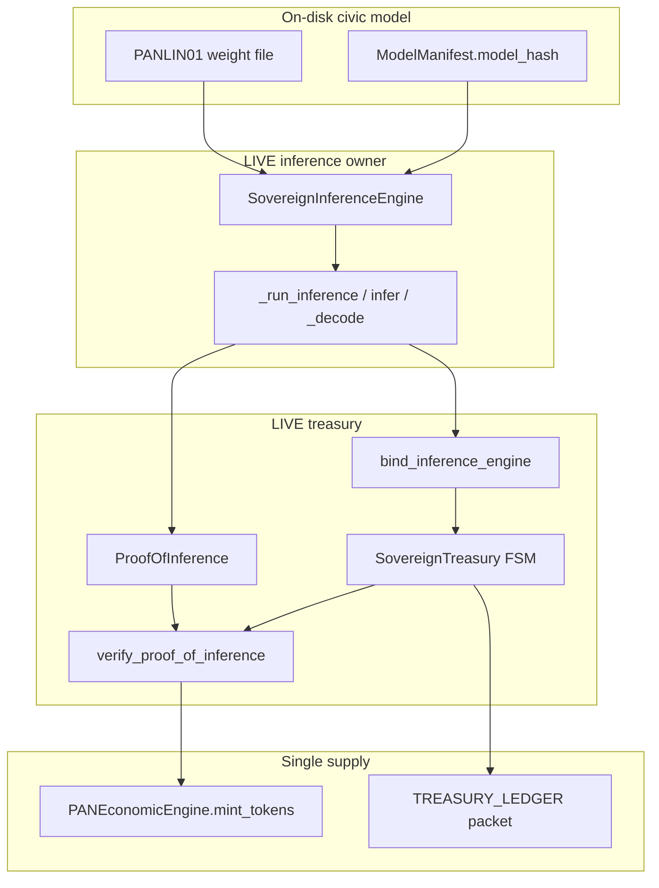
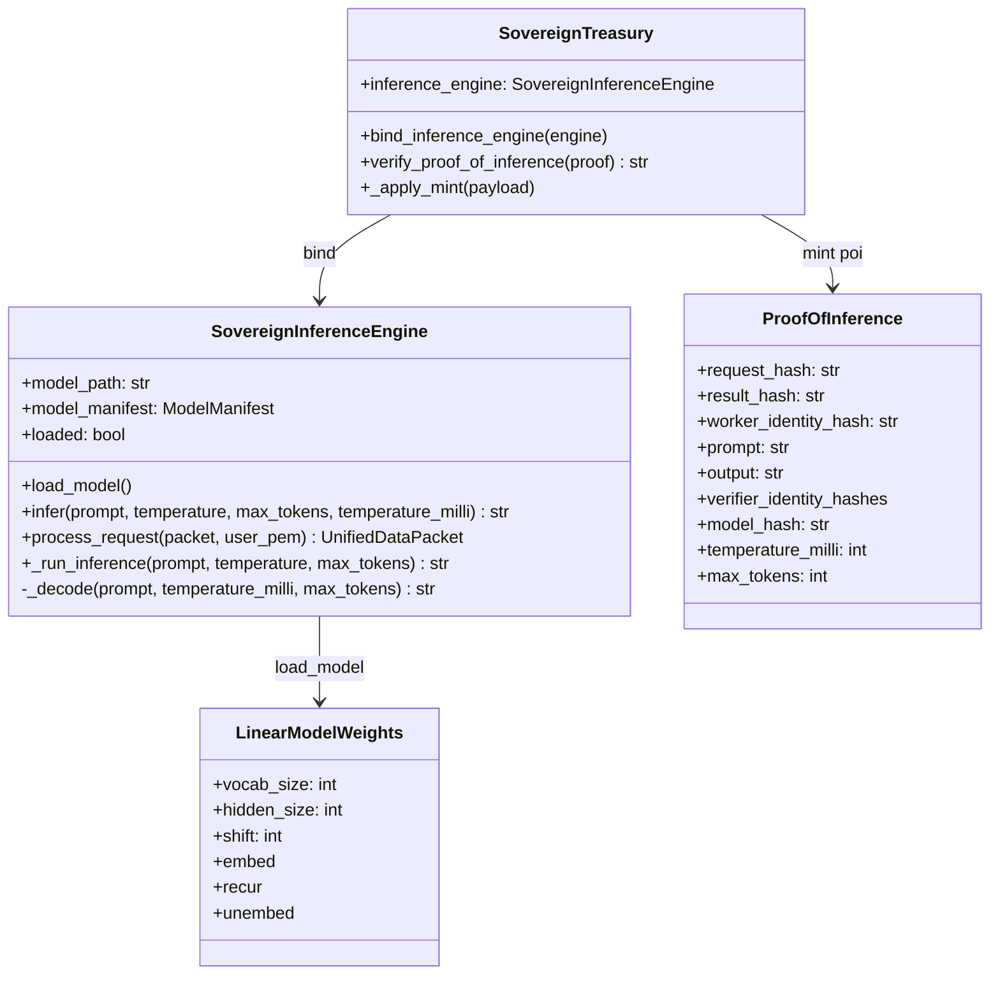
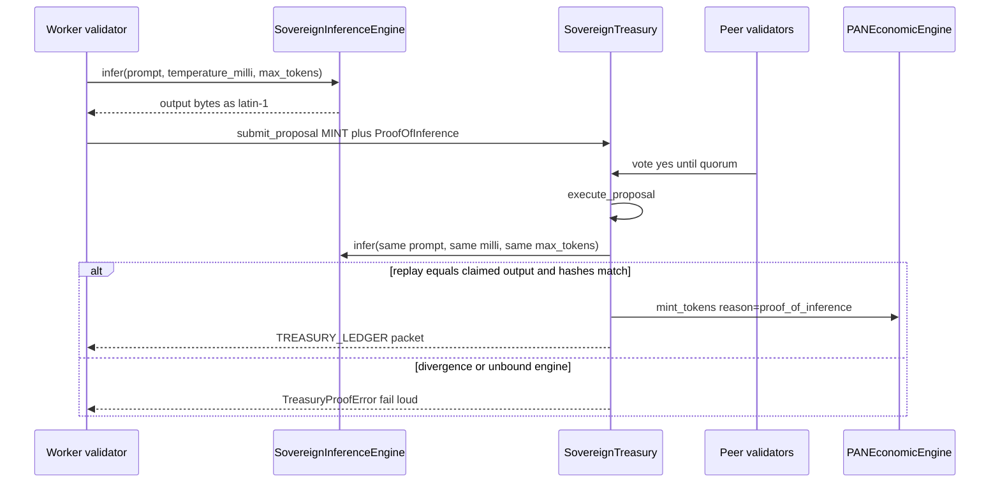
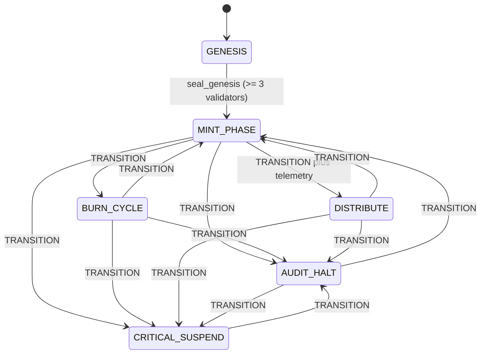

# PAN civic inference: PANLIN01 decoder and treasury Proof-of-Inference

```
DOCUMENT TITLE: PAN civic inference (SovereignInferenceEngine / Proof-of-Inference)
Classification: INTERNAL RESEARCH
Version: 1.0
Date: 2026-09-18
Author/Origin: PAN civic lane (operator workspace C:\Users\trent\pan)
Status: OPERATIONAL REFERENCE from live owners; last cited gate 2026-09-12
```

Civic inference in this repository is a deterministic integer decoder bound into the federal-reserve mint path. A validator loads the same `PANLIN01` bytes a worker loaded, re-runs the same owner, and only then may a `MINT` proposal credit `PANEconomicEngine`. It is not a chatbot, not a local LLM runtime, not Erebus cognition, and not a second microservice. This document maps the live wire, labels lineage and intent, and records what must not be inferred from names.

## 1. How to read this document

Three layers are kept separate. Collapsing them is an operational error.

| Layer | Meaning | Authority |
| --- | --- | --- |
| **LIVE** | Consumed Python owners, file magic, packet kinds, fail-loud types, and the last cited green artifacts | `PAN_SDK/PAN_SDK.py`, `PAN_SDK/treasury.py`, `test/inference/`, `test/treasury/`, `results/pan_gate_20260912_235357.json` |
| **LINEAGE** | Historical files, demo strings, and unconsumed subclasses that still compile | `PAN_SDK/API.server.py`, `PAN_SDK.py` `__main__` demo names, pre-v0.8 placeholder `_run_inference` |
| **INTENT** | Operator thesis and directional canon that is not a production package | `PLAN.md`, `docs/research/Building a Sovereign Digital Nation.md` §4.3 |

Erebus cognition (USMS Ed25519 DAG bound to PAN RSA packets) is a different civic-adjacent wire. Its dossier is `security/EREBUS_USMS_PAN_BIND.md`. Do not treat tower competition, threat bulletins, or prompt-shaped immune language as this decoder.

Concurrent working-tree consumer runs dated 2026-09-16 and 2026-09-17 exist on disk. They are **not** the cited provenance for this document. Until a newly accepted consumer artifact is recorded in `STATE.md`, cite the last proven treasury/gate pair in section 11.

## 2. Executive summary

PAN mints sovereign tokens only after a worker's claimed decode can be replayed locally. The replay owner is `SovereignInferenceEngine._run_inference`: an in-process integer linear decoder over on-disk `PANLIN01` weights. Treasury `verify_proof_of_inference` calls `infer()` on that same bound engine, demands bit-identical output, then requires `ceil(n/2)+1` validator attestations before `MINT` lands on `PANEconomicEngine`. The decoder emits latin-1 bytes from argmax over int16 logits. It does not host a language model, does not call a GPU runtime, and does not answer as a chat product.

## 3. Table of contents

1. How to read this document
2. Executive summary
3. Table of contents
4. Vocabulary
5. Live owner map
6. Technical specifications
7. Civic mint flow
8. Treasury FSM and mint gate
9. Packet surface
10. Failure modes
11. Validation (last proven)
12. LINEAGE (do not promote)
13. INTENT (operator thesis, remainder)
14. Security and threat considerations
15. Canon vs code
16. Explicitly refused architecture
17. Appendix A. Symbol and error registry
18. Appendix B. Change log

## 4. Vocabulary

| Term | Live meaning |
| --- | --- |
| **Civic inference** | In-process `PANLIN01` integer decode used as the Proof-of-Inference work unit |
| **PANLIN01** | Eight-byte file magic `b"PANLIN01"` plus int16 embed/recur/unembed matrices |
| **Owner** | `PAN_SDK.PAN_SDK.SovereignInferenceEngine._run_inference` |
| **Public replay entry** | `SovereignInferenceEngine.infer` (treasury validators call this) |
| **Proof-of-Inference (PoI)** | `PAN_SDK.treasury.ProofOfInference`: prompt, output, model_hash, milli-temperature, max_tokens, worker, verifier hashes |
| **Re-execution** | Local `infer()` on the bound engine; claimed output must equal replayed output |
| **Commitment** | `inference_commitment(prompt, output)`: SHA-256 of the canonical verified pair. Not a substitute for replay |
| **Fed FSM** | `PAN_SDK.treasury.SovereignTreasury` states `GENESIS` / `MINT_PHASE` / `BURN_CYCLE` / `DISTRIBUTE` / `AUDIT_HALT` / `CRITICAL_SUSPEND` |
| **Quorum** | `(n + 1) // 2 + 1` validators (`ceil(n/2)+1`). For three validators this is 3 |
| **Civic wire** | This decoder plus treasury mint. Not email/social, not highway, not Erebus, not Thyris |
| **ModelManifest** | Signed name + SHA-256 of the exact weight file. Load fails if file hash diverges |
| **Chatbot / LLM** | Not present as a consumed owner. Refused as a reading of this wire |

Import aliases (do not invert them):

```python
from PAN_SDK.PAN_SDK import SovereignInferenceEngine, write_linear_model, ModelManifest
from PAN_SDK.treasury import SovereignTreasury, ProofOfInference, build_proof
```

Package re-export: `from PAN_SDK import SovereignInferenceEngine` via `PAN_SDK/__init__.py`. Treasury is a sibling module, not a second engine.

## 5. Live owner map

Control moves from on-disk weights, through the decoder, into a mint payload, then onto the single economic ledger. There is one decoder class in the consumed path.



**Legend.** `DHTNode` constructs `SovereignTreasury` with identity, `PANPersistenceStore`, and `PANEconomicEngine`. It does **not** auto-bind an inference engine. Tests and civic scenarios call `bind_inference_engine` after writing a real `.panlin` file.



### 5.1 Ownership table

| Surface | Path / symbol | Role |
| --- | --- | --- |
| Decoder class | `PAN_SDK/PAN_SDK.py` `SovereignInferenceEngine` | Load, hash-check, decode, packet response |
| Named PoI owner | `SovereignInferenceEngine._run_inference` | Integer decode after temperature/max_tokens checks |
| Public replay | `SovereignInferenceEngine.infer` | Same `_decode`; treasury calls this |
| Weight writer | `write_linear_model` | Persist deterministic int16 matrices; return file SHA-256 |
| Weight reader | `_load_linear_model` | Reject non-`PANLIN01`, bad length, invalid header |
| Fed FSM | `PAN_SDK/treasury.py` `SovereignTreasury` | Bind engine, verify PoI, mint/burn/distribute |
| Proof type | `ProofOfInference` | Frozen commitment + verifier list |
| Proof builder | `build_proof` | Run `infer` unless a claimed `output` is supplied (forgery tests) |
| Commitment | `inference_commitment` | SHA-256 of canonical `{prompt, output}` after replay succeeds |
| Node bind | `DHTNode._initialize_registries` | Constructs treasury **without** an engine |
| Ledger | `PANEconomicEngine.mint_tokens(..., reason="proof_of_inference")` | Single supply. Treasury does not own a second ledger |
| Dedicated consumer | `test/inference/test_sovereign_inference.py` | Direct decoder checks. Not a `run_pan_gate.py` slice |
| Treasury consumer | `test/treasury/test_sovereign_treasury.py` | Gate slice `sovereign_treasury` |
| Civic walkthrough | `test/pan_sdk_system_scenario.py` `_bind_poi_engine` | Gate slice `system_scenario` |

### 5.2 What this wire is not

| Neighbor | Owner | Relation |
| --- | --- | --- |
| Erebus cognition | `security/planetary_immune_system.py` | Immune EVENT/BELIEF + RSA bulletins. Not decode, not mint |
| Highway | `security/planetary_highway.py` | Sealed itinerary. Not inference |
| Thyris | `telecom/phone_orchestrator.py` | Phones/relays. No in-device AI. ADB/`PhoneVMState.READY` is a later host-tool frontier |
| USMS | `memory/unified_memory_system.py` | Ed25519 memory DAG. Not PANLIN01 weights |
| Unconsumed API subclass | `PAN_SDK/API.server.py` `SovereignInferenceEngine` | Sleep-and-string. Not the owner (section 12) |

## 6. Technical specifications

All values below are from live constants and code paths in `PAN_SDK/PAN_SDK.py` and `PAN_SDK/treasury.py`. They are not product-marketing limits.

### 6.1 Decoder constants

| Symbol | Value | Meaning |
| --- | --- | --- |
| `PAN_LINEAR_MAGIC` | `b"PANLIN01"` | File identity; `_load_linear_model` rejects anything else |
| `PAN_LINEAR_VOCAB` | `256` | Token alphabet is a byte |
| `PAN_LINEAR_SHIFT` | `8` | Arithmetic right-shift after matvec-add |
| `PAN_LINEAR_CLAMP` | `32767` | Hidden state clamp to int16 range (symmetric negative clamp at `-32767`) |
| `PAN_LINEAR_DEFAULT_HIDDEN` | `8` | Default recurrent width for `write_linear_model` |
| `PAN_INFER_MAX_TOKENS` | `4096` | Hard cap on `max_tokens` |
| `PAN_TEMPERATURE_UNIT` | `1000` | Packet temperature `1.0` stores as `temperature_milli=1000` |

### 6.2 PANLIN01 on-disk layout

Byte order is big-endian. Weights are signed int16.

```
offset 0        8 bytes   magic = PANLIN01
offset 8        4 bytes   hidden_size  uint32
offset 12       4 bytes   shift        uint32
offset 16       ...       embed[vocab][hidden]     int16
              then        recur[hidden][hidden]    int16
              then        unembed[hidden][vocab]   int16
```

Expected length:

```
16 + 2 * (256 * H + H * H + H * 256)
```

`H` must be `>= 1`. `shift` must be `<= 31`. File SHA-256 must equal `ModelManifest.model_hash` or `load_model` raises `InferenceModelError`.

`write_linear_model(path, seed=..., hidden_size=8)` expands non-empty seed bytes through SHA-256 into int16 values in `[-127, 127]` (`digest[:2] % 255 - 127`). The same seed and hidden size always write the same file.

### 6.3 Decode algorithm (LIVE)

`_decode` is the shared body of `infer` and `_run_inference`.

1. Reject a non-string prompt. Require loaded `LinearModelWeights`.
2. Encode the prompt as UTF-8 bytes. Each byte indexes `embed`.
3. Hidden state starts at zeros of length `hidden_size`.
4. For each prompt byte: `hidden = quantize(matvec(recur, hidden) + embed[token], shift)`, then apply temperature.
5. For `max_tokens` steps: logits = `matvec(unembed, hidden)`; emit `argmax(logits)` (first index on ties); fold the emitted byte back through recur+embed; apply temperature.
6. Return `bytes(generated).decode("latin-1")`.

Temperature:

- `temperature_milli == 0`: hidden is unchanged (greedy, fully deterministic given weights and prompt).
- else: each hidden component becomes `value * 1000 // temperature_milli` (integer division).

`infer(..., temperature=float)` converts with `_temperature_milli` (`int(round(temperature * 1000))`). Treasury stores and replays **milli integers**, not floats. `process_request` converts packet `temperature` to milli, then calls `_run_inference(prompt, milli / 1000, tokens)`, which converts back. The inference consumer proves that path matches `infer`.

Illegal arguments fail loud (`InferenceError`): non-numeric or negative temperature, non-integer or out-of-range `max_tokens` (`< 1` or `> 4096`), boolean masquerading as int/float.

### 6.4 ProofOfInference fields

| Field | Type | Constraint |
| --- | --- | --- |
| `request_hash` | `str` | Must equal `sha256_hex(prompt)` |
| `result_hash` | `str` | Must equal `inference_commitment(prompt, output)` after replay |
| `worker_identity_hash` | `str` | Must be in `treasury.validators` |
| `prompt` | `str` | Canonical worker prompt |
| `output` | `str` | Must equal local `infer(...)` |
| `verifier_identity_hashes` | `tuple[str, ...]` | Each must be a validator; worker is skipped when counting independents |
| `model_hash` | `str` | Non-empty; must equal bound `engine.model_manifest.model_hash` |
| `temperature_milli` | `int` | `>= 0` |
| `max_tokens` | `int` | `>= 1` |

`from_mapping` rejects missing `model_hash` and non-integer milli/max_tokens.

### 6.5 Mint arithmetic (LIVE)

`_apply_mint` after successful PoI:

- `recipient_id` required, `amount >= 1`
- minted tokens = `amount * emission_rate` (default `emission_rate` is 1)
- `economic_engine.mint_tokens(recipient, minted, reason="proof_of_inference")`

A three-validator test mints `amount=40` to a balance of 40. That is the cited civic figure, not a network-wide emission policy.

## 7. Civic mint flow

Worker decode and validator replay are the same function on the same bytes. Hashing a claimed pair without replay is rejected (that was pre-v0.8 hash theater).



`build_proof(..., output=None)` runs the decoder. Passing `output="forged-commitment-output"` is how the treasury consumer proves mint cannot proceed on a lie: execute raises `TreasuryProofError("claimed output diverged from local re-execution")` and the ledger balance stays 0.

Verifier counting (LIVE):

- Independent verifiers exclude the worker and duplicates.
- `len(unique_verifiers) + 1 >= quorum_threshold()`
- `len(unique_verifiers) >= max(1, needed - 1)`
- Unbound engine: `TreasuryProofError("PoI requires a bound SovereignInferenceEngine")`

Proposal execute still needs the Fed quorum of votes. PoI verification is necessary for `MINT` apply; it does not replace voting.

## 8. Treasury FSM and mint gate



| Rule | Live behavior |
| --- | --- |
| Proposals before genesis | `TreasuryStateError` ("proposals are illegal before genesis is sealed") |
| `MINT` kind | Legal only in `MINT_PHASE` |
| `MINT` payload | Must contain a `poi` mapping; otherwise `TreasuryProofError("MINT requires a poi mapping")` |
| Smart-contract material | `reject_contract_payload` raises `TreasuryContractRejected` on keys such as `bytecode`, `solidity`, `wasm`, and on source hints |
| `DISTRIBUTE` | Requires sealed `NetworkTelemetry` with `inference_cycles >= 1` and `bandwidth_provisioned >= 1` |
| Genesis minimum | `GENESIS_VALIDATOR_MINIMUM = 3` |
| Quorum | `ceil(n/2)+1` as `(n + 1) // 2 + 1` |
| Persistence | FSM meta, validators, proposals, and `TREASURY_LEDGER` packets via `PANPersistenceStore` |

`DISTRIBUTE` telemetry's `inference_cycles` is a sealed integer gate. It is not a second decoder and does not re-run PANLIN01 by itself.

## 9. Packet surface

| Kind | Producer | Content that matters |
| --- | --- | --- |
| `INFERENCE_REQUEST` | `SovereignCommunicator.create_packet` | `prompt`, `temperature`, `max_tokens` |
| `INFERENCE_RESPONSE` | `SovereignInferenceEngine.process_request` | `response`, `model_name`, `model_hash`, `temperature_milli`, `max_tokens`, `processing_time_ms`; `parents` link the request |
| `TREASURY_LEDGER` | `SovereignTreasury` after execute | Proposal id, kind, state, payload digest |

`process_request` is the packet facade over the same owner. Civic mint does not require an `INFERENCE_REQUEST` packet; mint carries `ProofOfInference` inside the proposal payload.

Firewall, highway, and immune packet kinds are out of this document. See `security/EREBUS_USMS_PAN_BIND.md`.

## 10. Failure modes

| Condition | Type | Operator signal |
| --- | --- | --- |
| Missing weight file | `InferenceModelError` | `"model file is missing: ..."` |
| Magic or length mismatch | `InferenceModelError` | `"model file is not pan-sovereign-linear-v1"` or byte-length error |
| File hash ≠ manifest | `InferenceModelError` | `"model file hash diverged from ModelManifest.model_hash"` |
| Illegal decode args | `InferenceError` | temperature / max_tokens messages |
| No engine bound | `TreasuryProofError` | `"PoI requires a bound SovereignInferenceEngine"` |
| Bind load failure | `TreasuryProofError` | `"PoI engine failed to load: ..."` |
| Worker not a validator | `TreasuryProofError` | `"PoI worker is not a treasury validator"` |
| Prompt hash mismatch | `TreasuryProofError` | `"request_hash does not match the prompt"` |
| Model hash mismatch | `TreasuryProofError` | `"PoI model_hash does not match bound engine"` |
| Claimed output ≠ replay | `TreasuryProofError` | `"claimed output diverged from local re-execution"` |
| Commitment mismatch | `TreasuryProofError` | `"result_hash diverged from the verified prompt/output pair"` |
| Thin verifier set | `TreasuryProofError` | quorum messages |
| Contract smuggling | `TreasuryContractRejected` | forbidden key or material hint |
| Wrong FSM state | `TreasuryStateError` | kind/state illegal |

There is no silent fallback to a canned string on the consumed owner. The inference consumer explicitly rejects the old markers `"Simulated response to:"`, `"processed with proprietary quantization"`, and `"Enhanced response to:"`.

## 11. Validation (last proven)

Do not claim a later finish is done without a new artifact recorded as current in `STATE.md`. Working-tree runs from 2026-09-16 and 2026-09-17 are not cited here.

| Check | Command | Last proven artifact | Covers this wire |
| --- | --- | --- | --- |
| Project gate (Windows) | `python test/run_pan_gate.py` | `results/pan_gate_20260912_235357.json` (exit 0, 37.862s, Python 3.14 `.venv`) | Yes: slice `sovereign_treasury` 7/7 including PoI mint, forge reject, unbound fail |
| Treasury focused (inside that gate) | `python test/treasury/test_sovereign_treasury.py` | `test/treasury/runs/20260912_235428/` | Yes |
| Inference owner landing gate | `python3 test/run_pan_gate.py` | `results/pan_gate_20260911_085638.json` | Yes: first landed `_run_inference` |
| Civic PoI bind on combined tree | `python3 test/run_pan_gate.py` | `results/pan_gate_20260911_091651.json` | Yes: system scenario writes PANLIN01 and mints against real decode |
| Dedicated decoder consumer | `python test/inference/test_sovereign_inference.py` | `test/inference/runs/20260911_085511/` (7/7) | Yes: missing/mismatch/corrupt, bit-identical replay, prompt/temperature divergence, packet path, illegal args. **Not** a gate slice |
| Provenance snapshot | n/a | `snapshots/v0.8/manifest.json` | Yes: inference domain edit 2026-09-11 |

Treasury checks inside `20260912_235428` / gate JSON:

- `poi_mint_requires_quorum`: minted balance 40, `TREASURY_LEDGER` packet id recorded
- `poi_rejects_forged_output`: `"claimed output diverged from local re-execution"`
- `poi_unbound_engine_fails`: `"PoI requires a bound SovereignInferenceEngine"`

`PhoneVMState.READY` / ADB remain unproven and are not this wire. Erebus towers (`test/immune/runs/20260918_010347/`) are not proof of civic inference. The 2026-09-18 immune landing did not re-run `run_pan_gate.py`.

Reproduction (Windows operator workspace):

```text
python test/inference/test_sovereign_inference.py
python test/treasury/test_sovereign_treasury.py
python test/run_pan_gate.py
```

POSIX spelling is `python3`. A green syntax check is not a gate.

## 12. LINEAGE (do not promote)

| Path or name | What it is | How to treat it |
| --- | --- | --- |
| `PAN_SDK/API.server.py` class `SovereignInferenceEngine` | Subclass of the core engine. `load_model` sleeps and sets `loaded=True` without reading PANLIN01. `_run_inference_async` returns `"Enhanced response to: ... (processed with proprietary quantization v2.0)"` | Unconsumed. `STATE.md` names it as not the owner. Do not bind treasury to it |
| Pre-v0.8 `_run_inference` | Canned string placeholder. Windows gate `results/pan_gate_20260911_011502.json` still treated it as a placeholder | Historical evidence only |
| `PAN_SDK.py` `__main__` demo | Registers a string `"gemma3-4b-it.lacka"` then writes a temp `PANLIN01` via `write_linear_model` | Demo names are not a shipped Gemma/LLM. The executed path is PANLIN01 |
| Whitepaper `.lacka` inference folders | Canon now assigns `.lacka` to compression/DLP, not inference | INTENT/history, not this owner |
| `reference-code/` | Historical SDK lineage | Not imported by the decoder |

Do not document `API.server.py` as an async production inference service.

## 13. INTENT (operator thesis, remainder)

Whitepaper §4.3 (`docs/research/Building a Sovereign Digital Nation.md`): economic generation is Proof-of-Inference, not proof-of-work. Secondary nodes process a deterministic task; masters re-execute; a forged result diverges. Tokens mint as rewards for verified inference. The Fed Chair cannot unilaterally execute.

**What is LIVE relative to that paragraph:** local re-execution of `SovereignInferenceEngine`, `ceil(n/2)+1` vote execute, forge-loud mint refusal, `UnifiedDataPacket` treasury receipts.

**What remains INTENT / not shipped:**

- HadAgent-scale multi-host inference markets and "millions of verified cycles"
- A conversational model, agent-owned wallet, or "capitalist" fine-tune (`PLAN.md` narrative)
- Oracle / Orama dashboard visualization of inference intensity (whitepaper §6.2; `STATE.md` lists Orama as unlanded)
- `PAN_SDK/API.server.py` FastAPI as the civic inference front door
- Any local LLM/runtime (llama.cpp, torch, GGUF, Gemma weights) **not in this tree**

`PLAN.md` remains directional canon. It does not authorize inventing those missing packages beside the monolith.

## 14. Security and threat considerations

Trust model:

- Anyone with the weight file and the prompt can reproduce the output. Secrecy of the decode is not the security property. The security property is **equivalence**: a minter cannot claim a result the bound decoder does not emit.
- `ModelManifest` binds file SHA-256 to a creator RSA identity. Load refuses a swapped file.
- PoI worker and verifiers must already be treasury validators. Attestations from outside the set fail loud.
- Mint still requires proposal quorum. PoI is not a backdoor around the Fed.
- Turing-complete contract payloads are rejected at the proposal boundary.

Attack surface (this wire):

- Forged `output` on `ProofOfInference` (proven rejected)
- Unbound treasury mint (proven rejected)
- Hash-only commitment without replay (no longer sufficient; replay is mandatory)
- Binding the API.server subclass (would reintroduce canned strings; not a consumed path)
- Treating latin-1 argmax bytes as user-facing chat (misuse of the civic unit, not a code path)

This document does not contain secrets, exploit recipes, or external-service procedures. Offline-first does not authorize logging private keys.

Compliance notes: project-specific fail-loud contract and ROE isolation live under `security/`. Civic inference does not perform WAN egress.

## 15. Canon vs code

| Topic | Canon or header | Live code | How this document treats it |
| --- | --- | --- | --- |
| Proof-of-Inference | Whitepaper §4.3 deterministic re-execution | `verify_proof_of_inference` calls `infer` | LIVE |
| Quorum | Whitepaper `ceil(n/2)+1` | `(n + 1) // 2 + 1` | LIVE, same integer |
| "AI inference" | Whitepaper / PLAN conversational nation | PANLIN01 byte decoder, latin-1 output | LIVE is the integer owner; LLM remains INTENT |
| `.lacka` models | Early inference folders; later DLP/compression | Not loaded by `_run_inference` | Not this owner |
| Next action | Some packets still list `_run_inference` as future work | Owner landed snapshots/v0.8 | Document the landing; do not dummy the owner |
| `prompt_bridge` | AIPC leftover | Rejected in `ANTITHESIS.md`; unbound from Thyris | Not next work |
| qemu / Android READY | Thyris V1 phones | Installer boot proven; READY/ADB unproven | Later host-tool frontier, not this wire |
| API server | Whitepaper local API | Unconsumed sleep-and-string subclass | LINEAGE |

## 16. Explicitly refused architecture

The following were **not** written as production because they would invent a replacement architecture or a false runtime:

- A second inference engine, adapter package, or microservice beside `SovereignInferenceEngine`
- A local LLM/runtime (llama.cpp, torch, GGUF, Gemma, or any weights not produced by `write_linear_model`) as the PoI owner
- `core.prompt_bridge` / `PromptSystemBridge` as next work, phone AI, or decoder front-end
- Promoting `PAN_SDK/API.server.py` `_run_inference_async` to the civic owner
- Chat UX, agent wallet extraction, or Oracle lobby as the mint verifier
- Collapsing Erebus USMS cognition with this decoder
- Collapsing PAN RSA identity with USMS Ed25519 identity
- A second economic ledger owned by the decoder
- Reconnecting the public internet as an inference API
- Claiming `PhoneVMState.READY` from this document
- Expanding `master_db` whitepaper §6.2 vector spaces as inference memory
- Citing 2026-09-16 / 2026-09-17 working-tree runs as proven while `STATE.md` still points at the 2026-09-12 gate

## 17. Appendix A. Symbol and error registry

| Symbol | Module |
| --- | --- |
| `PAN_LINEAR_MAGIC` / `write_linear_model` / `_load_linear_model` | `PAN_SDK.PAN_SDK` |
| `LinearModelWeights` | `PAN_SDK.PAN_SDK` |
| `InferenceError` / `InferenceModelError` | `PAN_SDK.PAN_SDK` |
| `SovereignInferenceEngine` | `PAN_SDK.PAN_SDK` (consumed). `PAN_SDK.API.server` name is a subclass, not the owner |
| `ModelManifest` | `PAN_SDK.PAN_SDK` |
| `ProofOfInference` / `build_proof` / `inference_commitment` | `PAN_SDK.treasury` |
| `SovereignTreasury.bind_inference_engine` | `PAN_SDK.treasury` |
| `SovereignTreasury.verify_proof_of_inference` | `PAN_SDK.treasury` |
| `TreasuryProofError` / `TreasuryContractRejected` / `TreasuryStateError` | `PAN_SDK.treasury` |
| `TREASURY_PACKET_KIND` | `"TREASURY_LEDGER"` |
| `ProposalKind.MINT` | `PAN_SDK.treasury` |

Consumer commands:

| Job | Path |
| --- | --- |
| Decoder | `test/inference/test_sovereign_inference.py` |
| Fed + PoI | `test/treasury/test_sovereign_treasury.py` |
| Civic walkthrough | `test/pan_sdk_system_scenario.py` |
| Gate (includes treasury, not dedicated inference) | `test/run_pan_gate.py` |

## 18. Appendix B. Change log

| Version | Date | Change |
| --- | --- | --- |
| 1.0 | 2026-09-18 | Initial operational reference for the landed PANLIN01 civic wire and treasury PoI. Cites 2026-09-12 gate / 2026-09-11 inference artifacts. Does not rewrite `PLAN.md` or the Erebus dossier beyond a one-line pointer. |
