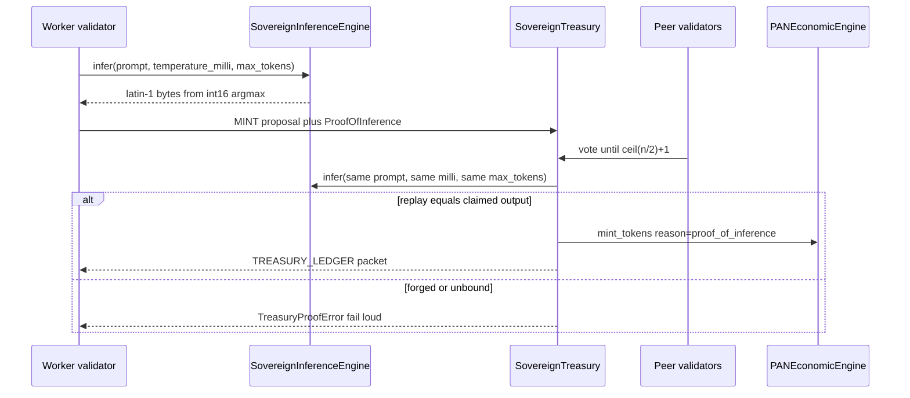

# Interior Dispatch of the Planetary Autonomous Network

```
DOCUMENT TITLE: Interior Dispatch of the Planetary Autonomous Network
Classification: INTERNAL RESEARCH (not published; not a public release)
Version: 1.0
Date: 2026-09-18
Author/Origin: PAN operator workspace (C:\Users\trent\pan)
Status: OPERATIONAL DISPATCH from live owners
Cited full gate: results/pan_gate_20260912_235357.json
Cited immune landing: test/immune/runs/20260918_010347/ (20/20)
```

## 1. Ninety seconds

We are not a startup changelog. We are a country that already runs.

The Planetary Autonomous Network is a production-grade, offline-first SQLite monolith: a sovereign digital-country substrate. It is not a web application, not a microservice estate, and not a cloud nation. Citizenship is cryptography. Money is replay. Memory is a signed DAG. The border is fail-closed. The old internet is not a peer; it is a refusal.

We mint only after a validator re-executes the same `PANLIN01` integer decode the worker ran. `SovereignInferenceEngine._run_inference` is that decoder: int16 matvec, argmax, latin-1 bytes. Treasury Proof-of-Inference calls the same math and rejects a forged output out loud. This is not a chatbot. This is not llama. This is deterministic nation-state mint.

The immune nation is Erebus. Four standing META towers (observe, deceive, degrade, neutralize) persist on the local USMS Ed25519 DAG, coherence-bound to a PAN RSA identity. They do not ride the mesh bulletin. `THREAT_MEMORY_BULLETIN` carries origin ROE, `neural_activation`, and `human_authorized` as a receipt. Neutralize without a human fails loud. RSA and Ed25519 stay two types. We bound them. We did not collapse them.

Thyris, the telecommunications arm, just spoke Android into serial. Official android-x86 9.0-r2 installer media booted through `qemu-system-x86_64 -nographic`. SeaBIOS. ISOLINUX 6.03. That is a phone factory coming online. It is not `PhoneVMState.READY`. It is not ADB userspace. Citizens are not carrying phones yet.

If you can hold only one sentence: **a lie does not become money, a tower does not become a packet, and a boot prompt does not become a phone.**

## 2. Contents

1. Ninety seconds
2. Contents
3. Seal of the nation (topology)
4. What is LIVE
5. Civic mint: PANLIN01 and Proof-of-Inference
6. Immune nation: Erebus, USMS, bulletin receipt
7. Packet border and sealed highway
8. Thyris: phone factory, not READY
9. Production doctor (instrumentation, not proof)
10. Evidence ledger
11. Owner tables
12. Security and threat posture
13. What this dispatch refuses
14. Next justified action
15. Vocabulary
16. Crowd cut (postable; unpublished)

## 3. Seal of the nation (topology)

The seal is a map, not a logo. The gold ring is the security-owned firewall. The four towers stand inside local USMS memory. They are omitted from the bulletin by protocol. Thyris sits outside the ring as host-tool frontier: installer boot proven, citizens not yet armed with phones.

If the seal does not render in your viewer, the table under it is the same topology in plain language.

<svg xmlns="http://www.w3.org/2000/svg" viewBox="0 0 960 560" role="img" aria-label="PAN sovereign topology: firewall ring, local Erebus towers, civic mint, sealed highway, Thyris factory outside READY">
  <defs>
    <linearGradient id="panVoid" x1="0" y1="0" x2="1" y2="1">
      <stop offset="0%" stop-color="#05070d"/>
      <stop offset="55%" stop-color="#0a1220"/>
      <stop offset="100%" stop-color="#071018"/>
    </linearGradient>
    <linearGradient id="panGold" x1="0" y1="0" x2="1" y2="1">
      <stop offset="0%" stop-color="#f0d48a"/>
      <stop offset="50%" stop-color="#c9a24a"/>
      <stop offset="100%" stop-color="#8a6a22"/>
    </linearGradient>
    <linearGradient id="panCyan" x1="0" y1="0" x2="0" y2="1">
      <stop offset="0%" stop-color="#9af0ff"/>
      <stop offset="100%" stop-color="#2aa7c9"/>
    </linearGradient>
    <filter id="panGlowGold" x="-40%" y="-40%" width="180%" height="180%">
      <feGaussianBlur in="SourceGraphic" stdDeviation="6" result="blur"/>
      <feMerge>
        <feMergeNode in="blur"/>
        <feMergeNode in="SourceGraphic"/>
      </feMerge>
    </filter>
    <filter id="panGlowCyan" x="-50%" y="-50%" width="200%" height="200%">
      <feGaussianBlur in="SourceGraphic" stdDeviation="5" result="blur"/>
      <feMerge>
        <feMergeNode in="blur"/>
        <feMergeNode in="SourceGraphic"/>
      </feMerge>
    </filter>
    <filter id="panGlowViolet" x="-50%" y="-50%" width="200%" height="200%">
      <feGaussianBlur in="SourceGraphic" stdDeviation="5" result="blur"/>
      <feMerge>
        <feMergeNode in="blur"/>
        <feMergeNode in="SourceGraphic"/>
      </feMerge>
    </filter>
    <filter id="panGlowAmber" x="-50%" y="-50%" width="200%" height="200%">
      <feGaussianBlur in="SourceGraphic" stdDeviation="5" result="blur"/>
      <feMerge>
        <feMergeNode in="blur"/>
        <feMergeNode in="SourceGraphic"/>
      </feMerge>
    </filter>
    <filter id="panGlowCrimson" x="-50%" y="-50%" width="200%" height="200%">
      <feGaussianBlur in="SourceGraphic" stdDeviation="5" result="blur"/>
      <feMerge>
        <feMergeNode in="blur"/>
        <feMergeNode in="SourceGraphic"/>
      </feMerge>
    </filter>
  </defs>
  <rect width="960" height="560" fill="url(#panVoid)"/>
  <text x="48" y="42" fill="#c9a24a" font-family="Georgia, 'Times New Roman', serif" font-size="13" letter-spacing="4">PLANETARY AUTONOMOUS NETWORK</text>
  <text x="48" y="64" fill="#7f8ea3" font-family="Segoe UI, Helvetica, sans-serif" font-size="11" letter-spacing="2">INTERIOR DISPATCH 2026-09-18  ·  OFFLINE-FIRST MONOLITH</text>

  <circle cx="430" cy="300" r="188" fill="none" stroke="url(#panGold)" stroke-width="3" filter="url(#panGlowGold)" opacity="0.95"/>
  <circle cx="430" cy="300" r="188" fill="none" stroke="#f0d48a" stroke-width="0.6" opacity="0.7"/>
  <text x="430" y="118" text-anchor="middle" fill="#c9a24a" font-family="Segoe UI, Helvetica, sans-serif" font-size="10" letter-spacing="2">SOVEREIGN FIREWALL  ·  FAIL-CLOSED BORDER</text>

  <rect x="352" y="248" width="156" height="78" rx="4" fill="#10182a" stroke="url(#panGold)" stroke-width="1.5"/>
  <text x="430" y="278" text-anchor="middle" fill="#f0d48a" font-family="Georgia, 'Times New Roman', serif" font-size="20" letter-spacing="3">PAN</text>
  <text x="430" y="298" text-anchor="middle" fill="#9eb0c7" font-family="Segoe UI, Helvetica, sans-serif" font-size="10">SQLITE MONOLITH</text>
  <text x="430" y="314" text-anchor="middle" fill="#6f829a" font-family="Segoe UI, Helvetica, sans-serif" font-size="9">identity · ledger · citizens</text>

  <rect x="376" y="338" width="108" height="36" rx="3" fill="#121a22" stroke="#c9a24a" stroke-width="1"/>
  <text x="430" y="353" text-anchor="middle" fill="#f0d48a" font-family="Segoe UI, Helvetica, sans-serif" font-size="9">CIVIC MINT</text>
  <text x="430" y="367" text-anchor="middle" fill="#9eb0c7" font-family="Segoe UI, Helvetica, sans-serif" font-size="8">PANLIN01  ·  PoI REPLAY</text>

  <g filter="url(#panGlowCyan)">
    <polygon points="430,168 446,192 430,216 414,192" fill="#14303a" stroke="#7ee7ff" stroke-width="1.6"/>
  </g>
  <text x="430" y="238" text-anchor="middle" fill="#7ee7ff" font-family="Segoe UI, Helvetica, sans-serif" font-size="9">OBSERVE</text>

  <g filter="url(#panGlowViolet)">
    <polygon points="568,300 592,316 568,332 544,316" fill="#231436" stroke="#c9a0ff" stroke-width="1.6"/>
  </g>
  <text x="630" y="320" fill="#c9a0ff" font-family="Segoe UI, Helvetica, sans-serif" font-size="9">DECEIVE</text>

  <g filter="url(#panGlowAmber)">
    <polygon points="430,384 446,408 430,432 414,408" fill="#2a220e" stroke="#ffc857" stroke-width="1.6"/>
  </g>
  <text x="430" y="452" text-anchor="middle" fill="#ffc857" font-family="Segoe UI, Helvetica, sans-serif" font-size="9">DEGRADE</text>

  <g filter="url(#panGlowCrimson)">
    <polygon points="292,300 316,316 292,332 268,316" fill="#2a1014" stroke="#ff6b73" stroke-width="1.6"/>
  </g>
  <text x="198" y="320" fill="#ff6b73" font-family="Segoe UI, Helvetica, sans-serif" font-size="9">NEUTRALIZE</text>

  <text x="430" y="478" text-anchor="middle" fill="#7f8ea3" font-family="Segoe UI, Helvetica, sans-serif" font-size="9">FOUR TOWERS: LOCAL USMS META  ·  NOT ON THE BULLETIN</text>

  <rect x="48" y="96" width="168" height="64" rx="4" fill="#10141c" stroke="#7ee7ff" stroke-width="1" filter="url(#panGlowCyan)"/>
  <text x="132" y="122" text-anchor="middle" fill="#7ee7ff" font-family="Segoe UI, Helvetica, sans-serif" font-size="10">PAN RSA IDENTITY</text>
  <text x="132" y="140" text-anchor="middle" fill="#9eb0c7" font-family="Segoe UI, Helvetica, sans-serif" font-size="9">SovereignIdentity · packets</text>

  <rect x="48" y="176" width="168" height="64" rx="4" fill="#10141c" stroke="#c9a0ff" stroke-width="1" filter="url(#panGlowViolet)"/>
  <text x="132" y="202" text-anchor="middle" fill="#c9a0ff" font-family="Segoe UI, Helvetica, sans-serif" font-size="10">USMS Ed25519 IDENTITY</text>
  <text x="132" y="220" text-anchor="middle" fill="#9eb0c7" font-family="Segoe UI, Helvetica, sans-serif" font-size="9">SovereignIdentity · DAG</text>

  <path d="M132 160 L132 176" stroke="#c9a24a" stroke-width="1.2"/>
  <text x="148" y="172" fill="#c9a24a" font-family="Segoe UI, Helvetica, sans-serif" font-size="8">BOUND · NOT MERGED</text>

  <rect x="700" y="86" width="212" height="86" rx="4" fill="#10141c" stroke="#9eb0c7" stroke-width="1"/>
  <text x="806" y="112" text-anchor="middle" fill="#9eb0c7" font-family="Segoe UI, Helvetica, sans-serif" font-size="10">HIGHWAY</text>
  <text x="806" y="132" text-anchor="middle" fill="#c9a24a" font-family="Segoe UI, Helvetica, sans-serif" font-size="11">SEALED CARGO</text>
  <text x="806" y="150" text-anchor="middle" fill="#6f829a" font-family="Segoe UI, Helvetica, sans-serif" font-size="9">not a second internet</text>

  <rect x="700" y="200" width="212" height="86" rx="4" fill="#10141c" stroke="#c9a24a" stroke-width="1"/>
  <text x="806" y="226" text-anchor="middle" fill="#c9a24a" font-family="Segoe UI, Helvetica, sans-serif" font-size="10">BULLETIN RECEIPT</text>
  <text x="806" y="246" text-anchor="middle" fill="#9eb0c7" font-family="Segoe UI, Helvetica, sans-serif" font-size="9">ROE · neural_activation</text>
  <text x="806" y="262" text-anchor="middle" fill="#9eb0c7" font-family="Segoe UI, Helvetica, sans-serif" font-size="9">human_authorized</text>

  <rect x="700" y="360" width="212" height="120" rx="4" fill="#0c1018" stroke="#6f829a" stroke-width="1" stroke-dasharray="6 4"/>
  <text x="806" y="390" text-anchor="middle" fill="#9eb0c7" font-family="Segoe UI, Helvetica, sans-serif" font-size="10">THYRIS FACTORY</text>
  <text x="806" y="412" text-anchor="middle" fill="#f0d48a" font-family="Georgia, 'Times New Roman', serif" font-size="13">SeaBIOS · ISOLINUX</text>
  <text x="806" y="434" text-anchor="middle" fill="#6f829a" font-family="Segoe UI, Helvetica, sans-serif" font-size="9">android-x86 9.0-r2 installer</text>
  <text x="806" y="454" text-anchor="middle" fill="#ff6b73" font-family="Segoe UI, Helvetica, sans-serif" font-size="10">NOT PhoneVMState.READY</text>

  <text x="48" y="530" fill="#5c6b7e" font-family="Segoe UI, Helvetica, sans-serif" font-size="10">WAN SMTP / webhook / feeds / whois / deauth: fail loud on purpose. Public internet is not a peer.</text>
</svg>

| Zone | What it is | What it is not |
| --- | --- | --- |
| Gold ring | `security/sovereign_firewall.py`, fail-closed inspection | A public ISP, a Kubernetes ingress, a second internet |
| Center monolith | `PAN_SDK/PAN_SDK.py` plus nation pillars on one SQLite climate | Microservices, a generic web app, a cloud control plane |
| Civic mint | PANLIN01 integer decoder bound into `SovereignTreasury` PoI | A local LLM, llama, torch, a chatbot |
| Four towers | Local USMS META nodes `observe/deceive/degrade/neutralize` | Fields on `THREAT_MEMORY_BULLETIN` |
| Two identity seals | PAN RSA and USMS Ed25519, bound under one `runtime_root` | One collapsed key class |
| Highway | Sealed USMS cargo on `UnifiedDataPacket` hops | Host:port consciousness, public sockets |
| Dashed Thyris | qemu-img disk-create + ISOLINUX installer boot on this Windows host | `PhoneVMState.READY`, ADB userspace, citizens with phones |

## 4. What is LIVE

Directional canon remains [PLAN.md](../PLAN.md) and [Building a Sovereign Digital Nation](research/Building%20a%20Sovereign%20Digital%20Nation.md). Live truth is [STATE.md](../STATE.md). This dispatch does not replace either. It reports what already runs.

| Pillar | Owner | LIVE behavior |
| --- | --- | --- |
| Nation substrate | `PAN_SDK/PAN_SDK.py` | Identity, ledger, citizens, economy, governance, persistence. Offline-first SQLite. |
| Civic mint | `SovereignInferenceEngine._run_inference` | PANLIN01 int16 decoder. See [CIVIC_INFERENCE_POI.md](CIVIC_INFERENCE_POI.md). |
| Federal reserve | `PAN_SDK/treasury.py` | FSM. PoI re-execution. Quorum execute. Contract payloads rejected. |
| Mail / social | `PAN_SDK/email_social.py` | Nostr-inspired sealed mail. Blind relays. Identity hash is the address. |
| National store | `PAN_SDK/master_db.py` | Offline-first CRDT pool on `PANPersistenceStore`. No second sqlite engine. |
| Immune cognition | `security/planetary_immune_system.py` | Erebus. USMS EVENT/BELIEF to RSA bulletins. Four local towers. |
| Immune memory | `memory/unified_memory_system.py` | Signed Ed25519 DAG. Not Thyris VM RAM. |
| Packet border | `security/sovereign_firewall.py` | Security-owned. Fail-closed. WAN egress types fail loud. |
| Highway | `security/planetary_highway.py` | `HIGHWAY_EMBARK` / `HOP` / `ARRIVE` / `LOCATE`. Destination-sealed cargo. |
| Thyris telecom | `telecom/phone_orchestrator.py` | Disk-create landed. Installer boot proven. READY/ADB unproven. |
| Thyris VM memory | `memory/memory_core.py`, `memory/system_cache.py` | Coexists with USMS. Not the immune DAG. |

We did not invent a second package to look like a country. The country is the monolith.

## 5. Civic mint: PANLIN01 and Proof-of-Inference

Whitepaper §4.3 said economic generation would be Proof-of-Inference, not proof-of-work. That wire is LIVE.

A worker loads on-disk weights whose file magic is `PANLIN01`. Hidden state is int16. Each step is matvec plus a shift, then argmax over logits. The decoder emits latin-1 bytes. Treasury binds that same engine and, on `MINT`, calls `infer()` again. If the claimed output diverges, execute raises `TreasuryProofError("claimed output diverged from local re-execution")` and the ledger stays at zero. Hash theater without replay is dead. A three-validator civic check mints amount 40 to balance 40 after quorum.



| Spec | Live value |
| --- | --- |
| Magic | `b"PANLIN01"` |
| Vocab | 256 (one byte) |
| Default hidden | 8 |
| Arithmetic | int16 matvec, shift 8, clamp 32767 |
| Decode owner | `SovereignInferenceEngine._run_inference` |
| Replay entry | `SovereignInferenceEngine.infer` |
| Quorum | `(n + 1) // 2 + 1` |
| Genesis minimum | 3 validators |
| Turing-complete contracts | `TreasuryContractRejected` at the proposal boundary |
| Last cited PoI gate slice | `results/pan_gate_20260912_235357.json` (`sovereign_treasury` 7/7) |

We minted a country that can refuse counterfeit thought. That is the spectacle. There is no GPU runtime in this owner. `PAN_SDK/API.server.py` still contains an unconsumed sleep-and-string subclass. It is not the mint. Do not bind the Fed to it.

## 6. Immune nation: Erebus, USMS, bulletin receipt

Erebus is not a prompt layer and not a phone. Erebus is `security/planetary_immune_system.py` binding a local USMS brain to PAN packets.

On construct we write two identities under one `runtime_root`, then four standing META towers with ids `observe`, `deceive`, `degrade`, `neutralize`, each `COHERENCE_BOUND` to the identity META. Activation is cosine-weighted pull on a 12-dim MTL hash `semantic_vector`, not a trained neural-net package. Softmax competition (temperature 0.35) writes a local competition META parented to the BELIEF and the four towers. `neutralize_executable` is true only when the winning tower is neutralize **and** a human authorized it. That is a local receipt. It does not open a host socket.

`THREAT_MEMORY_BULLETIN` is dual-signed (Ed25519 on the canonical body, RSA on the `UnifiedDataPacket`). Signed cognition on the packet is origin `roe_level`, `neural_activation`, the four ROE flags, and `human_authorized`. `winning_tower` and `tower_allocations` stay local. Peers re-compete on ingest. `peer_ingests_bulletin` fails if `tower_allocations` appears on packet content. We did not invent towers-on-the-bulletin.

L4 without a human raises `ImmuneSystemError`. Lineage SMTP, webhook, threat-feed, whois, and WiFi deauth methods raise `LegacyInternetEgressError` before a socket. On main: `5a4d753` (towers bound to USMS, bulletin ROE kept as receipt) and merge `08ae4f9`. Immune consumer **20/20** at `test/immune/runs/20260918_010347/`, including `erebus_towers_bind_usms` and `erebus_tower_competition_cosine_field` (first activation 0.90 degrade, second cosine-pulled 0.62 deceive; L4 still fail-loud). Snapshot `snapshots/v0.14/manifest.json`. The project gate was **not** re-run for that landing.

Dossier: [EREBUS_USMS_PAN_BIND.md](../security/EREBUS_USMS_PAN_BIND.md).

| On the signed bulletin | Local USMS only |
| --- | --- |
| `roe_level` | `winning_tower` |
| `neural_activation` | `tower_allocations` |
| `roe_observe` / `roe_deceive` / `roe_degrade` / `roe_neutralize` | tower META node ids |
| `human_authorized` | competition META node id |

## 7. Packet border and sealed highway

Security owns the border. PAN packets do not construct their own `SovereignFirewall` as a civic convenience object on `DHTNode`. Email/social is constructed with an explicit firewall because an extra sqlite handle on every node leaked Windows TemporaryDirectory cleanup. Relays stay blind.

Highway kinds are `HIGHWAY_EMBARK`, `HIGHWAY_HOP`, `HIGHWAY_ARRIVE`, `HIGHWAY_LOCATE`. Cargo is RSA-sealed to the destination identity. Intermediate hops forward the envelope and cannot decrypt. Tracker names still cannot ride a hop: highway performs a second inspect on `EGRESS_LEGACY`. This is identity-hash travel on the existing fabric. It is not a public-internet socket plane.

WAN isolation is a feature, not a missing integration. SMTP alerts, HTTP webhooks, external threat feeds, whois, and RF deauth fail loud on purpose. Reconnecting the public internet is a rejected transition ([ANTITHESIS.md](../ANTITHESIS.md)).

## 8. Thyris: phone factory, not READY

Thyris is telecommunications. Phones do not contain in-device AI. `core.prompt_bridge` is rejected, unbound, and is not next work.

What roared, and what did not:

| Claim | Status | Evidence |
| --- | --- | --- |
| `ISOConverter._create_disk` writes qcow2 via real `qemu-img` | LIVE | `ba05cf4`; gate slice `thyris_vm.qemu_img_disk_create` on hosts that have the tool |
| android-x86 9.0-r2 installer boot on `-nographic` | LIVE on this Windows host | SeaBIOS plus ISOLINUX 6.03 on stdout. ISO gitignored. SHA-1 `1cc85b5ed7c830ff71aecf8405c7281a9c995aa0` matched. Not in `run_pan_gate.py`. |
| `PhoneVMState.READY` | UNPROVEN | READY is gated on real ADB userspace |
| ADB `adb shell` as a citizen phone | UNPROVEN | Next Thyris unit |
| In-device AI / prompt bridge | REJECTED | Phones are phones |

We heard the factory speak. We did not hand out handsets.

## 9. Production doctor (instrumentation, not proof)

We instrumented the country with its own production doctor: an AST scan from the Windows `.venv` (`run id 20260918T073343Z`, 57 files). That scan is a linter climate, not a READY proof and not a scandal. Nation status remains the consumed owners and the cited consumers, not a production-score integer.

## 10. Evidence ledger

Do not cite a later finish without a new artifact in `STATE.md`. Working-tree runs that are not recorded as current are not this dispatch.

| What | Command | Artifact | Covers |
| --- | --- | --- | --- |
| Last verified **full** project gate | `python test/run_pan_gate.py` | `results/pan_gate_20260912_235357.json` (Windows Python 3.14 `.venv`, exit 0, 37.862s) | Treasury PoI, highway, immune-as-of-that-day, email_social, master_db, thyris_memory, thyris_vm slices |
| Erebus towers on USMS | `python test/immune/test_planetary_immune_system.py` | `test/immune/runs/20260918_010347/` (20/20) | Towers + cosine field. **Not** a 2026-09-18 full gate |
| Highway 10/10 | `python test/highway/test_planetary_highway.py` | `test/highway/runs/20260912_235119/` | Sealed itinerary |
| Civic inference landing | `python3 test/run_pan_gate.py` | `results/pan_gate_20260911_085638.json` | First landed `_run_inference` |
| Android installer boot | `python test/thyris_vm/test_thyris_android_boot.py` | `test/thyris_vm/runs/20260912_043438/` (Windows); `20260912_094201/` (Linux TCG) | ISOLINUX, not READY |

`snapshots/v0.14` records the Erebus-tower landing. This dispatch does not treat `snapshots/v0.15` as green READY. `phone_ready` and `adb_proven` stayed false in every cited run.

## 11. Owner tables

### 11.1 Consumed production surface

| Surface | Path | Role |
| --- | --- | --- |
| Monolith | `PAN_SDK/PAN_SDK.py` | Civic identity (RSA), packets, DHT, economic engine, inference owner |
| Fed | `PAN_SDK/treasury.py` | `SovereignTreasury`, `ProofOfInference`, `verify_proof_of_inference` |
| Overlay mail | `PAN_SDK/email_social.py` | `StatelessRelay`, seal, `reject_legacy_routing` |
| CRDT pool | `PAN_SDK/master_db.py` | Joins `PANPersistenceStore` |
| USMS | `memory/unified_memory_system.py` | Ed25519 EVENT/BELIEF/META DAG |
| Erebus | `security/planetary_immune_system.py` | Bind, towers, bulletins, L4 fail-loud |
| Border | `security/sovereign_firewall.py` | `InspectionLane`, `LegacyInternetEgressError` |
| Highway | `security/planetary_highway.py` | Sealed itinerary |
| Phone orchestration | `telecom/phone_orchestrator.py` | Thyris V1; ISOLINUX boot; READY owner is ADB |
| Image / disk | `telecom/vm_image_manager.py` | `ISOConverter._create_disk` |
| VM supervisor | `telecom/vm_supervisor.py` | `VMSupervisor`, `VMState`, `ResourceProfile` |

### 11.2 Dedicated consumers (direct Python, not pytest)

| Job | Path |
| --- | --- |
| Project gate | `test/run_pan_gate.py` |
| Immune | `test/immune/test_planetary_immune_system.py` |
| Highway | `test/highway/test_planetary_highway.py` |
| Treasury | `test/treasury/test_sovereign_treasury.py` |
| Inference (not a gate slice) | `test/inference/test_sovereign_inference.py` |
| Email/social | `test/email_social/test_email_social.py` |
| Master DB | `test/master_db/test_master_db.py` |
| Thyris VM | `test/thyris_vm/test_thyris_vm.py` |
| Android boot (ISO local) | `test/thyris_vm/test_thyris_android_boot.py` |

### 11.3 LINEAGE (present, not promoted)

| Path | How to treat it |
| --- | --- |
| `PAN_SDK/API.server.py` `SovereignInferenceEngine` | Sleep-and-string subclass. Not the PoI owner |
| `security/defensive_sovereignty.py`, `reactive_offense.py`, `defensive_offensive_bridge.py` | Compile/import lineage. Combat memory writes through the immune owner. WAN methods exist to fail loud |
| `memory/memory_integration.py` | Unconsumed AIPC leftover; imports absent `schemas.session`. Not a Thyris blocker |
| `reference-code/` | Historical lineage. Not imported runtime |
| Whitepaper §6.2 Orama / vector spaces | Unlanded civic surface |

## 12. Security and threat posture

Trust model:

- Local process with `runtime_root` authors USMS nodes as Ed25519 and packets as RSA.
- Mint security is **equivalence**, not secrecy of the decode. Anyone with the weight file can reproduce the output. A minter cannot claim a result the bound decoder does not emit.
- Tower allocations are local cognition. A peer must re-compete. Origin allocations are not on the packet, so they cannot be trusted from the mesh.
- Relays are blind. Highway hops cannot open destination-sealed cargo.
- Operator blocklist is PAN `identity_hash` on the firewall ledger.
- Human authorization is mandatory for neutralize receipts. External-host L4 is not implemented and not authorized by the immune landing.

Offline-first does not authorize logging, committing, or transmitting keys. Identity files under `runtime_root/identities/` are key material.

This document contains no exploit recipes, recon procedures, or WAN bypasses.

## 13. What this dispatch refuses

The following would be a lie, a rejected architecture, or both. We did not write them as victory.

- `PhoneVMState.READY`, proven ADB userspace, or "phones work"
- A local LLM, llama, torch, GGUF, Gemma-as-runtime, or `core.prompt_bridge`
- In-device AI on Thyris phones
- Identity collapse: one `SovereignIdentity` class for RSA and Ed25519
- `winning_tower` / `tower_allocations` as shipped bulletin fields
- Public internet reconnect, SMTP/webhook/feed/whois/RF as live actions
- Highway as a second internet
- A 2026-09-18 full `run_pan_gate.py` (last verified full gate remains 2026-09-12)
- `snapshots/v0.15` as green READY
- Microservices, Kubernetes, a cloud nation
- Doctor issue counts as either scandal or certification
- Whitepaper Oracle/Orama dashboard as a shipped capital

Rejected transitions live in [ANTITHESIS.md](../ANTITHESIS.md).

## 14. Next justified action

ADB userspace / `PhoneVMState.READY` on a real Android guest.

Do not dummy READY from ISOLINUX. Do not pull prompt files. Do not construct `BlockchainThreatIntelligence`. Do not invent mesh-strand / `usms_linkage`. Do not reconnect the public internet. Do not open a second civic wire. Do not expand `master_db` whitepaper §6.2.

## 15. Vocabulary

| Term | Live meaning |
| --- | --- |
| Country / nation | This monolith and its consumed pillars, not a legal filing and not a public website |
| Civic inference | PANLIN01 integer decode used as the PoI work unit |
| Erebus | Planetary immune owner binding USMS to PAN packets |
| Tower | Standing local USMS META node in ROE order |
| Bulletin | `THREAT_MEMORY_BULLETIN` dual-signed receipt; no tower allocations |
| Highway | Sealed packet fabric; not cognition |
| Thyris | Telecommunications VMs as phones/relays |
| Bind | Two identity types persist together and co-sign |
| Collapse | Pretend the two identity types are one key. Rejected |
| Fail loud | Raise a domain error. No silent fallback, no mock green |

## 16. Crowd cut (postable; unpublished)

This block is also [NATION_DISPATCH_SHORT.md](NATION_DISPATCH_SHORT.md). It has not been posted to X, Twitter, GitHub, or anywhere else.

PAN is a digital country, not a website: an offline-first SQLite monolith with a fail-closed packet border. We mint tokens only after validators re-execute the same PANLIN01 integer decode the worker ran; a forged output is rejected out loud. Erebus, the immune nation, stands as four local towers on a signed Ed25519 memory DAG bound to RSA packets, and neutralize without a human fails loud. Threat bulletins carry origin ROE, neural activation, and human authorization as a receipt; tower allocations stay home. The highway is sealed cargo, not a second internet; WAN SMTP, webhooks, and feeds fail on purpose. Thyris just spoke Android through SeaBIOS into serial: a phone factory coming online, not citizens carrying phones. We did not reconnect the old internet, and we did not collapse identity. The nation is already minting, remembering, and refusing.
