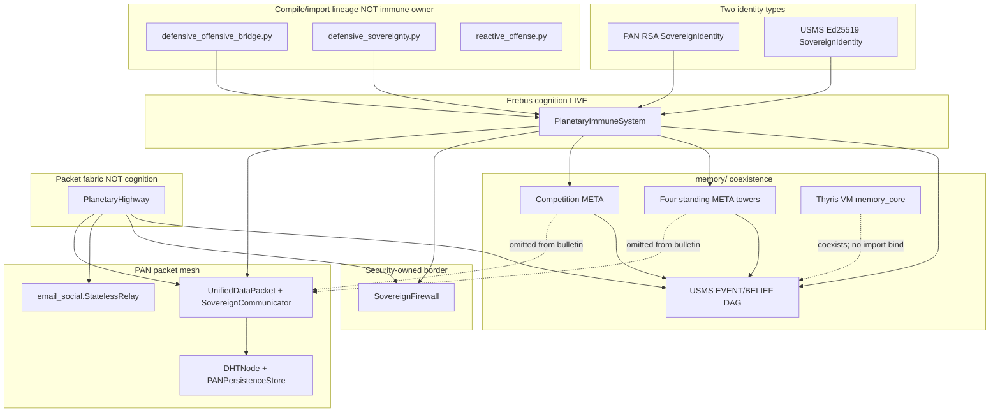
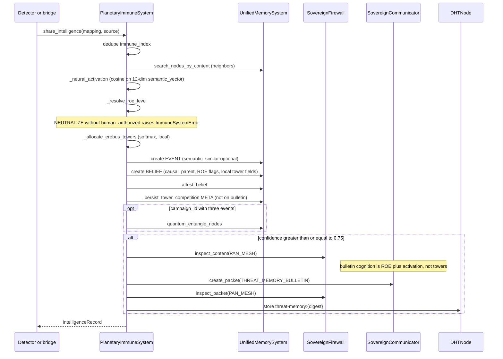

# Erebus / USMS / PAN bind

```
DOCUMENT TITLE: Erebus cognition bind (USMS Ed25519 DAG to PAN RSA packets)
Classification: INTERNAL RESEARCH / DEFENSIVE OPERATIONS
Version: 1.2
Date: 2026-09-18
Author/Origin: PAN security lane (operator workspace C:\Users\trent\pan)
Status: OPERATIONAL REFERENCE from live owners; immune towers consumer-verified 2026-09-18; project gate not re-run
```

Erebus in this repository is the planetary immune owner: a local USMS brain that writes EVENT/BELIEF nodes, then (when confidence is high) ships those beliefs as RSA-signed PAN packets. Four standing ROE towers and softmax competition live on that same USMS DAG. They do not ride the bulletin. It is not a phone, not a prompt layer, not a second internet, and not a neural-network package. PAN RSA identity and USMS Ed25519 identity stay two types. This document maps the live bind, labels lineage and intent, and records what must not be inferred from names.

## 1. How to read this document

Three layers are kept separate. Collapsing them is an operational error.

| Layer | Meaning | Authority |
| --- | --- | --- |
| **LIVE** | Consumed Python owners, import aliases, packet kinds, fail-loud types, and the last green consumer artifacts | Source plus `test/immune/` and `test/highway/` |
| **LINEAGE** | Historical files, module headers, and USMS-internal names that still compile or still describe ancestors | `reference-code/`, lineage security modules, USMS docstrings |
| **INTENT** | Operator thesis and directional canon that is not a production package | `PLAN.md`, `docs/research/Building a Sovereign Digital Nation.md`, this document's intent section |

Formal ROE text is `rules_of_engagement.md`. Live combat memory and escalation receipts are `planetary_immune_system.py`. When those two disagree, the code is what runs; the ROE remains policy. Do not treat policy language as an implemented WAN or RF capability.

This document does not contain secrets, exploit recipes, offensive procedures, or recon how-tos. WAN isolation is documented as fail-loud refusal, not as a bypass.

Immune towers are LIVE on `security/planetary_immune_system.py` and proven by `test/immune/runs/20260918_010347/` (20/20). The project gate was not re-run for this landing. Do not cite `results/pan_gate_20260912_235357.json` as proof of towers. Highway evidence in section 11 remains the prior highway consumer, not this change.

## 2. Vocabulary

| Term | Live meaning |
| --- | --- |
| **Erebus cognition** | `security.planetary_immune_system.PlanetaryImmuneSystem` binding USMS EVENT/BELIEF to PAN `UnifiedDataPacket` / DHT |
| **USMS** | `memory.unified_memory_system.UnifiedMemorySystem`: signed Ed25519 memory DAG |
| **PAN RSA identity** | `PAN_SDK.PAN_SDK.SovereignIdentity`: 2048-bit RSA, `identity_hash`, mesh address `pan:id:<identity_hash>` |
| **USMS Ed25519 identity** | `memory.unified_memory_system.SovereignIdentity`: `agent_id`, Ed25519 `public_key` / `_private_key` |
| **Bind** | Persist both identities under one `runtime_root`, write a USMS META node that names the pair, sign bulletins with both |
| **Collapse** | Treat the two `SovereignIdentity` classes as one type or one key. Rejected (`ANTITHESIS.md`) |
| **Packet fabric / highway** | `security.planetary_highway.PlanetaryHighway`: sealed USMS cargo on identity-hash hops. Not cognition |
| **Firewall / border** | `security.sovereign_firewall.SovereignFirewall`: fail-closed inspection + SQLite ledger |
| **Combat memory** | USMS EVENT/BELIEF (and CONTRADICTION-linked failure EVENTs). Not RAM dictionaries |
| **ROE receipt** | BELIEF content flags `roe_observe` / `roe_deceive` / `roe_degrade` / `roe_neutralize`. Not an external-host action |
| **Erebus towers** | Four standing USMS META nodes (`observe` / `deceive` / `degrade` / `neutralize`) created by `_ensure_erebus_towers`. Local USMS only |
| **Tower competition** | Softmax allocation META from `_allocate_erebus_towers` / `_persist_tower_competition`. Parent BELIEF plus the four towers. Local USMS only |
| **Bulletin cognition** | Signed `THREAT_MEMORY_BULLETIN` fields: origin `roe_level`, `neural_activation`, ROE flags, `human_authorized`. Not `winning_tower` / `tower_allocations` |
| **Thyris** | Telecommunications: VM phones/relays under `telecom/`. Not Erebus |
| **Thyris VM memory** | `memory.memory_core` / `memory.system_cache`. Coexists with USMS. Not the immune DAG |

Import aliases in the immune owner (do not invert them):

```python
from PAN_SDK.PAN_SDK import SovereignIdentity as PANSovereignIdentity
from memory.unified_memory_system import SovereignIdentity as MemorySovereignIdentity
```

## 3. Live owner map



Solid arrows are consumed constructor or call binds. Dashed edges from towers/competition to the packet mesh mark a protocol omission: those META nodes stay local. The dashed Thyris-memory edge is coexistence only: no immune import.

| Surface | Symbol | Role | Proven consumer |
| --- | --- | --- | --- |
| `security/planetary_immune_system.py` | `PlanetaryImmuneSystem`, `_ensure_erebus_towers`, `_allocate_erebus_towers` | Erebus cognition. EVENT/BELIEF, local towers, local competition, `THREAT_MEMORY_BULLETIN` without tower allocations | `test/immune/test_planetary_immune_system.py` (20/20, `20260918_010347`) |
| `memory/unified_memory_system.py` | `UnifiedMemorySystem`, `NodeKindEnum`, `LinkageTypeEnum` | Local signed DAG. Immune substrate | Immune tests construct a real sqlite file |
| `PAN_SDK/PAN_SDK.py` | `SovereignIdentity`, `UnifiedDataPacket`, `SovereignCommunicator`, `DHTNode`, `PANPersistenceStore` | RSA civic identity, packet, DHT store/lookup | Immune + highway |
| `security/sovereign_firewall.py` | `SovereignFirewall`, `InspectionLane`, `LegacyInternetEgressError`, `THREAT_BULLETIN_KIND` | Fail-closed border and shared WAN fail-loud type | Immune + highway |
| `security/planetary_highway.py` | `PlanetaryHighway`, `HIGHWAY_*` | Sealed itinerary. Uses USMS as cargo, not as threat cognition | `test/highway/test_planetary_highway.py` |
| `PAN_SDK/email_social.py` | `StatelessRelay`, `seal_plaintext`, `reject_legacy_routing` | Blind relays and hybrid RSA-OAEP + AES-GCM seal used by highway | Highway |
| `security/defensive_offensive_bridge.py` | `DefensiveOffensiveBridge`, `ThreatIntelligenceCoordinator` | Lineage integrator. Writes combat memory through the immune owner | Immune (`roe_ladder_persists_through_bridge`) |
| `security/defensive_sovereignty.py` | `ThreatDetectionModule`, `NetworkThreatMonitor`, retired `BlockchainThreatIntelligence` | Lineage detector/coordinator. SMTP/webhook/feeds fail loud | Immune WAN checks |
| `security/reactive_offense.py` | `ROELevel` (lineage enum), whois/deauth methods | Lineage ROE coordinator. WAN/RF fail loud | Immune WAN checks |

`ThreatIntelligenceCoordinator` is an empty subclass of `PlanetaryImmuneSystem`. It is not a second immune store. `DefensiveOffensiveBridge` either takes a bound `PlanetaryImmuneSystem` or constructs that subclass from `runtime_root`.

`BlockchainThreatIntelligence` construction raises `SecondCombatChainRetiredError`. Do not construct it.

## 4. Identity bind (LIVE)

`PlanetaryImmuneSystem.__init__` requires a `runtime_root`. It loads or creates two identities, opens three persistence handles, and writes the bind once.

| Handle | Path under `runtime_root` | Cryptography |
| --- | --- | --- |
| PAN identity file | `identities/pan_identity.json` | RSA PEM |
| USMS identity file | `identities/usms_identity.json` | Ed25519 hex |
| USMS DAG | `usms/unified_sovereign_memory.db` | Ed25519 node signatures |
| Firewall ledger | `firewall/ledger.sqlite` | Inspection verdicts |
| PAN persistence / DHT | `pan/` via `PANPersistenceStore` | Packet index, `immune_index`, `immune_meta`, `immune_towers` |

`_write_identity_binding` creates a USMS `NodeKindEnum.META` node whose content records `pan_identity_hash`, `pan_name`, `usms_agent_id`, `usms_agent_name`, and `usms_public_key`, with note `Ed25519 memory author bound to RSA PAN packet author`. The META node id is stored at persistence component `immune_meta` / key `identity_binding`. The pair is never merged into one class.

> Identity files under `runtime_root/identities/` contain key material. Do not log, print, commit, or transmit them. Use existing runtime isolation. This document does not describe key extraction.

### 4.1 Standing Erebus towers (LIVE, local USMS)

`__init__` calls `_ensure_erebus_towers` after the identity META. There is no new package. Owner remains `security/planetary_immune_system.py`.

Four standing META nodes, ids `EREBUS_TOWER_IDS = ROE_ORDER`:

| Tower id | Node kind | Link to identity META |
| --- | --- | --- |
| `observe` | `NodeKindEnum.META` | `LinkageTypeEnum.COHERENCE_BOUND` when identity binding exists |
| `deceive` | `NodeKindEnum.META` | same |
| `degrade` | `NodeKindEnum.META` | same |
| `neutralize` | `NodeKindEnum.META` | same |

Content on each tower: `tower_id`, `tower_kind: "erebus_cognitive_tower"`, `roe_level` equal to the tower id, equal initial `allocation` `0.25`. Recovery: persistence `immune_meta` / `erebus_towers` (`node_ids` map). Public lookup: `list_erebus_towers()`.

`_neural_activation(confidence, similar, query_text=threat_type)` is cosine-weighted DAG pull, not a trained net:

- Query vector: `_mtl_semantic_vector` SHA-512 hash embed, `TOWER_SEMANTIC_DIMS = 12` (same MTL-style placeholder USMS stores on `UnifiedMemoryNode.semantic_vector`).
- Neighbor pull: `confidence * cosine` when cosine `>= TOWER_COSINE_FLOOR` (`0.15`). Anti-correlated neighbors contribute `0`.
- Mix: `min(1.0, confidence * 0.7 + mean(pulls) * 0.3)`. No neighbors: clamped confidence.

`_allocate_erebus_towers(activation)` softmax-allocates across the four towers from activation proximity to `TOWER_FITNESS_PEAKS` plus prior `immune_towers` / `latest`. Temperature `TOWER_ALLOCATION_TEMPERATURE = 0.35`. Returns `(allocations, winning_tower)`.

`_persist_tower_competition` writes a META with `tower_kind: "erebus_tower_competition"`, parents `[belief_node_id, *tower_ids]`, `COHERENCE_BOUND` to the BELIEF and `SYNTHESIS` to the four towers. Fields include `neural_field`, `allocations`, `winning_tower`. `neutralize_executable` is true only when `winning_tower == neutralize` **and** `human_authorized`. This is a local receipt, not an external-host action.

Local BELIEF content also stores `tower_allocations` and `winning_tower`. `IntelligenceRecord` carries those plus `tower_competition_node_id`. That is local USMS / PAN persistence index, not the mesh packet.

Bulletin dual-sign (LIVE):

1. USMS signs the canonical bulletin body (`_bulletin_signed_body`) with Ed25519 (`usms_signature` + `usms_pubkey`).
2. `SovereignCommunicator.create_packet` signs the `UnifiedDataPacket` with PAN RSA. Metadata carries `pan_public_key_pem` and `usms_author_id`.
3. `ingest_bulletin` verifies firewall PAN_MESH, content hash, RSA signature, then Ed25519 signature. Failure is `BulletinVerificationError`.

Highway dual-sign (LIVE, not cognition): cargo nodes keep USMS signatures; cargo digest is Ed25519-signed by the origin USMS identity; the hop envelope is RSA-signed; cargo bytes are RSA-sealed to the **destination** PAN public key. Intermediate hops forward the envelope and cannot open cargo.

## 5. Packet path (LIVE)

### 5.1 Immune share: detection to mesh



`share_intelligence` is the consumed write API. High-confidence threshold default is `HIGH_CONFIDENCE_THRESHOLD = 0.75`. DHT keys are `threat-memory:{digest}` and `threat-memory:latest`. Ingest does **not** re-broadcast. Ingest copies bulletin cognition onto a local BELIEF, then **re-competes locally** via `_allocate_erebus_towers` / `_persist_tower_competition` using the ingested `neural_activation`. Ingest competition is persisted with `human_authorized=False`. Peers do not receive origin `winning_tower` / `tower_allocations`.

That omission is a protocol choice. `_bulletin_cognition_fields` / `_bulletin_signed_body` do not include those keys. `peer_ingests_bulletin` fails if `tower_allocations` appears on packet content.

Signed bulletin cognition (Fletcher receipt on the packet):

| Field | On `THREAT_MEMORY_BULLETIN` |
| --- | --- |
| `roe_level` | Yes |
| `neural_activation` | Yes |
| `roe_observe` / `roe_deceive` / `roe_degrade` / `roe_neutralize` | Yes |
| `human_authorized` | Yes |
| `winning_tower` | No |
| `tower_allocations` | No |
| tower META node ids / competition node id | No |

Local BELIEF / index fields written on share:

| Field | Where |
| --- | --- |
| `roe_observe` | Always on a share BELIEF |
| `roe_deceive` | Resolved level in {deceive, degrade, neutralize} |
| `roe_degrade` | Resolved level in {degrade, neutralize} |
| `roe_neutralize` | Resolved level is neutralize **and** `human_authorized` |
| `neural_activation` | Cosine-weighted score from `_neural_activation` |
| `tower_allocations` / `winning_tower` | Local BELIEF and `IntelligenceRecord` only |
| `explicit_roe_decision` | Only `record_roe_decision` |

Activation mapping in `_resolve_roe_level` (unless an explicit `roe_level` is supplied): observe default; deceive at `>= 0.40`; degrade at `>= 0.75`; neutralize at `>= 0.95` but only with `human_authorized`. Explicit neutralize without that flag fails loud. No level opens a host socket.

`record_countermeasure_failure` writes an EVENT linked with `LinkageTypeEnum.CONTRADICTION` to the authorizing BELIEF.

### 5.2 Firewall lanes

`InspectionLane.PAN_MESH` is assigned by `_lane_for_packet` when `packet.kind == "THREAT_MEMORY_BULLETIN"` or `kind.startswith("HIGHWAY_")`. All other kinds default to `EGRESS_LEGACY`.

On every lane the border still blocks: legacy routing keys (`next_hop`, `isp_route`, `default_gateway`, `carrier_msisdn`, `imsi`, `iccid`, `legacy_ip_route`), identity blocklist, content-hash mismatch, and sensitive plaintext on an already-signed packet.

Telemetry dictionary/regex and legacy IPv4 routing fields are applied when the lane is **not** `PAN_MESH`. Highway therefore performs a **second** inspect on `EGRESS_LEGACY` (`_refuse_tracker_payload` / `_refuse_tracker_packet`) so tracker names still cannot ride a hop envelope. Immune bulletins use `PAN_MESH` only. That difference is live behavior, not an implied defect report.

Unknown packet kinds stay `EGRESS_LEGACY`.

### 5.3 Highway itinerary (not Erebus)

Kinds: `HIGHWAY_EMBARK`, `HIGHWAY_HOP`, `HIGHWAY_ARRIVE`, `HIGHWAY_LOCATE`. Optional DHT index prefix `highway:travel:`. Relays are `StatelessRelay` instances; `SovereignFirewall` is a required constructor argument and is never constructed on `DHTNode`.

Cargo refuses private-key fields. `reject_legacy_routing` from email_social is applied to hop content. This is identity-hash travel on the existing fabric. It is not a public-internet socket plane and not immune cognition.

## 6. Fail-loud WAN isolation (LIVE)

Lineage coordinators still contain historical WAN/RF method names. The owning methods raise `security.sovereign_firewall.LegacyInternetEgressError` before a host socket. The immune owner never calls them.

This 1.1 tower revision does not re-assert WAN isolation or L4 as a new landing and does not re-run the project gate. The table is the isolation contract still present in the immune consumer. It is not proof of section 4.1.

| Lineage method family | Owner file | Isolation contract |
| --- | --- | --- |
| SMTP alert | `defensive_sovereignty.py` | `LegacyInternetEgressError` (`smtp_alert_fails_loud`) |
| HTTP webhook | `defensive_sovereignty.py` | `LegacyInternetEgressError` (`webhook_alert_fails_loud`) |
| External threat-feed fetch | `defensive_sovereignty.py` | `LegacyInternetEgressError` (`threat_feed_fetch_fails_loud`) |
| whois / internet recon | `reactive_offense.py` | `LegacyInternetEgressError` (`whois_fails_loud`) |
| WiFi deauth / RF neutralize | `reactive_offense.py` | `LegacyInternetEgressError` (`wifi_deauth_fails_loud`) |
| Simulated L4 authorization | `defensive_offensive_bridge.py` | refused (`bridge_refuses_simulated_authorization`) |
| L4 without human | `planetary_immune_system.py` | `ImmuneSystemError` (`neutralize_requires_human_authorization`) |

ROE Level 4 against external hosts is **not implemented** by the immune landing and is **not authorized** by it. A human-authorized neutralize is a USMS BELIEF receipt only.

## 7. What Erebus is not

| Claim | Status | Live fact |
| --- | --- | --- |
| Thyris / phone VM AI | Not Erebus | `telecom/` does not import the immune or highway owners. Phones have no in-device AI |
| `core.prompt_bridge` / `PromptSystemBridge` | Rejected | Unbound from Thyris. Immune and USMS do not name it |
| AIPC session memory | Leftover, not a blocker | `memory/memory_integration.py` imports absent `schemas.session` |
| Thyris VM memory | Different owner | `memory.memory_core` / `memory.system_cache` |
| Second internet / ISP reconnect | Rejected | Highway is packet fabric. WAN methods fail loud |
| Microservice / `somnus_erebus/` tree | Rejected | Stale QWEN layout is not this repository |
| `memory_system` package | Rejected | Do not wrap USMS to look like `MemoryManager` |
| RAM threat dictionaries | Rejected combat memory | `BlockchainThreatIntelligence` is retired |
| Trained neural-net package | Rejected | `_neural_activation` is 12-dim MTL hash cosine on USMS `semantic_vector` |
| Towers as a second package | Rejected | Four META towers live on `planetary_immune_system.py`. No new package |
| Towers on the mesh bulletin | Not shipped | `winning_tower` / `tower_allocations` are local USMS. Protocol omits them |
| Orama / whitepaper §6.2 vector spaces | Unlanded civic surface | Not this bind |
| Civic inference / Proof-of-Inference | Not Erebus | `PAN_SDK.PAN_SDK.SovereignInferenceEngine` PANLIN01 decoder and `PAN_SDK.treasury` PoI mint. See `docs/CIVIC_INFERENCE_POI.md` |

## 8. LINEAGE (do not promote)

Historical DAG/blockchain and MTL prototypes live under `reference-code/` and are **not imported** by the immune owner:

| Path | What it is |
| --- | --- |
| `reference-code/mtl.py` | Mycelial Temporal Lattice prototype: EVENT/BELIEF DAG, belief anchoring |
| `reference-code/unified_dag_blockchain.py` | Combined MTL / SCL / NMCA DAG-blockchain sketch |
| `reference-code/PAN_SDK_v2.py` | Historical PAN SDK lineage |

USMS module docstring still describes a merge of MTL, NMCA (Neural Memory Controller Architecture), and SCL. Those names are **inside** `memory/unified_memory_system.py` (node fields such as `semantic_vector`, `frequency_usage`, `quantum_state`; `quantum_entangle_nodes`). They are not a second production package. The same file's provenance header still cites `modules/unified_memory_system.py` and `tests/test_usms_security_integrity.py`. Live path is `memory/unified_memory_system.py`; live consumer is `test/immune/`. That path string is leftover provenance, not a second layout.

Security lineage headers still say "Somnus Erebus Tower":

- `security/defensive_offensive_bridge.py`
- `security/reactive_offense.py`

Those headers are lineage naming. Standing USMS META towers are LIVE at the immune owner (section 4.1). They are not a `somnus_erebus/` package and not a second neural runtime.

`defensive_sovereignty.py` still contains RAM `neural_competition` resource-allocation methods. Those remain lineage. They are not `_neural_activation`, not `_allocate_erebus_towers`, and not a trained model owner.

`ThreatCorrelationEngine` in the bridge keeps in-process correlation queues. Combat memory remains `share_intelligence` → USMS. Do not treat the RAM correlator as the substrate.

`rules_of_engagement.md` still describes family-IoT, SMTP, feeds, whois, RF, and physical-security actions as authorized ladder steps, plus an illustrative `ROEEngine` sketch. Live implementation is the narrower receipt-and-mesh bind in sections 5 and 6. Do not execute ROE text as if those WAN actions were landed.

## 9. INTENT (operator thesis, remainder)

Operator thesis, recorded as intent where not yet a package:

1. PAN's blockchain lineage (reference-code DAG / packet ledger) is the civic mesh ancestor.
2. USMS shares that DAG-and-belief lineage (MTL/SCL/NMCA merged into one Ed25519 memory owner).
3. Erebus cognition attaches to USMS so PAN memory can behave as a **network of signed memory graphs**, not as a chat prompt.

LIVE attachment (section 4.1), not a hoped-for package:

- Four standing ROE META towers, COHERENCE_BOUND to the PAN/USMS identity META.
- Cosine-weighted `_neural_activation` on 12-dim MTL hash `semantic_vector`.
- Local softmax competition META parented to the BELIEF and the four towers.
- USMS semantic search and `SEMANTIC_SIMILAR` / `SYNTHESIS` / `CAUSAL_PARENT` / `CONTRADICTION` / `COHERENCE_BOUND` links.
- Optional `quantum_entangle_nodes` when a `campaign_id` accumulates three EVENT ids. Software clustering (`enable_quantum_features=True` on immune construct), not a quantum processor.

Still INTENT / not shipped:

- Putting `winning_tower` / `tower_allocations` on `THREAT_MEMORY_BULLETIN` (peers re-compete locally by design).
- A standalone towers or neural-network package beside the immune owner.
- mesh-strand / `usms_linkage` invention, or prompt-shaped cognition.

Canon (`PLAN.md`, whitepaper) remains north-star for the digital nation (packets, firewall border, Thyris telecom, treasury). It does not authorize inventing those missing packages beside the monolith.

## 10. Security, ROE, and compartmentalization

Read before modifying this lane: `AGENTS.md` (this folder) and `rules_of_engagement.md`. Parent packet: `../AGENTS.md`. Anti-drift: `../ANTITHESIS.md`.

| ROE level | Policy name | Live immune behavior |
| --- | --- | --- |
| 1 | OBSERVE | BELIEF flag; standing local tower META `observe` |
| 2 | DECEIVE | BELIEF flag from activation or explicit request; local tower META `deceive` |
| 3 | DEGRADE | BELIEF flag; bridge may also request a mesh identity block through the firewall. Not WAN degradation |
| 4 | NEUTRALIZE | Human authorization mandatory. Fail loud otherwise. Local tower META exists; no external-host action |

Trust model:

- Local process with `runtime_root` can create nodes as the bound USMS identity and packets as the bound PAN identity.
- Tower allocations are local cognition. A peer must re-compete on ingest. Origin allocations are not on the packet, so they cannot be trusted from the mesh.
- Peers ingest bulletins only after firewall + RSA + Ed25519 checks.
- Relays are blind. Highway hops cannot decrypt destination-sealed cargo.
- Operator blocklist is PAN `identity_hash` on the firewall ledger.

Do not document offensive tooling, packet-injection recipes, or recon procedures. Lineage method names exist so isolation can be proven by calling them and catching `LegacyInternetEgressError`.

## 11. Validation (last proven)

Do not claim a later finish is done without a new artifact. Do not cite the 2026-09-12 project gate as proof of towers.

| Check | Command | Last proven artifact | Covers this landing |
| --- | --- | --- | --- |
| Immune 20/20 | `python test/immune/test_planetary_immune_system.py` | `test/immune/runs/20260918_010347/` | Yes: towers + cosine field |
| Immune 18/18 (pre-tower checks) | same consumer | `test/immune/runs/20260918_010257/` | Fletcher receipt on bulletin; no tower checks yet |
| Highway 10/10 | `python test/highway/test_planetary_highway.py` | `test/highway/runs/20260912_235119/` | No |
| Project gate | `python test/run_pan_gate.py` | **not re-run** for this landing | No |

Tower checks in `20260918_010347`: `erebus_towers_bind_usms` (`check_erebus_towers_bind_usms`), `erebus_tower_competition_cosine_field` (`check_erebus_tower_competition_cosine_field`). `peer_ingests_bulletin` also requires local peer competition and fails if `tower_allocations` is on the packet.

`PhoneVMState.READY` / ADB remain unproven and are not this document's surface. This revision does not re-claim WAN, L4, or gate.

## 12. Canon vs code (factual tensions)

| Topic | Canon or header | Live code | How this document treats it |
| --- | --- | --- | --- |
| Erebus location | Lineage headers: "Somnus Erebus Tower" | `planetary_immune_system.py` | LIVE owner is the immune file |
| Identities | Whitepaper speaks of one `SovereignIdentity` civic hash | Two classes, RSA vs Ed25519 | Bind, do not collapse |
| ROE WAN/RF/physical | `rules_of_engagement.md` ladder text | Fail-loud `LegacyInternetEgressError`; L4 is a receipt | Policy vs implementation |
| Firewall ownership | Whitepaper: extract firewall into monoliths | Security-owned `sovereign_firewall.py`, consumed by PAN packets | LIVE: security owns the border |
| USMS path | USMS provenance `modules/unified_memory_system.py` | `memory/unified_memory_system.py` | Leftover provenance string |
| Neural / NMCA / towers | Lineage headers and RAM `neural_competition`; operator network-network thesis | Four META towers + cosine activation on the immune owner; bulletin omits allocations | LIVE local; not a package; not on the mesh |
| Thyris READY phones | Whitepaper V1/V2 phone fleet | Installer boot proven; READY/ADB unproven | Out of Erebus scope; not claimed |
| API.py / sdk_adapter.shims | Whitepaper §1 | Not the immune bind; not documented here as Erebus | Refused as replacement architecture |

## 13. Explicitly refused architecture

The following were **not** written as production because they would invent a replacement architecture:

- A standalone Erebus/neural/towers package attached beside USMS
- `winning_tower` / `tower_allocations` as shipped bulletin fields
- Prompt-bridge cognition for phones or for the immune owner
- Highway as a public internet, UDP mesh, or host:port consciousness plane
- Collapsed RSA+Ed25519 identity
- Reconnected SMTP, feeds, whois, or RF neutralization
- `memory_system` wrapping USMS as Thyris `MemoryManager`
- Whitepaper API shims as the security lane
- Any hoped-for Orama/vector-memory civic dashboard as immune memory

## Appendix A. Glossary of packet kinds and errors

| Kind / type | Owner |
| --- | --- |
| `THREAT_MEMORY_BULLETIN` | `sovereign_firewall.THREAT_BULLETIN_KIND`; created by immune `_broadcast_belief`; cognition via `_bulletin_signed_body` (no tower allocations) |
| `ErebusTowerCompetition` | immune owner; local USMS META only |
| `HIGHWAY_EMBARK` / `HIGHWAY_HOP` / `HIGHWAY_ARRIVE` / `HIGHWAY_LOCATE` | `planetary_highway.py` |
| `ImmuneSystemError` / `ImmuneSystemNotBoundError` / `BulletinVerificationError` | immune owner |
| `FirewallInspectionError` / `LegacyInternetEgressError` | firewall |
| `HighwayFirewallError` / `HighwayCargoError` / `HighwayRouteError` | highway |
| `SecondCombatChainRetiredError` | `defensive_sovereignty.py` |
| `SovereignIdentityError` / `MemoryIntegrityError` | USMS |

## Appendix B. Change log

| Version | Date | Change |
| --- | --- | --- |
| 1.0 | 2026-09-18 | Initial bind dossier from live owners |
| 1.1 | 2026-09-18 | Standing USMS META towers and local softmax competition moved to LIVE. Bulletin still omits `winning_tower` / `tower_allocations`. Immune 20/20 `20260918_010347`. Project gate not re-run |
| 1.2 | 2026-09-18 | One-line pointer: civic inference is not Erebus; see `docs/CIVIC_INFERENCE_POI.md` |
